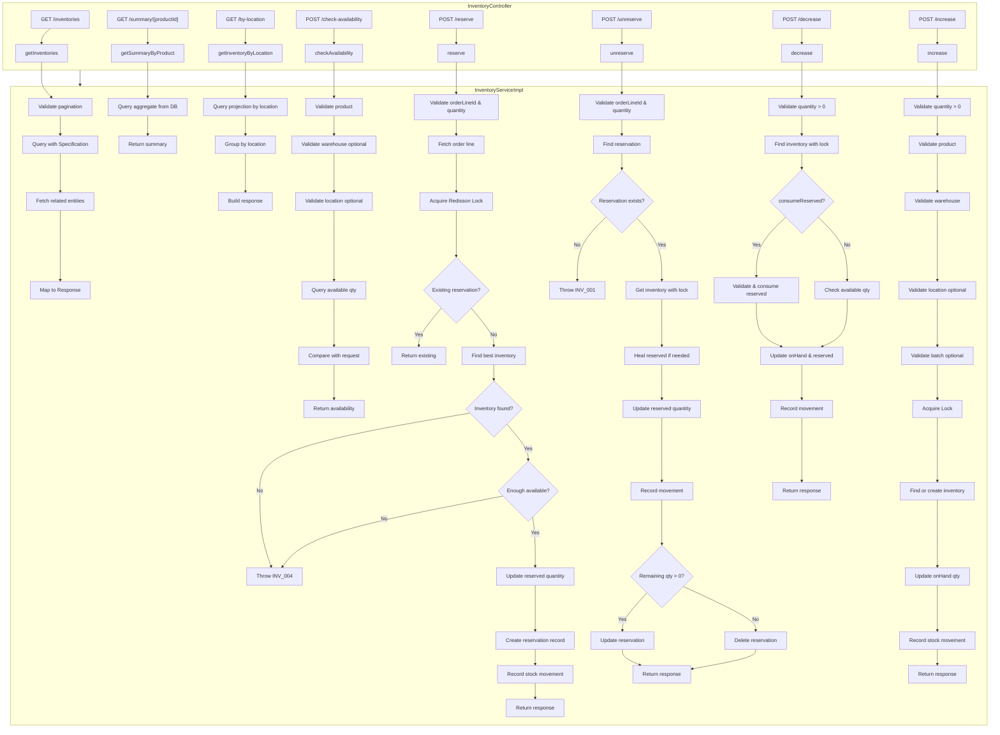
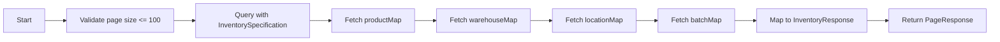
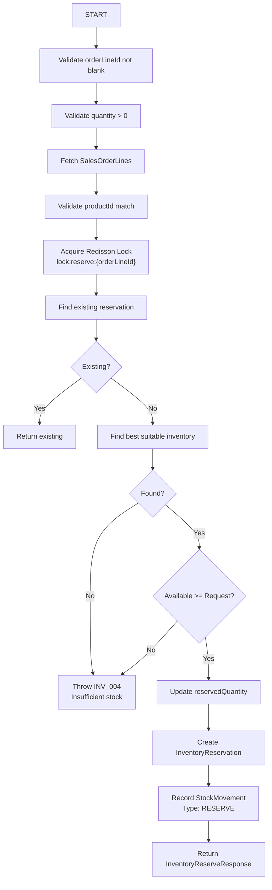
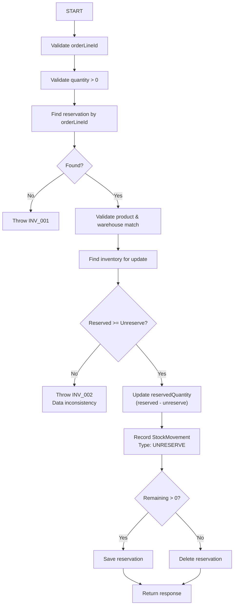
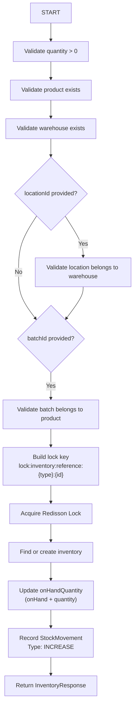
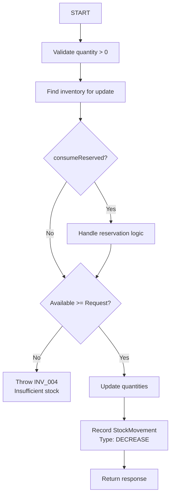
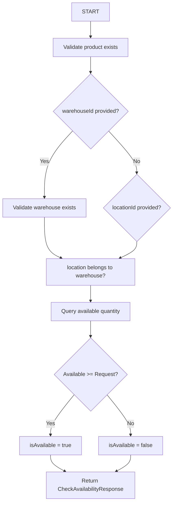

# Inventory Module - Algorithm Flowchart

## Overview
Module quản lý tồn kho trong hệ thống Warehouse Management System (WMS).

## Main Operations

## 1. Get Inventories Flow

## 2. Reserve Inventory Flow

## 3. Unreserve Inventory Flow

## 4. Increase Inventory Flow

## 5. Decrease Inventory Flow

## 6. Check Availability Flow

## Key Components

| Component | Description |
|-----------|-------------|
| Redisson Lock | Distributed lock for concurrent inventory updates |
| InventorySpecification | JPA Specification for dynamic filtering |
| StockMovements | Audit trail for all inventory changes |
| InventoryReservation | Track reserved stock per order line |

## Error Codes

| Code | Description |
|------|-------------|
| INV_001 | Inventory not found |
| INV_002 | Data inconsistency |
| INV_004 | Insufficient stock |
| PROD_001 | Product not found |
| WHS_001 | Warehouse not found |
| LOC_001 | Location not found |
| COM_001 | Bad request |
| COM_009 | Lock acquisition failed |
| COM_010 | Lock interrupted |

## Database Locking Strategy

1. **Pessimistic Locking**: Use `FOR UPDATE` via repository methods
2. **Redisson Distributed Lock**: Prevent race conditions across instances
3. **Idempotency**: Use referenceType + referenceId to prevent duplicate movements