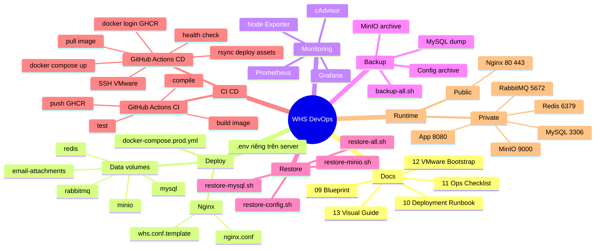
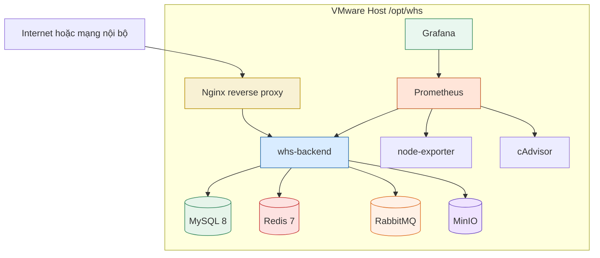
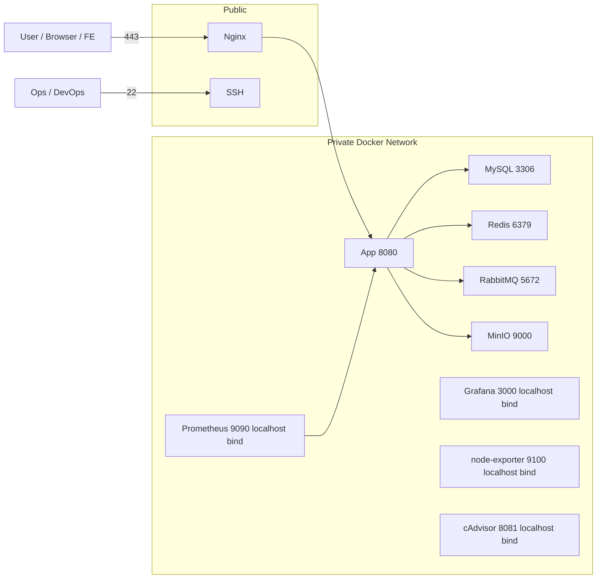
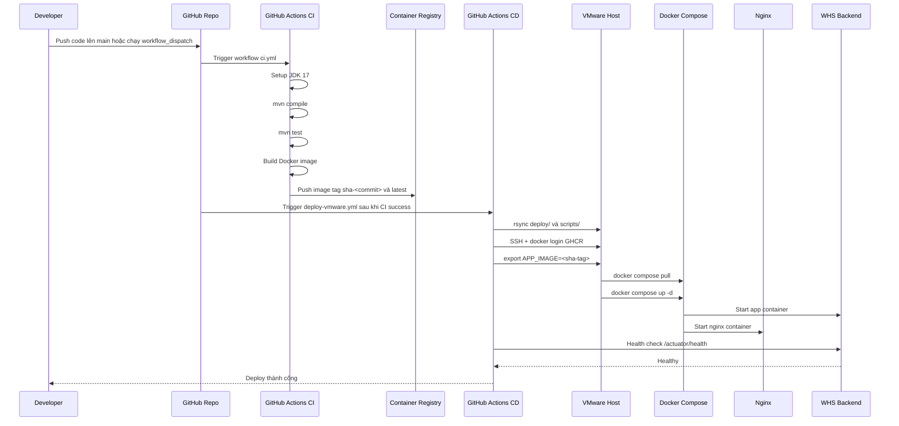
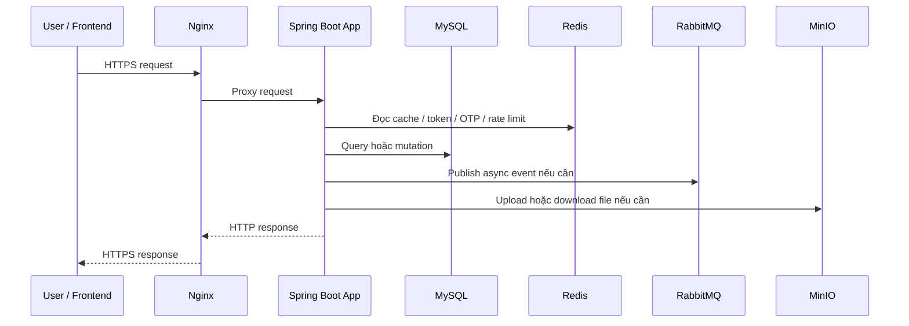
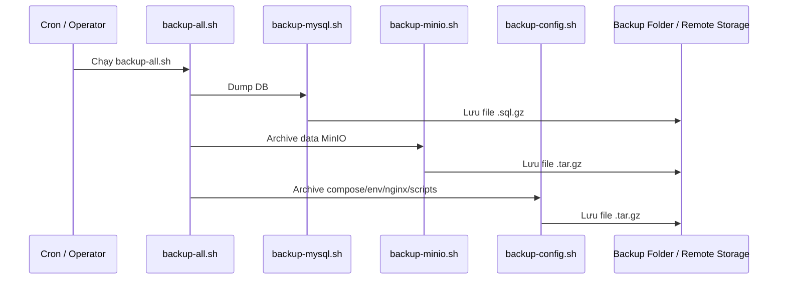
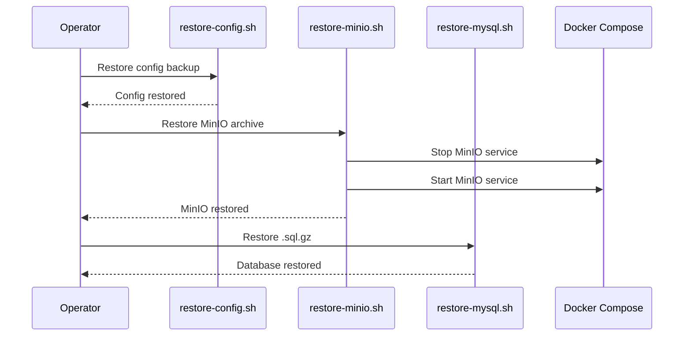

# 13. DevOps Visual Guide

## 1. Mục tiêu

Tài liệu này giúp bạn nhìn toàn bộ phần DevOps đã triển khai theo cách trực quan nhất:

- hệ thống gồm những gì
- luồng build và deploy chạy ra sao
- server VMware dùng gì
- file nào phục vụ mục đích gì
- secret nằm ở đâu
- backup và restore đi theo trình tự nào

Tài liệu này không thay thế runbook chi tiết, mà đóng vai trò "bản đồ tổng" để bạn hiểu nhanh trước khi đi sâu vào từng bước.

## 2. Thành phần đã có trong repo

Các nhóm artifact DevOps hiện tại:

- Tài liệu:
  - `docs/09-devops-platform-blueprint.md`
  - `docs/10-devops-deployment-runbook.md`
  - `docs/11-devops-operations-checklist.md`
  - `docs/12-vmware-host-bootstrap-runbook.md`
- Triển khai production:
  - `deploy/docker-compose.prod.yml`
  - `deploy/.env.prod.example`
  - `deploy/nginx/nginx.conf`
  - `deploy/nginx/templates/whs.conf.template`
- Monitoring:
  - `deploy/docker-compose.monitoring.yml`
  - `deploy/monitoring/prometheus/prometheus.yml`
  - `deploy/monitoring/grafana/provisioning/datasources/datasource.yml`
- Backup:
  - `scripts/backup/*`
- Restore:
  - `scripts/restore/*`
- CI/CD:
  - `.github/workflows/ci.yml`
  - `.github/workflows/deploy-vmware.yml`
  - `scripts/deploy/deploy-vmware.sh`

## 3. Mindmap tổng thể



## 4. Kiến trúc triển khai trên VMware



Ý nghĩa:

- `Nginx` là điểm public duy nhất.
- `App` không public trực tiếp.
- `MySQL`, `Redis`, `RabbitMQ`, `MinIO` là private services.
- `Prometheus` kéo metrics từ app và host.
- `Grafana` đọc dữ liệu từ Prometheus để hiển thị dashboard.

## 5. Mô hình mạng và port



Điểm cần nhớ:

- Public thật sự chỉ nên có `22`, `80`, `443`.
- Các cổng monitoring hiện bind `127.0.0.1`, tức là chỉ truy cập cục bộ trên host.
- App chạy trong Docker network riêng, không nhận request public trực tiếp.

## 6. Vị trí của từng file trong luồng triển khai

```mermaid
flowchart TD
    A[.github/workflows/ci.yml] --> B[Build và push image]
    B --> C[GHCR image]
    D[.github/workflows/deploy-vmware.yml] --> E[rsync deploy/ và scripts/]
    E --> F[/opt/whs trên VMware]
    C --> G[scripts/deploy/deploy-vmware.sh]
    F --> G
    G --> H[deploy/docker-compose.prod.yml]
    H --> I[Nginx + App + MySQL + Redis + RabbitMQ + MinIO]
    J[deploy/docker-compose.monitoring.yml] --> K[Prometheus + Grafana + node-exporter + cAdvisor]
    K --> I
    L[scripts/backup/*] --> M[Backup]
    N[scripts/restore/*] --> O[Restore]
```

## 7. Sequence hoàn chỉnh từ lúc dev push code đến khi app chạy trên VMware



## 8. Sequence vận hành request thực tế



## 9. Sequence backup



## 10. Sequence restore



## 11. Secret nằm ở đâu

```mermaid
flowchart TD
    Repo[Git Repository] -->|Không chứa secret thật| Docs[Docs / Templates]
    Repo --> EnvExample[deploy/.env.prod.example]

    GitHubSecrets[GitHub Secrets] --> CISecrets[CI/CD workflows]
    GitHubSecrets --> SSHSecrets[VMWARE_* / GHCR_*]

    ServerEnv[/opt/whs/deploy/.env] --> Compose[Docker Compose]
    ServerCerts[/opt/whs/deploy/certs] --> Nginx[Nginx TLS]

    CISecrets --> DeployWorkflow[deploy-vmware.yml]
    DeployWorkflow --> VMwareHost[VMware Host]
    VMwareHost --> ServerEnv
```

Ý nghĩa:

- Repo chỉ chứa template, không chứa secret thật.
- GitHub Secrets chứa secret phục vụ CI/CD.
- File `.env` thật nằm trên server.
- TLS cert cũng nằm trên server, không nằm trong repo.

### 11.1. GitHub Secrets tối thiểu để CD chạy được

- `VMWARE_HOST`: IP hoặc DNS của VMware host, phải reachable từ GitHub runner
- `VMWARE_PORT`: thường là `22`
- `VMWARE_USER`: user deploy trên host, ví dụ `deploy`
- `VMWARE_SSH_KEY`: private key dùng cho GitHub Actions SSH vào host
- `VMWARE_DEPLOY_PATH`: thường là `/opt/whs`
- `GHCR_USERNAME`: tài khoản GitHub có quyền pull image từ GHCR
- `GHCR_TOKEN`: PAT có tối thiểu quyền `read:packages`
- `VMWARE_SSH_KNOWN_HOSTS`: tùy chọn, nên cấu hình để pin host key thay vì phụ thuộc `ssh-keyscan`

### 11.2. Lưu ý quan trọng về kết nối

- Việc bạn SSH được từ máy cá nhân chưa đủ để CD chạy được.
- GitHub-hosted runner cũng phải SSH được vào `VMWARE_HOST`.
- Nếu VMware chỉ nằm trong mạng nội bộ lab, bạn cần một trong các cách sau:
  - public IP hoặc NAT port `22`
  - VPN/tunnel mà GitHub runner dùng được
  - self-hosted runner đặt cùng mạng với VMware

### 11.3. Image tag mà workflow sẽ dùng

- `ci.yml` publish:
  - `ghcr.io/<owner>/<repo>:sha-<commit_sha>`
  - `ghcr.io/<owner>/<repo>:latest` trên branch mặc định
- `deploy-vmware.yml` auto deploy image `sha-<commit_sha>` tương ứng với commit CI vừa pass
- `workflow_dispatch` cho phép nhập tay `image_tag` nếu muốn rollback hoặc redeploy

## 12. Ý nghĩa của từng lớp trong hệ thống

### 12.1. Lớp CI

Nơi kiểm tra chất lượng code:

- compile
- test
- build image

### 12.2. Lớp CD

Nơi đưa artifact đã build lên server:

- đồng bộ file deploy
- SSH vào host
- pull image
- rollout
- verify health

### 12.3. Lớp Runtime

Nơi ứng dụng thực sự phục vụ request:

- Nginx
- App
- DB
- Redis
- RabbitMQ
- MinIO

### 12.4. Lớp Observability

Nơi theo dõi tình trạng hệ thống:

- Prometheus
- Grafana
- node-exporter
- cAdvisor

### 12.5. Lớp Data Protection

Nơi bảo vệ khả năng phục hồi:

- backup scripts
- restore scripts
- runbook

## 13. Bạn nên hiểu theo thứ tự nào

Để nắm nhanh nhất, nên đọc theo thứ tự:

1. Mindmap ở mục 3
2. Kiến trúc VMware ở mục 4
3. Sequence deploy ở mục 7
4. Sequence request ở mục 8
5. Sequence backup/restore ở mục 9 và 10
6. Sau đó mới quay lại đọc:
   - `docs/09-devops-platform-blueprint.md`
   - `docs/10-devops-deployment-runbook.md`
   - `docs/12-vmware-host-bootstrap-runbook.md`

## 14. Những gì đã sẵn sàng và những gì còn phát triển tiếp

### 14.1. Đã sẵn sàng

- production compose
- monitoring compose
- nginx production config
- backup scripts
- restore scripts
- CI workflow
- CD workflow cho VMware
- runbook tổng và bootstrap host

### 14.2. Có thể phát triển tiếp

- route Grafana qua Nginx
- dashboard Grafana chi tiết
- Prometheus alert rules
- backup tự động bằng cron/systemd timer
- rollback strategy nâng cao
- tách app node và data node khi lên VPS thật

### 14.3. Cách demo nhanh sau khi push workflow

1. Thêm đủ GitHub Secrets ở mục `11.1`.
2. Đảm bảo VMware host reachable từ GitHub runner.
3. Trên host đã có sẵn:
   - `/opt/whs/deploy/.env`
   - `/opt/whs/deploy/certs/fullchain.pem`
   - `/opt/whs/deploy/certs/privkey.pem`
4. Push code lên `main` để chạy full CI -> CD tự động.
5. Nếu muốn deploy tay:
   - vào GitHub Actions
   - chạy `Deploy VMware`
   - nhập `image_tag` như `sha-<commit_sha>` hoặc `latest`
6. Sau deploy, verify tối thiểu:
   - `https://<domain>/healthz`
   - `https://<domain>/actuator/health`
   - `docker compose --env-file deploy/.env -f deploy/docker-compose.prod.yml ps`

## 15. Kết luận ngắn

Toàn bộ phần DevOps hiện tại đã tạo ra một "xương sống" hoàn chỉnh:

- code được kiểm tra ở CI
- image được build một lần
- VMware chỉ pull image và chạy
- Nginx đứng trước app
- monitoring theo dõi app và host
- backup và restore có script
- docs đã mô tả đầy đủ để phát triển tiếp

Nếu bạn muốn, bước tiếp theo tôi có thể làm thêm một tài liệu thứ hai mang tính "học nhanh trong 15 phút":

- chỉ 1 trang
- ít chữ
- chỉ giữ sơ đồ
- tóm tắt luồng DevOps như slide cho người mới nhìn là hiểu.
