# Sơ Đồ Thuật Toán - Quản Lý Kho WMS

## 1. Tổng Quan Luồng Quản Lý Kho

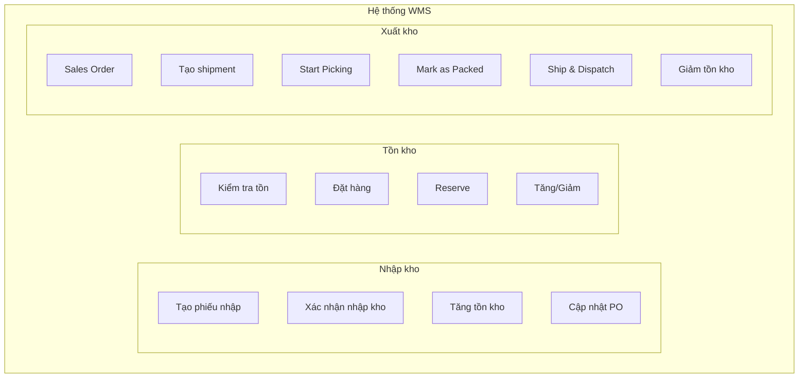

---

## 2. LUỒNG NHẬP KHO (Inbound Receipts)

### 2.1 Tổng quan luồng nhập kho

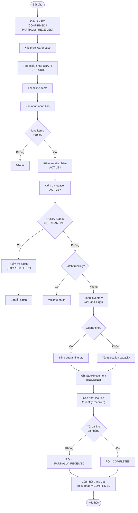

### 2.2 Chi tiết từng bước

#### Bước 1: Tạo phiếu nhập DRAFT

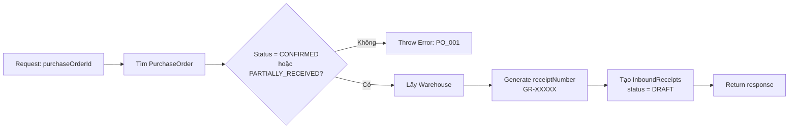

#### Bước 2: Xác nhận nhập kho (Confirm)

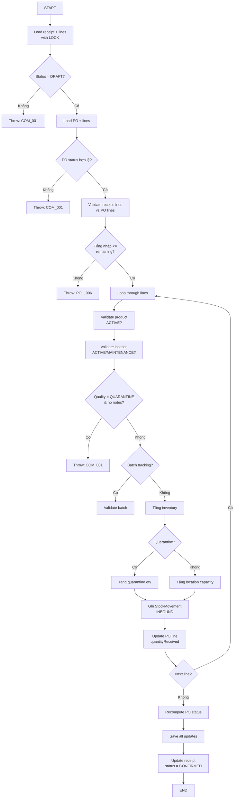

### 2.3 Các trạng thái phiếu nhập

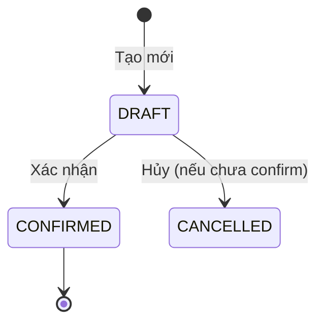

---

## 3. LUỒNG XUẤT KHO (Outbound Shipments)

### 3.1 Tổng quan luồng xuất kho

```mermaid
flowchart TB
    START(["Sales Order\nđã CONFIRMED"]) --> C1["Tạo Shipment\nDRAFT"]
    C1 --> A1["Thêm shipment lines\n(linked to SO lines)"]
    A1 --> T1["Start Picking\nDRAFT → PICKING"]
    T1 --> V1["Resolve Picking Location"]
    V1 --> L1["Loop through lines"]
    L1 --> R1["Find Reservation\n(by orderLineId)"]
    R1 --> R2{"Reserved >= Shipped?"}
    R2 -->|Không| E1["Throw: INV_004"]
    R2 -->|Có| M1["Move: Storage → Picking\n(consumeReserved=false)"]
    M1 --> U1["Update line: locationId\n= picking location"]
    U1 --> L2{"Next line?"}
    L2 -->|Có| L1
    L2 -->|Không| S1["Update status = PICKING"]
    S1 --> T2["Mark as Packed\nPICKING → PACKED"]
    T2 --> V2["Resolve Packing Location"]
    V2 --> L3["Loop through lines"]
    L3 --> M2["Move: Picking → Packing"]
    M2 --> U2["Update line: locationId"]
    U2 --> L4{"Next line?"}
    L4 -->|Có| L3
    L4 -->|Không| S2["Update status = PACKED"]
    S2 --> T3["Ship\nPACKED → STAGING"]
    T3 --> V3["Resolve Staging Location"]
    V3 --> L5["Loop through lines"]
    L5 --> M3["Move: Packing → Staging"]
    M3 --> U3["Update line: locationId"]
    U3 --> L6{"Next line?"}
    L6 -->|Có| L5
    L6 -->|Không| S3["Update status = STAGING"]
    S3 --> T4["Confirm Dispatch\nSTAGING → SHIPPED"]
    T4 --> L7["Loop through lines"]
    L7 --> D1["Decrease inventory\n(consumeReserved=true)"]
    D1 --> C2["Delete reservation"]
    C2 --> U4["Update SO line\nquantityShipped"]
    U4 --> L8{"Next line?"}
    L8 -->|Có| L7
    L8 -->|Không| S4["Update status = SHIPPED"]
    S4 --> U5["Update Sales Order\nstatus"]
    U5 --> END(["Kết thúc"])
```

### 3.2 Chi tiết từng bước

#### Start Picking (DRAFT → PICKING)

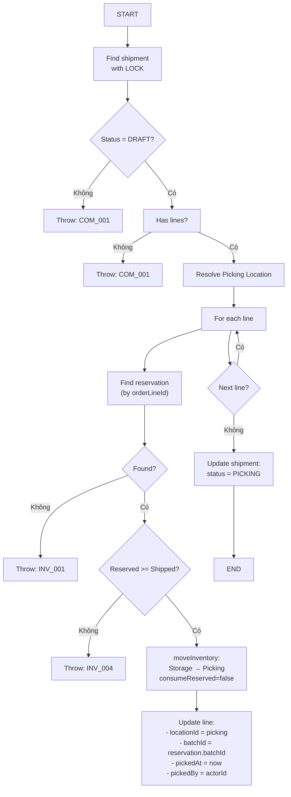

#### Confirm Dispatch (STAGING → SHIPPED)

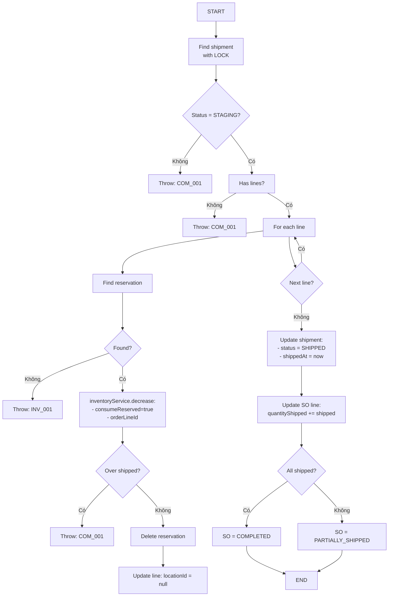

### 3.3 Các trạng thái Shipment

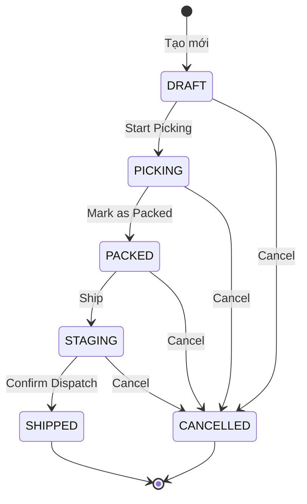

---

## 4. LUỒNG TỒN KHO (Inventory)

### 4.1 Tổng quan các thao tác

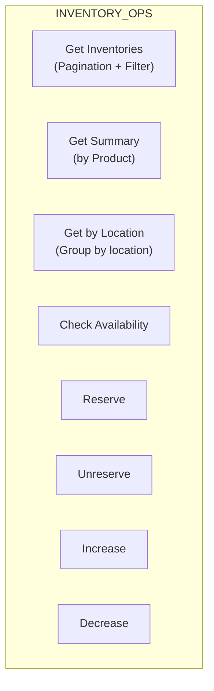

### 4.2 Luồng Reserve (Đặt hàng)

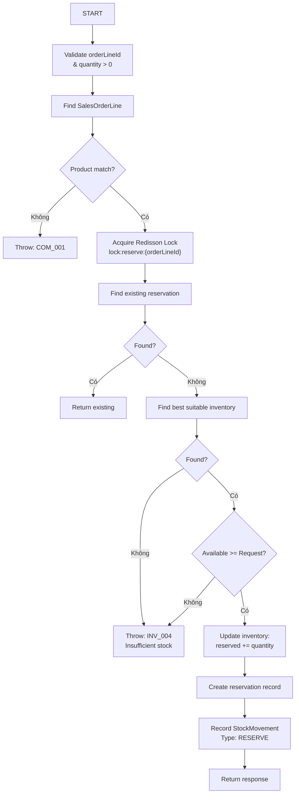

### 4.3 Luồng Increase (Tăng tồn)

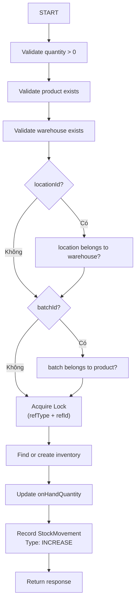

### 4.4 Luồng Decrease (Giảm tồn)

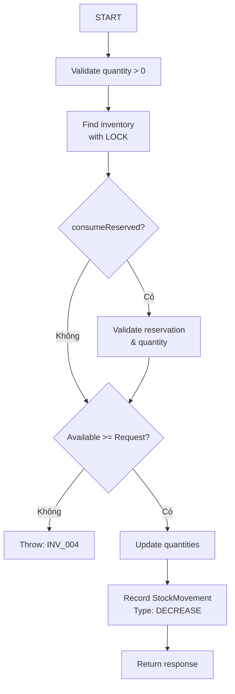

---

## 5. Mô hình tương tác giữa các luồng

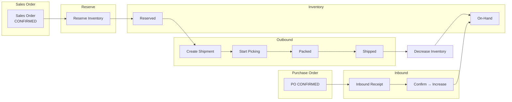

---

## 6. Error Codes

| Mã | Mô tả |
|----|-------|
| COM_001 | Bad request |
| COM_004 | Not found |
| COM_006 | Invalid page number |
| COM_007 | Invalid page size |
| COM_008 | Page size > 100 |
| COM_009 | Lock acquisition failed |
| COM_010 | Lock interrupted |
| INV_001 | Inventory not found |
| INV_002 | Data inconsistency |
| INV_004 | Insufficient stock |
| PROD_001 | Product not found |
| WHS_001 | Warehouse not found |
| LOC_001 | Location not found |
| PO_001 | Purchase order not found |
| PO_002 | PO lines not found |
| POL_006 | Receipt > remaining PO |
| BATCH_001 | Batch not found |
| BATCH_012 | Batch status invalid |

---

## 7. Chiến lược Locking

1. **Redisson Distributed Lock**: Ngăn race condition giữa các instances
2. **Pessimistic Lock (FOR UPDATE)**: Đảm bảo serializable transaction
3. **Idempotency**: Dùng referenceType + referenceId để tránh duplicate stock movement

---

## 8. Stock Movement Types

| Loại | Mô tả |
|------|-------|
| INBOUND | Nhập kho |
| OUTBOUND | Xuất kho |
| RESERVE | Đặt hàng |
| UNRESERVE | Hủy đặt hàng |
| INCREASE | Tăng tồn |
| DECREASE | Giảm tồn |
| INTERNAL_MOVE | Di chuyển nội bộ |