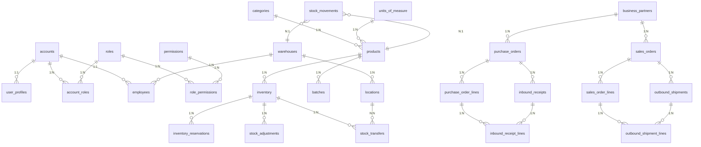

# Database Schema - Warehouse Management System (WMS)

## 1. Tổng quan Database

- **Database Engine**: MySQL 8
- **Collation**: utf8mb4_unicode_ci
- **Migration Tool**: Flyway
- **Số lượng bảng**: 25 bảng

---

## 2. Danh sách tất cả các bảng

### 2.1. Module Authentication & Authorization (RBAC)

| # | Tên bảng | Mô tả |
|---|----------|-------|
| 1 | `accounts` | Tài khoản đăng nhập |
| 2 | `roles` | Vai trò (ADMIN, USER) |
| 3 | `account_roles` | Liên kết account - role |
| 4 | `permissions` | Quyền hạn |
| 5 | `role_permissions` | Liên kết role - permission |
| 6 | `user_profiles` | Thông tin người dùng |

### 2.2. Module Warehouse & Location

| # | Tên bảng | Mô tả |
|---|----------|-------|
| 7 | `warehouses` | Kho |
| 8 | `locations` | Vị trí lưu trữ trong kho |

### 2.3. Module Product Management

| # | Tên bảng | Mô tả |
|---|----------|-------|
| 9 | `categories` | Danh mục sản phẩm |
| 10 | `products` | Sản phẩm |
| 11 | `units_of_measure` | Đơn vị đo lường |
| 12 | `business_partners` | Đối tác (Supplier/Customer) |

### 2.4. Module Batch Management

| # | Tên bảng | Mô tả |
|---|----------|-------|
| 13 | `batches` | Lô hàng |

### 2.5. Module Inventory Management

| # | Tên bảng | Mô tả |
|---|----------|-------|
| 14 | `inventory` | Tồn kho |
| 15 | `inventory_reservations` | Đặt hàng trước (Reserve) |
| 16 | `stock_adjustments` | Điều chỉnh tồn kho |
| 17 | `stock_transfers` | Chuyển kho nội bộ |

### 2.6. Module Inbound (Nhập kho)

| # | Tên bảng | Mô tả |
|---|----------|-------|
| 18 | `purchase_orders` | Đơn mua hàng |
| 19 | `purchase_order_lines` | Chi tiết đơn mua |
| 20 | `inbound_receipts` | Phiếu nhập kho |
| 21 | `inbound_receipt_lines` | Chi tiết phiếu nhập |

### 2.7. Module Outbound (Xuất kho)

| # | Tên bảng | Mô tả |
|---|----------|-------|
| 22 | `sales_orders` | Đơn bán hàng |
| 23 | `sales_order_lines` | Chi tiết đơn bán |
| 24 | `outbound_shipments` | Lô xuất kho |
| 25 | `outbound_shipment_lines` | Chi tiết lô xuất |

### 2.8. Module Stock Movements

| # | Tên bảng | Mô tả |
|---|----------|-------|
| 26 | `stock_movements` | Lịch sử di chuyển tồn kho |

### 2.9. Module HR & System

| # | Tên bảng | Mô tả |
|---|----------|-------|
| 27 | `employees` | Nhân viên kho |
| 28 | `email_logs` | Log gửi email |
| 29 | `background_jobs` | Job nền (import/export) |

---

## 3. Chi tiết từng bảng

### 3.1. accounts - Tài khoản đăng nhập

```sql
CREATE TABLE accounts (
    id         CHAR(36) PRIMARY KEY,
    username   VARCHAR(50)  NOT NULL UNIQUE,
    password   VARCHAR(100) NOT NULL,
    status     ENUM('ACTIVE', 'INACTIVE', 'SUSPENDED', 'DELETED') DEFAULT 'ACTIVE',
    created_at TIMESTAMP DEFAULT CURRENT_TIMESTAMP,
    updated_at TIMESTAMP DEFAULT CURRENT_TIMESTAMP ON UPDATE CURRENT_TIMESTAMP,
    created_by VARCHAR(50),
    updated_by VARCHAR(50)
);
```

| Column | Type | Constraints | Mô tả |
|--------|------|-------------|-------|
| id | CHAR(36) | PK | UUID |
| username | VARCHAR(50) | NOT NULL, UNIQUE | Tên đăng nhập |
| password | VARCHAR(100) | NOT NULL | Mật khẩu (BCrypt) |
| status | ENUM | DEFAULT 'ACTIVE' | Trạng thái |
| created_at | TIMESTAMP | | Ngày tạo |
| updated_at | TIMESTAMP | | Ngày cập nhật |

---

### 3.2. roles - Vai trò

```sql
CREATE TABLE roles (
    id          CHAR(36) PRIMARY KEY,
    code        VARCHAR(50)  NOT NULL UNIQUE,
    name        ENUM('ADMIN', 'USER') NOT NULL UNIQUE,
    description TEXT,
    created_at  TIMESTAMP DEFAULT CURRENT_TIMESTAMP,
    updated_at  TIMESTAMP DEFAULT CURRENT_TIMESTAMP ON UPDATE CURRENT_TIMESTAMP,
    created_by  VARCHAR(50),
    updated_by  VARCHAR(50)
);
```

---

### 3.3. permissions - Quyền hạn

```sql
CREATE TABLE permissions (
    id          CHAR(36) PRIMARY KEY,
    code        VARCHAR(50)  NOT NULL UNIQUE,
    name        VARCHAR(100) NOT NULL UNIQUE,
    description TEXT,
    created_at  TIMESTAMP DEFAULT CURRENT_TIMESTAMP,
    updated_at  TIMESTAMP DEFAULT CURRENT_TIMESTAMP ON UPDATE CURRENT_TIMESTAMP,
    created_by  VARCHAR(50),
    updated_by  VARCHAR(50)
);
```

---

### 3.4. user_profiles - Thông tin người dùng

```sql
CREATE TABLE user_profiles (
    id            CHAR(36) PRIMARY KEY,
    account_id    CHAR(36) UNIQUE,
    first_name    VARCHAR(50),
    last_name     VARCHAR(50),
    email         VARCHAR(100) NOT NULL UNIQUE,
    phone_number  VARCHAR(15),
    address       VARCHAR(255),
    date_of_birth DATE,
    created_at    TIMESTAMP DEFAULT CURRENT_TIMESTAMP,
    updated_at    TIMESTAMP DEFAULT CURRENT_TIMESTAMP ON UPDATE CURRENT_TIMESTAMP,
    created_by    VARCHAR(50),
    updated_by    VARCHAR(50),
    FOREIGN KEY (account_id) REFERENCES accounts (id) ON DELETE CASCADE
);
```

---

### 3.5. warehouses - Kho

```sql
CREATE TABLE warehouses (
    id          CHAR(36) PRIMARY KEY,
    code        VARCHAR(20) UNIQUE NOT NULL,
    name        VARCHAR(100)       NOT NULL,
    address     VARCHAR(255),
    city        VARCHAR(50),
    state       VARCHAR(50),
    country     VARCHAR(50),
    postal_code VARCHAR(20),
    phone       VARCHAR(20),
    email       VARCHAR(100),
    type        ENUM ('MAIN', 'SATELLITE', 'TRANSIT', 'RETURN') DEFAULT 'MAIN',
    status      ENUM ('ACTIVE', 'INACTIVE', 'MAINTENANCE')      DEFAULT 'ACTIVE',
    capacity    DECIMAL(15, 2) COMMENT 'Total capacity in cubic meters',
    manager_id  CHAR(36),
    created_at  TIMESTAMP DEFAULT CURRENT_TIMESTAMP,
    updated_at  TIMESTAMP DEFAULT CURRENT_TIMESTAMP ON UPDATE CURRENT_TIMESTAMP,
    created_by  VARCHAR(50),
    updated_by  VARCHAR(36),
    FOREIGN KEY (manager_id) REFERENCES accounts (id) ON DELETE SET NULL
);
```

| Column | Type | Mô tả |
|--------|------|-------|
| type | ENUM | MAIN, SATELLITE, TRANSIT, RETURN |
| status | ENUM | ACTIVE, INACTIVE, MAINTENANCE |
| capacity | DECIMAL(15,2) | Dung lượng (m³) |

---

### 3.6. locations - Vị trí lưu trữ

```sql
CREATE TABLE locations (
    id           CHAR(36) PRIMARY KEY,
    warehouse_id CHAR(36)     NOT NULL,
    code         VARCHAR(50)  NOT NULL,
    name         VARCHAR(100) NOT NULL,
    zone         VARCHAR(50),
    type         ENUM ('STORAGE', 'PICKING', 'PACKING', 'STAGING', 'RETURN') DEFAULT 'STORAGE',
    capacity     DECIMAL(15, 2),
    used_capacity DECIMAL(15, 2) DEFAULT 0,
    status       ENUM ('ACTIVE', 'INACTIVE', 'FULL', 'MAINTENANCE') DEFAULT 'ACTIVE',
    notes        TEXT,
    created_at   TIMESTAMP DEFAULT CURRENT_TIMESTAMP,
    updated_at   TIMESTAMP DEFAULT CURRENT_TIMESTAMP ON UPDATE CURRENT_TIMESTAMP,
    created_by   VARCHAR(36),
    updated_by   VARCHAR(36),
    UNIQUE KEY uk_warehouse_code (warehouse_id, code),
    FOREIGN KEY (warehouse_id) REFERENCES warehouses (id) ON DELETE CASCADE
);
```

| Column | Type | Mô tả |
|--------|------|-------|
| type | ENUM | STORAGE, PICKING, PACKING, STAGING, RETURN |
| status | ENUM | ACTIVE, INACTIVE, FULL, MAINTENANCE |
| used_capacity | DECIMAL(15,2) | Dung lượng đã sử dụng |

---

### 3.7. categories - Danh mục sản phẩm

```sql
CREATE TABLE categories (
    id          CHAR(36) PRIMARY KEY,
    code        VARCHAR(20) UNIQUE NOT NULL,
    name        VARCHAR(100)       NOT NULL,
    description VARCHAR(255),
    status      ENUM ('ACTIVE', 'INACTIVE') DEFAULT 'ACTIVE',
    created_at  TIMESTAMP DEFAULT CURRENT_TIMESTAMP,
    updated_at  TIMESTAMP DEFAULT CURRENT_TIMESTAMP ON UPDATE CURRENT_TIMESTAMP,
    created_by  VARCHAR(50),
    updated_by  VARCHAR(36)
);
```

---

### 3.8. products - Sản phẩm

```sql
CREATE TABLE products (
    id                      CHAR(36) PRIMARY KEY,
    sku                     VARCHAR(50) UNIQUE NOT NULL,
    name                    VARCHAR(200)       NOT NULL,
    description             TEXT,
    category_id             CHAR(36)           NOT NULL,
    uom_id                  CHAR(36)           NOT NULL,
    weight                  DECIMAL(10, 3),
    dimensions              VARCHAR(50),
    status                  ENUM ('ACTIVE', 'INACTIVE', 'DISCONTINUED') DEFAULT 'ACTIVE',
    min_stock_level         DECIMAL(15, 2) DEFAULT 0,
    max_stock_level         DECIMAL(15, 2),
    reorder_point           DECIMAL(15, 2),
    cost_price              DECIMAL(15, 2),
    selling_price           DECIMAL(15, 2),
    barcode                 VARCHAR(100),
    image_url               VARCHAR(255),
    requires_batch_tracking BOOLEAN DEFAULT FALSE,
    created_at              TIMESTAMP DEFAULT CURRENT_TIMESTAMP,
    updated_at              TIMESTAMP DEFAULT CURRENT_TIMESTAMP ON UPDATE CURRENT_TIMESTAMP,
    created_by              VARCHAR(36),
    updated_by              VARCHAR(36),
    FOREIGN KEY (category_id) REFERENCES categories (id),
    FOREIGN KEY (uom_id) REFERENCES units_of_measure (id)
);
```

---

### 3.9. units_of_measure - Đơn vị đo lường

```sql
CREATE TABLE units_of_measure (
    id          CHAR(36) PRIMARY KEY,
    code        VARCHAR(10) UNIQUE NOT NULL,
    name        VARCHAR(100)       NOT NULL,
    description TEXT,
    type        ENUM ('LENGTH', 'WEIGHT', 'VOLUME', 'COUNT') NOT NULL,
    created_at  TIMESTAMP DEFAULT CURRENT_TIMESTAMP,
    updated_at  TIMESTAMP DEFAULT CURRENT_TIMESTAMP ON UPDATE CURRENT_TIMESTAMP,
    created_by  VARCHAR(50),
    updated_by  VARCHAR(36)
);
```

---

### 3.10. business_partners - Đối tác

```sql
CREATE TABLE business_partners (
    id             CHAR(36) PRIMARY KEY,
    code           VARCHAR(20) UNIQUE NOT NULL,
    name           VARCHAR(200)       NOT NULL,
    type           ENUM ('SUPPLIER', 'CUSTOMER', 'BOTH') NOT NULL,
    contact_person VARCHAR(100),
    email          VARCHAR(100),
    phone          VARCHAR(20),
    address        VARCHAR(255),
    city           VARCHAR(50),
    country        VARCHAR(50),
    tax_id         VARCHAR(50),
    payment_terms  VARCHAR(100),
    credit_limit   DECIMAL(15, 2),
    status         ENUM ('ACTIVE', 'INACTIVE', 'BLACKLISTED') DEFAULT 'ACTIVE',
    notes          TEXT,
    created_at     TIMESTAMP DEFAULT CURRENT_TIMESTAMP,
    updated_at     TIMESTAMP DEFAULT CURRENT_TIMESTAMP ON UPDATE CURRENT_TIMESTAMP,
    created_by     VARCHAR(36),
    updated_by     VARCHAR(36)
);
```

---

### 3.11. batches - Lô hàng

```sql
CREATE TABLE batches (
    id                    CHAR(36) PRIMARY KEY,
    batch_number          VARCHAR(50) NOT NULL,
    product_id            CHAR(36)    NOT NULL,
    manufacturing_date    DATE        NOT NULL,
    expiry_date           DATE,
    status                ENUM('AVAILABLE', 'QUARANTINE', 'EXPIRED', 'RECALLED')
                        NOT NULL DEFAULT 'AVAILABLE',
    supplier_batch_number VARCHAR(50),
    notes                 TEXT,
    created_at            TIMESTAMP DEFAULT CURRENT_TIMESTAMP,
    updated_at            TIMESTAMP DEFAULT CURRENT_TIMESTAMP ON UPDATE CURRENT_TIMESTAMP,
    created_by            VARCHAR(36),
    updated_by            VARCHAR(36),
    CONSTRAINT uk_product_batch UNIQUE (product_id, batch_number),
    FOREIGN KEY (product_id) REFERENCES products (id) ON DELETE RESTRICT
);
```

---

### 3.12. inventory - Tồn kho

```sql
CREATE TABLE inventory (
    id                CHAR(36) PRIMARY KEY,
    product_id        CHAR(36)       NOT NULL,
    warehouse_id      CHAR(36)       NOT NULL,
    location_id       CHAR(36),
    batch_id          CHAR(36),
    on_hand_quantity  DECIMAL(15, 2) NOT NULL DEFAULT 0.00,
    quarantine_quantity DECIMAL(15,2) DEFAULT 0.00,
    reserved_quantity DECIMAL(15, 2) NOT NULL DEFAULT 0.00,
    version           INT            NOT NULL DEFAULT 0,
    last_movement_at  TIMESTAMP,
    created_at        TIMESTAMP DEFAULT CURRENT_TIMESTAMP,
    updated_at        TIMESTAMP DEFAULT CURRENT_TIMESTAMP ON UPDATE CURRENT_TIMESTAMP,
    created_by        VARCHAR(36),
    updated_by        VARCHAR(36),
    CONSTRAINT uk_inventory_location UNIQUE (product_id, warehouse_id, location_id, batch_id),
    CONSTRAINT chk_inventory_quantities CHECK (
        on_hand_quantity >= 0 AND reserved_quantity >= 0 AND reserved_quantity <= on_hand_quantity
    ),
    FOREIGN KEY (product_id) REFERENCES products (id) ON DELETE RESTRICT,
    FOREIGN KEY (warehouse_id) REFERENCES warehouses (id) ON DELETE RESTRICT,
    FOREIGN KEY (location_id) REFERENCES locations (id) ON DELETE RESTRICT,
    FOREIGN KEY (batch_id) REFERENCES batches (id) ON DELETE RESTRICT
);
```

| Column | Type | Mô tả |
|--------|------|-------|
| on_hand_quantity | DECIMAL(15,2) | Số lượng tồn |
| quarantine_quantity | DECIMAL(15,2) | Số lượng cách ly |
| reserved_quantity | DECIMAL(15,2) | Số lượng đã đặt |
| version | INT | Optimistic locking |

---

### 3.13. inventory_reservations - Đặt hàng trước

```sql
CREATE TABLE inventory_reservations (
    id                CHAR(36) PRIMARY KEY,
    inventory_id      CHAR(36)       NOT NULL,
    product_id        CHAR(36)       NOT NULL,
    warehouse_id      CHAR(36)       NOT NULL,
    location_id       CHAR(36),
    batch_id          CHAR(36),
    quantity          DECIMAL(15, 2) NOT NULL,
    order_line_id     VARCHAR(100),
    status            ENUM('RESERVED', 'RELEASED', 'CONSUMED') NOT NULL DEFAULT 'RESERVED',
    created_at        TIMESTAMP DEFAULT CURRENT_TIMESTAMP,
    updated_at        TIMESTAMP DEFAULT CURRENT_TIMESTAMP ON UPDATE CURRENT_TIMESTAMP,
    created_by        VARCHAR(36),
    updated_by        VARCHAR(36),
    CONSTRAINT uk_reservation_order_line UNIQUE (order_line_id),
    CONSTRAINT chk_reservation_quantity CHECK (quantity > 0),
    FOREIGN KEY (inventory_id) REFERENCES inventory (id) ON DELETE CASCADE
);
```

---

### 3.14. stock_adjustments - Điều chỉnh tồn kho

```sql
CREATE TABLE stock_adjustments (
    id                  CHAR(36) PRIMARY KEY,
    adjustment_number   VARCHAR(50) UNIQUE NOT NULL,
    inventory_id        CHAR(36)           NOT NULL,
    product_id          CHAR(36)           NOT NULL,
    warehouse_id        CHAR(36)           NOT NULL,
    location_id         CHAR(36),
    batch_id            CHAR(36),
    quantity_before     DECIMAL(15, 2)     NOT NULL,
    quantity_after      DECIMAL(15, 2)     NOT NULL,
    adjustment_quantity DECIMAL(15, 2)     NOT NULL,
    reason              ENUM('DAMAGE', 'THEFT', 'COUNT_ERROR', 'EXPIRED',
                                'QUALITY_ISSUE', 'SYSTEM_ERROR', 'OTHER') NOT NULL,
    status              ENUM('PENDING_APPROVAL', 'APPROVED', 'REJECTED')
                            NOT NULL DEFAULT 'PENDING_APPROVAL',
    notes               TEXT,
    requires_approval   BOOLEAN NOT NULL DEFAULT FALSE,
    approved_by         CHAR(36),
    approved_at         TIMESTAMP,
    rejection_reason    VARCHAR(500),
    created_at          TIMESTAMP DEFAULT CURRENT_TIMESTAMP,
    updated_at          TIMESTAMP DEFAULT CURRENT_TIMESTAMP ON UPDATE CURRENT_TIMESTAMP,
    created_by          VARCHAR(36),
    updated_by          VARCHAR(36)
);
```

---

### 3.15. stock_transfers - Chuyển kho nội bộ

```sql
CREATE TABLE stock_transfers (
    id               CHAR(36) PRIMARY KEY,
    transfer_number  VARCHAR(50) UNIQUE NOT NULL,
    product_id       CHAR(36)           NOT NULL,
    warehouse_id     CHAR(36)           NOT NULL,
    batch_id         CHAR(36),
    from_location_id CHAR(36)           NOT NULL,
    to_location_id   CHAR(36)           NOT NULL,
    quantity         DECIMAL(15, 2)     NOT NULL,
    reason           ENUM('REORG', 'PICKING_PREP', 'OVERFLOW', 'CONSOLIDATION', 'OTHER') NOT NULL,
    notes            TEXT,
    status           ENUM('DRAFT', 'COMPLETED', 'CANCELLED') NOT NULL DEFAULT 'DRAFT',
    completed_at     TIMESTAMP,
    created_at       TIMESTAMP DEFAULT CURRENT_TIMESTAMP,
    updated_at       TIMESTAMP DEFAULT CURRENT_TIMESTAMP ON UPDATE CURRENT_TIMESTAMP,
    created_by       VARCHAR(36),
    updated_by       VARCHAR(36)
);
```

---

### 3.16. purchase_orders - Đơn mua hàng

```sql
CREATE TABLE purchase_orders (
    id                     CHAR(36) PRIMARY KEY,
    purchase_order_number  VARCHAR(50) UNIQUE NOT NULL,
    supplier_id            CHAR(36)           NOT NULL,
    warehouse_id           CHAR(36)           NOT NULL,
    order_date             DATE               NOT NULL,
    expected_delivery_date DATE,
    status                 ENUM('DRAFT', 'CONFIRMED', 'PARTIALLY_RECEIVED',
                                 'COMPLETED', 'CANCELLED') NOT NULL DEFAULT 'DRAFT',
    sub_total               DECIMAL(15, 2)     NOT NULL DEFAULT 0.00,
    tax_amount             DECIMAL(15, 2)     NOT NULL DEFAULT 0.00,
    total_amount           DECIMAL(15, 2)     NOT NULL DEFAULT 0.00,
    currency               VARCHAR(3)          DEFAULT 'USD',
    payment_terms          VARCHAR(200),
    notes                  TEXT,
    confirmed_at           TIMESTAMP,
    confirmed_by           CHAR(36),
    created_at             TIMESTAMP DEFAULT CURRENT_TIMESTAMP,
    updated_at             TIMESTAMP DEFAULT CURRENT_TIMESTAMP ON UPDATE CURRENT_TIMESTAMP,
    created_by             VARCHAR(36),
    updated_by             VARCHAR(36),
    FOREIGN KEY (supplier_id) REFERENCES business_partners (id) ON DELETE RESTRICT,
    FOREIGN KEY (warehouse_id) REFERENCES warehouses (id) ON DELETE RESTRICT
);
```

---

### 3.17. purchase_order_lines - Chi tiết đơn mua

```sql
CREATE TABLE purchase_order_lines (
    id                CHAR(36) PRIMARY KEY,
    purchase_order_id CHAR(36)       NOT NULL,
    product_id        CHAR(36)       NOT NULL,
    line_number       INT            NOT NULL,
    quantity_ordered  DECIMAL(15, 2) NOT NULL,
    quantity_received DECIMAL(15, 2) NOT NULL DEFAULT 0.00,
    unit_price        DECIMAL(15, 2) NOT NULL,
    line_total        DECIMAL(15, 2) NOT NULL,
    notes             VARCHAR(500),
    created_at        TIMESTAMP DEFAULT CURRENT_TIMESTAMP,
    updated_at        TIMESTAMP DEFAULT CURRENT_TIMESTAMP ON UPDATE CURRENT_TIMESTAMP,
    created_by        VARCHAR(36),
    updated_by        VARCHAR(36),
    CONSTRAINT uk_po_line_number UNIQUE (purchase_order_id, line_number),
    FOREIGN KEY (purchase_order_id) REFERENCES purchase_orders (id) ON DELETE CASCADE,
    FOREIGN KEY (product_id) REFERENCES products (id) ON DELETE RESTRICT
);
```

---

### 3.18. inbound_receipts - Phiếu nhập kho

```sql
CREATE TABLE inbound_receipts (
    id                   CHAR(36) PRIMARY KEY,
    receipt_number       VARCHAR(50) UNIQUE NOT NULL,
    purchase_order_id    CHAR(36)           NOT NULL,
    warehouse_id         CHAR(36)           NOT NULL,
    receipt_date         DATE               NOT NULL,
    status               ENUM('DRAFT', 'CONFIRMED', 'CANCELLED') NOT NULL DEFAULT 'DRAFT',
    confirmed_at         TIMESTAMP,
    confirmed_by         CHAR(36),
    delivery_note_number VARCHAR(100),
    notes                TEXT,
    created_at           TIMESTAMP DEFAULT CURRENT_TIMESTAMP,
    updated_at           TIMESTAMP DEFAULT CURRENT_TIMESTAMP ON UPDATE CURRENT_TIMESTAMP,
    created_by           VARCHAR(36),
    updated_by           VARCHAR(36),
    FOREIGN KEY (purchase_order_id) REFERENCES purchase_orders (id) ON DELETE RESTRICT,
    FOREIGN KEY (warehouse_id) REFERENCES warehouses (id) ON DELETE RESTRICT
);
```

---

### 3.19. inbound_receipt_lines - Chi tiết phiếu nhập

```sql
CREATE TABLE inbound_receipt_lines (
    id                     CHAR(36) PRIMARY KEY,
    inbound_receipt_id     CHAR(36)       NOT NULL,
    purchase_order_line_id CHAR(36)       NOT NULL,
    product_id             CHAR(36)       NOT NULL,
    batch_id               CHAR(36),
    location_id            CHAR(36)       NOT NULL,
    line_number            INT            NOT NULL,
    quantity_received      DECIMAL(15, 2) NOT NULL,
    quality_status         ENUM('PASS', 'QUARANTINE') NOT NULL DEFAULT 'PASS',
    notes                  VARCHAR(500),
    created_at             TIMESTAMP DEFAULT CURRENT_TIMESTAMP,
    updated_at             TIMESTAMP DEFAULT CURRENT_TIMESTAMP ON UPDATE CURRENT_TIMESTAMP,
    created_by             VARCHAR(36),
    updated_by             VARCHAR(36),
    CONSTRAINT uk_receipt_line_number UNIQUE (inbound_receipt_id, line_number),
    FOREIGN KEY (inbound_receipt_id) REFERENCES inbound_receipts (id) ON DELETE CASCADE,
    FOREIGN KEY (purchase_order_line_id) REFERENCES purchase_order_lines (id) ON DELETE RESTRICT,
    FOREIGN KEY (product_id) REFERENCES products (id) ON DELETE RESTRICT,
    FOREIGN KEY (location_id) REFERENCES locations (id) ON DELETE RESTRICT
);
```

---

### 3.20. sales_orders - Đơn bán hàng

```sql
CREATE TABLE sales_orders (
    id                      CHAR(36) PRIMARY KEY,
    so_number               VARCHAR(50) UNIQUE NOT NULL,
    customer_id             CHAR(36)           NOT NULL,
    warehouse_id            CHAR(36)           NOT NULL,
    order_date              DATE               NOT NULL,
    requested_delivery_date DATE,
    status                  ENUM('DRAFT', 'CONFIRMED', 'PARTIALLY_SHIPPED',
                                 'COMPLETED', 'CANCELLED') NOT NULL DEFAULT 'DRAFT',
    sub_total                DECIMAL(15, 2)     NOT NULL DEFAULT 0.00,
    tax_amount              DECIMAL(15, 2)     NOT NULL DEFAULT 0.00,
    total_amount            DECIMAL(15, 2)     NOT NULL DEFAULT 0.00,
    currency                VARCHAR(3)          DEFAULT 'USD',
    notes                   TEXT,
    confirmed_at            TIMESTAMP,
    confirmed_by            CHAR(36),
    created_at             TIMESTAMP DEFAULT CURRENT_TIMESTAMP,
    updated_at             TIMESTAMP DEFAULT CURRENT_TIMESTAMP ON UPDATE CURRENT_TIMESTAMP,
    created_by             VARCHAR(36),
    updated_by             VARCHAR(36),
    FOREIGN KEY (customer_id) REFERENCES business_partners (id) ON DELETE RESTRICT,
    FOREIGN KEY (warehouse_id) REFERENCES warehouses (id) ON DELETE RESTRICT
);
```

---

### 3.21. sales_order_lines - Chi tiết đơn bán

```sql
CREATE TABLE sales_order_lines (
    id               CHAR(36) PRIMARY KEY,
    sales_order_id   CHAR(36)       NOT NULL,
    product_id       CHAR(36)       NOT NULL,
    line_number      INT            NOT NULL,
    quantity_ordered DECIMAL(15, 2) NOT NULL,
    quantity_shipped DECIMAL(15, 2) NOT NULL DEFAULT 0.00,
    unit_price       DECIMAL(15, 2) NOT NULL,
    line_total       DECIMAL(15, 2) NOT NULL,
    notes            VARCHAR(500),
    created_at       TIMESTAMP DEFAULT CURRENT_TIMESTAMP,
    updated_at       TIMESTAMP DEFAULT CURRENT_TIMESTAMP ON UPDATE CURRENT_TIMESTAMP,
    created_by       VARCHAR(36),
    updated_by       VARCHAR(36),
    CONSTRAINT uk_so_line_number UNIQUE (sales_order_id, line_number),
    FOREIGN KEY (sales_order_id) REFERENCES sales_orders (id) ON DELETE CASCADE,
    FOREIGN KEY (product_id) REFERENCES products (id) ON DELETE RESTRICT
);
```

---

### 3.22. outbound_shipments - Lô xuất kho

```sql
CREATE TABLE outbound_shipments (
    id              CHAR(36) PRIMARY KEY,
    shipment_number VARCHAR(50) UNIQUE NOT NULL,
    sales_order_id  CHAR(36)           NOT NULL,
    warehouse_id    CHAR(36)           NOT NULL,
    shipment_date   DATE               NOT NULL,
    status          ENUM('DRAFT', 'PICKING', 'PACKED', 'STAGING', 'SHIPPED', 'CANCELLED')
                        NOT NULL DEFAULT 'DRAFT',
    tracking_number VARCHAR(100),
    carrier         VARCHAR(100),
    shipped_at      TIMESTAMP,
    confirmed_by    CHAR(36),
    notes           TEXT,
    created_at      TIMESTAMP DEFAULT CURRENT_TIMESTAMP,
    updated_at      TIMESTAMP DEFAULT CURRENT_TIMESTAMP ON UPDATE CURRENT_TIMESTAMP,
    created_by      VARCHAR(36),
    updated_by      VARCHAR(36),
    FOREIGN KEY (sales_order_id) REFERENCES sales_orders (id) ON DELETE RESTRICT,
    FOREIGN KEY (warehouse_id) REFERENCES warehouses (id) ON DELETE RESTRICT
);
```

**Trạng thái**: DRAFT → PICKING → PACKED → STAGING → SHIPPED | CANCELLED

---

### 3.23. outbound_shipment_lines - Chi tiết lô xuất

```sql
CREATE TABLE outbound_shipment_lines (
    id                   CHAR(36) PRIMARY KEY,
    outbound_shipment_id CHAR(36)       NOT NULL,
    sales_order_line_id  CHAR(36)       NOT NULL,
    product_id           CHAR(36)       NOT NULL,
    batch_id             CHAR(36),
    location_id          CHAR(36),
    line_number          INT            NOT NULL,
    quantity_shipped     DECIMAL(15, 2) NOT NULL,
    picked_at            TIMESTAMP,
    picked_by            CHAR(36),
    notes                VARCHAR(500),
    created_at           TIMESTAMP DEFAULT CURRENT_TIMESTAMP,
    updated_at           TIMESTAMP DEFAULT CURRENT_TIMESTAMP ON UPDATE CURRENT_TIMESTAMP,
    created_by           VARCHAR(36),
    updated_by           VARCHAR(36),
    CONSTRAINT uk_shipment_line_number UNIQUE (outbound_shipment_id, line_number),
    FOREIGN KEY (outbound_shipment_id) REFERENCES outbound_shipments (id) ON DELETE CASCADE,
    FOREIGN KEY (sales_order_line_id) REFERENCES sales_order_lines (id) ON DELETE RESTRICT,
    FOREIGN KEY (product_id) REFERENCES products (id) ON DELETE RESTRICT
);
```

---

### 3.24. stock_movements - Lịch sử di chuyển tồn kho

```sql
CREATE TABLE stock_movements (
    id               CHAR(36) PRIMARY KEY,
    movement_type    ENUM(
                        'INBOUND', 'OUTBOUND',
                        'ADJUSTMENT_INCREASE', 'ADJUSTMENT_DECREASE',
                        'TRANSFER_OUT', 'TRANSFER_IN',
                        'RESERVE', 'UNRESERVE', 'INTERNAL_MOVE'
                    ) NOT NULL,
    product_id       CHAR(36)       NOT NULL,
    warehouse_id     CHAR(36)       NOT NULL,
    location_id      CHAR(36),
    batch_id         CHAR(36),
    to_location_id   CHAR(36),
    quantity_change  DECIMAL(15, 2) NOT NULL,
    quantity_before  DECIMAL(15, 2) NOT NULL,
    quantity_after   DECIMAL(15, 2) NOT NULL,
    movement_date    TIMESTAMP      NOT NULL,
    reference_type   ENUM('PURCHASE_ORDER', 'SALES_ORDER', 'INBOUND_RECEIPT',
                         'OUTBOUND_SHIPMENT', 'STOCK_ADJUSTMENT',
                         'STOCK_TRANSFER', 'SYSTEM', 'SALES_ORDER') NOT NULL,
    reference_id     CHAR(36),
    reference_number VARCHAR(50),
    notes            TEXT,
    created_at       TIMESTAMP DEFAULT CURRENT_TIMESTAMP,
    updated_at       TIMESTAMP DEFAULT CURRENT_TIMESTAMP ON UPDATE CURRENT_TIMESTAMP,
    created_by       VARCHAR(36),
    updated_by       VARCHAR(36),
    CONSTRAINT chk_movement_quantity_calc CHECK (
        quantity_after = quantity_before + quantity_change
    ),
    FOREIGN KEY (product_id) REFERENCES products (id) ON DELETE RESTRICT,
    FOREIGN KEY (warehouse_id) REFERENCES warehouses (id) ON DELETE RESTRICT
);
```

---

### 3.25. employees - Nhân viên kho

```sql
CREATE TABLE employees (
    id               CHAR(36) NOT NULL,
    account_id       CHAR(36) NOT NULL,
    employee_code    VARCHAR(20) NOT NULL,
    department       VARCHAR(100),
    position         VARCHAR(100),
    hire_date        DATE,
    termination_date DATE,
    salary_grade     VARCHAR(20),
    warehouse_id     CHAR(36),
    status           ENUM ('ACTIVE', 'ON_LEAVE', 'TERMINATED') DEFAULT 'ACTIVE' NOT NULL,
    created_at       TIMESTAMP DEFAULT CURRENT_TIMESTAMP NOT NULL,
    updated_at       TIMESTAMP DEFAULT CURRENT_TIMESTAMP ON UPDATE CURRENT_TIMESTAMP NOT NULL,
    created_by       VARCHAR(36),
    updated_by       VARCHAR(36),
    CONSTRAINT uq_employees_account_id UNIQUE (account_id),
    CONSTRAINT uq_employees_employee_code UNIQUE (employee_code),
    FOREIGN KEY (account_id) REFERENCES accounts (id) ON DELETE CASCADE,
    FOREIGN KEY (warehouse_id) REFERENCES warehouses (id) ON DELETE SET NULL
);
```

---

### 3.26. email_logs - Log gửi email

```sql
CREATE TABLE email_logs (
    id               CHAR(36) NOT NULL PRIMARY KEY,
    recipient        VARCHAR(255) NOT NULL,
    cc               VARCHAR(1000) NULL,
    bcc              VARCHAR(1000) NULL,
    subject          VARCHAR(500) NOT NULL,
    content          TEXT NOT NULL,
    email_type       VARCHAR(50) NOT NULL,
    status           VARCHAR(20) NOT NULL,
    retry_count      INT NOT NULL DEFAULT 0,
    max_retry        INT NOT NULL DEFAULT 3,
    error_message    TEXT NULL,
    sent_at          DATETIME NULL,
    has_attachment   BOOLEAN NOT NULL DEFAULT FALSE,
    attachment_path  VARCHAR(500) NULL,
    priority         INT NOT NULL DEFAULT 5,
    scheduled_at     DATETIME NULL,
    triggered_by     CHAR(36) NULL,
    created_at       DATETIME NOT NULL DEFAULT CURRENT_TIMESTAMP,
    updated_at       DATETIME NOT NULL DEFAULT CURRENT_TIMESTAMP ON UPDATE CURRENT_TIMESTAMP,
    created_by       VARCHAR(50) NULL,
    updated_by       VARCHAR(50) NULL
);
```

---

### 3.27. background_jobs - Job nền

```sql
CREATE TABLE background_jobs (
    id CHAR(36) NOT NULL PRIMARY KEY,
    job_code VARCHAR(64) NOT NULL UNIQUE,
    job_type VARCHAR(50) NOT NULL,
    business_type VARCHAR(100) NOT NULL,
    status VARCHAR(50) NOT NULL,
    current_step VARCHAR(100) NULL,
    requested_by CHAR(36) NOT NULL,
    request_payload LONGTEXT NULL,
    request_hash VARCHAR(128) NULL,
    progress_percent INT NOT NULL DEFAULT 0,
    processed_rows BIGINT NOT NULL DEFAULT 0,
    total_rows BIGINT NOT NULL DEFAULT 0,
    result_file_name VARCHAR(255) NULL,
    storage_object_key VARCHAR(500) NULL,
    result_mime_type VARCHAR(100) NULL,
    result_file_size BIGINT NULL,
    error_code VARCHAR(100) NULL,
    error_message TEXT NULL,
    started_at DATETIME NULL,
    finished_at DATETIME NULL,
    created_at DATETIME NOT NULL DEFAULT CURRENT_TIMESTAMP,
    updated_at DATETIME NOT NULL DEFAULT CURRENT_TIMESTAMP ON UPDATE CURRENT_TIMESTAMP,
    created_by VARCHAR(50) NULL,
    updated_by VARCHAR(50) NULL
);
```

---

## 4. Sơ đồ quan hệ giữa các bảng



---

## 5. Mô tả luồng dữ liệu

### 5.1. Luồng Nhập kho (Inbound)

```
Purchase Order (CONFIRMED)
    ↓
Inbound Receipt (DRAFT → CONFIRMED)
    ↓
Inbound Receipt Lines → Update Inventory (Increase)
    ↓
Stock Movements (INBOUND)
```

### 5.2. Luồng Xuất kho (Outbound)

```
Sales Order (CONFIRMED)
    ↓
Inventory Reservation (RESERVE)
    ↓
Outbound Shipment (DRAFT → PICKING → PACKED → STAGING → SHIPPED)
    ↓
Outbound Shipment Lines → Decrease Inventory (consumeReserved)
    ↓
Stock Movements (OUTBOUND)
```

### 5.3. Luồng Điều chỉnh tồn kho

```
Stock Adjustment (PENDING_APPROVAL → APPROVED/REJECTED)
    ↓
Update Inventory (Increase/Decrease)
    ↓
Stock Movements (ADJUSTMENT_INCREASE/DECREASE)
```

---

## 6. Chỉ mục (Indexes)

### 6.1. Index quan trọng

| Bảng | Index | Columns |
|------|-------|---------|
| inventory | idx_inventory_availability | product_id, warehouse_id, on_hand_quantity, reserved_quantity |
| stock_movements | idx_movement_product_date | product_id, movement_date DESC |
| stock_movements | idx_movement_reference | reference_type, reference_id |
| batches | idx_batch_fifo | product_id, status, manufacturing_date, expiry_date |
| locations | uk_warehouse_code | warehouse_id, code |
| products | idx_sku | sku |
| products | idx_search | name, description (FULLTEXT) |

---

## 7. Enums汇总

### 7.1. accounts.status
- ACTIVE, INACTIVE, SUSPENDED, DELETED

### 7.2. roles.name
- ADMIN, USER

### 7.3. warehouses.type
- MAIN, SATELLITE, TRANSIT, RETURN

### 7.4. warehouses.status
- ACTIVE, INACTIVE, MAINTENANCE

### 7.5. locations.type
- STORAGE, PICKING, PACKING, STAGING, RETURN

### 7.6. locations.status
- ACTIVE, INACTIVE, FULL, MAINTENANCE

### 7.7. products.status
- ACTIVE, INACTIVE, DISCONTINUED

### 7.8. business_partners.type
- SUPPLIER, CUSTOMER, BOTH

### 7.9. business_partners.status
- ACTIVE, INACTIVE, BLACKLISTED

### 7.10. batches.status
- AVAILABLE, QUARANTINE, EXPIRED, RECALLED

### 7.11. purchase_orders.status
- DRAFT, CONFIRMED, PARTIALLY_RECEIVED, COMPLETED, CANCELLED

### 7.12. inbound_receipts.status
- DRAFT, CONFIRMED, CANCELLED

### 7.13. inbound_receipt_lines.quality_status
- PASS, QUARANTINE

### 7.14. sales_orders.status
- DRAFT, CONFIRMED, PARTIALLY_SHIPPED, COMPLETED, CANCELLED

### 7.15. outbound_shipments.status
- DRAFT, PICKING, PACKED, STAGING, SHIPPED, CANCELLED

### 7.16. stock_adjustments.reason
- DAMAGE, THEFT, COUNT_ERROR, EXPIRED, QUALITY_ISSUE, SYSTEM_ERROR, OTHER

### 7.17. stock_adjustments.status
- PENDING_APPROVAL, APPROVED, REJECTED

### 7.18. stock_transfers.status
- DRAFT, COMPLETED, CANCELLED

### 7.19. inventory_reservations.status
- RESERVED, RELEASED, CONSUMED

### 7.20. stock_movements.movement_type
- INBOUND, OUTBOUND, ADJUSTMENT_INCREASE, ADJUSTMENT_DECREASE, TRANSFER_OUT, TRANSFER_IN, RESERVE, UNRESERVE, INTERNAL_MOVE

### 7.21. stock_movements.reference_type
- PURCHASE_ORDER, SALES_ORDER, INBOUND_RECEIPT, OUTBOUND_SHIPMENT, STOCK_ADJUSTMENT, STOCK_TRANSFER, SYSTEM

### 7.22. employees.status
- ACTIVE, ON_LEAVE, TERMINATED

### 7.23. units_of_measure.type
- LENGTH, WEIGHT, VOLUME, COUNT

---

## 8. Ghi chú bảo mật

1. **stock_movements**: Chỉ nên cho phép INSERT, không UPDATE/DELETE
2. **password**: Đã được hash bằng BCrypt
3. **Thực thi ràng buộc**: Sử dụng CHECK constraints cho quantity
4. **Soft delete**: Sử dụng status field thay vì xóa cứng