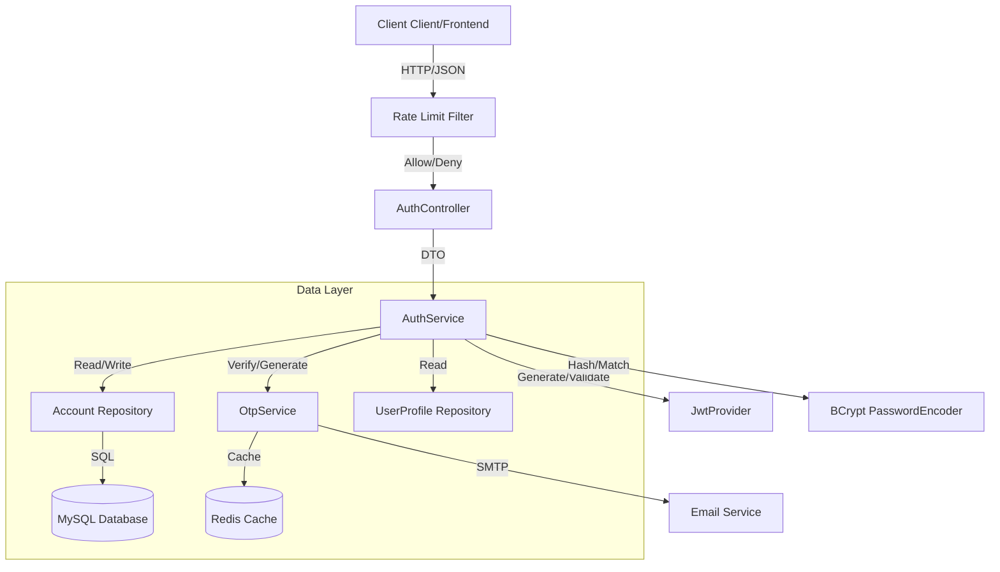
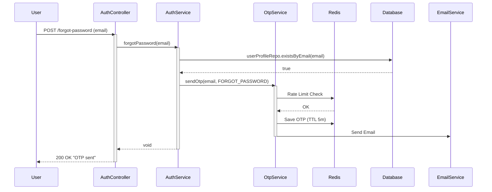
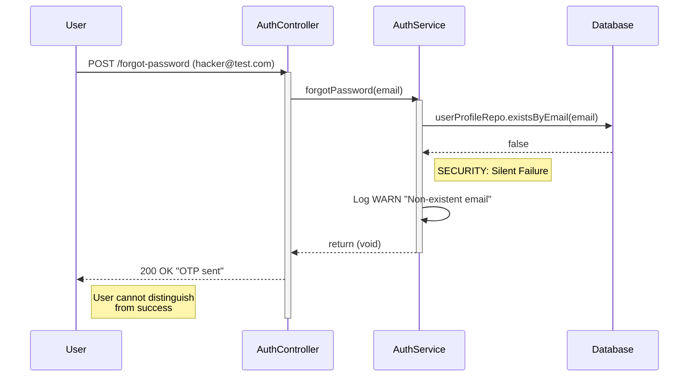
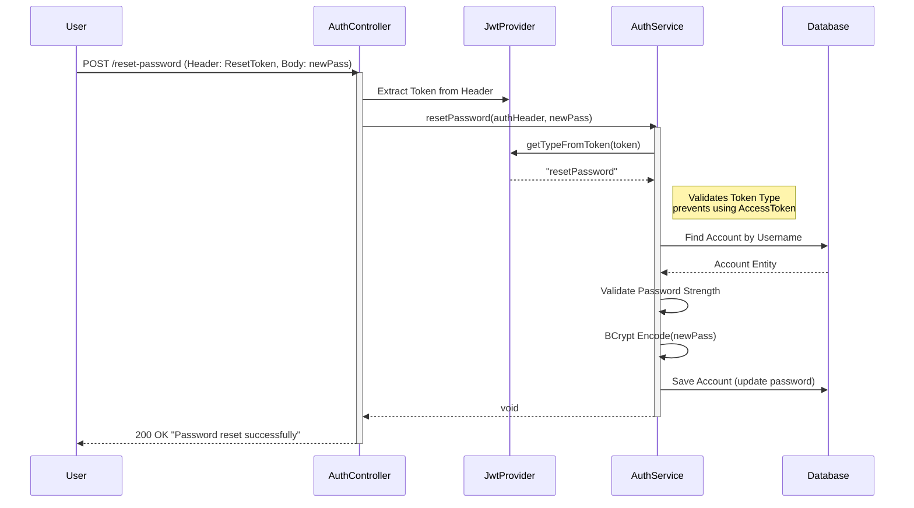
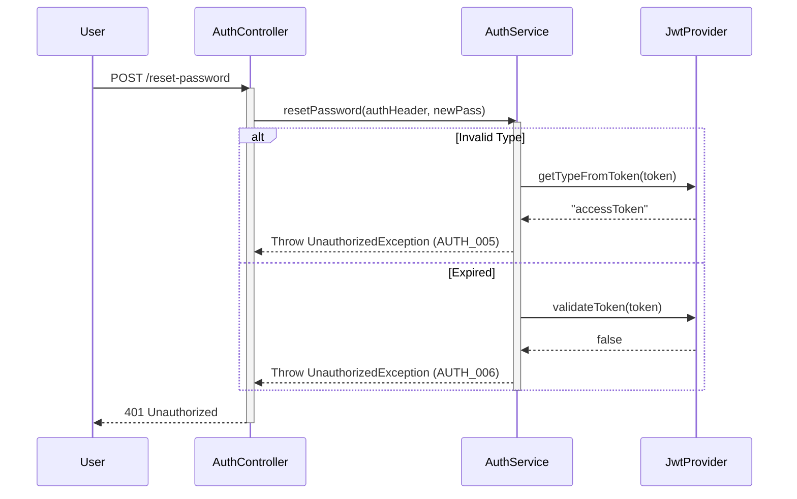
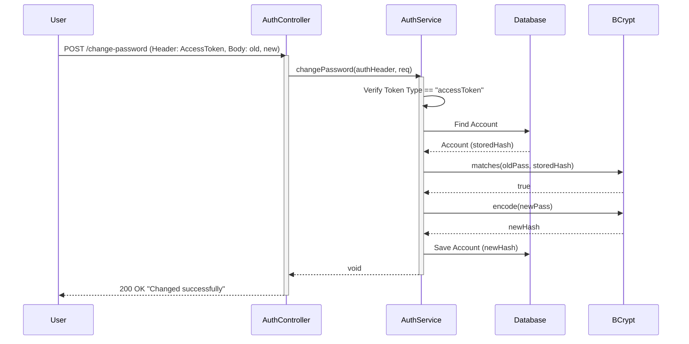
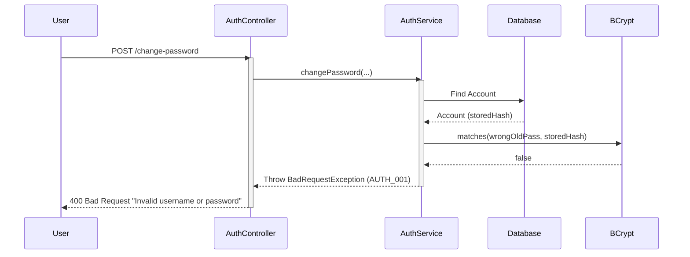
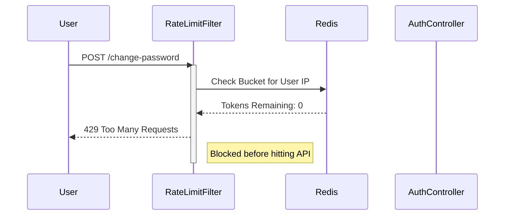

# Password Management Module - Technical Design Document

**Version:** 1.0.0
**Date:** 2026-02-28
**Status:** Approved for Implementation
**Author:** Backend Engineering Team

---

## 1. Executive Summary

The Password Management Module is a critical security component of the Warehouse Management System (WMS). It provides secure, self-service capabilities for users to recover lost credentials and manage their authentication secrets.

This module implements **Defense in Depth** principles, utilizing:
- **Rate Limiting (Redis/Bucket4j):** To prevent Brute Force and Denial of Service attacks.
- **Silent Failure/Success Patterns:** To prevent Email Enumeration attacks.
- **Token Isolation:** Utilizing specialized JWTs (`resetPassword` type) distinct from standard `accessToken` to strictly scope privileges during the reset process.
- **Cryptographic Agility:** Using BCrypt for secure password hashing.

---

## 2. Business Requirements

| ID | Requirement | Description | Priority |
|:---|:---|:---|:---|
| **BR-001** | **Forgot Password** | Users must be able to request a password reset via email OTP without logging in. | Critical |
| **BR-002** | **Security Privacy** | The system must not reveal if an email exists in the database during password recovery (Anti-Enumeration). | Critical |
| **BR-003** | **Reset Password** | Users must be able to set a new password using a verified OTP token. | Critical |
| **BR-004** | **Change Password** | Authenticated users must be able to change their password by providing the old password. | High |
| **BR-005** | **Rate Limiting** | All endpoints must be rate-limited by IP to prevent abuse. | Critical |

---

## 3. Technical Architecture

The module follows a strictly **Layered Architecture** within the Spring Boot ecosystem.

### Component Diagram



---

## 4. API Specifications

### 4.1 Forgot Password
- **Endpoint:** `POST /api/v1/auth/forgot-password`
- **Access:** Public
- **Rate Limit:** 3 requests / 15 mins / IP
- **Input:** `{ "email": "user@example.com" }`
- **Output:** `200 OK` (Always, regardless of email existence)

### 4.2 Verify OTP & Get Token
- **Endpoint:** `POST /api/v1/auth/verify-forgot-password-otp`
- **Access:** Public
- **Rate Limit:** 5 requests / 15 mins / IP
- **Input:** `{ "email": "...", "otp": "..." }`
- **Output:** `200 OK` + JSON `{ "resetToken": "ey..." }`

### 4.3 Reset Password
- **Endpoint:** `POST /api/v1/auth/reset-password`
- **Access:** Authenticated (Requires **Reset Token**)
- **Headers:** `Authorization: Bearer <reset_token>`
- **Input:** `{ "newPassword": "..." }`
- **Output:** `200 OK`

### 4.4 Change Password
- **Endpoint:** `POST /api/v1/auth/change-password`
- **Access:** Authenticated (Requires **Access Token**)
- **Headers:** `Authorization: Bearer <access_token>`
- **Input:** `{ "oldPassword": "...", "newPassword": "..." }`
- **Output:** `200 OK`

---

## 5. Database Schema

The module primarily interacts with the `accounts` and `user_profiles` tables.

```sql
CREATE TABLE `accounts` (
  `id` bigint NOT NULL AUTO_INCREMENT,
  `username` varchar(50) NOT NULL,
  `password` varchar(100) NOT NULL, -- BCrypt Hash
  `status` enum('ACTIVE','INACTIVE','SUSPENDED') NOT NULL,
  `created_at` datetime(6) DEFAULT NULL,
  `updated_at` datetime(6) DEFAULT NULL,
  PRIMARY KEY (`id`),
  UNIQUE KEY `UK_username` (`username`)
);

CREATE TABLE `user_profiles` (
  `id` bigint NOT NULL AUTO_INCREMENT,
  `email` varchar(100) NOT NULL,
  `account_id` bigint NOT NULL,
  -- other profile fields
  PRIMARY KEY (`id`),
  UNIQUE KEY `UK_email` (`email`)
);
```

---

## 6. Detailed Flow Explanation

### 6.1 Silent Success Pattern (Security)
To prevent malicious actors from checking which emails are registered in the system, the `forgotPassword` method checks if the user exists. If the user does **not** exist, the system logs a `WARN` internally but returns `200 OK` to the user, simulating a successful email send operation.

### 6.2 Token Isolation Strategy
We utilize strict Token Type Checking to prevent privilege escalation:
*   **Access Token:** `type: accessToken`. Used for normal API access (Change Password). Cannot be used to Reset Password.
*   **Reset Token:** `type: resetPassword`. Issued only after OTP verification. Has a short TTL (10 mins). Can **only** be used to call the Reset Password endpoint. Cannot access business APIs.

---

## 7. FULL SEQUENCE DIAGRAMS

### 7.1 Forgot Password – Success Flow



### 7.2 Forgot Password – Account Not Found (Security Safe Response)



### 7.3 Reset Password – Success Flow



### 7.4 Reset Password – Token Expired / Invalid Type



### 7.5 Change Password – Success Flow



### 7.6 Change Password – Wrong Current Password



### 7.7 Change Password – Rate Limit Exceeded



---

## 8. Security Architecture

### 8.1 Password Storage
- **Algorithm:** BCrypt (Blowfish Cipher).
- **Work Factor:** 12 (Adjustable via `app.security.strength`).
- **Salt:** Generated automatically by BCrypt per user.

### 8.2 Token Management
| Token | Type Claim | TTL | Purpose |
|:---|:---|:---|:---|
| **Access Token** | `accessToken` | 1 Hour | Accessing business APIs, Changing Password. |
| **Refresh Token** | `refreshToken` | 7 Days | Generating new Access Tokens. |
| **Reset Token** | `resetPassword` | 10 Mins | Strictly for Reset Password endpoint. |

### 8.3 Rate Limiting
Implemented via **Bucket4j** with **Redis** backend.
- **Forgot Password:** Strict limit (3/15min) to prevent email spam.
- **Verify OTP:** Strict limit (5/15min) to prevent brute forcing 6-digit OTP.

---

## 9. Error Handling Table

| Scenario | HTTP Status | Error Code | Message |
|:---|:---|:---|:---|
| Invalid Login | 400 Bad Request | `AUTH_001` | Invalid username or password |
| Account Not Active | 401 Unauthorized | `AUTH_009` | Account is not active |
| Invalid OTP | 400 Bad Request | `OTP_006` | Invalid or expired OTP |
| Token Expired | 401 Unauthorized | `AUTH_006` | Invalid or expired token |
| Wrong Old Password | 400 Bad Request | `AUTH_001` | Invalid username or password |
| Weak New Password | 400 Bad Request | `RESET_003` | Password does not meet security requirements |

---

## 10. Testing Strategy

1.  **Unit Tests:** Mock `AccountRepository` and `JwtProvider` to test `AuthService` logic (especially token type verification).
2.  **Integration Tests:** Use `@SpringBootTest` with Testcontainers (Redis/MySQL) to verify the full flow.
3.  **Security Tests:**
    *   Attempt to use `accessToken` on `/reset-password`.
    *   Attempt to use `resetToken` on `/change-password`.
    *   Spam `/forgot-password` to verify Rate Limiting.

---

## 11. Deployment Considerations

- **Redis Availability:** The Rate Limiting and OTP verification depend on Redis. Ensure Redis is clustered or persistent in production.
- **Environment Variables:**
    - `APP_JWT_RESET_TOKEN_EXPIRATION`: Set to `PT10M` (10 minutes).
    - `APP_JWT_SECRET`: Must be a strong 512-bit key.

---
**End of Document**
