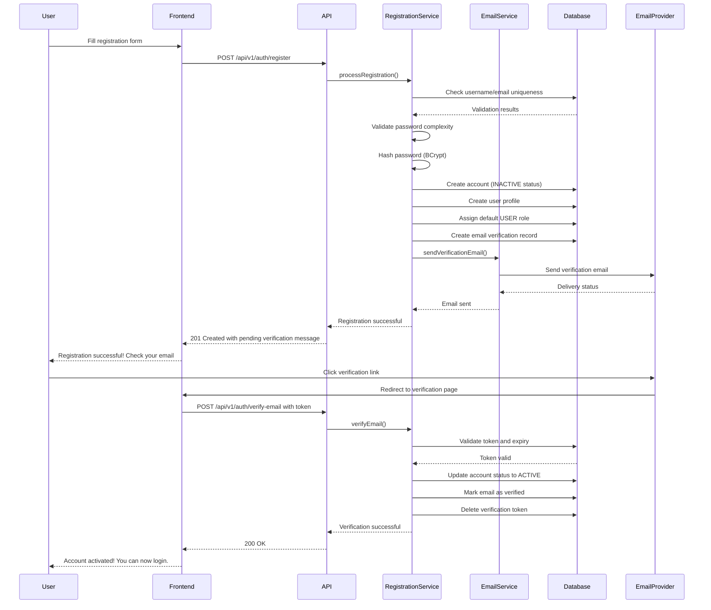

# User Registration Module Documentation
## Warehouse Management System - Auth Module Extension

---

## 📋 Table of Contents
1. [Module Overview](#module-overview)
2. [Business Requirements](#business-requirements)
3. [Technical Architecture](#technical-architecture)
4. [API Endpoints](#api-endpoints)
5. [Database Schema](#database-schema)
6. [Registration Flow](#registration-flow)
7. [Security Considerations](#security-considerations)
8. [Error Handling](#error-handling)
9. [Rate Limiting](#rate-limiting)
10. [Email Integration](#email-integration)
11. [Testing Strategy](#testing-strategy)
12. [Implementation Checklist](#implementation-checklist)

---

## 🎯 Module Overview

### Purpose
The User Registration module extends the existing Auth module to provide secure user account creation capabilities for the Warehouse Management System. This module handles new user registration, email verification, and automatic role assignment.

### Key Features
- ✅ **Secure Registration** - Password hashing, validation, and security checks
- ✅ **Email Verification** - Account activation via email confirmation
- ✅ **Rate Limiting** - Prevent abuse and brute force attacks
- ✅ **Role Assignment** - Automatic assignment of default roles
- ✅ **Audit Trail** - Complete tracking of registration activities
- ✅ **Duplicate Prevention** - Username and email uniqueness validation

---

## 📋 Business Requirements

### Functional Requirements
1. **User Registration**
   - New users can register with username, password, email, and profile information
   - System must validate all input data according to business rules
   - Password must meet security complexity requirements

2. **Email Verification**
   - Users must verify their email address before account activation
   - System sends verification email with secure token
   - Accounts remain INACTIVE until email verification

3. **Profile Creation**
   - Basic user profile is created automatically during registration
   - Profile includes personal information and contact details

4. **Default Role Assignment**
   - New users get assigned default "USER" role
   - Admin can manually upgrade roles after registration

### Non-Functional Requirements
1. **Security**
   - Password hashing with BCrypt
   - Rate limiting on registration endpoints
   - Input validation and sanitization
   - Protection against common attacks (SQL injection, XSS, CSRF)

2. **Performance**
   - Registration response time < 2 seconds
   - Email verification token generation < 500ms
   - Database query optimization

3. **Reliability**
   - Email delivery retry mechanism
   - Transaction rollback on registration failure
   - Graceful handling of email service downtime

---

## 🏗️ Technical Architecture

### Module Components

```
┌─────────────────────────────────────────────────────────────┐
│                    REGISTRATION MODULE                       │
├─────────────────────────────────────────────────────────────┤
│  Controller Layer                                           │
│  ┌─────────────────┐                                        │
│  │ RegistrationController │                                   │
│  └─────────────────┘                                        │
│        │                                                     │
│        ▼                                                     │
│  Service Layer                                              │
│  ┌─────────────────┐  ┌─────────────────┐                   │
│  │RegistrationService│  │ EmailService    │                   │
│  └─────────────────┘  └─────────────────┘                   │
│        │                                                     │
│        ▼                                                     │
│  Repository Layer                                           │
│  ┌─────────────────┐  ┌─────────────────┐                   │
│  │AccountRepository│  │UserProfileRepo  │                   │
│  └─────────────────┘  └─────────────────┘                   │
│        │                                                     │
│        ▼                                                     │
│  Database Layer                                             │
│  ┌─────────────────┐  ┌─────────────────┐                   │
│  │    accounts     │  │ user_profiles   │                   │
│  └─────────────────┘  └─────────────────┘                   │
└─────────────────────────────────────────────────────────────┘
```

### Integration Points
- **Auth Module** - Extends existing authentication infrastructure
- **Email Module** - Uses existing email service for verification
- **Rate Limiting** - Integrates with Redis-based rate limiting
- **Security Module** - Uses existing JWT and security configurations

---

## 🔌 API Endpoints

### 1. User Registration
```http
POST /api/v1/auth/register
Content-Type: application/json
```

**Request Body:**
```json
{
  "username": "john.doe",
  "password": "SecurePass123!",
  "confirmPassword": "SecurePass123!",
  "email": "john.doe@company.com",
  "firstName": "John",
  "lastName": "Doe",
  "phoneNumber": "+1234567890"
}
```

**Response (201 Created):**
```json
{
  "success": true,
  "message": "Registration successful. Please check your email for verification.",
  "data": {
    "username": "john.doe",
    "email": "john.doe@company.com",
    "status": "PENDING_VERIFICATION"
  },
  "timestamp": "2026-01-30T10:30:00Z"
}
```

### 2. Email Verification
```http
POST /api/v1/auth/verify-email
Content-Type: application/json
```

**Request Body:**
```json
{
  "token": "eyJhbGciOiJIUzI1NiIsInR5cCI6IkpXVCJ9..."
}
```

**Response (200 OK):**
```json
{
  "success": true,
  "message": "Email verified successfully. Your account is now active.",
  "data": {
    "username": "john.doe",
    "status": "ACTIVE"
  },
  "timestamp": "2026-01-30T10:35:00Z"
}
```

### 3. Resend Verification Email
```http
POST /api/v1/auth/resend-verification
Content-Type: application/json
```

**Request Body:**
```json
{
  "email": "john.doe@company.com"
}
```

**Response (200 OK):**
```json
{
  "success": true,
  "message": "Verification email has been resent.",
  "timestamp": "2026-01-30T10:40:00Z"
}
```

---

## 🗄️ Database Schema

### New Tables

#### email_verifications
```sql
CREATE TABLE email_verifications (
    id CHAR(36) PRIMARY KEY,
    account_id CHAR(36) NOT NULL,
    token VARCHAR(255) NOT NULL UNIQUE,
    email VARCHAR(100) NOT NULL,
    expires_at TIMESTAMP NOT NULL,
    verified_at TIMESTAMP NULL,
    attempts INT DEFAULT 0,
    max_attempts INT DEFAULT 5,
    created_at TIMESTAMP DEFAULT CURRENT_TIMESTAMP,
    updated_at TIMESTAMP DEFAULT CURRENT_TIMESTAMP ON UPDATE CURRENT_TIMESTAMP,
    
    INDEX idx_account_id (account_id),
    INDEX idx_token (token),
    INDEX idx_email (email),
    INDEX idx_expires_at (expires_at),
    FOREIGN KEY (account_id) REFERENCES accounts(id) ON DELETE CASCADE
) ENGINE=InnoDB DEFAULT CHARSET=utf8mb4 COLLATE=utf8mb4_unicode_ci;
```

### Modified Tables

#### accounts (Add verification-related fields)
```sql
ALTER TABLE accounts 
ADD COLUMN email_verified BOOLEAN DEFAULT FALSE,
ADD COLUMN email_verified_at TIMESTAMP NULL,
ADD INDEX idx_email_verified (email_verified);
```

---

## 🔄 Registration Flow

### Complete Registration Process



### Step-by-Step Flow

#### Phase 1: Registration Request
1. **Input Validation**
   - Validate username format (3-50 chars, alphanumeric + . _ -)
   - Validate password complexity (min 8 chars, uppercase, lowercase, number, special)
   - Validate email format and domain
   - Validate phone number format (optional)

2. **Business Validation**
   - Check username uniqueness
   - Check email uniqueness
   - Validate password confirmation match

3. **Account Creation**
   - Hash password using BCrypt
   - Create Account entity with INACTIVE status
   - Create UserProfile entity with provided information
   - Assign default USER role
   - Generate email verification token

4. **Email Verification**
   - Create EmailVerification record
   - Send verification email with secure link
   - Handle email delivery failures gracefully

#### Phase 2: Email Verification
1. **Token Validation**
   - Validate token format and signature
   - Check token expiry (24 hours)
   - Verify maximum attempts not exceeded

2. **Account Activation**
   - Update account status to ACTIVE
   - Mark email as verified
   - Record verification timestamp
   - Clean up verification token

3. **Notification**
   - Send welcome email (optional)
   - Log successful registration completion

---

## 🔒 Security Considerations

### Password Security
- **BCrypt Hashing** - Default strength 10, configurable
- **Complexity Requirements** - Minimum 8 characters, mixed case, numbers, special chars
- **Password History** - Prevent reuse of last 5 passwords (future enhancement)
- **Secure Transmission** - HTTPS only for all registration endpoints

### Token Security
- **JWT Tokens** - Signed with HS256 algorithm
- **Short Expiry** - Verification tokens expire in 24 hours
- **Single Use** - Tokens deleted after successful verification
- **Secure Generation** - Cryptographically secure random token generation

### Rate Limiting
```java
@RateLimit(
    key = "register",
    limit = 3,
    duration = 300, // 5 minutes
    type = RateLimitType.IP,
    message = "Too many registration attempts. Please try again later.",
    failClosed = true
)
```

### Input Validation
- **SQL Injection Prevention** - Parameterized queries
- **XSS Prevention** - Input sanitization
- **CSRF Protection** - Spring Security CSRF token
- **Email Validation** - RFC 5322 compliant validation

---

## ⚠️ Error Handling

### Error Response Format
```json
{
  "success": false,
  "error": {
    "code": "REG_001",
    "message": "Username already exists",
    "details": "The username 'john.doe' is already taken. Please choose a different username.",
    "timestamp": "2026-01-30T10:30:00Z"
  }
}
```

### Error Codes

| Error Code | Description | HTTP Status |
|------------|-------------|-------------|
| REG_001 | Username already exists | 409 Conflict |
| REG_002 | Email already registered | 409 Conflict |
| REG_003 | Invalid password format | 400 Bad Request |
| REG_004 | Password confirmation mismatch | 400 Bad Request |
| REG_005 | Invalid email format | 400 Bad Request |
| REG_006 | Registration rate limit exceeded | 429 Too Many Requests |
| REG_007 | Email verification failed | 400 Bad Request |
| REG_008 | Verification token expired | 400 Bad Request |
| REG_009 | Maximum verification attempts exceeded | 400 Bad Request |
| REG_010 | Account already verified | 400 Bad Request |

### Exception Handling Strategy
1. **Validation Errors** - Return detailed field-level errors
2. **Business Logic Errors** - Return user-friendly messages
3. **System Errors** - Log detailed error, return generic message
4. **Email Service Failures** - Queue for retry, don't block registration

---

## 🚦 Rate Limiting

### Registration Endpoint
- **Limit**: 3 attempts per 5 minutes per IP address
- **Strategy**: Fail-closed (block if Redis unavailable)
- **Scope**: IP-based to prevent abuse

### Email Verification Endpoint
- **Limit**: 10 attempts per minute per token
- **Strategy**: Fail-open (allow if Redis unavailable)
- **Scope**: Token-based to prevent brute force

### Resend Verification Endpoint
- **Limit**: 3 requests per hour per email address
- **Strategy**: Fail-closed
- **Scope**: Email-based to prevent email spam

### Redis Configuration
```yaml
rate-limit:
  redis:
    key-prefix: "wms:rate-limit:"
    ttl: 300
  fallback:
    enabled: true
    strategy: "FAIL_CLOSED"
```

---

## 📧 Email Integration

### Email Templates

#### Verification Email Template
```html
<!DOCTYPE html>
<html>
<head>
    <meta charset="UTF-8">
    <title>Verify Your Email - WMS</title>
</head>
<body style="font-family: Arial, sans-serif; max-width: 600px; margin: 0 auto;">
    <div style="background-color: #f8f9fa; padding: 20px; text-align: center;">
        <h1 style="color: #007bff;">Warehouse Management System</h1>
        <h2>Email Verification</h2>
    </div>
    
    <div style="padding: 20px;">
        <p>Hello {{firstName}} {{lastName}},</p>
        <p>Thank you for registering with our Warehouse Management System. Please click the button below to verify your email address:</p>
        
        <div style="text-align: center; margin: 30px 0;">
            <a href="{{verificationUrl}}" 
               style="background-color: #007bff; color: white; padding: 12px 30px; 
                      text-decoration: none; border-radius: 5px; display: inline-block;">
                Verify Email Address
            </a>
        </div>
        
        <p>Or copy and paste this link into your browser:</p>
        <p style="background-color: #f8f9fa; padding: 10px; word-break: break-all;">
            {{verificationUrl}}
        </p>
        
        <p><strong>Note:</strong> This verification link will expire in 24 hours.</p>
    </div>
    
    <div style="background-color: #f8f9fa; padding: 20px; text-align: center; font-size: 12px; color: #6c757d;">
        <p>If you didn't create this account, please ignore this email.</p>
        <p>&copy; 2026 Warehouse Management System. All rights reserved.</p>
    </div>
</body>
</html>
```

#### Welcome Email Template (Optional)
```html
<!DOCTYPE html>
<html>
<head>
    <meta charset="UTF-8">
    <title>Welcome to WMS</title>
</head>
<body style="font-family: Arial, sans-serif; max-width: 600px; margin: 0 auto;">
    <div style="background-color: #28a745; padding: 20px; text-align: center;">
        <h1 style="color: white;">Welcome to WMS!</h1>
    </div>
    
    <div style="padding: 20px;">
        <p>Hi {{firstName}} {{lastName}},</p>
        <p>Your account has been successfully activated! You can now:</p>
        <ul>
            <li>Log in to the Warehouse Management System</li>
            <li>Manage inventory and warehouse operations</li>
            <li>Generate reports and analytics</li>
        </ul>
        
        <div style="text-align: center; margin: 30px 0;">
            <a href="{{loginUrl}}" 
               style="background-color: #28a745; color: white; padding: 12px 30px; 
                      text-decoration: none; border-radius: 5px; display: inline-block;">
                Login to Your Account
            </a>
        </div>
    </div>
</body>
</html>
```

### Email Configuration
```yaml
email:
  verification:
    template-name: "email-verification"
    subject: "Verify Your Email - Warehouse Management System"
    from: "noreply@wms-company.com"
    reply-to: "support@wms-company.com"
  welcome:
    template-name: "welcome"
    subject: "Welcome to Warehouse Management System"
    from: "noreply@wms-company.com"
    reply-to: "support@wms-company.com"
```

---

## 🧪 Testing Strategy

### Unit Tests

#### RegistrationService Tests
```java
@ExtendWith(MockitoExtension.class)
class RegistrationServiceTest {
    
    @Mock
    private AccountRepository accountRepository;
    
    @Mock
    private UserProfileRepository userProfileRepository;
    
    @Mock
    private RoleRepository roleRepository;
    
    @Mock
    private PasswordEncoder passwordEncoder;
    
    @Mock
    private EmailService emailService;
    
    @InjectMocks
    private RegistrationServiceImpl registrationService;
    
    @Test
    @DisplayName("Should register user successfully when all validations pass")
    void registerUser_Success() {
        // Given
        RegistrationRequest request = createValidRegistrationRequest();
        when(accountRepository.existsByUsername(request.getUsername())).thenReturn(false);
        when(accountRepository.existsByEmail(request.getEmail())).thenReturn(false);
        when(passwordEncoder.encode(request.getPassword())).thenReturn("hashedPassword");
        when(roleRepository.findByCode("USER")).thenReturn(Optional.of(createUserRole()));
        
        // When
        RegistrationResponse response = registrationService.register(request);
        
        // Then
        assertThat(response.getStatus()).isEqualTo("PENDING_VERIFICATION");
        verify(emailService).sendVerificationEmail(any(), any());
        verify(accountRepository).save(any(Account.class));
        verify(userProfileRepository).save(any(UserProfile.class));
    }
    
    @Test
    @DisplayName("Should throw exception when username already exists")
    void registerUser_UsernameExists() {
        // Given
        RegistrationRequest request = createValidRegistrationRequest();
        when(accountRepository.existsByUsername(request.getUsername())).thenReturn(true);
        
        // When & Then
        assertThatThrownBy(() -> registrationService.register(request))
            .isInstanceOf(RegistrationException.class)
            .hasMessage("Username already exists");
    }
    
    @Test
    @DisplayName("Should throw exception when email already exists")
    void registerUser_EmailExists() {
        // Given
        RegistrationRequest request = createValidRegistrationRequest();
        when(accountRepository.existsByUsername(request.getUsername())).thenReturn(false);
        when(accountRepository.existsByEmail(request.getEmail())).thenReturn(true);
        
        // When & Then
        assertThatThrownBy(() -> registrationService.register(request))
            .isInstanceOf(RegistrationException.class)
            .hasMessage("Email already registered");
    }
}
```

#### Integration Tests
```java
@SpringBootTest(webEnvironment = SpringBootTest.WebEnvironment.RANDOM_PORT)
@TestPropertySource(properties = {
    "spring.datasource.url=jdbc:h2:mem:testdb",
    "spring.jpa.hibernate.ddl-auto=create-drop"
})
class RegistrationControllerIntegrationTest {
    
    @Autowired
    private TestRestTemplate restTemplate;
    
    @Test
    @DisplayName("Should register user and send verification email")
    void registerUser_EndToEnd() {
        // Given
        RegistrationRequest request = createValidRegistrationRequest();
        
        // When
        ResponseEntity<BaseResponse<RegistrationResponse>> response = restTemplate.postForEntity(
            "/api/v1/auth/register", 
            request, 
            new ParameterizedTypeReference<BaseResponse<RegistrationResponse>>() {}
        );
        
        // Then
        assertThat(response.getStatusCode()).isEqualTo(HttpStatus.CREATED);
        assertThat(response.getBody().isSuccess()).isTrue();
        assertThat(response.getBody().getData().getStatus()).isEqualTo("PENDING_VERIFICATION");
    }
}
```

### Test Scenarios

#### Positive Test Cases
1. **Successful Registration** - All valid data
2. **Email Verification** - Valid token
3. **Resend Verification** - Unverified email
4. **Password Complexity** - Meets all requirements

#### Negative Test Cases
1. **Duplicate Username** - Username already exists
2. **Duplicate Email** - Email already registered
3. **Weak Password** - Doesn't meet complexity
4. **Invalid Email** - Malformed email address
5. **Expired Token** - Verification token expired
6. **Invalid Token** - Token not found or invalid
7. **Rate Limiting** - Too many registration attempts

#### Edge Cases
1. **Concurrent Registration** - Same username/email simultaneously
2. **Email Service Down** - Registration succeeds, email queued
3. **Database Failure** - Transaction rollback
4. **Redis Down** - Rate limiting fallback behavior

---

## ✅ Implementation Checklist

### Phase 1: Core Implementation
- [ ] **Create RegistrationRequest DTO**
  - [ ] Username validation (3-50 chars, alphanumeric + . _ -)
  - [ ] Password validation (complexity requirements)
  - [ ] Email validation (RFC 5322 compliant)
  - [ ] Profile information fields

- [ ] **Create RegistrationResponse DTO**
  - [ ] Registration status
  - [ ] User information (non-sensitive)
  - [ ] Timestamp

- [ ] **Implement RegistrationService**
  - [ ] Input validation logic
  - [ ] Business rule validation
  - [ ] Password hashing with BCrypt
  - [ ] Account creation with INACTIVE status
  - [ ] UserProfile creation
  - [ ] Default role assignment
  - [ ] Email verification token generation

- [ ] **Create RegistrationController**
  - [ ] POST /api/v1/auth/register endpoint
  - [ ] Rate limiting configuration
  - [ ] Input validation with @Valid
  - [ ] Error handling

### Phase 2: Email Verification
- [ ] **Create EmailVerification Entity**
  - [ ] Token generation and storage
  - [ ] Expiry handling (24 hours)
  - [ ] Attempt tracking
  - [ ] Account relationship

- [ ] **Implement Email Verification Logic**
  - [ ] Token validation
  - [ ] Account activation
  - [ ] Token cleanup
  - [ ] Verification logging

- [ ] **Create Verification Endpoints**
  - [ ] POST /api/v1/auth/verify-email
  - [ ] POST /api/v1/auth/resend-verification
  - [ ] Rate limiting configuration

### Phase 3: Email Integration
- [ ] **Create Email Templates**
  - [ ] Verification email template
  - [ ] Welcome email template (optional)
  - [ ] Template variables and styling

- [ ] **Enhance EmailService**
  - [ ] Verification email sending
  - [ ] Welcome email sending
  - [ ] Email delivery tracking
  - [ ] Retry mechanism

- [ ] **Email Configuration**
  - [ ] Template configuration
  - [ ] SMTP settings
  - [ ] From/reply-to addresses

### Phase 4: Database Schema
- [ ] **Create Migration Scripts**
  - [ ] email_verifications table
  - [ ] accounts table modifications
  - [ ] Indexes and constraints

- [ ] **Update Entity Classes**
  - [ ] EmailVerification entity
  - [ ] Account entity modifications
  - [ ] Repository interfaces

### Phase 5: Security & Rate Limiting
- [ ] **Implement Security Measures**
  - [ ] Password complexity validation
  - [ ] Input sanitization
  - [ ] SQL injection prevention
  - [ ] XSS protection

- [ ] **Configure Rate Limiting**
  - [ ] Registration endpoint limiting
  - [ ] Verification endpoint limiting
  - [ ] Resend verification limiting
  - [ ] Redis configuration

### Phase 6: Testing
- [ ] **Unit Tests**
  - [ ] RegistrationService tests
  - [ ] EmailVerificationService tests
  - [ ] Validation logic tests
  - [ ] Security tests

- [ ] **Integration Tests**
  - [ ] End-to-end registration flow
  - [ ] Email verification flow
  - [ ] Database integration
  - [ ] Email service integration

- [ ] **Performance Tests**
  - [ ] Registration endpoint performance
  - [ ] Concurrent registration handling
  - [ ] Database query optimization

### Phase 7: Documentation & Deployment
- [ ] **API Documentation**
  - [ ] OpenAPI/Swagger specifications
  - [ ] Request/response examples
  - [ ] Error code documentation

- [ ] **Deployment Preparation**
  - [ ] Environment configuration
  - [ ] Database migration scripts
  - [ ] Monitoring and logging setup
  - [ ] Health checks

### Phase 8: Monitoring & Maintenance
- [ ] **Logging Configuration**
  - [ ] Registration attempt logging
  - [ ] Email delivery logging
  - [ ] Security event logging
  - [ ] Performance metrics

- [ ] **Monitoring Setup**
  - [ ] Registration success/failure rates
  - [ ] Email delivery rates
  - [ ] Rate limiting metrics
  - [ ] Database performance

---

## 📊 Success Metrics

### Registration Metrics
- **Registration Conversion Rate** - % of completed registrations vs started
- **Email Verification Rate** - % of users who verify email
- **Time to Verification** - Average time between registration and verification
- **Registration Success Rate** - % of successful registration attempts

### Security Metrics
- **Failed Registration Attempts** - Number of blocked attempts
- **Rate Limiting Triggers** - Frequency of rate limit activation
- **Security Events** - Suspicious activities detected
- **Password Strength Distribution** - Analysis of password complexity

### Performance Metrics
- **Registration Response Time** - Average API response time
- **Email Delivery Time** - Time from registration to email delivery
- **Database Query Performance** - Query execution times
- **System Resource Usage** - CPU, memory, database connections

---

## 🔮 Future Enhancements

### Short-term (Next 3 months)
- **Social Login Integration** - Google, Microsoft, etc.
- **Multi-factor Authentication** - SMS/Email 2FA
- **Password Reset Flow** - Self-service password recovery
- **Account Lockout Policy** - Automatic lockout after failed attempts

### Medium-term (3-6 months)
- **Role-based Registration** - Different registration flows by role
- **Organization Management** - Company-based user management
- **Bulk User Import** - Excel-based user creation
- **User Profile Enhancement** - Additional profile fields and preferences

### Long-term (6+ months)
- **SSO Integration** - SAML, OAuth 2.0 enterprise integration
- **Advanced Security** - Biometric authentication, device management
- **Analytics Dashboard** - User behavior and system usage analytics
- **API Versioning** - Backward-compatible API evolution

---

## 📞 Support & Maintenance

### Common Issues & Solutions
1. **Email Not Received**
   - Check spam/junk folders
   - Verify email address spelling
   - Check email service status
   - Use resend verification option

2. **Registration Fails**
   - Verify all required fields are filled
   - Check password complexity requirements
   - Ensure username and email are unique
   - Check network connectivity

3. **Verification Link Expired**
   - Use resend verification option
   - Links expire after 24 hours for security
   - Contact support if issues persist

### Support Contact Information
- **Technical Support**: tech-support@wms-company.com
- **Account Issues**: accounts@wms-company.com
- **Security Concerns**: security@wms-company.com

---

## 📝 Version History

| Version | Date | Changes | Author |
|---------|------|---------|--------|
| 1.0.0 | 2026-01-30 | Initial documentation | System Architect |
| 1.0.1 | 2026-01-31 | Added security considerations | Security Team |
| 1.1.0 | 2026-02-01 | Enhanced error handling | Development Team |

---

*This documentation is part of the Warehouse Management System (WMS) technical documentation suite. For related documents, please refer to the main documentation index.*
