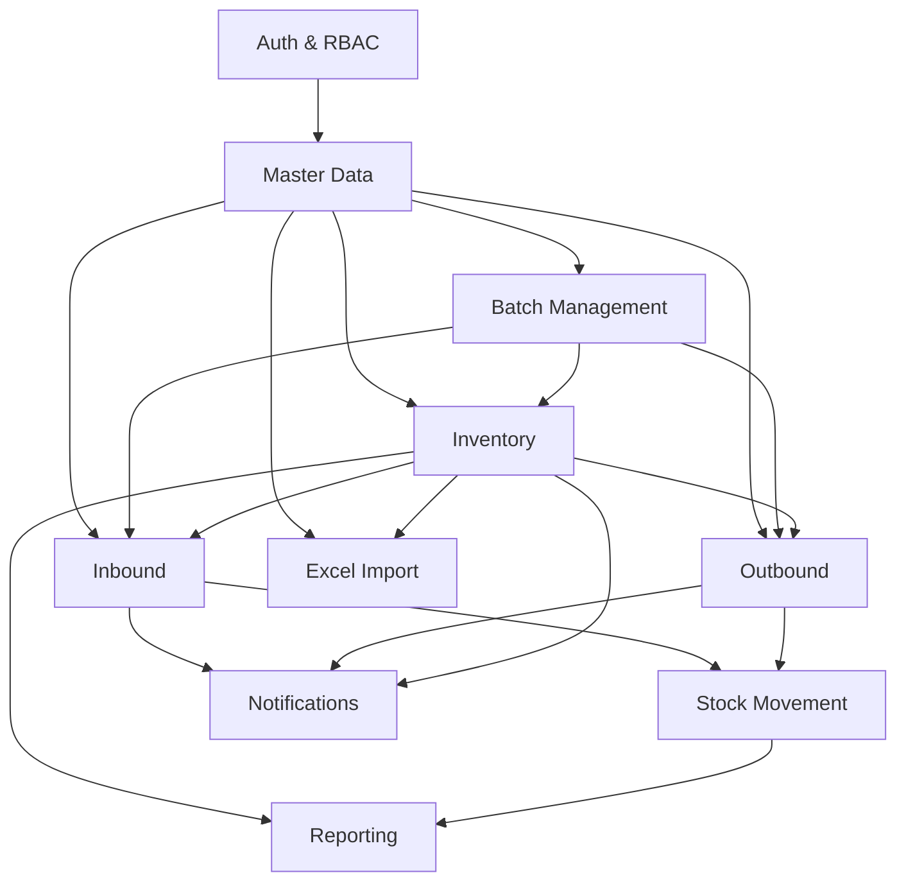

# Kiến Trúc Hệ Thống - Warehouse Management System
## System Architecture & Technical Design

---

## 📋 Mục Lục
1. [Tổng Quan Kiến Trúc](#tổng-quan-kiến-trúc)
2. [Architecture Patterns](#architecture-patterns)
3. [Module Design](#module-design)
4. [Database Design](#database-design)
5. [API Design](#api-design)
6. [Security Architecture](#security-architecture)
7. [Performance & Scalability](#performance--scalability)

---

## 🏗️ Tổng Quan Kiến Trúc

### High-Level Architecture

```
                            ┌─────────────────┐
                            │   API Gateway   │
                            │   (Future)      │
                            └────────┬────────┘
                                     │
                ┌────────────────────┼────────────────────┐
                │                    │                    │
         ┌──────▼──────┐      ┌─────▼─────┐      ┌��─────▼──────┐
         │   Web UI    │      │  Mobile   │      │ External    │
         │  (Future)   │      │  (Future) │      │  Systems    │
         └─────────────┘      └───────────┘      └─────────────┘
                                     │
                            ┌────────▼────────┐
                            │  Spring Boot    │
                            │   Application   │
                            └────────┬────────┘
                                     │
        ┌─────��──────────────────────┼────────────────────────────┐
        │                            │                            │
   ┌────▼─────┐              ┌──────▼──────┐            ┌────────▼────────┐
   │  MySQL   │              │    Redis    │            │    RabbitMQ     │
   │ Database │              │    Cache    │            │ Message Broker  │
   └──────────┘              └─────────────┘            └─────────────────┘
```

### Technology Stack Overview

#### Backend Core
```yaml
Runtime:
  - Java 17 (LTS)
  - JVM Heap: 512MB-2GB (configurable)
  
Framework:
  - Spring Boot 3.5.9
  - Spring MVC (REST APIs)
  - Spring Data JPA (Database Access)
  - Spring Security (Authentication & Authorization)
  - Spring WebSocket (Real-time Communication)
  - Spring AMQP (RabbitMQ Integration)
  
Build Tool:
  - Maven 3.8+
```

#### Data Layer
```yaml
Primary Database:
  - MySQL 8.0
  - InnoDB Engine
  - UTF-8MB4 Charset
  
Cache:
  - Redis 7.0
  - In-memory key-value store
  - TTL-based expiration
  
Message Queue:
  - RabbitMQ 3.x
  - AMQP Protocol
  - Dead Letter Queue support
```

---

## 🎨 Architecture Patterns

### 1. Layered Architecture

```
┌─────────────────────────────────────────────────────────────┐
│                     PRESENTATION LAYER                       │
│  - REST Controllers                                          │
│  - WebSocket Handlers                                        │
│  - Exception Handlers                                        │
│  - Request/Response DTOs                                     │
│  - Input Validation                                          │
└─────────────────────────────────────────────────────────────┘
                              ↓
┌─────────────────────────────────────────────────────────────┐
│                       SERVICE LAYER                          │
│  - Business Logic                                            │
│  - Transaction Management (@Transactional)                   │
│  - Business Validation                                       │
│  - Event Publishing                                          │
│  - Service Interfaces & Implementations                      │
└─────────────────────────────────────────────────────────────┘
                              ↓
┌─────────────────────────────────────────────────────────────┐
│                    PERSISTENCE LAYER                         │
│  - JPA Repositories                                          │
│  - Entity Models                                             │
│  - Query Methods                                             │
│  - Custom Queries (JPQL/Native SQL)                          │
└─────────────────────────────────────────────────────────────┘
                              ↓
┌─────────────────────��───────────────────────────────────────┐
│                   INFRASTRUCTURE LAYER                       │
│  - Database (MySQL)                                          │
│  - Cache (Redis)                                             │
│  - Message Broker (RabbitMQ)                                 │
│  - External Services                                         │
└─────────────────────────────────────────────────────────────┘
```

### 2. Module Pattern

#### Feature-Based Modules
Mỗi module tập trung vào một domain nghiệp vụ cụ thể:

```
org.demo.whs/
├── auth/              # Authentication & Authorization
├── masterdata/        # Master Data Management
├── batch/             # Batch Management
├── inventory/         # Inventory Management
├── inbound/           # Inbound Operations
├── outbound/          # Outbound Operations
├── movement/          # Stock Movement Tracking
├── reporting/         # Report Generation
├── import/            # Excel Import
└── notification/      # Real-time Notifications
```

#### Module Structure Template
```
module/
├── controller/        # REST endpoints
│   └── XxxController.java
├── service/          # Business logic
│   ├── XxxService.java (interface)
│   └── impl/
│       └── XxxServiceImpl.java
├── repository/       # Data access
│   └── XxxRepository.java
├── entity/           # JPA entities
│   └── Xxx.java
├── dto/              # Data transfer objects
│   ├── XxxRequest.java
│   ├── XxxResponse.java
│   └── XxxMapper.java
└── exception/        # Custom exceptions
    └── XxxException.java
```

### 3. Design Patterns Sử Dụng

#### Repository Pattern
```java
@Repository
public interface ProductRepository extends JpaRepository<Product, Long> {
    Optional<Product> findBySku(String sku);
    List<Product> findByStatus(ProductStatus status);
}
```

#### Service Layer Pattern
```java
@Service
@Transactional
public class ProductServiceImpl implements ProductService {
    
    @Autowired
    private ProductRepository productRepository;
    
    @Override
    public ProductResponse createProduct(ProductRequest request) {
        // Business logic here
    }
}
```

#### DTO Pattern (with MapStruct)
```java
@Mapper(componentModel = "spring")
public interface ProductMapper {
    ProductResponse toResponse(Product entity);
    Product toEntity(ProductRequest request);
}
```

#### Builder Pattern (with Lombok)
```java
@Data
@Builder
@NoArgsConstructor
@AllArgsConstructor
public class ProductRequest {
    private String sku;
    private String name;
    private String description;
}
```

---

## 📦 Module Design

### Module Dependencies Graph



### 1. Auth & RBAC Module ✅ (Đã triển khai)

**Trách nhiệm:**
- User authentication với JWT
- Role-based access control
- Token management (access + refresh)
- Rate limiting

**Core Components:**
```
auth/
├── controller/
│   └── AuthController.java
├── service/
│   ├── AuthService.java
│   └── impl/AuthServiceImpl.java
├── security/
│   ├── JwtProvider.java
│   ├── JwtAuthFilter.java
│   ├── CustomUserDetailsService.java
│   └── SecurityConfig.java
├── dto/
│   ├── LoginRequest.java
│   ├── LoginResponse.java
│   └── RefreshTokenRequest.java
└── entity/
    ├── Account.java
    ├── Role.java
    └── Permission.java
```

**API Endpoints:**
```
POST   /api/auth/login          # Login
POST   /api/auth/refresh        # Refresh token
POST   /api/auth/logout         # Logout
GET    /api/auth/me             # Get current user
```

### 2. Master Data Module 🔄 (Cần triển khai)

**Trách nhiệm:**
- Quản lý warehouses, locations, products
- Quản lý units of measure
- Quản lý business partners (suppliers/customers)

**Core Entities:**
```java
// Warehouse
@Entity
@Table(name = "warehouses")
public class Warehouse {
    @Id
    @GeneratedValue(strategy = GenerationType.IDENTITY)
    private Long id;
    
    @Column(unique = true, nullable = false)
    private String code;
    
    private String name;
    private String address;
    
    @Enumerated(EnumType.STRING)
    private WarehouseType type; // MAIN, SATELLITE, TRANSIT
    
    @Enumerated(EnumType.STRING)
    private WarehouseStatus status; // ACTIVE, INACTIVE
}

// Product
@Entity
@Table(name = "products")
public class Product {
    @Id
    @GeneratedValue(strategy = GenerationType.IDENTITY)
    private Long id;
    
    @Column(unique = true, nullable = false)
    private String sku;
    
    private String name;
    private String description;
    
    @ManyToOne
    @JoinColumn(name = "uom_id")
    private UnitOfMeasure uom;
    
    @Enumerated(EnumType.STRING)
    private ProductStatus status;
}
```

**API Endpoints:**
```
# Warehouses
GET    /api/warehouses
POST   /api/warehouses
GET    /api/warehouses/{id}
PUT    /api/warehouses/{id}
DELETE /api/warehouses/{id}

# Products
GET    /api/products
POST   /api/products
GET    /api/products/{id}
PUT    /api/products/{id}
DELETE /api/products/{id}
GET    /api/products/by-sku/{sku}

# Locations
GET    /api/warehouses/{warehouseId}/locations
POST   /api/warehouses/{warehouseId}/locations
```

**Caching Strategy:**
```yaml
Products:
  - Key: "product:sku:{sku}"
  - Key: "product:id:{id}"
  - TTL: 1 hour
  - Eviction: On update/delete

Warehouses:
  - Key: "warehouse:active:list"
  - TTL: 1 hour
  - Eviction: On status change
```

### 3. Inventory Module 🔄 (Cần triển khai)

**Trách nhiệm:**
- Theo dõi tồn kho real-time
- Tính toán available stock (on_hand - reserved)
- Xử lý inventory adjustments
- Ngăn chặn negative stock

**Core Entity:**
```java
@Entity
@Table(name = "inventory")
public class Inventory {
    @Id
    @GeneratedValue(strategy = GenerationType.IDENTITY)
    private Long id;
    
    @ManyToOne
    @JoinColumn(name = "product_id")
    private Product product;
    
    @ManyToOne
    @JoinColumn(name = "warehouse_id")
    private Warehouse warehouse;
    
    @ManyToOne
    @JoinColumn(name = "location_id")
    private Location location;
    
    @ManyToOne
    @JoinColumn(name = "batch_id")
    private Batch batch; // Optional
    
    private BigDecimal onHandQuantity;
    private BigDecimal reservedQuantity;
    
    // available = onHandQuantity - reservedQuantity
    @Formula("on_hand_quantity - reserved_quantity")
    private BigDecimal availableQuantity;
    
    @Version
    private Long version; // Optimistic locking
}
```

**Business Rules:**
```java
public interface InventoryService {
    
    // Increase stock (from inbound)
    void increaseStock(Long productId, Long warehouseId, 
                       Long locationId, BigDecimal quantity);
    
    // Reserve stock (from sales order confirmation)
    void reserveStock(Long productId, Long warehouseId, 
                      BigDecimal quantity);
    
    // Decrease stock (from outbound shipment)
    void decreaseStock(Long productId, Long warehouseId, 
                       Long locationId, BigDecimal quantity);
    
    // Manual adjustment
    void adjustStock(InventoryAdjustmentRequest request);
    
    // Query available stock
    BigDecimal getAvailableStock(Long productId, Long warehouseId);
}
```

**Constraints:**
```sql
-- Prevent negative stock
ALTER TABLE inventory 
ADD CONSTRAINT chk_on_hand_quantity 
CHECK (on_hand_quantity >= 0);

ALTER TABLE inventory 
ADD CONSTRAINT chk_reserved_quantity 
CHECK (reserved_quantity >= 0);
```

### 4. Inbound Module 🔄 (Cần triển khai)

**Flow:**
```
Purchase Order (DRAFT) 
  → Confirm PO (CONFIRMED) 
    → Create Receipt (DRAFT) 
      → Confirm Receipt (CONFIRMED) 
        → Increase Inventory
```

**Core Entities:**
```java
@Entity
@Table(name = "purchase_orders")
public class PurchaseOrder {
    @Id
    @GeneratedValue(strategy = GenerationType.IDENTITY)
    private Long id;
    
    private String orderNumber; // PO-20260121-001
    
    @ManyToOne
    private BusinessPartner supplier;
    
    @ManyToOne
    private Warehouse warehouse;
    
    @Enumerated(EnumType.STRING)
    private PurchaseOrderStatus status; // DRAFT, CONFIRMED, COMPLETED
    
    @OneToMany(mappedBy = "purchaseOrder", cascade = CascadeType.ALL)
    private List<PurchaseOrderLine> lines;
}

@Entity
@Table(name = "inbound_receipts")
public class InboundReceipt {
    @Id
    @GeneratedValue(strategy = GenerationType.IDENTITY)
    private Long id;
    
    private String receiptNumber; // INB-20260121-001
    
    @ManyToOne
    private PurchaseOrder purchaseOrder;
    
    @ManyToOne
    private Warehouse warehouse;
    
    @Enumerated(EnumType.STRING)
    private ReceiptStatus status; // DRAFT, CONFIRMED, COMPLETED
    
    private LocalDateTime confirmedAt;
    
    @OneToMany(mappedBy = "receipt", cascade = CascadeType.ALL)
    private List<InboundReceiptLine> lines;
}
```

**API Flow:**
```
1. POST /api/purchase-orders        # Create PO (DRAFT)
2. PUT /api/purchase-orders/{id}/confirm  # Confirm PO
3. POST /api/inbound-receipts       # Create receipt
4. PUT /api/inbound-receipts/{id}/confirm  # Confirm → Stock++
```

### 5. Outbound Module 🔄 (Cần triển khai)

**Flow:**
```
Sales Order (DRAFT) 
  → Confirm SO (CONFIRMED) [Reserve Stock]
    → Create Shipment (DRAFT) 
      → Pick Items (PICKING) 
        → Confirm Shipment (SHIPPED) [Decrease Stock]
```

**Core Entities:**
```java
@Entity
@Table(name = "sales_orders")
public class SalesOrder {
    @Id
    @GeneratedValue(strategy = GenerationType.IDENTITY)
    private Long id;
    
    private String orderNumber; // SO-20260121-001
    
    @ManyToOne
    private BusinessPartner customer;
    
    @ManyToOne
    private Warehouse warehouse;
    
    @Enumerated(EnumType.STRING)
    private SalesOrderStatus status; // DRAFT, CONFIRMED, COMPLETED
    
    @OneToMany(mappedBy = "salesOrder", cascade = CascadeType.ALL)
    private List<SalesOrderLine> lines;
}

@Entity
@Table(name = "outbound_shipments")
public class OutboundShipment {
    @Id
    @GeneratedValue(strategy = GenerationType.IDENTITY)
    private Long id;
    
    private String shipmentNumber; // SHIP-20260121-001
    
    @ManyToOne
    private SalesOrder salesOrder;
    
    @ManyToOne
    private Warehouse warehouse;
    
    @Enumerated(EnumType.STRING)
    private ShipmentStatus status; // DRAFT, PICKING, PICKED, SHIPPED
    
    private LocalDateTime shippedAt;
}
```

---

## 🗄️ Database Design

### Database Schema Principles

1. **Normalized Design** - 3NF for transactional tables
2. **Audit Trail** - created_at, updated_at, created_by, updated_by
3. **Soft Delete** - Status fields instead of hard deletes
4. **Indexing Strategy** - Index on foreign keys and query fields
5. **Constraints** - Foreign keys, unique constraints, check constraints

### Core Tables Summary

| Table | Purpose | Key Relationships |
|-------|---------|-------------------|
| `accounts` | User accounts | → roles (M:N) |
| `roles` | User roles | → permissions (M:N) |
| `warehouses` | Warehouse locations | → locations (1:N) |
| `products` | Product catalog | → uom (N:1) |
| `inventory` | Stock levels | → product, warehouse, location, batch |
| `purchase_orders` | Purchase orders | → supplier, warehouse |
| `inbound_receipts` | Goods receipts | → purchase_order, warehouse |
| `sales_orders` | Sales orders | → customer, warehouse |
| `outbound_shipments` | Shipments | → sales_order, warehouse |
| `stock_movements` | Audit trail | → product, warehouse, location |

### Indexing Strategy

```sql
-- High-frequency queries
CREATE INDEX idx_product_sku ON products(sku);
CREATE INDEX idx_inventory_product_warehouse ON inventory(product_id, warehouse_id);
CREATE INDEX idx_stock_movements_product_date ON stock_movements(product_id, created_at);
CREATE INDEX idx_purchase_orders_status ON purchase_orders(status);
CREATE INDEX idx_inbound_receipts_status ON inbound_receipts(status);

-- Composite indexes for common joins
CREATE INDEX idx_inventory_composite ON inventory(product_id, warehouse_id, location_id);
```

---

## 🔐 Security Architecture

### 1. Authentication Flow

```
┌──────────┐                                    ┌──────────────┐
│  Client  │                                    │   Backend    │
└─────┬────┘                                    └──────┬───────┘
      │                                                │
      │  POST /api/auth/login                         │
      │  { username, password }                       │
      ├──────────────────────────────────────────────>│
      │                                                │
      │                               Validate credentials
      │                               Generate JWT tokens
      │                               Store refresh token in Redis
      │                                                │
      │  { accessToken, refreshToken, expiresIn }     │
      │<──────────────────────────────────────────────┤
      │                                                │
      │  GET /api/products                            │
      │  Authorization: Bearer {accessToken}          │
      ├──────────────────────────────────────────────>│
      │                                                │
      │                               Validate JWT
      │                               Extract user info
      │                               Check permissions
      │                                                │
      │  { data: [...] }                              │
      │<──────────────────────────────────────────────┤
```

### 2. Authorization (RBAC)

```java
@PreAuthorize("hasPermission('PRODUCT', 'CREATE')")
public ProductResponse createProduct(ProductRequest request) {
    // Implementation
}

@PreAuthorize("hasRole('ADMIN') or hasRole('WAREHOUSE_MANAGER')")
public void approveAdjustment(Long adjustmentId) {
    // Implementation
}
```

### 3. Rate Limiting

```java
@RateLimit(limit = 5, duration = 60) // 5 requests per 60 seconds
@PostMapping("/login")
public ResponseEntity<LoginResponse> login(@RequestBody LoginRequest request) {
    // Implementation
}
```

---

## ⚡ Performance & Scalability

### 1. Caching Strategy

```yaml
Layer 1 - Application Cache (Redis):
  Products:
    - TTL: 1 hour
    - Pattern: "product:sku:{sku}"
    
  Warehouses:
    - TTL: 1 hour
    - Pattern: "warehouse:active:list"
    
  Inventory:
    - TTL: 5 minutes
    - Pattern: "inventory:product:{id}:warehouse:{id}"

Layer 2 - Database Query Cache:
  - Hibernate Second-Level Cache
  - Query Result Cache
```

### 2. Async Processing (RabbitMQ)

```yaml
Queues:
  report-generation-queue:
    - Purpose: Generate large reports
    - Consumer: ReportWorker
    
  import-processing-queue:
    - Purpose: Process Excel imports
    - Consumer: ImportWorker
    
  notification-queue:
    - Purpose: Send notifications
    - Consumer: NotificationWorker
```

### 3. Database Optimization

- **Connection Pooling**: HikariCP (default 10 connections)
- **Query Optimization**: Use JPA Projections for read queries
- **Batch Operations**: Use `saveAll()` for bulk inserts
- **Pagination**: Always paginate list endpoints

---

**Cập nhật lần cuối:** 21/01/2026  
**Version:** 1.0

