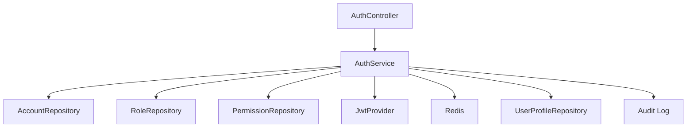

# Module 0: User & RBAC (Authentication & Authorization)

---

## 1. Mục đích & Phạm vi

Module này cung cấp các chức năng quản lý người dùng, xác thực (authentication), phân quyền (authorization) dựa trên vai trò (RBAC), và kiểm soát truy cập cho toàn bộ hệ thống WMS.

- Đăng nhập, đăng xuất, làm mới token (JWT)
- Quản lý tài khoản, vai trò, quyền hạn
- Áp dụng rate limit cho các endpoint nhạy cảm
- Lưu vết audit, bảo mật thông tin

---

## 2. Kiến trúc tổng quan

- Spring Boot 3, Spring Security, JWT
- Redis: lưu blacklist token, rate limit
- Database: MySQL/PostgreSQL
- Layered: Controller → Service → Entity → Repository

### Sơ đồ thành phần


---

## 3. Thực thể chính

| Entity         | Mô tả                                 |
|---------------|----------------------------------------|
| Account       | Tài khoản đăng nhập, trạng thái, mật khẩu (băm) |
| Role          | Vai trò hệ thống (ADMIN, USER, ... )   |
| Permission    | Quyền thao tác (resource + action)      |
| UserProfile   | Thông tin cá nhân mở rộng cho Account   |

### Quan hệ
- Account ⬄ Role: N-N (account_roles)
- Role ⬄ Permission: N-N (role_permissions)
- Account ⬄ UserProfile: 1-1

---

## 4. Database Schema

### Bảng chính
```sql
CREATE TABLE accounts (
    id CHAR(36) PRIMARY KEY,
    username VARCHAR(50) NOT NULL UNIQUE,
    password VARCHAR(100) NOT NULL,
    status ENUM('ACTIVE', 'INACTIVE', 'SUSPENDED', 'DELETED') DEFAULT 'ACTIVE',
    created_at TIMESTAMP DEFAULT CURRENT_TIMESTAMP,
    updated_at TIMESTAMP DEFAULT CURRENT_TIMESTAMP ON UPDATE CURRENT_TIMESTAMP,
    created_by VARCHAR(50),
    updated_by VARCHAR(50)
);

CREATE TABLE roles (
    id CHAR(36) PRIMARY KEY,
    code VARCHAR(50) NOT NULL UNIQUE,
    name ENUM('ADMIN', 'USER') NOT NULL UNIQUE,
    description TEXT,
    created_at TIMESTAMP DEFAULT CURRENT_TIMESTAMP,
    updated_at TIMESTAMP DEFAULT CURRENT_TIMESTAMP ON UPDATE CURRENT_TIMESTAMP,
    created_by VARCHAR(50),
    updated_by VARCHAR(50)
);

CREATE TABLE permissions (
    id CHAR(36) PRIMARY KEY,
    code VARCHAR(50) NOT NULL UNIQUE,
    name VARCHAR(100) NOT NULL UNIQUE,
    description TEXT,
    created_at TIMESTAMP DEFAULT CURRENT_TIMESTAMP,
    updated_at TIMESTAMP DEFAULT CURRENT_TIMESTAMP ON UPDATE CURRENT_TIMESTAMP,
    created_by VARCHAR(50),
    updated_by VARCHAR(50)
);

CREATE TABLE account_roles (
    account_id CHAR(36),
    role_id CHAR(36),
    PRIMARY KEY (account_id, role_id),
    FOREIGN KEY (account_id) REFERENCES accounts(id) ON DELETE CASCADE,
    FOREIGN KEY (role_id) REFERENCES roles(id) ON DELETE CASCADE
);

CREATE TABLE role_permissions (
    role_id CHAR(36),
    permission_id CHAR(36),
    PRIMARY KEY (role_id, permission_id),
    FOREIGN KEY (role_id) REFERENCES roles(id) ON DELETE CASCADE,
    FOREIGN KEY (permission_id) REFERENCES permissions(id) ON DELETE CASCADE
);

CREATE TABLE user_profiles (
    id CHAR(36) PRIMARY KEY,
    account_id CHAR(36) UNIQUE,
    first_name VARCHAR(50),
    last_name VARCHAR(50),
    email VARCHAR(100) NOT NULL UNIQUE,
    phone_number VARCHAR(15),
    address VARCHAR(255),
    date_of_birth DATE,
    created_at TIMESTAMP DEFAULT CURRENT_TIMESTAMP,
    updated_at TIMESTAMP DEFAULT CURRENT_TIMESTAMP ON UPDATE CURRENT_TIMESTAMP,
    created_by VARCHAR(50),
    updated_by VARCHAR(50),
    FOREIGN KEY (account_id) REFERENCES accounts(id) ON DELETE CASCADE
);
```

### Seed mẫu
```sql
-- Admin account
INSERT INTO accounts (id, username, password, status) VALUES (UUID(), 'admin', '$2a$10$...', 'ACTIVE');
-- Roles
INSERT INTO roles (id, code, name, description) VALUES (UUID(), 'ROLE_ADMIN', 'ADMIN', 'Administrator role');
INSERT INTO roles (id, code, name, description) VALUES (UUID(), 'ROLE_USER', 'USER', 'Standard user role');
-- Gán role cho admin
INSERT INTO account_roles (account_id, role_id) SELECT a.id, r.id FROM accounts a JOIN roles r ON r.name = 'ADMIN' WHERE a.username = 'admin';
-- User profile
INSERT INTO user_profiles (id, account_id, first_name, last_name, email) SELECT UUID(), a.id, 'System', 'Administrator', 'admin@whs.local' FROM accounts a WHERE a.username = 'admin';
```

---

## 5. API Endpoints chính

| Method | Endpoint           | Mô tả                  |
|--------|--------------------|------------------------|
| POST   | /api/auth/login    | Đăng nhập, trả về JWT  |
| POST   | /api/auth/refresh  | Làm mới access token   |
| POST   | /api/auth/logout   | Đăng xuất, revoke token|
| GET    | /api/auth/me       | Lấy thông tin user     |

### Sample Request/Response
```http
POST /api/auth/login
{
  "username": "admin",
  "password": "yourpassword"
}

Response:
{
  "accessToken": "...",
  "refreshToken": "...",
  "expiresIn": 3600,
  "user": {
    "id": "...",
    "username": "admin",
    "roles": ["ADMIN"]
  }
}
```

---

## 6. Luồng xác thực & phân quyền

### 6.1 Đăng nhập & sinh JWT
1. User gửi username/password
2. Hệ thống xác thực, sinh access token + refresh token (JWT)
3. Token trả về cho client, lưu ở localStorage/cookie

#### Chi tiết xử lý:
- Nếu sai mật khẩu hoặc user bị khóa/sai trạng thái → trả về lỗi 401/403.
- Token JWT chứa thông tin userId, roles, exp, issuedAt.
- Refresh token có TTL dài hơn, lưu ở Redis để kiểm soát revoke.

#### Ví dụ lỗi:
```json
{
    "error": "AUTH_INVALID_CREDENTIALS",
    "message": "Username or password is incorrect"
}
```

### 6.2 Refresh token
1. Client gửi refresh token
2. Hệ thống kiểm tra hợp lệ, sinh access token mới
3. Nếu refresh token hết hạn hoặc bị revoke (có trong Redis blacklist) → trả về lỗi 401.

#### Flow bảo mật:
- Refresh token chỉ dùng 1 lần (one-time), sau khi dùng sẽ bị revoke.
- Nếu phát hiện reuse token → khóa tài khoản, log audit.

#### Ví dụ lỗi:
```json
{
    "error": "AUTH_TOKEN_EXPIRED",
    "message": "Refresh token expired or revoked"
}
```

### 6.3 Logout
1. Client gửi request logout
2. Token bị revoke (thêm vào blacklist Redis)

#### Lưu ý:
- Access token vẫn còn hiệu lực đến khi hết hạn, nhưng sẽ bị từ chối nếu có trong blacklist.
- Audit log ghi nhận thời điểm logout, userId, IP.

### 6.4 Phân quyền RBAC
- Mỗi API gắn annotation @PreAuthorize hoặc @Secured
- Kiểm tra role/permission trước khi xử lý
- Mapping: Account ⬄ Role ⬄ Permission

#### Ví dụ annotation:
```java
@PreAuthorize("hasRole('ADMIN')")
public ResponseEntity<?> getAllUsers() { ... }

@PreAuthorize("hasAuthority('PRODUCT:CREATE')")
public ResponseEntity<?> createProduct(...) { ... }
```

#### Mapping thực tế:
- Account có thể có nhiều Role (ADMIN, USER, ...)
- Role có nhiều Permission (theo resource:action, ví dụ PRODUCT:CREATE, WAREHOUSE:UPDATE)
- Khi login, hệ thống load roles & permissions vào JWT claims và SecurityContext.

#### Response khi thiếu quyền:
```json
{
    "error": "ACCESS_DENIED",
    "message": "You do not have permission to perform this action"
}
```

#### Cấu hình mẫu Spring Security:
```java
@Configuration
@EnableWebSecurity
public class SecurityConfig extends WebSecurityConfigurerAdapter {
        @Override
        protected void configure(HttpSecurity http) throws Exception {
                http
                        .csrf().disable()
                        .authorizeRequests()
                                .antMatchers("/api/auth/**").permitAll()
                                .antMatchers("/api/admin/**").hasRole("ADMIN")
                                .anyRequest().authenticated()
                        .and()
                        .addFilterBefore(jwtAuthFilter, UsernamePasswordAuthenticationFilter.class);
        }
}
```

#### Custom UserDetails:
```java
public class CustomUserDetails implements UserDetails {
        private final Account account;
        private final List<String> roles;
        // ...
        @Override
        public Collection<? extends GrantedAuthority> getAuthorities() {
                return roles.stream().map(SimpleGrantedAuthority::new).toList();
        }
        // ...
}
```

#### JWT Filter:
- Kiểm tra token hợp lệ, load user, set SecurityContext.
- Nếu token không hợp lệ hoặc hết hạn → clear context, trả về 401.

#### Rate Limiting:
- Áp dụng annotation @RateLimit cho các endpoint nhạy cảm (login, refresh, ...)
- Redis lưu số lần request theo IP/user.
- Ví dụ: 5 lần/phút cho login, 100 lần/phút cho API thường.

#### Audit & Logging:
- Ghi log khi đăng nhập, logout, đổi mật khẩu, thay đổi quyền.
- Không log password/token ra file log.
- Lưu IP, user agent, thời gian.

#### Best Practices:
- Không hardcode secret/key trong code, dùng biến môi trường.
- Mật khẩu luôn hash (BCrypt), không lưu plain text.
- Tất cả bảng đều có created_at, updated_at.
- Không trả về thông tin nhạy cảm (password, token) qua API.
- Xử lý lỗi rõ ràng, trả về error code + message.

---

## 10. Lỗi thường gặp & cách xử lý

| Lỗi                        | Nguyên nhân & Cách xử lý                  |
|----------------------------|-------------------------------------------|
| AUTH_INVALID_CREDENTIALS   | Sai username/password, trả về 401         |
| AUTH_TOKEN_EXPIRED         | Token hết hạn, yêu cầu login lại           |
| ACCESS_DENIED              | Không đủ quyền, trả về 403                |
| ACCOUNT_LOCKED             | User bị khóa, liên hệ admin               |
| RATE_LIMIT_EXCEEDED        | Vượt quá số lần cho phép, chờ retry       |

---

### 6.5 Rate Limiting
- Áp dụng cho endpoint login, refresh, v.v. (Redis)
- Ví dụ: 5 lần/phút cho login

---

## 7. Quy tắc bảo mật & audit
- Mật khẩu lưu dạng hash (BCrypt)
- Không trả về thông tin nhạy cảm qua API
- Log audit khi đăng nhập/thay đổi thông tin
- Không hardcode secret, dùng cấu hình môi trường
- Tất cả bảng đều có trường created_at, updated_at

---

## 8. Phụ lục

### 8.1 Ví dụ migration Flyway
```sql
-- V1__init_auth_tables.sql
CREATE TABLE ...
-- V10__seed_initial_data.sql
INSERT INTO ...
```

### 8.2 Sample Role/Permission Mapping
| Role   | Permission                |
|--------|---------------------------|
| ADMIN  | ALL                       |
| USER   | VIEW_PROFILE, UPDATE_SELF |

---

## 9. Tài liệu tham khảo
- [Spring Security Docs](https://docs.spring.io/spring-security/)
- [JWT RFC 7519](https://datatracker.ietf.org/doc/html/rfc7519)
- [OWASP Authentication Cheat Sheet](https://cheatsheetseries.owasp.org/cheatsheets/Authentication_Cheat_Sheet.html)
