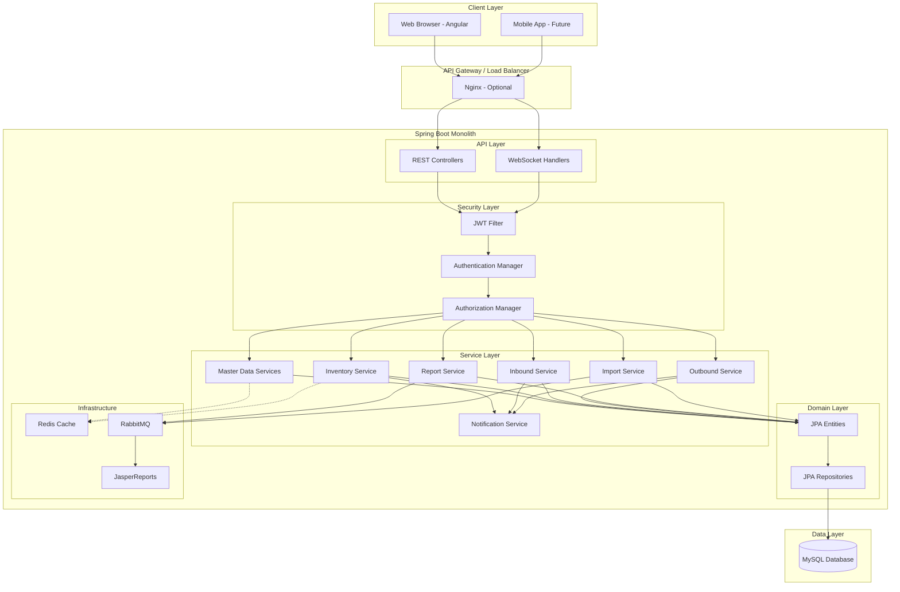
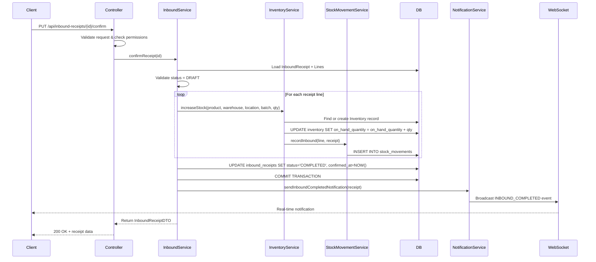
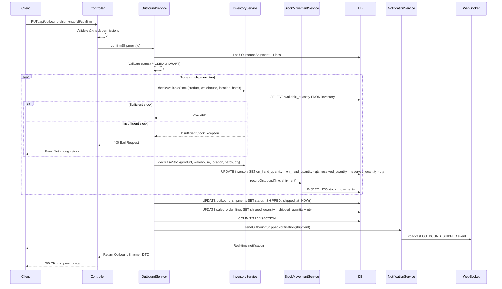
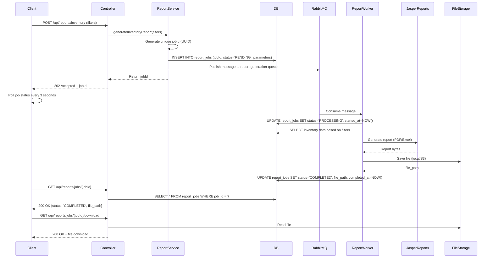
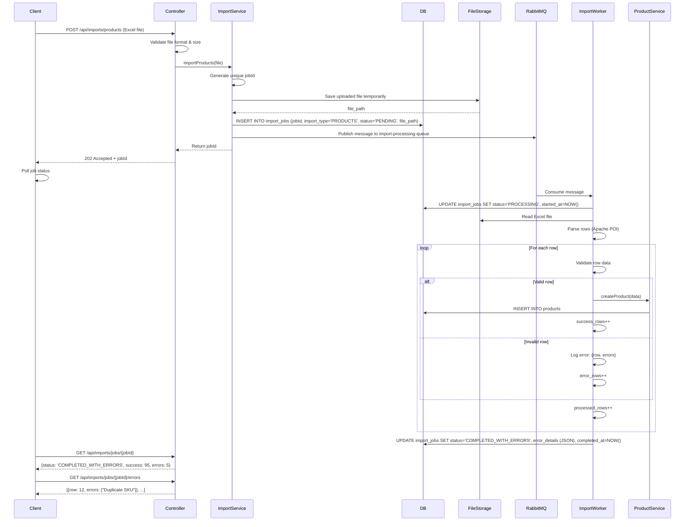

Warehouse Management System (WMS) - Version 1 System Document
Backend-Focused Architecture & Design Guide

1. Overview & Goals
   1.1 Business Context (Business Analyst Role)
   A Warehouse Management System (WMS) is a software application designed to support and optimize warehouse operations. It manages the movement and storage of inventory within a warehouse, from the moment goods arrive (inbound) until they leave (outbound).
   Core warehouse operations:

Receiving goods from suppliers (inbound process)
Storing inventory in designated locations
Tracking stock levels in real-time across multiple warehouses
Picking and packing items for customer orders
Shipping goods to customers (outbound process)
Auditing all movements for compliance and accuracy

This WMS supports a single company operating multiple warehouses, with the ability to track inventory at the warehouse and location level, with optional batch tracking for traceability.
1.2 Goals of Version 1
Primary Goals:

✅ Implement complete inbound flow (purchase orders → goods receipt → stock increase)
✅ Implement complete outbound flow (sales orders → shipment → stock decrease)
✅ Maintain accurate inventory tracking with full audit trail
✅ Support basic batch tracking (batch numbers, optional expiry)
✅ Provide real-time stock visibility across warehouses and locations
✅ Generate essential reports (inventory snapshot, transaction history) with PDF/Excel export
✅ Enable bulk data import via Excel (products, initial stock)
✅ Send real-time notifications for key events (WebSocket)
✅ Ensure data consistency and prevent negative stock scenarios

Non-Goals for V1:

❌ Complex FIFO/FEFO logic (batch expiry tracking exists but not enforced)
❌ Deep location hierarchy (aisle/rack/bin - only simple zones)
❌ Multi-tenancy (single company only)
❌ Advanced warehouse optimization (wave picking, task management, route optimization)
❌ Integration with external ERP or e-commerce systems
❌ Mobile apps for warehouse staff (web UI only)
❌ Advanced analytics and dashboards

1.3 Main Actors
ActorRoleKey ResponsibilitiesAdminSystem administratorManage users, roles, permissions, system configurationWarehouse ManagerOperations managerOversee all warehouse operations, approve adjustments, run reportsWarehouse StaffOperational usersProcess inbound receipts, pick/pack/ship outbound orders, perform stock countsViewer/AuditorRead-only accessView inventory, transactions, and reports for compliance/auditing
1.4 Main Flows in Version 1

Master Data Management: Configure warehouses, locations, products, business partners
Purchase & Inbound: Create purchase orders → receive goods → increase inventory
Sales & Outbound: Create sales orders → pick items → ship → decrease inventory
Inventory Management: View stock levels, adjust inventory, track by batch/location
Stock Movement Audit: Track all inventory changes with full traceability
Reporting & Export: Generate inventory and transaction reports, export to PDF/Excel
Bulk Import: Import products and initial stock via Excel files
Real-time Notifications: Receive WebSocket updates for key events


2. Backend Modules in Version 1
   2.1 Module Overview (System Architect Role)
   The Spring Boot monolith is organized into feature-based modules, each responsible for a specific business domain. Modules communicate through well-defined service interfaces and maintain clear boundaries.
   2.2 Module Details
   Module 1: Auth & RBAC (Already Implemented)
   Purpose: User authentication, authorization, and access control
   Main Responsibilities:

User login with username/password
JWT token generation (access + refresh tokens)
Token validation and refresh
Role-based access control (RBAC)
Rate limiting on authentication endpoints

Main Entities:

Account, Role, Permission, UserProfile

Key Endpoints:

POST /api/auth/login - User login
POST /api/auth/refresh - Refresh access token
POST /api/auth/logout - Invalidate tokens
GET /api/auth/me - Get current user info

Dependencies: Redis (token blacklist, rate limiting)

Module 2: Master Data
Purpose: Manage core configuration data for warehouse operations
Main Responsibilities:

Warehouse configuration (name, address, type, status)
Location setup within warehouses (simple zones)
Product catalog management (SKU, name, description, UOM)
Unit of measure definitions
Business partner management (suppliers and customers)

Main Entities:

Warehouse, Location, Product, UnitOfMeasure, BusinessPartner

Key Endpoints:

GET/POST/PUT/DELETE /api/warehouses - Warehouse CRUD
GET/POST/PUT/DELETE /api/locations - Location CRUD (filtered by warehouse)
GET/POST/PUT/DELETE /api/products - Product CRUD
GET/POST/PUT/DELETE /api/uoms - Unit of measure CRUD
GET/POST/PUT/DELETE /api/business-partners - Supplier/Customer CRUD

Dependencies: None (foundation module)
Caching Strategy (Redis):

Cache frequently accessed products (by SKU or ID)
Cache active warehouses list
Cache UOM mappings
TTL: 1 hour, invalidate on update


Module 3: Batch Management (Minimal)
Purpose: Track product batches for traceability
Main Responsibilities:

Create and manage batch records
Associate batches with products
Track batch numbers and optional expiry dates
Query inventory by batch

Main Entities:

Batch (batch_number, product, manufacture_date, expiry_date)

Key Endpoints:

GET/POST /api/batches - Batch CRUD
GET /api/batches/by-product/{productId} - List batches for a product
GET /api/batches/expiring-soon - Find batches expiring within X days

Dependencies: Master Data (Product)
Note for V1: Batch tracking is optional during inbound/outbound. FIFO/FEFO logic is NOT enforced but the data model supports future implementation.

Module 4: Inventory
Purpose: Track and manage current stock levels across all warehouses
Main Responsibilities:

Maintain real-time stock levels (on-hand, reserved, available)
Support stock queries by product, warehouse, location, batch
Handle inventory adjustments (manual corrections, damage, loss)
Calculate available stock (on_hand - reserved)
Prevent negative stock scenarios

Main Entities:

Inventory (composite key: product + warehouse + location + batch)
InventoryAdjustment (manual stock changes with reason)

Key Endpoints:

GET /api/inventory - Query inventory with filters (product, warehouse, location, batch)
GET /api/inventory/available/{productId} - Check available stock for a product
POST /api/inventory/adjust - Manual inventory adjustment
GET /api/inventory/low-stock - Products below minimum threshold

Key Business Rules:

available_quantity = on_hand_quantity - reserved_quantity
All stock changes must create a StockMovement record
Adjustments require approval (based on role/amount threshold)
Negative stock is prevented at database level (check constraint)

Dependencies: Master Data, Batch Management, Stock Movements

Module 5: Inbound (Purchase & Goods Receipt)
Purpose: Manage the receiving of goods from suppliers
Main Responsibilities:

Create and manage purchase orders
Record goods receipts against purchase orders
Increase inventory upon receipt confirmation
Track inbound status lifecycle
Link receipts to batches (optional)

Main Entities:

PurchaseOrder, PurchaseOrderLine
InboundReceipt, InboundReceiptLine

Key Endpoints:

GET/POST/PUT /api/purchase-orders - PO management
PUT /api/purchase-orders/{id}/confirm - Confirm PO (makes it official)
POST /api/inbound-receipts - Create receipt (can be draft)
PUT /api/inbound-receipts/{id}/confirm - Confirm receipt → increase stock
DELETE /api/inbound-receipts/{id}/cancel - Cancel receipt

Status Flow:

PurchaseOrder: DRAFT → CONFIRMED → COMPLETED / CANCELLED
InboundReceipt: DRAFT → CONFIRMED → COMPLETED / CANCELLED

Key Business Rules:

Receipt cannot exceed PO quantity (validation)
Confirming receipt increases inventory.on_hand_quantity
Each receipt line creates a StockMovement with type INBOUND
Receipt must reference a valid warehouse and location
Optional: associate receipt lines with batch numbers

Dependencies: Master Data, Inventory, Batch, Stock Movements

Module 6: Outbound (Sales & Shipments)
Purpose: Manage the shipment of goods to customers
Main Responsibilities:

Create and manage sales orders
Reserve stock for confirmed orders
Create shipments (picking/packing)
Decrease inventory upon shipment confirmation
Track outbound status lifecycle
Handle partial shipments

Main Entities:

SalesOrder, SalesOrderLine
OutboundShipment, OutboundShipmentLine

Key Endpoints:

GET/POST/PUT /api/sales-orders - SO management
PUT /api/sales-orders/{id}/confirm - Confirm SO → reserve stock
POST /api/outbound-shipments - Create shipment
PUT /api/outbound-shipments/{id}/pick - Mark as picked
PUT /api/outbound-shipments/{id}/confirm - Confirm shipment → decrease stock
DELETE /api/outbound-shipments/{id}/cancel - Cancel shipment → unreserve stock

Status Flow:

SalesOrder: DRAFT → CONFIRMED → COMPLETED / CANCELLED
OutboundShipment: DRAFT → PICKING → PICKED → SHIPPED / CANCELLED

Key Business Rules:

Confirming SO reserves stock (inventory.reserved_quantity increases)
Cannot ship more than available stock
Confirming shipment decreases inventory.on_hand_quantity and reserved_quantity
Each shipment line creates a StockMovement with type OUTBOUND
Support partial shipments (ship less than ordered quantity)
Cancelling unreserves stock

Dependencies: Master Data, Inventory, Batch, Stock Movements

Module 7: Stock Movements & Audit
Purpose: Maintain a complete, immutable audit trail of all inventory changes
Main Responsibilities:

Record every stock change (increase, decrease, adjustment, transfer)
Link movements to source documents (inbound receipt, outbound shipment, adjustment)
Support audit queries and reconciliation
Enable historical stock reconstruction

Main Entities:

StockMovement (immutable log of all changes)

Key Endpoints:

GET /api/stock-movements - Query movements with filters (date range, product, warehouse, type)
GET /api/stock-movements/by-document/{documentType}/{documentId} - Movements for specific document
GET /api/stock-movements/by-product/{productId} - Product movement history

Movement Types:

INBOUND - From inbound receipt
OUTBOUND - From outbound shipment
ADJUSTMENT - From manual adjustment
TRANSFER - Between warehouses/locations (future)

Key Business Rules:

Movements are insert-only (never updated or deleted)
Every inventory change must create a corresponding movement
Movements include: product, warehouse, location, batch, quantity_change (+/-), reference document
Movements are created in the same transaction as inventory updates
Audit fields: created_at, created_by

Dependencies: All modules that change inventory

Module 8: Reporting & Export
Purpose: Generate business reports and export data to PDF/Excel
Main Responsibilities:

Generate inventory snapshot reports (current stock levels)
Generate transaction history reports (inbound/outbound)
Support complex filtering (date range, warehouse, product, status)
Export reports to PDF (JasperReports) and Excel
Handle long-running reports asynchronously via RabbitMQ

Main Entities:

ReportJob (tracks async report generation)

Key Endpoints:

POST /api/reports/inventory - Generate inventory report (returns job ID)
POST /api/reports/inbound-history - Generate inbound history report
POST /api/reports/outbound-history - Generate outbound history report
GET /api/reports/jobs/{jobId} - Get report job status
GET /api/reports/jobs/{jobId}/download - Download completed report file

Report Types:

Inventory Snapshot: Current stock by product/warehouse/location/batch
Inbound History: All receipts within date range with filters
Outbound History: All shipments within date range with filters
Stock Movement Report: Detailed movement log with filters

Async Flow (for large reports):

Client calls report API with filters
Backend creates ReportJob record (status: PENDING)
Backend publishes message to RabbitMQ queue report-generation-queue
Worker consumes message, generates report via JasperReports
Worker uploads file to storage (local/S3) and updates job (status: COMPLETED)
Client polls job status and downloads file when ready

Dependencies: All data modules, RabbitMQ, JasperReports

Module 9: Excel Import
Purpose: Bulk import data from Excel files
Main Responsibilities:

Import products from Excel (SKU, name, description, UOM, etc.)
Import initial stock levels from Excel
Validate data before import
Handle partial failures (log errors per row)
Process imports asynchronously via RabbitMQ

Main Entities:

ImportJob (tracks import job status and errors)

Key Endpoints:

POST /api/imports/products - Upload Excel file to import products
POST /api/imports/initial-stock - Upload Excel file to import stock
GET /api/imports/jobs/{jobId} - Get import job status
GET /api/imports/jobs/{jobId}/errors - Get error details (failed rows)

Async Flow:

Client uploads Excel file
Backend validates file format (headers, basic structure)
Backend creates ImportJob record (status: PENDING)
Backend stores file temporarily and publishes message to RabbitMQ queue import-processing-queue
Worker consumes message, reads Excel row by row
Worker validates each row (business rules, foreign keys)
Worker saves valid rows, logs errors for invalid rows
Worker updates job status (COMPLETED / COMPLETED_WITH_ERRORS / FAILED)
Client checks job status and reviews errors

Validation Rules (Products Import):

SKU must be unique
Product name required
UOM must exist in database
Valid data types and formats

Validation Rules (Stock Import):

Product SKU must exist
Warehouse code must exist
Location code must exist (if provided)
Quantity must be positive
Batch number format validation (if provided)

Dependencies: Master Data, Inventory, Batch, RabbitMQ

Module 10: Real-time Notifications
Purpose: Send real-time updates to connected clients via WebSocket
Main Responsibilities:

Push notifications for key events (inbound completed, outbound shipped, low stock alerts)
Support user-specific and broadcast notifications
Maintain WebSocket connections

Key Events:

INBOUND_COMPLETED - When inbound receipt is confirmed
OUTBOUND_SHIPPED - When outbound shipment is confirmed
LOW_STOCK_ALERT - When product falls below minimum threshold
ADJUSTMENT_CREATED - When manual adjustment is made
IMPORT_JOB_COMPLETED - When Excel import finishes
REPORT_JOB_COMPLETED - When report is ready for download

WebSocket Endpoint:

ws://localhost:8080/ws/notifications - Connect to notification stream

Message Format:
json{
"eventType": "INBOUND_COMPLETED",
"timestamp": "2026-01-19T10:30:00Z",
"message": "Inbound receipt #INB-00123 completed",
"data": {
"receiptId": 123,
"receiptNumber": "INB-00123",
"warehouseId": 1,
"totalItems": 5
}
}
Implementation Notes:

Use Spring WebSocket with STOMP protocol
Notifications sent directly from service layer after successful transaction commit
No RabbitMQ in notification path (for V1 simplicity)
Client subscribes to /topic/notifications (broadcast) or /user/queue/notifications (personal)

Dependencies: All business modules (trigger events)

2.3 Module Dependency Graph
mermaidgraph TD
Auth[Auth & RBAC]
Master[Master Data]
Batch[Batch Management]
Inventory[Inventory]
Inbound[Inbound]
Outbound[Outbound]
Movement[Stock Movements]
Report[Reporting]
Import[Excel Import]
Notify[Notifications]

    Batch --> Master
    Inventory --> Master
    Inventory --> Batch
    Inbound --> Master
    Inbound --> Batch
    Inbound --> Inventory
    Inbound --> Movement
    Outbound --> Master
    Outbound --> Batch
    Outbound --> Inventory
    Outbound --> Movement
    Report --> Inventory
    Report --> Movement
    Import --> Master
    Import --> Inventory
    Notify --> Inbound
    Notify --> Outbound
    Notify --> Inventory

3. Database Design & Tables in Version 1
   3.1 High-Level ERD (Database Designer Role)
   mermaiderDiagram
   ACCOUNTS ||--o{ ACCOUNT_ROLES : has
   ROLES ||--o{ ACCOUNT_ROLES : assigned_to
   ROLES ||--o{ ROLE_PERMISSIONS : has
   PERMISSIONS ||--o{ ROLE_PERMISSIONS : granted_in
   ACCOUNTS ||--o| USER_PROFILES : has

   WAREHOUSES ||--o{ LOCATIONS : contains
   PRODUCTS ||--o{ BATCHES : has
   PRODUCTS }o--|| UNITS_OF_MEASURE : measured_in

   BUSINESS_PARTNERS ||--o{ PURCHASE_ORDERS : supplies
   WAREHOUSES ||--o{ PURCHASE_ORDERS : receives_at
   PURCHASE_ORDERS ||--o{ PURCHASE_ORDER_LINES : contains
   PRODUCTS ||--o{ PURCHASE_ORDER_LINES : ordered

   PURCHASE_ORDERS ||--o{ INBOUND_RECEIPTS : received_via
   WAREHOUSES ||--o{ INBOUND_RECEIPTS : received_at
   INBOUND_RECEIPTS ||--o{ INBOUND_RECEIPT_LINES : contains
   PRODUCTS ||--o{ INBOUND_RECEIPT_LINES : received
   BATCHES ||--o{ INBOUND_RECEIPT_LINES : received_as
   LOCATIONS ||--o{ INBOUND_RECEIPT_LINES : stored_in

   BUSINESS_PARTNERS ||--o{ SALES_ORDERS : buys
   WAREHOUSES ||--o{ SALES_ORDERS : ships_from
   SALES_ORDERS ||--o{ SALES_ORDER_LINES : contains
   PRODUCTS ||--o{ SALES_ORDER_LINES : ordered

   SALES_ORDERS ||--o{ OUTBOUND_SHIPMENTS : shipped_via
   WAREHOUSES ||--o{ OUTBOUND_SHIPMENTS : ships_from
   OUTBOUND_SHIPMENTS ||--o{ OUTBOUND_SHIPMENT_LINES : contains
   PRODUCTS ||--o{ OUTBOUND_SHIPMENT_LINES : shipped
   BATCHES ||--o{ OUTBOUND_SHIPMENT_LINES : shipped_as
   LOCATIONS ||--o{ OUTBOUND_SHIPMENT_LINES : picked_from

   PRODUCTS ||--o{ INVENTORY : tracked
   WAREHOUSES ||--o{ INVENTORY : stored_in
   LOCATIONS ||--o{ INVENTORY : located_at
   BATCHES ||--o{ INVENTORY : batched_as

   PRODUCTS ||--o{ STOCK_MOVEMENTS : moved
   WAREHOUSES ||--o{ STOCK_MOVEMENTS : moved_in
   LOCATIONS ||--o{ STOCK_MOVEMENTS : moved_at
   BATCHES ||--o{ STOCK_MOVEMENTS : moved_as

   ACCOUNTS ||--o{ INVENTORY_ADJUSTMENTS : created_by
   PRODUCTS ||--o{ INVENTORY_ADJUSTMENTS : adjusted
   WAREHOUSES ||--o{ INVENTORY_ADJUSTMENTS : adjusted_in

   REPORT_JOBS }o--|| ACCOUNTS : created_by
   IMPORT_JOBS }o--|| ACCOUNTS : created_by
   3.2 Table Definitions by Domain
   3.2.1 Auth & Users (Already Implemented)
   accounts
   sqlCREATE TABLE accounts (
   id BIGINT PRIMARY KEY AUTO_INCREMENT,
   username VARCHAR(50) UNIQUE NOT NULL,
   password_hash VARCHAR(255) NOT NULL,
   email VARCHAR(100) UNIQUE NOT NULL,
   status ENUM('ACTIVE', 'INACTIVE', 'LOCKED') DEFAULT 'ACTIVE',
   failed_login_attempts INT DEFAULT 0,
   locked_until TIMESTAMP NULL,
   created_at TIMESTAMP DEFAULT CURRENT_TIMESTAMP,
   updated_at TIMESTAMP DEFAULT CURRENT_TIMESTAMP ON UPDATE CURRENT_TIMESTAMP,
   INDEX idx_username (username),
   INDEX idx_email (email),
   INDEX idx_status (status)
   );
   roles
   sqlCREATE TABLE roles (
   id BIGINT PRIMARY KEY AUTO_INCREMENT,
   name VARCHAR(50) UNIQUE NOT NULL,
   description VARCHAR(255),
   created_at TIMESTAMP DEFAULT CURRENT_TIMESTAMP,
   updated_at TIMESTAMP DEFAULT CURRENT_TIMESTAMP ON UPDATE CURRENT_TIMESTAMP
   );
   permissions
   sqlCREATE TABLE permissions (
   id BIGINT PRIMARY KEY AUTO_INCREMENT,
   name VARCHAR(100) UNIQUE NOT NULL,
   resource VARCHAR(50) NOT NULL,
   action VARCHAR(50) NOT NULL,
   description VARCHAR(255),
   created_at TIMESTAMP DEFAULT CURRENT_TIMESTAMP,
   UNIQUE KEY uk_resource_action (resource, action)
   );
   account_roles (Many-to-Many)
   sqlCREATE TABLE account_roles (
   account_id BIGINT NOT NULL,
   role_id BIGINT NOT NULL,
   assigned_at TIMESTAMP DEFAULT CURRENT_TIMESTAMP,
   PRIMARY KEY (account_id, role_id),
   FOREIGN KEY (account_id) REFERENCES accounts(id) ON DELETE CASCADE,
   FOREIGN KEY (role_id) REFERENCES roles(id) ON DELETE CASCADE
   );
   role_permissions (Many-to-Many)
   sqlCREATE TABLE role_permissions (
   role_id BIGINT NOT NULL,
   permission_id BIGINT NOT NULL,
   granted_at TIMESTAMP DEFAULT CURRENT_TIMESTAMP,
   PRIMARY KEY (role_id, permission_id),
   FOREIGN KEY (role_id) REFERENCES roles(id) ON DELETE CASCADE,
   FOREIGN KEY (permission_id) REFERENCES permissions(id) ON DELETE CASCADE
   );
   user_profiles
   sqlCREATE TABLE user_profiles (
   id BIGINT PRIMARY KEY AUTO_INCREMENT,
   account_id BIGINT UNIQUE NOT NULL,
   first_name VARCHAR(50) NOT NULL,
   last_name VARCHAR(50) NOT NULL,
   phone VARCHAR(20),
   avatar_url VARCHAR(255),
   created_at TIMESTAMP DEFAULT CURRENT_TIMESTAMP,
   updated_at TIMESTAMP DEFAULT CURRENT_TIMESTAMP ON UPDATE CURRENT_TIMESTAMP,
   FOREIGN KEY (account_id) REFERENCES accounts(id) ON DELETE CASCADE
   );

3.2.2 Master Data
warehouses
sqlCREATE TABLE warehouses (
id BIGINT PRIMARY KEY AUTO_INCREMENT,
code VARCHAR(20) UNIQUE NOT NULL,
name VARCHAR(100) NOT NULL,
address VARCHAR(255),
city VARCHAR(50),
state VARCHAR(50),
country VARCHAR(50),
postal_code VARCHAR(20),
type ENUM('MAIN', 'SATELLITE', 'TRANSIT') DEFAULT 'MAIN',
status ENUM('ACTIVE', 'INACTIVE') DEFAULT 'ACTIVE',
manager_id BIGINT,
created_at TIMESTAMP DEFAULT CURRENT_TIMESTAMP,
updated_at TIMESTAMP DEFAULT CURRENT_TIMESTAMP ON UPDATE CURRENT_TIMESTAMP,
created_by BIGINT,
updated_by BIGINT,
INDEX idx_code (code),
INDEX idx_status (status),
FOREIGN KEY (manager_id) REFERENCES accounts(id),
FOREIGN KEY (created_by) REFERENCES accounts(id),
FOREIGN KEY (updated_by) REFERENCES accounts(id)
);
Design Notes:

code: Short, unique identifier for easy reference (e.g., "WH-MAIN", "WH-EAST")
type: Categorizes warehouse purpose
status: Soft delete pattern - inactive warehouses are hidden but data preserved
Audit fields: created_by, updated_by track who made changes


locations
sqlCREATE TABLE locations (
id BIGINT PRIMARY KEY AUTO_INCREMENT,
warehouse_id BIGINT NOT NULL,
code VARCHAR(50) NOT NULL,
name VARCHAR(100) NOT NULL,
zone VARCHAR(50),
type ENUM('RECEIVING', 'STORAGE', 'PICKING', 'SHIPPING', 'QUARANTINE') DEFAULT 'STORAGE',
status ENUM('ACTIVE', 'INACTIVE') DEFAULT 'ACTIVE',
capacity_qty DECIMAL(15,3),
current_qty DECIMAL(15,3) DEFAULT 0,
created_at TIMESTAMP DEFAULT CURRENT_TIMESTAMP,
updated_at TIMESTAMP DEFAULT CURRENT_TIMESTAMP ON UPDATE CURRENT_TIMESTAMP,
created_by BIGINT,
updated_by BIGINT,
UNIQUE KEY uk_warehouse_code (warehouse_id, code),
INDEX idx_warehouse_zone (warehouse_id, zone),
INDEX idx_status (status),
FOREIGN KEY (warehouse_id) REFERENCES warehouses(id),
FOREIGN KEY (created_by) REFERENCES accounts(id),
FOREIGN KEY (updated_by) REFERENCES accounts(id)
);
Design Notes:

code: Unique within a warehouse (e.g., "ZONE-A-01", "RECEIVING-01")
zone: Simple grouping (e.g., "Zone A", "Zone B") without deep hierarchy
type: Functional area designation
capacity_qty and current_qty: Optional capacity tracking (not enforced in V1)
Composite unique key ensures no duplicate location codes in same warehouse


units_of_measure
sqlCREATE TABLE units_of_measure (
id BIGINT PRIMARY KEY AUTO_INCREMENT,
code VARCHAR(20) UNIQUE NOT NULL,
name VARCHAR(50) NOT NULL,
type ENUM('PIECE', 'WEIGHT', 'VOLUME', 'LENGTH') DEFAULT 'PIECE',
base_unit_id BIGINT,
conversion_factor DECIMAL(15,6),
created_at TIMESTAMP DEFAULT CURRENT_TIMESTAMP,
updated_at TIMESTAMP DEFAULT CURRENT_TIMESTAMP ON UPDATE CURRENT_TIMESTAMP,
INDEX idx_code (code),
FOREIGN KEY (base_unit_id) REFERENCES units_of_measure(id)
);
Design Notes:

Supports UOM conversions (e.g., 1 BOX = 12 PIECES)
base_unit_id: Reference to base unit for conversion
conversion_factor: Multiplier to convert to base unit
Example: Code="BOX", base_unit="PIECE", conversion_factor=12


products
sqlCREATE TABLE products (
id BIGINT PRIMARY KEY AUTO_INCREMENT,
sku VARCHAR(50) UNIQUE NOT NULL,
name VARCHAR(200) NOT NULL,
description TEXT,
category VARCHAR(50),
uom_id BIGINT NOT NULL,
unit_price DECIMAL(15,2),
cost_price DECIMAL(15,2),
weight DECIMAL(10,3),
dimensions VARCHAR(50),
is_batch_tracked BOOLEAN DEFAULT FALSE,
is_serialized BOOLEAN DEFAULT FALSE,
min_stock_level DECIMAL(15,3),
max_stock_level DECIMAL(15,3),
status ENUM('ACTIVE', 'INACTIVE', 'DISCONTINUED') DEFAULT 'ACTIVE',
created_at TIMESTAMP DEFAULT CURRENT_TIMESTAMP,
updated_at TIMESTAMP DEFAULT CURRENT_TIMESTAMP ON UPDATE CURRENT_TIMESTAMP,
created_by BIGINT,
updated_by BIGINT,
INDEX idx_sku (sku),
INDEX idx_category (category),
INDEX idx_status (status),
FULLTEXT idx_name_desc (name, description),
FOREIGN KEY (uom_id) REFERENCES units_of_measure(id),
FOREIGN KEY (created_by) REFERENCES accounts(id),
FOREIGN KEY (updated_by) REFERENCES accounts(id)
);
Design Notes:

sku: Stock Keeping Unit, unique identifier
is_batch_tracked: Flag indicating if product requires batch management
is_serialized: Future flag for serial number tracking (not implemented in V1)
min_stock_level and max_stock_level: Thresholds for low/high stock alerts
unit_price vs cost_price: Selling price vs acquisition cost
FULLTEXT index on name/description for fast search


business_partners
sqlCREATE TABLE business_partners (
id BIGINT PRIMARY KEY AUTO_INCREMENT,
code VARCHAR(20) UNIQUE NOT NULL,
name VARCHAR(200) NOT NULL,
type ENUM('SUPPLIER', 'CUSTOMER', 'BOTH') NOT NULL,
contact_person VARCHAR(100),
email VARCHAR(100),
phone VARCHAR(20),
address VARCHAR(255),
city VARCHAR(50),
state VARCHAR(50),
country VARCHAR(50),
postal_code VARCHAR(20),
tax_id VARCHAR(50),
payment_terms VARCHAR(50),
credit_limit DECIMAL(15,2),
status ENUM('ACTIVE', 'INACTIVE') DEFAULT 'ACTIVE',
created_at TIMESTAMP DEFAULT CURRENT_TIMESTAMP,
updated_at TIMESTAMP DEFAULT CURRENT_TIMESTAMP ON UPDATE CURRENT_TIMESTAMP,
created_by BIGINT,
updated_by BIGINT,
INDEX idx_code (code),
INDEX idx_type (type),
INDEX idx_status (status),
FOREIGN KEY (created_by) REFERENCES accounts(id),
FOREIGN KEY (updated_by) REFERENCES accounts(id)
);
Design Notes:

Single table for both suppliers and customers (discriminated by type)
type='BOTH': Entity that is both supplier and customer
credit_limit: For customer credit control (future use)
payment_terms: E.g., "NET30", "COD"

3.2.3 Inventory & Batch
batches
sqlCREATE TABLE batches (
id BIGINT PRIMARY KEY AUTO_INCREMENT,
product_id BIGINT NOT NULL,
batch_number VARCHAR(50) NOT NULL,
manufacture_date DATE,
expiry_date DATE,
supplier_batch_ref VARCHAR(50),
notes TEXT,
status ENUM('ACTIVE', 'QUARANTINE', 'EXPIRED', 'CONSUMED') DEFAULT 'ACTIVE',
created_at TIMESTAMP DEFAULT CURRENT_TIMESTAMP,
updated_at TIMESTAMP DEFAULT CURRENT_TIMESTAMP ON UPDATE CURRENT_TIMESTAMP,
created_by BIGINT,
UNIQUE KEY uk_product_batch (product_id, batch_number),
INDEX idx_expiry (expiry_date),
INDEX idx_status (status),
FOREIGN KEY (product_id) REFERENCES products(id),
FOREIGN KEY (created_by) REFERENCES accounts(id)
);

**Design Notes:**
- `batch_number`: Unique per product (not globally unique)
- `expiry_date`: For FEFO logic (future), alerts when approaching expiry
- `status='QUARANTINE'`: Batch held for quality inspection
- Composite unique key prevents duplicate batch numbers for same product

---

**inventory**
```sql
CREATE TABLE inventory (
    id BIGINT PRIMARY KEY AUTO_INCREMENT,
    product_id BIGINT NOT NULL,
    warehouse_id BIGINT NOT NULL,
    location_id BIGINT,
    batch_id BIGINT,
    on_hand_quantity DECIMAL(15,3) NOT NULL DEFAULT 0,
    reserved_quantity DECIMAL(15,3) NOT NULL DEFAULT 0,
    available_quantity DECIMAL(15,3) GENERATED ALWAYS AS (on_hand_quantity - reserved_quantity) STORED,
    last_movement_at TIMESTAMP,
    created_at TIMESTAMP DEFAULT CURRENT_TIMESTAMP,
    updated_at TIMESTAMP DEFAULT CURRENT_TIMESTAMP ON UPDATE CURRENT_TIMESTAMP,
    version BIGINT DEFAULT 0,
    UNIQUE KEY uk_product_warehouse_location_batch (product_id, warehouse_id, COALESCE(location_id, 0), COALESCE(batch_id, 0)),
    INDEX idx_product (product_id),
    INDEX idx_warehouse (warehouse_id),
    INDEX idx_location (location_id),
    INDEX idx_batch (batch_id),
    INDEX idx_available (available_quantity),
    FOREIGN KEY (product_id) REFERENCES products(id),
    FOREIGN KEY (warehouse_id) REFERENCES warehouses(id),
    FOREIGN KEY (location_id) REFERENCES locations(id),
    FOREIGN KEY (batch_id) REFERENCES batches(id),
    CONSTRAINT chk_non_negative_onhand CHECK (on_hand_quantity >= 0),
    CONSTRAINT chk_non_negative_reserved CHECK (reserved_quantity >= 0),
    CONSTRAINT chk_valid_reservation CHECK (reserved_quantity <= on_hand_quantity)
);
```

**Design Notes (CRITICAL):**
- **Composite unique key**: One inventory record per combination of product + warehouse + location + batch
    - Uses `COALESCE(location_id, 0)` to handle NULL locations
    - Uses `COALESCE(batch_id, 0)` to handle NULL batches
- **on_hand_quantity**: Physical stock present in warehouse
- **reserved_quantity**: Stock allocated to confirmed orders but not yet shipped
- **available_quantity**: Computed column (on_hand - reserved) - automatically maintained by DB
- **version**: Optimistic locking field for concurrent update handling
- **Check constraints**: Prevent negative stock scenarios at database level
- **last_movement_at**: Timestamp of most recent stock change (for aging analysis)

**Why this design?**
- Flexible enough to support batch tracking without forcing it
- Computed `available_quantity` ensures consistency
- Database constraints are the last line of defense against data corruption
- Unique key structure allows:
    - Stock without location: (product, warehouse, NULL, NULL)
    - Stock with location: (product, warehouse, location, NULL)
    - Stock with batch: (product, warehouse, NULL, batch)
    - Stock with both: (product, warehouse, location, batch)

---

**inventory_adjustments**
```sql
CREATE TABLE inventory_adjustments (
    id BIGINT PRIMARY KEY AUTO_INCREMENT,
    adjustment_number VARCHAR(50) UNIQUE NOT NULL,
    product_id BIGINT NOT NULL,
    warehouse_id BIGINT NOT NULL,
    location_id BIGINT,
    batch_id BIGINT,
    adjustment_type ENUM('INCREASE', 'DECREASE') NOT NULL,
    quantity DECIMAL(15,3) NOT NULL,
    reason_code VARCHAR(50) NOT NULL,
    reason_description TEXT,
    status ENUM('DRAFT', 'APPROVED', 'REJECTED', 'COMPLETED') DEFAULT 'DRAFT',
    approved_by BIGINT,
    approved_at TIMESTAMP,
    created_at TIMESTAMP DEFAULT CURRENT_TIMESTAMP,
    created_by BIGINT NOT NULL,
    INDEX idx_adjustment_number (adjustment_number),
    INDEX idx_product (product_id),
    INDEX idx_warehouse (warehouse_id),
    INDEX idx_status (status),
    INDEX idx_created_at (created_at),
    FOREIGN KEY (product_id) REFERENCES products(id),
    FOREIGN KEY (warehouse_id) REFERENCES warehouses(id),
    FOREIGN KEY (location_id) REFERENCES locations(id),
    FOREIGN KEY (batch_id) REFERENCES batches(id),
    FOREIGN KEY (approved_by) REFERENCES accounts(id),
    FOREIGN KEY (created_by) REFERENCES accounts(id)
);
```

**Design Notes:**
- `reason_code`: Predefined codes like "DAMAGE", "LOSS", "FOUND", "CORRECTION", "CYCLE_COUNT"
- `status`: Draft adjustments require approval before affecting inventory
- `approved_by`: Approval workflow for large adjustments (configurable threshold)
- Each adjustment creates stock_movement records when completed

---

#### 3.2.4 Orders & Documents

**purchase_orders**
```sql
CREATE TABLE purchase_orders (
    id BIGINT PRIMARY KEY AUTO_INCREMENT,
    po_number VARCHAR(50) UNIQUE NOT NULL,
    supplier_id BIGINT NOT NULL,
    warehouse_id BIGINT NOT NULL,
    order_date DATE NOT NULL,
    expected_delivery_date DATE,
    status ENUM('DRAFT', 'CONFIRMED', 'PARTIAL', 'COMPLETED', 'CANCELLED') DEFAULT 'DRAFT',
    total_amount DECIMAL(15,2),
    notes TEXT,
    confirmed_at TIMESTAMP,
    confirmed_by BIGINT,
    created_at TIMESTAMP DEFAULT CURRENT_TIMESTAMP,
    updated_at TIMESTAMP DEFAULT CURRENT_TIMESTAMP ON UPDATE CURRENT_TIMESTAMP,
    created_by BIGINT NOT NULL,
    updated_by BIGINT,
    INDEX idx_po_number (po_number),
    INDEX idx_supplier (supplier_id),
    INDEX idx_warehouse (warehouse_id),
    INDEX idx_status (status),
    INDEX idx_order_date (order_date),
    FOREIGN KEY (supplier_id) REFERENCES business_partners(id),
    FOREIGN KEY (warehouse_id) REFERENCES warehouses(id),
    FOREIGN KEY (confirmed_by) REFERENCES accounts(id),
    FOREIGN KEY (created_by) REFERENCES accounts(id),
    FOREIGN KEY (updated_by) REFERENCES accounts(id)
);
```

**purchase_order_lines**
```sql
CREATE TABLE purchase_order_lines (
    id BIGINT PRIMARY KEY AUTO_INCREMENT,
    purchase_order_id BIGINT NOT NULL,
    line_number INT NOT NULL,
    product_id BIGINT NOT NULL,
    ordered_quantity DECIMAL(15,3) NOT NULL,
    received_quantity DECIMAL(15,3) DEFAULT 0,
    unit_price DECIMAL(15,2) NOT NULL,
    line_total DECIMAL(15,2) GENERATED ALWAYS AS (ordered_quantity * unit_price) STORED,
    expected_batch_number VARCHAR(50),
    notes TEXT,
    created_at TIMESTAMP DEFAULT CURRENT_TIMESTAMP,
    updated_at TIMESTAMP DEFAULT CURRENT_TIMESTAMP ON UPDATE CURRENT_TIMESTAMP,
    UNIQUE KEY uk_po_line (purchase_order_id, line_number),
    INDEX idx_product (product_id),
    FOREIGN KEY (purchase_order_id) REFERENCES purchase_orders(id) ON DELETE CASCADE,
    FOREIGN KEY (product_id) REFERENCES products(id),
    CONSTRAINT chk_positive_quantity CHECK (ordered_quantity > 0),
    CONSTRAINT chk_valid_received CHECK (received_quantity <= ordered_quantity)
);
```

**Design Notes:**
- `status='PARTIAL'`: Some lines received, not all
- `received_quantity`: Cumulative quantity received across all inbound receipts
- `line_total`: Computed column for line cost
- Check constraint prevents receiving more than ordered

---

**inbound_receipts**
```sql
CREATE TABLE inbound_receipts (
    id BIGINT PRIMARY KEY AUTO_INCREMENT,
    receipt_number VARCHAR(50) UNIQUE NOT NULL,
    purchase_order_id BIGINT NOT NULL,
    warehouse_id BIGINT NOT NULL,
    receipt_date DATE NOT NULL,
    status ENUM('DRAFT', 'CONFIRMED', 'COMPLETED', 'CANCELLED') DEFAULT 'DRAFT',
    notes TEXT,
    confirmed_at TIMESTAMP,
    confirmed_by BIGINT,
    created_at TIMESTAMP DEFAULT CURRENT_TIMESTAMP,
    updated_at TIMESTAMP DEFAULT CURRENT_TIMESTAMP ON UPDATE CURRENT_TIMESTAMP,
    created_by BIGINT NOT NULL,
    updated_by BIGINT,
    INDEX idx_receipt_number (receipt_number),
    INDEX idx_po (purchase_order_id),
    INDEX idx_warehouse (warehouse_id),
    INDEX idx_status (status),
    INDEX idx_receipt_date (receipt_date),
    FOREIGN KEY (purchase_order_id) REFERENCES purchase_orders(id),
    FOREIGN KEY (warehouse_id) REFERENCES warehouses(id),
    FOREIGN KEY (confirmed_by) REFERENCES accounts(id),
    FOREIGN KEY (created_by) REFERENCES accounts(id),
    FOREIGN KEY (updated_by) REFERENCES accounts(id)
);
```

**inbound_receipt_lines**
```sql
CREATE TABLE inbound_receipt_lines (
    id BIGINT PRIMARY KEY AUTO_INCREMENT,
    inbound_receipt_id BIGINT NOT NULL,
    line_number INT NOT NULL,
    purchase_order_line_id BIGINT NOT NULL,
    product_id BIGINT NOT NULL,
    location_id BIGINT,
    batch_id BIGINT,
    received_quantity DECIMAL(15,3) NOT NULL,
    notes TEXT,
    created_at TIMESTAMP DEFAULT CURRENT_TIMESTAMP,
    updated_at TIMESTAMP DEFAULT CURRENT_TIMESTAMP ON UPDATE CURRENT_TIMESTAMP,
    UNIQUE KEY uk_receipt_line (inbound_receipt_id, line_number),
    INDEX idx_po_line (purchase_order_line_id),
    INDEX idx_product (product_id),
    INDEX idx_location (location_id),
    INDEX idx_batch (batch_id),
    FOREIGN KEY (inbound_receipt_id) REFERENCES inbound_receipts(id) ON DELETE CASCADE,
    FOREIGN KEY (purchase_order_line_id) REFERENCES purchase_order_lines(id),
    FOREIGN KEY (product_id) REFERENCES products(id),
    FOREIGN KEY (location_id) REFERENCES locations(id),
    FOREIGN KEY (batch_id) REFERENCES batches(id),
    CONSTRAINT chk_positive_received CHECK (received_quantity > 0)
);
```

**Design Notes:**
- Multiple receipts can reference same PO (partial receiving)
- `batch_id`: Optional, created during receiving if product is batch-tracked
- Confirming receipt increases `inventory.on_hand_quantity`
- Updates PO line's `received_quantity` to track progress

---

**sales_orders**
```sql
CREATE TABLE sales_orders (
    id BIGINT PRIMARY KEY AUTO_INCREMENT,
    so_number VARCHAR(50) UNIQUE NOT NULL,
    customer_id BIGINT NOT NULL,
    warehouse_id BIGINT NOT NULL,
    order_date DATE NOT NULL,
    requested_delivery_date DATE,
    status ENUM('DRAFT', 'CONFIRMED', 'PARTIAL', 'COMPLETED', 'CANCELLED') DEFAULT 'DRAFT',
    total_amount DECIMAL(15,2),
    notes TEXT,
    confirmed_at TIMESTAMP,
    confirmed_by BIGINT,
    created_at TIMESTAMP DEFAULT CURRENT_TIMESTAMP,
    updated_at TIMESTAMP DEFAULT CURRENT_TIMESTAMP ON UPDATE CURRENT_TIMESTAMP,
    created_by BIGINT NOT NULL,
    updated_by BIGINT,
    INDEX idx_so_number (so_number),
    INDEX idx_customer (customer_id),
    INDEX idx_warehouse (warehouse_id),
    INDEX idx_status (status),
    INDEX idx_order_date (order_date),
    FOREIGN KEY (customer_id) REFERENCES business_partners(id),
    FOREIGN KEY (warehouse_id) REFERENCES warehouses(id),
    FOREIGN KEY (confirmed_by) REFERENCES accounts(id),
    FOREIGN KEY (created_by) REFERENCES accounts(id),
    FOREIGN KEY (updated_by) REFERENCES accounts(id)
);
```

**sales_order_lines**
```sql
CREATE TABLE sales_order_lines (
    id BIGINT PRIMARY KEY AUTO_INCREMENT,
    sales_order_id BIGINT NOT NULL,
    line_number INT NOT NULL,
    product_id BIGINT NOT NULL,
    ordered_quantity DECIMAL(15,3) NOT NULL,
    shipped_quantity DECIMAL(15,3) DEFAULT 0,
    reserved_quantity DECIMAL(15,3) DEFAULT 0,
    unit_price DECIMAL(15,2) NOT NULL,
    line_total DECIMAL(15,2) GENERATED ALWAYS AS (ordered_quantity * unit_price) STORED,
    notes TEXT,
    created_at TIMESTAMP DEFAULT CURRENT_TIMESTAMP,
    updated_at TIMESTAMP DEFAULT CURRENT_TIMESTAMP ON UPDATE CURRENT_TIMESTAMP,
    UNIQUE KEY uk_so_line (sales_order_id, line_number),
    INDEX idx_product (product_id),
    FOREIGN KEY (sales_order_id) REFERENCES sales_orders(id) ON DELETE CASCADE,
    FOREIGN KEY (product_id) REFERENCES products(id),
    CONSTRAINT chk_positive_ordered CHECK (ordered_quantity > 0),
    CONSTRAINT chk_valid_shipped CHECK (shipped_quantity <= ordered_quantity),
    CONSTRAINT chk_valid_reserved CHECK (reserved_quantity <= ordered_quantity)
);
```

---

**outbound_shipments**
```sql
CREATE TABLE outbound_shipments (
    id BIGINT PRIMARY KEY AUTO_INCREMENT,
    shipment_number VARCHAR(50) UNIQUE NOT NULL,
    sales_order_id BIGINT NOT NULL,
    warehouse_id BIGINT NOT NULL,
    shipment_date DATE NOT NULL,
    status ENUM('DRAFT', 'PICKING', 'PICKED', 'SHIPPED', 'CANCELLED') DEFAULT 'DRAFT',
    carrier VARCHAR(100),
    tracking_number VARCHAR(100),
    notes TEXT,
    picked_at TIMESTAMP,
    picked_by BIGINT,
    shipped_at TIMESTAMP,
    shipped_by BIGINT,
    created_at TIMESTAMP DEFAULT CURRENT_TIMESTAMP,
    updated_at TIMESTAMP DEFAULT CURRENT_TIMESTAMP ON UPDATE CURRENT_TIMESTAMP,
    created_by BIGINT NOT NULL,
    updated_by BIGINT,
    INDEX idx_shipment_number (shipment_number),
    INDEX idx_so (sales_order_id),
    INDEX idx_warehouse (warehouse_id),
    INDEX idx_status (status),
    INDEX idx_shipment_date (shipment_date),
    FOREIGN KEY (sales_order_id) REFERENCES sales_orders(id),
    FOREIGN KEY (warehouse_id) REFERENCES warehouses(id),
    FOREIGN KEY (picked_by) REFERENCES accounts(id),
    FOREIGN KEY (shipped_by) REFERENCES accounts(id),
    FOREIGN KEY (created_by) REFERENCES accounts(id),
    FOREIGN KEY (updated_by) REFERENCES accounts(id)
);
```

**outbound_shipment_lines**
```sql
CREATE TABLE outbound_shipment_lines (
    id BIGINT PRIMARY KEY AUTO_INCREMENT,
    outbound_shipment_id BIGINT NOT NULL,
    line_number INT NOT NULL,
    sales_order_line_id BIGINT NOT NULL,
    product_id BIGINT NOT NULL,
    location_id BIGINT,
    batch_id BIGINT,
    shipped_quantity DECIMAL(15,3) NOT NULL,
    notes TEXT,
    created_at TIMESTAMP DEFAULT CURRENT_TIMESTAMP,
    updated_at TIMESTAMP DEFAULT CURRENT_TIMESTAMP ON UPDATE CURRENT_TIMESTAMP,
    UNIQUE KEY uk_shipment_line (outbound_shipment_id, line_number),
    INDEX idx_so_line (sales_order_line_id),
    INDEX idx_product (product_id),
    INDEX idx_location (location_id),
    INDEX idx_batch (batch_id),
    FOREIGN KEY (outbound_shipment_id) REFERENCES outbound_shipments(id) ON DELETE CASCADE,
    FOREIGN KEY (sales_order_line_id) REFERENCES sales_order_lines(id),
    FOREIGN KEY (product_id) REFERENCES products(id),
    FOREIGN KEY (location_id) REFERENCES locations(id),
    FOREIGN KEY (batch_id) REFERENCES batches(id),
    CONSTRAINT chk_positive_shipped CHECK (shipped_quantity > 0)
);
```

**Design Notes:**
- Multiple shipments can fulfill one SO (partial shipments)
- Status progression: DRAFT → PICKING → PICKED → SHIPPED
- `picked_at/picked_by`: Track when picking completed
- `shipped_at/shipped_by`: Track when goods left warehouse
- Confirming shipment decreases `inventory.on_hand_quantity` and `reserved_quantity`

---

#### 3.2.5 Stock Movement & Audit

**stock_movements**
```sql
CREATE TABLE stock_movements (
    id BIGINT PRIMARY KEY AUTO_INCREMENT,
    product_id BIGINT NOT NULL,
    warehouse_id BIGINT NOT NULL,
    location_id BIGINT,
    batch_id BIGINT,
    movement_type ENUM('INBOUND', 'OUTBOUND', 'ADJUSTMENT', 'TRANSFER') NOT NULL,
    quantity_change DECIMAL(15,3) NOT NULL,
    quantity_before DECIMAL(15,3) NOT NULL,
    quantity_after DECIMAL(15,3) NOT NULL,
    reference_type VARCHAR(50) NOT NULL,
    reference_id BIGINT NOT NULL,
    reference_number VARCHAR(50),
    movement_date TIMESTAMP NOT NULL DEFAULT CURRENT_TIMESTAMP,
    created_by BIGINT NOT NULL,
    notes TEXT,
    INDEX idx_product (product_id),
    INDEX idx_warehouse (warehouse_id),
    INDEX idx_location (location_id),
    INDEX idx_batch (batch_id),
    INDEX idx_movement_type (movement_type),
    INDEX idx_reference (reference_type, reference_id),
    INDEX idx_movement_date (movement_date),
    INDEX idx_created_by (created_by),
    FOREIGN KEY (product_id) REFERENCES products(id),
    FOREIGN KEY (warehouse_id) REFERENCES warehouses(id),
    FOREIGN KEY (location_id) REFERENCES locations(id),
    FOREIGN KEY (batch_id) REFERENCES batches(id),
    FOREIGN KEY (created_by) REFERENCES accounts(id)
);
```

**Design Notes (CRITICAL):**
- **Immutable audit log**: No updates or deletes, only inserts
- **quantity_change**: Positive for increase, negative for decrease
- **quantity_before/after**: Snapshot of inventory quantity for reconciliation
- **reference_type**: Source document type (e.g., "INBOUND_RECEIPT", "OUTBOUND_SHIPMENT", "ADJUSTMENT")
- **reference_id**: ID of the source document
- **reference_number**: Human-readable document number (e.g., "INB-00123")
- Created in same transaction as inventory update to ensure consistency

**Example Records:**

Inbound receipt INB-00123 for Product A:

quantity_change: +100
quantity_before: 50
quantity_after: 150
reference_type: INBOUND_RECEIPT
reference_id: 123

Outbound shipment OUT-00456 for Product A:

quantity_change: -30
quantity_before: 150
quantity_after: 120
reference_type: OUTBOUND_SHIPMENT
reference_id: 456

**Why this design?**
- Complete audit trail for compliance and troubleshooting
- Can reconstruct inventory at any point in time
- Supports reconciliation: sum of all movements should equal current inventory
- Indexed for fast querying by product, date, warehouse, etc.

---

#### 3.2.6 Reporting & Jobs

**report_jobs**
```sql
CREATE TABLE report_jobs (
    id BIGINT PRIMARY KEY AUTO_INCREMENT,
    job_id VARCHAR(50) UNIQUE NOT NULL,
    report_type VARCHAR(50) NOT NULL,
    format ENUM('PDF', 'EXCEL') NOT NULL,
    parameters JSON,
    status ENUM('PENDING', 'PROCESSING', 'COMPLETED', 'FAILED') DEFAULT 'PENDING',
    file_path VARCHAR(255),
    file_size BIGINT,
    error_message TEXT,
    started_at TIMESTAMP,
    completed_at TIMESTAMP,
    created_at TIMESTAMP DEFAULT CURRENT_TIMESTAMP,
    created_by BIGINT NOT NULL,
    INDEX idx_job_id (job_id),
    INDEX idx_status (status),
    INDEX idx_report_type (report_type),
    INDEX idx_created_by (created_by),
    INDEX idx_created_at (created_at),
    FOREIGN KEY (created_by) REFERENCES accounts(id)
);
```

**Design Notes:**
- `job_id`: UUID for job tracking
- `parameters`: JSON field storing report filters (warehouse_ids, date_range, product_ids, etc.)
- `file_path`: Local path or S3 URL of generated file
- Status progression: PENDING → PROCESSING → COMPLETED/FAILED
- Supports async report generation via RabbitMQ

---

**import_jobs**
```sql
CREATE TABLE import_jobs (
    id BIGINT PRIMARY KEY AUTO_INCREMENT,
    job_id VARCHAR(50) UNIQUE NOT NULL,
    import_type VARCHAR(50) NOT NULL,
    file_name VARCHAR(255) NOT NULL,
    file_path VARCHAR(255) NOT NULL,
    status ENUM('PENDING', 'PROCESSING', 'COMPLETED', 'COMPLETED_WITH_ERRORS', 'FAILED') DEFAULT 'PENDING',
    total_rows INT DEFAULT 0,
    processed_rows INT DEFAULT 0,
    success_rows INT DEFAULT 0,
    error_rows INT DEFAULT 0,
    error_details JSON,
    started_at TIMESTAMP,
    completed_at TIMESTAMP,
    created_at TIMESTAMP DEFAULT CURRENT_TIMESTAMP,
    created_by BIGINT NOT NULL,
    INDEX idx_job_id (job_id),
    INDEX idx_status (status),
    INDEX idx_import_type (import_type),
    INDEX idx_created_by (created_by),
    INDEX idx_created_at (created_at),
    FOREIGN KEY (created_by) REFERENCES accounts(id)
);
```

**Design Notes:**
- `error_details`: JSON array of errors per row (e.g., `[{row: 5, errors: ["Invalid SKU"]}, ...]`)
- `COMPLETED_WITH_ERRORS`: Partial success (some rows imported, some failed)
- Tracks progress with row counters for UI progress bars

---

### 3.3 Key Design Decisions & Trade-offs

#### 3.3.1 Inventory Table Design

**Decision**: Single `inventory` table with composite unique key (product + warehouse + location + batch)

**Why?**
- Simplicity: One source of truth for all stock
- Flexibility: Supports batch/location tracking without forcing it
- Performance: Direct lookups with composite key

**Trade-off:**
- More complex unique key with COALESCE for NULLs
- Alternative would be separate tables for batch vs non-batch inventory (rejected as over-engineered)

#### 3.3.2 Stock Movements as Audit Log

**Decision**: Immutable `stock_movements` table capturing every inventory change

**Why?**
- Complete audit trail required for compliance
- Enables historical reconstruction of inventory
- Supports reconciliation and debugging
- Simple to implement (insert-only)

**Trade-off:**
- Table grows indefinitely (archiving strategy needed later)
- Must ensure movements created in same transaction as inventory updates

#### 3.3.3 Generated Column for Available Quantity

**Decision**: `available_quantity` as computed column (on_hand - reserved)

**Why?**
- Always consistent (no manual sync needed)
- Simplifies queries (no need to calculate in application layer)
- Database guarantees accuracy

**Trade-off:**
- Cannot index generated column in some MySQL versions (workaround: use expression index)

#### 3.3.4 Document Status Enums

**Decision**: Use ENUM types for status fields instead of reference tables

**Why?**
- Faster queries (no joins)
- Type safety at database level
- Status sets are stable and unlikely to change frequently

**Trade-off:**
- Schema migration needed to add new status values
- Not suitable for user-configurable statuses

#### 3.3.5 Soft Delete Pattern

**Decision**: Use `status='INACTIVE'` instead of hard deletes for master data

**Why?**
- Preserves referential integrity
- Maintains historical data for reporting
- Can restore accidentally deleted records

**Trade-off:**
- Queries must filter by status
- Unique constraints more complex (must consider inactive records)

---

### 3.4 Flyway Migration Strategy

**Migration File Naming:**
- `V1__init_auth_tables.sql` - Auth & RBAC tables
- `V2__init_master_data_tables.sql` - Warehouses, locations, products, UOMs, business partners
- `V3__init_batch_inventory_tables.sql` - Batches, inventory, adjustments
- `V4__init_purchase_order_tables.sql` - Purchase orders and lines
- `V5__init_inbound_receipt_tables.sql` - Inbound receipts and lines
- `V6__init_sales_order_tables.sql` - Sales orders and lines
- `V7__init_outbound_shipment_tables.sql` - Outbound shipments and lines
- `V8__init_stock_movement_table.sql` - Stock movements
- `V9__init_job_tables.sql` - Report jobs, import jobs
- `V10__seed_initial_data.sql` - Seed roles, permissions, default UOMs, etc.

**Future Migration Examples:**
- `V11__add_product_barcode.sql` - Add barcode field to products
- `V12__add_location_capacity_tracking.sql` - Add capacity tracking features

---

## 4. High-Level Backend Architecture

### 4.1 Architecture Overview (System Architect Role)

The WMS backend is a **Spring Boot monolith** following **layered architecture** with clear separation of concerns.


### 4.2 Package Structure (Feature-Based)

com.wms
├── config                      # Configuration classes
│   ├── SecurityConfig.java
│   ├── JwtConfig.java
│   ├── RedisConfig.java
│   ├── RabbitMQConfig.java
│   ├── WebSocketConfig.java
│   └── JasperConfig.java
│
├── common                      # Shared components
│   ├── dto
│   │   ├── PagedResponse.java
│   │   └── ApiResponse.java
│   ├── exception
│   │   ├── GlobalExceptionHandler.java
│   │   ├── BusinessException.java
│   │   └── ResourceNotFoundException.java
│   ├── util
│   │   ├── DateUtils.java
│   │   ├── NumberUtils.java
│   │   └── ValidationUtils.java
│   └── constants
│       ├── AppConstants.java
│       └── ErrorCodes.java
│
├── auth                        # Authentication & Authorization
│   ├── controller
│   │   └── AuthController.java
│   ├── service
│   │   ├── AuthService.java
│   │   ├── JwtService.java
│   │   └── UserDetailsServiceImpl.java
│   ├── dto
│   │   ├── LoginRequest.java
│   │   ├── LoginResponse.java
│   │   └── RefreshTokenRequest.java
│   ├── domain
│   │   ├── Account.java
│   │   ├── Role.java
│   │   ├── Permission.java
│   │   └── UserProfile.java
│   └── repository
│       ├── AccountRepository.java
│       ├── RoleRepository.java
│       └── PermissionRepository.java
│
├── masterdata                  # Master Data Management
│   ├── warehouse
│   │   ├── controller
│   │   ├── service
│   │   ├── dto
│   │   ├── domain
│   │   └── repository
│   ├── product
│   │   ├── controller
│   │   ├── service
│   │   ├── dto
│   │   ├── domain
│   │   └── repository
│   ├── location
│   ├── uom
│   └── businesspartner
│
├── batch                       # Batch Management
│   ├── controller
│   ├── service
│   ├── dto
│   ├── domain
│   └── repository
│
├── inventory                   # Inventory Management
│   ├── controller
│   │   ├── InventoryController.java
│   │   └── InventoryAdjustmentController.java
│   ├── service
│   │   ├── InventoryService.java
│   │   ├── InventoryQueryService.java
│   │   └── InventoryAdjustmentService.java
│   ├── dto
│   │   ├── InventoryDTO.java
│   │   ├── AdjustmentRequest.java
│   │   └── StockAvailabilityDTO.java
│   ├── domain
│   │   ├── Inventory.java
│   │   └── InventoryAdjustment.java
│   └── repository
│       ├── InventoryRepository.java
│       └── InventoryAdjustmentRepository.java
│
├── inbound                     # Inbound Operations
│   ├── controller
│   │   ├── PurchaseOrderController.java
│   │   └── InboundReceiptController.java
│   ├── service
│   │   ├── PurchaseOrderService.java
│   │   └── InboundReceiptService.java
│   ├── dto
│   ├── domain
│   │   ├── PurchaseOrder.java
│   │   ├── PurchaseOrderLineContinue00:39.java
│   │   ├── InboundReceipt.java
│   │   └── InboundReceiptLine.java
│   └── repository
│
├── outbound                    # Outbound Operations
│   ├── controller
│   │   ├── SalesOrderController.java
│   │   └── OutboundShipmentController.java
│   ├── service
│   │   ├── SalesOrderService.java
│   │   └── OutboundShipmentService.java
│   ├── dto
│   ├── domain
│   │   ├── SalesOrder.java
│   │   ├── SalesOrderLine.java
│   │   ├── OutboundShipment.java
│   │   └── OutboundShipmentLine.java
│   └── repository
│
├── stockmovement               # Stock Movement & Audit
│   ├── controller
│   │   └── StockMovementController.java
│   ├── service
│   │   └── StockMovementService.java
│   ├── dto
│   │   └── StockMovementDTO.java
│   ├── domain
│   │   └── StockMovement.java
│   └── repository
│       └── StockMovementRepository.java
│
├── reporting                   # Report Generation
│   ├── controller
│   │   └── ReportController.java
│   ├── service
│   │   ├── ReportService.java
│   │   └── JasperReportService.java
│   ├── worker
│   │   └── ReportJobWorker.java
│   ├── dto
│   ├── domain
│   │   └── ReportJob.java
│   └── repository
│       └── ReportJobRepository.java
│
├── importing                   # Excel Import
│   ├── controller
│   │   └── ImportController.java
│   ├── service
│   │   └── ImportService.java
│   ├── worker
│   │   └── ImportJobWorker.java
│   ├── dto
│   ├── domain
│   │   └── ImportJob.java
│   └── repository
│       └── ImportJobRepository.java
│
└── notification                # Real-time Notifications
├── controller
│   └── NotificationWebSocketController.java
├── service
│   └── NotificationService.java
└── dto
└── NotificationMessage.java


### 4.3 Layer Responsibilities

#### API Layer (Controllers)
- **Responsibility**: HTTP request/response handling, input validation, DTOs
- **Rules**:
    - Controllers should be thin - delegate all logic to services
    - Use `@Valid` for DTO validation
    - Map entities to DTOs (never expose entities directly)
    - Handle HTTP status codes appropriately
    - Apply `@PreAuthorize` for method-level security

**Example Controller Structure:**
```java@RestController
@RequestMapping("/api/inventory")
@RequiredArgsConstructor
public class InventoryController {private final InventoryService inventoryService;@GetMapping
@PreAuthorize("hasPermission('INVENTORY', 'READ')")
public ResponseEntity<PagedResponse<InventoryDTO>> getInventory(
        @RequestParam(required = false) Long productId,
        @RequestParam(required = false) Long warehouseId,
        @PageableDefault Pageable pageable) {
    return ResponseEntity.ok(inventoryService.findAll(productId, warehouseId, pageable));
}@PostMapping("/adjust")
@PreAuthorize("hasPermission('INVENTORY', 'ADJUST')")
public ResponseEntity<AdjustmentDTO> adjustInventory(
        @Valid @RequestBody AdjustmentRequest request) {
    return ResponseEntity.ok(inventoryService.adjustInventory(request));
}
}

#### Service Layer (Business Logic)
- **Responsibility**: Business logic, transaction management, orchestration
- **Rules**:
  - Services are transactional (`@Transactional`)
  - Implement business rules and validations
  - Coordinate multiple repositories
  - Publish domain events
  - Handle exception translation

**Example Service Structure:**
```java@Service
@Transactional
@RequiredArgsConstructor
public class InboundReceiptService {private final InboundReceiptRepository receiptRepository;
private final InventoryService inventoryService;
private final StockMovementService stockMovementService;
private final NotificationService notificationService;public InboundReceiptDTO confirmReceipt(Long receiptId) {
    // 1. Load and validate
    InboundReceipt receipt = receiptRepository.findById(receiptId)
        .orElseThrow(() -> new ResourceNotFoundException("Receipt not found"));    if (receipt.getStatus() != ReceiptStatus.DRAFT) {
        throw new BusinessException("Only draft receipts can be confirmed");
    }    // 2. Update inventory
    for (InboundReceiptLine line : receipt.getLines()) {
        inventoryService.increaseStock(
            line.getProductId(),
            line.getWarehouseId(),
            line.getLocationId(),
            line.getBatchId(),
            line.getReceivedQuantity()
        );        // 3. Create stock movement
        stockMovementService.recordInbound(line, receipt);
    }    // 4. Update receipt status
    receipt.setStatus(ReceiptStatus.COMPLETED);
    receipt.setConfirmedAt(LocalDateTime.now());
    receipt = receiptRepository.save(receipt);    // 5. Send notification
    notificationService.sendInboundCompletedNotification(receipt);    return InboundReceiptMapper.toDTO(receipt);
}
}

#### Domain Layer (Entities & Repositories)
- **Responsibility**: Data modeling, persistence, business domain representation
- **Rules**:
  - JPA entities map to database tables
  - Encapsulate business logic in entities where appropriate
  - Use JPA relationships carefully (lazy vs eager loading)
  - Repositories provide data access abstraction

**Example Entity:**
```java@Entity
@Table(name = "inventory")
@Data
@NoArgsConstructor
@AllArgsConstructor
public class Inventory {@Id
@GeneratedValue(strategy = GenerationType.IDENTITY)
private Long id;@ManyToOne(fetch = FetchType.LAZY)
@JoinColumn(name = "product_id", nullable = false)
private Product product;@ManyToOne(fetch = FetchType.LAZY)
@JoinColumn(name = "warehouse_id", nullable = false)
private Warehouse warehouse;@ManyToOne(fetch = FetchType.LAZY)
@JoinColumn(name = "location_id")
private Location location;@ManyToOne(fetch = FetchType.LAZY)
@JoinColumn(name = "batch_id")
private Batch batch;@Column(name = "on_hand_quantity", nullable = false)
private BigDecimal onHandQuantity = BigDecimal.ZERO;@Column(name = "reserved_quantity", nullable = false)
private BigDecimal reservedQuantity = BigDecimal.ZERO;@Column(name = "available_quantity", insertable = false, updatable = false)
private BigDecimal availableQuantity;@Version
private Long version; // Optimistic lockingpublic void increaseOnHand(BigDecimal quantity) {
    this.onHandQuantity = this.onHandQuantity.add(quantity);
}public void decreaseOnHand(BigDecimal quantity) {
    if (this.onHandQuantity.compareTo(quantity) < 0) {
        throw new InsufficientStockException("Not enough on-hand quantity");
    }
    this.onHandQuantity = this.onHandQuantity.subtract(quantity);
}public void reserve(BigDecimal quantity) {
    BigDecimal available = this.onHandQuantity.subtract(this.reservedQuantity);
    if (available.compareTo(quantity) < 0) {
        throw new InsufficientStockException("Not enough available quantity to reserve");
    }
    this.reservedQuantity = this.reservedQuantity.add(quantity);
}public void unreserve(BigDecimal quantity) {
    this.reservedQuantity = this.reservedQuantity.subtract(quantity);
}
}

---

### 4.4 Sequence Diagrams for Core Flows

#### 4.4.1 Confirm Inbound Receipt Flow
```mermaidsequenceDiagram
participant Client
participant Controller
participant InboundService
participant InventoryService
participant StockMovementService
participant DB
participant NotificationService
participant WebSocketClient->>Controller: PUT /api/inbound-receipts/{id}/confirm
Controller->>Controller: Validate request & check permissions
Controller->>InboundService: confirmReceipt(id)InboundService->>DB: Load InboundReceipt + Lines
InboundService->>InboundService: Validate status = DRAFTloop For each receipt line
    InboundService->>InventoryService: increaseStock(product, warehouse, location, batch, qty)
    InventoryService->>DB: Find or create Inventory record
    InventoryService->>DB: UPDATE inventory SET on_hand_quantity = on_hand_quantity + qty
    InventoryService->>StockMovementService: recordInbound(line, receipt)
    StockMovementService->>DB: INSERT INTO stock_movements
endInboundService->>DB: UPDATE inbound_receipts SET status='COMPLETED', confirmed_at=NOW()
InboundService->>DB: COMMIT TRANSACTIONInboundService->>NotificationService: sendInboundCompletedNotification(receipt)
NotificationService->>WebSocket: Broadcast INBOUND_COMPLETED event
WebSocket-->>Client: Real-time notificationInboundService-->>Controller: Return InboundReceiptDTO
Controller-->>Client: 200 OK + receipt data

**Key Points:**
- Entire flow is in one transaction (`@Transactional`)
- Inventory update and stock movement creation are atomic
- WebSocket notification sent after transaction commits
- Optimistic locking on inventory prevents concurrent update issues

---

#### 4.4.2 Confirm Outbound Shipment Flow
```mermaidsequenceDiagram
participant Client
participant Controller
participant OutboundService
participant InventoryService
participant StockMovementService
participant DB
participant NotificationService
participant WebSocketClient->>Controller: PUT /api/outbound-shipments/{id}/confirm
Controller->>Controller: Validate & check permissions
Controller->>OutboundService: confirmShipment(id)OutboundService->>DB: Load OutboundShipment + Lines
OutboundService->>OutboundService: Validate status (PICKED or DRAFT)loop For each shipment line
    OutboundService->>InventoryService: checkAvailableStock(product, warehouse, location, batch)
    InventoryService->>DB: SELECT available_quantity FROM inventory    alt Sufficient stock
        InventoryService-->>OutboundService: Available
    else Insufficient stock
        InventoryService-->>OutboundService: InsufficientStockException
        OutboundService-->>Controller: 400 Bad Request
        Controller-->>Client: Error: Not enough stock
    end    OutboundService->>InventoryService: decreaseStock(product, warehouse, location, batch, qty)
    InventoryService->>DB: UPDATE inventory SET on_hand_quantity = on_hand_quantity - qty, reserved_quantity = reserved_quantity - qty
    InventoryService->>StockMovementService: recordOutbound(line, shipment)
    StockMovementService->>DB: INSERT INTO stock_movements
endOutboundService->>DB: UPDATE outbound_shipments SET status='SHIPPED', shipped_at=NOW()
OutboundService->>DB: UPDATE sales_order_lines SET shipped_quantity = shipped_quantity + qty
OutboundService->>DB: COMMIT TRANSACTIONOutboundService->>NotificationService: sendOutboundShippedNotification(shipment)
NotificationService->>WebSocket: Broadcast OUTBOUND_SHIPPED event
WebSocket-->>Client: Real-time notificationOutboundService-->>Controller: Return OutboundShipmentDTO
Controller-->>Client: 200 OK + shipment data

**Key Points:**
- Pre-check available stock before attempting decrease
- Atomic update of both on_hand_quantity and reserved_quantity
- Transaction rollback if any line fails
- Stock movements recorded for audit
- Sales order line updated with shipped quantity

---

#### 4.4.3 Generate Report (Async) Flow
```mermaidsequenceDiagram
participant Client
participant Controller
participant ReportService
participant DB
participant RabbitMQ
participant ReportWorker
participant JasperReports
participant FileStorageClient->>Controller: POST /api/reports/inventory (filters)
Controller->>ReportService: generateInventoryReport(filters)ReportService->>ReportService: Generate unique jobId (UUID)
ReportService->>DB: INSERT INTO report_jobs (jobId, status='PENDING', parameters)
ReportService->>RabbitMQ: Publish message to report-generation-queue
ReportService-->>Controller: Return jobId
Controller-->>Client: 202 Accepted + jobIdClient->>Client: Poll job status every 3 secondsRabbitMQ->>ReportWorker: Consume message
ReportWorker->>DB: UPDATE report_jobs SET status='PROCESSING', started_at=NOW()ReportWorker->>DB: SELECT inventory data based on filters
ReportWorker->>JasperReports: Generate report (PDF/Excel)
JasperReports-->>ReportWorker: Report bytesReportWorker->>FileStorage: Save file (local/S3)
FileStorage-->>ReportWorker: file_pathReportWorker->>DB: UPDATE report_jobs SET status='COMPLETED', file_path, completed_at=NOW()Client->>Controller: GET /api/reports/jobs/{jobId}
Controller->>DB: SELECT * FROM report_jobs WHERE job_id = ?
Controller-->>Client: 200 OK {status: 'COMPLETED', file_path}Client->>Controller: GET /api/reports/jobs/{jobId}/download
Controller->>FileStorage: Read file
Controller-->>Client: 200 OK + file download

**Key Points:**
- Immediate response with job ID (async pattern)
- RabbitMQ decouples request from processing
- Client polls for status (or could use WebSocket for notification)
- Failed jobs have error_message stored
- Large reports don't block API threads

---

#### 4.4.4 Excel Import (Async) Flow
```mermaidsequenceDiagram
participant Client
participant Controller
participant ImportService
participant DB
participant FileStorage
participant RabbitMQ
participant ImportWorker
participant ProductServiceClient->>Controller: POST /api/imports/products (Excel file)
Controller->>Controller: Validate file format & size
Controller->>ImportService: importProducts(file)ImportService->>ImportService: Generate unique jobId
ImportService->>FileStorage: Save uploaded file temporarily
FileStorage-->>ImportService: file_pathImportService->>DB: INSERT INTO import_jobs (jobId, import_type='PRODUCTS', status='PENDING', file_path)
ImportService->>RabbitMQ: Publish message to import-processing-queue
ImportService-->>Controller: Return jobId
Controller-->>Client: 202 Accepted + jobIdClient->>Client: Poll job statusRabbitMQ->>ImportWorker: Consume message
ImportWorker->>DB: UPDATE import_jobs SET status='PROCESSING', started_at=NOW()ImportWorker->>FileStorage: Read Excel file
ImportWorker->>ImportWorker: Parse rows (Apache POI)loop For each row
    ImportWorker->>ImportWorker: Validate row data    alt Valid row
        ImportWorker->>ProductService: createProduct(data)
        ProductService->>DB: INSERT INTO products
        ImportWorker->>ImportWorker: success_rows++
    else Invalid row
        ImportWorker->>ImportWorker: Log error: {row, errors}
        ImportWorker->>ImportWorker: error_rows++
    end    ImportWorker->>ImportWorker: processed_rows++
endImportWorker->>DB: UPDATE import_jobs SET status='COMPLETED_WITH_ERRORS', error_details (JSON), completed_at=NOW()Client->>Controller: GET /api/imports/jobs/{jobId}
Controller-->>Client: {status: 'COMPLETED_WITH_ERRORS', success: 95, errors: 5}Client->>Controller: GET /api/imports/jobs/{jobId}/errors
Controller-->>Client: [{row: 12, errors: ["Duplicate SKU"]}, ...]

**Key Points:**
- File uploaded and stored before processing
- Row-by-row validation with error tracking
- Partial success supported (some rows import, some fail)
- Error details stored as JSON for client review
- Transaction per batch (e.g., 100 rows) for performance

---

### 4.5 Redis Usage Strategy

**Use Cases for Redis in V1:**

1. **JWT Token Blacklist** (Already implemented)
   - Store invalidated tokens until expiry
   - Key: `token:blacklist:{jti}`
   - TTL: Token expiry time

2. **Rate Limiting** (Already implemented)
   - Track API call counts per user/IP
   - Key: `ratelimit:{endpoint}:{userId}:{minute}`
   - TTL: 1 minute

3. **Master Data Caching**
   - Cache frequently accessed products
   - Key: `product:{id}` or `product:sku:{sku}`
   - TTL: 1 hour
   - Invalidation: On product update/delete

4. **Warehouse & Location Caching**
   - Cache active warehouses list
   - Key: `warehouses:active`
   - TTL: 1 hour
   - Invalidation: On warehouse changes

5. **Stock Availability Quick Lookup** (Optional optimization)
   - Cache product availability per warehouse
   - Key: `stock:available:{productId}:{warehouseId}`
   - TTL: 5 minutes (short TTL due to frequent changes)
   - Invalidation: On stock changes

**Example Caching Service:**
```java@Service
@RequiredArgsConstructor
public class ProductCacheService {private final RedisTemplate<String, ProductDTO> redisTemplate;
private final ProductRepository productRepository;private static final String PRODUCT_CACHE_KEY = "product:";
private static final long CACHE_TTL = 1; // hourspublic ProductDTO getProduct(Long productId) {
    String key = PRODUCT_CACHE_KEY + productId;    // Try cache first
    ProductDTO cached = redisTemplate.opsForValue().get(key);
    if (cached != null) {
        return cached;
    }    // Cache miss - load from DB
    Product product = productRepository.findById(productId)
        .orElseThrow(() -> new ResourceNotFoundException("Product not found"));
    ProductDTO dto = ProductMapper.toDTO(product);    // Store in cache
    redisTemplate.opsForValue().set(key, dto, CACHE_TTL, TimeUnit.HOURS);    return dto;
}public void invalidateProduct(Long productId) {
    String key = PRODUCT_CACHE_KEY + productId;
    redisTemplate.delete(key);
}
}

---

### 4.6 RabbitMQ Configuration

**Queues & Exchanges:**
```java@Configuration
public class RabbitMQConfig {// Report Generation
public static final String REPORT_QUEUE = "report-generation-queue";
public static final String REPORT_EXCHANGE = "report-exchange";
public static final String REPORT_ROUTING_KEY = "report.generate";// Excel Import
public static final String IMPORT_QUEUE = "import-processing-queue";
public static final String IMPORT_EXCHANGE = "import-exchange";
public static final String IMPORT_ROUTING_KEY = "import.process";@Bean
public Queue reportQueue() {
    return new Queue(REPORT_QUEUE, true); // durable
}@Bean
public TopicExchange reportExchange() {
    return new TopicExchange(REPORT_EXCHANGE);
}@Bean
public Binding reportBinding() {
    return BindingBuilder
        .bind(reportQueue())
        .to(reportExchange())
        .with(REPORT_ROUTING_KEY);
}@Bean
public Queue importQueue() {
    return new Queue(IMPORT_QUEUE, true);
}@Bean
public TopicExchange importExchange() {
    return new TopicExchange(IMPORT_EXCHANGE);
}@Bean
public Binding importBinding() {
    return BindingBuilder
        .bind(importQueue())
        .to(importExchange())
        .with(IMPORT_ROUTING_KEY);
}
}

**Message Format:**
```java@Data
@AllArgsConstructor
@NoArgsConstructor
public class ReportJobMessage {
private String jobId;
private String reportType;
private String format; // PDF or EXCEL
private Map<String, Object> parameters; // filters
}

---

## 5. Core Use Cases in Version 1

### 5.1 Master Data Use Cases (Business Analyst + Architect Role)

#### UC-MD-001: Create Warehouse

**Actor**: Admin, Warehouse Manager

**Description**: Create a new warehouse in the system

**Preconditions**:
- User has `WAREHOUSE:CREATE` permission
- Warehouse code must be unique

**Postconditions**:
- New warehouse record created
- Warehouse is active and can be used in transactions

**Main Flow**:
1. User fills warehouse form (code, name, address, type)
2. System validates unique code
3. System saves warehouse
4. System returns success message

**Alternative Flows**:
- **A1: Duplicate code**: System shows error "Warehouse code already exists"
- **A2: Invalid data**: System shows validation errors

**API**: `POST /api/warehouses`

---

#### UC-MD-002: Create Product

**Actor**: Admin, Warehouse Manager

**Description**: Add a new product to the catalog

**Preconditions**:
- User has `PRODUCT:CREATE` permission
- SKU must be unique
- UOM must exist

**Postconditions**:
- New product created
- Product available for use in orders and inventory

**Main Flow**:
1. User fills product form (SKU, name, description, UOM, batch tracking flag, min/max stock levels)
2. System validates SKU uniqueness
3. System validates UOM exists
4. System saves product
5. System caches product (Redis)
6. System returns success

**Alternative Flows**:
- **A1: Duplicate SKU**: Error "SKU already exists"
- **A2: Invalid UOM**: Error "Unit of measure not found"

**API**: `POST /api/products`

---

#### UC-MD-003: Create Location

**Actor**: Warehouse Manager

**Description**: Create storage location within a warehouse

**Preconditions**:
- User has `LOCATION:CREATE` permission
- Warehouse must exist
- Location code must be unique within warehouse

**Postconditions**:
- New location created
- Location can be used for inventory storage

**Main Flow**:
1. User selects warehouse
2. User fills location form (code, name, zone, type, capacity)
3. System validates unique code within warehouse
4. System saves location
5. System returns success

**Alternative Flows**:
- **A1: Duplicate code in warehouse**: Error "Location code already exists in this warehouse"

**API**: `POST /api/locations`

---
.java
│   │   ├── InboundReceipt.java
│   │   └── InboundReceiptLine.java
│   └── repository
│
├── outbound                    # Outbound Operations
│   ├── controller
│   │   ├── SalesOrderController.java
│   │   └── OutboundShipmentController.java
│   ├── service
│   │   ├── SalesOrderService.java
│   │   └── OutboundShipmentService.java
│   ├── dto
│   ├── domain
│   │   ├── SalesOrder.java
│   │   ├── SalesOrderLine.java
│   │   ├── OutboundShipment.java
│   │   └── OutboundShipmentLine.java
│   └── repository
│
├── stockmovement               # Stock Movement & Audit
│   ├── controller
│   │   └── StockMovementController.java
│   ├── service
│   │   └── StockMovementService.java
│   ├── dto
│   │   └── StockMovementDTO.java
│   ├── domain
│   │   └── StockMovement.java
│   └── repository
│       └── StockMovementRepository.java
│
├── reporting                   # Report Generation
│   ├── controller
│   │   └── ReportController.java
│   ├── service
│   │   ├── ReportService.java
│   │   └── JasperReportService.java
│   ├── worker
│   │   └── ReportJobWorker.java
│   ├── dto
│   ├── domain
│   │   └── ReportJob.java
│   └── repository
│       └── ReportJobRepository.java
│
├── importing                   # Excel Import
│   ├── controller
│   │   └── ImportController.java
│   ├── service
│   │   └── ImportService.java
│   ├── worker
│   │   └── ImportJobWorker.java
│   ├── dto
│   ├── domain
│   │   └── ImportJob.java
│   └── repository
│       └── ImportJobRepository.java
│
└── notification                # Real-time Notifications
├── controller
│   └── NotificationWebSocketController.java
├── service
│   └── NotificationService.java
└── dto
└── NotificationMessage.java

### 4.3 Layer Responsibilities

#### API Layer (Controllers)
- **Responsibility**: HTTP request/response handling, input validation, DTOs
- **Rules**:
  - Controllers should be thin - delegate all logic to services
  - Use `@Valid` for DTO validation
  - Map entities to DTOs (never expose entities directly)
  - Handle HTTP status codes appropriately
  - Apply `@PreAuthorize` for method-level security

**Example Controller Structure:**
```java
@RestController
@RequestMapping("/api/inventory")
@RequiredArgsConstructor
public class InventoryController {
    
    private final InventoryService inventoryService;
    
    @GetMapping
    @PreAuthorize("hasPermission('INVENTORY', 'READ')")
    public ResponseEntity<PagedResponse<InventoryDTO>> getInventory(
            @RequestParam(required = false) Long productId,
            @RequestParam(required = false) Long warehouseId,
            @PageableDefault Pageable pageable) {
        return ResponseEntity.ok(inventoryService.findAll(productId, warehouseId, pageable));
    }
    
    @PostMapping("/adjust")
    @PreAuthorize("hasPermission('INVENTORY', 'ADJUST')")
    public ResponseEntity<AdjustmentDTO> adjustInventory(
            @Valid @RequestBody AdjustmentRequest request) {
        return ResponseEntity.ok(inventoryService.adjustInventory(request));
    }
}
```

#### Service Layer (Business Logic)
- **Responsibility**: Business logic, transaction management, orchestration
- **Rules**:
    - Services are transactional (`@Transactional`)
    - Implement business rules and validations
    - Coordinate multiple repositories
    - Publish domain events
    - Handle exception translation

**Example Service Structure:**
```java
@Service
@Transactional
@RequiredArgsConstructor
public class InboundReceiptService {
    
    private final InboundReceiptRepository receiptRepository;
    private final InventoryService inventoryService;
    private final StockMovementService stockMovementService;
    private final NotificationService notificationService;
    
    public InboundReceiptDTO confirmReceipt(Long receiptId) {
        // 1. Load and validate
        InboundReceipt receipt = receiptRepository.findById(receiptId)
            .orElseThrow(() -> new ResourceNotFoundException("Receipt not found"));
        
        if (receipt.getStatus() != ReceiptStatus.DRAFT) {
            throw new BusinessException("Only draft receipts can be confirmed");
        }
        
        // 2. Update inventory
        for (InboundReceiptLine line : receipt.getLines()) {
            inventoryService.increaseStock(
                line.getProductId(),
                line.getWarehouseId(),
                line.getLocationId(),
                line.getBatchId(),
                line.getReceivedQuantity()
            );
            
            // 3. Create stock movement
            stockMovementService.recordInbound(line, receipt);
        }
        
        // 4. Update receipt status
        receipt.setStatus(ReceiptStatus.COMPLETED);
        receipt.setConfirmedAt(LocalDateTime.now());
        receipt = receiptRepository.save(receipt);
        
        // 5. Send notification
        notificationService.sendInboundCompletedNotification(receipt);
        
        return InboundReceiptMapper.toDTO(receipt);
    }
}
```

#### Domain Layer (Entities & Repositories)
- **Responsibility**: Data modeling, persistence, business domain representation
- **Rules**:
    - JPA entities map to database tables
    - Encapsulate business logic in entities where appropriate
    - Use JPA relationships carefully (lazy vs eager loading)
    - Repositories provide data access abstraction

**Example Entity:**
```java
@Entity
@Table(name = "inventory")
@Data
@NoArgsConstructor
@AllArgsConstructor
public class Inventory {
    
    @Id
    @GeneratedValue(strategy = GenerationType.IDENTITY)
    private Long id;
    
    @ManyToOne(fetch = FetchType.LAZY)
    @JoinColumn(name = "product_id", nullable = false)
    private Product product;
    
    @ManyToOne(fetch = FetchType.LAZY)
    @JoinColumn(name = "warehouse_id", nullable = false)
    private Warehouse warehouse;
    
    @ManyToOne(fetch = FetchType.LAZY)
    @JoinColumn(name = "location_id")
    private Location location;
    
    @ManyToOne(fetch = FetchType.LAZY)
    @JoinColumn(name = "batch_id")
    private Batch batch;
    
    @Column(name = "on_hand_quantity", nullable = false)
    private BigDecimal onHandQuantity = BigDecimal.ZERO;
    
    @Column(name = "reserved_quantity", nullable = false)
    private BigDecimal reservedQuantity = BigDecimal.ZERO;
    
    @Column(name = "available_quantity", insertable = false, updatable = false)
    private BigDecimal availableQuantity;
    
    @Version
    private Long version; // Optimistic locking
    
    public void increaseOnHand(BigDecimal quantity) {
        this.onHandQuantity = this.onHandQuantity.add(quantity);
    }
    
    public void decreaseOnHand(BigDecimal quantity) {
        if (this.onHandQuantity.compareTo(quantity) < 0) {
            throw new InsufficientStockException("Not enough on-hand quantity");
        }
        this.onHandQuantity = this.onHandQuantity.subtract(quantity);
    }
    
    public void reserve(BigDecimal quantity) {
        BigDecimal available = this.onHandQuantity.subtract(this.reservedQuantity);
        if (available.compareTo(quantity) < 0) {
            throw new InsufficientStockException("Not enough available quantity to reserve");
        }
        this.reservedQuantity = this.reservedQuantity.add(quantity);
    }
    
    public void unreserve(BigDecimal quantity) {
        this.reservedQuantity = this.reservedQuantity.subtract(quantity);
    }
}
```

---

### 4.4 Sequence Diagrams for Core Flows

#### 4.4.1 Confirm Inbound Receipt Flow


**Key Points:**
- Entire flow is in one transaction (`@Transactional`)
- Inventory update and stock movement creation are atomic
- WebSocket notification sent after transaction commits
- Optimistic locking on inventory prevents concurrent update issues

---

#### 4.4.2 Confirm Outbound Shipment Flow


**Key Points:**
- Pre-check available stock before attempting decrease
- Atomic update of both on_hand_quantity and reserved_quantity
- Transaction rollback if any line fails
- Stock movements recorded for audit
- Sales order line updated with shipped quantity

---

#### 4.4.3 Generate Report (Async) Flow


**Key Points:**
- Immediate response with job ID (async pattern)
- RabbitMQ decouples request from processing
- Client polls for status (or could use WebSocket for notification)
- Failed jobs have error_message stored
- Large reports don't block API threads

---

#### 4.4.4 Excel Import (Async) Flow


**Key Points:**
- File uploaded and stored before processing
- Row-by-row validation with error tracking
- Partial success supported (some rows import, some fail)
- Error details stored as JSON for client review
- Transaction per batch (e.g., 100 rows) for performance

---

### 4.5 Redis Usage Strategy

**Use Cases for Redis in V1:**

1. **JWT Token Blacklist** (Already implemented)
    - Store invalidated tokens until expiry
    - Key: `token:blacklist:{jti}`
    - TTL: Token expiry time

2. **Rate Limiting** (Already implemented)
    - Track API call counts per user/IP
    - Key: `ratelimit:{endpoint}:{userId}:{minute}`
    - TTL: 1 minute

3. **Master Data Caching**
    - Cache frequently accessed products
    - Key: `product:{id}` or `product:sku:{sku}`
    - TTL: 1 hour
    - Invalidation: On product update/delete

4. **Warehouse & Location Caching**
    - Cache active warehouses list
    - Key: `warehouses:active`
    - TTL: 1 hour
    - Invalidation: On warehouse changes

5. **Stock Availability Quick Lookup** (Optional optimization)
    - Cache product availability per warehouse
    - Key: `stock:available:{productId}:{warehouseId}`
    - TTL: 5 minutes (short TTL due to frequent changes)
    - Invalidation: On stock changes

**Example Caching Service:**
```java
@Service
@RequiredArgsConstructor
public class ProductCacheService {
    
    private final RedisTemplate<String, ProductDTO> redisTemplate;
    private final ProductRepository productRepository;
    
    private static final String PRODUCT_CACHE_KEY = "product:";
    private static final long CACHE_TTL = 1; // hours
    
    public ProductDTO getProduct(Long productId) {
        String key = PRODUCT_CACHE_KEY + productId;
        
        // Try cache first
        ProductDTO cached = redisTemplate.opsForValue().get(key);
        if (cached != null) {
            return cached;
        }
        
        // Cache miss - load from DB
        Product product = productRepository.findById(productId)
            .orElseThrow(() -> new ResourceNotFoundException("Product not found"));
        ProductDTO dto = ProductMapper.toDTO(product);
        
        // Store in cache
        redisTemplate.opsForValue().set(key, dto, CACHE_TTL, TimeUnit.HOURS);
        
        return dto;
    }
    
    public void invalidateProduct(Long productId) {
        String key = PRODUCT_CACHE_KEY + productId;
        redisTemplate.delete(key);
    }
}
```

---

### 4.6 RabbitMQ Configuration

**Queues & Exchanges:**
```java
@Configuration
public class RabbitMQConfig {
    
    // Report Generation
    public static final String REPORT_QUEUE = "report-generation-queue";
    public static final String REPORT_EXCHANGE = "report-exchange";
    public static final String REPORT_ROUTING_KEY = "report.generate";
    
    // Excel Import
    public static final String IMPORT_QUEUE = "import-processing-queue";
    public static final String IMPORT_EXCHANGE = "import-exchange";
    public static final String IMPORT_ROUTING_KEY = "import.process";
    
    @Bean
    public Queue reportQueue() {
        return new Queue(REPORT_QUEUE, true); // durable
    }
    
    @Bean
    public TopicExchange reportExchange() {
        return new TopicExchange(REPORT_EXCHANGE);
    }
    
    @Bean
    public Binding reportBinding() {
        return BindingBuilder
            .bind(reportQueue())
            .to(reportExchange())
            .with(REPORT_ROUTING_KEY);
    }
    
    @Bean
    public Queue importQueue() {
        return new Queue(IMPORT_QUEUE, true);
    }
    
    @Bean
    public TopicExchange importExchange() {
        return new TopicExchange(IMPORT_EXCHANGE);
    }
    
    @Bean
    public Binding importBinding() {
        return BindingBuilder
            .bind(importQueue())
            .to(importExchange())
            .with(IMPORT_ROUTING_KEY);
    }
}
```

**Message Format:**
```java
@Data
@AllArgsConstructor
@NoArgsConstructor
public class ReportJobMessage {
    private String jobId;
    private String reportType;
    private String format; // PDF or EXCEL
    private Map<String, Object> parameters; // filters
}
```

---

## 5. Core Use Cases in Version 1

### 5.1 Master Data Use Cases (Business Analyst + Architect Role)

#### UC-MD-001: Create Warehouse

**Actor**: Admin, Warehouse Manager

**Description**: Create a new warehouse in the system

**Preconditions**:
- User has `WAREHOUSE:CREATE` permission
- Warehouse code must be unique

**Postconditions**:
- New warehouse record created
- Warehouse is active and can be used in transactions

**Main Flow**:
1. User fills warehouse form (code, name, address, type)
2. System validates unique code
3. System saves warehouse
4. System returns success message

**Alternative Flows**:
- **A1: Duplicate code**: System shows error "Warehouse code already exists"
- **A2: Invalid data**: System shows validation errors

**API**: `POST /api/warehouses`

---

#### UC-MD-002: Create Product

**Actor**: Admin, Warehouse Manager

**Description**: Add a new product to the catalog

**Preconditions**:
- User has `PRODUCT:CREATE` permission
- SKU must be unique
- UOM must exist

**Postconditions**:
- New product created
- Product available for use in orders and inventory

**Main Flow**:
1. User fills product form (SKU, name, description, UOM, batch tracking flag, min/max stock levels)
2. System validates SKU uniqueness
3. System validates UOM exists
4. System saves product
5. System caches product (Redis)
6. System returns success

**Alternative Flows**:
- **A1: Duplicate SKU**: Error "SKU already exists"
- **A2: Invalid UOM**: Error "Unit of measure not found"

**API**: `POST /api/products`

---

#### UC-MD-003: Create Location

**Actor**: Warehouse Manager

**Description**: Create storage location within a warehouse

**Preconditions**:
- User has `LOCATION:CREATE` permission
- Warehouse must exist
- Location code must be unique within warehouse

**Postconditions**:
- New location created
- Location can be used for inventory storage

**Main Flow**:
1. User selects warehouse
2. User fills location form (code, name, zone, type, capacity)
3. System validates unique code within warehouse
4. System saves location
5. System returns success

**Alternative Flows**:
- **A1: Duplicate code in warehouse**: Error "Location code already exists in this warehouse"

**API**: `POST /api/locations`

---

### 5.2 Inbound Use Cases

#### UC-INB-001: Create Purchase Order

**Actor**: Warehouse Manager, Warehouse Staff

**Description**: Create a purchase order for goods to be received

**Preconditions**:
- User has `PURCHASE_ORDER:CREATE` permission
- Supplier must exist
- Warehouse must exist
- Products must exist

**Postconditions**:
- New PO created in DRAFT status
- PO number auto-generated

**Main Flow**:
1. User selects supplier and warehouse
2. User enters order date and expected delivery date
3. User adds PO lines (product, quantity, unit price)
4. System calculates line totals and PO total
5. System validates all products exist
6. System auto-generates PO number (e.g., "PO-2026-00123")
7. System saves PO as DRAFT
8. System returns PO data

**Alternative Flows**:
- **A1: Invalid product**: Error "Product not found"
- **A2: Zero quantity**: Validation error "Quantity must be greater than zero"

**API**: `POST /api/purchase-orders`

---

#### UC-INB-002: Confirm Purchase Order

**Actor**: Warehouse Manager

**Description**: Confirm PO to make it official (optional step)

**Preconditions**:
- PO exists in DRAFT status
- User has `PURCHASE_ORDER:CONFIRM` permission

**Postconditions**:
- PO status changed to CONFIRMED
- PO locked for editing (or edit requires approval)

**Main Flow**:
1. User selects DRAFT PO
2. User clicks "Confirm"
3. System validates PO status = DRAFT
4. System updates status to CONFIRMED
5. System records confirmed_at timestamp and confirmed_by user

**Alternative Flows**:
- **A1: PO already confirmed**: Error "Purchase order is already confirmed"

**API**: `PUT /api/purchase-orders/{id}/confirm`

---

#### UC-INB-003: Create Inbound Receipt

**Actor**: Warehouse Staff

**Description**: Record goods received from supplier

**Preconditions**:
- PO exists
- User has `INBOUND_RECEIPT:CREATE` permission
- Warehouse must match PO warehouse (or be valid alternative)

**Postconditions**:
- Inbound receipt created in DRAFT status
- Receipt number auto-generated

**Main Flow**:
1. User selects PO
2. System displays PO lines with quantities
3. User enters receipt date
4. User enters received quantities for each line (can be partial)
5. User optionally selects/creates batch for each line (if product is batch-tracked)
6. User optionally selects location for each line
7. System validates received quantity > 0
8. System validates cumulative received ≤ ordered
9. System auto-generates receipt number (e.g., "INB-2026-00123")
10. System saves receipt as DRAFT
11. System returns receipt data

**Alternative Flows**:
- **A1: Over-receiving**: If received > remaining, show warning "Quantity exceeds ordered amount. Create anyway?"
- **A2: Batch-tracked product without batch**: Error "Batch is required for this product"

**API**: `POST /api/inbound-receipts`

---

#### UC-INB-004: Confirm Inbound Receipt (Increase Stock)

**Actor**: Warehouse Staff, Warehouse Manager

**Description**: Confirm receipt and increase inventory

**Preconditions**:
- Receipt exists in DRAFT status
- User has `INBOUND_RECEIPT:CONFIRM` permission

**Postconditions**:
- Receipt status changed to COMPLETED
- Inventory increased for all lines
- Stock movements recorded
- PO line received_quantity updated
- PO status updated to PARTIAL or COMPLETED if all received
- WebSocket notification sent

**Main Flow**:
1. User selects DRAFT receipt
2. User clicks "Confirm"
3. System validates receipt status = DRAFT
4. System starts transaction:
   a. For each receipt line:
    - Find or create inventory record (product + warehouse + location + batch)
    - Increase `on_hand_quantity` by received quantity
    - Create stock_movement record (type=INBOUND, quantity_change=+qty, reference=receipt)
    - Update PO line `received_quantity`
      b. Update receipt status to COMPLETED
      c. Update receipt confirmed_at and confirmed_by
      d. Check if all PO lines fully received → update PO status to COMPLETED
5. System commits transaction
6. System sends WebSocket notification "Inbound receipt INB-XXX completed"
7. System returns updated receipt

**Alternative Flows**:
- **A1: Receipt already confirmed**: Error "Receipt is already completed"
- **A2: Concurrency conflict**: Optimistic lock exception → show error "Receipt was modified by another user, please refresh"

**API**: `PUT /api/inbound-receipts/{id}/confirm`

**Critical Business Rules**:
- ✅ Inventory and stock movements updated atomically
- ✅ No negative stock (enforced by DB check constraint)
- ✅ Idempotency: If called twice, second call returns error "already completed"

---

### 5.3 Outbound Use Cases

#### UC-OUT-001: Create Sales Order

**Actor**: Warehouse Manager, Warehouse Staff

**Description**: Create a sales order for goods to be shipped

**Preconditions**:
- User has `SALES_ORDER:CREATE` permission
- Customer must exist
- Warehouse must exist
- Products must exist

**Postconditions**:
- New SO created in DRAFT status
- SO number auto-generated

**Main Flow**:
1. User selects customer and warehouse
2. User enters order date and requested delivery date
3. User adds SO lines (product, quantity, unit price)
4. System calculates line totals and SO total
5. System auto-generates SO number (e.g., "SO-2026-00123")
6. System saves SO as DRAFT
7. System returns SO data

**API**: `POST /api/sales-orders`

---

#### UC-OUT-002: Confirm Sales Order (Reserve Stock)

**Actor**: Warehouse Manager

**Description**: Confirm SO and reserve stock

**Preconditions**:
- SO exists in DRAFT status
- User has `SALES_ORDER:CONFIRM` permission
- Sufficient available stock exists

**Postconditions**:
- SO status changed to CONFIRMED
- Stock reserved for each line (inventory.reserved_quantity increased)
- Stock movements NOT created yet (reservation is not a physical movement)

**Main Flow**:
1. User selects DRAFT SO
2. User clicks "Confirm"
3. System validates SO status = DRAFT
4. System starts transaction:
   a. For each SO line:
    - Query available stock (on_hand - reserved) for product + warehouse
    - If available < ordered quantity → ROLLBACK and return error
    - Increase inventory.reserved_quantity by ordered quantity
    - Update SO line reserved_quantity
      b. Update SO status to CONFIRMED
      c. Update SO confirmed_at and confirmed_by
5. System commits transaction
6. System returns updated SO

**Alternative Flows**:
- **A1: Insufficient stock**: Error "Not enough available stock for Product X. Available: 50, Required: 100"
- **A2: Partial reservation** (future): Allow partial reservation with user confirmation

**API**: `PUT /api/sales-orders/{id}/confirm`

**Critical Business Rules**:
- ✅ Available stock checked before reservation
- ✅ Atomic reservation across all lines (all or nothing)

---

#### UC-OUT-003: Create Outbound Shipment

**Actor**: Warehouse Staff

**Description**: Create shipment document for picking and shipping

**Preconditions**:
- SO exists and is CONFIRMED
- User has `OUTBOUND_SHIPMENT:CREATE` permission

**Postconditions**:
- Shipment created in DRAFT status
- Shipment number auto-generated

**Main Flow**:
1. User selects SO
   2.. System displays SO lines with quantities
3. User enters shipment date
4. User enters shipped quantities for each line (can be partial)
5. User optionally selects location/batch for each line (where to pick from)
6. System validates shipped quantity ≤ (ordered - already shipped)
7. System auto-generates shipment number (e.g., "OUT-2026-00123")
8. System saves shipment as DRAFT
9. System returns shipment dataAPI: POST /api/outbound-shipmentsUC-OUT-004: Pick Shipment (Optional Status)Actor: Warehouse StaffDescription: Mark shipment as picked (items gathered from locations)Preconditions:

Shipment exists in DRAFT status
User has OUTBOUND_SHIPMENT:PICK permission
Postconditions:

Shipment status changed to PICKED
No inventory changes yet
Main Flow:

User selects DRAFT shipment
User clicks "Mark as Picked"
System validates shipment status = DRAFT
System updates status to PICKED
System records picked_at and picked_by
API: PUT /api/outbound-shipments/{id}/pickUC-OUT-005: Confirm Outbound Shipment (Decrease Stock)Actor: Warehouse Staff, Warehouse ManagerDescription: Confirm shipment and decrease inventoryPreconditions:

Shipment exists in DRAFT or PICKED status
User has OUTBOUND_SHIPMENT:CONFIRM permission
Sufficient on-hand stock exists
Postconditions:

Shipment status changed to SHIPPED
Inventory decreased for all lines (on_hand and reserved both decreased)
Stock movements recorded
SO line shipped_quantity updated
SO status updated to PARTIAL or COMPLETED if all shipped
WebSocket notification sent
Main Flow:

User selects shipment (DRAFT or PICKED)
User clicks "Confirm Shipment"
System validates shipment status
System starts transaction:
a. For each shipment line:

Find inventory record (product + warehouse + location + batch)
Validate on_hand_quantity ≥ shipped_quantity
Decrease on_hand_quantity by shipped quantity
Decrease reserved_quantity by shipped quantity
Create stock_movement record (type=OUTBOUND, quantity_change=-qty, reference=shipment)
Update SO line shipped_quantity
b. Update shipment status to SHIPPED
c. Update shipment shipped_at and shipped_by
d. Check if all SO lines fully shipped → update SO status to COMPLETED
e. If partial shipment, unreserve remaining quantity on SO lines


System commits transaction
System sends WebSocket notification "Outbound shipment OUT-XXX shipped"
System returns updated shipment
Alternative Flows:

A1: Insufficient stock: Error "Not enough on-hand stock for Product X"
A2: Shipment already confirmed: Error "Shipment is already shipped"
API: PUT /api/outbound-shipments/{id}/confirmCritical Business Rules:

✅ Both on_hand and reserved decreased atomically
✅ Prevent negative stock (DB constraint)
✅ Idempotency: Second confirm attempt returns error
5.4 Inventory Use CasesUC-INV-001: View InventoryActor: All authenticated usersDescription: Query current inventory levels with filtersPreconditions:

User has INVENTORY:READ permission
Postconditions:

Inventory data returned
Main Flow:

User accesses inventory screen
User applies filters (product, warehouse, location, batch, status)
System queries inventory table
System joins with product, warehouse, location, batch tables for display names
System calculates available_quantity (already computed column)
System returns paginated results
Filters Supported:

Product ID or SKU (partial match)
Warehouse ID
Location ID
Batch ID
Available quantity > 0 (hide zero stock)
Low stock (available < min_stock_level)
API: GET /api/inventory?productId=123&warehouseId=1&page=0&size=20UC-INV-002: Manual Inventory AdjustmentActor: Warehouse ManagerDescription: Manually adjust inventory for corrections, damage, loss, etc.Preconditions:

User has INVENTORY:ADJUST permission
Product, warehouse must exist
Location, batch optional
Postconditions:

Adjustment record created
If auto-approved or user has approval authority:

Inventory updated
Stock movement recorded


Otherwise: Adjustment in DRAFT status pending approval
Main Flow:

User selects product, warehouse, location (optional), batch (optional)
User selects adjustment type (INCREASE or DECREASE)
User enters quantity
User selects reason code (DAMAGE, LOSS, FOUND, CORRECTION, CYCLE_COUNT)
User enters reason description
System auto-generates adjustment number (e.g., "ADJ-2026-00123")
System determines if auto-approval applies (based on quantity threshold or user role)
If auto-approved:
a. System starts transaction:

Find or create inventory record
Increase/decrease on_hand_quantity
Create stock_movement (type=ADJUSTMENT)
Set adjustment status=COMPLETED
b. System commits transaction


If requires approval:
a. System saves adjustment as DRAFT
b. System notifies approvers
System returns adjustment data
Alternative Flows:

A1: Decrease exceeds on-hand: Error "Cannot decrease by 100, only 50 on hand"
API: POST /api/inventory/adjustApproval Threshold Example:

Adjustment ≤ 10 units: Auto-approved
Adjustment > 10 units: Requires Warehouse Manager approval
UC-INV-003: Approve Inventory AdjustmentActor: Warehouse ManagerDescription: Approve pending inventory adjustmentPreconditions:

Adjustment exists in DRAFT status
User has INVENTORY:APPROVE_ADJUSTMENT permission
Postconditions:

Adjustment approved and completed
Inventory updated
Stock movement recorded
Main Flow:

User views pending adjustments
User selects adjustment
User reviews details and clicks "Approve"
System validates adjustment status = DRAFT
System starts transaction:

Apply inventory change
Create stock_movement
Update adjustment status=APPROVED
Set approved_by and approved_at


System commits transaction
Alternative Flows:

A1: User rejects: Update status=REJECTED, no inventory change
API: PUT /api/inventory/adjustments/{id}/approve5.5 Reporting Use CasesUC-RPT-001: Generate Inventory ReportActor: Warehouse Manager, AuditorDescription: Generate current inventory snapshot reportPreconditions:

User has REPORT:INVENTORY permission
Postconditions:

Report job created
Report generated asynchronously
User can download when ready
Main Flow:

User selects report type "Inventory Snapshot"
User applies filters (warehouses, products, include zero stock, etc.)
User selects format (PDF or Excel)
User clicks "Generate Report"
System creates report_job record (status=PENDING, parameters=filters)
System publishes message to RabbitMQ report-generation-queue
System returns job ID immediately
User sees "Report is being generated..." with job ID
Worker consumes message:
a. Updates job status=PROCESSING
b. Queries inventory data based on filters
c. Generates report via JasperReports (PDF) or Apache POI (Excel)
d. Saves file to storage
e. Updates job status=COMPLETED, file_path
User polls job status (every 3 seconds)
When status=COMPLETED, user clicks "Download"
System serves file for download
Alternative Flows:

A1: Report generation fails: Worker updates job status=FAILED, error_message
A2: Large dataset: Show estimated time based on row count
APIs:

POST /api/reports/inventory → returns {jobId}
GET /api/reports/jobs/{jobId} → returns {status, filePath}
GET /api/reports/jobs/{jobId}/download → file download
Report Columns:

Product SKU, Name
Warehouse, Location, Batch
On-Hand Qty, Reserved Qty, Available Qty
Last Movement Date
Unit Price, Total Value
UC-RPT-002: Generate Inbound/Outbound History ReportActor: Warehouse Manager, AuditorDescription: Generate transaction history reportPreconditions:

User has REPORT:TRANSACTION_HISTORY permission
Postconditions:

Report job created and processed
Main Flow:
Similar to UC-RPT-001, but:

Filters: Date range (required), warehouse, product, document type (inbound/outbound), status
Data source: inbound_receipts, outbound_shipments, or stock_movements table
Report Columns: Document Number, Date, Type, Product, Quantity, Warehouse, Created By
API: POST /api/reports/transaction-history5.6 Import Use CasesUC-IMP-001: Import Products via ExcelActor: Admin, Warehouse ManagerDescription: Bulk import products from Excel filePreconditions:

User has IMPORT:PRODUCTS permission
Excel file follows template format
Postconditions:

Import job created
Valid products imported
Errors logged for invalid rows
Main Flow:

User downloads Excel template (with headers: SKU, Name, Description, Category, UOM Code, Unit Price, Cost Price, Min Stock Level, Max Stock Level, Is Batch Tracked)
User fills template with product data
User uploads file
System validates file format (headers match template)
System creates import_job record (status=PENDING)
System stores file temporarily
System publishes message to RabbitMQ import-processing-queue
System returns job ID
Worker consumes message:
a. Updates job status=PROCESSING
b. Reads Excel file row by row
c. For each row:

Validate SKU unique
Validate UOM exists
Validate data types
If valid: Insert product
If invalid: Log error (row number + error messages)
Update processed_rows, success_rows, or error_rows counters
d. Updates job status=COMPLETED or COMPLETED_WITH_ERRORS
e. Stores error_details as JSON


User polls job status
When completed, user views summary (success: 95, errors: 5)
User downloads error report to fix issues
Alternative Flows:

A1: Invalid file format: Immediate error "Invalid Excel format"
A2: All rows invalid: Job status=COMPLETED_WITH_ERRORS, success_rows=0
APIs:

POST /api/imports/products (multipart file upload) → returns {jobId}
GET /api/imports/jobs/{jobId} → returns {status, totalRows, successRows, errorRows}
GET /api/imports/jobs/{jobId}/errors → returns error details array
Validation Rules:

SKU: Required, max 50 chars, must be unique
Name: Required, max 200 chars
UOM Code: Must exist in units_of_measure table
Prices: Optional, must be >= 0 if provided
Is Batch Tracked: Boolean (TRUE/FALSE or 1/0)
UC-IMP-002: Import Initial Stock via ExcelActor: Admin, Warehouse ManagerDescription: Bulk import initial inventory levelsPreconditions:

User has IMPORT:STOCK permission
Excel file follows template format
Products, warehouses, locations must already exist
Postconditions:

Inventory records created or updated
Stock movements recorded (type=ADJUSTMENT, reason="INITIAL_STOCK")
Main Flow:
Similar to UC-IMP-001, but:

Template columns: Product SKU, Warehouse Code, Location Code (optional), Batch Number (optional), Quantity, Notes
Validation:

Product SKU must exist
Warehouse Code must exist
Location Code must exist in specified warehouse (if provided)
Quantity must be > 0
If product is batch-tracked, Batch Number required


For each valid row:

Find or create inventory record
Set on_hand_quantity = imported quantity
Create stock_movement (type=ADJUSTMENT, reference="IMPORT", quantity_change=+qty)


API: POST /api/imports/initial-stock6. Technical Challenges & "Hard Problems"6.1 Problem: Concurrent Stock Updates (System Architect Role)Why It's Hard:

Multiple users/processes might update same inventory record simultaneously
Without proper locking, "lost updates" can occur
Example: Two shipments for same product processed at exact same time

Thread A reads on_hand=100
Thread B reads on_hand=100
Thread A decreases by 30, writes on_hand=70
Thread B decreases by 40, writes on_hand=60 (should be 30!)
Result: Lost 30 units in the books (oversold!)


Approach in V1:1. Optimistic Locking with JPA @Versionjava@Entity
@Table(name = "inventory")
public class Inventory {
@Id
private Long id;

    @Version
    private Long version; // Optimistic lock
    
    private BigDecimal onHandQuantity;
    private BigDecimal reservedQuantity;
    
    // ... methods
}How it works:

JPA includes version in UPDATE WHERE clause
If another transaction updated the row, version changed → UPDATE affects 0 rows → OptimisticLockException
Application catches exception and retries or returns error to user
2. Pessimistic Locking for Critical OperationsFor very high-concurrency scenarios (e.g., flash sales):java@Lock(LockModeType.PESSIMISTIC_WRITE)
   @Query("SELECT i FROM Inventory i WHERE i.product.id = :productId AND i.warehouse.id = :warehouseId")
   Optional<Inventory> findByProductAndWarehouseForUpdate(
   @Param("productId") Long productId,
   @Param("warehouseId") Long warehouseId
   );This acquires a database row lock (SELECT ... FOR UPDATE) until transaction commits.3. Database Check Constraints (Last Line of Defense)sqlCONSTRAINT chk_non_negative_onhand CHECK (on_hand_quantity >= 0)Even if application logic fails, DB prevents negative stock.Trade-offs:

Optimistic locking: Better performance, occasional retries needed
Pessimistic locking: Guaranteed consistency, potential performance bottleneck
V1 Decision: Use optimistic locking by default, pessimistic for high-value/high-frequency products
Future Improvements (V2+):

Distributed locking with Redis (Redlock)
Event sourcing for inventory changes
CQRS pattern to separate reads from writes
6.2 Problem: Idempotency of Confirm OperationsWhy It's Hard:

User double-clicks "Confirm" button
Network retry logic calls API twice
Without idempotency, same receipt/shipment confirmed twice → double stock change!


Approach in V1:
1. Optimistic Locking with JPA @Version
   java@Entity
   @Table(name = "inventory")
   public class Inventory {
   @Id
   private Long id;

   @Version
   private Long version; // Optimistic lock

   private BigDecimal onHandQuantity;
   private BigDecimal reservedQuantity;

   // ... methods
   }
   How it works:

JPA includes version in UPDATE WHERE clause
If another transaction updated the row, version changed → UPDATE affects 0 rows → OptimisticLockException
Application catches exception and retries or returns error to user

2. Pessimistic Locking for Critical Operations
   For very high-concurrency scenarios (e.g., flash sales):
   java@Lock(LockModeType.PESSIMISTIC_WRITE)
   @Query("SELECT i FROM Inventory i WHERE i.product.id = :productId AND i.warehouse.id = :warehouseId")
   Optional<Inventory> findByProductAndWarehouseForUpdate(
   @Param("productId") Long productId,
   @Param("warehouseId") Long warehouseId
   );
   This acquires a database row lock (SELECT ... FOR UPDATE) until transaction commits.
3. Database Check Constraints (Last Line of Defense)
   sqlCONSTRAINT chk_non_negative_onhand CHECK (on_hand_quantity >= 0)
   Even if application logic fails, DB prevents negative stock.
   Trade-offs:

Optimistic locking: Better performance, occasional retries needed
Pessimistic locking: Guaranteed consistency, potential performance bottleneck
V1 Decision: Use optimistic locking by default, pessimistic for high-value/high-frequency products

Future Improvements (V2+):

Distributed locking with Redis (Redlock)
Event sourcing for inventory changes
CQRS pattern to separate reads from writes


6.2 Problem: Idempotency of Confirm Operations
Why It's Hard:

User double-clicks "Confirm" button
Network retry logic calls API twice
Without idempotency, same receipt/shipment confirmed twice → double stock change!

Approach in V1:
1. Status-Based Idempotency
   javapublic InboundReceiptDTO confirmReceipt(Long receiptId) {
   InboundReceipt receipt = receiptRepository.findById(receiptId)
   .orElseThrow(() -> new ResourceNotFoundException("Receipt not found"));

   // Idempotency check
   if (receipt.getStatus() == ReceiptStatus.COMPLETED) {
   throw new BusinessException("Receipt is already completed");
   }

   if (receipt.getStatus() != ReceiptStatus.DRAFT) {
   throw new BusinessException("Only draft receipts can be confirmed");
   }

   // Proceed with confirmation...
   }
2. Idempotency Key Header (Future Enhancement)
   For APIs that should be truly idempotent (same request = same result):
   java@PostMapping
   public ResponseEntity<?> confirmReceipt(
   @RequestHeader("Idempotency-Key") String idempotencyKey,
   @PathVariable Long id) {

   // Check if this key was already processed
   String cacheKey = "idempotency:" + idempotencyKey;
   Object cachedResponse = redisTemplate.opsForValue().get(cacheKey);

   if (cachedResponse != null) {
   return ResponseEntity.ok(cachedResponse); // Return cached result
   }

   // Process request...
   InboundReceiptDTO result = service.confirmReceipt(id);

   // Cache result for 24 hours
   redisTemplate.opsForValue().set(cacheKey, result, 24, TimeUnit.HOURS);

   return ResponseEntity.ok(result);
   }
   V1 Decision: Use status-based idempotency (simpler). Idempotency-Key pattern reserved for V2 if needed.

6.3 Problem: Keeping Inventory and Stock Movements in Sync
Why It's Hard:

Two tables must be updated together
If one succeeds and other fails → data inconsistency
Inventory shows wrong balance
Audit trail incomplete or incorrect

Approach in V1:
1. Single Transaction for Both Updates
   java@Service
   @Transactional // CRITICAL: Ensures atomicity
   public class InventoryService {

   private final InventoryRepository inventoryRepo;
   private final StockMovementService stockMovementService;

   public void increaseStock(Long productId, Long warehouseId,
   Long locationId, Long batchId,
   BigDecimal quantity) {
   // 1. Find or create inventory
   Inventory inventory = inventoryRepo.findByProductAndWarehouseAndLocationAndBatch(
   productId, warehouseId, locationId, batchId
   ).orElseGet(() -> createNewInventoryRecord(...));

        BigDecimal quantityBefore = inventory.getOnHandQuantity();
        
        // 2. Update inventory
        inventory.increaseOnHand(quantity);
        inventory.setLastMovementAt(LocalDateTime.now());
        inventory = inventoryRepo.save(inventory);
        
        // 3. Create stock movement (in same transaction!)
        stockMovementService.recordMovement(
            productId, warehouseId, locationId, batchId,
            MovementType.INBOUND,
            quantity, // quantity_change
            quantityBefore, // quantity_before
            inventory.getOnHandQuantity(), // quantity_after
            referenceType, referenceId, referenceNumber
        );
        
        // Both updates committed together or both rolled back
   }
   }
2. Verification Query (Audit Tool)
   Periodic reconciliation job to verify:
   sqlSELECT
   p.sku,
   w.code as warehouse,
   i.on_hand_quantity as current_stock,
   COALESCE(SUM(sm.quantity_change), 0) as calculated_stock,
   i.on_hand_quantity - COALESCE(SUM(sm.quantity_change), 0) as discrepancy
   FROM inventory i
   JOIN products p ON i.product_id = p.id
   JOIN warehouses w ON i.warehouse_id = w.id
   LEFT JOIN stock_movements sm ON
   sm.product_id = i.product_id
   AND sm.warehouse_id = i.warehouse_id
   AND COALESCE(sm.location_id, 0) = COALESCE(i.location_id, 0)
   AND COALESCE(sm.batch_id, 0) = COALESCE(i.batch_id, 0)
   GROUP BY i.id, p.sku, w.code, i.on_hand_quantity
   HAVING discrepancy != 0;
   If discrepancies found → investigation needed (bug or data corruption).
   V1 Decision: Always update in single transaction. Add reconciliation report in V2.

6.4 Problem: Complex Filters & Large Result Sets
Why It's Hard:

Users want to filter by multiple criteria (date range, warehouse, product, status, etc.)
Building dynamic SQL prone to SQL injection
Large result sets (1M+ rows) cause performance issues

Approach in V1:
1. JPA Specifications for Dynamic Queries
   javapublic class StockMovementSpecification {

   public static Specification<StockMovement> hasProductId(Long productId) {
   return (root, query, cb) ->
   productId == null ? null : cb.equal(root.get("product").get("id"), productId);
   }

   public static Specification<StockMovement> hasWarehouseId(Long warehouseId) {
   return (root, query, cb) ->
   warehouseId == null ? null : cb.equal(root.get("warehouse").get("id"), warehouseId);
   }

   public static Specification<StockMovement> movementDateBetween(LocalDate startDate, LocalDate endDate) {
   return (root, query, cb) -> {
   if (startDate == null && endDate == null) return null;
   if (startDate != null && endDate != null) {
   return cb.between(root.get("movementDate"),
   startDate.atStartOfDay(), endDate.atTime(23, 59, 59));
   }
   if (startDate != null) {
   return cb.greaterThanOrEqualTo(root.get("movementDate"), startDate.atStartOfDay());
   }
   return cb.lessThanOrEqualTo(root.get("movementDate"), endDate.atTime(23, 59, 59));
   };
   }

   public static Specification<StockMovement> hasMovementType(MovementType type) {
   return (root, query, cb) ->
   type == null ? null : cb.equal(root.get("movementType"), type);
   }
   }
   Usage in Service:
   javapublic Page<StockMovementDTO> findMovements(
   Long productId, Long warehouseId,
   LocalDate startDate, LocalDate endDate,
   MovementType type, Pageable pageable) {

   Specification<StockMovement> spec = Specification.where(null)
   .and(StockMovementSpecification.hasProductId(productId))
   .and(StockMovementSpecification.hasWarehouseId(warehouseId))
   .and(StockMovementSpecification.movementDateBetween(startDate, endDate))
   .and(StockMovementSpecification.hasMovementType(type));

   Page<StockMovement> movements = stockMovementRepository.findAll(spec, pageable);
   return movements.map(StockMovementMapper::toDTO);
   }
2. Pagination (Always!)
   java@GetMapping("/api/stock-movements")
   public ResponseEntity<Page<StockMovementDTO>> getMovements(
   @RequestParam(required = false) Long productId,
   @RequestParam(required = false) Long warehouseId,
   @PageableDefault(size = 20, sort = "movementDate", direction = Sort.Direction.DESC) Pageable pageable) {

   return ResponseEntity.ok(stockMovementService.findMovements(..., pageable));
   }
3. Database Indexing
   sqlCREATE INDEX idx_stock_movements_product_warehouse_date
   ON stock_movements(product_id, warehouse_id, movement_date);

CREATE INDEX idx_stock_movements_date_type
ON stock_movements(movement_date, movement_type);
4. Streaming for Large Exports (V2 Feature)
   For very large Excel exports:
   java@GetMapping(value = "/export", produces = "application/vnd.ms-excel")
   public void exportMovements(HttpServletResponse response, ...) {
   response.setHeader("Content-Disposition", "attachment; filename=movements.xlsx");

   try (OutputStream out = response.getOutputStream();
   Workbook workbook = new SXSSFWorkbook(100)) { // Streaming workbook

        Sheet sheet = workbook.createSheet("Movements");
        
        // Stream results in batches
        int page = 0;
        Page<StockMovement> batch;
        do {
            batch = stockMovementRepository.findAll(spec, PageRequest.of(page++, 1000));
            for (StockMovement movement : batch.getContent()) {
                // Write row to Excel
            }
        } while (batch.hasNext());
        
        workbook.write(out);
   }
   }
   V1 Decision: Use JPA Specifications + Pagination. Large exports via async RabbitMQ jobs.

6.5 Problem: Long-Running Report Generation
Why It's Hard:

Reports can take minutes to generate (millions of rows, complex calculations)
Blocking HTTP requests timeout
User experience poor (waiting with no feedback)

Approach in V1: Async Job Pattern with RabbitMQ
Flow:

User requests report → immediate response with job ID
Backend creates job record and publishes to queue
Worker picks up job and generates report
User polls status or receives WebSocket notification
User downloads completed report

Benefits:

HTTP request returns immediately (no timeout)
Workers can scale horizontally
Failed jobs can be retried
Progress tracking possible

Implementation:
java// 1. API receives request
@PostMapping("/api/reports/inventory")
public ResponseEntity<ReportJobResponse> generateInventoryReport(
@Valid @RequestBody ReportRequest request) {

    String jobId = UUID.randomUUID().toString();
    
    // Create job record
    ReportJob job = new ReportJob();
    job.setJobId(jobId);
    job.setReportType("INVENTORY_SNAPSHOT");
    job.setFormat(request.getFormat());
    job.setParameters(objectMapper.writeValueAsString(request.getFilters()));
    job.setStatus(JobStatus.PENDING);
    job.setCreatedBy(currentUser.getId());
    reportJobRepository.save(job);
    
    // Publish to queue
    ReportJobMessage message = new ReportJobMessage(jobId, "INVENTORY_SNAPSHOT", 
        request.getFormat(), request.getFilters());
    rabbitTemplate.convertAndSend(
        RabbitMQConfig.REPORT_EXCHANGE,
        RabbitMQConfig.REPORT_ROUTING_KEY,
        message
    );
    
    return ResponseEntity.accepted().body(new ReportJobResponse(jobId, JobStatus.PENDING));
}

// 2. Worker processes job
@Component
@RequiredArgsConstructor
public class ReportJobWorker {

    @RabbitListener(queues = RabbitMQConfig.REPORT_QUEUE)
    public void processReportJob(ReportJobMessage message) {
        ReportJob job = reportJobRepository.findByJobId(message.getJobId())
            .orElseThrow();
        
        try {
            // Update status
            job.setStatus(JobStatus.PROCESSING);
            job.setStartedAt(LocalDateTime.now());
            reportJobRepository.save(job);
            
            // Generate report
            byte[] reportBytes = jasperReportService.generateInventoryReport(
                message.getParameters(), message.getFormat()
            );
            
            // Save file
            String filePath = fileStorageService.saveReport(message.getJobId(), reportBytes);
            
            // Update job
            job.setStatus(JobStatus.COMPLETED);
            job.setFilePath(filePath);
            job.setFileSize((long) reportBytes.length);
            job.setCompletedAt(LocalDateTime.now());
            reportJobRepository.save(job);
            
            // Optional: Send WebSocket notification
            notificationService.sendReportCompletedNotification(job);
            
        } catch (Exception e) {
            job.setStatus(JobStatus.FAILED);
            job.setErrorMessage(e.getMessage());
            job.setCompletedAt(LocalDateTime.now());
            reportJobRepository.save(job);
        }
    }
}

// 3. Client polls status
@GetMapping("/api/reports/jobs/{jobId}")
public ResponseEntity<ReportJobDTO> getJobStatus(@PathVariable String jobId) {
ReportJob job = reportJobRepository.findByJobId(jobId)
.orElseThrow(() -> new ResourceNotFoundException("Job not found"));
return ResponseEntity.ok(ReportJobMapper.toDTO(job));
}
V1 Decision: All reports > 10 seconds estimated time go through async pattern.

6.6 Problem: Excel Import Validation & Partial Failures
Why It's Hard:

File might have 10,000 rows
Some rows valid, some invalid
Should we reject entire file or import valid rows?
How to show user which rows failed and why?

Approach in V1: Row-by-Row Processing with Error Logging
Strategy:

Parse file and validate each row individually
Insert valid rows
Log errors for invalid rows
Return summary: success count, error count, error details

Implementation:
java@Component
@RequiredArgsConstructor
public class ProductImportWorker {

    @RabbitListener(queues = RabbitMQConfig.IMPORT_QUEUE)
    @Transactional
    public void processProductImport(ImportJobMessage message) {
        ImportJob job = importJobRepository.findByJobId(message.getJobId()).orElseThrow();
        
        try {
            job.setStatus(JobStatus.PROCESSING);
            job.setStartedAt(LocalDateTime.now());
            importJobRepository.save(job);
            
            // Read Excel file
            Workbook workbook = WorkbookFactory.create(new File(message.getFilePath()));
            Sheet sheet = workbook.getSheetAt(0);
            
            List<ImportError> errors = new ArrayList<>();
            int totalRows = sheet.getLastRowNum();
            int processedRows = 0;
            int successRows = 0;
            int errorRows = 0;
            
            // Skip header row
            for (int i = 1; i <= totalRows; i++) {
                Row row = sheet.getRow(i);
                if (row == null) continue;
                
                processedRows++;
                
                try {
                    // Parse row
                    String sku = getCellValue(row, 0);
                    String name = getCellValue(row, 1);
                    String description = getCellValue(row, 2);
                    String uomCode = getCellValue(row, 6);
                    // ... parse other columns
                    
                    // Validate
                    List<String> rowErrors = new ArrayList<>();
                    
                    if (sku == null || sku.trim().isEmpty()) {
                        rowErrors.add("SKU is required");
                    } else if (productRepository.existsBySku(sku)) {
                        rowErrors.add("SKU already exists");
                    }
                    
                    if (name == null || name.trim().isEmpty()) {
                        rowErrors.add("Name is required");
                    }
                    
                    UnitOfMeasure uom = uomRepository.findByCode(uomCode);
                    if (uom == null) {
                        rowErrors.add("Invalid UOM code: " + uomCode);
                    }
                    
                    if (!rowErrors.isEmpty()) {
                        errors.add(new ImportError(i + 1, rowErrors));
                        errorRows++;
                        continue;
                    }
                    
                    // Create product
                    Product product = new Product();
                    product.setSku(sku);
                    product.setThisName(name);
					product.setDescription(description);
					product.setUom(uom);
					// ... set other fields
					productRepository.save(product);
					
					                successRows++;
									 } catch (Exception e) {
                errors.add(new ImportError(i + 1, List.of("Unexpected error: " + e.getMessage())));
                errorRows++;
            }
            
            // Update progress every 100 rows
            if (processedRows % 100 == 0) {
                job.setProcessedRows(processedRows);
                job.setSuccessRows(successRows);
                job.setErrorRows(errorRows);
                importJobRepository.save(job);
            }
        }
        
        // Finalize job
        job.setStatus(errorRows > 0 ? JobStatus.COMPLETED_WITH_ERRORS : JobStatus.COMPLETED);
        job.setTotalRows(totalRows);
        job.setProcessedRows(processedRows);
        job.setSuccessRows(successRows);
        job.setErrorRows(errorRows);
        job.setErrorDetails(objectMapper.writeValueAsString(errors));
        job.setCompletedAt(LocalDateTime.now());
        importJobRepository.save(job);
        
    } catch (Exception e) {
        job.setStatus(JobStatus.FAILED);
        job.setErrorMessage(e.getMessage());
        job.setCompletedAt(LocalDateTime.now());
        importJobRepository.save(job);
    }
}
}
@Data
class ImportError {
private int rowNumber;
private List<String> errors;
}

**Client View:**
```json
{
  "jobId": "abc-123",
  "status": "COMPLETED_WITH_ERRORS",
  "totalRows": 1000,
  "successRows": 985,
  "errorRows": 15,
  "errorDetails": [
    {"rowNumber": 23, "errors": ["SKU already exists"]},
    {"rowNumber": 47, "errors": ["Name is required", "Invalid UOM code: XYZ"]},
    ...
  ]
}
```

**V1 Decision**: Import valid rows, log errors. User can fix error rows and re-import.

**Future Enhancement (V2)**:
- Dry-run mode: Validate entire file without importing
- Batch commits (commit every 100 rows) for better performance

---

### 6.7 Additional "Problems to Learn From"

#### Problem: Preventing Duplicate Document Numbers

**Challenge**: Auto-generated numbers (PO-2026-00123) must be unique

**Solution**: Database sequence + unique constraint
```sql
ALTER TABLE purchase_orders ADD CONSTRAINT uk_po_number UNIQUE (po_number);
```
```java
public String generatePONumber() {
    String year = String.valueOf(LocalDate.now().getYear());
    Long sequence = poSequenceRepository.getNextSequence(year);
    return String.format("PO-%s-%05d", year, sequence);
}
```

Alternative: Use database auto-increment or UUID.

---

#### Problem: Soft Delete vs Hard Delete

**Challenge**: Should we delete records or mark them inactive?

**V1 Decision**:
- Master data (products, warehouses): Soft delete (status='INACTIVE')
- Transaction documents (PO, SO, receipts, shipments): Never delete (use CANCELLED status)
- Audit logs (stock_movements): Never delete (immutable)

**Why**: Preserve historical data for reporting and compliance.

---

#### Problem: Time Zone Handling

**Challenge**: Warehouse in different time zones, users in different locations

**V1 Decision**:
- Store all timestamps in UTC in database
- Convert to user's time zone in frontend only
- Use `TIMESTAMP` (not `DATETIME`) in MySQL
- Java: Use `Instant` or `ZonedDateTime`, not `Date`

---

## 7. Brief DevOps & Testing Notes

### 7.1 Docker Compose Stack (DevOps Engineer Role)

**docker-compose.yml** for local development:
```yaml
version: '3.8'

services:
  mysql:
    image: mysql:8.0
    container_name: wms-mysql
    environment:
      MYSQL_ROOT_PASSWORD: root_password
      MYSQL_DATABASE: wms_db
      MYSQL_USER: wms_user
      MYSQL_PASSWORD: wms_password
    ports:
      - "3306:3306"
    volumes:
      - mysql_data:/var/lib/mysql
    healthcheck:
      test: ["CMD", "mysqladmin", "ping", "-h", "localhost"]
      interval: 10s
      timeout: 5s
      retries: 5

  redis:
    image: redis:7-alpine
    container_name: wms-redis
    ports:
      - "6379:6379"
    volumes:
      - redis_data:/data
    command: redis-server --appendonly yes

  rabbitmq:
    image: rabbitmq:3-management-alpine
    container_name: wms-rabbitmq
    environment:
      RABBITMQ_DEFAULT_USER: wms_user
      RABBITMQ_DEFAULT_PASS: wms_password
    ports:
      - "5672:5672"   # AMQP
      - "15672:15672" # Management UI
    volumes:
      - rabbitmq_data:/var/lib/rabbitmq

  backend:
    build: ./backend
    container_name: wms-backend
    ports:
      - "8080:8080"
    environment:
      SPRING_PROFILES_ACTIVE: dev
      SPRING_DATASOURCE_URL: jdbc:mysql://mysql:3306/wms_db
      SPRING_DATASOURCE_USERNAME: wms_user
      SPRING_DATASOURCE_PASSWORD: wms_password
      SPRING_REDIS_HOST: redis
      SPRING_REDIS_PORT: 6379
      SPRING_RABBITMQ_HOST: rabbitmq
      SPRING_RABBITMQ_PORT: 5672
      SPRING_RABBITMQ_USERNAME: wms_user
      SPRING_RABBITMQ_PASSWORD: wms_password
    depends_on:
      mysql:
        condition: service_healthy
      redis:
        condition: service_started
      rabbitmq:
        condition: service_started
    volumes:
      - ./backend/reports:/app/reports

  frontend:
    build: ./frontend
    container_name: wms-frontend
    ports:
      - "4200:80"
    depends_on:
      - backend

volumes:
  mysql_data:
  redis_data:
  rabbitmq_data:
```

---

### 7.2 CI/CD with GitHub Actions

**.github/workflows/backend-ci.yml**:
```yaml
name: Backend CI/CD

on:
  push:
    branches: [main, develop]
  pull_request:
    branches: [main]

jobs:
  test:
    runs-on: ubuntu-latest
    
    services:
      mysql:
        image: mysql:8.0
        env:
          MYSQL_ROOT_PASSWORD: root
          MYSQL_DATABASE: wms_test_db
        ports:
          - 3306:3306
        options: >-
          --health-cmd="mysqladmin ping"
          --health-interval=10s
          --health-timeout=5s
          --health-retries=5
      
      redis:
        image: redis:7-alpine
        ports:
          - 6379:6379
    
    steps:
      - uses: actions/checkout@v3
      
      - name: Set up JDK 17
        uses: actions/setup-java@v3
        with:
          java-version: '17'
          distribution: 'temurin'
      
      - name: Cache Maven packages
        uses: actions/cache@v3
        with:
          path: ~/.m2
          key: ${{ runner.os }}-m2-${{ hashFiles('**/pom.xml') }}
      
      - name: Run tests
        run: mvn clean test
        env:
          SPRING_PROFILES_ACTIVE: test
          SPRING_DATASOURCE_URL: jdbc:mysql://localhost:3306/wms_test_db
      
      - name: Build
        run: mvn clean package -DskipTests
      
      - name: Build Docker image
        if: github.ref == 'refs/heads/main'
        run: |
          docker build -t wms-backend:${{ github.sha }} .
          docker tag wms-backend:${{ github.sha }} wms-backend:latest
      
      - name: Push to Container Registry
        if: github.ref == 'refs/heads/main'
        run: |
          echo ${{ secrets.DOCKER_PASSWORD }} | docker login -u ${{ secrets.DOCKER_USERNAME }} --password-stdin
          docker push wms-backend:latest
          docker push wms-backend:${{ github.sha }}
```

---

### 7.3 Testing Strategy (QA Engineer Role)

#### Unit Tests (Services & Domain Logic)

**Example: InventoryService Test**
```java
@ExtendWith(MockitoExtension.class)
class InventoryServiceTest {
    
    @Mock
    private InventoryRepository inventoryRepository;
    
    @Mock
    private StockMovementService stockMovementService;
    
    @InjectMocks
    private InventoryService inventoryService;
    
    @Test
    void increaseStock_shouldIncreaseOnHandQuantity() {
        // Given
        Inventory inventory = new Inventory();
        inventory.setOnHandQuantity(BigDecimal.valueOf(50));
        
        when(inventoryRepository.findByProductAndWarehouse(...))
            .thenReturn(Optional.of(inventory));
        
        // When
        inventoryService.increaseStock(1L, 1L, null, null, BigDecimal.valueOf(30));
        
        // Then
        assertThat(inventory.getOnHandQuantity()).isEqualByComparingTo(BigDecimal.valueOf(80));
        verify(inventoryRepository).save(inventory);
        verify(stockMovementService).recordMovement(...);
    }
    
    @Test
    void decreaseStock_whenInsufficientStock_shouldThrowException() {
        // Given
        Inventory inventory = new Inventory();
        inventory.setOnHandQuantity(BigDecimal.valueOf(20));
        
        when(inventoryRepository.findByProductAndWarehouse(...))
            .thenReturn(Optional.of(inventory));
        
        // When / Then
        assertThatThrownBy(() -> 
            inventoryService.decreaseStock(1L, 1L, null, null, BigDecimal.valueOf(50))
        ).isInstanceOf(InsufficientStockException.class);
    }
}
```

---

#### Integration Tests (With Real Database)

**Example: Inbound Flow Integration Test**
```java
@SpringBootTest
@Transactional
class InboundFlowIntegrationTest {
    
    @Autowired
    private InboundReceiptService inboundService;
    
    @Autowired
    private InventoryRepository inventoryRepository;
    
    @Autowired
    private StockMovementRepository stockMovementRepository;
    
    @Autowired
    private TestDataBuilder testDataBuilder;
    
    @Test
    void confirmReceipt_shouldIncreaseInventoryAndCreateMovement() {
        // Given: PO and receipt exist
        PurchaseOrder po = testDataBuilder.createPurchaseOrder();
        InboundReceipt receipt = testDataBuilder.createInboundReceipt(po, BigDecimal.valueOf(100));
        
        Long productId = po.getLines().get(0).getProduct().getId();
        Long warehouseId = receipt.getWarehouse().getId();
        
        // When: Confirm receipt
        inboundService.confirmReceipt(receipt.getId());
        
        // Then: Inventory increased
        Inventory inventory = inventoryRepository
            .findByProductAndWarehouse(productId, warehouseId)
            .orElseThrow();
        
        assertThat(inventory.getOnHandQuantity()).isEqualByComparingTo(BigDecimal.valueOf(100));
        
        // And: Stock movement created
        List<StockMovement> movements = stockMovementRepository
            .findByReferenceTypeAndReferenceId("INBOUND_RECEIPT", receipt.getId());
        
        assertThat(movements).hasSize(1);
        assertThat(movements.get(0).getQuantityChange()).isEqualByComparingTo(BigDecimal.valueOf(100));
        
        // And: Receipt status updated
        InboundReceipt updatedReceipt = inboundService.findById(receipt.getId());
        assertThat(updatedReceipt.getStatus()).isEqualTo(ReceiptStatus.COMPLETED);
    }
    
    @Test
    void confirmReceipt_whenAlreadyCompleted_shouldThrowException() {
        // Given: Completed receipt
        InboundReceipt receipt = testDataBuilder.createCompletedReceipt();
        
        // When / Then
        assertThatThrownBy(() -> inboundService.confirmReceipt(receipt.getId()))
            .isInstanceOf(BusinessException.class)
            .hasMessageContaining("already completed");
    }
}
```

---

#### Critical Test Cases

**Must-Test Scenarios:**

1. **Inbound Flow**:
    - ✅ Confirming receipt increases inventory correctly
    - ✅ Stock movement created with correct values
    - ✅ PO line received_quantity updated
    - ✅ Cannot confirm already-completed receipt (idempotency)
    - ✅ Concurrent confirmations handled correctly (optimistic lock)

2. **Outbound Flow**:
    - ✅ Confirming shipment decreases inventory correctly
    - ✅ Cannot ship more than available stock
    - ✅ Reserved quantity decreased along with on-hand
    - ✅ Stock movement created with negative quantity_change
    - ✅ Partial shipments work correctly
    - ✅ Cannot confirm already-shipped shipment

3. **Inventory Consistency**:
    - ✅ on_hand - reserved = available (always)
    - ✅ Sum of stock_movements = current inventory
    - ✅ Negative stock prevented by DB constraint
    - ✅ Concurrent updates don't cause lost updates

4. **Reports**:
    - ✅ Inventory report returns correct stock levels
    - ✅ Filters work correctly (product, warehouse, date range)
    - ✅ Pagination works
    - ✅ Async job created and processed

5. **Excel Import**:
    - ✅ Valid rows imported successfully
    - ✅ Invalid rows logged with correct errors
    - ✅ Duplicate SKUs rejected
    - ✅ Missing required fields caught
    - ✅ Job status updated correctly

---

#### Test Data Fixtures

**TestDataBuilder.java** (Helper for tests):
```java
@Component
public class TestDataBuilder {
    
    @Autowired private ProductRepository productRepo;
    @Autowired private WarehouseRepository warehouseRepo;
    @Autowired private PurchaseOrderRepository poRepo;
    
    public Product createProduct(String sku) {
        Product product = new Product();
        product.setSku(sku);
        product.setName("Test Product " + sku);
        product.setUom(createUOM());
        return productRepo.save(product);
    }
    
    public Warehouse createWarehouse(String code) {
        Warehouse warehouse = new Warehouse();
        warehouse.setCode(code);
        warehouse.setName("Test Warehouse " + code);
        return warehouseRepo.save(warehouse);
    }
    
    public PurchaseOrder createPurchaseOrder() {
        PurchaseOrder po = new PurchaseOrder();
        po.setPoNumber("PO-TEST-001");
        po.setSupplier(createSupplier());
        po.setWarehouse(createWarehouse("WH-TEST"));
        po.setOrderDate(LocalDate.now());
        po.setStatus(POStatus.CONFIRMED);
        
        PurchaseOrderLine line = new PurchaseOrderLine();
        line.setPurchaseOrder(po);
        line.setProduct(createProduct("SKU-TEST"));
        line.setOrderedQuantity(BigDecimal.valueOf(100));
        line.setUnitPrice(BigDecimal.valueOf(10.00));
        
        po.setLines(List.of(line));
        return poRepo.save(po);
    }
    
    // ... more builders
}
```

---

## 8. Roadmap / Future Extensions

### Version 2+ Potential Features:

**Enhanced Location Management**:
- Deep location hierarchy (Zone → Aisle → Rack → Bin → Position)
- Location capacity enforcement
- Directed put-away (system suggests optimal location)

**Advanced Batch & Expiry**:
- Automatic FIFO/FEFO enforcement
- Expiry alerts and automatic quarantine
- Batch recall functionality
- Quality inspection workflows

**Multi-Tenancy**:
- Support multiple companies/tenants
- Tenant data isolation
- Tenant-specific configuration

**Advanced Warehouse Operations**:
- Wave picking (group multiple orders)
- Task management (assign pick/pack tasks to workers)
- Route optimization (minimize travel distance)
- Cycle counting (scheduled inventory audits)
- Cross-docking (receive and ship without storage)

**Mobile Applications**:
- Android/iOS app for warehouse staff
- Barcode/QR code scanning
- Offline mode with sync

**Analytics & BI**:
- Real-time dashboards (inventory turnover, fill rates, accuracy)
- Predictive analytics (demand forecasting, reorder points)
- KPI tracking (order accuracy, on-time shipment rate)

**Integration**:
- ERP integration (SAP, Oracle, Dynamics)
- E-commerce integration (Shopify, WooCommerce)
- Shipping carrier integration (FedEx, UPS, DHL)
- EDI support for supplier/customer communication

**Advanced Reporting**:
- Custom report builder (drag-and-drop)
- Scheduled reports (daily/weekly/monthly emails)
- Report templates library

**Automation**:
- Auto-reorder when stock below threshold
- Auto-allocation (assign inventory to orders automatically)
- Workflow automation (approval chains, notifications)

---

## Conclusion

This document provides a comprehensive, backend-focused design for a Warehouse Management System Version 1. It covers:

✅ **Business Requirements** - Clear use cases and flows  
✅ **Database Design** - Relational schema with proper constraints and audit trails  
✅ **Backend Architecture** - Layered monolith with Spring Boot  
✅ **Technical Solutions** - Pragmatic approaches to hard problems  
✅ **DevOps & Testing** - Docker setup, CI/CD, and testing strategy  
✅ **Future Path** - Roadmap for V2+

**Key Design Principles Followed:**
- **KISS (Keep It Simple, Stupid)**: V1 scope is achievable by junior developers
- **Data Integrity First**: Database constraints prevent corruption
- **Auditability**: Complete stock movement trail
- **Scalability Foundations**: Async jobs, caching, pagination ready for growth
- **Pragmatic Trade-offs**: Optimize for common cases, not edge cases

**For Junior Developers:**
This document is your blueprint. Follow it section by section:
1. Start with database migrations (Flyway)
2. Build domain entities (JPA)
3. Create repositories
4. Implement services with business logic
5. Add controllers and DTOs
6. Test thoroughly (unit + integration)
7. Integrate Redis, RabbitMQ, WebSocket
8. Deploy with Docker

**Remember**: Quality over speed. Get each module working correctly before moving to the next. Use version control. Write tests. Ask for code reviews.

Good luck building your WMS! 🚀