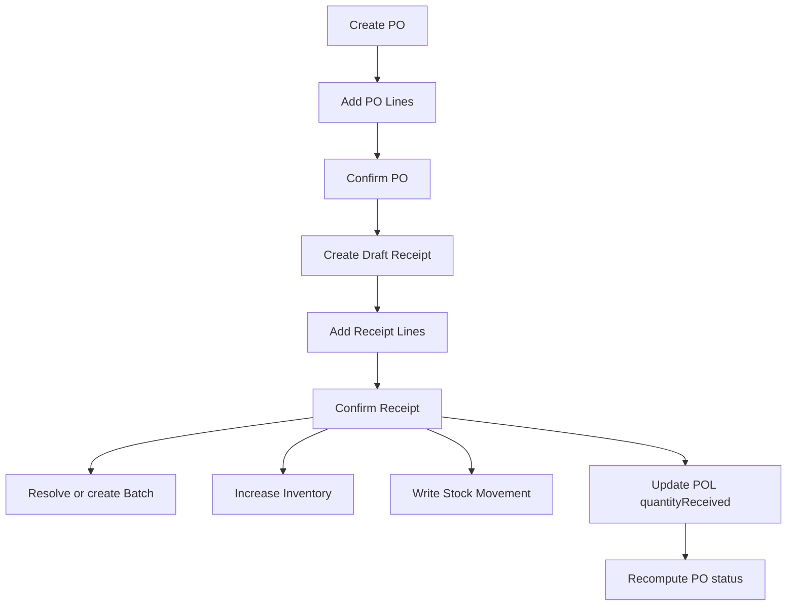

# Flow nghiệp vụ onboarding tóm tắt
## Date: 2026-03-12
## Scope: Quick onboarding map for inbound entities and business flow

## 1. Đọc nhanh trong 2 phút

Inbound flow của hệ thống hiện tại có thể hiểu bằng một câu:

`PO/POL` quản lý kế hoạch mua, `IR/IRL` quản lý lần giao thực tế, `Batch/Inventory/Movement` quản lý hàng đã vào kho ra sao.

## 2. Sơ đồ entity relationship ngắn gọn

```text
Products
   |
   +--> PurchaseOrderLines ----> PurchaseOrders
   |          |
   |          +--> InboundReceiptLines ----> InboundReceipts
   |                        |                      |
   |                        |                      +--> thuộc về 1 PurchaseOrder
   |                        |
   |                        +--> Locations ----> Warehouses
   |                        |
   |                        +--> Batch (nếu product có batch tracking)
   |
   +--> Inventory (theo dimension: product + warehouse + location + batch)
               |
               +--> InventoryReservation
               |
               +--> StockMovements
```

## 3. Sơ đồ theo lớp nghiệp vụ

```text
Lớp 1. Kế hoạch mua hàng
PurchaseOrders
    -> PurchaseOrderLines

Lớp 2. Ghi nhận giao hàng thực tế
InboundReceipts
    -> InboundReceiptLines

Lớp 3. Tồn kho và truy vết
Batch
Inventory
StockMovements
InventoryReservation
```

## 4. Flow end-to-end ngắn gọn



## 5. Quan hệ cần nhớ nhất

### 5.1. Quan hệ chứng từ

- `1 PO -> nhiều POL`
- `1 PO -> nhiều Receipt`
- `1 Receipt -> nhiều ReceiptLine`
- `1 POL -> nhiều ReceiptLine` qua nhiều đợt nhận

### 5.2. Quan hệ tồn kho

- `1 Inventory row = 1 tổ hợp (product, warehouse, location, batch)`
- cùng product nhưng khác location là dòng tồn kho khác
- cùng location nhưng khác batch là dòng tồn kho khác

## 6. Ba loại quantity dễ nhầm

| Field | Nằm ở đâu | Ý nghĩa |
|------|-----------|---------|
| `quantityOrdered` | `POL` | Số lượng đã đặt mua |
| `quantityReceived` | `IRL` | Số nhận ở riêng đợt hiện tại |
| `quantityReceived` | `POL` | Số nhận lũy kế của line mua hàng |
| `onHandQuantity` | `Inventory` | Số đang có vật lý |
| `quarantineQuantity` | `Inventory` | Phần đang bị cách ly |
| `reservedQuantity` | `Inventory` | Phần đã bị giữ cho luồng khác |

## 7. Công thức quan trọng nhất

```text
available = onHand - quarantine - reserved
```

Hiểu đơn giản:

- `onHand` không đồng nghĩa với usable
- hàng quarantine vẫn đang ở kho
- nhưng không được xem là available

## 8. Quarantine flow cực ngắn

Khi `IRL.qualityStatus = QUARANTINE`:

```text
POL.quantityReceived       += receipt quantity
Inventory.onHandQuantity   += receipt quantity
Inventory.quarantineQuantity += receipt quantity
Batch.status -> QUARANTINE
available không được tính phần này
```

## 9. Mental model để onboarding

Nếu đọc code mà chưa biết entity nào thuộc lớp nào, hãy nhớ:

- `PO/POL`: business expectation
- `IR/IRL`: physical receiving event
- `Batch`: lot identity
- `Inventory`: current stock snapshot
- `StockMovements`: stock history

## 10. Tài liệu đọc tiếp

- `FLOW_NGHIEP_VU_CUA_HE_THONG_20260312.md`
- `WHS-56_INBOUND_RECEIPTS_CRUD_DESIGN_20260309.md`
- `WHS-57_CONFIRM_RECEIPT_DESIGN_20260309.md`

