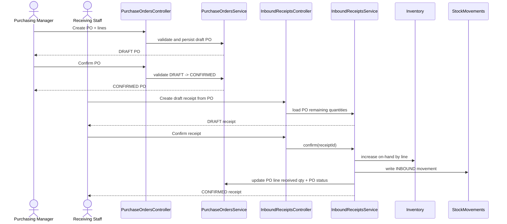

# Inbound Module Review And Plan
## Date: 2026-03-07
## Scope: Purchase Orders + Purchase Order Lines + Inbound Receipts + Inbound Receipt Lines

## 1. Recommendation

Module tiếp theo nên triển khai là `Inbound Operations`, theo đúng execution order đã khóa trong [docs/08-api-inventory-implementation-plan.md](/C:/WareHouseSystem/whsBE/docs/08-api-inventory-implementation-plan.md):

`WHS-43 -> WHS-44 -> WHS-45 -> WHS-46`

Lý do:

- Đây là chain phụ thuộc đầu tiên sau Inventory/Adjustment/Transfer.
- Codebase hiện đã có entity + migration nền cho inbound, nên có thể đẩy nhanh từ skeleton lên production-ready.
- `Sales Orders` và `Outbound Shipments` phụ thuộc nhiều hơn vào reserve/unreserve/decrease của Inventory, trong khi inbound chủ yếu phụ thuộc vào `increase`.
- `Stock Movements` đang có người làm dở, không nên chồng chéo phạm vi.

## 2. Jira Sync

| Jira | Scope | Priority | Status | Nhận định |
|------|-------|----------|--------|-----------|
| `WHS-43` | Purchase Orders API Completion | High | To Do | Parent đúng, nên làm trước |
| `WHS-44` | Purchase Order Lines API Completion | High | To Do | Đi cùng `WHS-43` |
| `WHS-45` | Inbound Receipts API Completion | Highest | To Do | Parent quan trọng nhất của inbound |
| `WHS-46` | Inbound Receipt Lines API Completion | High | To Do | Đi cùng `WHS-45` |
| `WHS-56` | CRUD/query receipts | n/a | To Do | Phụ thuộc `WHS-43..46` contract |
| `WHS-57` | Confirm receipt + inventory update | n/a | To Do | Có dependency trực tiếp sang Inventory + Stock Movements |
| `WHS-58` | Receipt lines APIs | n/a | To Do | Phải khóa line rules trước |

## 3. Code Sync

### 3.1 Hiện trạng code

Các file hiện mới ở mức skeleton:

- [PurchaseOrdersController.java](/C:/WareHouseSystem/whsBE/src/main/java/org/demo/whs/controller/PurchaseOrdersController.java)
- [PurchaseOrdersService.java](/C:/WareHouseSystem/whsBE/src/main/java/org/demo/whs/service/PurchaseOrdersService.java)
- [PurchaseOrdersServiceImpl.java](/C:/WareHouseSystem/whsBE/src/main/java/org/demo/whs/service/impl/PurchaseOrdersServiceImpl.java)
- [PurchaseOrderLinesController.java](/C:/WareHouseSystem/whsBE/src/main/java/org/demo/whs/controller/PurchaseOrderLinesController.java)
- [PurchaseOrderLinesService.java](/C:/WareHouseSystem/whsBE/src/main/java/org/demo/whs/service/PurchaseOrderLinesService.java)
- [PurchaseOrderLinesServiceImpl.java](/C:/WareHouseSystem/whsBE/src/main/java/org/demo/whs/service/impl/PurchaseOrderLinesServiceImpl.java)
- [InboundReceiptsController.java](/C:/WareHouseSystem/whsBE/src/main/java/org/demo/whs/controller/InboundReceiptsController.java)
- [InboundReceiptsService.java](/C:/WareHouseSystem/whsBE/src/main/java/org/demo/whs/service/InboundReceiptsService.java)
- [InboundReceiptsServiceImpl.java](/C:/WareHouseSystem/whsBE/src/main/java/org/demo/whs/service/impl/InboundReceiptsServiceImpl.java)
- [InboundReceiptLinesController.java](/C:/WareHouseSystem/whsBE/src/main/java/org/demo/whs/controller/InboundReceiptLinesController.java)
- [InboundReceiptLinesService.java](/C:/WareHouseSystem/whsBE/src/main/java/org/demo/whs/service/InboundReceiptLinesService.java)
- [InboundReceiptLinesServiceImpl.java](/C:/WareHouseSystem/whsBE/src/main/java/org/demo/whs/service/impl/InboundReceiptLinesServiceImpl.java)
- Request/response DTO và mapper của 4 aggregate gần như đang rỗng.
- Chưa có test cho inbound chain trong `src/test/java`.

### 3.2 Nền DB hiện có

Migration thực tế đang dùng:

- [V20260301_03__Create_inbound_operations.sql](/C:/WareHouseSystem/whsBE/src/main/resources/db/migration/V20260301_03__Create_inbound_operations.sql)

Migration này đã có:

- `purchase_orders`
- `purchase_order_lines`
- `inbound_receipts`
- `inbound_receipt_lines`
- unique/index/check constraint cơ bản

### 3.3 Các điểm lệch cần sửa trước khi implement

1. `@Table(name = "purchase_orders ")` trong [PurchaseOrders.java](/C:/WareHouseSystem/whsBE/src/main/java/org/demo/whs/entity/PurchaseOrders.java) có trailing space, lệch với tên table thật.
2. `@Table(name = "inbound_receipt_lines ")` trong [InboundReceiptLines.java](/C:/WareHouseSystem/whsBE/src/main/java/org/demo/whs/entity/InboundReceiptLines.java) có trailing space, lệch với migration.
3. `batch_id` ở migration cho phép `NULL`, nhưng entity lại đang `nullable = false`; điều này sai với nghiệp vụ non-batch product.
4. Rule over-receipt đang bị chặn ở DB vì `purchase_order_lines.quantity_received <= quantity_ordered`. Nếu release đầu không bật over-receipt thì giữ nguyên; nếu bật thì phải có migration đổi constraint.
5. Business doc hiện đang mâu thuẫn về receipt terminal status. Migration + enum hiện là `DRAFT -> CONFIRMED/CANCELLED`; không nên thêm `COMPLETED` nếu chưa đổi schema.
6. Inventory hiện tính available theo `on_hand - reserved`, chưa loại trừ batch `QUARANTINE`. Nếu confirm receipt cho hàng quarantine ngay lúc này thì báo cáo available sẽ sai.

## 4. Business Standardization

## 4.1 Purchase Order lifecycle

Chuẩn nên khóa như sau:

- `DRAFT`: được create/update/delete
- `CONFIRMED`: khóa chỉnh sửa nghiệp vụ cốt lõi, cho phép tạo receipt
- `PARTIALLY_RECEIVED`: đã nhận một phần, vẫn cho phép tạo receipt tiếp
- `COMPLETED`: toàn bộ line đã nhận đủ
- `CANCELLED`: hủy PO, không tạo receipt mới

Quy tắc:

- Chỉ `DRAFT` được confirm.
- Receipt chỉ được tạo từ PO ở `CONFIRMED` hoặc `PARTIALLY_RECEIVED`.
- PO không được hoàn thành thủ công; phải derive từ tổng `quantity_received` của line.

## 4.2 Inbound Receipt lifecycle

Chuẩn hóa theo schema hiện tại:

- `DRAFT`: được create/update/delete
- `CONFIRMED`: đã chốt, inventory đã tăng, movement đã ghi
- `CANCELLED`: chỉ áp dụng khi receipt còn draft

Không dùng `COMPLETED` cho receipt ở phase hiện tại.

## 4.3 Line-item rules

`PurchaseOrderLines`

- `lineNumber` unique trong từng PO.
- `quantityOrdered > 0`
- `unitPrice >= 0`
- `lineTotal = quantityOrdered * unitPrice`
- `quantityReceived` là running total, chỉ update qua confirm receipt

`InboundReceiptLines`

- Phải map về đúng `purchaseOrderLineId`
- `quantityReceived > 0`
- `locationId` bắt buộc và phải thuộc đúng warehouse của receipt
- `batchId` chỉ bắt buộc nếu product có `requiresBatchTracking = true`
- `qualityStatus = QUARANTINE` bắt buộc có `notes`

## 4.4 Inventory impact

Chuẩn end-to-end cho confirm receipt:

1. Validate receipt đang `DRAFT`
2. Validate PO đang `CONFIRMED` hoặc `PARTIALLY_RECEIVED`
3. Validate từng receipt line không vượt quantity còn lại của PO line
4. Create/find `Batch` nếu product có batch tracking
5. Create/find `Inventory(product, warehouse, location, batch)`
6. Increase `on_hand_quantity`
7. Ghi `StockMovements(type = INBOUND, referenceType = INBOUND_RECEIPT)`
8. Update `purchase_order_lines.quantity_received`
9. Recompute PO status:
   - còn thiếu hàng: `PARTIALLY_RECEIVED`
   - đủ toàn bộ: `COMPLETED`
10. Update receipt thành `CONFIRMED`

## 4.5 Quarantine rule

Theo BA, hàng `QUARANTINE`:

- vẫn tăng stock vật lý
- nhưng không được tính là available

Điểm này chưa khớp với implementation inventory hiện tại. Có 2 hướng:

- Hướng chuẩn hơn: vẫn tăng inventory, nhưng mọi query availability phải exclude batch `QUARANTINE`
- Hướng tạm thời: chưa mở confirm cho line quarantine cho đến khi inventory summary hỗ trợ exclude batch status

Khuyến nghị: chọn hướng 1 và tạo sub-scope kỹ thuật trong phase confirm receipt.

## 4.6 Over-receipt rule

Release đầu nên chốt:

- Default `over-receipt = disabled`
- Không nhận vượt ordered quantity
- Chưa mở tolerance config ở phase 1

Như vậy sẽ khớp với DB constraint hiện tại và giảm độ phức tạp.

## 5. End-to-End Flow

## 6. Affected Scope

| Area | Impact |
|------|--------|
| Controller | Thêm full CRUD/query/confirm endpoints cho PO và Receipt |
| Service | Toàn bộ business logic inbound nằm ở đây, bắt buộc `@Transactional` |
| Repository | Cần query by status, by PO, by warehouse, aggregate remaining quantity |
| DTO/Mapper | Phải thiết kế lại hoàn chỉnh, không dùng DTO rỗng |
| Validation | Bean Validation + cross-field validation cho line totals, dates, quantities |
| Inventory | Cần hook `increase` path cho confirm receipt |
| Batch | Cần create/find batch cho batch-tracked product |
| Stock Movements | Cần add writer flow cho inbound audit |
| Security | Cần role matrix cho Purchasing Manager / Receiving Staff / Viewer |
| Swagger | Phải document đầy đủ request/response/error |
| Tests | Chưa có, phải bổ sung unit + integration |

## 7. Implementation Plan

## Phase 0: Contract And Schema Alignment

Mục tiêu:

- Chốt lifecycle chuẩn
- Chốt endpoint contract
- Sửa các mismatch entity/schema trước khi viết logic

Checklist:

- Sửa trailing space ở table name entity
- Đồng bộ nullable của `batchId`
- Chốt receipt status dùng `CONFIRMED`
- Chốt release 1 không hỗ trợ over-receipt
- Thiết kế request/response DTO chuẩn cho PO, PO Line, Receipt, Receipt Line

## Phase 1: `WHS-43` Purchase Orders

Scope:

- `POST /api/v1/purchase-orders`
- `GET /api/v1/purchase-orders`
- `GET /api/v1/purchase-orders/{id}`
- `PUT /api/v1/purchase-orders/{id}`
- `DELETE /api/v1/purchase-orders/{id}`
- `PUT /api/v1/purchase-orders/{id}/confirm`

Rules bắt buộc:

- Create/update/delete chỉ cho `DRAFT`
- Confirm chỉ cho `DRAFT`
- Tự tính `subTotal`, `taxAmount`, `totalAmount`
- Validate `supplierId`, `warehouseId`, `productId`
- Generate `purchaseOrderNumber`

Deliverables:

- Controller + service + repository query
- DTO/mapper
- Unit test service
- Controller test

## Phase 2: `WHS-44` Purchase Order Lines

Scope:

- Không tách line API độc lập nếu không cần cho FE.
- Khuyến nghị line được quản lý qua PO aggregate ở phase 1 để tránh split transaction sai.

Nếu vẫn phải bám Jira line API:

- `GET /api/v1/purchase-order-lines/{id}`
- `GET /api/v1/purchase-order-lines/by-po/{poId}`
- create/update/delete line chỉ khi PO `DRAFT`

Rules:

- Không cho chỉnh line của PO đã confirm
- Recompute totals của PO sau mọi thay đổi line

## Phase 3: `WHS-45` Draft Receipt CRUD

Scope:

- `POST /api/v1/inbound-receipts`
- `GET /api/v1/inbound-receipts`
- `GET /api/v1/inbound-receipts/{id}`
- `PUT /api/v1/inbound-receipts/{id}`
- `DELETE /api/v1/inbound-receipts/{id}`
- `GET /api/v1/inbound-receipts/by-po/{poId}`

Rules:

- Chỉ tạo receipt cho PO `CONFIRMED` hoặc `PARTIALLY_RECEIVED`
- Chỉ `DRAFT` receipt được update/delete
- Khi tạo receipt phải load được ordered / received / remaining của từng PO line

## Phase 4: `WHS-46` Receipt Lines

Scope:

- Quản lý line trong receipt draft
- Validate location, product, PO line binding
- Batch payload đầy đủ nếu product batch-tracked

Rules:

- Không cho line quantity vượt remaining
- `QUARANTINE` bắt buộc notes
- Không cho line thuộc warehouse khác receipt

## Phase 5: `WHS-57` Confirm Receipt

Đây là phase quan trọng nhất.

Scope:

- `PUT /api/v1/inbound-receipts/{id}/confirm`

Transaction steps:

1. Lock receipt
2. Validate receipt `DRAFT`
3. Lock related PO + PO lines
4. Recompute remaining quantity theo DB hiện tại
5. Validate lại toàn bộ receipt lines
6. Create/find batch
7. Create/find inventory row
8. Increase inventory
9. Insert stock movement
10. Update PO line received quantity
11. Update PO status
12. Update receipt status + confirmed fields

Phụ thuộc kỹ thuật:

- Reuse hoặc bổ sung inventory `increase` service nội bộ
- Bổ sung helper ghi stock movement inbound
- Quyết định handling cho quarantine stock trong availability query

## Phase 6: Hardening

Checklist:

- Pagination/filter cho list endpoint
- Authorization matrix
- ErrorCode rõ ràng cho inbound module
- OpenAPI/Swagger
- Structured logs cho confirm flow
- Integration test transaction rollback
- Integration test partial receipt
- Integration test batch-tracked product
- Integration test quarantine receipt

## 8. Test Plan

Unit test tối thiểu:

- create PO thành công
- create PO fail khi không có line
- confirm PO fail nếu không phải `DRAFT`
- update/delete PO fail sau confirm
- create receipt fail nếu PO chưa confirm
- create receipt fail nếu line vượt remaining
- confirm receipt fail khi receipt đã confirm
- confirm receipt rollback khi insert movement lỗi
- confirm receipt update PO thành `PARTIALLY_RECEIVED`
- confirm receipt update PO thành `COMPLETED`

Integration test bắt buộc:

- confirm receipt làm tăng inventory đúng dimensions `(product, warehouse, location, batch)`
- confirm receipt ghi movement `INBOUND`
- confirm receipt update `quantity_received` của PO line
- confirm receipt với non-batch product vẫn hợp lệ khi `batchId = null`
- confirm receipt với quarantine line không làm available sai sau khi áp dụng rule batch status

## 9. Suggested Delivery Order

1. `WHS-43` + `WHS-44` trong cùng một PR slice
2. `WHS-45` draft receipt CRUD trong PR slice tiếp theo
3. `WHS-46` line rules trong cùng nhịp với `WHS-45` nếu scope còn nhỏ
4. `WHS-57` confirm receipt + inventory/movement integration ở PR riêng
5. Sau khi inbound ổn mới chuyển sang outbound chain `WHS-47 -> WHS-50`

## 10. Decision Summary

Các quyết định nên khóa ngay:

- Module tiếp theo: `Inbound Operations`
- Không chờ Inventory module complete toàn phần mới bắt đầu inbound
- Release inbound phase đầu không bật over-receipt
- Receipt terminal status dùng `CONFIRMED`
- Receipt tạo được từ PO `CONFIRMED` và `PARTIALLY_RECEIVED`
- Quarantine phải được xử lý đồng bộ với inventory availability, không làm nửa vời
