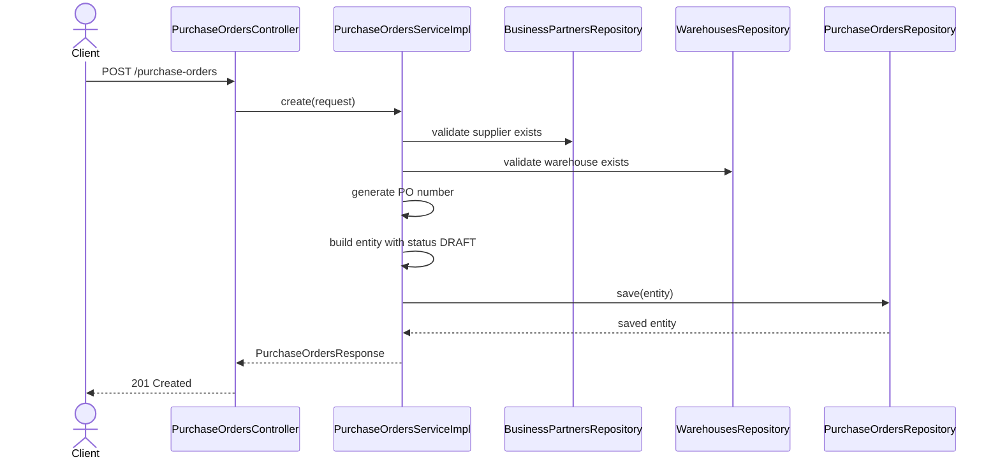
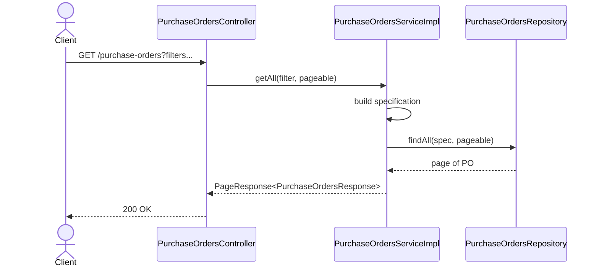
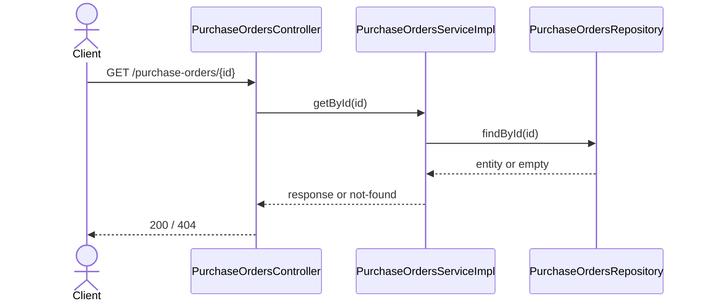
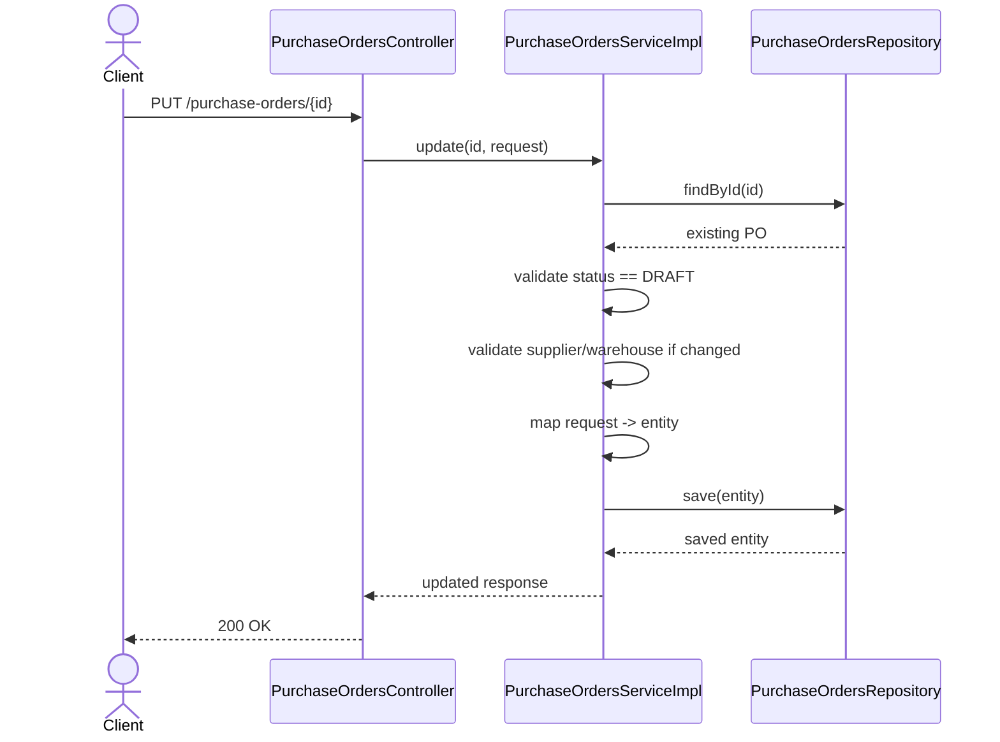
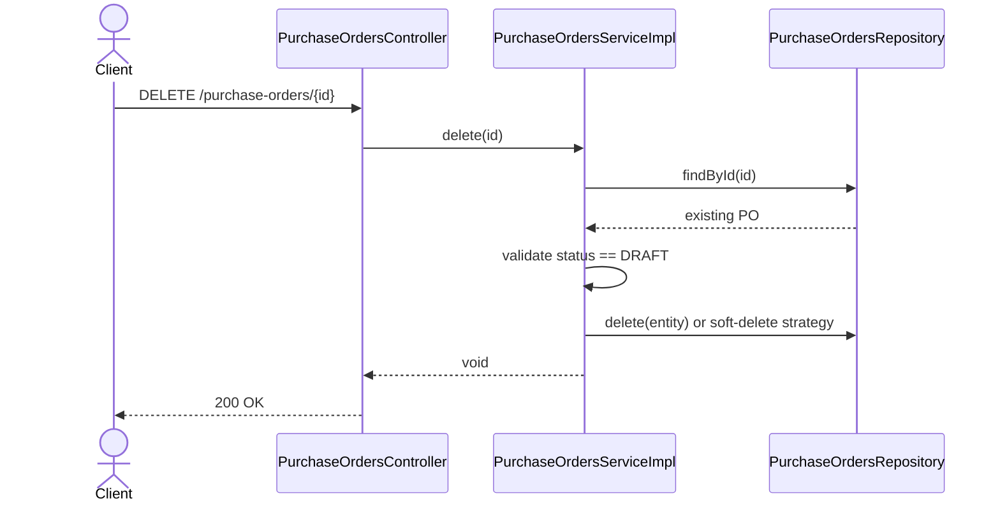

# WHS-53 Purchase Orders CRUD Design
## Date: 2026-03-07
## Branch: `feature/dunghd/WHS-53`

## 1. Jira Scope

Task: `WHS-53`  
Summary: `Implement purchase orders CRUD APIs`

Endpoints:

- `POST /api/v1/purchase-orders`
- `GET /api/v1/purchase-orders`
- `GET /api/v1/purchase-orders/{id}`
- `PUT /api/v1/purchase-orders/{id}`
- `DELETE /api/v1/purchase-orders/{id}`

Acceptance Criteria:

- Đủ 5 endpoint CRUD hoạt động đúng rule `DRAFT`
- Có validate input, pagination/filter, error mapping chuẩn
- Có test và swagger sau khi business logic hoàn tất

## 2. Business Scope For This Task

`WHS-53` chỉ xử lý header của Purchase Order.

Không nằm trong scope task này:

- confirm PO
- purchase order line mutation business logic
- inventory impact
- inbound receipt creation

## 3. Business Rules Locked For ServiceImpl

- Purchase Order được tạo với trạng thái mặc định `DRAFT`
- Chỉ PO ở `DRAFT` mới được update/delete
- `purchaseOrderNumber` do system generate
- `subTotal`, `taxAmount`, `totalAmount` do system quản lý
- `expectedDeliveryDate` không được ở quá khứ
- `supplierId` và `warehouseId` phải tồn tại
- list endpoint phải hỗ trợ filter cơ bản + pagination + sort whitelist

## 4. Data Contract

### Create Request

```json
{
  "supplier_id": "uuid",
  "warehouse_id": "uuid",
  "order_date": "2026-03-07",
  "expected_delivery_date": "2026-03-10",
  "currency": "VND",
  "payment_terms": "NET 30",
  "notes": "optional"
}
```

### Update Request

Cho phép update các field header khi PO còn `DRAFT`:

- `supplier_id`
- `warehouse_id`
- `order_date`
- `expected_delivery_date`
- `currency`
- `payment_terms`
- `notes`

### Response

Bao gồm:

- `id`
- `purchase_order_number`
- `supplier_id`
- `warehouse_id`
- `order_date`
- `expected_delivery_date`
- `status`
- `sub_total`
- `tax_amount`
- `total_amount`
- `currency`
- `payment_terms`
- `notes`
- `confirmed_at`
- `confirmed_by`
- `created_at`
- `updated_at`

## 5. Sequence Diagrams

### 5.1 Create Purchase Order



### 5.2 List Purchase Orders



### 5.3 Get By Id



### 5.4 Update Purchase Order



### 5.5 Delete Purchase Order



## 6. Scaffolded Code Base

Đã dựng xong các phần để vào thẳng `serviceImpl`:

- controller 5 endpoint
- request/update/filter DTO
- response DTO
- mapper create/update/response
- repository hooks cho number lookup + specification
- service contract
- service impl method skeleton

## 7. ServiceImpl TODO Boundary

Phần còn lại để implement trong `PurchaseOrdersServiceImpl`:

- validate supplier và warehouse
- generate `purchaseOrderNumber`
- build filter specification
- status validation cho update/delete
- not found / bad request / conflict mapping
- quyết định delete hard hay soft theo chuẩn team
