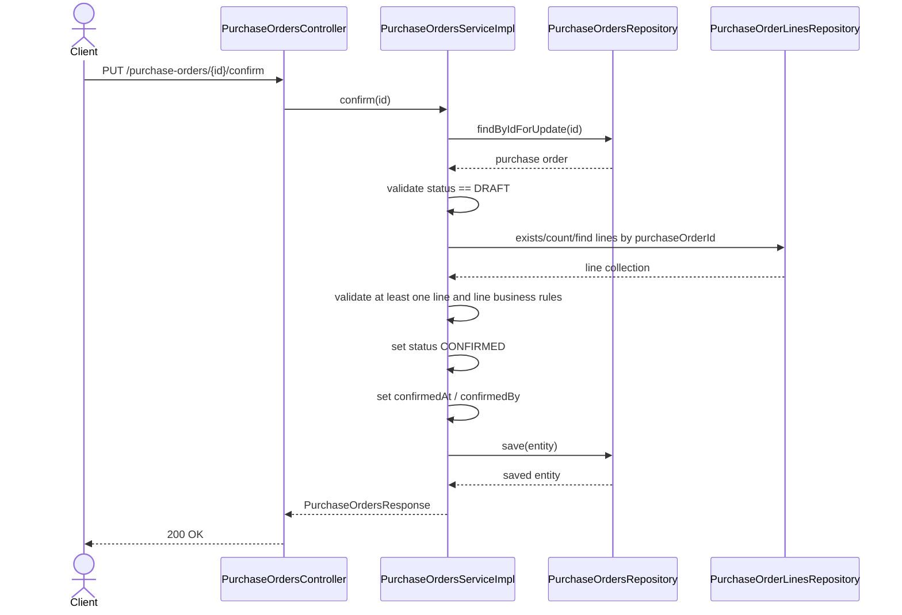

# WHS-54 Purchase Order Confirm Design
## Date: 2026-03-07
## Branch: `feature/dunghd/WHS-54`

## 1. Jira Scope

Task: `WHS-54`  
Summary: `Implement purchase order confirm API`

Endpoint:

- `PUT /api/v1/purchase-orders/{id}/confirm`

Acceptance Criteria:

- Confirm đúng transition rule
- Không cho confirm ở trạng thái không hợp lệ
- Có test và swagger sau khi business logic hoàn tất

## 2. Business Scope For This Task

Task này chỉ xử lý transition của `Purchase Order`.

Không nằm trong scope:

- tạo line
- chỉnh line
- receipt creation
- inventory update

## 3. Locked Business Rules

- Chỉ `DRAFT` PO mới được confirm
- PO phải có ít nhất 1 line trước khi confirm
- PO line phải hợp lệ về quantity và price trước khi confirm
- Khi confirm:
  - `status = CONFIRMED`
  - set `confirmedAt`
  - set `confirmedBy`
- PO đã `CONFIRMED`, `PARTIALLY_RECEIVED`, `COMPLETED`, `CANCELLED` đều không được confirm lại

## 4. Required Technical Hooks

Code base đã scaffold sẵn:

- controller endpoint `PUT /{id}/confirm`
- service contract `confirm(String id)`
- service impl stub
- repository hook `findByIdForUpdate(id)` để phục vụ lock khi confirm
- repository hook line lookup:
  - `existsByPurchaseOrderId(...)`
  - `countByPurchaseOrderId(...)`
  - `findByPurchaseOrderIdOrderByLineNumberAsc(...)`

## 5. Sequence Diagram

## 6. ServiceImpl TODO

Phần anh sẽ implement trong [PurchaseOrdersServiceImpl.java](/C:/WareHouseSystem/whsBE/src/main/java/org/demo/whs/service/impl/PurchaseOrdersServiceImpl.java):

- load PO bằng `findByIdForUpdate`
- throw not found nếu không tồn tại
- validate current status
- validate có line
- validate line data trước confirm
- resolve current user để set `confirmedBy`
- set `confirmedAt`
- save và map response

## 7. Suggested Error Mapping

- PO không tồn tại: `COM_004` hoặc error code riêng cho PO nếu team bổ sung
- status không hợp lệ: `COM_001` hoặc error code riêng cho PO confirm
- không có line: `COM_001`

## 8. Expected Output

Response dùng chung `PurchaseOrdersResponse`, trong đó sau confirm cần phản ánh:

- `status = CONFIRMED`
- `confirmed_at != null`
- `confirmed_by != null`
