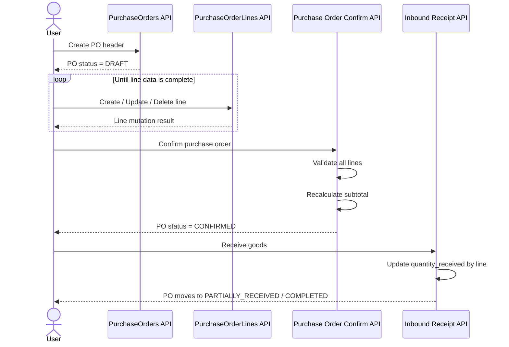
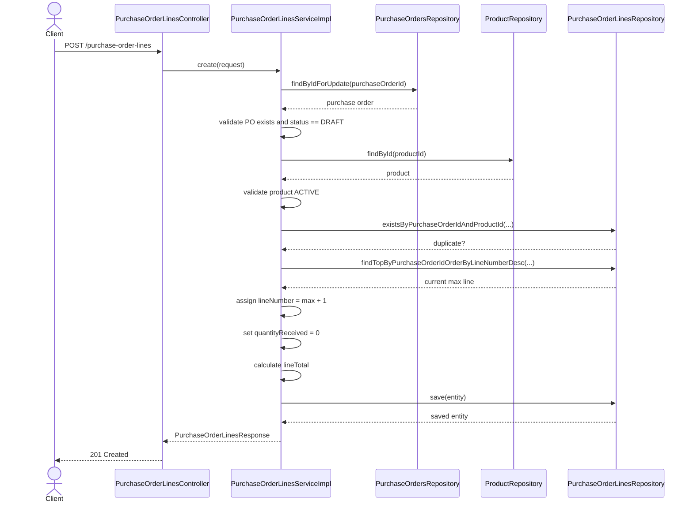
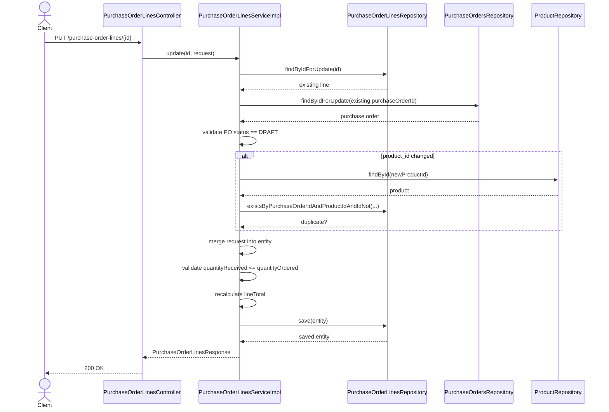
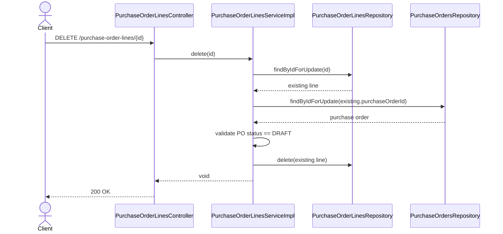

# WHS-55 Purchase Order Lines BA Design
## Date: 2026-03-09
## Branch: `codex/feature-WHS-55-purchase-order-lines-api`

## 1. Jira Scope

Task: `WHS-55`  
Summary: `Implement purchase order lines APIs`

Endpoints:

- `POST /api/v1/purchase-order-lines`
- `PUT /api/v1/purchase-order-lines/{id}`
- `DELETE /api/v1/purchase-order-lines/{id}`

Acceptance Criteria:

- Cả 3 endpoint hoạt động đúng line-item rules
- Validate quantity, price và business constraints đầy đủ
- Có unit test, integration test, swagger sau khi business logic hoàn tất

## 2. Business Goal

`WHS-55` hoàn thiện phần mutation của dòng hàng trong Purchase Order để:

- PO `DRAFT` có thể được bổ sung line trước khi confirm
- dữ liệu line nhất quán trước khi sang bước confirm và inbound receipt
- subtotal của PO có thể được tính đúng từ line data khi confirm

Task này là lớp trung gian giữa:

- `WHS-53`: quản lý header PO
- `WHS-54`: confirm PO
- inbound receipt: cập nhật `quantity_received` sau khi PO đã confirm

## 3. Scope Boundary

Trong scope:

- thêm mới line cho PO
- cập nhật line khi PO còn `DRAFT`
- xóa line khi PO còn `DRAFT`
- validate product, quantity, price, line total ownership

Ngoài scope:

- confirm PO
- nhận hàng và cập nhật `quantity_received`
- cập nhật tồn kho
- batch allocation
- approval workflow

## 4. Locked Rules From Existing System

Các rule dưới đây đã được khóa bởi schema DB và code hiện tại:

- `purchase_order_lines.purchase_order_id` bắt buộc tồn tại
- `purchase_order_lines.product_id` bắt buộc tồn tại
- `quantity_ordered > 0`
- `quantity_received >= 0`
- `quantity_received <= quantity_ordered`
- `purchase_order_id + line_number` là unique
- khi confirm PO:
  - PO phải có ít nhất 1 line
  - `quantity_ordered` phải > 0
  - `quantity_received` không âm và không vượt `quantity_ordered`
  - `unit_price >= 0`
  - `line_total = quantity_ordered * unit_price`
- header PO chỉ được confirm khi `status = DRAFT`

## 5. BA Decisions Locked For WHS-55

Để tránh mơ hồ khi implement, cần khóa rule nghiệp vụ line như sau:

- Chỉ PO ở trạng thái `DRAFT` mới được create, update, delete line
- `quantity_received` không nằm trong request create/update line
- `quantity_received` được sở hữu bởi flow inbound receipt, không cho client sửa trực tiếp ở `WHS-55`
- `line_total` do backend tự tính, không nhận từ client
- `line_number` do backend tự cấp theo công thức `max(line_number) + 1`
- Không resequence line number sau khi xóa line
- Một `product_id` chỉ nên xuất hiện một lần trong cùng một PO `DRAFT`

Lý do khóa duplicate product:

- line hiện tại không có discriminator khác như lot, expected receipt split hay delivery schedule
- nếu cho trùng product, business sẽ khó kiểm soát subtotal và update semantics

## 6. Data Ownership

Client được phép gửi:

- `purchase_order_id`
- `product_id`
- `quantity_ordered`
- `unit_price`
- `notes`

Backend sở hữu:

- `id`
- `line_number`
- `quantity_received`
- `line_total`
- `created_at`
- `updated_at`
- `created_by`
- `updated_by`

## 7. Validation Matrix

### Create Line

- `purchase_order_id` bắt buộc
- `product_id` bắt buộc
- `quantity_ordered` bắt buộc và > 0
- `unit_price` bắt buộc và >= 0
- `notes` tối đa 500 ký tự
- PO phải tồn tại
- PO phải đang `DRAFT`
- product phải tồn tại và nên ở trạng thái `ACTIVE`
- product chưa tồn tại ở line khác trong cùng PO

### Update Line

- line phải tồn tại
- PO cha phải tồn tại và đang `DRAFT`
- nếu đổi `product_id` thì product mới phải hợp lệ và không bị trùng trong cùng PO
- nếu có `quantity_ordered` thì phải > 0
- nếu có `unit_price` thì phải >= 0
- `quantity_received` hiện tại không được vượt `quantity_ordered` mới sau update
- backend phải tính lại `line_total`

### Delete Line

- line phải tồn tại
- PO cha phải tồn tại và đang `DRAFT`
- chỉ xóa line, không resequence line number
- sau khi xóa không tự cập nhật `sub_total` ở header; subtotal sẽ được recalc khi confirm

## 8. End-To-End Flow

### 8.1 Business Lifecycle

1. User tạo header PO ở `WHS-53`, trạng thái ban đầu là `DRAFT`
2. User thêm từng line bằng `POST /purchase-order-lines`
3. User có thể chỉnh sửa hoặc xóa line khi PO vẫn là `DRAFT`
4. Khi line data đã đúng, user gọi `PUT /purchase-orders/{id}/confirm`
5. System validate toàn bộ line trước khi confirm và tính `sub_total`
6. Sau confirm, line không còn được mutate qua `WHS-55`
7. Inbound receipt về sau mới được phép tăng `quantity_received`
8. Từ `quantity_received`, PO sẽ tiến dần sang `PARTIALLY_RECEIVED` hoặc `COMPLETED` ở task khác

### 8.2 State Guard

- `DRAFT`: được create/update/delete line
- `CONFIRMED`: khóa line mutation
- `PARTIALLY_RECEIVED`: khóa line mutation
- `COMPLETED`: khóa line mutation
- `CANCELLED`: khóa line mutation

## 9. API Contract Proposal

### Create Request

```json
{
  "purchase_order_id": "uuid",
  "product_id": "uuid",
  "quantity_ordered": 10.00,
  "unit_price": 12.50,
  "notes": "optional"
}
```

### Update Request

```json
{
  "product_id": "uuid",
  "quantity_ordered": 20.00,
  "unit_price": 11.00,
  "notes": "optional"
}
```

### Response

```json
{
  "id": "uuid",
  "purchase_order_id": "uuid",
  "product_id": "uuid",
  "line_number": 2,
  "quantity_ordered": 20.00,
  "quantity_received": 0.00,
  "unit_price": 11.00,
  "line_total": 220.00,
  "notes": "optional",
  "created_at": "2026-03-09 10:00:00",
  "updated_at": "2026-03-09 10:05:00"
}
```

## 10. End-To-End Sequence Diagram



## 11. Detailed Sequence Diagrams

### 11.1 Create Purchase Order Line



### 11.2 Update Purchase Order Line



### 11.3 Delete Purchase Order Line



## 12. Implementation Notes For Scaffold

Code base nên được dựng với các thành phần sau:

- request DTO cho create/update line
- response DTO cho line
- controller đủ 3 endpoint
- service contract đủ 3 method mutation
- mapper create/update/response
- repository helper để:
  - lock line khi update/delete
  - lấy line number lớn nhất
  - check duplicate product trong cùng PO

## 13. Implementation Checklist

1. Hoàn thiện service validations theo rule đã khóa
2. Add unit tests cho create/update/delete success và fail paths
3. Add integration tests cho request validation + error mapping
4. Bổ sung Swagger example cho 3 endpoint
5. Review lại interaction với inbound receipt trước khi merge
