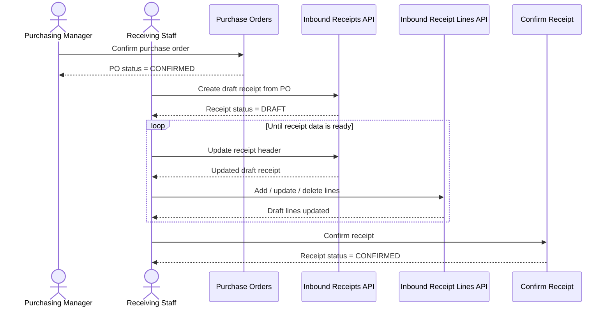
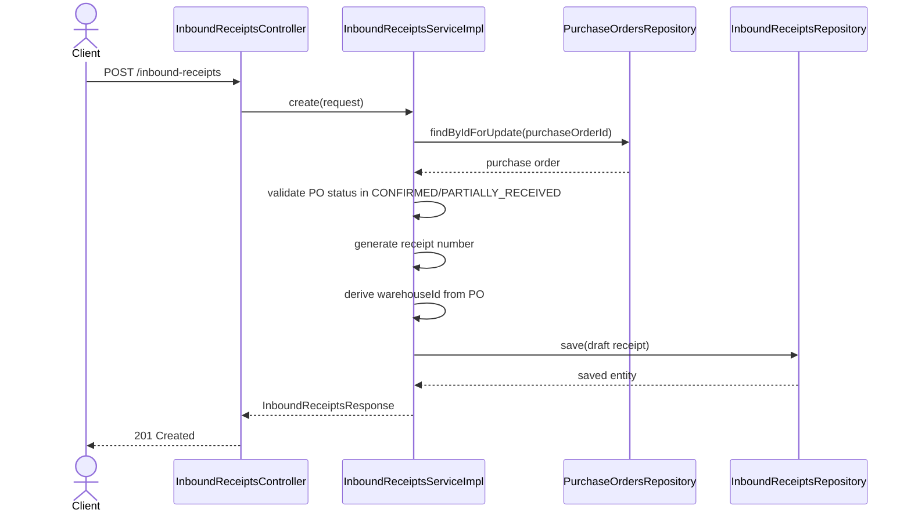
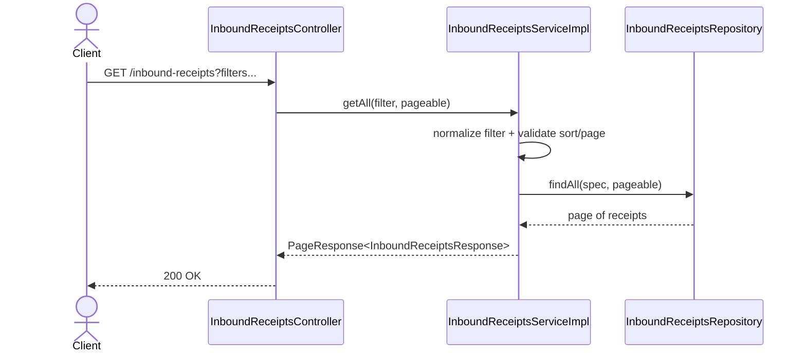
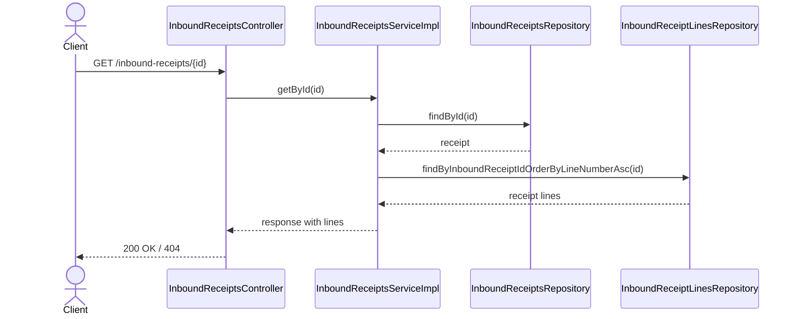
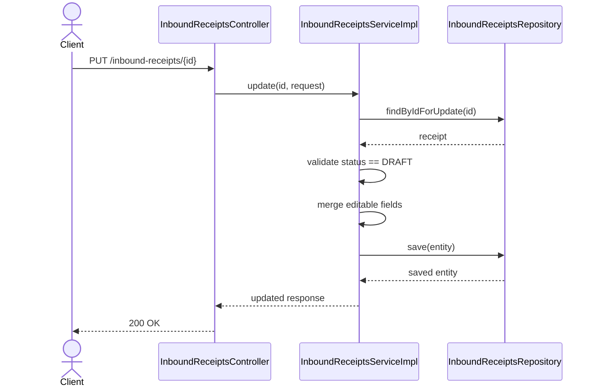
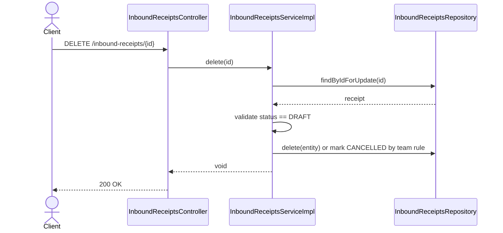

# WHS-56 Inbound Receipts CRUD Design
## Date: 2026-03-09
## Scope: Draft receipt CRUD/query for inbound receiving

## 1. Jira Scope

Task: `WHS-56`  
Summary: `Implement inbound receipts CRUD/query APIs`

Endpoints:

- `POST /api/v1/inbound-receipts`
- `GET /api/v1/inbound-receipts`
- `GET /api/v1/inbound-receipts/{id}`
- `PUT /api/v1/inbound-receipts/{id}`
- `DELETE /api/v1/inbound-receipts/{id}`
- `GET /api/v1/inbound-receipts/by-po/{purchaseOrderId}`

## 2. Business Goal

`WHS-56` tạo lớp receipt draft để Receiving Staff chuẩn bị dữ liệu nhận hàng trước khi chạy transaction confirm ở `WHS-57`.

Task này chỉ sở hữu:

- create/query/update/delete receipt header
- load receipt detail cho FE
- bảo vệ state `DRAFT`
- buộc receipt bám đúng PO hợp lệ để nhận hàng

Không nằm trong scope:

- inventory update
- stock movement write
- PO line `quantity_received` update
- batch creation side-effect

## 3. Locked Business Rules

- Receipt chỉ được tạo từ PO đang `CONFIRMED` hoặc `PARTIALLY_RECEIVED`
- `warehouse_id` của receipt phải bám từ PO, FE không được gửi warehouse khác
- Chỉ receipt ở `DRAFT` mới được update/delete
- `receipt_number` do system generate
- `receipt_date` mặc định là ngày hiện tại nếu client không gửi
- `confirmed_at` và `confirmed_by` chỉ được set bởi flow `WHS-57`

## 4. Data Contract

### Create Request

```json
{
  "purchase_order_id": "uuid",
  "receipt_date": "2026-03-09",
  "delivery_note_number": "DN-20260309-001",
  "notes": "optional"
}
```

### Update Request

```json
{
  "receipt_date": "2026-03-10",
  "delivery_note_number": "DN-20260310-001",
  "notes": "optional"
}
```

### Filter Request

```json
{
  "receipt_number": "GR-2026",
  "purchase_order_id": "uuid",
  "warehouse_id": "uuid",
  "status": "DRAFT",
  "receipt_date_from": "2026-03-01",
  "receipt_date_to": "2026-03-31"
}
```

### Response

```json
{
  "id": "uuid",
  "receipt_number": "GR-20260309-001",
  "purchase_order_id": "uuid",
  "purchase_order_number": "PO-20260309-ABC123",
  "warehouse_id": "uuid",
  "warehouse_name": "Main Warehouse",
  "receipt_date": "2026-03-09",
  "status": "DRAFT",
  "delivery_note_number": "DN-20260309-001",
  "notes": "optional",
  "confirmed_at": null,
  "confirmed_by": null,
  "lines": [],
  "created_at": "2026-03-09 09:00:00",
  "updated_at": "2026-03-09 09:05:00"
}
```

## 5. FE Integration Context

FE cần coi receipt header là aggregate root của receiving screen:

- screen list dùng `GET /api/v1/inbound-receipts`
- screen detail dùng `GET /api/v1/inbound-receipts/{id}`
- line editor của task `WHS-58` sẽ thao tác trên receipt đang `DRAFT`
- nút `Confirm receipt` chỉ enable khi receipt đang `DRAFT` và đã có line

## 6. End-to-End Flow



## 7. Detailed Sequence Diagrams

### 7.1 Create Receipt



### 7.2 List Receipts



### 7.3 Get Detail



### 7.4 Update Receipt



### 7.5 Delete Receipt



## 8. ServiceImpl Boundary

`InboundReceiptsServiceImpl` cần tự implement:

- PO status guard cho create
- derive warehouse từ PO
- generate `receiptNumber`
- filter normalization cho list
- draft-only guard cho update/delete
- detail mapping có line list

## 9. Important Open Decisions Already Locked

- Release đầu giữ receipt lifecycle: `DRAFT -> CONFIRMED/CANCELLED`
- `WHS-56` không update inventory
- `WHS-56` không sửa `quantity_received` của PO line
- Receipt detail có thể include line list để FE dựng màn hình receiving
