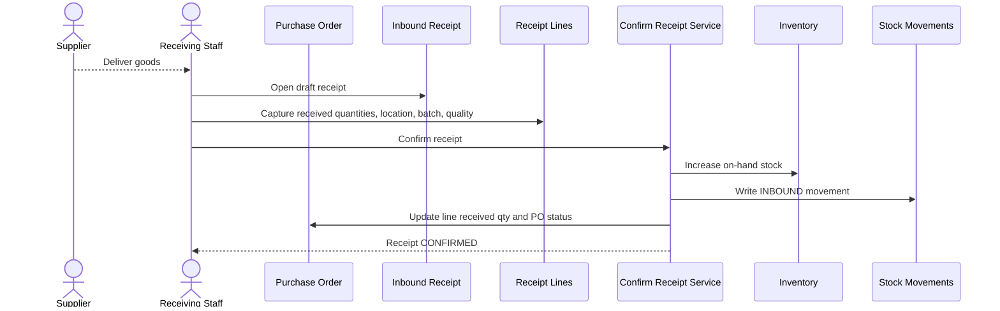
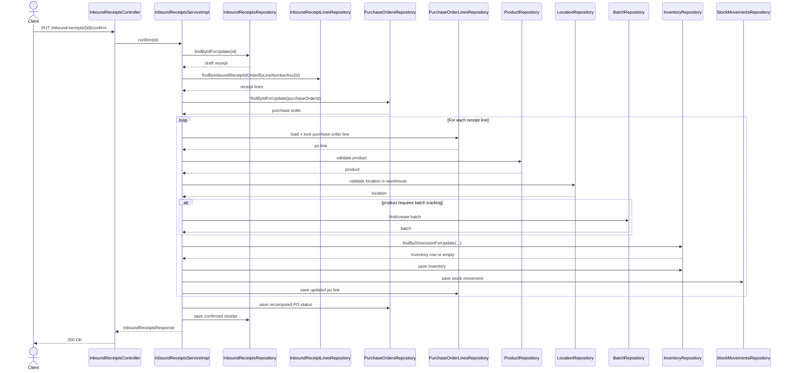

# WHS-57 Confirm Receipt Design
## Date: 2026-03-09
## Scope: Confirm draft receipt and apply inbound inventory transaction

## 1. Jira Scope

Task: `WHS-57`  
Summary: `Confirm receipt and update inventory`

Endpoint:

- `PUT /api/v1/inbound-receipts/{id}/confirm`

## 2. Business Goal

`WHS-57` là transaction nghiệp vụ lõi của inbound:

- chốt phiếu nhập `DRAFT`
- tăng tồn kho vật lý
- ghi audit movement
- cập nhật số lượng đã nhận trên PO line
- đẩy PO sang `PARTIALLY_RECEIVED` hoặc `COMPLETED`

## 3. Locked Transaction Rules

- Chỉ receipt `DRAFT` mới được confirm
- Receipt phải có ít nhất 1 line
- PO cha phải ở `CONFIRMED` hoặc `PARTIALLY_RECEIVED`
- Không cho nhận vượt quantity còn lại của PO line
- `location_id` phải thuộc đúng `warehouse_id` của receipt
- Product có `requires_batch_tracking = true` thì phải có batch
- `quality_status = QUARANTINE` bắt buộc có notes
- Toàn bộ flow phải nằm trong một `@Transactional`

## 4. End-to-End Business Flow

## 5. Detailed Transaction Steps

1. Lock receipt bằng `findByIdForUpdate`
2. Validate receipt đang `DRAFT`
3. Load toàn bộ receipt lines
4. Validate receipt không rỗng
5. Lock PO cha
6. Validate PO status hợp lệ để receive
7. Lock toàn bộ PO lines liên quan
8. Với từng receipt line:
   - validate binding tới PO line cùng PO
   - tính lại `remaining = quantity_ordered - quantity_received hiện tại`
   - reject nếu `receipt_quantity > remaining`
   - validate location thuộc warehouse của receipt
   - validate product active
   - create/find batch nếu product track batch
   - create/find inventory row theo dimension `(product, warehouse, location, batch)`
   - `quantity_before = on_hand_quantity`
   - `quantity_after = quantity_before + receipt_quantity`
   - save inventory
   - insert stock movement `INBOUND`
   - update `purchase_order_lines.quantity_received += receipt_quantity`
9. Recompute PO status:
   - còn line thiếu -> `PARTIALLY_RECEIVED`
   - tất cả đủ -> `COMPLETED`
10. Set receipt `status = CONFIRMED`
11. Set `confirmed_at`, `confirmed_by`
12. Commit transaction

## 6. Sequence Diagram

## 7. Failure and Rollback Cases

- Receipt không tồn tại -> `404`
- Receipt không ở `DRAFT` -> `400`
- Receipt không có line -> `400`
- PO không ở trạng thái nhận hàng hợp lệ -> `400`
- Line quantity vượt remaining -> `400`
- Location khác warehouse -> `400`
- Thiếu batch cho batch-tracked product -> `400`
- Batch/inventory/movement save lỗi -> rollback toàn transaction

## 8. Quarantine Rule

Hướng khóa cho phase này:

- Hàng `QUARANTINE` vẫn tăng `on_hand_quantity`
- `available_quantity` ở inventory read-side phải loại trừ hàng quarantine ở phase hardening sau
- Nếu chưa harden inventory availability, cần ghi rõ đây là technical debt phải xử lý trước release production

## 9. Code Boundary For Implementation

Service confirm nên tách helper rõ ràng:

- `loadDraftReceiptForConfirm`
- `loadReceiptLinesForConfirm`
- `validatePurchaseOrderForReceipt`
- `validateReceiptLineAgainstPurchaseOrderLine`
- `resolveBatchForReceiptLine`
- `increaseInventoryForReceiptLine`
- `writeInboundMovement`
- `recomputePurchaseOrderStatus`
- `markReceiptConfirmed`

## 10. Expected Output To FE

Sau confirm thành công, FE nhận lại receipt response với:

- `status = CONFIRMED`
- `confirmed_at`
- `confirmed_by`
- line list giữ nguyên để đối chiếu

FE sau đó phải:

- khóa toàn bộ form
- refresh PO detail nếu đang mở song song
- hiển thị remaining quantity mới từ PO line
