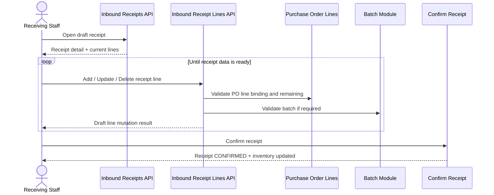
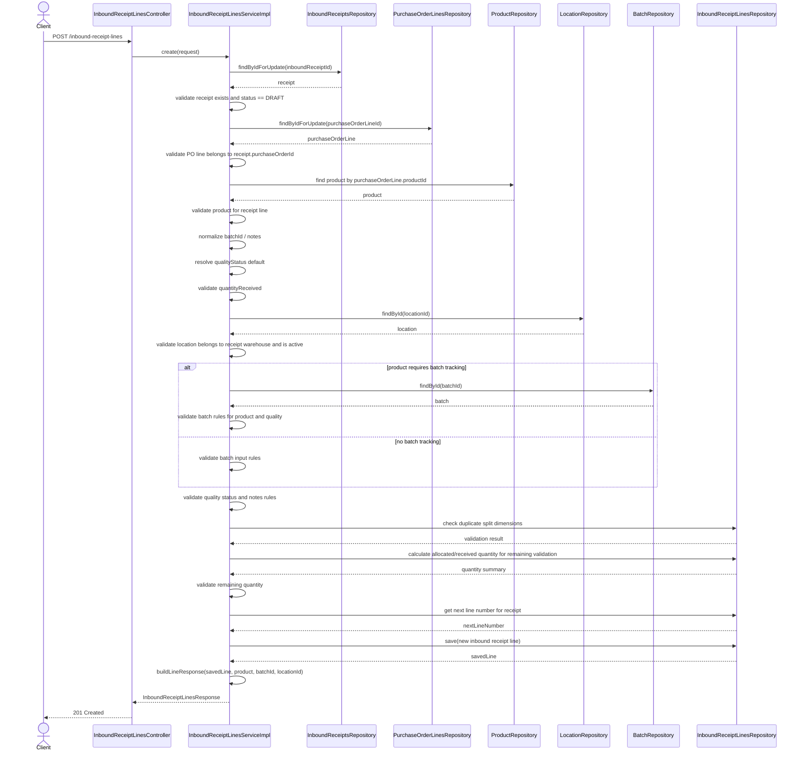
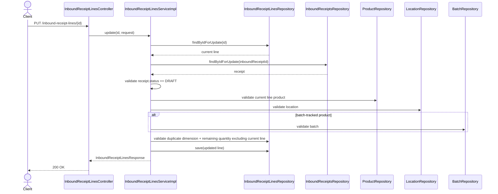
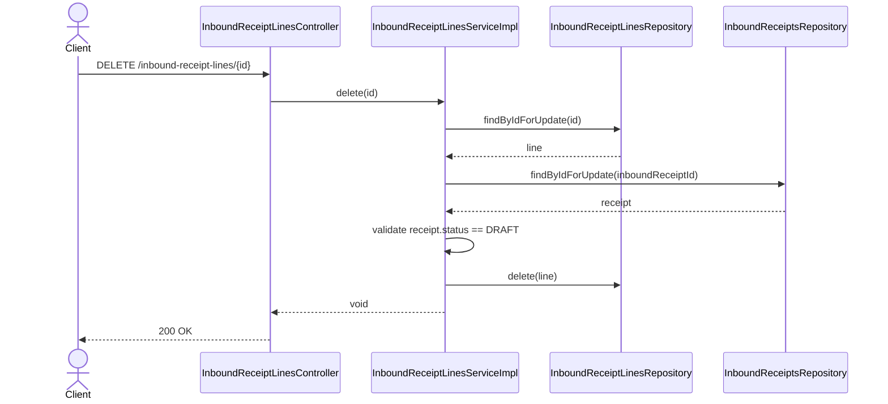

# WHS-58 Inbound Receipt Lines Design
## Date: 2026-03-13
## Scope: Draft receipt line mutation for inbound receiving

## 1. Jira Scope

Task: `WHS-58`  
Summary: `Implement inbound receipt lines APIs`

Lưu ý đồng bộ:

- Một số tài liệu roadmap cũ đang gọi cùng scope này là `WHS-46`
- Task thực thi hiện tại phải khóa theo Jira mới là `WHS-58`

Endpoints:

- `POST /api/v1/inbound-receipt-lines`
- `PUT /api/v1/inbound-receipt-lines/{id}`
- `DELETE /api/v1/inbound-receipt-lines/{id}`

Read path dùng lại từ `WHS-56`:

- `GET /api/v1/inbound-receipts/{id}` trả receipt detail kèm line list

## 2. Business Goal

`WHS-58` hoàn thiện lớp line-item dưới aggregate `InboundReceipts` để Receiving Staff ghi nhận đúng hàng thực tế
trước khi chạy transaction confirm ở `WHS-57`.

Task này sở hữu:

- thêm line vào receipt `DRAFT`
- cập nhật line của receipt `DRAFT`
- xóa line của receipt `DRAFT`
- khóa dữ liệu draft sao cho confirm không bị over-receipt hoặc sai warehouse/batch/quality

Không nằm trong scope:

- create/update/delete receipt header
- confirm receipt và update inventory
- stock movement write
- purchase order status transition
- auto-create batch master trong lúc lưu line

## 3. Design Checklist Locked Before Coding

### Invariant being protected

- `InboundReceipts` là aggregate root, line không được mutate tách rời parent receipt
- chỉ receipt `DRAFT` mới được phép đổi line
- mỗi receipt line phải thuộc cùng `purchase_order_id` và cùng `warehouse_id` scope với receipt cha
- draft line phải luôn ở trạng thái confirmable, không được để tổng quantity của draft receipt vượt quantity còn lại

### State transition being changed

- `WHS-58` không đổi `receipt.status`
- task chỉ mở quyền mutate child line khi parent receipt đang `DRAFT`

### Affected aggregate root

- aggregate root chính: `InboundReceipts`
- child entity: `InboundReceiptLines`
- upstream reference: `PurchaseOrderLines`

### Possible regression points

- split cùng một `purchase_order_line_id` thành nhiều line theo location/batch/quality
- update quantity của một line trong khi receipt đã có line khác cùng `purchase_order_line_id`
- non-batch product nhưng client vẫn gửi `batch_id`
- quarantine line thiếu notes
- confirm `WHS-57` fail vì `WHS-58` cho lưu draft vượt remaining

### Minimal verification strategy

- unit test cho create/update/delete happy path và guard rules
- integration test một chain `create receipt -> add lines -> confirm receipt`
- test riêng cho split line, quarantine và batch-tracked product

## 4. Locked Business Rules

- Chỉ receipt ở trạng thái `DRAFT` mới được create/update/delete line
- `purchase_order_line_id` phải tồn tại và phải thuộc đúng `purchase_order_id` của receipt cha
- `product_id` là field derive từ `purchase_order_line_id`, backend tự fill, không tin giá trị FE tự tính
- `quantity_received` bắt buộc `> 0`
- `quality_status` mặc định là `PASS`
- `quality_status = QUARANTINE` bắt buộc có `notes`
- `notes` tối đa `500` ký tự để bám schema hiện tại
- `location_id` bắt buộc, phải thuộc đúng `warehouse_id` của receipt và location không được `INACTIVE` hoặc `MAINTENANCE`
- Nếu product có `requires_batch_tracking = true` thì `batch_id` bắt buộc và batch phải thuộc đúng product
- Nếu product không track batch thì `batch_id` phải để trống
- Batch-tracked + `quality_status = PASS` chỉ nhận batch đang `AVAILABLE`
- Batch-tracked + `quality_status = QUARANTINE` chỉ nhận batch đang `AVAILABLE` hoặc `QUARANTINE`
- Batch `EXPIRED` hoặc `RECALLED` không được bind vào receipt line
- `WHS-58` không tự tạo batch mới; line chỉ bind tới batch đã tồn tại từ Module 03 hoặc flow chuẩn bị dữ liệu trước đó
- `line_number` do backend cấp theo `max(line_number) + 1`
- Không resequence `line_number` sau khi xóa

Rule split line cần khóa rõ:

- Cùng một `purchase_order_line_id` được phép xuất hiện nhiều lần trong cùng receipt
- Mục đích duy nhất là split hàng theo `location_id`, `batch_id` hoặc `quality_status`
- Không cho tạo hai line có cùng business dimension:
  - `(inbound_receipt_id, purchase_order_line_id, location_id, batch_id, quality_status)`
- Nếu người dùng muốn tăng quantity cho cùng dimension thì phải update line hiện có, không tạo line trùng

Rule quantity phải khóa theo draft receipt:

```text
confirmed_received = purchase_order_lines.quantity_received
other_draft_qty_same_receipt = tổng quantity của các line cùng purchase_order_line_id trong cùng receipt,
                               không tính line hiện tại khi update
remaining_for_request = quantity_ordered - confirmed_received - other_draft_qty_same_receipt
```

Yêu cầu:

- create/update chỉ hợp lệ khi `request.quantity_received <= remaining_for_request`
- mục tiêu là giữ draft data luôn confirm được ngay ở `WHS-57`

## 5. Data Ownership

Client được phép gửi khi create:

- `inbound_receipt_id`
- `purchase_order_line_id`
- `location_id`
- `batch_id`
- `quantity_received`
- `quality_status`
- `notes`

Client được phép gửi khi update:

- `location_id`
- `batch_id`
- `quantity_received`
- `quality_status`
- `notes`

Backend sở hữu:

- `id`
- `line_number`
- `product_id`
- `product_sku`
- `product_name`
- `batch_number`
- `location_code`
- `location_name`
- toàn bộ audit fields

Decision bị khóa:

- `purchase_order_line_id` không cho đổi ở API update
- nếu user chọn nhầm PO line thì phải delete line cũ và create line mới

## 6. API Contract Proposal

### Create Request

```json
{
  "inbound_receipt_id": "uuid",
  "purchase_order_line_id": "uuid",
  "location_id": "uuid",
  "batch_id": "uuid",
  "quantity_received": 25.00,
  "quality_status": "PASS",
  "notes": "optional"
}
```

### Update Request

```json
{
  "location_id": "uuid",
  "batch_id": "uuid",
  "quantity_received": 12.50,
  "quality_status": "QUARANTINE",
  "notes": "Carton damaged on arrival"
}
```

### Response

```json
{
  "id": "uuid",
  "inbound_receipt_id": "uuid",
  "purchase_order_line_id": "uuid",
  "product_id": "uuid",
  "product_sku": "SKU-001",
  "product_name": "Milk Powder 1kg",
  "batch_id": "uuid",
  "batch_number": "LOT-20260313-A",
  "location_id": "uuid",
  "location_code": "A-01-01",
  "location_name": "Inbound Staging A1",
  "line_number": 2,
  "quantity_received": 25.00,
  "quality_status": "PASS",
  "notes": "optional",
  "created_at": "2026-03-13 10:00:00",
  "updated_at": "2026-03-13 10:05:00"
}
```

## 7. Validation Matrix

### Create Line

- receipt phải tồn tại
- receipt phải đang `DRAFT`
- PO line phải tồn tại
- PO line phải thuộc đúng `purchase_order_id` của receipt
- derive product từ PO line rồi validate product tồn tại và không `INACTIVE`
- validate `location_id` thuộc warehouse của receipt
- validate batch rule theo `requires_batch_tracking`
- validate batch status phải tương thích với `quality_status`
- validate `quality_status`
- validate exact-duplicate split row chưa tồn tại trong cùng receipt
- validate quantity theo công thức `remaining_for_request`
- assign `line_number`

### Update Line

- line phải tồn tại
- parent receipt phải tồn tại và đang `DRAFT`
- không cho đổi `inbound_receipt_id`
- không cho đổi `purchase_order_line_id`
- `product_id` tiếp tục bám từ line hiện tại
- validate lại location, batch, quality như create
- validate lại batch status theo quality mới nếu user đổi `quality_status`
- validate quantity theo `remaining_for_request`, nhưng phải exclude quantity của chính line đang update
- nếu update làm line trùng đúng business dimension với line khác thì reject

### Delete Line

- line phải tồn tại
- parent receipt phải tồn tại và đang `DRAFT`
- chỉ xóa line
- không update inventory
- không update `purchase_order_lines.quantity_received`
- không resequence `line_number`

## 8. End-to-End Business Flow



## 9. Detailed Sequence Diagrams

### 9.1 Create Inbound Receipt Line



### 9.2 Update Inbound Receipt Line



### 9.3 Delete Inbound Receipt Line



## 10. Implementation Boundary

`InboundReceiptLinesServiceImpl` nên tự sở hữu các helper sau:

- `loadDraftReceiptForLineMutation`
- `loadPurchaseOrderLineForReceipt`
- `deriveAndValidateProductForLine`
- `validateLocationForReceiptLine`
- `validateBatchRulesForReceiptLine`
- `validateQualityRulesForReceiptLine`
- `validateRemainingQuantityForDraftReceipt`
- `validateDuplicateSplitDimension`
- `getNextLineNumber`
- `buildLineResponse`

Repository hooks nên có:

- `findByIdForUpdate(id)` cho `InboundReceiptLines`
- `findTopByInboundReceiptIdOrderByLineNumberDesc(...)`
- `findByInboundReceiptIdOrderByLineNumberAsc(...)`
- query tính tổng quantity draft theo `inboundReceiptId + purchaseOrderLineId`
- query check duplicate dimension trong cùng receipt

Decision kiến trúc bị khóa:

- lock parent receipt trước để serialize `line_number` và quantity allocation trong cùng receipt
- line service không được tự update inventory hoặc PO status
- receipt detail response từ `WHS-56` vẫn là read model chính cho FE

## 11. Failure Mapping

- Receipt không tồn tại -> `404`
- Receipt không ở `DRAFT` -> `400`
- Receipt line không tồn tại -> `404`
- PO line không thuộc receipt PO -> `400`
- Product không tồn tại hoặc `INACTIVE` -> `404/400`
- Location sai warehouse hoặc không usable -> `400`
- Thiếu batch cho batch-tracked product -> `400`
- Gửi `batch_id` cho non-batch product -> `400`
- `QUARANTINE` nhưng notes rỗng -> `400`
- Quantity vượt remaining -> `400`
- Duplicate split dimension -> `400`

## 12. FE Integration Notes

- FE không cần endpoint read riêng cho line; luôn reload qua `GET /api/v1/inbound-receipts/{id}`
- Screen nên hiển thị theo từng `purchase_order_line_id`:
  - `quantity_ordered`
  - `confirmed_received`
  - `draft_allocated_current_receipt`
  - `remaining_for_request`
- Nếu cùng một PO line được put vào nhiều location hoặc batch khác nhau, FE tạo nhiều line là hợp lệ
- Nếu cùng location + batch + quality thì FE phải update line hiện có thay vì tạo line mới
- Với product cần batch nhưng batch chưa tồn tại, FE phải tạo batch trước ở Module 03 hoặc flow hỗ trợ tương ứng
- Khi receipt đã `CONFIRMED`, toàn bộ editor line phải bị khóa

## 13. Minimal Verification Strategy

Unit test bắt buộc:

- create line thành công với product không track batch
- create line thành công khi split cùng PO line sang hai location khác nhau
- reject create khi receipt không `DRAFT`
- reject create khi PO line không thuộc receipt PO
- reject create khi quantity `<= 0`
- reject create khi tổng draft allocation vượt remaining
- reject create khi non-batch product vẫn có `batch_id`
- reject create khi batch-tracked product thiếu `batch_id`
- reject create khi `quality_status = QUARANTINE` nhưng notes rỗng
- update line thành công khi quantity mới vẫn còn trong remaining sau khi exclude chính line đó
- delete line thành công và không resequence line number

Integration test tối thiểu:

- `create receipt -> add valid lines -> confirm receipt` phải pass trọn chain
- `create receipt -> add invalid draft split -> confirm` phải fail ngay từ `WHS-58`, không chờ tới `WHS-57`

## 14. Related Documents

- `WHS-55_PURCHASE_ORDER_LINES_BA_DESIGN_20260309.md`
- `WHS-56_INBOUND_RECEIPTS_CRUD_DESIGN_20260309.md`
- `WHS-57_CONFIRM_RECEIPT_DESIGN_20260309.md`
- `FLOW_NGHIEP_VU_CUA_HE_THONG_20260312.md`
- `FLOW_NGHIEP_VU_ONBOARDING_TOM_TAT_20260312.md`
