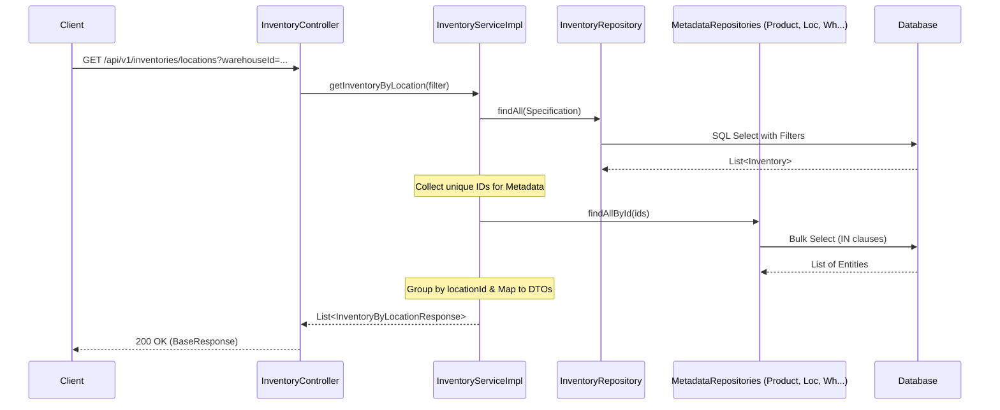

# API Documentation: Get Inventory by Location
## Lấy thông tin tồn kho gom nhóm theo vị trí (Location)

---

## 1. Thông tin chung
- **Endpoint**: `/api/v1/inventories/locations`
- **Method**: `GET`
- **Auth**: Yêu cầu Token hợp lệ (Bearer Token)
- **Mô tả**: Trả về danh sách tồn kho được gom nhóm theo từng vị trí (Location). Hỗ trợ nhân viên kho trong việc lấy hàng (Picking) và bổ sung hàng hóa (Replenishment) bằng cách biết chính xác sản phẩm nào đang nằm ở đâu.

---

## 2. Tham số yêu cầu (Request Parameters)

### 2.1. Query Parameters
| Tham số | Kiểu dữ liệu | Bắt buộc | Mô tả |
|---|---|---|---|
| `warehouseId` | `String (UUID)` | Không | Lọc tồn kho theo ID kho cụ thể. |
| `productId` | `String (UUID)` | Không | Lọc tồn kho của một sản phẩm cụ thể trên các vị trí. |

---

## 3. Phản hồi (Response)

### 3.1. Thành công (Success - 200 OK)
```json
{
  "status": "success",
  "message": "Operation successful",
  "data": [
    {
      "location_id": "loc-uuid-123",
      "location_code": "A-01-01",
      "location_name": "Kệ A - Tầng 1 - Ô 1",
      "warehouse_id": "wh-uuid-456",
      "warehouse_name": "Kho Chính Quận 9",
      "items": [
        {
          "product_id": "prod-uuid-789",
          "product_sku": "TSHIRT-L-BLUE",
          "product_name": "Áo thun nam size L - Xanh",
          "batch_id": "batch-uuid-001",
          "batch_number": "BATCH202603",
          "on_hand_quantity": 100.00,
          "reserved_quantity": 10.00,
          "available_quantity": 90.00
        }
      ]
    },
    {
      "location_id": null,
      "location_code": "N/A",
      "location_name": "Unassigned",
      "warehouse_id": "wh-uuid-456",
      "warehouse_name": "Kho Chính Quận 9",
      "items": [
        {
          "product_id": "prod-uuid-999",
          "product_sku": "SOCKS-001",
          "product_name": "Tất chân thể thao",
          "batch_id": null,
          "batch_number": null,
          "on_hand_quantity": 50.00,
          "reserved_quantity": 0.00,
          "available_quantity": 50.00
        }
      ]
    }
  ]
}
```

### 3.2. Cấu trúc dữ liệu `InventoryByLocationResponse`
| Trường | Kiểu dữ liệu | Mô tả |
|---|---|---|
| `location_id` | `String` | ID của vị trí. Trả về `null` nếu hàng chưa được phân vị trí. |
| `location_code` | `String` | Mã vị trí (ví dụ: A-01-01). |
| `location_name` | `String` | Tên hiển thị của vị trí. |
| `warehouse_id` | `String` | ID của kho chứa vị trí này. |
| `warehouse_name` | `String` | Tên của kho. |
| `items` | `List<Item>` | Danh sách các sản phẩm/lô hàng có trong vị trí này. |

### 3.3. Cấu trúc dữ liệu `LocationInventoryItem` (trong `items`)
| Trường | Kiểu dữ liệu | Mô tả |
|---|---|---|
| `product_id` | `String` | ID sản phẩm. |
| `product_sku` | `String` | Mã SKU sản phẩm. |
| `product_name` | `String` | Tên sản phẩm. |
| `batch_id` | `String` | ID của lô hàng (nếu có). |
| `batch_number` | `String` | Số lô hàng (nếu có). |
| `on_hand_quantity` | `BigDecimal` | Số lượng thực tế tại vị trí này. |
| `reserved_quantity` | `BigDecimal` | Số lượng đã bị giữ chỗ tại vị trí này. |
| `available_quantity` | `BigDecimal` | Số lượng thực tế có thể sử dụng (`on_hand` - `reserved`). |

---

## 4. Luồng xử lý (Logic Flow)

1. **Controller**: Nhận các tham số lọc (`warehouseId`, `productId`).
2. **Service**:
   - Truy vấn toàn bộ danh sách `Inventory` khớp với điều kiện lọc từ `InventoryRepository`.
   - Thu thập tất cả các IDs (Product, Warehouse, Location, Batch) có trong kết quả.
   - Thực hiện **Bulk Fetch** (truy vấn theo danh sách ID) để lấy thông tin chi tiết của các thực thể liên quan, tránh lỗi N+1.
   - Sử dụng Java Stream API để gom nhóm (`groupingBy`) danh sách tồn kho theo `locationId`.
   - Trường hợp `locationId` là null, hệ thống gán vào nhóm đặc biệt "Unassigned".
3. **Mapper**: Ánh xạ dữ liệu từ Entity và các Map metadata sang cấu trúc DTO phân cấp (Location -> Items).
4. **Kết quả**: Trả về danh sách các vị trí, mỗi vị trí chứa danh sách sản phẩm tương ứng.

---

## 5. Biểu đồ trình tự (Sequence Diagram)



---

## 6. Mã lỗi (Error Codes)

| Mã lỗi | HTTP Status | Mô tả |
|---|---|---|
| `COM_001` | 400 | Tham số lọc không hợp lệ (ví dụ: định dạng UUID sai). |
| `AUTH_403` | 403 | Không có quyền truy cập tài nguyên này. |
| `INTERNAL_SERVER_ERROR` | 500 | Lỗi hệ thống khi xử lý gom nhóm dữ liệu. |
