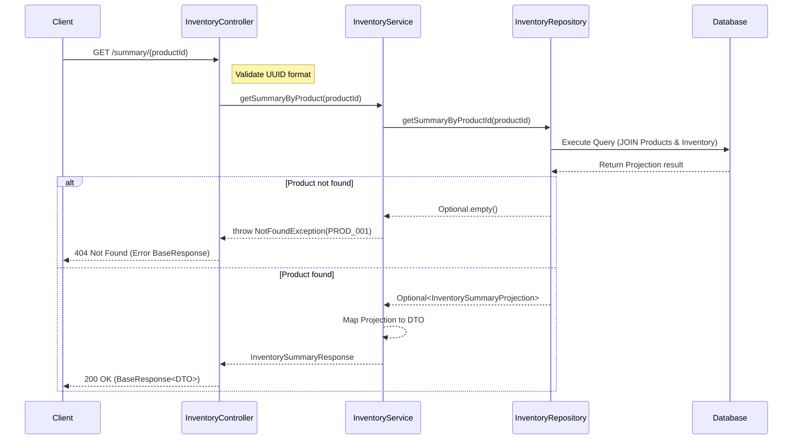

# API Documentation: Get Inventory Summary
## Lấy thông tin tổng hợp tồn kho của sản phẩm

---

## 1. Thông tin chung
- **Endpoint**: `/api/v1/inventory/summary/{productId}`
- **Method**: `GET`
- **Auth**: Yêu cầu Token hợp lệ (Bearer Token)
- **Mô tả**: Trả về thông tin tổng hợp về số lượng tồn kho (On-hand), số lượng đang giữ (Reserved), số lượng kho (Warehouses) và số lượng vị trí (Locations) mà sản phẩm đó đang hiện diện.

---

## 2. Tham số yêu cầu (Request Parameters)

### 2.1. Path Variable
| Tham số | Kiểu dữ liệu | Bắt buộc | Mô tả |
|---|---|---|---|
| `productId` | `String (UUID)` | Có | ID của sản phẩm cần lấy thông tin tổng hợp. Phải đúng định dạng UUID. |

---

## 3. Phản hồi (Response)

### 3.1. Thành công (Success - 200 OK)
```json
{
  "status": "success",
  "message": "Operation successful",
  "data": {
    "productId": "550e8400-e29b-41d4-a716-446655440000",
    "productSku": "PROD-SKU-001",
    "productName": "Sản phẩm mẫu A",
    "totalOnHandQuantity": 150.50,
    "totalReservedQuantity": 20.00,
    "warehouseCount": 2,
    "locationCount": 5
  }
}
```

### 3.2. Cấu trúc dữ liệu `InventorySummaryResponse`
| Trường | Kiểu dữ liệu | Mô tả |
|---|---|---|
| `productId` | `String` | ID của sản phẩm. |
| `productSku` | `String` | Mã SKU của sản phẩm. |
| `productName` | `String` | Tên sản phẩm. |
| `totalOnHandQuantity` | `BigDecimal` | Tổng số lượng thực tế có trong tất cả các kho. |
| `totalReservedQuantity` | `BigDecimal` | Tổng số lượng đang được giữ (cho các đơn hàng, chuyển kho...). |
| `warehouseCount` | `Long` | Số lượng kho khác nhau mà sản phẩm này đang có tồn kho. |
| `locationCount` | `Long` | Số lượng vị trí (bin/shelf) khác nhau mà sản phẩm này đang có tồn kho. |

---

## 4. Luồng xử lý (Logic Flow)

1. **Controller**: Nhận `productId` từ đường dẫn URL. Kiểm tra định dạng UUID bằng Validation Annotation.
2. **Service**: Gọi phương thức `getSummaryByProduct(productId)` trong `InventoryServiceImpl`.
3. **Repository**: Thực hiện truy vấn SQL (JPQL) sử dụng phép `LEFT JOIN` giữa bảng `Products` và `Inventory`.
   - Tính tổng `onHandQuantity` và `reservedQuantity`.
   - Đếm số lượng `warehouseId` và `locationId` duy nhất (`COUNT DISTINCT`).
   - Nhóm theo thông tin sản phẩm (`GROUP BY`).
4. **Xử lý lỗi**: Nếu sản phẩm không tồn tại, hệ thống sẽ ném ra ngoại lệ `NotFoundException` với mã lỗi `PROD_001`.
5. **Kết quả**: Ánh xạ từ Projection (kết quả truy vấn) sang DTO và trả về cho người dùng.

---

## 5. Biểu đồ trình tự (Sequence Diagram)



---

## 6. Mã lỗi (Error Codes)

| Mã lỗi | HTTP Status | Mô tả |
|---|---|---|
| `COM_001` | 400 | Dữ liệu đầu vào không hợp lệ (ví dụ: productId không đúng định dạng UUID). |
| `PROD_001` | 404 | Không tìm thấy sản phẩm với ID cung cấp. |
| `INTERNAL_SERVER_ERROR` | 500 | Lỗi hệ thống không xác định. |
