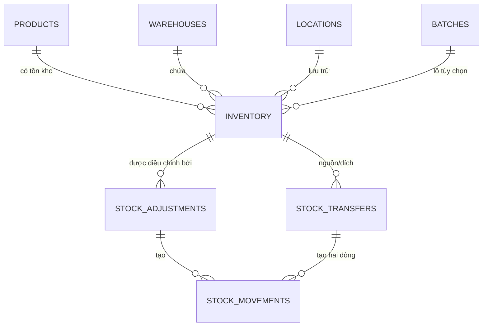
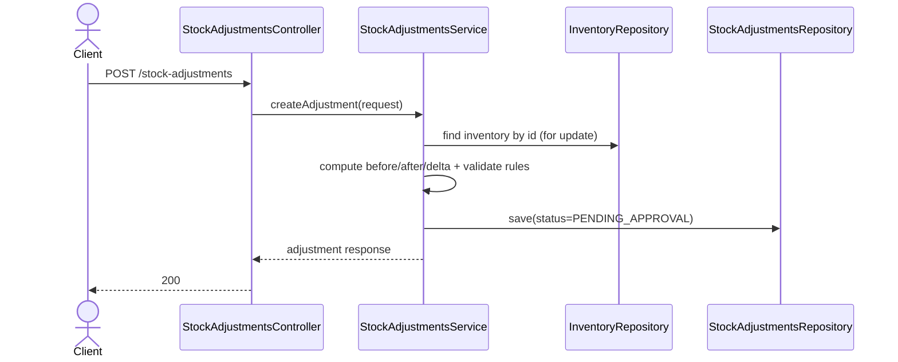
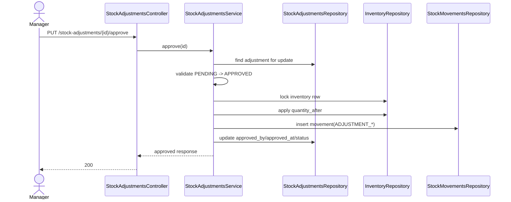
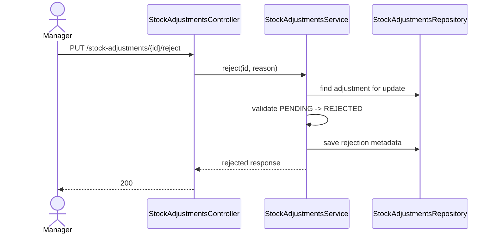
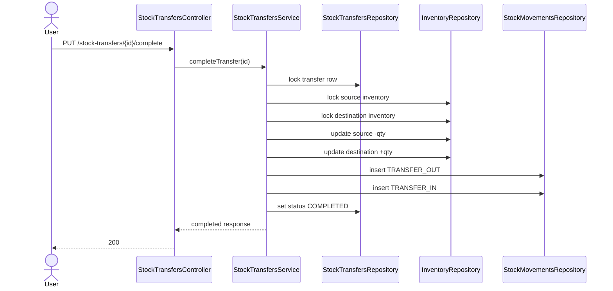
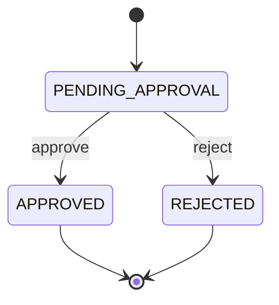
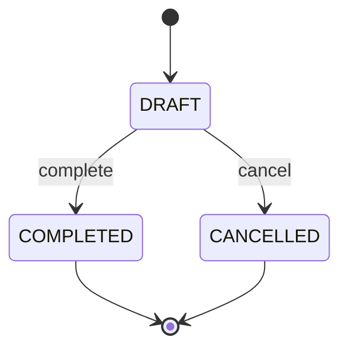

# Module 4 - Thiết kế lại Nghiệp vụ Tồn kho (v2)
## Phạm vi: Tồn kho + Điều chỉnh tồn kho + Chuyển kho + Biến động tồn kho

---

## 1) Thông tin Tài liệu

| Thuộc tính | Giá trị |
|---|---|
| Module | Quản lý Tồn kho (Module 4) |
| Phiên bản | 2.0 |
| Ngày | 2026-03-04 |
| Trạng thái | Đề xuất triển khai |
| Tác giả | BA + Backend Review |
| Jira liên quan | WHS-19, WHS-20, WHS-21..24, WHS-25, WHS-87 |
| GitHub liên quan | issue #49 |
| Ghi chú Review liên quan | `BA_STOCK_MOVEMENT_AUDIT_DECISION.md` |

---

## 2) Tại sao cần Thiết kế lại

Triển khai hiện tại và schema hiện tại cho thấy các rủi ro về tính nhất quán:

1. `stock_adjustments` lưu trữ cả `inventory_id` và các trường dimension trùng lặp (`product_id`, `warehouse_id`, `location_id`, `batch_id`) mà không có cơ chế DB nghiêm ngặt để đảm bảo chúng luôn khớp.
2. Khóa duy nhất của `inventory` sử dụng các cột nullable và có thể cho phép các dòng logic trùng lặp trong MySQL.
3. Các ràng buộc của `stock_adjustments` không đủ cho các quy tắc workflow (metadata `APPROVED`, lý do từ chối, điều chỉnh khác không).
4. Luồng phê duyệt và các tác động phụ lên inventory chưa được mô hình hóa đầy đủ trong service implementation hiện tại.
5. Entity/schema `stock_movements` chưa được align đầy đủ (`warehouse_id` không khớp).

Tài liệu này định nghĩa thiết kế trạng thái mục tiêu để khắc phục các khoảng trống này.

---

## 3) Nguyên tắc Thiết kế

1. Nguồn duy nhất cho stock dimension: dòng `inventory`.
2. Bảng tài liệu (`stock_adjustments`, `stock_transfers`) là giao dịch kinh doanh, không phải nguồn thứ cấp cho inventory.
3. Mọi thao tác thay đổi stock đều ghi vào `stock_movements` trong cùng một giao dịch.
4. Không có stock âm. `reserved_quantity <= on_hand_quantity` luôn luôn đúng.
5. Các chuyển đổi trạng thái rõ ràng với metadata phê duyệt/từ chối rõ ràng.

---

## 4) Mô hình Dữ liệu Chuẩn

### 4.1 Bảng cốt lõi và vai trò

1. `inventory`: snapshot tồn kho hiện tại (nguồn thực thật).
2. `stock_adjustments`: tài liệu kinh doanh cho yêu cầu điều chỉnh và phê duyệt.
3. `stock_transfers`: tài liệu kinh doanh cho việc di chuyển giữa các vị trí.
4. `stock_movements`: audit trail bất biến cho tất cả các thay đổi tồn kho.

### 4.2 Bản đồ quan hệ



---

## 5) Schema Mục tiêu (Ưu tiên Kinh doanh)

### 5.1 inventory

Các ràng buộc bắt buộc:

1. Số lượng không âm.
2. `reserved_quantity <= on_hand_quantity`.
3. Khóa dimension logic duy nhất.

Phương pháp thực tế được khuyến nghị:

1. Giữ `location_id` bắt buộc cho các dòng vận hành.
2. Cho `batch_id` nullable, áp dụng chiến lược null-normalization trước khi index duy nhất (implementation cụ thể trong migration).
3. Thêm optimistic lock (`@Version`) alignment trong entity.

### 5.2 stock_adjustments

Hình dạng được khuyến nghị:

1. Giữ `inventory_id` như tham chiếu bắt buộc.
2. Xóa các trường dimension trùng lặp HOẶC giữ chúng như các trường `snapshot_*` rõ ràng.
3. Giữ `quantity_before`, `quantity_after`, `adjustment_quantity`, `reason`, `status`, các trường audit.

Các ràng buộc bắt buộc:

1. `quantity_before >= 0`
2. `quantity_after >= 0`
3. `adjustment_quantity = quantity_after - quantity_before`
4. `adjustment_quantity <> 0`
5. `status = APPROVED => approved_by IS NOT NULL AND approved_at IS NOT NULL`
6. `status = REJECTED => rejection_reason IS NOT NULL`

### 5.3 stock_transfers

Hình dạng được khuyến nghị:

1. Giữ các trường header của tài liệu.
2. Đảm bảo vị trí nguồn và đích khác nhau.
3. Đảm bảo nguồn và đích thuộc cùng kho cho chuyển kho nội bộ.

Phương án A (được khuyến nghị):

1. Sử dụng các tham chiếu inventory nguồn và đích (`from_inventory_id`, `to_inventory_id`) để giảm ambiguosity.

Phương án B:

1. Giữ các cột hiện tại nhưng enforce cross-table validation trong service và optional DB-level checks nếu khả thi.

### 5.4 stock_movements

Bắt buộc:

1. Bảng insert-only.
2. Phải bao gồm `warehouse_id`, `product_id`, `location_id` (nullable nếu business cho phép), optional `batch_id`.
3. `quantity_after = quantity_before + quantity_change`.
4. `quantity_before >= 0`, `quantity_after >= 0`.

---

## 6) Topology API (Trạng thái Mục tiêu)

### 6.1 Inventory APIs

| Method | Endpoint | Mục đích | Tác động lên Stock | Giao dịch |
|---|---|---|---|---|
| GET | `/api/v1/inventories` | danh sách tồn kho với bộ lọc | Không | Chỉ đọc |
| GET | `/api/v1/inventories/summary/{productId}` | tổng hợp theo sản phẩm | Không | Chỉ đọc |
| GET | `/api/v1/inventories/by-location` | tổng hợp theo vị trí | Không | Chỉ đọc |
| POST | `/api/v1/inventories/check-availability` | kiểm tra khả dụng | Không | Chỉ đọc |
| POST | `/api/v1/inventories/reserve` | đặt trước tồn kho | Có (`reserved`) | Bắt buộc |
| POST | `/api/v1/inventories/unreserve` | giải phóng đặt trước | Có (`reserved`) | Bắt buộc |
| POST | `/api/v1/inventories/increase` | tăng tồn kho thực tế | Có (`on_hand`) | Bắt buộc |
| POST | `/api/v1/inventories/decrease` | giảm tồn kho thực tế | Có (`on_hand`) | Bắt buộc |

### 6.2 Stock Adjustment APIs

| Method | Endpoint | Mục đích | Tác động lên Stock |
|---|---|---|---|
| POST | `/api/v1/stock-adjustments` | tạo yêu cầu điều chỉnh | chỉ nếu auto-approved |
| GET | `/api/v1/stock-adjustments` | danh sách yêu cầu | Không |
| GET | `/api/v1/stock-adjustments/{id}` | chi tiết | Không |
| PUT | `/api/v1/stock-adjustments/{id}/approve` | phê duyệt điều chỉnh đang chờ | Có |
| PUT | `/api/v1/stock-adjustments/{id}/reject` | từ chối điều chỉnh đang chờ | Không |

### 6.3 Stock Transfer APIs

| Method | Endpoint | Mục đích | Tác động lên Stock |
|---|---|---|---|
| POST | `/api/v1/stock-transfers` | tạo tài liệu chuyển kho | tùy chọn (nếu immediately) |
| GET | `/api/v1/stock-transfers` | danh sách chuyển kho | Không |
| GET | `/api/v1/stock-transfers/{id}` | chi tiết | Không |
| PUT | `/api/v1/stock-transfers/{id}/complete` | thực hiện chuyển kho | Có |
| PUT | `/api/v1/stock-transfers/{id}/cancel` | hủy bản nháp chuyển kho | Không |

### 6.4 Stock Movement APIs

| Method | Endpoint | Mục đích |
|---|---|---|
| GET | `/api/v1/stock-movements` | danh sách lịch sử biến động |
| GET | `/api/v1/stock-movements/{id}` | chi tiết biến động |
| GET | `/api/v1/stock-movements/reference/{referenceType}/{referenceId}` | biến động theo tài liệu kinh doanh |

---

## 7) Hợp đồng API Chính (Chi tiết)

### 7.1 POST /api/v1/stock-adjustments

Request:

```json
{
  "inventory_id": "uuid",
  "quantity_after": 120,
  "reason": "COUNT_ERROR",
  "notes": "Cycle count mismatch at zone A",
  "requires_approval": true
}
```

Quy tắc:

1. `quantity_before` phải được load từ DB inventory, không phải từ client.
2. `adjustment_quantity = quantity_after - quantity_before`.
3. Từ chối khi `quantity_after < 0`.
4. Từ chối khi `quantity_after < reserved_quantity`.
5. Từ chối khi `adjustment_quantity = 0`.

Response:

```json
{
  "id": "uuid",
  "adjustment_number": "ADJ-20260304103000-AB12CD34",
  "status": "PENDING_APPROVAL"
}
```

### 7.2 PUT /api/v1/stock-adjustments/{id}/approve

Request:

```json
{
  "approval_note": "Count sheet verified"
}
```

Quy tắc:

1. Chuyển đổi chỉ `PENDING_APPROVAL -> APPROVED`.
2. Lock dòng adjustment và inventory.
3. Revalidate trạng thái inventory kết quả trước khi commit.
4. Ghi một dòng movement với `ADJUSTMENT_INCREASE` hoặc `ADJUSTMENT_DECREASE`.

### 7.3 PUT /api/v1/stock-adjustments/{id}/reject

Request:

```json
{
  "rejection_reason": "Evidence not sufficient"
}
```

Quy tắc:

1. Chuyển đổi chỉ `PENDING_APPROVAL -> REJECTED`.
2. Inventory không thay đổi.
3. `rejection_reason` bắt buộc.

### 7.4 POST /api/v1/inventories/reserve

Request:

```json
{
  "inventory_id": "uuid",
  "quantity": 10,
  "reference_type": "SALES_ORDER",
  "reference_id": "uuid"
}
```

Quy tắc:

1. `available = on_hand - reserved` phải đủ.
2. Lock dòng và update `reserved_quantity` atomically.
3. Ghi `stock_movements` type `RESERVE`.

### 7.5 POST /api/v1/inventories/unreserve

1. Đảo ngược quy tắc reserve với validation không âm.
2. Ghi movement type `UNRESERVE`.

### 7.6 POST /api/v1/inventories/increase

**Mục đích**: Tăng số lượng tồn kho thực tế (on-hand) cho một tổ hợp kích thước kho cụ thể (Sản phẩm, Kho hàng, Vị trí, Số lô). API này thường được gọi bởi các nghiệp vụ Nhập hàng (Xác nhận phiếu nhập) hoặc Điều chỉnh kho (Manual Adjustment).

#### Quy tắc nghiệp vụ & Logic xử lý:

1. **Kiểm soát chống trùng lặp (Idempotency Control)**:
   * Client BẮT BUỘC phải cung cấp `reference_type` và một trong hai: `reference_id` hoặc `reference_number`.
   * Hệ thống sử dụng khóa định danh (Lock Key) phân tán: `lock:inventory:reference:{type}:{id|number}`.
   * Nếu một yêu cầu với cùng mã tham chiếu đang được xử lý, các yêu cầu trùng lặp sau đó sẽ bị từ chối để tránh việc tăng kho hai lần cho cùng một chứng từ.

2. **Quản lý tranh chấp (Concurrency Management)**:
   * Sử dụng **Redisson Distributed Lock** để đảm bảo việc xử lý tuần tự trên mỗi mã tham chiếu.
   * Sử dụng `SELECT ... FOR UPDATE` ở mức cơ sở dữ liệu khi Tìm/Tạo bản ghi kho để tránh tình trạng Race Condition (tranh chấp dữ liệu) trên cùng một dòng tồn kho vật lý.

3. **Tìm hoặc Tạo mới (Find or Create)**:
   * Nếu bản ghi kho đã tồn tại (khớp Sản phẩm, Kho, Vị trí, Lô), hệ thống sẽ cập nhật số lượng.
   * Nếu chưa có, một bản ghi mới sẽ được tạo một cách nguyên tử (atomic).

4. **Nhật ký biến động (Audit Trail)**:
   * Mọi giao dịch tăng kho ĐỀU PHẢI ghi nhận vào bảng `stock_movements`.
   * Loại biến động được xác định dựa trên `reference_type` (VD: `INBOUND_RECEIPT` -> `INBOUND`, `STOCK_ADJUSTMENT` -> `ADJUSTMENT_INCREASE`).
   * Lưu trữ giá trị `quantity_before` (trước) và `quantity_after` (sau) để truy xuất nguồn gốc đầy đủ.

#### Quy trình xử lý (Request Flow):

1. Chiếm giữ khóa Redisson dựa trên `reference_type` và `reference_id/number`.
2. Kiểm tra tính hợp lệ của các thông tin (Sản phẩm, Kho hàng...).
3. Tìm hoặc Tạo dòng tồn kho với khóa `FOR UPDATE`.
4. Tính toán: `on_hand_after = on_hand_before + quantity`.
5. Cập nhật bản ghi Kho và Lưu (Save).
6. Ghi nhật ký Stock Movement (nằm trong cùng một giao dịch DB).
7. Giải phóng khóa Redisson.

#### Xử lý lỗi:

* `COM_001`: Thiếu mã tham chiếu chống trùng lặp (Idempotency key).
* `COM_009`: Xung đột - Yêu cầu đang được xử lý hoặc hết thời gian chờ khóa.
* `INV_001`: Thông tin kích thước kho không hợp lệ.
* `DataIntegrityViolation`: Phát hiện trùng lặp mã tham chiếu ở mức DB (lớp bảo vệ cuối cùng).

### 7.7 POST /api/v1/inventories/decrease

1. Giảm số lượng on-hand.
2. Ngăn underflow và vi phạm reserved.
3. Ghi movement type `OUTBOUND` hoặc `ADJUSTMENT_DECREASE`.

### 7.8 PUT /api/v1/stock-transfers/{id}/complete

1. Lock source và destination inventory rows.
2. Giảm source và tăng destination trong một giao dịch.
3. Ghi 2 dòng movement: `TRANSFER_OUT`, `TRANSFER_IN`.

---

## 8) Sơ đồ Sequence

### 8.1 Tạo điều chỉnh (chờ phê duyệt)



### 8.2 Phê duyệt điều chỉnh



### 8.3 Từ chối điều chỉnh



### 8.4 Hoàn tất chuyển kho



---

## 9) Máy trạng thái

### 9.1 stock_adjustments



### 9.2 stock_transfers



---

## 10) Ma trận Quy tắc Kinh doanh

| ID | Quy tắc |
|---|---|
| BR-INV-01 | `available = on_hand - reserved` |
| BR-INV-02 | `on_hand >= 0` |
| BR-INV-03 | `reserved >= 0` and `reserved <= on_hand` |
| BR-INV-04 | Adjustment `quantity_before` từ DB snapshot |
| BR-INV-05 | Adjustment delta phải khác không |
| BR-INV-06 | Approve/reject chỉ từ `PENDING_APPROVAL` |
| BR-INV-07 | Điều chỉnh đã phê duyệt phải update inventory và movement trong cùng giao dịch |
| BR-INV-08 | Điều chỉnh bị từ chối không được sửa inventory |
| BR-INV-09 | Hoàn tất chuyển kho là atomic across source và destination |
| BR-INV-10 | Mọi action thay đổi stock đều ghi movement log |

---

## 11) Mô hình Lỗi (Đề xuất)

| Khu vực | Mã đề xuất | Mô tả |
|---|---|---|
| Adjustment | `STA_001` | Yêu cầu điều chỉnh không hợp lệ |
| Adjustment | `STA_002` | Chuyển đổi trạng thái điều chỉnh không hợp lệ |
| Adjustment | `STA_404` | Không tìm thấy điều chỉnh |
| Inventory | `INV_001` | Không tìm thấy inventory |
| Inventory | `INV_004` | Không đủ tồn kho |
| Common | `COM_001` | Lỗi validation |
| Auth | `AUTH_403` | Forbidden |

Lưu ý: map tới project `ErrorCode` enum một cách nhất quán trong implementation.

---

## 12) Thứ tự Triển khai (phải tuân thủ)

1. Hoàn thiện thiết kế (review tài liệu này).
2. Migration refactor cho table constraints và chiến lược dimension trùng lặp.
3. Service/controller implementation cho adjustment + transfer + inventory side effects.
4. Unit tests và integration tests.
5. Code review và rollout.

---

## 13) Ma trận Phạm vi Test

### 13.1 Tạo điều chỉnh

1. thành công pending.
2. thành công auto-approved.
3. từ chối inventory không hợp lệ.
4. từ chối quantity_after âm.
5. từ chối quantity_after dưới reserved.
6. từ chối delta bằng không.

### 13.2 Phê duyệt/Từ chối điều chỉnh

1. approve thành công và inventory đã thay đổi.
2. reject thành công và inventory không thay đổi.
3. chuyển đổi không hợp lệ trả về conflict.
4. approve concurrent được handle bằng lock/version.

### 13.3 Chuyển kho

1. complete thành công update cả hai dòng.
2. source không đủ tồn kho.
3. source bằng destination bị từ chối.
4. cross-warehouse mismatch bị từ chối.

### 13.4 Audit Movement

1. dòng movement được tạo cho mỗi endpoint thay đổi stock.
2. số học quantity before/after nhất quán.
3. mapping reference đúng.

---

## 14) Align Task Jira

Redesign này ảnh hưởng trực tiếp các task Jira này:

1. `WHS-20` (parent) - phải bao gồm track schema consistency.
2. `WHS-21` tạo điều chỉnh - update AC cho DB-sourced `quantity_before` và consistency validation.
3. `WHS-22` danh sách điều chỉnh - bao gồm inventory_id/status/date filters và indexes.
4. `WHS-23` phê duyệt điều chỉnh - bao gồm atomic inventory + movement side effects.
5. `WHS-24` từ chối điều chỉnh - bao gồm strict transition và không có inventory side effects.
6. `WHS-25` parent transfer - bao gồm source/destination consistency constraints.
7. `WHS-87` complete transfer - theo dõi atomic source/destination mutation, movement audit, và deadlock-safe locking review cho `PUT /api/v1/stock-transfers/{id}/complete`.

Task bổ sung được khuyến nghị:

1. `Refactor inventory schema consistency for adjustment/transfer` (migration + backfill + entity alignment).

---

## 15) Khoảng trống Code Hiện tại (Quick Snapshot)

1. `InventoryController`, `StockTransfersController`, `StockMovementsController` là các controller placeholder.
2. `StockAdjustmentsServiceImpl` có partial create và unimplemented approve/reject/list/detail logic.
3. `StockTransfersStatus` enum hiện có typo `DAFT` và nên là `DRAFT`.
4. Entity `StockMovements` phải align với các cột DB (`warehouse_id` trong schema).

---

## 16) Checklist Quyết định cho Team Review

1. Giữ các dimension trùng lặp trong `stock_adjustments` như snapshots, hay xóa?
2. Giữ immediate transfer completion, hay chia workflow create và complete?
3. Standardize quantity precision tại `DECIMAL(15,2)` hay chuyển tất cả sang `DECIMAL(19,6)`?
4. Chọn chiến lược locking: pessimistic only, hay optimistic với retry?

---

## 17) Ghi chú Triển khai WHS-70

Các thay đổi đã implement cho `feature/WHS-70-inventory-schema-consistency`:

1. Migration mới: `V20260404_01__Refactor_inventory_schema_consistency.sql`.
2. `inventory` logical uniqueness hiện normalize các dimension nullable (`location_id`, `batch_id`) trước khi enforce unique.
3. `stock_adjustments` hiện enforce:
   - số lượng không âm,
   - tính nhất quán số học (`adjustment_quantity = quantity_after - quantity_before`),
   - delta khác không,
   - strict workflow metadata cho các trạng thái pending/approved/rejected.
4. `stock_movements` và JPA entity mapping được align (bao gồm `warehouse_id`, các trường nullable `location_id/reference`).
5. `StockAdjustmentsServiceImpl` hiện fully implement:
   - create (pending và auto-approved),
   - approve/reject transition checks,
   - atomic inventory + movement side effects.
6. `StockTransfersServiceImpl` hiện fully implement:
   - create/list/detail,
   - complete/cancel transitions,
   - atomic source/destination inventory updates với `TRANSFER_OUT` + `TRANSFER_IN` movements.
7. Thêm integration tests cho adjustment constraints và inventory optimistic lock behavior, cộng với unit tests cho adjustment/transfer workflows.

### Ghi chú Tương thích Ngược

1. `POST /api/v1/stock-adjustments` vẫn accept các trường legacy (`product_id`, `warehouse_id`, `location_id`, `batch_id`, `quantity_before`) nhưng hiện coi `inventory_id` là source-of-truth và derive snapshot values từ inventory tại runtime.
2. Enum `StockTransfersStatus` typo đã được fix từ `DAFT` sang `DRAFT` để align với các giá trị DB enum. Bất kỳ client-side use nào của `DAFT` phải được update.

---

**Hết tài liệu**
