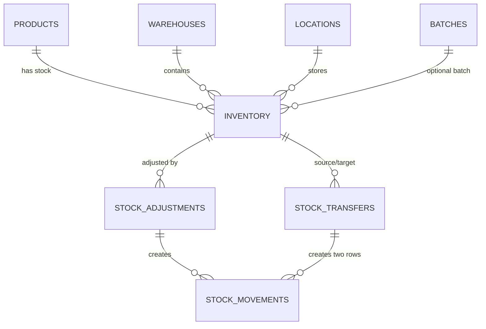
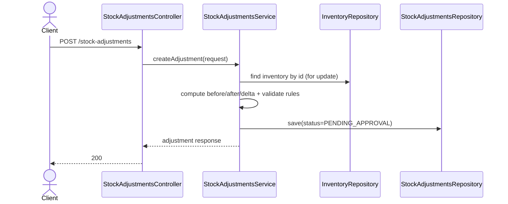
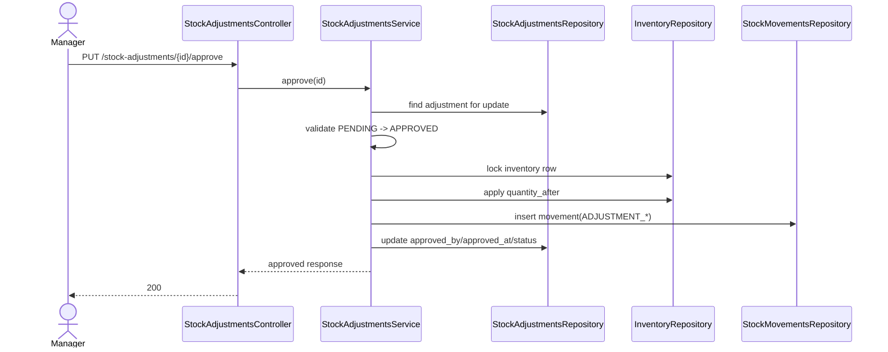
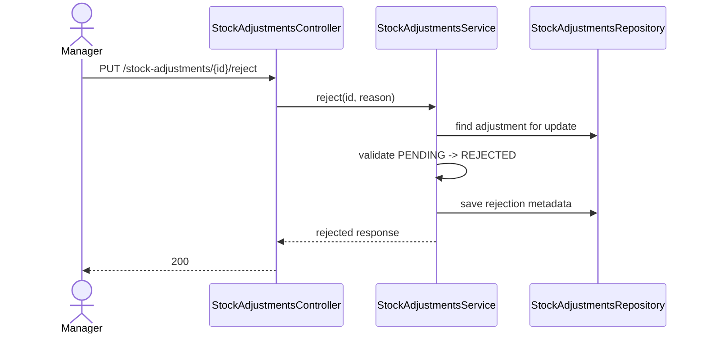
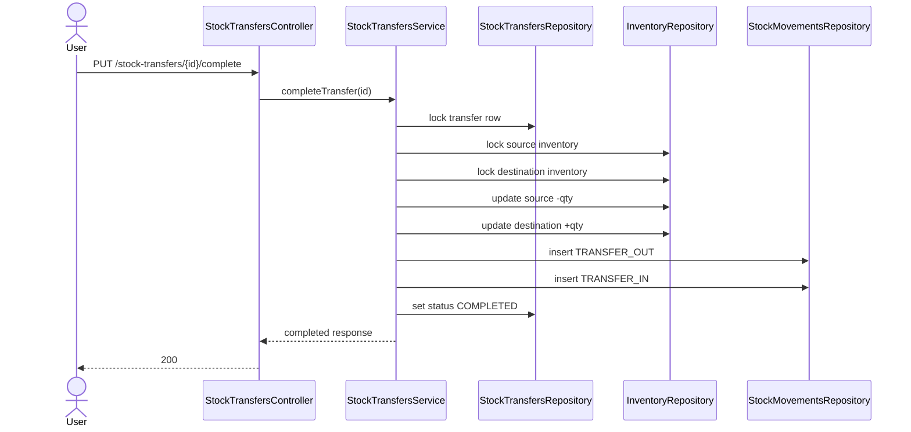
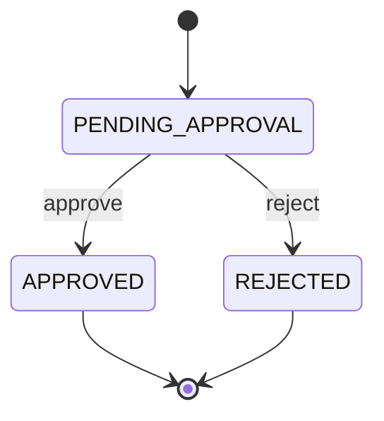
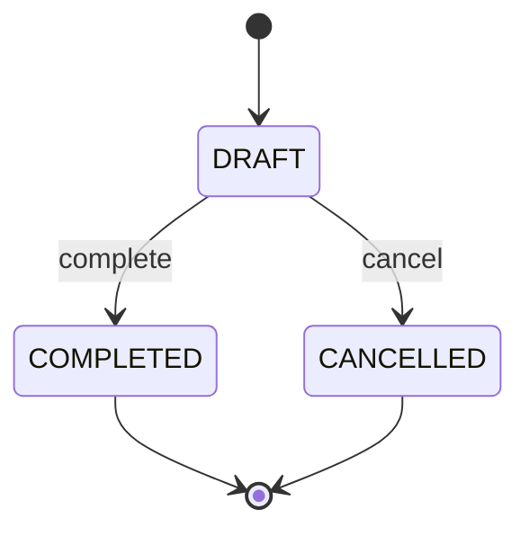

# Module 4 - Inventory Operations Redesign (v2)
## Scope: Inventory + Stock Adjustments + Stock Transfers + Stock Movements

---

## 1) Document Information

| Property | Value |
|---|---|
| Module | Inventory Management (Module 4) |
| Version | 2.0 |
| Date | 2026-03-04 |
| Status | Proposed for implementation |
| Author | BA + Backend Review |
| Related Jira | WHS-19, WHS-20, WHS-21..24, WHS-25, WHS-87 |
| Related GitHub | issue #49 |

---

## 2) Why This Redesign

Current implementation and schema show consistency risks:

1. `stock_adjustments` stores both `inventory_id` and duplicated dimension fields (`product_id`, `warehouse_id`, `location_id`, `batch_id`) without a strict DB mechanism to guarantee they always match.
2. `inventory` unique key uses nullable columns and can allow duplicate logical rows in MySQL.
3. `stock_adjustments` constraints are not enough for workflow rules (`APPROVED` metadata, reject reason, non-zero adjustment).
4. Approval flow and inventory side effects are not fully modeled in the current service implementation.
5. `stock_movements` entity/schema are not fully aligned (`warehouse_id` mismatch).

This document defines a target-state design to fix these gaps.

---

## 3) Design Principles

1. Single source of truth for stock dimension: `inventory` row.
2. Document tables (`stock_adjustments`, `stock_transfers`) are business transactions, not secondary inventory truth.
3. Every stock-changing operation writes to `stock_movements` in the same transaction.
4. No negative stock. `reserved_quantity <= on_hand_quantity` always.
5. Clear state transitions with explicit approval/rejection metadata.

---

## 4) Canonical Data Model

## 4.1 Core tables and role

1. `inventory`: current stock snapshot (source of truth).
2. `stock_adjustments`: business document for correction requests and approvals.
3. `stock_transfers`: business document for movement between locations.
4. `stock_movements`: immutable audit trail for all stock changes.

## 4.2 Relationship map



---

## 5) Schema Target (Business-first)

## 5.1 inventory

Required constraints:

1. Non-negative quantities.
2. `reserved_quantity <= on_hand_quantity`.
3. Unique logical dimension key.

Recommended practical approach:

1. Keep `location_id` mandatory for operational rows.
2. For nullable `batch_id`, apply null-normalization strategy before unique indexing (DB-specific implementation in migration).
3. Add optimistic lock (`@Version`) alignment in entity.

## 5.2 stock_adjustments

Recommended shape:

1. Keep `inventory_id` as required reference.
2. Remove duplicated dimension fields OR keep them as explicit `snapshot_*` fields.
3. Keep `quantity_before`, `quantity_after`, `adjustment_quantity`, `reason`, `status`, audit fields.

Required constraints:

1. `quantity_before >= 0`
2. `quantity_after >= 0`
3. `adjustment_quantity = quantity_after - quantity_before`
4. `adjustment_quantity <> 0`
5. `status = APPROVED => approved_by IS NOT NULL AND approved_at IS NOT NULL`
6. `status = REJECTED => rejection_reason IS NOT NULL`

## 5.3 stock_transfers

Recommended shape:

1. Keep document header fields.
2. Ensure source and destination location are different.
3. Ensure source and destination belong to the same warehouse for intra-warehouse transfer.

Option A (recommended):

1. Use source and destination inventory references (`from_inventory_id`, `to_inventory_id`) to reduce ambiguity.

Option B:

1. Keep current columns but enforce cross-table validation in service and optional DB-level checks where feasible.

## 5.4 stock_movements

Required:

1. Insert-only table.
2. Must include `warehouse_id`, `product_id`, `location_id` (nullable if business allows), optional `batch_id`.
3. `quantity_after = quantity_before + quantity_change`.
4. `quantity_before >= 0`, `quantity_after >= 0`.

---

## 6) API Topology (Target-state)

## 6.1 Inventory APIs

| Method | Endpoint | Purpose | Stock side effect | Transaction |
|---|---|---|---|---|
| GET | `/api/v1/inventories` | list inventory with filters | No | Read-only |
| GET | `/api/v1/inventories/summary/{productId}` | aggregate by product | No | Read-only |
| GET | `/api/v1/inventories/by-location` | aggregate by location | No | Read-only |
| POST | `/api/v1/inventories/check-availability` | availability check | No | Read-only |
| POST | `/api/v1/inventories/reserve` | reserve stock | Yes (`reserved`) | Required |
| POST | `/api/v1/inventories/unreserve` | release reservation | Yes (`reserved`) | Required |
| POST | `/api/v1/inventories/increase` | increase on-hand | Yes (`on_hand`) | Required |
| POST | `/api/v1/inventories/decrease` | decrease on-hand | Yes (`on_hand`) | Required |

## 6.2 Stock Adjustment APIs

| Method | Endpoint | Purpose | Stock side effect |
|---|---|---|---|
| POST | `/api/v1/stock-adjustments` | create adjustment request | only if auto-approved |
| GET | `/api/v1/stock-adjustments` | list requests | No |
| GET | `/api/v1/stock-adjustments/{id}` | detail | No |
| PUT | `/api/v1/stock-adjustments/{id}/approve` | approve pending adjustment | Yes |
| PUT | `/api/v1/stock-adjustments/{id}/reject` | reject pending adjustment | No |

## 6.3 Stock Transfer APIs

| Method | Endpoint | Purpose | Stock side effect |
|---|---|---|---|
| POST | `/api/v1/stock-transfers` | create transfer document | optional (if immediate) |
| GET | `/api/v1/stock-transfers` | list transfers | No |
| GET | `/api/v1/stock-transfers/{id}` | detail | No |
| PUT | `/api/v1/stock-transfers/{id}/complete` | execute transfer | Yes |
| PUT | `/api/v1/stock-transfers/{id}/cancel` | cancel draft transfer | No |

## 6.4 Stock Movement APIs

| Method | Endpoint | Purpose |
|---|---|---|
| GET | `/api/v1/stock-movements` | list movement history |
| GET | `/api/v1/stock-movements/{id}` | movement detail |
| GET | `/api/v1/stock-movements/reference/{referenceType}/{referenceId}` | movement by business document |

---

## 7) Key API Contracts (Detailed)

## 7.1 POST /api/v1/stock-adjustments

Request:

```json
{
  "inventory_id": "uuid",
  "quantity_after": 120,
  "reason": "COUNT_ERROR",
  "notes": "Cycle count mismatch at zone A",
  "requires_approval": true
}
```

Rules:

1. `quantity_before` must be loaded from DB inventory, not from client.
2. `adjustment_quantity = quantity_after - quantity_before`.
3. Reject when `quantity_after < 0`.
4. Reject when `quantity_after < reserved_quantity`.
5. Reject when `adjustment_quantity = 0`.

Response:

```json
{
  "id": "uuid",
  "adjustment_number": "ADJ-20260304103000-AB12CD34",
  "status": "PENDING_APPROVAL"
}
```

## 7.2 PUT /api/v1/stock-adjustments/{id}/approve

Request:

```json
{
  "approval_note": "Count sheet verified"
}
```

Rules:

1. Transition only `PENDING_APPROVAL -> APPROVED`.
2. Lock adjustment row and inventory row.
3. Revalidate resulting inventory state before commit.
4. Write one movement row with `ADJUSTMENT_INCREASE` or `ADJUSTMENT_DECREASE`.

## 7.3 PUT /api/v1/stock-adjustments/{id}/reject

Request:

```json
{
  "rejection_reason": "Evidence not sufficient"
}
```

Rules:

1. Transition only `PENDING_APPROVAL -> REJECTED`.
2. Inventory unchanged.
3. `rejection_reason` mandatory.

## 7.4 POST /api/v1/inventories/reserve

Request:

```json
{
  "inventory_id": "uuid",
  "quantity": 10,
  "reference_type": "SALES_ORDER",
  "reference_id": "uuid"
}
```

Rules:

1. `available = on_hand - reserved` must be enough.
2. Lock row and update `reserved_quantity` atomically.
3. Write `stock_movements` type `RESERVE`.

## 7.5 POST /api/v1/inventories/unreserve

1. Reverse reserve rule with non-negative validation.
2. Write movement type `UNRESERVE`.

## 7.6 POST /api/v1/inventories/increase

1. Increase on-hand quantity.
2. Write movement type `INBOUND` or `ADJUSTMENT_INCREASE` based on reference type.

## 7.7 POST /api/v1/inventories/decrease

1. Decrease on-hand quantity.
2. Prevent underflow and reserved violations.
3. Write movement type `OUTBOUND` or `ADJUSTMENT_DECREASE`.

## 7.8 PUT /api/v1/stock-transfers/{id}/complete

1. Lock source and destination inventory rows.
2. Decrease source and increase destination in one transaction.
3. Write 2 movement rows: `TRANSFER_OUT`, `TRANSFER_IN`.

---

## 8) Sequence Diagrams

## 8.1 Create adjustment (pending approval)



## 8.2 Approve adjustment



## 8.3 Reject adjustment



## 8.4 Complete stock transfer



---

## 9) State Machines

## 9.1 stock_adjustments



## 9.2 stock_transfers



---

## 10) Business Rules Matrix

| ID | Rule |
|---|---|
| BR-INV-01 | `available = on_hand - reserved` |
| BR-INV-02 | `on_hand >= 0` |
| BR-INV-03 | `reserved >= 0` and `reserved <= on_hand` |
| BR-INV-04 | Adjustment `quantity_before` from DB snapshot |
| BR-INV-05 | Adjustment delta must be non-zero |
| BR-INV-06 | Approve/reject only from `PENDING_APPROVAL` |
| BR-INV-07 | Approved adjustment must update inventory and movement in same transaction |
| BR-INV-08 | Rejected adjustment must not modify inventory |
| BR-INV-09 | Transfer complete is atomic across source and destination |
| BR-INV-10 | Every stock-changing action writes movement log |

---

## 11) Error Model (Recommended)

| Area | Suggested code | Description |
|---|---|---|
| Adjustment | `STA_001` | Invalid adjustment request |
| Adjustment | `STA_002` | Invalid adjustment status transition |
| Adjustment | `STA_404` | Adjustment not found |
| Inventory | `INV_001` | Inventory not found |
| Inventory | `INV_004` | Insufficient stock |
| Common | `COM_001` | Validation error |
| Auth | `AUTH_403` | Forbidden |

Note: map to project `ErrorCode` enum consistently in implementation.

---

## 12) Implementation Order (must follow)

1. Design finalization (this document review).
2. Migration refactor for table constraints and duplicated-dimension strategy.
3. Service/controller implementation for adjustment + transfer + inventory side effects.
4. Unit tests and integration tests.
5. Code review and rollout.

---

## 13) Test Coverage Matrix

## 13.1 Adjustment create

1. success pending.
2. success auto-approved.
3. reject invalid inventory.
4. reject quantity_after negative.
5. reject quantity_after below reserved.
6. reject zero delta.

## 13.2 Adjustment approve/reject

1. approve success and inventory changed.
2. reject success and inventory unchanged.
3. invalid transition returns conflict.
4. concurrent approve handled by lock/version.

## 13.3 Transfers

1. complete success updates both rows.
2. source insufficient stock.
3. source equals destination rejected.
4. cross-warehouse mismatch rejected.

## 13.4 Movement audit

1. movement row created for each stock-changing endpoint.
2. quantity before/after arithmetic consistent.
3. reference mapping correct.

---

## 14) Jira Task Alignment

This redesign impacts these Jira tasks directly:

1. `WHS-20` (parent) - must include schema consistency track.
2. `WHS-21` create adjustment - update AC for DB-sourced `quantity_before` and consistency validation.
3. `WHS-22` list adjustments - include inventory_id/status/date filters and indexes.
4. `WHS-23` approve adjustment - include atomic inventory + movement side effects.
5. `WHS-24` reject adjustment - include strict transition and no inventory side effects.
6. `WHS-25` transfer parent - include source/destination consistency constraints.
7. `WHS-87` complete transfer - track atomic source/destination mutation, movement audit, and deadlock-safe locking review for `PUT /api/v1/stock-transfers/{id}/complete`.

Recommended additional task:

1. `Refactor inventory schema consistency for adjustment/transfer` (migration + backfill + entity alignment).

---

## 15) Current Code Gaps (Quick Snapshot)

1. `InventoryController`, `StockTransfersController`, `StockMovementsController` are placeholder controllers.
2. `StockAdjustmentsServiceImpl` has partial create and unimplemented approve/reject/list/detail logic.
3. `StockTransfersStatus` enum currently has `DAFT` typo and should be `DRAFT`.
4. `StockMovements` entity must align with DB columns (`warehouse_id` in schema).

---

## 16) Decision Checklist for Team Review

1. Keep duplicated dimensions in `stock_adjustments` as snapshots, or remove them?
2. Keep immediate transfer completion, or split create and complete workflow?
3. Standardize quantity precision at `DECIMAL(15,2)` or move all to `DECIMAL(19,6)`?
4. Choose locking strategy: pessimistic only, or optimistic with retry?

---

## 17) WHS-70 Implementation Notes

Implemented changes for `feature/WHS-70-inventory-schema-consistency`:

1. New migration: `V20260404_01__Refactor_inventory_schema_consistency.sql`.
2. `inventory` logical uniqueness now normalizes nullable dimensions (`location_id`, `batch_id`) before unique enforcement.
3. `stock_adjustments` now enforces:
   - non-negative quantities,
   - arithmetic consistency (`adjustment_quantity = quantity_after - quantity_before`),
   - non-zero delta,
   - strict workflow metadata for pending/approved/rejected states.
4. `stock_movements` and JPA entity mapping are aligned (including `warehouse_id`, nullable `location_id/reference` fields).
5. `StockAdjustmentsServiceImpl` now fully implements:
   - create (pending and auto-approved),
   - approve/reject transition checks,
   - atomic inventory + movement side effects.
6. `StockTransfersServiceImpl` now fully implements:
   - create/list/detail,
   - complete/cancel transitions,
   - atomic source/destination inventory updates with `TRANSFER_OUT` + `TRANSFER_IN` movements.
7. Added integration tests for adjustment constraints and inventory optimistic lock behavior, plus unit tests for adjustment/transfer workflows.

### Backward-Compatibility Notes

1. `POST /api/v1/stock-adjustments` still accepts legacy fields (`product_id`, `warehouse_id`, `location_id`, `batch_id`, `quantity_before`) but now treats `inventory_id` as source-of-truth and derives snapshot values from inventory at runtime.
2. `StockTransfersStatus` enum typo was fixed from `DAFT` to `DRAFT` to align with DB enum values. Any client-side use of `DAFT` must be updated.

---

**End of document**
