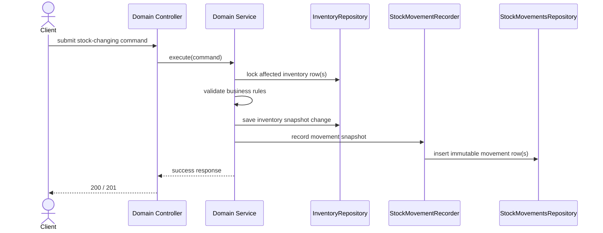
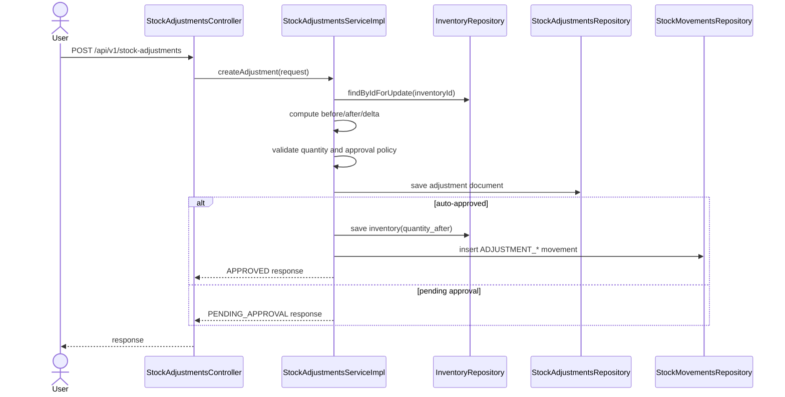
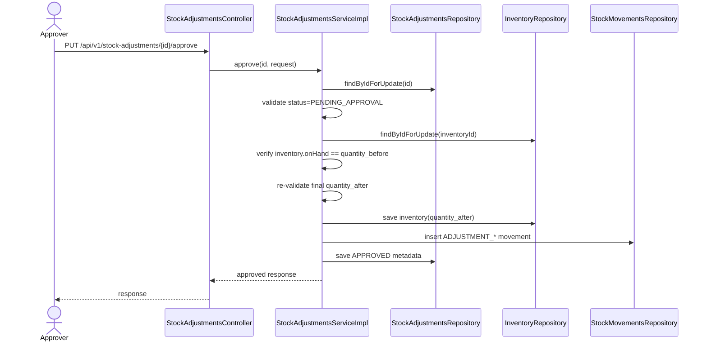
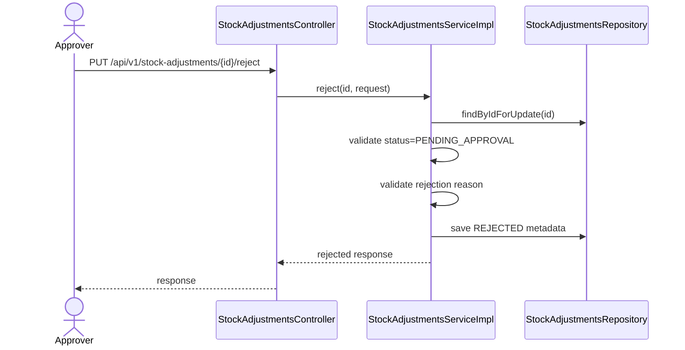
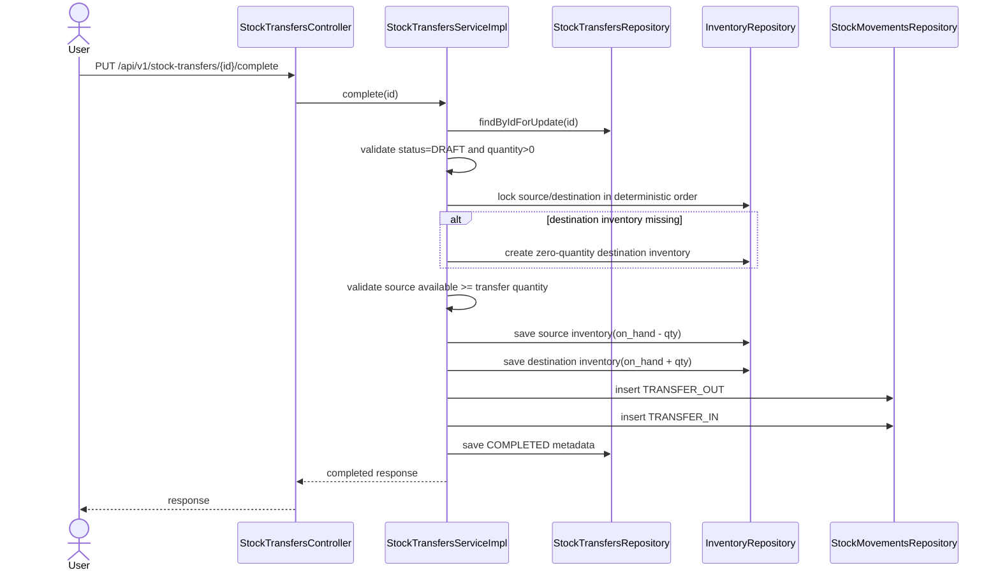

# BA Review - Stock Movement Audit Decision
## Scope: Inventory + Stock Adjustments + Stock Transfers + Stock Movements

---

## 1. Purpose

This document re-evaluates the business role of:

- `inventory`
- `stock_adjustments`
- `stock_transfers`
- `stock_movements`

It is based on the current implementation in:

- `src/main/java/org/demo/whs/service/StockMovementsService.java`
- `src/main/java/org/demo/whs/service/impl/StockMovementsServiceImpl.java`
- `src/main/java/org/demo/whs/service/impl/StockAdjustmentsServiceImpl.java`
- `src/main/java/org/demo/whs/service/impl/StockTransfersServiceImpl.java`
- `src/main/java/org/demo/whs/entity/Inventory.java`
- `src/main/java/org/demo/whs/entity/StockAdjustments.java`
- `src/main/java/org/demo/whs/entity/StockTransfers.java`
- `src/main/java/org/demo/whs/entity/StockMovements.java`

The goal is to prevent business-model drift before more inventory flows are implemented.

---

## 2. Executive Decision

### 2.1 Canonical ownership

1. `inventory` is the source of truth for current stock state.
2. `stock_adjustments` is a business document for correction workflow.
3. `stock_transfers` is a business document for intra-warehouse movement workflow.
4. `stock_movements` is an immutable event log of executed stock mutations.

### 2.2 Direct answer to the main question

`stock_movements` should not store the full audit history of `inventory` rows.

It should store the business snapshot required to explain a stock mutation:

- who triggered it
- when it happened
- what reference document caused it
- which inventory dimension was affected
- before/after quantities for the affected stock state

It should not be used as a generic replacement for:

- `inventory.updated_at`
- `inventory.version`
- `inventory.last_movement_at`
- arbitrary field-level audit of every inventory row update

### 2.3 Important caveat in the current schema

The current `stock_movements` structure is sufficient for physical stock changes:

- `INBOUND`
- `OUTBOUND`
- `ADJUSTMENT_INCREASE`
- `ADJUSTMENT_DECREASE`
- `TRANSFER_OUT`
- `TRANSFER_IN`

It is not semantically complete for reservation-only changes:

- `RESERVE`
- `UNRESERVE`

Reason:

The table currently stores only one quantity timeline:

- `quantity_before`
- `quantity_change`
- `quantity_after`

This works for `on_hand_quantity`, but reservation flows mutate `reserved_quantity` while `on_hand_quantity` may stay unchanged. If `RESERVE` and `UNRESERVE` remain in the same table, the schema must evolve to store reservation state snapshots as well.

---

## 3. Current Implementation Reading

## 3.1 `StockMovementsService`

The current `StockMovementsService` is query-only:

- get by id
- list all
- list by reference

Business conclusion:

This is acceptable, but it is a read service, not the owner of inventory mutation workflows.

Recommended clarification:

1. Keep `StockMovementsService` as query/read API.
2. Introduce an internal write component such as `StockMovementRecorder` or `StockMovementFactory`.
3. All stock-changing services must call that internal component in the same transaction.

This avoids duplicate movement-creation logic across:

- inventory operations
- stock adjustments
- stock transfers
- inbound receipt confirmation
- outbound shipment confirmation

## 3.2 `StockAdjustmentsServiceImpl`

Current business behavior is mostly sound:

1. Load inventory with lock.
2. Derive `quantity_before` from DB, not from client.
3. Compute `quantity_after` and `adjustment_quantity`.
4. Validate non-negative result and reserved boundary.
5. Save adjustment document.
6. If auto-approved:
   - update inventory immediately
   - create one stock movement
7. If approval is required:
   - keep inventory unchanged
   - no movement is created yet
8. On approval:
   - re-lock adjustment and inventory
   - re-check inventory has not drifted
   - apply inventory mutation
   - create one stock movement
   - update approval metadata
9. On rejection:
   - update document only
   - inventory unchanged
   - no movement created

Business gaps that still need explicit policy:

1. Approval actor policy is inconsistent with existing BA docs:
   - current code effectively reserves approve/reject for `ADMIN`
   - older BA text says Warehouse Manager approval
2. Threshold policy is hard-coded in service logic (`5.00`) instead of configuration.
3. Self-approval rule is not explicitly enforced at the service boundary.

## 3.3 `StockTransfersServiceImpl`

Current business behavior is also mostly sound:

1. `createTransfer()` creates a draft document only.
2. `complete()` is the execution point that mutates stock.
3. Source and destination inventories are locked in deterministic order.
4. Destination inventory is created if missing.
5. Source available stock is validated using `on_hand - reserved`.
6. Source is decreased and destination is increased in one transaction.
7. Two movement rows are created:
   - `TRANSFER_OUT`
   - `TRANSFER_IN`
8. Transfer document is then marked `COMPLETED`.

Business conclusion:

This is a correct model for an execution workflow. The transfer document is not the source of truth for stock. The two affected inventory rows remain the operational truth; the movement rows remain the immutable audit.

---

## 4. Canonical Business Model

## 4.1 Table responsibilities

| Table | Role | Mutable | Business meaning |
|---|---|---|---|
| `inventory` | Current snapshot | Yes | What stock state is now |
| `stock_adjustments` | Workflow document | Yes | Why stock correction was requested and approved/rejected |
| `stock_transfers` | Workflow document | Yes | Why stock was moved between locations |
| `stock_movements` | Event log | Insert-only | What stock mutation actually happened |

## 4.2 Data ownership rule

### `inventory`

Owns current state:

- `on_hand_quantity`
- `reserved_quantity`
- `available_quantity` as derived value
- `last_movement_at`

### `stock_adjustments`

Owns adjustment workflow state:

- request metadata
- approval metadata
- rejection metadata
- before/after snapshot at request time

### `stock_transfers`

Owns transfer workflow state:

- draft vs completed vs cancelled
- transfer reason
- transfer quantity
- source and destination context

### `stock_movements`

Owns immutable mutation history:

- mutation type
- affected dimension
- before/change/after values
- actor
- business timestamp
- source document reference

---

## 5. Audit Boundary Decision

## 5.1 What `stock_movements` must store

For every executed mutation, `stock_movements` must keep:

1. `movement_type`
2. `product_id`
3. `warehouse_id`
4. `location_id`
5. `batch_id`
6. business timestamp
7. actor
8. source document type and id
9. source document number
10. before/change/after snapshot for the mutated stock state
11. operational note, if needed

## 5.2 What `stock_movements` should not try to replace

It should not become a generic audit table for every `inventory` row field change.

Do not treat it as the place to mirror:

1. optimistic lock version history
2. routine `updated_at` changes
3. non-stock metadata changes
4. persistence-only state changes with no business mutation

## 5.3 What is missing if reservation audit is required

If the business wants one single audit table for all inventory state changes, including reservation flows, the current schema is incomplete.

Required additions would be:

1. `inventory_id`
2. `on_hand_before`, `on_hand_change`, `on_hand_after`
3. `reserved_before`, `reserved_change`, `reserved_after`
4. optional `available_before`, `available_after`
5. optional `movement_scope`:
   - `PHYSICAL`
   - `ALLOCATION`
6. for transfers, optional:
   - `source_inventory_id`
   - `target_inventory_id`

Without these fields, `RESERVE` and `UNRESERVE` are ambiguous.

---

## 6. Recommended Direction For This Repository

## 6.1 Short-term recommendation

Use `stock_movements` as the immutable audit log for physical stock mutations only.

That means the active production scope should be:

- `INBOUND`
- `OUTBOUND`
- `ADJUSTMENT_INCREASE`
- `ADJUSTMENT_DECREASE`
- `TRANSFER_OUT`
- `TRANSFER_IN`

Short-term decision:

1. Keep the current schema for adjustment and transfer flows.
2. Do not rely on the current schema to represent reservation audit faithfully.
3. When reservation APIs are implemented, either:
   - add reservation snapshot fields to `stock_movements`, or
   - create a separate reservation audit mechanism

## 6.2 Why this is the safest option now

1. It matches the existing adjustment and transfer implementation.
2. It avoids fake or misleading movement records for `RESERVE` and `UNRESERVE`.
3. It preserves a clear distinction between:
   - physical stock mutation
   - allocation/reservation mutation
4. It reduces the chance of having mathematically valid records that are business-invalid.

---

## 7. Detailed Business Flows

## 7.1 Flow A - Create stock adjustment

### Intent

Create a correction request against one inventory row.

### Input

- `inventory_id`
- `quantity_after`
- `reason`
- `notes`

### Main rules

1. Load inventory from DB and lock it.
2. `quantity_before` must come from `inventory.on_hand_quantity`.
3. `adjustment_quantity = quantity_after - quantity_before`.
4. Reject when:
   - `quantity_after < 0`
   - `quantity_after < reserved_quantity`
   - `adjustment_quantity = 0`
5. Determine whether approval is required.
6. Save the adjustment document.
7. If auto-approved:
   - update inventory immediately
   - create one movement row
8. If approval is required:
   - inventory stays unchanged
   - no movement row yet

### Output

- adjustment document created
- inventory changed only when auto-approved

## 7.2 Flow B - Approve stock adjustment

### Intent

Turn a pending request into an executed stock mutation.

### Main rules

1. Lock adjustment row.
2. Verify status is `PENDING_APPROVAL`.
3. Lock inventory row.
4. Verify inventory has not drifted since request creation:
   - current `inventory.on_hand_quantity` must still equal adjustment `quantity_before`
5. Re-validate final state:
   - `quantity_after >= 0`
   - `quantity_after >= reserved_quantity`
6. Update inventory to `quantity_after`.
7. Insert one movement row:
   - `ADJUSTMENT_INCREASE` or `ADJUSTMENT_DECREASE`
8. Mark adjustment `APPROVED`.
9. Commit everything in one transaction.

### Output

- adjustment becomes `APPROVED`
- inventory changes
- one immutable movement row exists

## 7.3 Flow C - Reject stock adjustment

### Intent

Close a pending request without stock mutation.

### Main rules

1. Lock adjustment row.
2. Verify status is `PENDING_APPROVAL`.
3. `rejection_reason` is mandatory.
4. Mark adjustment `REJECTED`.
5. Inventory stays unchanged.
6. No movement row is created.

### Output

- adjustment becomes `REJECTED`
- inventory unchanged
- no stock movement

## 7.4 Flow D - Create stock transfer

### Intent

Create a transfer instruction document before execution.

### Main rules

1. Validate source and destination locations differ.
2. Validate both locations belong to the given warehouse.
3. Validate optional batch belongs to the product.
4. Save transfer as `DRAFT`.
5. No inventory mutation.
6. No movement row yet.

### Output

- transfer document created
- inventory unchanged

## 7.5 Flow E - Complete stock transfer

### Intent

Execute a draft transfer between two locations in the same warehouse.

### Main rules

1. Lock transfer row.
2. Verify status is `DRAFT`.
3. Determine fixed lock order for source and destination inventory keys.
4. Lock source and destination inventory rows in that order.
5. If destination inventory does not exist:
   - create it with zero quantities
   - reload if concurrent creation happened
6. Validate source available stock:
   - `available = on_hand - reserved`
   - `available >= transfer.quantity`
7. Update source inventory:
   - `on_hand = on_hand - quantity`
8. Update destination inventory:
   - `on_hand = on_hand + quantity`
9. Insert two movement rows:
   - `TRANSFER_OUT` for source row
   - `TRANSFER_IN` for destination row
10. Mark transfer `COMPLETED`.
11. Commit everything in one transaction.

### Output

- source decreased
- destination increased
- two immutable movement rows exist
- transfer becomes `COMPLETED`

---

## 8. Sequence Diagrams

## 8.1 Recommended write ownership

Meaning:

- stock mutation is owned by the domain service
- movement logging is a required side effect in the same transaction
- `StockMovementsService` remains the read/query API

## 8.2 Create adjustment

## 8.3 Approve adjustment

## 8.4 Reject adjustment

## 8.5 Complete transfer

---

## 9. Rules That Must Not Be Violated

1. Every executed physical stock mutation writes movement row(s) in the same transaction.
2. Pending workflow documents do not create movement rows until stock really changes.
3. `inventory` remains the only current-state table.
4. `stock_movements` remains immutable.
5. `quantity_before` and `quantity_after` must come from DB state, not from client payload.
6. Transfer completion must create exactly two movement rows.
7. Rejected adjustments and cancelled transfers must not create movement rows.
8. `last_movement_at` is derived from executed stock mutation, not from document creation.

---

## 10. Practical Design Recommendation

## 10.1 Keep now

Keep the current adjustment and transfer design with:

- `inventory` as source of truth
- `stock_adjustments` and `stock_transfers` as workflow documents
- `stock_movements` as immutable physical mutation log

## 10.2 Change next

Before implementing reservation APIs or outbound allocation flows, decide one of these paths:

### Path A - Simpler and recommended for near term

Treat `stock_movements` as physical stock history only.

Action:

- stop relying on `RESERVE` and `UNRESERVE` in the current schema
- document reservation audit separately

### Path B - One-table full inventory-state audit

Expand `stock_movements` to store both `on_hand` and `reserved` state transitions.

Action:

- migrate schema first
- update movement mapper and service contracts
- only then use `RESERVE` and `UNRESERVE`

---

## 11. Final Recommendation

For the current codebase, the cleanest business model is:

1. `inventory` answers "what is the stock state now?"
2. `stock_adjustments` and `stock_transfers` answer "why was a stock operation requested and what is its workflow status?"
3. `stock_movements` answers "what stock mutation actually executed?"

Therefore:

- do not copy full `inventory` audit into `stock_movements`
- do keep movement-level before/after snapshots
- do keep movement creation atomic with inventory mutation
- do not use the current schema for reservation audit until the model is extended

---

## 12. Suggested Follow-up Tasks

1. Align approval policy between BA and code:
   - `ADMIN` only, or
   - Warehouse Manager, or
   - role/threshold matrix from configuration
2. Extract shared movement-write logic into an internal recorder component.
3. Decide reservation audit strategy before implementing reserve/unreserve APIs.
4. If reservation audit stays in the same table, add migration for reservation snapshots first.

---

**Document date:** 2026-03-07  
**Status:** Recommended design decision for implementation alignment
