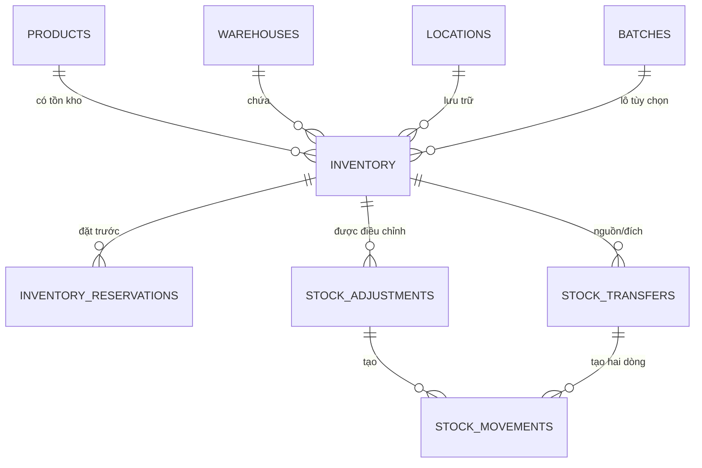
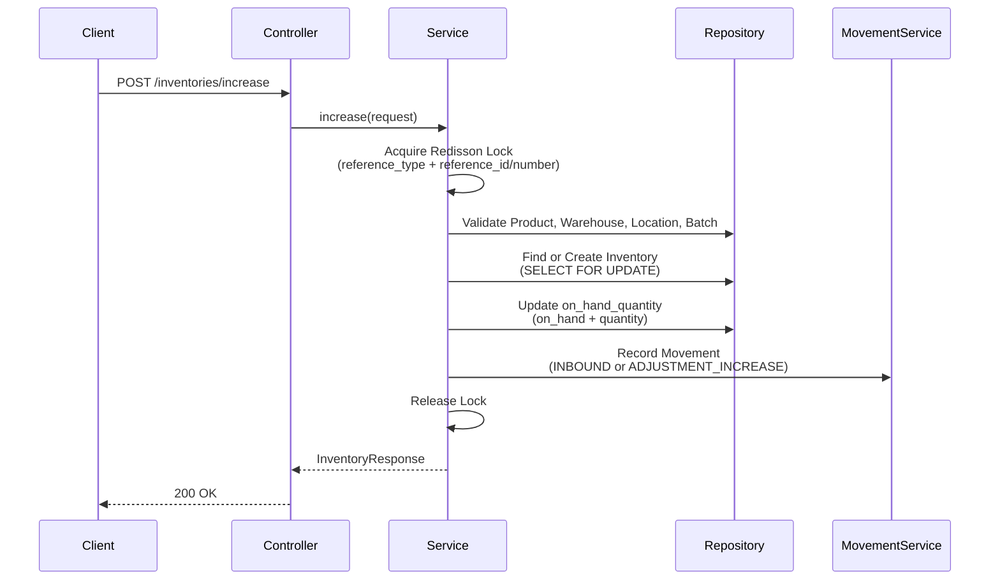
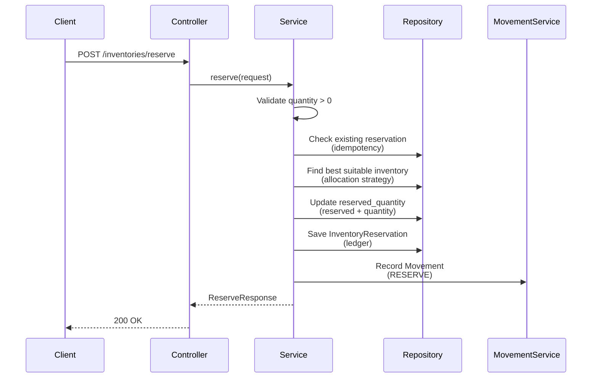
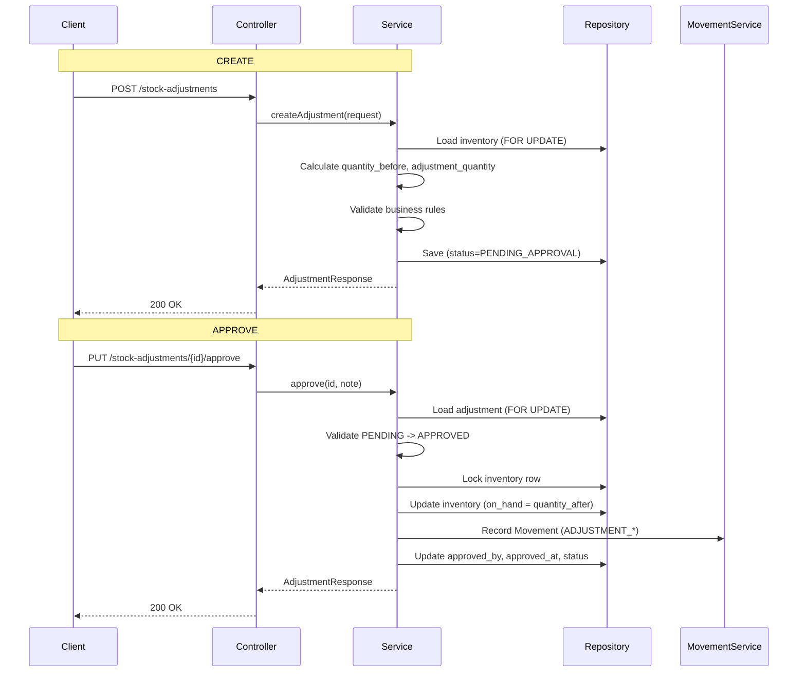
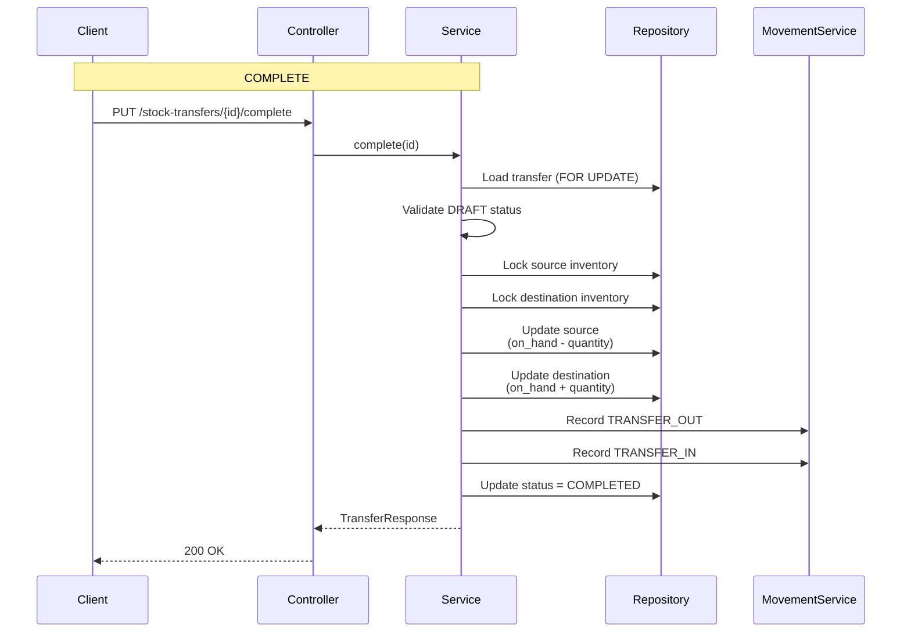
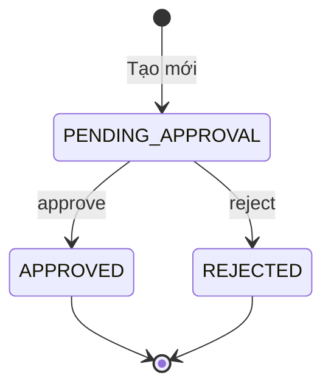
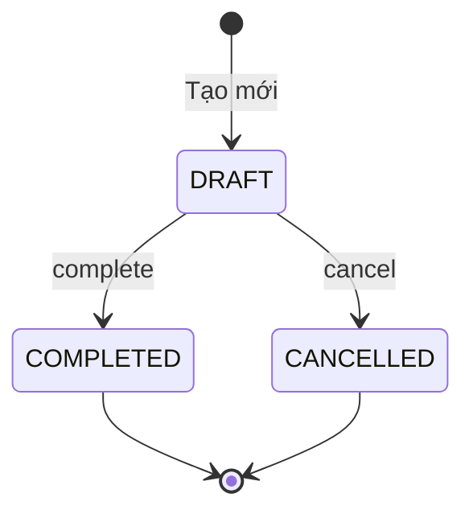

# Tài liệu Tổng hợp Nghiệp vụ Inventory - WMS Backend

> **Phiên bản:** 1.0  
> **Ngày:** 17/03/2026  
> **Mục đích:** Tài liệu tổng hợp toàn bộ nghiệp vụ và API của Module Inventory (Tồn kho, Điều chỉnh, Chuyển kho, Biến động tồn kho)

---

## 1. Tổng quan Kiến trúc Inventory

### 1.1 Phạm vi Module

Module Inventory quản lý toàn bộ hoạt động liên quan đến tồn kho trong hệ thống WMS, bao gồm:

1. **Inventory (Tồn kho)** - Snapshot tồn kho hiện tại tại từng vị trí
2. **Stock Adjustments (Điều chỉnh tồn kho)** - Yêu cầu điều chỉnh số lượng tồn kho
3. **Stock Transfers (Chuyển kho)** - Chuyển hàng giữa các vị trí trong cùng kho
4. **Stock Movements (Biến động tồn kho)** - Audit trail bất biến cho mọi thay đổi tồn kho
5. **Inventory Reservations (Đặt trước)** - Theo dõi tồn kho đã đặt trước cho đơn hàng

### 1.2 Mô hình Dữ liệu



---

## 2. Mô hình Dữ liệu Chi tiết

### 2.1 Inventory (Bảng tồn kho)

```java
// Entity: Inventory.java
{
  "id": "uuid",
  "product_id": "char(36) - FK Products",
  "warehouse_id": "char(36) - FK Warehouses", 
  "location_id": "char(36) - FK Locations (nullable)",
  "batch_id": "char(36) - FK Batches (nullable)",
  "on_hand_quantity": "DECIMAL(15,2) - Số lượng thực tế",
  "quarantine_quantity": "DECIMAL(15,2) - Số lượng cách ly",
  "reserved_quantity": "DECIMAL(15,2) - Số lượng đặt trước",
  "last_movement_at": "LocalDateTime",
  "created_at": "LocalDateTime",
  "updated_at": "LocalDateTime",
  "version": "Integer - Optimistic lock"
}
```

**Công thức tính toán:**
```java
// Trong Inventory entity
public BigDecimal getAvailableQuantity() {
    return onHandQuantity.subtract(quarantineQuantity).subtract(reservedQuantity);
}
```

**Ràng buộc Database:**
- Unique constraint: `product_id + warehouse_id + location_id + batch_id`
- Indexes: `product_id`, `warehouse_id`, `location_id`

---

### 2.2 InventoryReservation (Bảng đặt trước)

```java
// Entity: InventoryReservation.java
{
  "id": "uuid",
  "inventory_id": "char(36) - FK Inventory",
  "product_id": "char(36)",
  "warehouse_id": "char(36)",
  "location_id": "char(36) - nullable",
  "batch_id": "char(36) - nullable",
  "quantity": "DECIMAL(15,2)",
  "order_line_id": "String - ID dòng đơn hàng",
  "request_key": "String - Khóa chống trùng lặp (unique)",
  "status": "RESERVED | RELEASED",
  "created_at": "LocalDateTime",
  "updated_at": "LocalDateTime"
}
```

---

### 2.3 StockAdjustments (Bảng điều chỉnh tồn kho)

```java
// Entity: StockAdjustments.java
{
  "id": "uuid",
  "adjustment_number": "String - Mã điều chỉnh (unique)",
  "inventory_id": "char(36) - FK Inventory",
  "product_id": "char(36)",
  "warehouse_id": "char(36)",
  "location_id": "char(36) - nullable",
  "batch_id": "char(36) - nullable",
  "quantity_before": "DECIMAL(15,2) - Số lượng trước điều chỉnh",
  "quantity_after": "DECIMAL(15,2) - Số lượng sau điều chỉnh",
  "adjustment_quantity": "DECIMAL(15,2) - Số lượng thay đổi",
  "reason": "ReasonType - Lý do điều chỉnh",
  "status": "PENDING_APPROVAL | APPROVED | REJECTED",
  "notes": "TEXT",
  "requires_approval": "Boolean",
  "approved_by": "char(36) - nullable",
  "approved_at": "LocalDateTime - nullable",
  "rejection_reason": "String(500) - nullable",
  "created_at": "LocalDateTime",
  "updated_at": "LocalDateTime"
}
```

**Trạng thái (Status):**
- `PENDING_APPROVAL` - Chờ phê duyệt
- `APPROVED` - Đã phê duyệt
- `REJECTED` - Đã từ chối

**Ràng buộc Database (Check Constraint):**
```sql
quantity_before >= 0 
AND quantity_after >= 0 
AND adjustment_quantity = quantity_after - quantity_before 
AND adjustment_quantity <> 0
AND ((status = 'PENDING_APPROVAL' AND approved_by IS NULL AND approved_at IS NULL AND rejection_reason IS NULL)
  OR (status = 'APPROVED' AND approved_by IS NOT NULL AND approved_at IS NOT NULL AND rejection_reason IS NULL)
  OR (status = 'REJECTED' AND approved_by IS NOT NULL AND approved_at IS NOT NULL AND rejection_reason IS NOT NULL))
```

---

### 2.4 StockTransfers (Bảng chuyển kho)

```java
// Entity: StockTransfers.java
{
  "id": "uuid",
  "transfer_number": "String - Mã chuyển kho (unique)",
  "product_id": "char(36)",
  "warehouse_id": "char(36)",
  "from_location_id": "char(36) - Vị trí nguồn",
  "to_location_id": "char(36) - Vị trí đích",
  "batch_id": "char(36) - nullable",
  "quantity": "DECIMAL(15,2)",
  "reason": "StockTransfersReason - Lý do chuyển",
  "notes": "TEXT",
  "status": "DRAFT | COMPLETED | CANCELLED",
  "completed_at": "LocalDateTime - nullable",
  "created_at": "LocalDateTime",
  "updated_at": "LocalDateTime"
}
```

**Trạng thái (Status):**
- `DRAFT` - Bản nháp
- `COMPLETED` - Hoàn tất
- `CANCELLED` - Đã hủy

---

### 2.5 StockMovements (Bảng biến động tồn kho)

```java
// Entity: StockMovements.java
{
  "id": "uuid",
  "movement_type": "StockMovementsType - Loại biến động",
  "product_id": "char(36)",
  "warehouse_id": "char(36)",
  "location_id": "char(36) - nullable",
  "batch_id": "char(36) - nullable",
  "quantity_change": "DECIMAL(15,2) - Thay đổi (+/-)",
  "quantity_before": "DECIMAL(15,2) - Trước khi thay đổi",
  "quantity_after": "DECIMAL(15,2) - Sau khi thay đổi",
  "movement_date": "LocalDateTime",
  "reference_type": "ReferenceType - Loại tham chiếu",
  "reference_id": "char(36) - nullable",
  "reference_number": "String - nullable",
  "notes": "TEXT",
  "created_at": "LocalDateTime"
}
```

**Loại biến động (Movement Type):**
```java
public enum StockMovementsType {
    INBOUND,              // Nhập kho
    OUTBOUND,             // Xuất kho
    ADJUSTMENT_INCREASE,  // Tăng tồn kho do điều chỉnh
    ADJUSTMENT_DECREASE,  // Giảm tồn kho do điều chỉnh
    TRANSFER_OUT,         // Chuyển ra
    TRANSFER_IN,          // Chuyển vào
    RESERVE,              // Đặt trước
    UNRESERVE             // Hủy đặt trước
}
```

**Loại tham chiếu (Reference Type):**
```java
public enum ReferenceType {
    PURCHASE_ORDER,       // Đơn mua hàng
    SALES_ORDER,          // Đơn bán hàng  
    INBOUND_RECEIPT,      // Phiếu nhập kho
    OUTBOUND_SHIPMENT,    // Lô xuất kho
    STOCK_ADJUSTMENT,     // Điều chỉnh tồn kho
    STOCK_TRANSFER,       // Chuyển kho
    SYSTEM                // Hệ thống
}
```

---

## 3. Quy tắc Nghiệp vụ (Business Rules)

### 3.1 Quy tắc Tồn kho (Inventory)

| ID | Quy tắc | Mô tả |
|----|---------|-------|
| BR-INV-01 | `available = on_hand - quarantine - reserved` | Tồn kho khả dụng |
| BR-INV-02 | `on_hand >= 0` | Số lượng thực tế không âm |
| BR-INV-03 | `reserved >= 0 AND reserved <= on_hand` | Đặt trước không âm và không vượt tồn thực |
| BR-INV-04 | `quarantine >= 0` | Số lượng cách ly không âm |

### 3.2 Quy tắc Điều chỉnh (Stock Adjustment)

| ID | Quy tắc | Mô tả |
|----|---------|-------|
| BR-ADJ-01 | `quantity_before` từ DB inventory | Không chấp nhận từ client |
| BR-ADJ-02 | `adjustment_quantity = quantity_after - quantity_before` | Tính toán tự động |
| BR-ADJ-03 | `quantity_after >= 0` | Không điều chỉnh xuống âm |
| BR-ADJ-04 | `quantity_after >= reserved_quantity` | Không điều chỉnh thấp hơn số đã đặt |
| BR-ADJ-05 | `adjustment_quantity <> 0` | Thay đổi phải khác 0 |
| BR-ADJ-06 | Approve/Reject chỉ từ `PENDING_APPROVAL` | Validate trạng thái |
| BR-ADJ-07 | Approved = Cập nhật inventory + ghi movement | Atomic transaction |
| BR-ADJ-08 | Rejected = Không thay đổi inventory | Chỉ lưu metadata |

### 3.3 Quy tắc Chuyển kho (Stock Transfer)

| ID | Quy tắc | Mô tả |
|----|---------|-------|
| BR-TRF-01 | `from_location_id <> to_location_id` | Nguồn khác đích |
| BR-TRF-02 | `from_location_id` và `to_location_id` cùng warehouse | Chỉ chuyển nội bộ |
| BR-TRF-03 | Complete = Giảm nguồn + Tăng đích | Atomic transaction |
| BR-TRF-04 | Complete = Ghi 2 dòng movement (TRANSFER_OUT + TRANSFER_IN) | Audit trail |
| BR-TRF-05 | Chỉ `DRAFT` mới được complete/cancel | Validate trạng thái |

---

## 4. Danh sách API

### 4.1 Inventory APIs

#### 4.1.1 GET /api/v1/inventories - Danh sách tồn kho

**Query Parameters:**
| Tham số | Kiểu | Mô tả |
|---------|------|-------|
| page | Integer | Số trang (default: 0) |
| size | Integer | Kích thước trang (default: 10, max: 100) |
| productId | String | Lọc theo sản phẩm |
| warehouseId | String | Lọc theo kho |
| locationId | String | Lọc theo vị trí |
| batchId | String | Lọc theo lô |
| productSku | String | Lọc theo SKU |

**Response:**
```json
{
  "code": 200,
  "message": "OK",
  "data": {
    "content": [
      {
        "id": "a1b2c3d4-e5f6-7890-abcd-ef1234567890",
        "product_id": "p123",
        "product_sku": "SKU001",
        "product_name": "Sản phẩm A",
        "warehouse_id": "w001",
        "warehouse_name": "Kho chính",
        "location_id": "l001",
        "location_code": "A-01-01",
        "batch_id": "b001",
        "batch_number": "LOT20260317",
        "on_hand_quantity": 100.00,
        "reserved_quantity": 20.00,
        "available_quantity": 70.00,
        "last_movement_at": "2026-03-17 10:30:00",
        "created_at": "2026-01-01 00:00:00",
        "updated_at": "2026-03-17 10:30:00"
      }
    ],
    "page": 0,
    "size": 10,
    "total_elements": 50,
    "total_pages": 5
  }
}
```

---

#### 4.1.2 GET /api/v1/inventories/summary/{productId} - Tổng hợp theo sản phẩm

**Path Variable:**
| Tham số | Kiểu | Mô tả |
|---------|------|-------|
| productId | String | ID sản phẩm |

**Response:**
```json
{
  "code": 200,
  "message": "OK",
  "data": {
    "product_id": "p123",
    "product_sku": "SKU001",
    "product_name": "Sản phẩm A",
    "total_on_hand_quantity": 500.00,
    "total_reserved_quantity": 100.00,
    "warehouse_count": 2,
    "location_count": 5
  }
}
```

---

#### 4.1.3 GET /api/v1/inventories/by-location - Tồn kho theo vị trí

**Query Parameters:** Giống như danh sách tồn kho

**Response:**
```json
{
  "code": 200,
  "message": "OK",
  "data": [
    {
      "location_id": "l001",
      "location_code": "A-01-01",
      "location_name": "Kệ A-01-01",
      "warehouse_id": "w001",
      "warehouse_name": "Kho chính",
      "items": [
        {
          "product_id": "p123",
          "product_sku": "SKU001",
          "product_name": "Sản phẩm A",
          "batch_id": "b001",
          "batch_number": "LOT20260317",
          "on_hand_quantity": 100.00,
          "reserved_quantity": 20.00,
          "available_quantity": 70.00
        }
      ]
    }
  ]
}
```

---

#### 4.1.4 POST /api/v1/inventories/check-availability - Kiểm tra khả dụng

**Request:**
```json
{
  "product_id": "p123",
  "warehouse_id": "w001",
  "location_id": "l001",
  "quantity": 50.00
}
```

**Response:**
```json
{
  "code": 200,
  "message": "OK",
  "data": {
    "product_id": "p123",
    "warehouse_id": "w001",
    "location_id": "l001",
    "requested_quantity": 50.00,
    "available_quantity": 70.00,
    "is_available": true
  }
}
```

---

#### 4.1.5 POST /api/v1/inventories/reserve - Đặt trước tồn kho

**Request:**
```json
{
  "product_id": "p123",
  "warehouse_id": "w001",
  "location_id": "l001",
  "batch_id": "b001",
  "quantity": 10.00,
  "order_line_id": "ol123",
  "request_key": "req-key-001"
}
```

**Response:**
```json
{
  "code": 200,
  "message": "OK",
  "data": {
    "id": "res-uuid",
    "inventory_id": "inv-uuid",
    "product_id": "p123",
    "warehouse_id": "w001",
    "location_id": "l001",
    "batch_id": "b001",
    "quantity": 10.00,
    "order_line_id": "ol123",
    "status": "RESERVED",
    "on_hand_quantity": 100.00,
    "reserved_quantity": 30.00,
    "available_quantity": 60.00,
    "created_at": "2026-03-17 10:30:00"
  }
}
```

**Quy tắc nghiệp vụ:**
- `quantity > 0`
- Kiểm tra idempotency qua `order_line_id` hoặc `request_key`
- Chọn dòng tồn kho phù hợp nhất (allocation strategy)
- Ghi movement type `RESERVE`

---

#### 4.1.6 POST /api/v1/inventories/unreserve - Giải phóng đặt trước

**Request:**
```json
{
  "product_id": "p123",
  "warehouse_id": "w001",
  "quantity": 5.00,
  "order_line_id": "ol123"
}
```

**Response:**
```json
{
  "code": 200,
  "message": "OK",
  "data": {
    "inventory_id": "inv-uuid",
    "product_id": "p123",
    "warehouse_id": "w001",
    "released_quantity": 5.00,
    "remaining_reserved_quantity": 5.00,
    "on_hand_quantity": 100.00,
    "reserved_quantity": 25.00,
    "available_quantity": 65.00
  }
}
```

**Quy tắc nghiệp vụ:**
- Tìm reservation qua `order_line_id`
- Validate product và warehouse khớp với reservation
- Ghi movement type `UNRESERVE`
- Xóa record nếu `quantity = 0`

---

#### 4.1.7 POST /api/v1/inventories/increase - Tăng tồn kho

**Request:**
```json
{
  "product_id": "p123",
  "warehouse_id": "w001",
  "location_id": "l001",
  "batch_id": "b001",
  "quantity": 50.00,
  "reference_type": "INBOUND_RECEIPT",
  "reference_id": "ir-uuid",
  "reference_number": "IR-20260317-001",
  "notes": "Nhập hàng theo phiếu IR"
}
```

**Response:**
```json
{
  "code": 200,
  "message": "OK",
  "data": {
    "id": "inv-uuid",
    "product_id": "p123",
    "product_sku": "SKU001",
    "product_name": "Sản phẩm A",
    "warehouse_id": "w001",
    "warehouse_name": "Kho chính",
    "location_id": "l001",
    "location_code": "A-01-01",
    "batch_id": "b001",
    "batch_number": "LOT20260317",
    "on_hand_quantity": 150.00,
    "reserved_quantity": 20.00,
    "available_quantity": 120.00,
    "last_movement_at": "2026-03-17 10:30:00",
    "created_at": "2026-01-01 00:00:00",
    "updated_at": "2026-03-17 10:30:00"
  }
}
```

**Quy tắc nghiệp vụ:**
- Sử dụng **Redisson Distributed Lock** để tránh race condition
- Idempotency qua `reference_type + reference_id` hoặc `reference_number`
- Tìm hoặc tạo mới inventory (Find or Create)
- Ghi movement type `INBOUND` hoặc `ADJUSTMENT_INCREASE`

---

#### 4.1.8 POST /api/v1/inventories/decrease - Giảm tồn kho

**Request:**
```json
{
  "product_id": "p123",
  "warehouse_id": "w001",
  "location_id": "l001",
  "batch_id": "b001",
  "quantity": 30.00,
  "reference_type": "OUTBOUND_SHIPMENT",
  "reference_id": "os-uuid",
  "reference_number": "OS-20260317-001",
  "consume_reserved": false,
  "notes": "Xuất hàng theo đơn"
}
```

**Response:**
```json
{
  "code": 200,
  "message": "OK",
  "data": {
    "id": "inv-uuid",
    "product_id": "p123",
    "product_sku": "SKU001",
    "product_name": "Sản phẩm A",
    "warehouse_id": "w001",
    "warehouse_name": "Kho chính",
    "location_id": "l001",
    "location_code": "A-01-01",
    "batch_id": "b001",
    "batch_number": "LOT20260317",
    "on_hand_quantity": 70.00,
    "reserved_quantity": 20.00,
    "available_quantity": 40.00,
    "last_movement_at": "2026-03-17 10:30:00",
    "created_at": "2026-01-01 00:00:00",
    "updated_at": "2026-03-17 10:30:00"
  }
}
```

**Quy tắc nghiệp vụ:**
- Sử dụng Redisson Distributed Lock
- Nếu `consume_reserved = true`: Giảm cả on_hand và reserved
- Nếu `consume_reserved = false`: Chỉ giảm khi `available >= quantity`
- Ghi movement type `OUTBOUND` hoặc `ADJUSTMENT_DECREASE`

---

### 4.2 Stock Adjustments APIs

#### 4.2.1 POST /api/v1/stock-adjustments - Tạo điều chỉnh

**Request:**
```json
{
  "inventory_id": "inv-uuid",
  "quantity_after": 120.00,
  "reason": "COUNT_ERROR",
  "notes": "Sai số lượng trong kiểm kê"
}
```

**Response:**
```json
{
  "code": 200,
  "message": "OK",
  "data": {
    "id": "adj-uuid",
    "adjustment_number": "ADJ-20260317103000-AB12CD34",
    "inventory_id": "inv-uuid",
    "product_id": "p123",
    "warehouse_id": "w001",
    "location_id": "l001",
    "batch_id": "b001",
    "quantity_before": 100.00,
    "quantity_after": 120.00,
    "adjustment_quantity": 20.00,
    "reason": "COUNT_ERROR",
    "status": "PENDING_APPROVAL",
    "notes": "Sai số lượng trong kiểm kê",
    "requires_approval": true,
    "approved_by": null,
    "approved_at": null,
    "rejection_reason": null,
    "created_at": "2026-03-17 10:30:00",
    "updated_at": "2026-03-17 10:30:00"
  }
}
```

---

#### 4.2.2 GET /api/v1/stock-adjustments - Danh sách điều chỉnh

**Query Parameters:**
| Tham số | Kiểu | Mô tả |
|---------|------|-------|
| page | Integer | Số trang |
| size | Integer | Kích thước trang |
| status | String | Lọc theo trạng thái |
| productId | String | Lọc theo sản phẩm |
| warehouseId | String | Lọc theo kho |
| inventoryId | String | Lọc theo inventory |
| adjustmentNumber | String | Lọc theo mã |
| createdFrom | DateTime | Từ ngày |
| createdTo | DateTime | Đến ngày |

**Response:**
```json
{
  "code": 200,
  "message": "OK",
  "data": {
    "content": [
      {
        "id": "adj-uuid",
        "adjustment_number": "ADJ-20260317103000-AB12CD34",
        "inventory_id": "inv-uuid",
        "product_id": "p123",
        "warehouse_id": "w001",
        "quantity_before": 100.00,
        "quantity_after": 120.00,
        "adjustment_quantity": 20.00,
        "reason": "COUNT_ERROR",
        "status": "APPROVED",
        "notes": "Sai số lượng",
        "approved_by": "user-uuid",
        "approved_at": "2026-03-17 11:00:00",
        "created_at": "2026-03-17 10:30:00"
      }
    ],
    "page": 0,
    "size": 10,
    "total_elements": 25,
    "total_pages": 3
  }
}
```

---

#### 4.2.3 GET /api/v1/stock-adjustments/{id} - Chi tiết điều chỉnh

**Response:** Tương tự danh sách nhưng trả về 1 object

---

#### 4.2.4 PUT /api/v1/stock-adjustments/{id}/approve - Phê duyệt điều chỉnh

**Request:**
```json
{
  "approval_note": "Đã xác nhận phiếu kiểm kê"
}
```

**Response:**
```json
{
  "code": 200,
  "message": "OK",
  "data": {
    "id": "adj-uuid",
    "adjustment_number": "ADJ-20260317103000-AB12CD34",
    "status": "APPROVED",
    "approved_by": "user-uuid",
    "approved_at": "2026-03-17 11:00:00",
    "rejection_reason": null,
    "quantity_before": 100.00,
    "quantity_after": 120.00,
    "adjustment_quantity": 20.00
  }
}
```

**Quy tắc nghiệp vụ:**
- Chỉ chuyển `PENDING_APPROVAL -> APPROVED`
- Lock inventory row
- Cập nhật `on_hand_quantity = quantity_after`
- Ghi movement type `ADJUSTMENT_INCREASE` hoặc `ADJUSTMENT_DECREASE`

---

#### 4.2.5 PUT /api/v1/stock-adjustments/{id}/reject - Từ chối điều chỉnh

**Request:**
```json
{
  "rejection_reason": "Bằng chứng không đầy đủ"
}
```

**Response:**
```json
{
  "code": 200,
  "message": "OK",
  "data": {
    "id": "adj-uuid",
    "adjustment_number": "ADJ-20260317103000-AB12CD34",
    "status": "REJECTED",
    "approved_by": "user-uuid",
    "approved_at": "2026-03-17 11:00:00",
    "rejection_reason": "Bằng chứng không đầy đủ",
    "quantity_before": 100.00,
    "quantity_after": 120.00,
    "adjustment_quantity": 20.00
  }
}
```

**Quy tắc nghiệp vụ:**
- Chỉ chuyển `PENDING_APPROVAL -> REJECTED`
- Không thay đổi inventory
- Lưu `rejection_reason`

---

### 4.3 Stock Transfers APIs

#### 4.3.1 POST /api/v1/stock-transfers - Tạo chuyển kho

**Request:**
```json
{
  "product_id": "p123",
  "warehouse_id": "w001",
  "from_location_id": "l001",
  "to_location_id": "l002",
  "batch_id": "b001",
  "quantity": 50.00,
  "reason": "REBALANCING",
  "notes": "Cân bằng tồn kho giữa các kệ"
}
```

**Response:**
```json
{
  "code": 200,
  "message": "OK",
  "data": {
    "id": "tf-uuid",
    "transfer_number": "TRF-20260317-00001",
    "product_id": "p123",
    "warehouse_id": "w001",
    "from_location_id": "l001",
    "to_location_id": "l002",
    "batch_id": "b001",
    "quantity": 50.00,
    "reason": "REBALANCING",
    "notes": "Cân bằng tồn kho giữa các kệ",
    "status": "DRAFT",
    "completed_at": null,
    "created_at": "2026-03-17 10:30:00",
    "updated_at": "2026-03-17 10:30:00"
  }
}
```

---

#### 4.3.2 GET /api/v1/stock-transfers - Danh sách chuyển kho

**Query Parameters:**
| Tham số | Kiểu | Mô tả |
|---------|------|-------|
| page | Integer | Số trang |
| size | Integer | Kích thước trang |

**Response:**
```json
{
  "code": 200,
  "message": "OK",
  "data": {
    "content": [
      {
        "id": "tf-uuid",
        "transfer_number": "TRF-20260317-00001",
        "product_id": "p123",
        "warehouse_id": "w001",
        "from_location_id": "l001",
        "to_location_id": "l002",
        "quantity": 50.00,
        "reason": "REBALANCING",
        "status": "COMPLETED",
        "completed_at": "2026-03-17 11:00:00",
        "created_at": "2026-03-17 10:30:00"
      }
    ],
    "page": 0,
    "size": 10,
    "total_elements": 15,
    "total_pages": 2
  }
}
```

---

#### 4.3.3 GET /api/v1/stock-transfers/{id} - Chi tiết chuyển kho

**Response:** Tương tự danh sách nhưng trả về 1 object

---

#### 4.3.4 PUT /api/v1/stock-transfers/{id}/complete - Hoàn tất chuyển kho

**Response:**
```json
{
  "code": 200,
  "message": "OK",
  "data": {
    "id": "tf-uuid",
    "transfer_number": "TRF-20260317-00001",
    "status": "COMPLETED",
    "completed_at": "2026-03-17 11:00:00"
  }
}
```

**Quy tắc nghiệp vụ:**
- Chỉ chuyển `DRAFT -> COMPLETED`
- Lock source và destination inventory
- Giảm source, tăng destination trong 1 transaction
- Ghi 2 movement: `TRANSFER_OUT` + `TRANSFER_IN`

---

#### 4.3.5 PUT /api/v1/stock-transfers/{id}/cancel - Hủy chuyển kho

**Response:**
```json
{
  "code": 200,
  "message": "OK",
  "data": {
    "id": "tf-uuid",
    "transfer_number": "TRF-20260317-00001",
    "status": "CANCELLED",
    "completed_at": null
  }
}
```

**Quy tắc nghiệp vụ:**
- Chỉ chuyển `DRAFT -> CANCELLED`
- Không thay đổi inventory

---

### 4.4 Stock Movements APIs

#### 4.4.1 GET /api/v1/stock-movements - Danh sách biến động

**Query Parameters:**
| Tham số | Kiểu | Mô tả |
|---------|------|-------|
| page | Integer | Số trang |
| size | Integer | Kích thước trang |

**Response:**
```json
{
  "code": 200,
  "message": "OK",
  "data": {
    "content": [
      {
        "id": "mv-uuid",
        "movement_type": "INBOUND",
        "product_id": "p123",
        "warehouse_id": "w001",
        "location_id": "l001",
        "batch_id": "b001",
        "quantity_change": 50.00,
        "quantity_before": 100.00,
        "quantity_after": 150.00,
        "movement_date": "2026-03-17 10:30:00",
        "reference_type": "INBOUND_RECEIPT",
        "reference_id": "ir-uuid",
        "reference_number": "IR-20260317-001",
        "notes": "Nhập hàng",
        "created_at": "2026-03-17 10:30:00"
      }
    ],
    "page": 0,
    "size": 20,
    "total_elements": 500,
    "total_pages": 25
  }
}
```

---

#### 4.4.2 GET /api/v1/stock-movements/{id} - Chi tiết biến động

**Response:** Tương tự danh sách nhưng trả về 1 object

---

#### 4.4.3 GET /api/v1/stock-movements/reference/{referenceType}/{referenceId} - Biến động theo tham chiếu

**Path Variables:**
| Tham số | Kiểu | Mô tả |
|---------|------|-------|
| referenceType | String | Loại tham chiếu (STOCK_ADJUSTMENT, STOCK_TRANSFER, etc.) |
| referenceId | String | ID tham chiếu |

**Response:** Tương tự danh sách

---

## 5. Sơ đồ Luồng (Flow Diagrams)

### 5.1 Luồng Tăng Tồn kho (Increase Inventory)



**Mô tả luồng bằng lời:**

Luồng Tăng Tồn kho được sử dụng khi cần tăng số lượng tồn kho thực tế (on-hand) tại một vị trí lưu trữ. Ví dụ điển hình là khi nhận hàng từ phiếu nhập kho (Inbound Receipt) hoặc khi thực hiện điều chỉnh tồn kho thủ công.

**Bước 1 - Nhận yêu cầu:** Client gửi POST request đến `/api/v1/inventories/increase` với các thông tin sản phẩm, kho, vị trí, số lượng cần tăng, và thông tin tham chiếu (loại phiếu và mã phiếu).

**Bước 2 - Chiếm khóa phân tán:** Service sử dụng Redisson để chiếm khóa phân tán dựa trên `reference_type` + `reference_id` hoặc `reference_number`. Điều này đảm bảo rằng nếu cùng một phiếu nhập được xử lý nhiều lần, chỉ request đầu tiên được xử lý, các request trùng lặp sẽ bị từ chối. Khóa này ngăn ngừa việc tăng tồn kho hai lần cho cùng một chứng từ.

**Bước 3 - Validate các thành phần:** Service kiểm tra sự tồn tại của Product (sản phẩm), Warehouse (kho), Location (vị trí - nếu có), và Batch (lô - nếu có). Nếu bất kỳ thành phần nào không tồn tại, hệ thống sẽ throw exception tương ứng.

**Bước 4 - Tìm hoặc tạo mới inventory:** Service tìm kiếm dòng inventory phù hợp với tổ hợp product + warehouse + location + batch. Nếu đã tồn tại, sử dụng `SELECT FOR UPDATE` để lock dòng này. Nếu chưa tồn tại, tạo mới một dòng inventory với số lượng ban đầu.

**Bước 5 - Cập nhật số lượng:** Service cập nhật trường `on_hand_quantity` = `on_hand_quantity hiện tại + quantity` và cập nhật `last_movement_at` = thời điểm hiện tại.

**Bước 6 - Ghi nhận biến động:** Service ghi một dòng vào bảng `stock_movements` với loại biến động là `INBOUND` (nếu đến từ phiếu nhập) hoặc `ADJUSTMENT_INCREASE` (nếu đến từ điều chỉnh). Lưu trữ cả `quantity_before` và `quantity_after` để phục vụ truy xuất nguồn gốc.

**Bước 7 - Trả kết quả:** Giải phóng khóa và trả về InventoryResponse chứa thông tin inventory đã được cập nhật.

### 5.2 Luồng Đặt trước (Reserve Inventory)



**Mô tả luồng bằng lời:**

Luồng Đặt trước (Reserve) được sử dụng khi cần "giữ chỗ" một lượng tồn kho khả dụng cho một đơn hàng cụ thể. Điều này đảm bảo rằng khi đơn hàng được xuất kho, hàng hóa đã được đảm bảo có sẵn.

**Bước 1 - Validate số lượng:** Kiểm tra yêu cầu có số lượng hợp lệ (lớn hơn 0). Nếu không hợp lệ, trả về lỗi validation.

**Bước 2 - Kiểm tra trùng lặp (Idempotency):** Trước khi tạo mới, hệ thống kiểm tra xem đã có reservation cho `order_line_id` hoặc `request_key` này chưa. Nếu đã có, trả về reservation hiện tại thay vì tạo mới. Điều này cho phép client gọi API nhiều lần mà không sợ tạo ra nhiều reservation trùng nhau.

**Bước 3 - Tìm dòng tồn kho phù hợp (Allocation Strategy):** Service tìm kiếm dòng inventory phù hợp nhất dựa trên product, warehouse, location và batch được chỉ định. Nếu không tìm thấy hoặc không đủ tồn khả dụng, trả về lỗi `INV_004` (không đủ tồn kho).

**Bước 4 - Cập nhật reserved_quantity:** Tăng trường `reserved_quantity` của inventory lên thêm số lượng yêu cầu. Điều này làm giảm `available_quantity` nhưng không thay đổi `on_hand_quantity`.

**Bước 5 - Lưu reservation ledger:** Tạo bản ghi trong bảng `inventory_reservations` để theo dõi việc đặt trước này. Bản ghi này lưu trữ thông tin inventory gốc, số lượng đặt trước, và liên kết với dòng đơn hàng.

**Bước 6 - Ghi movement:** Ghi một dòng vào `stock_movements` với loại `RESERVE` để audit trail. Lưu ý là quantity_change trong trường hợp này sẽ là số âm vì nó làm giảm available stock.

### 5.3 Luồng Điều chỉnh (Stock Adjustment)



**Mô tả luồng bằng lời:**

Luồng Điều chỉnh Tồn kho được sử dụng khi cần thay đổi số lượng tồn kho thực tế do sai sót trong kiểm kê, hàng hóa bị hư hỏng, hoặc các lý do khác. Luồng này có tính kiểm soát cao với quy trình phê duyệt.

#### A) Tạo mới điều chỉnh (CREATE)

**Bước 1 - Load inventory:** Service tìm và lock dòng inventory liên quan bằng `SELECT FOR UPDATE`. Việc lock ngay từ đầu đảm bảo không có ai khác thay đổi inventory trong khi đang tính toán.

**Bước 2 - Tính toán số lượng:** Service lấy `quantity_before` trực tiếp từ DB (không chấp nhận từ client vì lý do bảo mật). Sau đó tính `adjustment_quantity = quantity_after - quantity_before`.

**Bước 3 - Validate business rules:** Kiểm tra các quy tắc:
- `quantity_after >= 0` (không điều chỉnh xuống âm)
- `quantity_after >= reserved_quantity` (không điều chỉnh thấp hơn số đã đặt trước)
- `adjustment_quantity <> 0` (thay đổi phải khác 0)

**Bước 4 - Lưu với trạng thái PENDING_APPROVAL:** Tạo bản ghi trong `stock_adjustments` với trạng thái ban đầu là `PENDING_APPROVAL`. Nếu `requires_approval = false`, có thể tự động chuyển sang `APPROVED`.

#### B) Phê duyệt điều chỉnh (APPROVE)

**Bước 1 - Load và lock adjustment:** Tìm adjustment với ID được cung cấp và lock bằng `FOR UPDATE`.

**Bước 2 - Validate trạng thái:** Chỉ cho phép phê duyệt khi status hiện tại là `PENDING_APPROVAL`. Nếu đã `APPROVED` hoặc `REJECTED`, trả về lỗi.

**Bước 3 - Lock inventory:** Lock dòng inventory liên quan để đảm bảo an toàn.

**Bước 4 - Cập nhật inventory:** Set `on_hand_quantity = quantity_after` (giá trị mới sau điều chỉnh).

**Bước 5 - Ghi movement:** Tạo movement với loại `ADJUSTMENT_INCREASE` (nếu tăng) hoặc `ADJUSTMENT_DECREASE` (nếu giảm).

**Bước 6 - Cập nhật metadata:** Lưu thông tin người phê duyệt (`approved_by`), thời gian phê duyệt (`approved_at`), và chuyển status sang `APPROVED`.

#### C) Từ chối điều chỉnh (REJECT)

**Bước 1 - Load và lock adjustment:** Tương tự như approve.

**Bước 2 - Validate trạng thái:** Chỉ cho phép từ chối khi status là `PENDING_APPROVAL`.

**Bước 3 - Validate lý do từ chối:** Yêu cầu `rejection_reason` bắt buộc phải có.

**Bước 4 - Lưu metadata:** Lưu `rejection_reason`, `approved_by`, `approved_at` và chuyển status sang `REJECTED`. **Lưu ý quan trọng:** Trong trường hợp từ ch�ối, inventory KHÔNG thay đổi.

### 5.4 Luồng Chuyển kho (Stock Transfer)



**Mô tả luồng bằng lời:**

Luồng Chuyển kho được sử dụng khi cần di chuyển hàng hóa từ một vị trí lưu trữ này sang vị trí khác trong cùng một kho. Ví dụ: chuyển hàng từ kệ A sang kệ B để cân bằng tồn kho.

#### A) Tạo mới chuyển kho (CREATE)

Khi tạo mới, chỉ lưu thông tin chuyển kho vào bảng `stock_transfers` với trạng thái `DRAFT`. Lúc này chưa có bất kỳ thay đổi nào về số lượng tồn kho. Người dùng có thể xem, chỉnh sửa thông tin hoặc hủy bỏ khi đang ở trạng thái DRAFT.

#### B) Hoàn tất chuyển kho (COMPLETE)

Đây là bước quan trọng nhất trong luồng chuyển kho, thực hiện việc di chuyển tồn kho thực sự.

**Bước 1 - Load và lock transfer:** Tìm phiếu chuyển kho và lock bằng `FOR UPDATE` để đảm bảo không có ai khác thao tác cùng lúc.

**Bước 2 - Validate trạng thái:** Chỉ cho phép hoàn tất khi status hiện tại là `DRAFT`. Nếu đã `COMPLETED` hoặc `CANCELLED`, trả về lỗi.

**Bước 3 - Validate nghiệp vụ:**
- Kiểm tra `from_location_id <> to_location_id` (nguồn và đích phải khác nhau)
- Kiểm tra cả hai location cùng thuộc một warehouse
- Kiểm tra tồn kho tại vị trí nguồn có đủ không

**Bước 4 - Lock inventory nguồn và đích:** Lock cả hai dòng inventory (nguồn và đích) bằng `SELECT FOR UPDATE` trong cùng một transaction. Việc lock cả hai đảm bảo tính nhất quán dữ liệu.

**Bước 5 - Cập nhật tồn kho:**
- Giảm `on_hand_quantity` tại vị trí nguồn: `on_hand - quantity`
- Tăng `on_hand_quantity` tại vị trí đích: `on_hand + quantity`

**Bước 6 - Ghi hai movement:**
- `TRANSFER_OUT`: Ghi biến động giảm tại vị trí nguồn
- `TRANSFER_IN`: Ghi biến động tăng tại vị trí đích

**Bước 7 - Cập nhật trạng thái:** Chuyển status của phiếu chuyển kho sang `COMPLETED` và lưu thời gian hoàn tất (`completed_at`).

#### C) Hủy chuyển kho (CANCEL)

Nếu chưa hoàn tất và muốn hủy bỏ phiếu chuyển kho, chỉ cần cập nhật status từ `DRAFT` sang `CANCELLED`. Không có bất kỳ thay đổi nào về số lượng tồn kho trong trường hợp này.

---

## 6. Máy trạng thái (State Machines)

### 6.1 Stock Adjustments



### 6.2 Stock Transfers



---

## 7. Mã lỗi (Error Codes)

| Mã | Mô tả | Khu vực |
|-----|-------|---------|
| `INV_001` | Không tìm thấy inventory | Inventory |
| `INV_002` | Xung đột dữ liệu inventory | Inventory |
| `INV_004` | Không đủ tồn kho | Inventory |
| `COM_001` | Lỗi validation chung | Common |
| `COM_006` | Số trang không hợp lệ | Common |
| `COM_007` | Kích thước trang không hợp lệ | Common |
| `COM_008` | Kích thước trang vượt quá giới hạn | Common |
| `COM_009` | Xung đột khóa (đang xử lý) | Common |
| `COM_010` | Lỗi khóa bị gián đoạn | Common |
| `STA_001` | Yêu cầu điều chỉnh không hợp lệ | Stock Adjustment |
| `STA_002` | Chuyển đổi trạng thái không hợp lệ | Stock Adjustment |
| `STA_404` | Không tìm thấy điều chỉnh | Stock Adjustment |
| `PROD_001` | Không tìm thấy sản phẩm | Product |
| `WHS_001` | Không tìm thấy kho | Warehouse |
| `LOC_001` | Không tìm thấy vị trí | Location |
| `BATCH_001` | Không tìm thấy lô | Batch |

---

## 8. Tóm tắt API Endpoints

| Module | Method | Endpoint | Mô tả |
|--------|--------|----------|-------|
| **Inventory** | GET | `/api/v1/inventories` | Danh sách tồn kho (phân trang + filter) |
| | GET | `/api/v1/inventories/summary/{productId}` | Tổng hợp theo sản phẩm |
| | GET | `/api/v1/inventories/by-location` | Tồn kho theo vị trí |
| | POST | `/api/v1/inventories/check-availability` | Kiểm tra khả dụng |
| | POST | `/api/v1/inventories/reserve` | Đặt trước tồn kho |
| | POST | `/api/v1/inventories/unreserve` | Giải phóng đặt trước |
| | POST | `/api/v1/inventories/increase` | Tăng tồn kho |
| | POST | `/api/v1/inventories/decrease` | Giảm tồn kho |
| **Stock Adjustment** | POST | `/api/v1/stock-adjustments` | Tạo điều chỉnh |
| | GET | `/api/v1/stock-adjustments` | Danh sách điều chỉnh |
| | GET | `/api/v1/stock-adjustments/{id}` | Chi tiết điều chỉnh |
| | PUT | `/api/v1/stock-adjustments/{id}/approve` | Phê duyệt |
| | PUT | `/api/v1/stock-adjustments/{id}/reject` | Từ chối |
| **Stock Transfer** | POST | `/api/v1/stock-transfers` | Tạo chuyển kho |
| | GET | `/api/v1/stock-transfers` | Danh sách chuyển kho |
| | GET | `/api/v1/stock-transfers/{id}` | Chi tiết chuyển kho |
| | PUT | `/api/v1/stock-transfers/{id}/complete` | Hoàn tất |
| | PUT | `/api/v1/stock-transfers/{id}/cancel` | Hủy |
| **Stock Movement** | GET | `/api/v1/stock-movements` | Danh sách biến động |
| | GET | `/api/v1/stock-movements/{id}` | Chi tiết biến động |
| | GET | `/api/v1/stock-movements/reference/{type}/{id}` | Biến động theo tham chiếu |

---

**Hết tài liệu**
