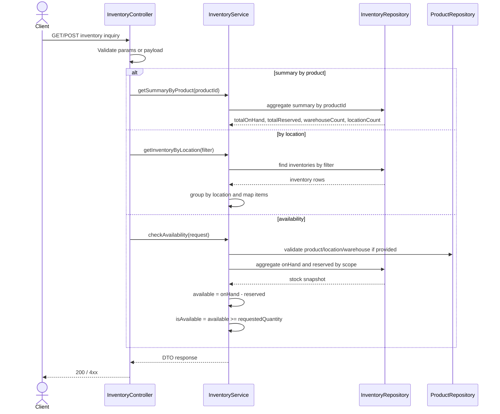
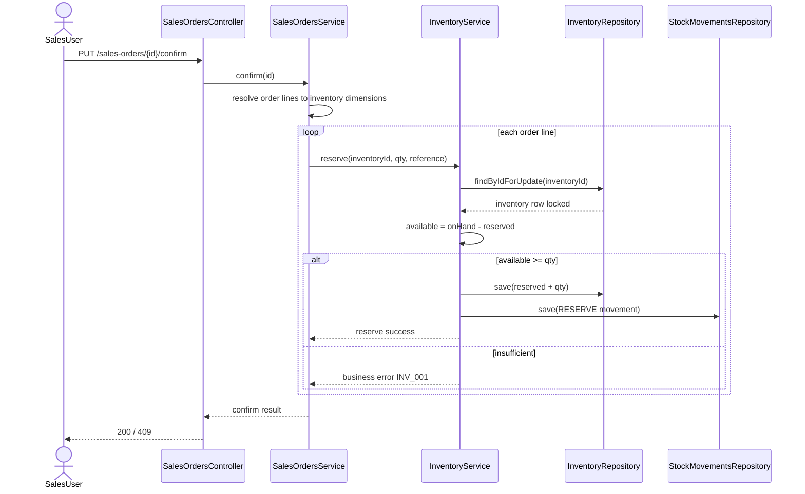
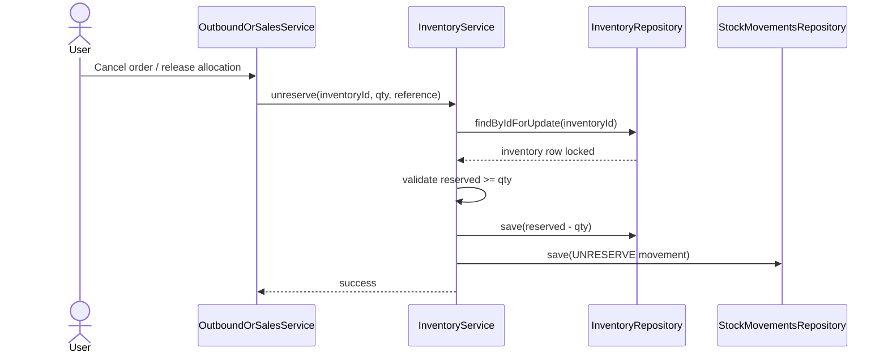
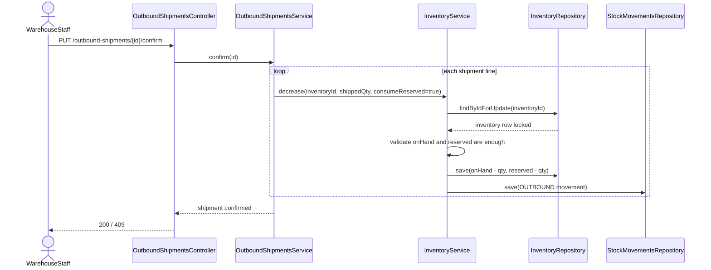
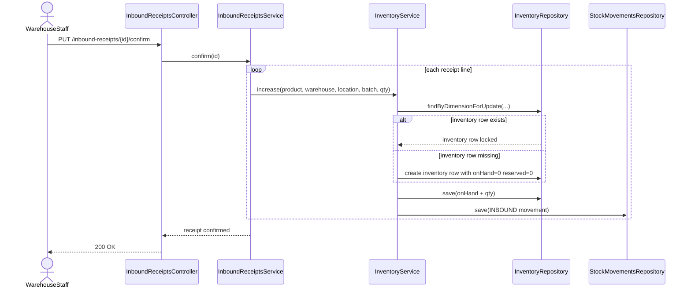
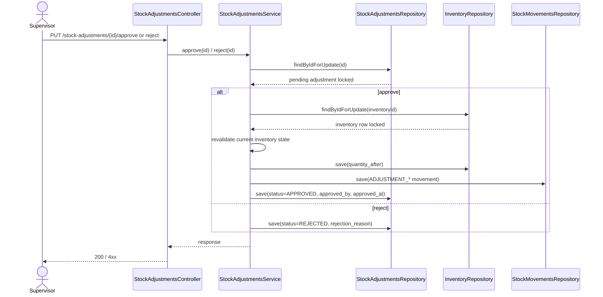
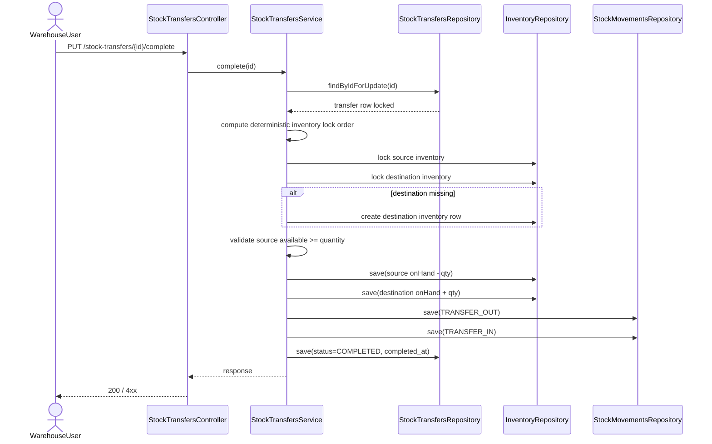

# Inventory Controller Module Review

Updated: 2026-03-07

## 1. Scope reviewed

Code and documents reviewed:

- `src/main/java/org/demo/whs/controller/InventoryController.java`
- `src/main/java/org/demo/whs/service/impl/InventoryServiceImpl.java`
- `src/main/java/org/demo/whs/repository/InventoryRepository.java`
- `src/main/java/org/demo/whs/service/impl/StockAdjustmentsServiceImpl.java`
- `src/main/java/org/demo/whs/service/impl/StockTransfersServiceImpl.java`
- `documents/Inventory/BA_DB_API_MODULE_04_INVENTORY_OPERATIONS_REDESIGN_V2.md`
- Jira: `WHS-10..17`, `WHS-19`, `WHS-20..25`, `WHS-70`, `WHS-87`
- GitHub PR: `#74 [WHS-13] Implement inventory check-availability API`

Review baseline:

1. Lấy code trên branch `develop` làm hiện trạng chuẩn.
2. Đối chiếu lại Jira để kiểm tra scope inventory thật sự của hệ thống.
3. Kiểm tra PR `#74` chỉ theo góc độ đúng nghiệp vụ, đúng boundary module và không làm regress API đã có.

---

## 2. Executive summary

`InventoryController` trên `develop` hiện là module truy vấn tồn kho, chưa phải module thao tác nhập/xuất/đặt trước tồn kho.

Các năng lực nghiệp vụ đang đúng với hệ thống:

1. Danh sách tồn kho có filter và pagination.
2. Tổng hợp tồn kho theo sản phẩm.
3. Gom tồn kho theo location để phục vụ vận hành picking/replenishment.

Các thay đổi tồn kho thực tế hiện đang được thực thi ở hai module liền kề:

1. `StockAdjustments`: điều chỉnh tồn kho có workflow duyệt.
2. `StockTransfers`: chuyển kho nội bộ có cập nhật nguồn/đích và movement audit.

Scope inventory parent trên Jira vẫn chưa hoàn tất vì còn thiếu:

1. `check-availability`
2. `reserve`
3. `unreserve`
4. `increase`
5. `decrease`

Kết luận quan trọng:

1. `InventoryController` không sai hướng, nhưng mới hoàn thành phần read-side.
2. Epic inventory `WHS-19` vẫn chưa complete vì chưa có các stock mutation API nền tảng.
3. PR `#74` đang đi đúng mục tiêu ở chỗ bổ sung `check-availability`, nhưng đang đi sai hướng nếu nó đồng thời thay đổi contract và implementation của `summary`/`by-location`/mapper hiện hữu.

---

## 3. Business role of this module in the system

### 3.1 Inventory la source of truth

`inventory` là snapshot hiện tại của stock theo dimension:

- `product_id`
- `warehouse_id`
- `location_id`
- `batch_id`

Ba đại lượng chuẩn của hệ thống:

1. `on_hand_quantity`: số lượng vật lý đang có.
2. `reserved_quantity`: số lượng đã được giữ chỗ cho luồng outbound nhưng chưa xuất.
3. `available_quantity = on_hand_quantity - reserved_quantity`: số lượng còn có thể allocate mới.

### 3.2 InventoryController khong phai workflow controller

Về đúng nghiệp vụ chuẩn WMS:

1. `InventoryController` nên là điểm đọc dữ liệu tồn kho và các stock utility API nền tảng.
2. Các thay đổi stock theo nghiệp vụ business document không nên thao tác trực tiếp từ UI theo kiểu generic nếu chưa đi qua workflow chuẩn.
3. Các workflow business-level như sales order confirm, shipment confirm, inbound receipt confirm, stock adjustment approve, stock transfer complete mới là nơi quyết định khi nào tăng/giảm/reserve/unreserve.

Nói ngắn gọn:

- `InventoryController` quản lý stock view + stock utility.
- `StockAdjustmentsController` và `StockTransfersController` quản lý stock-changing business documents đã có.
- `Inbound`, `Outbound`, `Sales Order` là các module còn thiếu nhưng sẽ gọi vào stock utility layer sau này.

---

## 4. Current business functions on develop

### 4.1 Da co trong code

| Endpoint | Status | Nghiệp vụ | Ghi chú |
|---|---|---|---|
| `GET /api/v1/inventories` | Implemented | Tra cứu tồn kho chi tiết theo nhiều bộ lọc | Đúng với `WHS-10` |
| `GET /api/v1/inventories/summary/{productId}` | Implemented | Tổng hợp on-hand/reserved/available theo sản phẩm | Đúng với `WHS-11` |
| `GET /api/v1/inventories/by-location` | Implemented | Nhóm tồn kho theo vị trí, trả item-level stock trong từng location | Đúng với `WHS-12` |
| `POST /api/v1/stock-adjustments` | Implemented | Tạo yêu cầu điều chỉnh tồn kho | Auto-approve theo policy hoặc pending approval |
| `PUT /api/v1/stock-adjustments/{id}/approve` | Implemented | Duyệt điều chỉnh, cập nhật inventory + movement | Đúng với `WHS-23` |
| `PUT /api/v1/stock-adjustments/{id}/reject` | Implemented | Từ chối điều chỉnh, không đổi inventory | Đúng với `WHS-24` |
| `POST /api/v1/stock-transfers` | Implemented | Tạo phiếu chuyển kho nội bộ | Document only |
| `PUT /api/v1/stock-transfers/{id}/complete` | Implemented | Chuyển kho atomic nguồn/đích + 2 movement rows | Đúng với `WHS-87` |

### 4.2 Chua co trong code

| Endpoint | Jira | Status | Business gap |
|---|---|---|---|
| `POST /api/v1/inventories/check-availability` | `WHS-13` | In Review | Thiếu utility API để pre-check allocate |
| `POST /api/v1/inventories/reserve` | `WHS-14` | In Progress | Chưa thể reserve stock khi confirm SO |
| `POST /api/v1/inventories/unreserve` | `WHS-15` | To Do | Chưa thể release reservation khi cancel/huy/partial flow |
| `POST /api/v1/inventories/increase` | `WHS-16` | To Do | Chưa có stock utility chuẩn cho inbound/stock receipt |
| `POST /api/v1/inventories/decrease` | `WHS-17` | To Do | Chưa có stock utility chuẩn cho shipment confirm |

---

## 5. Business rules that must remain standard

| Rule ID | Rule | Why it matters |
|---|---|---|
| `BR-INV-01` | `available = on_hand - reserved` | Công thức chuẩn dùng thống nhất cho mọi pre-check |
| `BR-INV-02` | `on_hand >= 0` | Không cho âm tồn |
| `BR-INV-03` | `reserved >= 0` và `reserved <= on_hand` | Không cho reserve vượt tồn vật lý |
| `BR-INV-04` | `InventoryController` chỉ đọc dữ liệu hoặc utility stock-level; workflow thay đổi stock phải đi qua document/business flow phù hợp | Tránh phá boundary nghiệp vụ |
| `BR-INV-05` | `StockAdjustments` chỉ approve/reject từ `PENDING_APPROVAL` | Giữ đúng state machine |
| `BR-INV-06` | `StockTransfers` chỉ complete từ `DRAFT` | Tránh complete lặp hoặc mutate lại stock |
| `BR-INV-07` | Mọi thay đổi stock phải ghi `stock_movements` trong cùng transaction | Audit bắt buộc |
| `BR-INV-08` | `check-availability` là read-only và phải so sánh theo requested quantity | Tránh false positive availability |
| `BR-INV-09` | `reserve`/`unreserve` chỉ thay đổi `reserved_quantity` | Không lẫn với inbound/outbound |
| `BR-INV-10` | `decrease` từ shipment chuẩn phải giảm cả `on_hand` và `reserved` nếu xuất từ stock đã reserve | Đúng logic outbound của WMS |
| `BR-INV-11` | `increase` từ inbound chuẩn chỉ tăng `on_hand`, không đụng `reserved` | Đúng logic nhập kho |
| `BR-INV-12` | Transfer complete phải atomic trên source + destination, có deterministic lock order | Tránh race condition và deadlock |

---

## 6. Jira alignment

| Jira | Summary | Jira status | Thực tế trên `develop` | Kết luận |
|---|---|---|---|---|
| `WHS-10` | Inventory list API | Done | Đã implement | Khớp |
| `WHS-11` | Inventory summary by product | Done | Đã implement | Khớp |
| `WHS-12` | Inventory by-location aggregation | Done | Đã implement | Khớp, nhưng cần giữ nguyên contract hiện tại |
| `WHS-13` | Check availability | In Review | Chưa merge | Cần chỉnh lại hướng PR |
| `WHS-14` | Reserve | In Progress | Chưa có code | Gap thực tế |
| `WHS-15` | Unreserve | To Do | Chưa có code | Gap thực tế |
| `WHS-16` | Increase | To Do | Chưa có code | Gap thực tế |
| `WHS-17` | Decrease | To Do | Chưa có code | Gap thực tế |
| `WHS-19` | Inventory API Completion | In Progress | Đúng vì còn 5 child tasks chưa xong | Khớp |
| `WHS-20..24` | Stock Adjustments | Done | Đã implement đầy đủ | Khớp |
| `WHS-25` | Stock Transfers parent | Done | Core transfer flow đã có | Khớp |
| `WHS-87` | Transfer complete API | To Do trên Jira, nhưng code đã có | Code đã hoàn tất | Cần sync lại nếu team chốt review xong |
| `WHS-70` | Schema consistency refactor | Done | Migration + code đã có | Khớp |

Lưu ý quan trọng:

1. `WHS-19` không thể đóng nếu chỉ merge `WHS-13`.
2. `WHS-14..17` mới là phần kết nối inventory với inbound/outbound chuẩn của hệ thống.

---

## 7. GitHub PR #74 review alignment

PR đang review:

- `#74 [WHS-13] Implement inventory check-availability API`

### 7.1 Diem dung huong

1. Bổ sung endpoint `POST /api/v1/inventories/check-availability` là đúng scope Jira.
2. Chọn read-only query để tính `on_hand` và `reserved` là đúng hướng.
3. Không cần migration mới cho `check-availability`.

### 7.2 Diem sai huong can dieu chinh truoc khi merge

1. Không được rewrite lại `summary` và `by-location` chỉ để phục vụ `WHS-13`.
2. `check-availability` phải trả `isAvailable = available >= requestedQuantity`, không phải chỉ kiểm tra `available > 0`.
3. Response phải trả đầy đủ:
   - `requested_quantity`
   - `available_quantity`
   - `is_available`
   - message/business meaning rõ ràng
4. Nếu payload có `warehouseId` hoặc `locationId`, phải validate existence theo AC Jira.
5. `by-location` hiện tại đang hỗ trợ `warehouseId` và `productId`; PR không được làm mất `warehouseId` filter.
6. `by-location` hiện trả chi tiết item theo location; không được hạ cấp contract thành aggregated total đơn giản nếu chưa có task đổi contract.
7. Mapper không nên đổi từ `Map` lookup sang quét `List` nhiều lần vì tạo `O(n^2)` không cần thiết trên list endpoint.

### 7.3 Recommendation for PR #74

Nên sửa PR theo nguyên tắc:

1. Giữ nguyên implementation hiện tại của:
   - list inventory
   - inventory summary
   - inventory by-location
2. Chỉ thêm mới:
   - request DTO
   - response DTO
   - service method `checkAvailability`
   - repository query/projection riêng cho availability
   - controller endpoint mới
   - unit/integration tests mới
3. Không đổi contract cũ nếu Jira không yêu cầu.

---

## 8. End-to-end business flows

## 8.1 Flow A - Inventory inquiry

Mục tiêu:

1. Vận hành xem tồn kho chi tiết.
2. Dashboard xem tổng hợp theo sản phẩm.
3. Điều phối picking/replenishment xem hàng theo location.
4. Các workflow khác pre-check khả dụng trước khi reserve hoặc allocate.

Steps:

1. Client gọi list/summary/by-location/check-availability.
2. Controller validate input và dựng filter.
3. Service đọc inventory snapshot hoặc aggregate query.
4. Service map ra DTO chuẩn.
5. Client nhận `on_hand`, `reserved`, `available`.

## 8.2 Flow B - Sales order confirm -> reserve stock

Mục tiêu:

1. Khi SO được confirm, stock phải được giữ chỗ.
2. Không cho allocate trùng.

Steps:

1. `SalesOrderService` xác định inventory row phù hợp.
2. Gọi inventory reserve utility.
3. Lock inventory row.
4. Kiểm tra `available >= reserveQuantity`.
5. Tăng `reserved_quantity`.
6. Ghi `stock_movements` với loại `RESERVE`.
7. Cập nhật SO line đã reserve.

## 8.3 Flow C - Cancel SO / rollback allocation -> unreserve stock

Mục tiêu:

1. Trả lại khả dụng cho stock đã reserve nhưng không còn cần dùng.

Steps:

1. Workflow hủy đơn hoặc giảm allocate gọi `unreserve`.
2. Lock inventory row.
3. Kiểm tra `reserved >= qty`.
4. Giảm `reserved_quantity`.
5. Ghi movement `UNRESERVE`.

## 8.4 Flow D - Outbound shipment confirm -> decrease stock

Mục tiêu:

1. Xuất kho làm giảm tồn vật lý.
2. Nếu stock đã reserve trước đó thì phải giảm cả `on_hand` và `reserved`.

Steps:

1. `OutboundShipmentService` xác định quantity shipped.
2. Lock inventory row.
3. Kiểm tra đủ điều kiện xuất.
4. Giảm `on_hand`.
5. Giảm `reserved` theo lượng thực xuất nếu line đã reserve.
6. Ghi movement `OUTBOUND` hoặc movement chuyên biệt của shipment.

## 8.5 Flow E - Inbound receipt confirm -> increase stock

Mục tiêu:

1. Nhập kho làm tăng stock vật lý.
2. Không làm thay đổi reserve.

Steps:

1. `InboundReceiptService` xác định quantity received theo line.
2. Find-or-create inventory row theo dimension.
3. Lock row hoặc lock dimension tương ứng.
4. Tăng `on_hand`.
5. Ghi movement `INBOUND`.

## 8.6 Flow F - Stock adjustment approve/reject

Mục tiêu:

1. Điều chỉnh tồn kho phải có approval workflow rõ ràng.
2. Reject không được gây side effect cho inventory.

Steps:

1. Create adjustment lấy `quantity_before` từ DB snapshot.
2. Nếu policy yêu cầu duyệt thì tạo `PENDING_APPROVAL`.
3. Approve lock adjustment + inventory rồi apply `quantity_after`.
4. Ghi 1 movement `ADJUSTMENT_INCREASE` hoặc `ADJUSTMENT_DECREASE`.
5. Reject chỉ đổi status và metadata.

## 8.7 Flow G - Stock transfer complete

Mục tiêu:

1. Chuyển stock nội bộ giữa 2 location trong cùng warehouse.
2. Nguồn và đích phải cập nhật trong cùng transaction.

Steps:

1. Lock transfer document.
2. Lock source/destination inventory theo thứ tự deterministic.
3. Nếu inventory đích chưa tồn tại thì tạo mới.
4. Kiểm tra `available` ở nguồn đủ cho quantity transfer.
5. Giảm nguồn, tăng đích.
6. Ghi 2 movement rows: `TRANSFER_OUT`, `TRANSFER_IN`.

---

## 9. Scope impact matrix

| Area | Current impact | Missing / follow-up impact |
|---|---|---|
| `InventoryController` | Read-side APIs đã có | Cần thêm `check-availability`, về sau có thể thêm utility stock APIs hoặc internal-only endpoints |
| `InventoryService` | List, summary, by-location | Thiếu reserve/unreserve/increase/decrease/check-availability |
| `InventoryRepository` | Query snapshot + lock methods | Thiếu aggregate query cho availability và mutation helpers nếu cần |
| `StockAdjustments` | Đã là stock-changing flow hợp lệ | Cần tiếp tục giữ làm workflow riêng, không dồn về inventory generic APIs |
| `StockTransfers` | Đã là stock-changing flow hợp lệ | Cần đồng bộ Jira/document status |
| `Sales Orders` | Chưa có | Sẽ phụ thuộc trực tiếp vào reserve/unreserve |
| `Outbound Shipments` | Chưa có | Sẽ phụ thuộc vào decrease + unreserve path |
| `Inbound Receipts` | Chưa có | Sẽ phụ thuộc vào increase path |
| `Stock Movements` | Đang ghi audit cho adjustment/transfer | Về sau phải mở rộng đủ cho reserve/unreserve/inbound/outbound |
| `DB` | Đã có schema consistency sau `WHS-70` | Có thể cần thiết kế thêm idempotency/reference strategy cho reserve/unreserve |
| `Security` | Read APIs đã bị chặn bởi auth toàn cục; controller nay đã explicit `isAuthenticated()` | Cần chốt role matrix rõ cho utility stock APIs tương lai |
| `Tests` | Có controller/service tests cho list/summary/by-location và adjustment/transfer | Cần thêm unit + integration cho `check-availability` và toàn bộ stock utility APIs còn thiếu |

---

## 10. Key risks and recommendations

### 10.1 Risks if team keeps current partial scope too long

1. `Inventory` vẫn là epic chưa đóng nhưng inbound/outbound tương lai sẽ thiếu stock utility trung tâm.
2. Nếu `check-availability` merge sai contract, team sẽ làm regress cả `summary` và `by-location`.
3. Nếu implement `decrease` mà không ràng buộc việc giảm `reserved` trong outbound flow, số liệu available sẽ sai.
4. Nếu implement `reserve` như public generic API mà không ràng buộc reference/idempotency, rất dễ double reserve.
5. `GET /api/v1/inventories/by-location` hiện có rủi ro tải nhiều dữ liệu vào memory khi gọi không filter trên dataset lớn.

### 10.2 Recommendations

1. Merge `WHS-13` theo hướng additive only, không rewrite các API read-side đã done.
2. Chốt `reserve/unreserve/increase/decrease` như stock utility layer dùng chung cho:
   - sales order confirm/cancel
   - outbound shipment confirm
   - inbound receipt confirm
3. Gắn `reference_type`, `reference_id`, `reference_number` bắt buộc cho các stock mutation API còn thiếu để audit rõ nguồn phát sinh.
4. Thiết kế idempotency cho reserve/unreserve trước khi implement production-grade.
5. Với `by-location`, nên cân nhắc:
   - bắt buộc `warehouseId` trong production usage, hoặc
   - chuyển aggregation xuống DB nếu endpoint phải chạy trên toàn kho lớn.

---

## 11. Final conclusion

`InventoryController` hiện tại đúng chuẩn theo hướng read-side của hệ thống và không nên bị bẻ thành một controller "ôm hết mọi flow stock" theo kiểu generic thiếu context.

Hướng đúng cho module inventory là:

1. Giữ read APIs hiện có ổn định.
2. Bổ sung `check-availability` theo scope nhỏ, không phá contract cũ.
3. Hoàn thiện 4 stock utility APIs còn thiếu: `reserve`, `unreserve`, `increase`, `decrease`.
4. Kết nối 4 API này với các workflow business chính của WMS:
   - Sales Order confirm/cancel
   - Outbound Shipment confirm
   - Inbound Receipt confirm
5. Tiếp tục coi `StockAdjustments` và `StockTransfers` là workflow business document độc lập, không gộp lẫn vào inventory query module.

