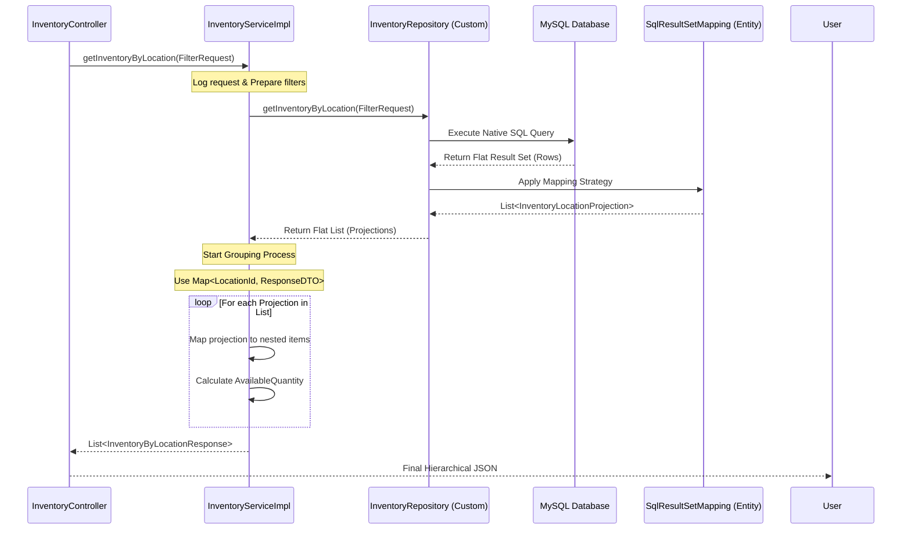

# Inventory Mapping Architecture Guide (Native SQL to Hierarchical DTO)

## 1. Tổng quan (Overview)
Tài liệu này hướng dẫn kiến trúc xử lý dữ liệu tồn kho (Inventory) trong hệ thống WMS. Đặc thù của tồn kho là dữ liệu phẳng trong Database nhưng cần hiển thị lồng nhau (Nested/Hierarchical) ở giao diện người dùng (ví dụ: Một Vị trí chứa danh sách nhiều Sản phẩm và Lô hàng).

### Vấn đề (The Challenge)
*   **SQL:** Trả về dữ liệu dạng bảng (Rows & Columns) phẳng.
*   **API:** Yêu cầu JSON có cấu trúc cây (Parent-Child).
*   **Hiệu năng:** Tránh lỗi N+1 Query và Cartesian Product khi dùng ORM thuần túy.

---

## 2. Quy trình 4 bước (The 4-Step Process)

### Bước 1: Flat Projection DTO (`InventoryLocationProjection`)
Lớp này đóng vai trò là "thùng chứa" trung gian để hứng toàn bộ dữ liệu thô từ SQL. Nó chứa tất cả các thuộc tính của cả Parent (Location) và Child (Product/Batch).

### Bước 2: SqlResultSetMapping (Entity Layer)
Định nghĩa ánh xạ tại `Inventory.java` để JPA biết cách khởi tạo `InventoryLocationProjection` từ các cột của `NativeQuery`.
*   Sử dụng `@ConstructorResult` để tối ưu hiệu năng khởi tạo đối tượng.

### Bước 3: Native Query & Dynamic Filtering (Repository Layer)
Viết SQL thuần túy để thực hiện các phép `JOIN` phức tạp.
*   Hỗ trợ lọc linh hoạt: `(:param IS NULL OR column = :param)`.
*   Đảm bảo Alias trong SQL khớp 100% với `@ColumnResult`.

### Bước 4: Grouping Logic (Service Layer)
Sử dụng `LinkedHashMap` để nhóm danh sách phẳng thành cấu trúc lồng nhau dựa trên `locationId`.

---

## 3. Sơ đồ trình tự (Sequence Diagram)



---

## 4. Đặc tả các thành phần (Component Specifications)

### 4.1. Cấu trúc SQL chuẩn
```sql
SELECT 
    l.id AS locationId, l.code AS locationCode, -- Parent Info
    p.id AS productId, b.batch_number AS batchNumber, -- Child Info
    i.on_hand_quantity AS onHandQuantity -- Data
FROM inventory i
JOIN products p ON ...
JOIN locations l ON ...
LEFT JOIN batches b ON ...
WHERE (:productId IS NULL OR p.id = :productId)
```

### 4.2. Logic nhóm dữ liệu (Grouping Snippet)
```java
Map<String, InventoryByLocationResponse> responseMap = new LinkedHashMap<>();
for (InventoryLocationProjection p : projections) {
    // Nhóm theo locationId
    InventoryByLocationResponse locationResponse = responseMap.computeIfAbsent(
        p.getLocationId(), id -> buildNewLocationResponse(p)
    );
    // Add item vào list con
    locationResponse.getItems().add(buildItemResponse(p));
}
```

---

## 5. Ưu điểm của kiến trúc (Architectural Rationale)

| Tiêu chí | Mô tả |
| :--- | :--- |
| **Performance** | Chỉ duy nhất **1 câu query** (O(1) database call). Xử lý nhóm dữ liệu trên RAM cực nhanh. |
| **Maintainability** | Tách biệt hoàn toàn giữa cấu trúc DB và cấu trúc API. Dễ dàng thay đổi SQL mà không hỏng API. |
| **Flexibility** | Hỗ trợ các bộ lọc động phức tạp mà không cần dùng Criteria API khó hiểu. |
| **Accuracy** | Tránh hoàn toàn lỗi dữ liệu lặp lại (Cartesian Product) do `JOIN` nhiều bảng 1-n. |

---

## 6. Lưu ý quan trọng (Important Notes)
1.  **Tên bảng:** Phải kiểm tra chính xác tên bảng trong DB (ví dụ: `batches` thay vì `batch`).
2.  **Alias SQL:** Phải khớp chính xác (Case-sensitive) với định nghĩa trong `@SqlResultSetMapping`.
3.  **BigDecimal:** Luôn xử lý số lượng bằng `BigDecimal` để tránh sai số dấu phẩy động.
4.  **Null-Safety:** Kiểm tra Null khi lấy dữ liệu từ `Projection` trước khi thực hiện tính toán.
