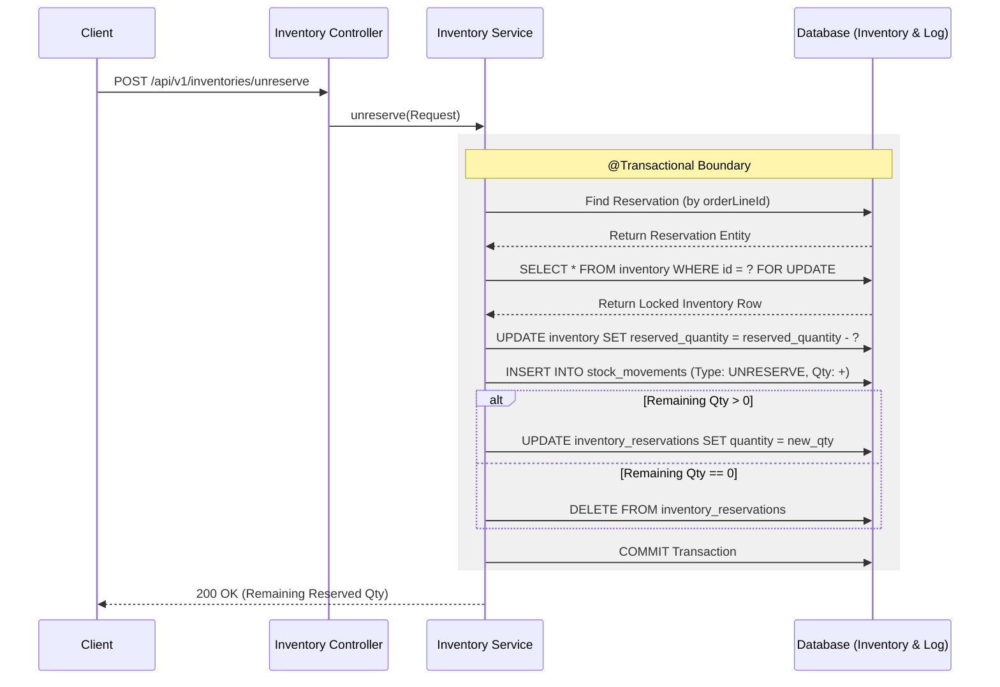

# Technical Specification: Inventory Unreserve System

**Version:** 1.0  
**Status:** Final  
**Author:** Senior Backend Architect  
**Date:** 2026-03-09

---

## 1. Tổng quan (Overview)

### Inventory Unreserve là gì?
**Inventory Unreserve** là tiến trình giải phóng một lượng hàng hóa đã được "đặt chỗ" (Reserved) trước đó cho một mục tiêu cụ thể (thường là Sales Order) nhưng chưa thực xuất kho. Hành động này đưa hàng hóa từ trạng thái "Chờ xuất" quay trở lại trạng thái "Có sẵn để bán".

### Các khái niệm cốt lõi:
Trong hệ thống WMS, tính chính xác của tồn kho dựa trên công thức bất biến:
> **Available (Khả dụng) = On-Hand (Thực tế có) - Reserved (Đang giữ chỗ)**

*   **On-Hand Quantity:** Tổng số lượng vật lý đang nằm trong kho.
*   **Reserved Quantity:** Số lượng hàng đã được hứa cho các đơn hàng.
*   **Available Quantity:** Số lượng hàng thực sự còn lại có thể bán.

---

## 2. Các kịch bản nghiệp vụ (Business Scenarios)

*   **Khách hàng hủy đơn hàng:** Đơn hàng bị hủy hoàn toàn trước khi xuất kho.
*   **Giảm số lượng đơn hàng:** Khách hàng thay đổi ý định, giảm số lượng (Partial Unreserve).
*   **Thanh toán thất bại:** Đơn hàng bị hủy do hết hạn thanh toán.
*   **Hệ thống Rollback:** Lỗi xảy ra trong luồng nghiệp vụ phức tạp cần hoàn trả kho.
*   **Giải phóng thủ công:** Nhân viên kho giải phóng hàng để xử lý hàng lỗi hoặc điều chỉnh vị trí.

---

## 3. Business Rules (Quy tắc nghiệp vụ)

1.  **Tính tồn tại:** Phải có một bản ghi Reservation tương ứng với `orderLineId` trong DB.
2.  **Giới hạn số lượng:** Không được unreserve nhiều hơn số lượng đang bị giữ (`unreserveQty <= currentReservedQty`).
3.  **Nhất quán Dimension:** `productId` và `warehouseId` phải khớp hoàn toàn với bản ghi giữ chỗ gốc.
4.  **Kiểm tra tính toàn vẹn:** Đảm bảo `inventory.reserved_quantity` đủ để trừ (tránh số âm).
5.  **Dọn dẹp dữ liệu:** Nếu số lượng còn lại sau khi unreserve bằng 0, bản ghi reservation sẽ bị xóa để tối ưu database.

---

## 4. End-to-End Flow (Luồng xử lý)

1.  **Client:** Gửi yêu cầu POST chứa `orderLineId` và `quantity`.
2.  **Validate:** Kiểm tra định dạng dữ liệu và tính logic của tham số.
3.  **Find Reservation:** Tìm lệnh giữ hàng trong bảng `inventory_reservation`.
4.  **Lock Inventory:** Thực hiện `SELECT ... FOR UPDATE` trên bảng `inventory`.
5.  **Update Inventory:** Giảm `reserved_quantity` trong bảng `inventory`.
6.  **Audit Trail:** Ghi log `UNRESERVE` vào bảng `stock_movements`.
7.  **Update/Delete Reservation:** 
    *   Nếu số dư > 0: Cập nhật giảm `quantity`.
    *   Nếu số dư = 0: Xóa bản ghi reservation.
8.  **Commit:** Hoàn tất transaction và trả về kết quả.

---

## 5. Sequence Flow Diagram



---

## 6. API Specification

### Endpoint: `POST /api/v1/inventories/unreserve`

**Request Body:**
```json
{
  "orderLineId": "OL-1001",
  "productId": "PROD-001",
  "warehouseId": "WH-001",
  "quantity": 5.0
}
```

**Success Response (200 OK):**
```json
{
  "success": true,
  "data": {
    "orderLineId": "OL-1001",
    "unreservedQuantity": 5.0,
    "remainingReservedQuantity": 0.0,
    "status": "RELEASED",
    "unreservedAt": "2026-03-09 20:13:37"
  }
}
```

---

## 7. Frontend Integration & UI State

*   **Trigger UI:** Trigger khi user nhấn "Hủy đơn" hoặc giảm số lượng item.
*   **State Update:**
    *   Tăng số lượng **Available** trên UI kho.
    *   Nếu `remainingReservedQuantity == 0`, cập nhật trạng thái dòng đơn hàng thành "Đã giải phóng".
*   **Error Handling:** Hiển thị thông báo cụ thể cho lỗi `INV_001` (Không tìm thấy) hoặc `INV_002` (Vượt số lượng).

---

## 8. Idempotency & Concurrency

*   **Idempotency:** Nếu request gửi lại cho đơn hàng đã giải phóng hết, hệ thống trả về thành công với `unreservedQuantity = 0` (dựa trên việc không tìm thấy reservation record).
*   **Concurrency:** Sử dụng **Pessimistic Locking** trên bảng `inventory` để ngăn chặn việc nhiều luồng cùng thay đổi số lượng đồng thời, gây sai lệch tồn kho.

---

## 9. Database Impact

*   **inventory:** `reserved_quantity` giảm.
*   **inventory_reservations:** Cập nhật giảm `quantity` hoặc **Xóa** nếu về 0.
*   **stock_movements:** Thêm record loại `UNRESERVE` (quantity_change > 0 cho lượng hàng khả dụng).

---

## 10. Logging Strategy

*   **INFO:** Lưu vết thành công kèm số lượng và ID đơn hàng.
*   **WARN:** Cảnh báo khi unreserve vượt quá số lượng đang giữ (vi phạm rule).
*   **ERROR:** Báo cáo lỗi tranh chấp dữ liệu (Deadlock) hoặc sai lệch tính toán dữ liệu.

---
*Tài liệu được phê duyệt bởi Senior Backend Architect.*
