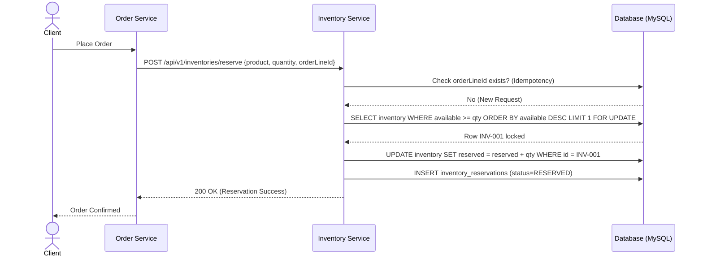

# Tài liệu Nghiệp vụ & Thiết kế: Quy trình Giữ chỗ Hàng tồn kho (Reserve Inventory)

## 1. Tổng quan nghiệp vụ Reserve
Trong hệ thống WMS, **Reserve Inventory** là hành động "giữ hàng ảo" cho một đơn hàng cụ thể trước khi hàng thực sự được lấy ra khỏi kệ (Pick). Việc này đảm bảo rằng khi một khách hàng đặt hàng thành công, số lượng hàng đó sẽ không bị bán cho người khác, dù nó vẫn đang nằm vật lý trong kho.

### Phạm vi (Scope) của Reserve:
Hành động Reserve chỉ đảm bảo giữ hàng về mặt **logic** trong hệ thống, hoàn toàn **KHÔNG**:
*   Di chuyển hàng vật lý giữa các vị trí.
*   Tạo nhiệm vụ lấy hàng (Picking Task).
*   Trừ tồn kho thực tế (`on_hand_quantity`).

Reserve chỉ thực hiện cập nhật:
1.  Chỉ số `reserved_quantity` trong bảng `inventory`.
2.  Ghi nhật ký giữ chỗ (Ledger) vào bảng `inventory_reservations`.

Các bước tiếp theo như **Picking** (Lấy hàng), **Packing** (Đóng gói) và **Shipping** (Xuất kho) sẽ được xử lý bởi các module nghiệp vụ khác.

### Các khái niệm cốt lõi:
*   **On-hand Quantity (Tồn thực tế)**: Tổng số lượng hàng đang nằm tại vị trí (Bin/Location).
*   **Reserved Quantity (Đang giữ chỗ)**: Số lượng hàng đã được hứa bán cho các đơn hàng nhưng chưa xuất kho.
*   **Available Quantity (Có thể bán)**: Số lượng hàng thực sự còn lại để phục vụ các đơn hàng mới.
    > **Công thức**: `Available = On-hand - Reserved`

---

## 2. Use Case của Reserve
*   **Tạo đơn hàng (Order Creation)**: Ngay khi Order Service tạo đơn, nó yêu cầu Inventory giữ hàng.
*   **OMS Integration**: Hệ thống quản lý đơn hàng tập trung gửi yêu cầu giữ hàng cho WMS.
*   **Tránh Overselling**: Chặn tình trạng 2 khách hàng cùng mua 1 món hàng cuối cùng trong kho.

---

## 3. Database Design & Consistency Rules

### 3.1. Các bảng dữ liệu
*   **Bảng `inventory`**: Lưu trữ trạng thái tồn kho tổng quát tại mỗi Dimension (Kho/Vị trí/Lô).
*   **Bảng `inventory_reservations` (Ledger)**: Lưu chi tiết từng lệnh giữ chỗ (`order_line_id`, `inventory_id`, `quantity`, `status`).

### 3.2. Data Consistency Rule (Quy tắc nhất quán)
Hệ thống phải đảm bảo tính cân bằng dữ liệu tuyệt đối:
> `inventory.reserved_quantity` = **SUM**(`inventory_reservations.quantity`) 
> WHERE `inventory_reservations.status` = 'RESERVED'

*   **Inventory**: Đóng vai trò là bảng cộng dồn (Aggregate) để truy vấn nhanh.
*   **Reservation**: Đóng vai trò là nguồn sự thật duy nhất (Source of Truth).

---

## 4. Flow xử lý Reserve (Step-by-step)

*   **Step 1 - Validate request**: Kiểm tra `quantity > 0`, `product`, `warehouse` có tồn tại.
*   **Step 2 - Idempotency check**: Kiểm tra `orderLineId` trong bảng `inventory_reservations`. Nếu đã tồn tại, trả về kết quả cũ ngay lập tức (Xử lý retry).
*   **Step 3 - Tìm inventory phù hợp**: Lọc theo Product, Warehouse, Location, Batch.
*   **Step 4 - Allocation strategy**:
    Hệ thống hỗ trợ nhiều chiến lược nhưng hiện tại đang áp dụng:
    *   **Max Available Strategy (Mặc định)**: Chọn dòng tồn kho có `available` lớn nhất để tránh phân mảnh.
    *   *Chiến lược tương lai*: FIFO (Theo lô nhập trước), FEFO (Theo hạn dùng), Proximity (Theo vị trí gần khu lấy hàng).
*   **Step 5 - Lock inventory row**: Sử dụng **Pessimistic Write Lock (`FOR UPDATE`)** lên dòng `inventory` duy nhất tốt nhất (`LIMIT 1`).
*   **Step 6 - Update inventory**: `reserved_quantity += request.quantity`.
*   **Step 7 - Tạo reservation ledger**: Insert vào `inventory_reservations` với trạng thái `RESERVED`.
*   **Step 8 - Return response**.

---

## 5. Sequence Diagram

---

## 6. Concurrency & Idempotency Handling

### 6.1. Retry Scenario (Chống lặp)
1. OMS gửi request reserve.
2. Inventory Service xử lý thành công nhưng phản hồi bị mất do Network Timeout.
3. OMS gửi lại (Retry) request với cùng `orderLineId`.
4. Hệ thống phát hiện `orderLineId` đã có trong bảng Reservation -> Trả về kết quả cũ, không cộng thêm tiền/hàng.

### 6.2. Race Condition (Tranh chấp đồng thời)
*   Sử dụng **Pessimistic Lock** để đảm bảo tại một thời điểm chỉ 1 thread được cập nhật 1 dòng tồn kho.
*   Sử dụng **Unique Constraint** trên `order_line_id` để ngăn chặn việc 2 thread cùng tạo reservation cho 1 line (trong trường hợp thread 1 chưa commit nhưng thread 2 đã đọc).

---

## 7. Failure Scenarios (Kịch bản thất bại)
1.  **Database Failure**: Nếu lưu Ledger thất bại sau khi đã update Inventory, Transaction sẽ tự động **Rollback** để đảm bảo tính nhất quán.
2.  **Lock Timeout**: Nếu một dòng bị khóa quá lâu, các request khác sẽ fail với lỗi 500/Timeout. OMS cần cơ chế retry.
3.  **Duplicate Reservation**: Nếu 2 request cùng ID gửi đến, Database Unique Constraint sẽ chặn đứng request thứ 2.

---

## 8. Lifecycle & States
*   **RESERVED**: Hàng đang bị giữ cho đơn hàng.
*   **CONSUMED**: Hàng đã được Pick và Ship thành công. Lúc này `reserved` giảm và `on_hand` giảm.
*   **RELEASED**: Đơn hàng bị hủy hoặc Unreserve. Lúc này `reserved` giảm, hàng quay lại `available`.

---

## 9. Operational Metrics (Giám sát vận hành)
Để hệ thống ổn định, cần theo dõi các chỉ số:
*   `reserve_success_rate`: Tỷ lệ giữ hàng thành công.
*   `average_reserve_latency`: Thời gian phản hồi trung bình (ms).
*   `lock_wait_time`: Thời gian chờ khóa (Cảnh báo nếu quá cao -> contention).
*   `insufficient_stock_rate`: Tỷ lệ lỗi do hết hàng.

---

## 10. Future Enhancements (Mở rộng tương lai)
*   **Multi-location Allocation**: Tự động chia tách đơn hàng ra nhiều vị trí nếu 1 vị trí không đủ hàng (Split Reservation).
*   **Distributed Lock (Redis)**: Sử dụng RedLock để tăng tốc độ xử lý trong môi trường cụm (Cluster).
*   **Reservation Expiration (TTL)**: Tự động giải phóng hàng sau X giờ nếu đơn hàng không được thanh toán.
*   **Event-driven Updates**: Gửi sự kiện (RabbitMQ/Kafka) khi tồn kho thay đổi để các hệ thống khác cập nhật.

---

## 11. Ví dụ minh họa dữ liệu

**Inventory Table**:
| ID | Product | On-hand | Reserved | Available (Logic) |
|:---|:---|:---|:---|:---|
| INV1 | iPhone 15 | 100 | 15 | 85 |

**Reservation Ledger**:
| Order Line | Qty | Status | Inventory ID |
|:---|:---|:---|:---|
| OL100 | 10 | RESERVED | INV1 |
| OL101 | 5 | RESERVED | INV1 |

> **Tổng Reserved** = 10 + 5 = 15 (Khớp với cột Reserved trong bảng Inventory).
