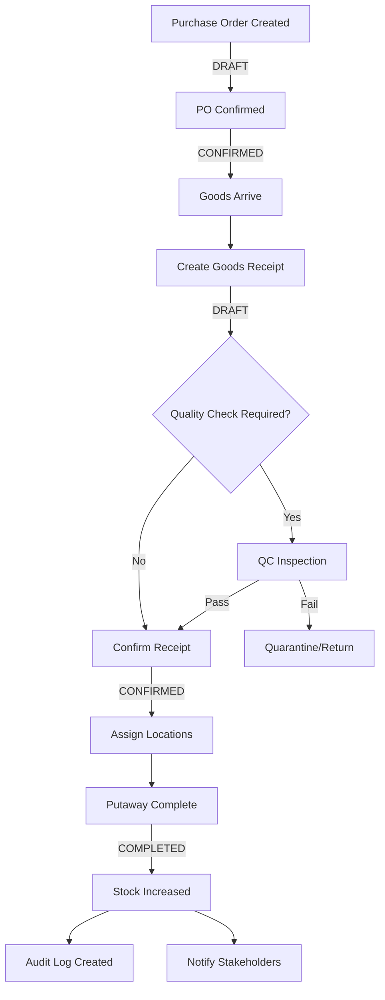
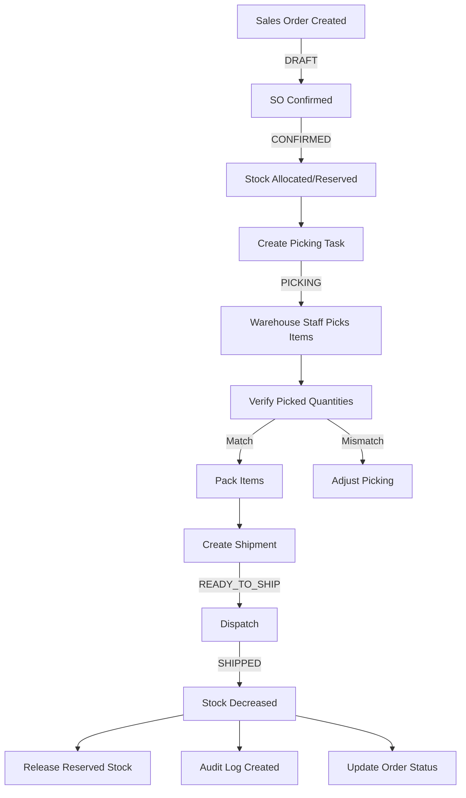
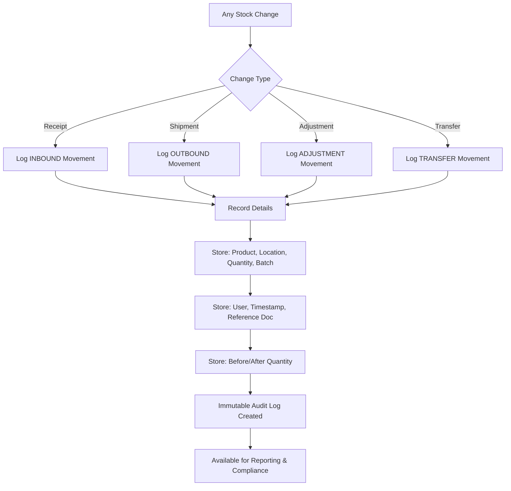

# BA Document - Module 3: Inventory Operations
## Business Requirements Specification

---

## 📋 Document Information

| Property | Value |
|----------|-------|
| **Module** | Inventory Operations (Phase 3: Business Flows) |
| **Version** | 1.0 |
| **Date** | February 01, 2026 |
| **Status** | Draft |
| **Author** | Business Analyst |

---

## 📑 Table of Contents

1. [Business Context](#business-context)
2. [Actors & Roles](#actors--roles)
3. [Module Overview](#module-overview)
4. [Feature 1: Inbound Operations (Goods Receipt)](#feature-1-inbound-operations-goods-receipt)
5. [Feature 2: Outbound Operations (Shipment)](#feature-2-outbound-operations-shipment)
6. [Feature 3: Stock Movement & Audit Trail](#feature-3-stock-movement--audit-trail)
7. [Feature 4: Inventory Adjustment](#feature-4-inventory-adjustment)
8. [Feature 5: Stock Transfer Between Locations](#feature-5-stock-transfer-between-locations)
9. [Sprint Planning](#sprint-planning)
10. [API Impact Summary](#api-impact-summary)
11. [Database Impact Summary](#database-impact-summary)
12. [Background Job Requirements](#background-job-requirements)
13. [Integration Points](#integration-points)

---

## 🎯 Business Context

### Current Pain Points

1. **Manual Inventory Tracking**: Staff use spreadsheets to track goods in/out, leading to errors and data loss.
2. **No Real-time Stock Updates**: Inventory counts are updated daily or weekly, causing stockouts and overselling.
3. **Lack of Traceability**: Cannot track which batch was shipped to which customer or when.
4. **Slow Receiving Process**: Goods receipt takes 30+ minutes per shipment due to manual verification.
5. **Inventory Discrepancies**: Physical count often differs from system count by 5-10%.
6. **No Audit Trail**: Cannot identify who authorized stock adjustments or why inventory changed.
7. **Inefficient Picking**: Warehouse staff spend excessive time locating items for shipment.

### Business Value

✅ **Real-time Inventory Visibility** - Know exact stock levels at any moment  
✅ **98%+ Accuracy** - Automated tracking reduces human errors  
✅ **Full Traceability** - Track every movement from receipt to shipment  
✅ **40% Faster Processing** - Streamlined workflows reduce processing time  
✅ **Compliance Ready** - Complete audit trail for regulatory requirements  
✅ **Cost Reduction** - Minimize stockouts, overstocking, and waste  
✅ **Better Customer Service** - Accurate inventory enables reliable order fulfillment  

### Business Impact

- **Operational**: Reduce receiving time from 30 min to 10 min per shipment
- **Financial**: Reduce inventory carrying costs by 15-20%
- **Customer Satisfaction**: Reduce backorders by 50%
- **Compliance**: Meet ISO 9001 and FDA traceability requirements
- **Decision Making**: Real-time data enables better purchasing and sales decisions

---

## 👥 Actors & Roles

| Actor | Goal | Permissions | Typical Actions |
|-------|------|-------------|-----------------|
| **Warehouse Manager** | Oversee all inventory operations and approve critical changes | Full access to inventory operations, approve adjustments | Review daily reports, approve large adjustments, resolve discrepancies |
| **Receiving Clerk** | Process incoming goods efficiently and accurately | Create/confirm goods receipts, view inventory | Check deliveries, scan items, confirm quantities, report damages |
| **Shipping Clerk** | Pick and ship orders accurately and on-time | Create/confirm shipments, pick items, view inventory | Process orders, pick items, pack shipments, confirm dispatch |
| **Inventory Controller** | Maintain accurate inventory counts | Create adjustments, perform cycle counts, view movements | Conduct counts, investigate discrepancies, adjust inventory |
| **Quality Inspector** | Ensure received goods meet quality standards | View goods receipts, quarantine items, approve/reject | Inspect items, test samples, approve for storage |
| **Auditor/Accountant** | Review inventory transactions for compliance | Read-only access to all inventory data and audit logs | Review reports, audit trails, reconcile with financial records |
| **System Admin** | Manage system configuration and troubleshoot issues | Full system access | Configure workflows, troubleshoot errors, manage integrations |

---

## 📦 Module Overview

Inventory Operations is the core operational module that handles all movements of goods in and out of warehouses, ensuring real-time accuracy and full traceability.

### Core Business Processes

1. **Inbound Operations** - Receiving goods into the warehouse
   - Purchase Order → Goods Receipt → Quality Check → Putaway → Stock Increased
   
2. **Outbound Operations** - Shipping goods from the warehouse
   - Sales Order → Allocation → Picking → Packing → Shipment → Stock Decreased
   
3. **Stock Movement Audit** - Tracking and recording every inventory change
   - Immutable audit log for compliance and traceability
   
4. **Inventory Adjustment** - Correcting discrepancies found during cycle counts
   - Authorized adjustments with approval workflow for large amounts
   
5. **Stock Transfer** - Moving inventory between locations within a warehouse
   - Optimize storage space and prepare for picking

### Core Entities

1. **Goods Receipt** - Inbound document recording receipt of goods
2. **Goods Receipt Line** - Individual items received
3. **Shipment** - Outbound document recording goods sent out
4. **Shipment Line** - Individual items shipped
5. **Stock Movement** - Audit record of any inventory change
6. **Inventory Adjustment** - Document for correcting inventory discrepancies
7. **Stock Transfer** - Document for moving stock between locations

### Key Features

- ✅ **Batch/Lot Tracking** - Track goods by batch number from receipt to shipment
- ✅ **Location Management** - Assign specific locations for putaway and picking
- ✅ **Real-time Updates** - Inventory updates immediately upon confirmation
- ✅ **Validation Rules** - Prevent invalid operations (e.g., picking more than available)
- ✅ **Workflow States** - Draft → Confirmed → Completed with validation at each step
- ✅ **Audit Trail** - Every stock change logged with who, when, what, why
- ✅ **Approval Workflow** - Large adjustments require manager approval
- ✅ **Exception Handling** - Damaged goods, returns, quality holds

### Dependencies

- **Depends on**: 
  - Module 1 (Auth & RBAC) - for user authentication and permissions
  - Module 2 (Master Data) - warehouses, locations, products, partners, UOMs
  
- **Required by**: 
  - Reporting Module - inventory reports, KPI dashboards
  - Notification Module - alerts for low stock, discrepancies
  - Integration APIs - ERP/e-commerce synchronization

---

## 📊 High-Level Process Flow

### Inbound Flow (Goods Receipt)

### Outbound Flow (Shipment)

### Audit Trail Flow

---

## 📋 Feature 1: Inbound Operations (Goods Receipt)

### Overview
Process of receiving goods into the warehouse, performing quality checks, assigning storage locations, and updating inventory levels.

### User Stories

**US-INV-01**: As a Receiving Clerk, I want to create a goods receipt from a purchase order, so that I can record incoming goods systematically.

**US-INV-02**: As a Receiving Clerk, I want to scan barcodes to quickly enter received items, so that the receiving process is faster and more accurate.

**US-INV-03**: As a Quality Inspector, I want to flag items for quality inspection, so that defective goods don't enter inventory.

**US-INV-04**: As a Receiving Clerk, I want to assign batch numbers and expiry dates during receipt, so that we can track product lifecycles.

**US-INV-05**: As a Warehouse Manager, I want to see a list of pending receipts, so that I can monitor receiving performance.

**US-INV-06**: As a Receiving Clerk, I want to assign specific storage locations during putaway, so that items are easy to find later.

**US-INV-07**: As an Inventory Controller, I want to handle partial receipts, so that we can process partial deliveries from suppliers.

### Business Rules

1. **Goods Receipt Lifecycle**: DRAFT → CONFIRMED → COMPLETED
2. **Stock Update Timing**: Stock increases only when status = COMPLETED
3. **Required Information**: Product, quantity, UOM, warehouse, supplier reference
4. **Optional Batch Tracking**: Batch number, manufacturing date, expiry date
5. **Location Assignment**: Required for COMPLETED status
6. **Partial Receipts**: Can receive less than ordered; cannot exceed PO quantity
7. **Quality Hold**: Items in QC status don't count as available inventory
8. **Audit Trail**: Every receipt must log who received, when, and reference documents

### Detailed Specifications
See: [FEATURE_1_INBOUND_OPERATIONS.md](./FEATURE_1_INBOUND_OPERATIONS.md)

---

## 📋 Feature 2: Outbound Operations (Shipment)

### Overview
Process of fulfilling customer orders by picking items from inventory, packing, and shipping them out, with real-time stock reduction.

### User Stories

**US-OUT-01**: As a Shipping Clerk, I want to create a shipment from a sales order, so that I can fulfill customer orders.

**US-OUT-02**: As a Shipping Clerk, I want to see picking instructions with item locations, so that I can find items quickly.

**US-OUT-03**: As a Shipping Clerk, I want to scan items during picking to verify accuracy, so that we ship the correct products.

**US-OUT-04**: As a Warehouse Manager, I want the system to allocate stock automatically based on FIFO, so that older stock is shipped first.

**US-OUT-05**: As a Shipping Clerk, I want to print packing slips and shipping labels, so that shipments are properly documented.

**US-OUT-06**: As an Inventory Controller, I want to handle partial shipments, so that we can fulfill orders in multiple deliveries.

**US-OUT-07**: As a Warehouse Manager, I want to reserve stock for confirmed orders, so that we don't oversell.

### Business Rules

1. **Shipment Lifecycle**: DRAFT → CONFIRMED → PICKING → READY_TO_SHIP → SHIPPED → DELIVERED
2. **Stock Update Timing**: Stock decreases when status = SHIPPED
3. **Stock Reservation**: Reserve stock when order is CONFIRMED; release when SHIPPED or CANCELLED
4. **Allocation Strategy**: Default FIFO (First-In-First-Out) by batch manufacturing date
5. **Picking Validation**: Cannot pick more than available stock
6. **Location Tracking**: Record which location items were picked from
7. **Partial Shipment**: Can ship less than ordered; remaining quantity stays in order
8. **Return Handling**: Separate process (out of scope for Phase 3)

### Detailed Specifications
See: [FEATURE_2_OUTBOUND_OPERATIONS.md](./FEATURE_2_OUTBOUND_OPERATIONS.md)

---

## 📋 Feature 3: Stock Movement & Audit Trail

### Overview
Comprehensive, immutable audit log of all inventory changes for traceability, compliance, and reporting.

### User Stories

**US-AUD-01**: As an Auditor, I want to see a complete history of stock movements for a product, so that I can verify inventory accuracy.

**US-AUD-02**: As a Warehouse Manager, I want to track who made each inventory change, so that I can ensure accountability.

**US-AUD-03**: As an Inventory Controller, I want to see before/after quantities for each movement, so that I can investigate discrepancies.

**US-AUD-04**: As an Auditor, I want to filter movements by date range and type, so that I can generate compliance reports.

**US-AUD-05**: As a System Admin, I want movement logs to be immutable, so that audit data cannot be tampered with.

### Business Rules

1. **Automatic Logging**: Every stock change triggers a stock movement record
2. **Movement Types**: INBOUND, OUTBOUND, ADJUSTMENT, TRANSFER, INITIAL_STOCK
3. **Required Data**: Product, location, quantity, movement type, reference document, user, timestamp
4. **Immutable**: Once created, movement records cannot be edited or deleted
5. **Traceability**: Link to source document (goods receipt, shipment, adjustment)
6. **Batch Tracking**: Record batch number for batch-tracked products
7. **Before/After Snapshot**: Store quantity before and after the movement
8. **Retention Policy**: Keep all movement data for minimum 7 years (compliance requirement)

### Detailed Specifications
See: [FEATURE_3_STOCK_MOVEMENT_AUDIT.md](./FEATURE_3_STOCK_MOVEMENT_AUDIT.md)

---

## 📋 Feature 4: Inventory Adjustment

### Overview
Correct inventory discrepancies found during physical counts, with approval workflow for significant adjustments.

### User Stories

**US-ADJ-01**: As an Inventory Controller, I want to create an adjustment document, so that I can correct inventory discrepancies.

**US-ADJ-02**: As an Inventory Controller, I want to specify a reason for each adjustment, so that we can analyze root causes.

**US-ADJ-03**: As a Warehouse Manager, I want to approve adjustments over a threshold, so that large changes are verified.

**US-ADJ-04**: As an Auditor, I want to see all adjustments with justifications, so that I can review for fraud or errors.

**US-ADJ-05**: As an Inventory Controller, I want to perform cycle counts by location, so that we maintain accuracy without full shutdowns.

### Business Rules

1. **Adjustment Types**: CYCLE_COUNT, DAMAGE, LOSS, FOUND, DATA_CORRECTION
2. **Approval Workflow**: Adjustments > 10% of stock or > $1000 value require manager approval
3. **Reason Required**: Every adjustment must have a documented reason
4. **Status Flow**: DRAFT → PENDING_APPROVAL (if needed) → APPROVED → COMPLETED
5. **Stock Update**: Stock changes only when status = COMPLETED
6. **Photographic Evidence**: Optional attachment for high-value adjustments
7. **Frequency Limits**: Same product/location cannot be adjusted > 3 times per day (fraud prevention)

### Detailed Specifications
See: [FEATURE_4_INVENTORY_ADJUSTMENT.md](./FEATURE_4_INVENTORY_ADJUSTMENT.md)

---

## 📋 Feature 5: Stock Transfer Between Locations

### Overview
Move inventory between locations within the same warehouse to optimize space utilization and prepare for picking.

### User Stories

**US-TRF-01**: As an Inventory Controller, I want to transfer stock between locations, so that I can optimize warehouse layout.

**US-TRF-02**: As a Warehouse Manager, I want to see pending transfers, so that I can monitor warehouse reorganization tasks.

**US-TRF-03**: As a Warehouse Staff, I want to scan items during transfer, so that I verify I'm moving the correct items.

**US-TRF-04**: As an Inventory Controller, I want to transfer stock in batches, so that I can reorganize without disrupting operations.

### Business Rules

1. **Same Warehouse Only**: Transfers only between locations in the same warehouse
2. **Status Flow**: DRAFT → CONFIRMED → IN_TRANSIT → COMPLETED
3. **Stock Update**: Decrease from source location and increase to destination when COMPLETED
4. **Validation**: Cannot transfer more than available at source location
5. **Batch Preservation**: Batch number remains the same during transfer
6. **Concurrent Transfers**: Same stock cannot be in multiple pending transfers
7. **Audit Trail**: Record both decrease and increase movements

### Detailed Specifications
See: [FEATURE_5_STOCK_TRANSFER.md](./FEATURE_5_STOCK_TRANSFER.md)

---

## 📅 Sprint Planning

### Sprint 3.1 - Inbound Operations Foundation (2 weeks)

**Goals:**
- Implement Goods Receipt entity and basic CRUD
- Implement draft → confirmed → completed workflow
- Stock increase logic with location assignment
- Basic audit trail for inbound movements

**Deliverables:**
- Goods Receipt API endpoints
- Request/Response DTOs
- Repository layer with JPA
- Service layer with business logic
- Unit tests (80% coverage)
- Integration tests for happy paths
- API documentation (OpenAPI)

**User Stories:** US-INV-01, US-INV-04, US-INV-06

**Acceptance Criteria:**
- Can create, update, delete draft receipts
- Can confirm receipt and increase stock
- Can assign batch numbers and locations
- Audit log records all movements
- API returns appropriate error codes

---

### Sprint 3.2 - Outbound Operations Foundation (2 weeks)

**Goals:**
- Implement Shipment entity and basic CRUD
- Implement picking workflow
- Stock decrease and reservation logic
- Audit trail for outbound movements

**Deliverables:**
- Shipment API endpoints
- Stock allocation service
- Picking task generation
- Request/Response DTOs
- Repository layer
- Service layer
- Unit tests (80% coverage)
- Integration tests
- API documentation

**User Stories:** US-OUT-01, US-OUT-02, US-OUT-03, US-OUT-07

**Acceptance Criteria:**
- Can create shipments from sales orders
- Can reserve stock for confirmed orders
- Can complete picking and decrease stock
- Cannot pick more than available
- Audit log records all movements

---

### Sprint 3.3 - Audit Trail & Reporting (1 week)

**Goals:**
- Comprehensive stock movement query APIs
- Movement filtering and search
- Export capabilities
- Performance optimization

**Deliverables:**
- Stock Movement query endpoints
- Advanced filtering (date range, type, product, location)
- Pagination and sorting
- Export to Excel/CSV
- Database indexes for performance
- Unit tests
- API documentation

**User Stories:** US-AUD-01, US-AUD-02, US-AUD-03, US-AUD-04

**Acceptance Criteria:**
- Can query movements by multiple criteria
- Export generates correct Excel file
- Query performance < 500ms for 100k records
- Audit trail is immutable

---

### Sprint 3.4 - Inventory Adjustment (1 week)

**Goals:**
- Implement adjustment document
- Approval workflow
- Adjustment reasons and validation
- Integration with audit trail

**Deliverables:**
- Inventory Adjustment API endpoints
- Approval workflow service
- Request/Response DTOs
- Repository and service layers
- Unit tests
- Integration tests
- API documentation

**User Stories:** US-ADJ-01, US-ADJ-02, US-ADJ-03, US-ADJ-04

**Acceptance Criteria:**
- Can create adjustments with reasons
- Large adjustments require approval
- Cannot adjust same item > 3 times/day
- Audit log records adjustments

---

### Sprint 3.5 - Stock Transfer & Advanced Features (1 week)

**Goals:**
- Implement stock transfer between locations
- Batch/partial receipt and shipment handling
- QC hold functionality
- Performance optimization

**Deliverables:**
- Stock Transfer API endpoints
- Partial receipt/shipment logic
- QC hold workflow
- Advanced validations
- Unit tests
- Integration tests
- Performance tuning
- API documentation

**User Stories:** US-INV-03, US-INV-07, US-OUT-06, US-TRF-01, US-TRF-03

**Acceptance Criteria:**
- Can transfer stock between locations
- Can handle partial receipts and shipments
- QC held items don't count as available
- All operations maintain data consistency

---

### Sprint 3.6 - Integration & Testing (1 week)

**Goals:**
- End-to-end integration testing
- Performance testing
- Bug fixes
- Documentation finalization

**Deliverables:**
- E2E test scenarios
- Load testing results
- Bug fixes
- Complete API documentation
- Postman collection
- User manual updates

**Acceptance Criteria:**
- All integration tests pass
- API handles 100 concurrent requests
- Response time < 200ms (p95)
- All bugs resolved
- Documentation complete

---

## 📊 API Impact Summary

### Inbound Operations APIs

| Endpoint | Method | Purpose | Request DTO | Response DTO |
|----------|--------|---------|-------------|--------------|
| `/api/goods-receipts` | GET | List all receipts with filters | - | `Page<GoodsReceiptSummaryResponse>` |
| `/api/goods-receipts/{id}` | GET | Get receipt details | - | `GoodsReceiptDetailResponse` |
| `/api/goods-receipts` | POST | Create new receipt | `CreateGoodsReceiptRequest` | `GoodsReceiptDetailResponse` |
| `/api/goods-receipts/{id}` | PUT | Update draft receipt | `UpdateGoodsReceiptRequest` | `GoodsReceiptDetailResponse` |
| `/api/goods-receipts/{id}` | DELETE | Delete draft receipt | - | `void` |
| `/api/goods-receipts/{id}/confirm` | POST | Confirm receipt | `ConfirmGoodsReceiptRequest` | `GoodsReceiptDetailResponse` |
| `/api/goods-receipts/{id}/complete` | POST | Complete receipt (putaway done) | `CompleteGoodsReceiptRequest` | `GoodsReceiptDetailResponse` |
| `/api/goods-receipts/{id}/lines` | GET | Get receipt lines | - | `List<GoodsReceiptLineResponse>` |
| `/api/goods-receipts/{id}/lines` | POST | Add line to draft receipt | `AddGoodsReceiptLineRequest` | `GoodsReceiptLineResponse` |
| `/api/goods-receipts/{id}/lines/{lineId}` | PUT | Update line in draft receipt | `UpdateGoodsReceiptLineRequest` | `GoodsReceiptLineResponse` |
| `/api/goods-receipts/{id}/lines/{lineId}` | DELETE | Remove line from draft receipt | - | `void` |

### Outbound Operations APIs

| Endpoint | Method | Purpose | Request DTO | Response DTO |
|----------|--------|---------|-------------|--------------|
| `/api/shipments` | GET | List all shipments with filters | - | `Page<ShipmentSummaryResponse>` |
| `/api/shipments/{id}` | GET | Get shipment details | - | `ShipmentDetailResponse` |
| `/api/shipments` | POST | Create new shipment | `CreateShipmentRequest` | `ShipmentDetailResponse` |
| `/api/shipments/{id}` | PUT | Update draft shipment | `UpdateShipmentRequest` | `ShipmentDetailResponse` |
| `/api/shipments/{id}` | DELETE | Delete draft shipment | - | `void` |
| `/api/shipments/{id}/confirm` | POST | Confirm and reserve stock | `ConfirmShipmentRequest` | `ShipmentDetailResponse` |
| `/api/shipments/{id}/pick` | POST | Start picking process | - | `ShipmentDetailResponse` |
| `/api/shipments/{id}/complete-picking` | POST | Complete picking | `CompletePickingRequest` | `ShipmentDetailResponse` |
| `/api/shipments/{id}/ship` | POST | Mark as shipped (decrease stock) | `ShipShipmentRequest` | `ShipmentDetailResponse` |
| `/api/shipments/{id}/lines` | GET | Get shipment lines | - | `List<ShipmentLineResponse>` |
| `/api/shipments/{id}/allocations` | GET | Get stock allocations | - | `List<StockAllocationResponse>` |

### Stock Movement & Audit APIs

| Endpoint | Method | Purpose | Request DTO | Response DTO |
|----------|--------|---------|-------------|--------------|
| `/api/stock-movements` | GET | Query movements with filters | - | `Page<StockMovementResponse>` |
| `/api/stock-movements/{id}` | GET | Get movement details | - | `StockMovementDetailResponse` |
| `/api/stock-movements/product/{productId}` | GET | Get movements for a product | - | `Page<StockMovementResponse>` |
| `/api/stock-movements/location/{locationId}` | GET | Get movements for a location | - | `Page<StockMovementResponse>` |
| `/api/stock-movements/export` | GET | Export movements to Excel | - | `File (Excel)` |

### Inventory Adjustment APIs

| Endpoint | Method | Purpose | Request DTO | Response DTO |
|----------|--------|---------|-------------|--------------|
| `/api/adjustments` | GET | List all adjustments with filters | - | `Page<AdjustmentSummaryResponse>` |
| `/api/adjustments/{id}` | GET | Get adjustment details | - | `AdjustmentDetailResponse` |
| `/api/adjustments` | POST | Create new adjustment | `CreateAdjustmentRequest` | `AdjustmentDetailResponse` |
| `/api/adjustments/{id}` | PUT | Update draft adjustment | `UpdateAdjustmentRequest` | `AdjustmentDetailResponse` |
| `/api/adjustments/{id}` | DELETE | Delete draft adjustment | - | `void` |
| `/api/adjustments/{id}/submit` | POST | Submit for approval | - | `AdjustmentDetailResponse` |
| `/api/adjustments/{id}/approve` | POST | Approve adjustment | `ApproveAdjustmentRequest` | `AdjustmentDetailResponse` |
| `/api/adjustments/{id}/reject` | POST | Reject adjustment | `RejectAdjustmentRequest` | `AdjustmentDetailResponse` |
| `/api/adjustments/{id}/complete` | POST | Complete adjustment | - | `AdjustmentDetailResponse` |

### Stock Transfer APIs

| Endpoint | Method | Purpose | Request DTO | Response DTO |
|----------|--------|---------|-------------|--------------|
| `/api/stock-transfers` | GET | List all transfers with filters | - | `Page<StockTransferSummaryResponse>` |
| `/api/stock-transfers/{id}` | GET | Get transfer details | - | `StockTransferDetailResponse` |
| `/api/stock-transfers` | POST | Create new transfer | `CreateStockTransferRequest` | `StockTransferDetailResponse` |
| `/api/stock-transfers/{id}` | PUT | Update draft transfer | `UpdateStockTransferRequest` | `StockTransferDetailResponse` |
| `/api/stock-transfers/{id}` | DELETE | Delete draft transfer | - | `void` |
| `/api/stock-transfers/{id}/confirm` | POST | Confirm transfer | - | `StockTransferDetailResponse` |
| `/api/stock-transfers/{id}/complete` | POST | Complete transfer | - | `StockTransferDetailResponse` |

---

## 🗄️ Database Impact Summary

### New Tables

#### 1. goods_receipts
**Purpose**: Store inbound document headers  
**Key Columns**:
- `id` (BIGINT, PK, AUTO_INCREMENT)
- `receipt_number` (VARCHAR(50), UNIQUE, NOT NULL) - Auto-generated: GR-YYYYMMDD-XXX
- `warehouse_id` (BIGINT, FK to warehouses, NOT NULL)
- `supplier_id` (BIGINT, FK to business_partners, NULL)
- `purchase_order_reference` (VARCHAR(100), NULL)
- `receipt_date` (DATE, NOT NULL)
- `status` (ENUM: DRAFT, CONFIRMED, COMPLETED, CANCELLED)
- `notes` (TEXT, NULL)
- `received_by` (BIGINT, FK to accounts, NOT NULL)
- `confirmed_by` (BIGINT, FK to accounts, NULL)
- `confirmed_at` (DATETIME, NULL)
- `completed_by` (BIGINT, FK to accounts, NULL)
- `completed_at` (DATETIME, NULL)
- `created_at` (DATETIME, NOT NULL)
- `updated_at` (DATETIME, NOT NULL)
- `created_by` (BIGINT, FK to accounts, NOT NULL)
- `updated_by` (BIGINT, FK to accounts, NOT NULL)

**Indexes**:
- `idx_receipt_number` (receipt_number)
- `idx_warehouse_id` (warehouse_id)
- `idx_supplier_id` (supplier_id)
- `idx_status` (status)
- `idx_receipt_date` (receipt_date)

---

#### 2. goods_receipt_lines
**Purpose**: Store individual items in each receipt  
**Key Columns**:
- `id` (BIGINT, PK, AUTO_INCREMENT)
- `goods_receipt_id` (BIGINT, FK to goods_receipts, NOT NULL)
- `line_number` (INT, NOT NULL) - Sequential within receipt
- `product_id` (BIGINT, FK to products, NOT NULL)
- `expected_quantity` (DECIMAL(15,3), NOT NULL) - From PO
- `received_quantity` (DECIMAL(15,3), NOT NULL) - Actual received
- `uom_id` (BIGINT, FK to uoms, NOT NULL)
- `batch_number` (VARCHAR(50), NULL)
- `manufacturing_date` (DATE, NULL)
- `expiry_date` (DATE, NULL)
- `location_id` (BIGINT, FK to locations, NULL) - Assigned during putaway
- `quality_status` (ENUM: PENDING, PASSED, FAILED, QUARANTINE) - Default: PASSED
- `notes` (TEXT, NULL)
- `created_at` (DATETIME, NOT NULL)
- `updated_at` (DATETIME, NOT NULL)

**Indexes**:
- `idx_goods_receipt_id` (goods_receipt_id)
- `idx_product_id` (product_id)
- `idx_batch_number` (batch_number)
- `idx_location_id` (location_id)

---

#### 3. shipments
**Purpose**: Store outbound document headers  
**Key Columns**:
- `id` (BIGINT, PK, AUTO_INCREMENT)
- `shipment_number` (VARCHAR(50), UNIQUE, NOT NULL) - Auto-generated: SH-YYYYMMDD-XXX
- `warehouse_id` (BIGINT, FK to warehouses, NOT NULL)
- `customer_id` (BIGINT, FK to business_partners, NOT NULL)
- `sales_order_reference` (VARCHAR(100), NULL)
- `shipment_date` (DATE, NOT NULL)
- `status` (ENUM: DRAFT, CONFIRMED, PICKING, READY_TO_SHIP, SHIPPED, DELIVERED, CANCELLED)
- `shipping_address` (TEXT, NULL)
- `carrier` (VARCHAR(100), NULL)
- `tracking_number` (VARCHAR(100), NULL)
- `notes` (TEXT, NULL)
- `created_by` (BIGINT, FK to accounts, NOT NULL)
- `confirmed_by` (BIGINT, FK to accounts, NULL)
- `confirmed_at` (DATETIME, NULL)
- `picked_by` (BIGINT, FK to accounts, NULL)
- `picked_at` (DATETIME, NULL)
- `shipped_by` (BIGINT, FK to accounts, NULL)
- `shipped_at` (DATETIME, NULL)
- `created_at` (DATETIME, NOT NULL)
- `updated_at` (DATETIME, NOT NULL)
- `updated_by` (BIGINT, FK to accounts, NOT NULL)

**Indexes**:
- `idx_shipment_number` (shipment_number)
- `idx_warehouse_id` (warehouse_id)
- `idx_customer_id` (customer_id)
- `idx_status` (status)
- `idx_shipment_date` (shipment_date)

---

#### 4. shipment_lines
**Purpose**: Store individual items in each shipment  
**Key Columns**:
- `id` (BIGINT, PK, AUTO_INCREMENT)
- `shipment_id` (BIGINT, FK to shipments, NOT NULL)
- `line_number` (INT, NOT NULL)
- `product_id` (BIGINT, FK to products, NOT NULL)
- `ordered_quantity` (DECIMAL(15,3), NOT NULL) - From SO
- `shipped_quantity` (DECIMAL(15,3), NOT NULL) - Actual shipped
- `uom_id` (BIGINT, FK to uoms, NOT NULL)
- `batch_number` (VARCHAR(50), NULL)
- `location_id` (BIGINT, FK to locations, NULL) - Picked from
- `notes` (TEXT, NULL)
- `created_at` (DATETIME, NOT NULL)
- `updated_at` (DATETIME, NOT NULL)

**Indexes**:
- `idx_shipment_id` (shipment_id)
- `idx_product_id` (product_id)
- `idx_batch_number` (batch_number)

---

#### 5. stock_movements
**Purpose**: Immutable audit log of all inventory changes  
**Key Columns**:
- `id` (BIGINT, PK, AUTO_INCREMENT)
- `movement_type` (ENUM: INBOUND, OUTBOUND, ADJUSTMENT, TRANSFER_OUT, TRANSFER_IN, INITIAL_STOCK, NOT NULL)
- `product_id` (BIGINT, FK to products, NOT NULL)
- `warehouse_id` (BIGINT, FK to warehouses, NOT NULL)
- `location_id` (BIGINT, FK to locations, NULL)
- `batch_number` (VARCHAR(50), NULL)
- `quantity` (DECIMAL(15,3), NOT NULL) - Positive for increase, negative for decrease
- `uom_id` (BIGINT, FK to uoms, NOT NULL)
- `quantity_before` (DECIMAL(15,3), NOT NULL)
- `quantity_after` (DECIMAL(15,3), NOT NULL)
- `reference_type` (VARCHAR(50), NOT NULL) - e.g., GOODS_RECEIPT, SHIPMENT, ADJUSTMENT
- `reference_id` (BIGINT, NOT NULL) - ID of source document
- `reference_number` (VARCHAR(50), NULL) - Document number for display
- `notes` (TEXT, NULL)
- `movement_date` (DATETIME, NOT NULL)
- `created_by` (BIGINT, FK to accounts, NOT NULL)
- `created_at` (DATETIME, NOT NULL) - Immutable

**Indexes**:
- `idx_product_id` (product_id)
- `idx_warehouse_location` (warehouse_id, location_id)
- `idx_batch_number` (batch_number)
- `idx_movement_type` (movement_type)
- `idx_movement_date` (movement_date)
- `idx_reference` (reference_type, reference_id)

---

#### 6. inventory_adjustments
**Purpose**: Store inventory adjustment documents  
**Key Columns**:
- `id` (BIGINT, PK, AUTO_INCREMENT)
- `adjustment_number` (VARCHAR(50), UNIQUE, NOT NULL) - Auto-generated: ADJ-YYYYMMDD-XXX
- `warehouse_id` (BIGINT, FK to warehouses, NOT NULL)
- `adjustment_type` (ENUM: CYCLE_COUNT, DAMAGE, LOSS, FOUND, DATA_CORRECTION, NOT NULL)
- `adjustment_date` (DATE, NOT NULL)
- `status` (ENUM: DRAFT, PENDING_APPROVAL, APPROVED, REJECTED, COMPLETED, NOT NULL)
- `reason` (TEXT, NOT NULL)
- `requires_approval` (BOOLEAN, NOT NULL, DEFAULT FALSE)
- `attachment_url` (VARCHAR(500), NULL) - For photos/documents
- `created_by` (BIGINT, FK to accounts, NOT NULL)
- `submitted_by` (BIGINT, FK to accounts, NULL)
- `submitted_at` (DATETIME, NULL)
- `approved_by` (BIGINT, FK to accounts, NULL)
- `approved_at` (DATETIME, NULL)
- `completed_by` (BIGINT, FK to accounts, NULL)
- `completed_at` (DATETIME, NULL)
- `created_at` (DATETIME, NOT NULL)
- `updated_at` (DATETIME, NOT NULL)
- `updated_by` (BIGINT, FK to accounts, NOT NULL)

**Indexes**:
- `idx_adjustment_number` (adjustment_number)
- `idx_warehouse_id` (warehouse_id)
- `idx_status` (status)
- `idx_adjustment_date` (adjustment_date)
- `idx_adjustment_type` (adjustment_type)

---

#### 7. inventory_adjustment_lines
**Purpose**: Store individual adjustments for each product  
**Key Columns**:
- `id` (BIGINT, PK, AUTO_INCREMENT)
- `adjustment_id` (BIGINT, FK to inventory_adjustments, NOT NULL)
- `line_number` (INT, NOT NULL)
- `product_id` (BIGINT, FK to products, NOT NULL)
- `location_id` (BIGINT, FK to locations, NOT NULL)
- `batch_number` (VARCHAR(50), NULL)
- `system_quantity` (DECIMAL(15,3), NOT NULL) - Current in system
- `physical_quantity` (DECIMAL(15,3), NOT NULL) - Actual counted
- `adjustment_quantity` (DECIMAL(15,3), NOT NULL) - Difference (physical - system)
- `uom_id` (BIGINT, FK to uoms, NOT NULL)
- `notes` (TEXT, NULL)
- `created_at` (DATETIME, NOT NULL)
- `updated_at` (DATETIME, NOT NULL)

**Indexes**:
- `idx_adjustment_id` (adjustment_id)
- `idx_product_id` (product_id)
- `idx_location_id` (location_id)

---

#### 8. stock_transfers
**Purpose**: Store stock transfers between locations  
**Key Columns**:
- `id` (BIGINT, PK, AUTO_INCREMENT)
- `transfer_number` (VARCHAR(50), UNIQUE, NOT NULL) - Auto-generated: TRF-YYYYMMDD-XXX
- `warehouse_id` (BIGINT, FK to warehouses, NOT NULL)
- `from_location_id` (BIGINT, FK to locations, NOT NULL)
- `to_location_id` (BIGINT, FK to locations, NOT NULL)
- `product_id` (BIGINT, FK to products, NOT NULL)
- `batch_number` (VARCHAR(50), NULL)
- `quantity` (DECIMAL(15,3), NOT NULL)
- `uom_id` (BIGINT, FK to uoms, NOT NULL)
- `status` (ENUM: DRAFT, CONFIRMED, IN_TRANSIT, COMPLETED, CANCELLED, NOT NULL)
- `transfer_date` (DATE, NOT NULL)
- `reason` (TEXT, NULL)
- `created_by` (BIGINT, FK to accounts, NOT NULL)
- `confirmed_by` (BIGINT, FK to accounts, NULL)
- `confirmed_at` (DATETIME, NULL)
- `completed_by` (BIGINT, FK to accounts, NULL)
- `completed_at` (DATETIME, NULL)
- `created_at` (DATETIME, NOT NULL)
- `updated_at` (DATETIME, NOT NULL)
- `updated_by` (BIGINT, FK to accounts, NOT NULL)

**Indexes**:
- `idx_transfer_number` (transfer_number)
- `idx_warehouse_id` (warehouse_id)
- `idx_from_location` (from_location_id)
- `idx_to_location` (to_location_id)
- `idx_product_id` (product_id)
- `idx_status` (status)

---

#### 9. stock_reservations
**Purpose**: Track reserved stock for confirmed sales orders  
**Key Columns**:
- `id` (BIGINT, PK, AUTO_INCREMENT)
- `shipment_id` (BIGINT, FK to shipments, NULL)
- `product_id` (BIGINT, FK to products, NOT NULL)
- `warehouse_id` (BIGINT, FK to warehouses, NOT NULL)
- `location_id` (BIGINT, FK to locations, NULL)
- `batch_number` (VARCHAR(50), NULL)
- `reserved_quantity` (DECIMAL(15,3), NOT NULL)
- `uom_id` (BIGINT, FK to uoms, NOT NULL)
- `reservation_date` (DATETIME, NOT NULL)
- `expiry_date` (DATETIME, NULL) - Auto-release if expired
- `status` (ENUM: ACTIVE, RELEASED, EXPIRED, NOT NULL)
- `created_by` (BIGINT, FK to accounts, NOT NULL)
- `created_at` (DATETIME, NOT NULL)
- `released_at` (DATETIME, NULL)

**Indexes**:
- `idx_shipment_id` (shipment_id)
- `idx_product_warehouse` (product_id, warehouse_id)
- `idx_status` (status)
- `idx_expiry_date` (expiry_date)

---

### Modified Tables

#### inventory_stock (existing table from Module 2)
**Add Columns**:
- `reserved_quantity` (DECIMAL(15,3), NOT NULL, DEFAULT 0) - Stock reserved for orders
- `available_quantity` (DECIMAL(15,3), GENERATED ALWAYS AS (quantity_on_hand - reserved_quantity) STORED)

**Add Indexes**:
- `idx_available_quantity` (available_quantity)

---

### Database Constraints

1. **Foreign Key Constraints**: All FK columns must reference valid records
2. **Check Constraints**:
   - All quantity fields must be >= 0
   - `available_quantity` must be >= 0 (cannot reserve more than on-hand)
   - `from_location_id` != `to_location_id` in stock_transfers
   - `expected_quantity` >= 0, `received_quantity` >= 0 in goods_receipt_lines
3. **Unique Constraints**:
   - Document numbers must be unique
   - `(adjustment_id, line_number)` unique in inventory_adjustment_lines
   - `(goods_receipt_id, line_number)` unique in goods_receipt_lines
   - `(shipment_id, line_number)` unique in shipment_lines

---

## ⚙️ Background Job Requirements

### Job 1: Auto-Generate Document Numbers
**Purpose**: Generate sequential document numbers for receipts, shipments, adjustments, transfers  
**Trigger**: On document creation  
**Frequency**: Real-time (synchronous)  
**Logic**:
- Format: `{PREFIX}-YYYYMMDD-{SEQ}` (e.g., GR-20260201-001)
- Sequence resets daily
- Thread-safe implementation (database sequence or Redis atomic counter)

---

### Job 2: Stock Reservation Expiry
**Purpose**: Automatically release expired stock reservations  
**Trigger**: Scheduled  
**Frequency**: Every 15 minutes  
**Logic**:
- Find reservations where `status = ACTIVE` and `expiry_date < NOW()`
- Set `status = EXPIRED`, `released_at = NOW()`
- Log to audit trail
- Send notification to relevant staff

---

### Job 3: Audit Log Archival
**Purpose**: Archive old stock movements to separate table for performance  
**Trigger**: Scheduled  
**Frequency**: Monthly  
**Logic**:
- Move movements older than 2 years to `stock_movements_archive`
- Keep reference for reporting
- Maintain data integrity

---

### Job 4: Inventory Accuracy Report
**Purpose**: Generate daily inventory accuracy KPI  
**Trigger**: Scheduled  
**Frequency**: Daily at 11:00 PM  
**Logic**:
- Compare system quantity vs. physical counts
- Calculate accuracy percentage
- Identify products with discrepancies > 5%
- Send report to warehouse manager

---

### Job 5: Pending Document Reminders
**Purpose**: Notify staff of documents stuck in draft/pending status  
**Trigger**: Scheduled  
**Frequency**: Every 6 hours  
**Logic**:
- Find documents in DRAFT status > 24 hours
- Find adjustments in PENDING_APPROVAL status > 48 hours
- Send reminders to assigned staff and managers

---

## 🔗 Integration Points

### Internal Module Dependencies

1. **Module 1 (Auth & RBAC)**:
   - Use JWT authentication for all APIs
   - Check permissions before allowing operations
   - Log user actions in audit trail

2. **Module 2 (Master Data)**:
   - Validate warehouse, location, product, partner references
   - Fetch product details for display
   - Check warehouse operational status before operations

3. **Module 4 (Reporting)**:
   - Provide data for inventory reports
   - Expose aggregated stock data
   - Support custom date range queries

4. **Module 5 (Notifications)**:
   - Send real-time notifications on stock changes
   - Alert on low stock levels
   - Notify on pending approvals

### External System Integration (Future)

1. **ERP System**:
   - Sync purchase orders for goods receipt
   - Sync sales orders for shipment
   - Push inventory levels for financial reporting

2. **E-commerce Platform**:
   - Provide real-time stock availability
   - Reserve stock for online orders
   - Update order fulfillment status

3. **Barcode Scanner / Mobile App**:
   - Accept scanned data for receiving/picking
   - Update document status from mobile devices

---

## ✅ Module Completion Checklist

### Backend Implementation
- [ ] All entities created with proper relationships
- [ ] All repositories implemented with required queries
- [ ] All service layers implemented with business logic
- [ ] All DTOs created (Request and Response)
- [ ] All API endpoints implemented
- [ ] All validation rules implemented
- [ ] All error handling implemented with proper error codes
- [ ] All background jobs implemented and scheduled
- [ ] Transaction management properly configured
- [ ] Audit logging implemented for all operations

### Database
- [ ] All tables created with Flyway migrations
- [ ] All indexes created for performance
- [ ] All foreign key constraints defined
- [ ] All check constraints defined
- [ ] Sample data seeded for testing
- [ ] Database documentation updated

### Testing
- [ ] Unit tests for all services (80%+ coverage)
- [ ] Integration tests for all APIs
- [ ] E2E tests for critical workflows
- [ ] Performance tests (load testing)
- [ ] Security tests (authorization)
- [ ] Edge case tests (negative scenarios)
- [ ] Test data cleanup scripts

### Documentation
- [ ] API documentation (OpenAPI/Swagger)
- [ ] Postman collection with examples
- [ ] Database schema diagram
- [ ] Business flow diagrams
- [ ] User manual sections
- [ ] Technical architecture document
- [ ] Deployment guide
- [ ] Troubleshooting guide

### Code Quality
- [ ] Code review completed
- [ ] No critical bugs
- [ ] No security vulnerabilities
- [ ] Performance optimized
- [ ] Logging properly configured
- [ ] Exception handling consistent
- [ ] Code follows project conventions
- [ ] No code smells or technical debt

### DevOps
- [ ] Docker images built and tested
- [ ] CI/CD pipeline configured
- [ ] Environment variables documented
- [ ] Health check endpoints working
- [ ] Monitoring and alerting configured
- [ ] Backup and recovery tested

---

## 📈 Success Metrics

### Business KPIs
- **Inventory Accuracy**: Target 99%+ (current: 90%)
- **Order Processing Time**: Target < 10 min/order (current: 30 min)
- **Stock Discrepancy Rate**: Target < 2% (current: 8%)
- **Receiving Throughput**: Target 50+ receipts/day
- **Shipping Throughput**: Target 100+ shipments/day

### Technical KPIs
- **API Response Time**: < 200ms (p95)
- **Database Query Time**: < 100ms (p95)
- **System Uptime**: 99.9%
- **Error Rate**: < 0.1%
- **Test Coverage**: > 80%

---

## 🚀 Next Steps

After completing Module 3, proceed to:
1. **Module 4**: Reporting & Analytics
2. **Module 5**: Real-time Notifications
3. **Module 6**: Excel Import/Export
4. **Module 7**: Advanced Features (cycle counting, kitting, etc.)

---

**Document Version**: 1.0  
**Last Updated**: February 01, 2026  
**Status**: 📝 Draft - Ready for Review  
**Next Review Date**: February 15, 2026
