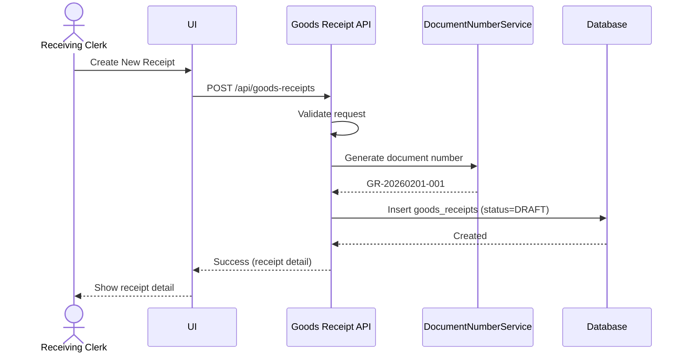
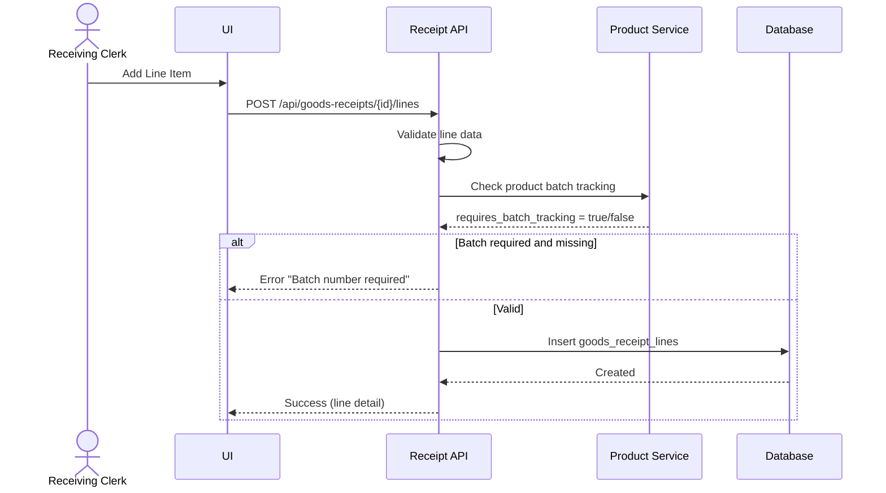
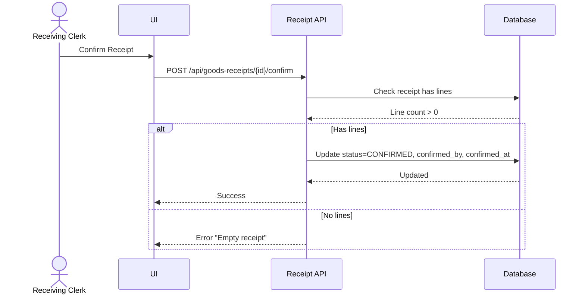
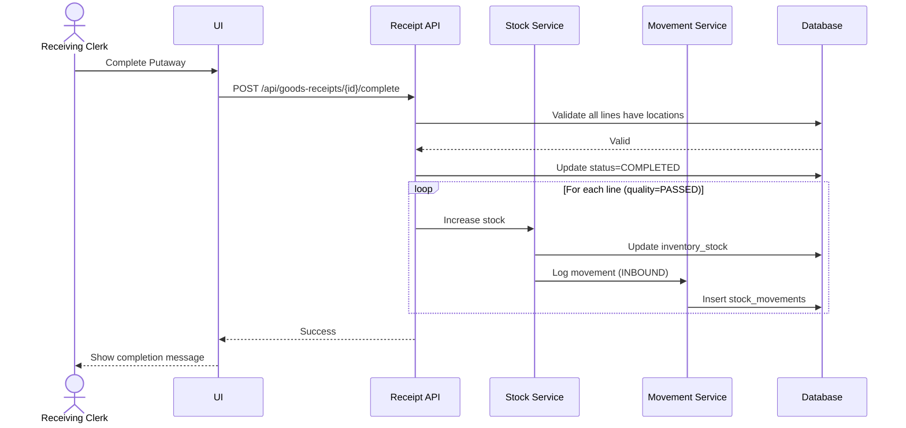
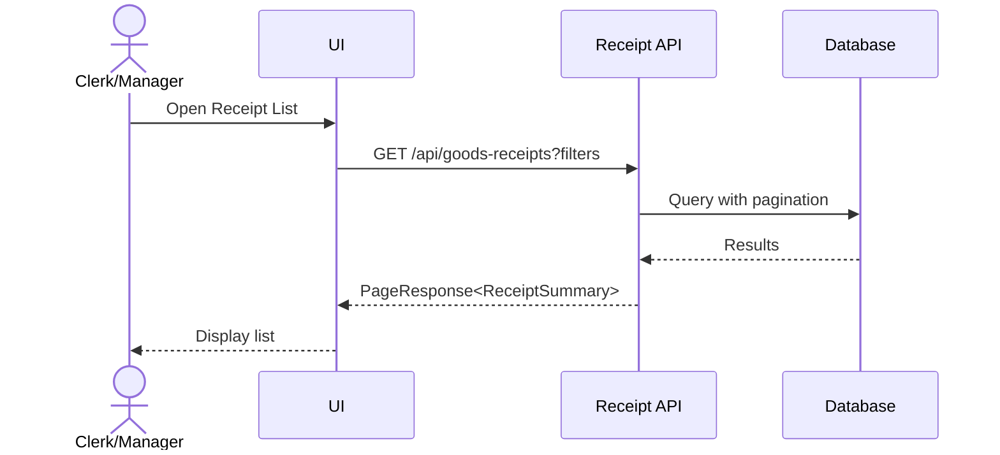

# Feature 1: Inbound Operations (Goods Receipt)
## Business Requirements Specification

---

## Document Information

| Property | Value |
|----------|-------|
| Module | Inventory Operations (Phase 3) |
| Feature | Feature 1: Inbound Operations |
| Version | 1.0 |
| Date | February 01, 2026 |
| Status | Draft |
| Author | Business Analyst |

---

## Step 1 - Clarify Context

### Actors
- Receiving Clerk
- Quality Inspector
- Warehouse Manager
- System Admin

### Goals
- Record incoming goods systematically from purchase orders.
- Perform quality checks and assign batch numbers.
- Update inventory levels in real-time upon completion.
- Maintain full traceability from receipt to storage.

### Triggers
- Goods arrive from supplier based on purchase order.
- Manual receipt creation for returns or transfers.
- Scheduled deliveries from production.

### Pain Points
- Manual receiving takes 30+ minutes per shipment.
- No real-time inventory updates.
- Missing batch/expiry tracking for regulated goods.
- Cannot trace which supplier batch was received.

---

## Step 2 - User Stories

- **US-INV-01**: As a Receiving Clerk, I want to create a goods receipt from a purchase order, so that I can record incoming goods systematically.
- **US-INV-02**: As a Receiving Clerk, I want to scan barcodes to quickly enter received items, so that the receiving process is faster and more accurate.
- **US-INV-03**: As a Quality Inspector, I want to flag items for quality inspection, so that defective goods don't enter inventory.
- **US-INV-04**: As a Receiving Clerk, I want to assign batch numbers and expiry dates during receipt, so that we can track product lifecycles.
- **US-INV-05**: As a Warehouse Manager, I want to see a list of pending receipts, so that I can monitor receiving performance.
- **US-INV-06**: As a Receiving Clerk, I want to assign specific storage locations during putaway, so that items are easy to find later.
- **US-INV-07**: As an Inventory Controller, I want to handle partial receipts, so that we can process partial deliveries from suppliers.

---

## Step 3 - Use Case Specifications

### UC-INV-01 - Create Goods Receipt

**Brief Description**: Create a new goods receipt document to record incoming goods.

**Primary Actor**: Receiving Clerk

**Pre-conditions**:
- User has `INVENTORY:GOODS_RECEIPT:CREATE` permission.
- Target warehouse exists and status is ACTIVE.
- Supplier (business partner) exists if provided.

**Post-conditions**:
- Goods receipt created with DRAFT status.
- Document number auto-generated (GR-YYYYMMDD-XXX).
- Audit fields recorded.

**Main Flow**:
1. User opens Goods Receipt module.
2. User clicks "Create New Receipt".
3. System displays receipt creation form.
4. User enters header data:
   - warehouse_id (required, must be ACTIVE)
   - supplier_id (optional, must exist)
   - receipt_date (required, default today)
   - purchase_order_reference (optional, max 100)
   - notes (optional)
5. User clicks Save.
6. System validates fields.
7. System generates unique document number (GR-YYYYMMDD-XXX).
8. System creates receipt with status DRAFT.
9. System logs audit data (created_by, created_at).
10. System returns success with receipt detail.

**Alternative Flows**:
- A1: Warehouse is INACTIVE
  - System returns error "Warehouse is not active".
- A2: Supplier not found
  - System returns error "Supplier not found".

**Exception Flows**:
- E1: Database error
  - System rolls back transaction and returns generic error.

**Rules & Constraints**:
- Document number format: GR-YYYYMMDD-XXX (auto-generated, unique).
- Receipt date cannot be in future.
- Warehouse must be ACTIVE.
- Only DRAFT receipts can be edited or deleted.

**Mermaid Diagram**:


---

### UC-INV-02 - Add Receipt Lines

**Brief Description**: Add product lines to a draft goods receipt.

**Primary Actor**: Receiving Clerk

**Pre-conditions**:
- Goods receipt exists with status DRAFT.
- User has `INVENTORY:GOODS_RECEIPT:CREATE` permission.
- Product exists and status is ACTIVE.

**Post-conditions**:
- Receipt lines added to receipt.
- Line numbers assigned sequentially.

**Main Flow**:
1. User opens goods receipt in DRAFT status.
2. User clicks "Add Items".
3. System displays line creation form.
4. User enters line data:
   - product_id (required, must exist and ACTIVE)
   - expected_quantity (optional, >= 0, from PO)
   - received_quantity (required, > 0)
   - uom_id (required, must exist)
   - batch_number (optional if product.requires_batch_tracking = false, required otherwise)
   - manufacturing_date (optional)
   - expiry_date (optional)
   - quality_status (default: PASSED, options: PENDING, PASSED, FAILED, QUARANTINE)
   - notes (optional)
5. User clicks Save.
6. System validates line data.
7. System checks product batch tracking requirement.
8. System assigns line_number (sequential).
9. System creates receipt line.
10. System logs audit data.
11. System returns success and refreshes line list.

**Alternative Flows**:
- A1: Product requires batch tracking but no batch provided
  - System returns error "Batch number required for this product".
- A2: Received quantity > expected quantity
  - System shows warning but allows (supplier may send more).
- A3: Quality status = FAILED
  - System marks line but does not increase inventory later.

**Exception Flows**:
- E1: Receipt status is not DRAFT
  - System returns error "Cannot modify non-draft receipt".

**Rules & Constraints**:
- Line number is auto-assigned and sequential within receipt.
- Batch number required if product.requires_batch_tracking = true.
- Expiry date must be after manufacturing date if both provided.
- Quality status FAILED or QUARANTINE items do not count as available stock.

**Mermaid Diagram**:


---

### UC-INV-03 - Confirm Goods Receipt

**Brief Description**: Confirm receipt to lock document and prepare for putaway.

**Primary Actor**: Receiving Clerk or Warehouse Manager

**Pre-conditions**:
- Goods receipt exists with status DRAFT.
- At least one receipt line exists.
- User has `INVENTORY:GOODS_RECEIPT:CONFIRM` permission.

**Post-conditions**:
- Receipt status changed to CONFIRMED.
- Document locked (no more edits to header/lines).
- Ready for location assignment.

**Main Flow**:
1. User opens goods receipt detail (DRAFT status).
2. User clicks "Confirm Receipt".
3. System validates receipt has lines.
4. System updates status to CONFIRMED.
5. System records confirmed_by and confirmed_at.
6. System logs audit data.
7. System returns success.

**Alternative Flows**:
- A1: Receipt has no lines
  - System returns error "Cannot confirm empty receipt".

**Exception Flows**:
- E1: Invalid status transition
  - System returns error "Receipt already confirmed".

**Rules & Constraints**:
- Status transition: DRAFT → CONFIRMED only.
- Receipt must have at least one line with received_quantity > 0.
- After confirmation, header and lines are read-only.

**Mermaid Diagram**:


---

### UC-INV-04 - Assign Locations and Complete Receipt

**Brief Description**: Assign storage locations to received items and complete putaway.

**Primary Actor**: Receiving Clerk

**Pre-conditions**:
- Goods receipt exists with status CONFIRMED.
- All lines have quality_status = PASSED.
- Locations exist and status is ACTIVE.
- User has `INVENTORY:GOODS_RECEIPT:CONFIRM` permission.

**Post-conditions**:
- Receipt status changed to COMPLETED.
- Inventory stock increased for each line.
- Stock movement audit records created.
- Locations assigned to all lines.

**Main Flow**:
1. User opens goods receipt in CONFIRMED status.
2. User clicks "Assign Locations".
3. System displays putaway screen with lines.
4. For each line, user assigns location_id.
5. User clicks "Complete Putaway".
6. System validates all lines have locations.
7. System validates locations are ACTIVE and have capacity.
8. System updates status to COMPLETED.
9. For each line, system increases inventory stock.
10. System creates stock movement records (INBOUND).
11. System records completed_by and completed_at.
12. System logs audit data.
13. System returns success.

**Alternative Flows**:
- A1: Some lines missing locations
  - System returns error "All lines must have assigned locations".
- A2: Location is FULL or INACTIVE
  - System returns error "Invalid location".
- A3: Quality status = FAILED or QUARANTINE
  - System skips stock increase for those lines.

**Exception Flows**:
- E1: Concurrent completion attempt
  - System uses optimistic locking (version field) to prevent.

**Rules & Constraints**:
- Status transition: CONFIRMED → COMPLETED only.
- All lines must have location_id assigned.
- Locations must be ACTIVE and not FULL.
- Stock increased only for lines with quality_status = PASSED.
- Stock movement logged for each line.

**Mermaid Diagram**:


---

### UC-INV-05 - List and Filter Goods Receipts

**Brief Description**: Search and filter goods receipts with pagination.

**Primary Actor**: Receiving Clerk, Warehouse Manager

**Pre-conditions**:
- User has `INVENTORY:GOODS_RECEIPT:VIEW` permission.

**Post-conditions**:
- User sees paginated list of receipts.

**Main Flow**:
1. User opens Goods Receipt list.
2. User applies filters (warehouse, status, date range, supplier).
3. System queries matching receipts.
4. System returns paginated results with summary data.
5. User can click to view detail.

**Mermaid Diagram**:


---

## Step 4 - Acceptance Criteria

**AC-INV-GR-01 - Create Receipt**
```gherkin
Given I am a Receiving Clerk
When I create a goods receipt for warehouse W1
Then the receipt is created with status DRAFT
And document number follows format GR-YYYYMMDD-XXX
And created_by is set to my user ID
```

**AC-INV-GR-02 - Batch Tracking Required**
```gherkin
Given product P1 requires batch tracking
When I add P1 to receipt without batch number
Then the system returns error "Batch number required"
```

**AC-INV-GR-03 - Confirm Empty Receipt**
```gherkin
Given a goods receipt has no lines
When I try to confirm it
Then the system returns error "Cannot confirm empty receipt"
```

**AC-INV-GR-04 - Stock Increase on Completion**
```gherkin
Given a receipt is CONFIRMED with 10 units of product P1
When I complete the receipt with location L1
Then inventory stock increases by 10 at location L1
And stock movement record is created with type INBOUND
```

**AC-INV-GR-05 - Failed Quality Items**
```gherkin
Given a receipt line has quality_status = FAILED
When I complete the receipt
Then stock is NOT increased for that line
And stock movement is NOT created
```

---

## Step 5 - Backend Impact Analysis

### Entities

#### GoodsReceipt.java
```java
@Entity
@Table(name = "goods_receipts")
public class GoodsReceipt extends BaseEntity {
    @Column(name = "receipt_number", unique = true, nullable = false, length = 50)
    private String receiptNumber;
    
    @Column(name = "warehouse_id", nullable = false)
    private Long warehouseId;
    
    @Column(name = "supplier_id")
    private Long supplierId;
    
    @Column(name = "purchase_order_reference", length = 100)
    private String purchaseOrderReference;
    
    @Column(name = "receipt_date", nullable = false)
    private LocalDate receiptDate;
    
    @Enumerated(EnumType.STRING)
    @Column(name = "status", nullable = false, length = 20)
    private GoodsReceiptStatus status;
    
    @Column(name = "notes", columnDefinition = "TEXT")
    private String notes;
    
    @Column(name = "received_by", nullable = false)
    private Long receivedBy;
    
    @Column(name = "confirmed_by")
    private Long confirmedBy;
    
    @Column(name = "confirmed_at")
    private LocalDateTime confirmedAt;
    
    @Column(name = "completed_by")
    private Long completedBy;
    
    @Column(name = "completed_at")
    private LocalDateTime completedAt;
    
    @OneToMany(mappedBy = "goodsReceipt", cascade = CascadeType.ALL, orphanRemoval = true)
    private List<GoodsReceiptLine> lines = new ArrayList<>();
}
```

#### GoodsReceiptLine.java
```java
@Entity
@Table(name = "goods_receipt_lines")
public class GoodsReceiptLine extends BaseEntity {
    @ManyToOne(fetch = FetchType.LAZY)
    @JoinColumn(name = "goods_receipt_id", nullable = false)
    private GoodsReceipt goodsReceipt;
    
    @Column(name = "line_number", nullable = false)
    private Integer lineNumber;
    
    @Column(name = "product_id", nullable = false)
    private Long productId;
    
    @Column(name = "expected_quantity", precision = 15, scale = 3)
    private BigDecimal expectedQuantity;
    
    @Column(name = "received_quantity", nullable = false, precision = 15, scale = 3)
    private BigDecimal receivedQuantity;
    
    @Column(name = "uom_id", nullable = false)
    private Long uomId;
    
    @Column(name = "batch_number", length = 50)
    private String batchNumber;
    
    @Column(name = "manufacturing_date")
    private LocalDate manufacturingDate;
    
    @Column(name = "expiry_date")
    private LocalDate expiryDate;
    
    @Column(name = "location_id")
    private Long locationId;
    
    @Enumerated(EnumType.STRING)
    @Column(name = "quality_status", nullable = false, length = 20)
    private QualityStatus qualityStatus;
    
    @Column(name = "notes", columnDefinition = "TEXT")
    private String notes;
}
```

#### Enums
```java
public enum GoodsReceiptStatus {
    DRAFT, CONFIRMED, COMPLETED, CANCELLED
}

public enum QualityStatus {
    PENDING, PASSED, FAILED, QUARANTINE
}
```

---

### Repositories

#### GoodsReceiptRepository.java
```java
public interface GoodsReceiptRepository extends JpaRepository<GoodsReceipt, Long> {
    
    Optional<GoodsReceipt> findByReceiptNumber(String receiptNumber);
    
    boolean existsByReceiptNumber(String receiptNumber);
    
    @Query("SELECT gr FROM GoodsReceipt gr WHERE " +
           "(:warehouseId IS NULL OR gr.warehouseId = :warehouseId) AND " +
           "(:status IS NULL OR gr.status = :status) AND " +
           "(:supplierId IS NULL OR gr.supplierId = :supplierId) AND " +
           "(:fromDate IS NULL OR gr.receiptDate >= :fromDate) AND " +
           "(:toDate IS NULL OR gr.receiptDate <= :toDate)")
    Page<GoodsReceipt> findAllWithFilters(
        @Param("warehouseId") Long warehouseId,
        @Param("status") GoodsReceiptStatus status,
        @Param("supplierId") Long supplierId,
        @Param("fromDate") LocalDate fromDate,
        @Param("toDate") LocalDate toDate,
        Pageable pageable
    );
    
    @Query("SELECT COUNT(gr) FROM GoodsReceipt gr WHERE gr.warehouseId = :warehouseId AND gr.status = :status")
    long countByWarehouseIdAndStatus(@Param("warehouseId") Long warehouseId, @Param("status") GoodsReceiptStatus status);
    
    @Query("SELECT gr FROM GoodsReceipt gr JOIN FETCH gr.lines WHERE gr.id = :id")
    Optional<GoodsReceipt> findByIdWithLines(@Param("id") Long id);
}
```

#### GoodsReceiptLineRepository.java
```java
public interface GoodsReceiptLineRepository extends JpaRepository<GoodsReceiptLine, Long> {
    
    List<GoodsReceiptLine> findByGoodsReceiptIdOrderByLineNumber(Long goodsReceiptId);
    
    @Query("SELECT MAX(grl.lineNumber) FROM GoodsReceiptLine grl WHERE grl.goodsReceipt.id = :receiptId")
    Optional<Integer> findMaxLineNumber(@Param("receiptId") Long receiptId);
    
    @Query("SELECT grl FROM GoodsReceiptLine grl WHERE grl.productId = :productId AND grl.batchNumber = :batchNumber")
    List<GoodsReceiptLine> findByProductIdAndBatchNumber(@Param("productId") Long productId, @Param("batchNumber") String batchNumber);
    
    long countByGoodsReceiptId(Long goodsReceiptId);
}
```

---

### Services

#### GoodsReceiptService.java
```java
public interface GoodsReceiptService {
    
    /**
     * Create a new goods receipt in DRAFT status
     */
    GoodsReceiptDetailResponse createGoodsReceipt(CreateGoodsReceiptRequest request);
    
    /**
     * Update draft goods receipt header
     */
    GoodsReceiptDetailResponse updateGoodsReceipt(Long id, UpdateGoodsReceiptRequest request);
    
    /**
     * Delete draft goods receipt
     */
    void deleteGoodsReceipt(Long id);
    
    /**
     * Get goods receipt detail by ID
     */
    GoodsReceiptDetailResponse getGoodsReceiptById(Long id);
    
    /**
     * Get goods receipt detail by document number
     */
    GoodsReceiptDetailResponse getGoodsReceiptByNumber(String receiptNumber);
    
    /**
     * List goods receipts with filters and pagination
     */
    PageResponse<GoodsReceiptSummaryResponse> listGoodsReceipts(
        Long warehouseId, 
        GoodsReceiptStatus status, 
        Long supplierId,
        LocalDate fromDate, 
        LocalDate toDate,
        Pageable pageable
    );
    
    /**
     * Add line to draft goods receipt
     */
    GoodsReceiptLineResponse addReceiptLine(Long receiptId, AddGoodsReceiptLineRequest request);
    
    /**
     * Update line in draft goods receipt
     */
    GoodsReceiptLineResponse updateReceiptLine(Long receiptId, Long lineId, UpdateGoodsReceiptLineRequest request);
    
    /**
     * Delete line from draft goods receipt
     */
    void deleteReceiptLine(Long receiptId, Long lineId);
    
    /**
     * Get all lines for a receipt
     */
    List<GoodsReceiptLineResponse> getReceiptLines(Long receiptId);
    
    /**
     * Confirm goods receipt (DRAFT → CONFIRMED)
     */
    GoodsReceiptDetailResponse confirmGoodsReceipt(Long id, ConfirmGoodsReceiptRequest request);
    
    /**
     * Complete goods receipt with location assignment (CONFIRMED → COMPLETED)
     * This increases inventory stock
     */
    GoodsReceiptDetailResponse completeGoodsReceipt(Long id, CompleteGoodsReceiptRequest request);
    
    /**
     * Cancel goods receipt
     */
    GoodsReceiptDetailResponse cancelGoodsReceipt(Long id);
}
```

---

### DTOs

#### Request DTOs

**CreateGoodsReceiptRequest.java**
```java
public class CreateGoodsReceiptRequest {
    @NotNull(message = "Warehouse ID is required")
    private Long warehouseId;
    
    private Long supplierId;
    
    @NotNull(message = "Receipt date is required")
    @PastOrPresent(message = "Receipt date cannot be in future")
    private LocalDate receiptDate;
    
    @Size(max = 100, message = "PO reference max 100 characters")
    private String purchaseOrderReference;
    
    private String notes;
}
```

**AddGoodsReceiptLineRequest.java**
```java
public class AddGoodsReceiptLineRequest {
    @NotNull(message = "Product ID is required")
    private Long productId;
    
    @DecimalMin(value = "0.0", inclusive = false, message = "Received quantity must be > 0")
    @NotNull(message = "Received quantity is required")
    private BigDecimal receivedQuantity;
    
    @DecimalMin(value = "0.0", inclusive = true, message = "Expected quantity must be >= 0")
    private BigDecimal expectedQuantity;
    
    @NotNull(message = "UOM is required")
    private Long uomId;
    
    @Size(max = 50, message = "Batch number max 50 characters")
    private String batchNumber;
    
    @PastOrPresent(message = "Manufacturing date cannot be in future")
    private LocalDate manufacturingDate;
    
    @Future(message = "Expiry date must be in future")
    private LocalDate expiryDate;
    
    private QualityStatus qualityStatus = QualityStatus.PASSED;
    
    private String notes;
}
```

**CompleteGoodsReceiptRequest.java**
```java
public class CompleteGoodsReceiptRequest {
    @NotEmpty(message = "Location assignments are required")
    private List<LocationAssignment> locationAssignments;
    
    @Data
    public static class LocationAssignment {
        @NotNull(message = "Line ID is required")
        private Long lineId;
        
        @NotNull(message = "Location ID is required")
        private Long locationId;
    }
}
```

#### Response DTOs

**GoodsReceiptSummaryResponse.java**
```java
public class GoodsReceiptSummaryResponse {
    private Long id;
    private String receiptNumber;
    private Long warehouseId;
    private String warehouseName;
    private Long supplierId;
    private String supplierName;
    private LocalDate receiptDate;
    private GoodsReceiptStatus status;
    private Integer totalLines;
    private LocalDateTime createdAt;
    private String createdByName;
}
```

**GoodsReceiptDetailResponse.java**
```java
public class GoodsReceiptDetailResponse {
    private Long id;
    private String receiptNumber;
    private Long warehouseId;
    private String warehouseName;
    private Long supplierId;
    private String supplierName;
    private String purchaseOrderReference;
    private LocalDate receiptDate;
    private GoodsReceiptStatus status;
    private String notes;
    
    private Long receivedBy;
    private String receivedByName;
    private Long confirmedBy;
    private String confirmedByName;
    private LocalDateTime confirmedAt;
    private Long completedBy;
    private String completedByName;
    private LocalDateTime completedAt;
    
    private List<GoodsReceiptLineResponse> lines;
    
    private LocalDateTime createdAt;
    private LocalDateTime updatedAt;
}
```

**GoodsReceiptLineResponse.java**
```java
public class GoodsReceiptLineResponse {
    private Long id;
    private Integer lineNumber;
    private Long productId;
    private String productSku;
    private String productName;
    private BigDecimal expectedQuantity;
    private BigDecimal receivedQuantity;
    private Long uomId;
    private String uomCode;
    private String batchNumber;
    private LocalDate manufacturingDate;
    private LocalDate expiryDate;
    private Long locationId;
    private String locationCode;
    private QualityStatus qualityStatus;
    private String notes;
}
```

---

### API Endpoints

| Method | Endpoint | Description | Permission |
|--------|----------|-------------|------------|
| GET | `/api/goods-receipts` | List receipts with filters | `INVENTORY:GOODS_RECEIPT:VIEW` |
| GET | `/api/goods-receipts/{id}` | Get receipt detail | `INVENTORY:GOODS_RECEIPT:VIEW` |
| GET | `/api/goods-receipts/number/{receiptNumber}` | Get by document number | `INVENTORY:GOODS_RECEIPT:VIEW` |
| POST | `/api/goods-receipts` | Create new receipt | `INVENTORY:GOODS_RECEIPT:CREATE` |
| PUT | `/api/goods-receipts/{id}` | Update draft receipt | `INVENTORY:GOODS_RECEIPT:UPDATE` |
| DELETE | `/api/goods-receipts/{id}` | Delete draft receipt | `INVENTORY:GOODS_RECEIPT:DELETE` |
| POST | `/api/goods-receipts/{id}/confirm` | Confirm receipt | `INVENTORY:GOODS_RECEIPT:CONFIRM` |
| POST | `/api/goods-receipts/{id}/complete` | Complete receipt | `INVENTORY:GOODS_RECEIPT:CONFIRM` |
| POST | `/api/goods-receipts/{id}/cancel` | Cancel receipt | `INVENTORY:GOODS_RECEIPT:DELETE` |
| GET | `/api/goods-receipts/{id}/lines` | Get receipt lines | `INVENTORY:GOODS_RECEIPT:VIEW` |
| POST | `/api/goods-receipts/{id}/lines` | Add line | `INVENTORY:GOODS_RECEIPT:CREATE` |
| PUT | `/api/goods-receipts/{id}/lines/{lineId}` | Update line | `INVENTORY:GOODS_RECEIPT:UPDATE` |
| DELETE | `/api/goods-receipts/{id}/lines/{lineId}` | Delete line | `INVENTORY:GOODS_RECEIPT:DELETE` |

---

### Database Migration

**V20260201_01__Create_goods_receipts.sql**
```sql
-- Create goods_receipts table
CREATE TABLE goods_receipts (
    id BIGINT AUTO_INCREMENT PRIMARY KEY,
    receipt_number VARCHAR(50) UNIQUE NOT NULL,
    warehouse_id BIGINT NOT NULL,
    supplier_id BIGINT,
    purchase_order_reference VARCHAR(100),
    receipt_date DATE NOT NULL,
    status VARCHAR(20) NOT NULL,
    notes TEXT,
    received_by BIGINT NOT NULL,
    confirmed_by BIGINT,
    confirmed_at DATETIME,
    completed_by BIGINT,
    completed_at DATETIME,
    created_at DATETIME NOT NULL DEFAULT CURRENT_TIMESTAMP,
    updated_at DATETIME NOT NULL DEFAULT CURRENT_TIMESTAMP ON UPDATE CURRENT_TIMESTAMP,
    created_by BIGINT NOT NULL,
    updated_by BIGINT NOT NULL,
    version BIGINT DEFAULT 0,
    
    CONSTRAINT fk_gr_warehouse FOREIGN KEY (warehouse_id) REFERENCES warehouses(id),
    CONSTRAINT fk_gr_supplier FOREIGN KEY (supplier_id) REFERENCES business_partners(id),
    CONSTRAINT fk_gr_received_by FOREIGN KEY (received_by) REFERENCES accounts(id),
    CONSTRAINT fk_gr_confirmed_by FOREIGN KEY (confirmed_by) REFERENCES accounts(id),
    CONSTRAINT fk_gr_completed_by FOREIGN KEY (completed_by) REFERENCES accounts(id),
    CONSTRAINT fk_gr_created_by FOREIGN KEY (created_by) REFERENCES accounts(id),
    CONSTRAINT fk_gr_updated_by FOREIGN KEY (updated_by) REFERENCES accounts(id),
    
    INDEX idx_receipt_number (receipt_number),
    INDEX idx_warehouse_id (warehouse_id),
    INDEX idx_supplier_id (supplier_id),
    INDEX idx_status (status),
    INDEX idx_receipt_date (receipt_date)
) ENGINE=InnoDB DEFAULT CHARSET=utf8mb4 COLLATE=utf8mb4_unicode_ci;

-- Create goods_receipt_lines table
CREATE TABLE goods_receipt_lines (
    id BIGINT AUTO_INCREMENT PRIMARY KEY,
    goods_receipt_id BIGINT NOT NULL,
    line_number INT NOT NULL,
    product_id BIGINT NOT NULL,
    expected_quantity DECIMAL(15,3),
    received_quantity DECIMAL(15,3) NOT NULL,
    uom_id BIGINT NOT NULL,
    batch_number VARCHAR(50),
    manufacturing_date DATE,
    expiry_date DATE,
    location_id BIGINT,
    quality_status VARCHAR(20) NOT NULL DEFAULT 'PASSED',
    notes TEXT,
    created_at DATETIME NOT NULL DEFAULT CURRENT_TIMESTAMP,
    updated_at DATETIME NOT NULL DEFAULT CURRENT_TIMESTAMP ON UPDATE CURRENT_TIMESTAMP,
    
    CONSTRAINT fk_grl_goods_receipt FOREIGN KEY (goods_receipt_id) REFERENCES goods_receipts(id) ON DELETE CASCADE,
    CONSTRAINT fk_grl_product FOREIGN KEY (product_id) REFERENCES products(id),
    CONSTRAINT fk_grl_uom FOREIGN KEY (uom_id) REFERENCES uoms(id),
    CONSTRAINT fk_grl_location FOREIGN KEY (location_id) REFERENCES locations(id),
    CONSTRAINT uk_grl_line_number UNIQUE (goods_receipt_id, line_number),
    CONSTRAINT chk_grl_quantities CHECK (received_quantity >= 0 AND (expected_quantity IS NULL OR expected_quantity >= 0)),
    CONSTRAINT chk_grl_dates CHECK (expiry_date IS NULL OR manufacturing_date IS NULL OR expiry_date > manufacturing_date),
    
    INDEX idx_goods_receipt_id (goods_receipt_id),
    INDEX idx_product_id (product_id),
    INDEX idx_batch_number (batch_number),
    INDEX idx_location_id (location_id)
) ENGINE=InnoDB DEFAULT CHARSET=utf8mb4 COLLATE=utf8mb4_unicode_ci;
```

---

## Implementation Checklist

### Sprint 3.1 - Inbound Operations Foundation

#### Backend Tasks
- [ ] Create `GoodsReceipt` entity with status enum
- [ ] Create `GoodsReceiptLine` entity with quality status enum
- [ ] Create `GoodsReceiptRepository` with custom queries
- [ ] Create `GoodsReceiptLineRepository`
- [ ] Create all Request DTOs with validation
- [ ] Create all Response DTOs
- [ ] Create `GoodsReceiptMapper` for entity-DTO conversion
- [ ] Create `GoodsReceiptService` interface
- [ ] Implement `GoodsReceiptServiceImpl` with business logic
- [ ] Create `GoodsReceiptController` with all endpoints
- [ ] Create custom exceptions (InvalidStatusTransitionException, etc.)
- [ ] Integrate with `DocumentNumberService` for receipt number generation
- [ ] Integrate with `StockService` for inventory updates
- [ ] Integrate with `StockMovementService` for audit trail

#### Database Tasks
- [ ] Create Flyway migration for goods_receipts table
- [ ] Create Flyway migration for goods_receipt_lines table
- [ ] Add indexes for performance
- [ ] Add foreign key constraints
- [ ] Add check constraints for data integrity

#### Testing Tasks
- [ ] Unit tests for service layer (80%+ coverage)
- [ ] Integration tests for API endpoints
- [ ] Test status transitions (DRAFT → CONFIRMED → COMPLETED)
- [ ] Test validation rules (batch tracking, dates, quantities)
- [ ] Test stock increase on completion
- [ ] Test concurrent completion prevention
- [ ] Test permission checks

#### Documentation Tasks
- [ ] Update OpenAPI/Swagger documentation
- [ ] Create Postman collection with examples
- [ ] Document business rules in code comments
- [ ] Add Javadoc for public methods

---

## BA Review Checklist

- [x] Actors identified
- [x] Preconditions defined
- [x] Business rules documented
- [x] Validation rules explicit
- [x] Success + alternative + exception flows present
- [x] API and data impacts defined
- [x] Acceptance criteria cover normal and edge cases
- [x] Entities and repositories specified
- [x] Service interface defined
- [x] DTOs detailed
- [x] Database migration included
- [x] Sequence diagrams provided

---

**Document Version**: 1.0  
**Last Updated**: February 01, 2026  
**Status**: ✅ Ready for Implementation
