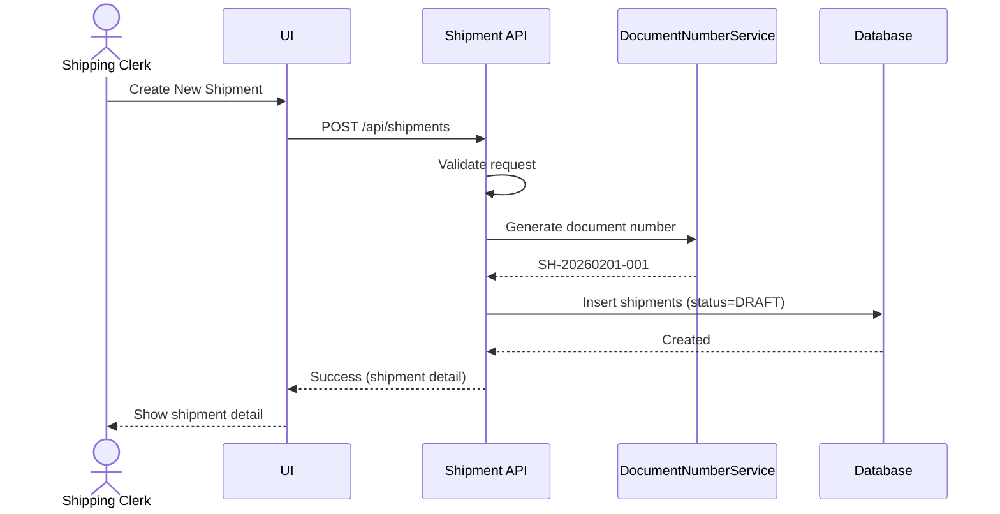
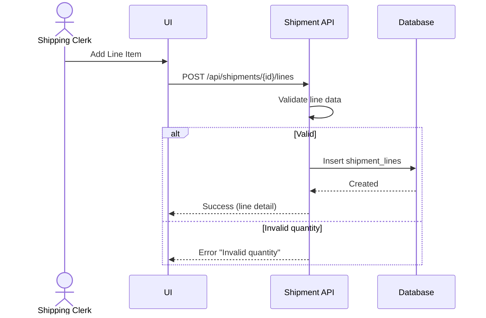
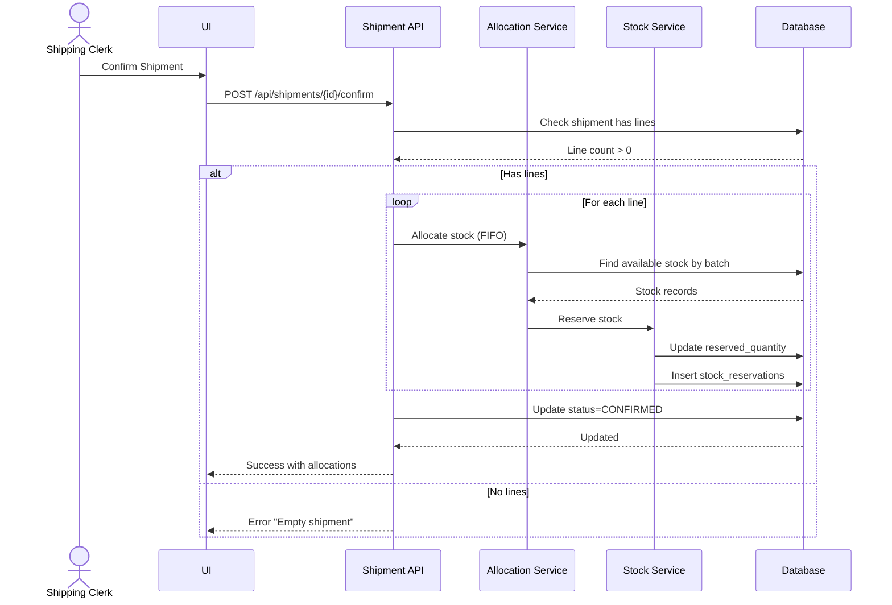
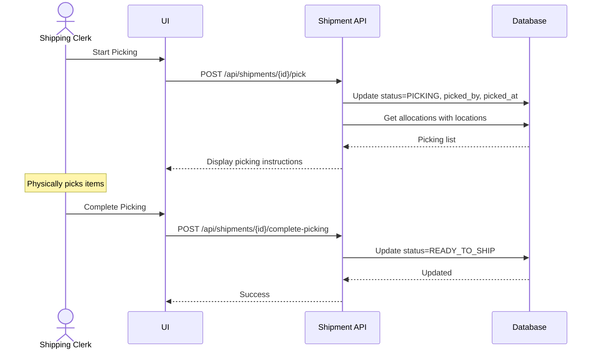
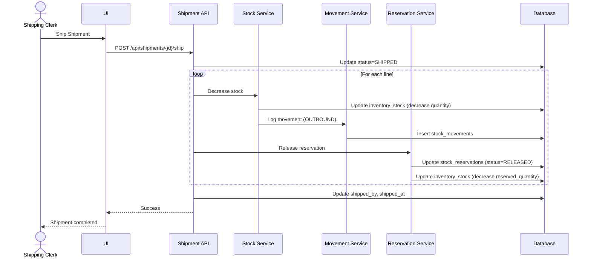
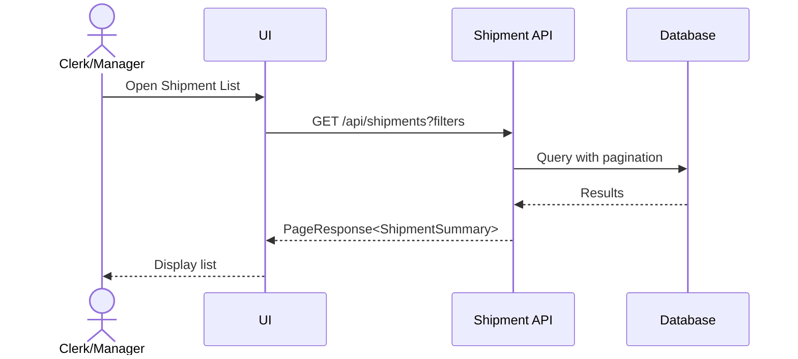

# Feature 2: Outbound Operations (Shipment)
## Business Requirements Specification

---

## Document Information

| Property | Value |
|----------|-------|
| Module | Inventory Operations (Phase 3) |
| Feature | Feature 2: Outbound Operations |
| Version | 1.0 |
| Date | February 01, 2026 |
| Status | Draft |
| Author | Business Analyst |

---

## Step 1 - Clarify Context

### Actors
- Shipping Clerk
- Warehouse Manager
- Inventory Controller
- System Admin

### Goals
- Fulfill customer orders efficiently with accurate picking.
- Reserve stock for confirmed orders to prevent overselling.
- Update inventory levels in real-time upon shipment.
- Track which batch was shipped to which customer for traceability.

### Triggers
- Sales order is created and confirmed.
- Customer requests immediate shipment.
- Scheduled daily shipments.

### Pain Points
- Manual picking takes too long and prone to errors.
- No stock reservation causing overselling.
- Cannot track which items were shipped to which customer.
- Inventory not updated until end of day.

---

## Step 2 - User Stories

- **US-OUT-01**: As a Shipping Clerk, I want to create a shipment from a sales order, so that I can fulfill customer orders.
- **US-OUT-02**: As a Shipping Clerk, I want to see picking instructions with item locations, so that I can find items quickly.
- **US-OUT-03**: As a Shipping Clerk, I want to scan items during picking to verify accuracy, so that we ship the correct products.
- **US-OUT-04**: As a Warehouse Manager, I want the system to allocate stock automatically based on FIFO, so that older stock is shipped first.
- **US-OUT-05**: As a Shipping Clerk, I want to print packing slips and shipping labels, so that shipments are properly documented.
- **US-OUT-06**: As an Inventory Controller, I want to handle partial shipments, so that we can fulfill orders in multiple deliveries.
- **US-OUT-07**: As a Warehouse Manager, I want to reserve stock for confirmed orders, so that we don't oversell.

---

## Step 3 - Use Case Specifications

### UC-OUT-01 - Create Shipment

**Brief Description**: Create a new shipment document for outbound goods.

**Primary Actor**: Shipping Clerk

**Pre-conditions**:
- User has `INVENTORY:SHIPMENT:CREATE` permission.
- Target warehouse exists and status is ACTIVE.
- Customer (business partner) exists.

**Post-conditions**:
- Shipment created with DRAFT status.
- Document number auto-generated (SH-YYYYMMDD-XXX).
- Audit fields recorded.

**Main Flow**:
1. User opens Shipment module.
2. User clicks "Create New Shipment".
3. System displays shipment creation form.
4. User enters header data:
   - warehouse_id (required, must be ACTIVE)
   - customer_id (required, must exist)
   - shipment_date (required, default today)
   - sales_order_reference (optional, max 100)
   - shipping_address (optional)
   - carrier (optional, max 100)
   - tracking_number (optional, max 100)
   - notes (optional)
5. User clicks Save.
6. System validates fields.
7. System generates unique document number (SH-YYYYMMDD-XXX).
8. System creates shipment with status DRAFT.
9. System logs audit data (created_by, created_at).
10. System returns success with shipment detail.

**Alternative Flows**:
- A1: Warehouse is INACTIVE
  - System returns error "Warehouse is not active".
- A2: Customer not found
  - System returns error "Customer not found".

**Exception Flows**:
- E1: Database error
  - System rolls back transaction and returns generic error.

**Rules & Constraints**:
- Document number format: SH-YYYYMMDD-XXX (auto-generated, unique).
- Shipment date cannot be in past (can be today or future).
- Warehouse must be ACTIVE.
- Only DRAFT shipments can be edited or deleted.

**Mermaid Diagram**:


---

### UC-OUT-02 - Add Shipment Lines

**Brief Description**: Add product lines to a draft shipment.

**Primary Actor**: Shipping Clerk

**Pre-conditions**:
- Shipment exists with status DRAFT.
- User has `INVENTORY:SHIPMENT:CREATE` permission.
- Product exists and status is ACTIVE.

**Post-conditions**:
- Shipment lines added to shipment.
- Line numbers assigned sequentially.

**Main Flow**:
1. User opens shipment in DRAFT status.
2. User clicks "Add Items".
3. System displays line creation form.
4. User enters line data:
   - product_id (required, must exist and ACTIVE)
   - ordered_quantity (required, > 0)
   - shipped_quantity (default = ordered_quantity, must be > 0 and <= ordered_quantity)
   - uom_id (required, must exist)
   - batch_number (optional, will be assigned during allocation)
   - notes (optional)
5. User clicks Save.
6. System validates line data.
7. System assigns line_number (sequential).
8. System creates shipment line.
9. System logs audit data.
10. System returns success and refreshes line list.

**Alternative Flows**:
- A1: Shipped quantity > ordered quantity
  - System returns error "Shipped quantity cannot exceed ordered quantity".

**Exception Flows**:
- E1: Shipment status is not DRAFT
  - System returns error "Cannot modify non-draft shipment".

**Rules & Constraints**:
- Line number is auto-assigned and sequential within shipment.
- Shipped quantity must be > 0 and <= ordered_quantity.
- Batch number and location assigned during allocation/picking.

**Mermaid Diagram**:


---

### UC-OUT-03 - Confirm Shipment and Reserve Stock

**Brief Description**: Confirm shipment to lock document and reserve inventory.

**Primary Actor**: Shipping Clerk or Warehouse Manager

**Pre-conditions**:
- Shipment exists with status DRAFT.
- At least one shipment line exists.
- Sufficient available stock for all lines.
- User has `INVENTORY:SHIPMENT:CONFIRM` permission.

**Post-conditions**:
- Shipment status changed to CONFIRMED.
- Stock reserved for each line (FIFO allocation).
- Stock reservation records created.
- Document locked (no more edits to header/lines).

**Main Flow**:
1. User opens shipment detail (DRAFT status).
2. User clicks "Confirm Shipment".
3. System validates shipment has lines.
4. System checks available stock for each line.
5. System allocates stock using FIFO strategy (by batch manufacturing date).
6. System creates stock reservation records.
7. System updates inventory_stock.reserved_quantity.
8. System updates shipment status to CONFIRMED.
9. System records confirmed_by and confirmed_at.
10. System logs audit data.
11. System returns success with allocation details.

**Alternative Flows**:
- A1: Insufficient stock for any line
  - System returns error "Insufficient stock for product X".
- A2: Shipment has no lines
  - System returns error "Cannot confirm empty shipment".

**Exception Flows**:
- E1: Concurrent stock reservation
  - System uses database locking to prevent overselling.

**Rules & Constraints**:
- Status transition: DRAFT → CONFIRMED only.
- Shipment must have at least one line with shipped_quantity > 0.
- Stock allocation uses FIFO (First-In-First-Out) by batch manufacturing date.
- Available stock = quantity_on_hand - reserved_quantity.
- After confirmation, header and lines are read-only.

**Mermaid Diagram**:


---

### UC-OUT-04 - Pick Items for Shipment

**Brief Description**: Generate picking list and mark shipment as picking in progress.

**Primary Actor**: Shipping Clerk

**Pre-conditions**:
- Shipment exists with status CONFIRMED.
- Stock is reserved.
- User has `INVENTORY:SHIPMENT:CONFIRM` permission.

**Post-conditions**:
- Shipment status changed to PICKING.
- Picking list generated with locations.

**Main Flow**:
1. User opens shipment in CONFIRMED status.
2. User clicks "Start Picking".
3. System updates status to PICKING.
4. System generates picking list with:
   - Product details
   - Allocated batch and location
   - Quantity to pick
5. System displays picking instructions.
6. System records picked_by and picked_at.
7. User physically picks items.
8. User scans items to verify.
9. User clicks "Complete Picking".
10. System validates all items picked.
11. System updates status to READY_TO_SHIP.
12. System returns success.

**Alternative Flows**:
- A1: User picks partial quantity
  - System allows and adjusts shipped_quantity.

**Exception Flows**:
- E1: Item not found at location
  - User reports discrepancy; system flags for investigation.

**Rules & Constraints**:
- Status transition: CONFIRMED → PICKING → READY_TO_SHIP.
- Picking list sorted by location for efficiency.
- Scanned items must match allocated batch.

**Mermaid Diagram**:


---

### UC-OUT-05 - Ship Shipment and Decrease Stock

**Brief Description**: Mark shipment as shipped and decrease inventory.

**Primary Actor**: Shipping Clerk

**Pre-conditions**:
- Shipment exists with status READY_TO_SHIP.
- All items picked and packed.
- User has `INVENTORY:SHIPMENT:SHIP` permission.

**Post-conditions**:
- Shipment status changed to SHIPPED.
- Inventory stock decreased for each line.
- Stock reservations released.
- Stock movement audit records created.

**Main Flow**:
1. User opens shipment in READY_TO_SHIP status.
2. User enters tracking information (optional).
3. User clicks "Ship".
4. System validates shipment ready.
5. System updates status to SHIPPED.
6. For each line, system:
   - Decreases inventory stock at allocated location.
   - Releases stock reservation.
   - Creates stock movement record (OUTBOUND).
7. System records shipped_by and shipped_at.
8. System logs audit data.
9. System sends notification to customer (if enabled).
10. System returns success.

**Alternative Flows**:
- A1: Partial shipment
  - System ships available quantity; remaining stays in order.

**Exception Flows**:
- E1: Stock already shipped (concurrent operation)
  - System uses optimistic locking to prevent.

**Rules & Constraints**:
- Status transition: READY_TO_SHIP → SHIPPED only.
- Stock decreased only when status = SHIPPED.
- Stock movement logged for each line.
- Reservations released after stock decrease.

**Mermaid Diagram**:


---

### UC-OUT-06 - List and Filter Shipments

**Brief Description**: Search and filter shipments with pagination.

**Primary Actor**: Shipping Clerk, Warehouse Manager

**Pre-conditions**:
- User has `INVENTORY:SHIPMENT:VIEW` permission.

**Post-conditions**:
- User sees paginated list of shipments.

**Main Flow**:
1. User opens Shipment list.
2. User applies filters (warehouse, status, date range, customer).
3. System queries matching shipments.
4. System returns paginated results with summary data.
5. User can click to view detail.

**Mermaid Diagram**:


---

## Step 4 - Acceptance Criteria

**AC-OUT-SH-01 - Create Shipment**
```gherkin
Given I am a Shipping Clerk
When I create a shipment for customer C1 from warehouse W1
Then the shipment is created with status DRAFT
And document number follows format SH-YYYYMMDD-XXX
And created_by is set to my user ID
```

**AC-OUT-SH-02 - Stock Reservation**
```gherkin
Given a shipment has 10 units of product P1
When I confirm the shipment
Then 10 units are reserved in inventory_stock
And available_quantity decreases by 10
And stock_reservations record is created
```

**AC-OUT-SH-03 - Insufficient Stock**
```gherkin
Given product P1 has only 5 units available
When I try to confirm shipment with 10 units of P1
Then the system returns error "Insufficient stock"
And shipment status remains DRAFT
```

**AC-OUT-SH-04 - FIFO Allocation**
```gherkin
Given product P1 has batches:
  - Batch A (mfg date: 2026-01-01, qty: 10)
  - Batch B (mfg date: 2026-01-15, qty: 20)
When I confirm shipment for 15 units of P1
Then Batch A is allocated first (10 units)
And Batch B is allocated second (5 units)
```

**AC-OUT-SH-05 - Stock Decrease on Ship**
```gherkin
Given a shipment is READY_TO_SHIP with 10 units of P1 from location L1
When I ship the shipment
Then inventory stock at L1 decreases by 10
And reserved_quantity decreases by 10
And stock movement record is created with type OUTBOUND
```

---

## Step 5 - Backend Impact Analysis

### Entities

#### Shipment.java
```java
@Entity
@Table(name = "shipments")
public class Shipment extends BaseEntity {
    @Column(name = "shipment_number", unique = true, nullable = false, length = 50)
    private String shipmentNumber;
    
    @Column(name = "warehouse_id", nullable = false)
    private Long warehouseId;
    
    @Column(name = "customer_id", nullable = false)
    private Long customerId;
    
    @Column(name = "sales_order_reference", length = 100)
    private String salesOrderReference;
    
    @Column(name = "shipment_date", nullable = false)
    private LocalDate shipmentDate;
    
    @Enumerated(EnumType.STRING)
    @Column(name = "status", nullable = false, length = 20)
    private ShipmentStatus status;
    
    @Column(name = "shipping_address", columnDefinition = "TEXT")
    private String shippingAddress;
    
    @Column(name = "carrier", length = 100)
    private String carrier;
    
    @Column(name = "tracking_number", length = 100)
    private String trackingNumber;
    
    @Column(name = "notes", columnDefinition = "TEXT")
    private String notes;
    
    @Column(name = "confirmed_by")
    private Long confirmedBy;
    
    @Column(name = "confirmed_at")
    private LocalDateTime confirmedAt;
    
    @Column(name = "picked_by")
    private Long pickedBy;
    
    @Column(name = "picked_at")
    private LocalDateTime pickedAt;
    
    @Column(name = "shipped_by")
    private Long shippedBy;
    
    @Column(name = "shipped_at")
    private LocalDateTime shippedAt;
    
    @OneToMany(mappedBy = "shipment", cascade = CascadeType.ALL, orphanRemoval = true)
    private List<ShipmentLine> lines = new ArrayList<>();
}
```

#### ShipmentLine.java
```java
@Entity
@Table(name = "shipment_lines")
public class ShipmentLine extends BaseEntity {
    @ManyToOne(fetch = FetchType.LAZY)
    @JoinColumn(name = "shipment_id", nullable = false)
    private Shipment shipment;
    
    @Column(name = "line_number", nullable = false)
    private Integer lineNumber;
    
    @Column(name = "product_id", nullable = false)
    private Long productId;
    
    @Column(name = "ordered_quantity", nullable = false, precision = 15, scale = 3)
    private BigDecimal orderedQuantity;
    
    @Column(name = "shipped_quantity", nullable = false, precision = 15, scale = 3)
    private BigDecimal shippedQuantity;
    
    @Column(name = "uom_id", nullable = false)
    private Long uomId;
    
    @Column(name = "batch_number", length = 50)
    private String batchNumber;
    
    @Column(name = "location_id")
    private Long locationId;
    
    @Column(name = "notes", columnDefinition = "TEXT")
    private String notes;
}
```

#### StockReservation.java
```java
@Entity
@Table(name = "stock_reservations")
public class StockReservation extends BaseEntity {
    @Column(name = "shipment_id")
    private Long shipmentId;
    
    @Column(name = "product_id", nullable = false)
    private Long productId;
    
    @Column(name = "warehouse_id", nullable = false)
    private Long warehouseId;
    
    @Column(name = "location_id")
    private Long locationId;
    
    @Column(name = "batch_number", length = 50)
    private String batchNumber;
    
    @Column(name = "reserved_quantity", nullable = false, precision = 15, scale = 3)
    private BigDecimal reservedQuantity;
    
    @Column(name = "uom_id", nullable = false)
    private Long uomId;
    
    @Column(name = "reservation_date", nullable = false)
    private LocalDateTime reservationDate;
    
    @Column(name = "expiry_date")
    private LocalDateTime expiryDate;
    
    @Enumerated(EnumType.STRING)
    @Column(name = "status", nullable = false, length = 20)
    private ReservationStatus status;
    
    @Column(name = "released_at")
    private LocalDateTime releasedAt;
}
```

#### Enums
```java
public enum ShipmentStatus {
    DRAFT, CONFIRMED, PICKING, READY_TO_SHIP, SHIPPED, DELIVERED, CANCELLED
}

public enum ReservationStatus {
    ACTIVE, RELEASED, EXPIRED
}
```

---

### Repositories

#### ShipmentRepository.java
```java
public interface ShipmentRepository extends JpaRepository<Shipment, Long> {
    
    Optional<Shipment> findByShipmentNumber(String shipmentNumber);
    
    boolean existsByShipmentNumber(String shipmentNumber);
    
    @Query("SELECT s FROM Shipment s WHERE " +
           "(:warehouseId IS NULL OR s.warehouseId = :warehouseId) AND " +
           "(:status IS NULL OR s.status = :status) AND " +
           "(:customerId IS NULL OR s.customerId = :customerId) AND " +
           "(:fromDate IS NULL OR s.shipmentDate >= :fromDate) AND " +
           "(:toDate IS NULL OR s.shipmentDate <= :toDate)")
    Page<Shipment> findAllWithFilters(
        @Param("warehouseId") Long warehouseId,
        @Param("status") ShipmentStatus status,
        @Param("customerId") Long customerId,
        @Param("fromDate") LocalDate fromDate,
        @Param("toDate") LocalDate toDate,
        Pageable pageable
    );
    
    @Query("SELECT COUNT(s) FROM Shipment s WHERE s.warehouseId = :warehouseId AND s.status = :status")
    long countByWarehouseIdAndStatus(@Param("warehouseId") Long warehouseId, @Param("status") ShipmentStatus status);
    
    @Query("SELECT s FROM Shipment s JOIN FETCH s.lines WHERE s.id = :id")
    Optional<Shipment> findByIdWithLines(@Param("id") Long id);
    
    @Query("SELECT s FROM Shipment s WHERE s.status IN :statuses AND s.shipmentDate < :date")
    List<Shipment> findPendingShipments(@Param("statuses") List<ShipmentStatus> statuses, @Param("date") LocalDate date);
}
```

#### ShipmentLineRepository.java
```java
public interface ShipmentLineRepository extends JpaRepository<ShipmentLine, Long> {
    
    List<ShipmentLine> findByShipmentIdOrderByLineNumber(Long shipmentId);
    
    @Query("SELECT MAX(sl.lineNumber) FROM ShipmentLine sl WHERE sl.shipment.id = :shipmentId")
    Optional<Integer> findMaxLineNumber(@Param("shipmentId") Long shipmentId);
    
    @Query("SELECT sl FROM ShipmentLine sl WHERE sl.productId = :productId AND sl.batchNumber = :batchNumber")
    List<ShipmentLine> findByProductIdAndBatchNumber(@Param("productId") Long productId, @Param("batchNumber") String batchNumber);
    
    long countByShipmentId(Long shipmentId);
}
```

#### StockReservationRepository.java
```java
public interface StockReservationRepository extends JpaRepository<StockReservation, Long> {
    
    List<StockReservation> findByShipmentIdAndStatus(Long shipmentId, ReservationStatus status);
    
    @Query("SELECT sr FROM StockReservation sr WHERE " +
           "sr.productId = :productId AND sr.warehouseId = :warehouseId AND " +
           "sr.status = :status")
    List<StockReservation> findActiveReservations(
        @Param("productId") Long productId,
        @Param("warehouseId") Long warehouseId,
        @Param("status") ReservationStatus status
    );
    
    @Query("SELECT SUM(sr.reservedQuantity) FROM StockReservation sr WHERE " +
           "sr.productId = :productId AND sr.warehouseId = :warehouseId AND " +
           "sr.locationId = :locationId AND sr.status = 'ACTIVE'")
    BigDecimal getTotalReservedQuantity(
        @Param("productId") Long productId,
        @Param("warehouseId") Long warehouseId,
        @Param("locationId") Long locationId
    );
    
    @Query("SELECT sr FROM StockReservation sr WHERE sr.status = 'ACTIVE' AND sr.expiryDate < :now")
    List<StockReservation> findExpiredReservations(@Param("now") LocalDateTime now);
}
```

---

### Services

#### ShipmentService.java
```java
public interface ShipmentService {
    
    /**
     * Create a new shipment in DRAFT status
     */
    ShipmentDetailResponse createShipment(CreateShipmentRequest request);
    
    /**
     * Update draft shipment header
     */
    ShipmentDetailResponse updateShipment(Long id, UpdateShipmentRequest request);
    
    /**
     * Delete draft shipment
     */
    void deleteShipment(Long id);
    
    /**
     * Get shipment detail by ID
     */
    ShipmentDetailResponse getShipmentById(Long id);
    
    /**
     * Get shipment detail by document number
     */
    ShipmentDetailResponse getShipmentByNumber(String shipmentNumber);
    
    /**
     * List shipments with filters and pagination
     */
    PageResponse<ShipmentSummaryResponse> listShipments(
        Long warehouseId,
        ShipmentStatus status,
        Long customerId,
        LocalDate fromDate,
        LocalDate toDate,
        Pageable pageable
    );
    
    /**
     * Add line to draft shipment
     */
    ShipmentLineResponse addShipmentLine(Long shipmentId, AddShipmentLineRequest request);
    
    /**
     * Update line in draft shipment
     */
    ShipmentLineResponse updateShipmentLine(Long shipmentId, Long lineId, UpdateShipmentLineRequest request);
    
    /**
     * Delete line from draft shipment
     */
    void deleteShipmentLine(Long shipmentId, Long lineId);
    
    /**
     * Get all lines for a shipment
     */
    List<ShipmentLineResponse> getShipmentLines(Long shipmentId);
    
    /**
     * Confirm shipment and reserve stock (DRAFT → CONFIRMED)
     */
    ShipmentDetailResponse confirmShipment(Long id);
    
    /**
     * Start picking process (CONFIRMED → PICKING)
     */
    ShipmentDetailResponse startPicking(Long id);
    
    /**
     * Complete picking (PICKING → READY_TO_SHIP)
     */
    ShipmentDetailResponse completePicking(Long id, CompletePickingRequest request);
    
    /**
     * Ship shipment and decrease stock (READY_TO_SHIP → SHIPPED)
     */
    ShipmentDetailResponse shipShipment(Long id, ShipShipmentRequest request);
    
    /**
     * Cancel shipment and release reservations
     */
    ShipmentDetailResponse cancelShipment(Long id);
    
    /**
     * Get stock allocations for a shipment
     */
    List<StockAllocationResponse> getShipmentAllocations(Long shipmentId);
}
```

#### StockAllocationService.java
```java
public interface StockAllocationService {
    
    /**
     * Allocate stock for shipment lines using FIFO strategy
     */
    List<StockAllocation> allocateStockForShipment(Long shipmentId);
    
    /**
     * Check if sufficient stock available for shipment
     */
    boolean checkStockAvailability(Long shipmentId);
    
    /**
     * Release stock reservations for cancelled shipment
     */
    void releaseReservations(Long shipmentId);
}
```

---

### DTOs

#### Request DTOs

**CreateShipmentRequest.java**
```java
public class CreateShipmentRequest {
    @NotNull(message = "Warehouse ID is required")
    private Long warehouseId;
    
    @NotNull(message = "Customer ID is required")
    private Long customerId;
    
    @NotNull(message = "Shipment date is required")
    @FutureOrPresent(message = "Shipment date cannot be in past")
    private LocalDate shipmentDate;
    
    @Size(max = 100, message = "SO reference max 100 characters")
    private String salesOrderReference;
    
    private String shippingAddress;
    
    @Size(max = 100, message = "Carrier max 100 characters")
    private String carrier;
    
    @Size(max = 100, message = "Tracking number max 100 characters")
    private String trackingNumber;
    
    private String notes;
}
```

**AddShipmentLineRequest.java**
```java
public class AddShipmentLineRequest {
    @NotNull(message = "Product ID is required")
    private Long productId;
    
    @DecimalMin(value = "0.0", inclusive = false, message = "Ordered quantity must be > 0")
    @NotNull(message = "Ordered quantity is required")
    private BigDecimal orderedQuantity;
    
    @DecimalMin(value = "0.0", inclusive = false, message = "Shipped quantity must be > 0")
    @NotNull(message = "Shipped quantity is required")
    private BigDecimal shippedQuantity;
    
    @NotNull(message = "UOM is required")
    private Long uomId;
    
    private String notes;
}
```

**ShipShipmentRequest.java**
```java
public class ShipShipmentRequest {
    @Size(max = 100, message = "Carrier max 100 characters")
    private String carrier;
    
    @Size(max = 100, message = "Tracking number max 100 characters")
    private String trackingNumber;
    
    private String notes;
}
```

#### Response DTOs

**ShipmentSummaryResponse.java**
```java
public class ShipmentSummaryResponse {
    private Long id;
    private String shipmentNumber;
    private Long warehouseId;
    private String warehouseName;
    private Long customerId;
    private String customerName;
    private LocalDate shipmentDate;
    private ShipmentStatus status;
    private String carrier;
    private String trackingNumber;
    private Integer totalLines;
    private LocalDateTime createdAt;
    private String createdByName;
}
```

**ShipmentDetailResponse.java**
```java
public class ShipmentDetailResponse {
    private Long id;
    private String shipmentNumber;
    private Long warehouseId;
    private String warehouseName;
    private Long customerId;
    private String customerName;
    private String salesOrderReference;
    private LocalDate shipmentDate;
    private ShipmentStatus status;
    private String shippingAddress;
    private String carrier;
    private String trackingNumber;
    private String notes;
    
    private Long confirmedBy;
    private String confirmedByName;
    private LocalDateTime confirmedAt;
    private Long pickedBy;
    private String pickedByName;
    private LocalDateTime pickedAt;
    private Long shippedBy;
    private String shippedByName;
    private LocalDateTime shippedAt;
    
    private List<ShipmentLineResponse> lines;
    
    private LocalDateTime createdAt;
    private LocalDateTime updatedAt;
}
```

**ShipmentLineResponse.java**
```java
public class ShipmentLineResponse {
    private Long id;
    private Integer lineNumber;
    private Long productId;
    private String productSku;
    private String productName;
    private BigDecimal orderedQuantity;
    private BigDecimal shippedQuantity;
    private Long uomId;
    private String uomCode;
    private String batchNumber;
    private Long locationId;
    private String locationCode;
    private String notes;
}
```

**StockAllocationResponse.java**
```java
public class StockAllocationResponse {
    private Long lineId;
    private Long productId;
    private String productSku;
    private String batchNumber;
    private Long locationId;
    private String locationCode;
    private BigDecimal allocatedQuantity;
    private LocalDate manufacturingDate;
}
```

---

### API Endpoints

| Method | Endpoint | Description | Permission |
|--------|----------|-------------|------------|
| GET | `/api/shipments` | List shipments with filters | `INVENTORY:SHIPMENT:VIEW` |
| GET | `/api/shipments/{id}` | Get shipment detail | `INVENTORY:SHIPMENT:VIEW` |
| GET | `/api/shipments/number/{shipmentNumber}` | Get by document number | `INVENTORY:SHIPMENT:VIEW` |
| POST | `/api/shipments` | Create new shipment | `INVENTORY:SHIPMENT:CREATE` |
| PUT | `/api/shipments/{id}` | Update draft shipment | `INVENTORY:SHIPMENT:UPDATE` |
| DELETE | `/api/shipments/{id}` | Delete draft shipment | `INVENTORY:SHIPMENT:DELETE` |
| POST | `/api/shipments/{id}/confirm` | Confirm and reserve stock | `INVENTORY:SHIPMENT:CONFIRM` |
| POST | `/api/shipments/{id}/pick` | Start picking | `INVENTORY:SHIPMENT:CONFIRM` |
| POST | `/api/shipments/{id}/complete-picking` | Complete picking | `INVENTORY:SHIPMENT:CONFIRM` |
| POST | `/api/shipments/{id}/ship` | Ship and decrease stock | `INVENTORY:SHIPMENT:SHIP` |
| POST | `/api/shipments/{id}/cancel` | Cancel shipment | `INVENTORY:SHIPMENT:DELETE` |
| GET | `/api/shipments/{id}/lines` | Get shipment lines | `INVENTORY:SHIPMENT:VIEW` |
| POST | `/api/shipments/{id}/lines` | Add line | `INVENTORY:SHIPMENT:CREATE` |
| PUT | `/api/shipments/{id}/lines/{lineId}` | Update line | `INVENTORY:SHIPMENT:UPDATE` |
| DELETE | `/api/shipments/{id}/lines/{lineId}` | Delete line | `INVENTORY:SHIPMENT:DELETE` |
| GET | `/api/shipments/{id}/allocations` | Get stock allocations | `INVENTORY:SHIPMENT:VIEW` |

---

### Database Migration

**V20260201_02__Create_shipments.sql**
```sql
-- Create shipments table
CREATE TABLE shipments (
    id BIGINT AUTO_INCREMENT PRIMARY KEY,
    shipment_number VARCHAR(50) UNIQUE NOT NULL,
    warehouse_id BIGINT NOT NULL,
    customer_id BIGINT NOT NULL,
    sales_order_reference VARCHAR(100),
    shipment_date DATE NOT NULL,
    status VARCHAR(20) NOT NULL,
    shipping_address TEXT,
    carrier VARCHAR(100),
    tracking_number VARCHAR(100),
    notes TEXT,
    confirmed_by BIGINT,
    confirmed_at DATETIME,
    picked_by BIGINT,
    picked_at DATETIME,
    shipped_by BIGINT,
    shipped_at DATETIME,
    created_at DATETIME NOT NULL DEFAULT CURRENT_TIMESTAMP,
    updated_at DATETIME NOT NULL DEFAULT CURRENT_TIMESTAMP ON UPDATE CURRENT_TIMESTAMP,
    created_by BIGINT NOT NULL,
    updated_by BIGINT NOT NULL,
    version BIGINT DEFAULT 0,
    
    CONSTRAINT fk_sh_warehouse FOREIGN KEY (warehouse_id) REFERENCES warehouses(id),
    CONSTRAINT fk_sh_customer FOREIGN KEY (customer_id) REFERENCES business_partners(id),
    CONSTRAINT fk_sh_confirmed_by FOREIGN KEY (confirmed_by) REFERENCES accounts(id),
    CONSTRAINT fk_sh_picked_by FOREIGN KEY (picked_by) REFERENCES accounts(id),
    CONSTRAINT fk_sh_shipped_by FOREIGN KEY (shipped_by) REFERENCES accounts(id),
    CONSTRAINT fk_sh_created_by FOREIGN KEY (created_by) REFERENCES accounts(id),
    CONSTRAINT fk_sh_updated_by FOREIGN KEY (updated_by) REFERENCES accounts(id),
    
    INDEX idx_shipment_number (shipment_number),
    INDEX idx_warehouse_id (warehouse_id),
    INDEX idx_customer_id (customer_id),
    INDEX idx_status (status),
    INDEX idx_shipment_date (shipment_date)
) ENGINE=InnoDB DEFAULT CHARSET=utf8mb4 COLLATE=utf8mb4_unicode_ci;

-- Create shipment_lines table
CREATE TABLE shipment_lines (
    id BIGINT AUTO_INCREMENT PRIMARY KEY,
    shipment_id BIGINT NOT NULL,
    line_number INT NOT NULL,
    product_id BIGINT NOT NULL,
    ordered_quantity DECIMAL(15,3) NOT NULL,
    shipped_quantity DECIMAL(15,3) NOT NULL,
    uom_id BIGINT NOT NULL,
    batch_number VARCHAR(50),
    location_id BIGINT,
    notes TEXT,
    created_at DATETIME NOT NULL DEFAULT CURRENT_TIMESTAMP,
    updated_at DATETIME NOT NULL DEFAULT CURRENT_TIMESTAMP ON UPDATE CURRENT_TIMESTAMP,
    
    CONSTRAINT fk_shl_shipment FOREIGN KEY (shipment_id) REFERENCES shipments(id) ON DELETE CASCADE,
    CONSTRAINT fk_shl_product FOREIGN KEY (product_id) REFERENCES products(id),
    CONSTRAINT fk_shl_uom FOREIGN KEY (uom_id) REFERENCES uoms(id),
    CONSTRAINT fk_shl_location FOREIGN KEY (location_id) REFERENCES locations(id),
    CONSTRAINT uk_shl_line_number UNIQUE (shipment_id, line_number),
    CONSTRAINT chk_shl_quantities CHECK (shipped_quantity > 0 AND ordered_quantity > 0 AND shipped_quantity <= ordered_quantity),
    
    INDEX idx_shipment_id (shipment_id),
    INDEX idx_product_id (product_id),
    INDEX idx_batch_number (batch_number)
) ENGINE=InnoDB DEFAULT CHARSET=utf8mb4 COLLATE=utf8mb4_unicode_ci;

-- Create stock_reservations table
CREATE TABLE stock_reservations (
    id BIGINT AUTO_INCREMENT PRIMARY KEY,
    shipment_id BIGINT,
    product_id BIGINT NOT NULL,
    warehouse_id BIGINT NOT NULL,
    location_id BIGINT,
    batch_number VARCHAR(50),
    reserved_quantity DECIMAL(15,3) NOT NULL,
    uom_id BIGINT NOT NULL,
    reservation_date DATETIME NOT NULL,
    expiry_date DATETIME,
    status VARCHAR(20) NOT NULL DEFAULT 'ACTIVE',
    released_at DATETIME,
    created_at DATETIME NOT NULL DEFAULT CURRENT_TIMESTAMP,
    created_by BIGINT NOT NULL,
    
    CONSTRAINT fk_sr_shipment FOREIGN KEY (shipment_id) REFERENCES shipments(id) ON DELETE CASCADE,
    CONSTRAINT fk_sr_product FOREIGN KEY (product_id) REFERENCES products(id),
    CONSTRAINT fk_sr_warehouse FOREIGN KEY (warehouse_id) REFERENCES warehouses(id),
    CONSTRAINT fk_sr_location FOREIGN KEY (location_id) REFERENCES locations(id),
    CONSTRAINT fk_sr_uom FOREIGN KEY (uom_id) REFERENCES uoms(id),
    CONSTRAINT fk_sr_created_by FOREIGN KEY (created_by) REFERENCES accounts(id),
    CONSTRAINT chk_sr_quantity CHECK (reserved_quantity > 0),
    
    INDEX idx_shipment_id (shipment_id),
    INDEX idx_product_warehouse (product_id, warehouse_id),
    INDEX idx_status (status),
    INDEX idx_expiry_date (expiry_date)
) ENGINE=InnoDB DEFAULT CHARSET=utf8mb4 COLLATE=utf8mb4_unicode_ci;

-- Update inventory_stock table to add reserved_quantity
ALTER TABLE inventory_stock 
ADD COLUMN reserved_quantity DECIMAL(15,3) NOT NULL DEFAULT 0 AFTER quantity_on_hand,
ADD COLUMN available_quantity DECIMAL(15,3) GENERATED ALWAYS AS (quantity_on_hand - reserved_quantity) STORED;

-- Add index for available_quantity
CREATE INDEX idx_available_quantity ON inventory_stock(available_quantity);
```

---

## Implementation Checklist

### Sprint 3.2 - Outbound Operations Foundation

#### Backend Tasks
- [ ] Create `Shipment` entity with status enum
- [ ] Create `ShipmentLine` entity
- [ ] Create `StockReservation` entity
- [ ] Create `ShipmentRepository` with custom queries
- [ ] Create `ShipmentLineRepository`
- [ ] Create `StockReservationRepository`
- [ ] Create all Request DTOs with validation
- [ ] Create all Response DTOs
- [ ] Create `ShipmentMapper` for entity-DTO conversion
- [ ] Create `ShipmentService` interface
- [ ] Create `StockAllocationService` interface
- [ ] Implement `ShipmentServiceImpl` with business logic
- [ ] Implement `StockAllocationServiceImpl` with FIFO logic
- [ ] Create `ShipmentController` with all endpoints
- [ ] Integrate with `StockService` for reservation and decrease
- [ ] Integrate with `StockMovementService` for audit trail

#### Database Tasks
- [ ] Create Flyway migration for shipments table
- [ ] Create Flyway migration for shipment_lines table
- [ ] Create Flyway migration for stock_reservations table
- [ ] Alter inventory_stock table to add reserved_quantity
- [ ] Add indexes for performance
- [ ] Add foreign key constraints
- [ ] Add check constraints for data integrity

#### Testing Tasks
- [ ] Unit tests for service layer (80%+ coverage)
- [ ] Integration tests for API endpoints
- [ ] Test status transitions (DRAFT → CONFIRMED → PICKING → READY_TO_SHIP → SHIPPED)
- [ ] Test stock reservation on confirmation
- [ ] Test FIFO allocation algorithm
- [ ] Test stock decrease on shipment
- [ ] Test insufficient stock scenario
- [ ] Test concurrent reservation prevention
- [ ] Test reservation expiry
- [ ] Test permission checks

#### Documentation Tasks
- [ ] Update OpenAPI/Swagger documentation
- [ ] Create Postman collection with examples
- [ ] Document FIFO allocation algorithm
- [ ] Add Javadoc for public methods

---

## BA Review Checklist

- [x] Actors identified
- [x] Preconditions defined
- [x] Business rules documented
- [x] Validation rules explicit
- [x] Success + alternative + exception flows present
- [x] API and data impacts defined
- [x] Acceptance criteria cover normal and edge cases
- [x] Entities and repositories specified
- [x] Service interfaces defined
- [x] DTOs detailed
- [x] Database migrations included
- [x] Sequence diagrams provided

---

**Document Version**: 1.0  
**Last Updated**: February 01, 2026  
**Status**: ✅ Ready for Implementation
