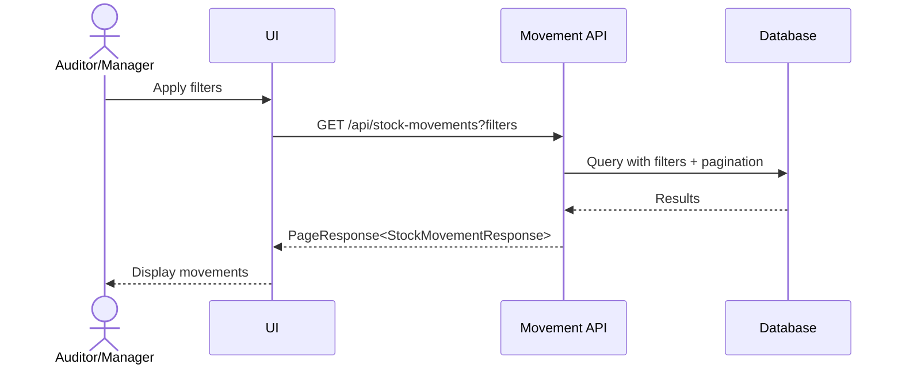
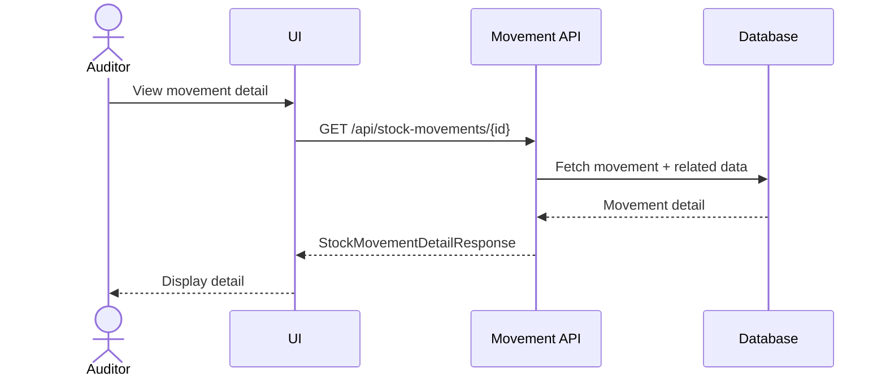
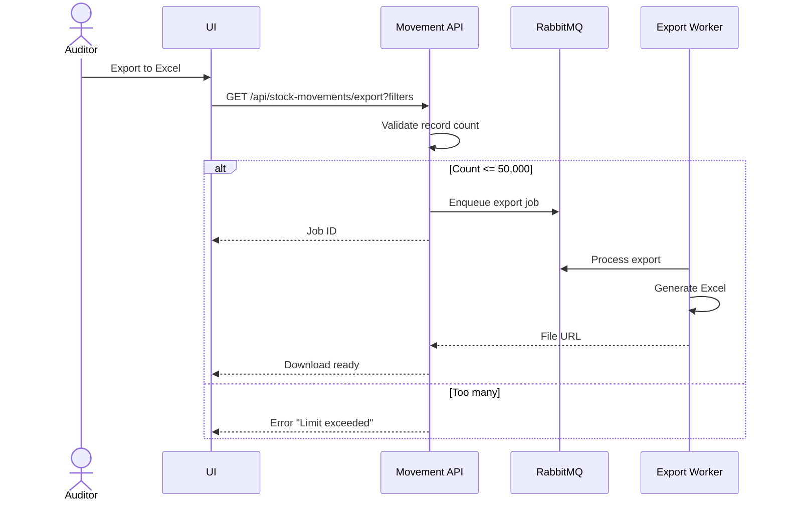

# Feature 3: Stock Movement & Audit Trail
## Business Requirements Specification

---

## Document Information

| Property | Value |
|----------|-------|
| Module | Inventory Operations (Phase 3) |
| Feature | Feature 3: Stock Movement & Audit Trail |
| Version | 1.0 |
| Date | February 01, 2026 |
| Status | Draft |
| Author | Business Analyst |

---

## Step 1 - Clarify Context

### Actors
- Auditor
- Warehouse Manager
- Inventory Controller
- Accountant
- System Admin

### Goals
- Maintain immutable audit log of all inventory changes.
- Enable traceability for compliance and investigation.
- Support reporting for financial reconciliation.
- Track who made changes, when, and why.

### Triggers
- Any inventory transaction (receipt, shipment, adjustment, transfer).
- Audit request from compliance team.
- Investigation of inventory discrepancies.

### Pain Points
- Cannot track inventory history.
- No accountability for stock changes.
- Compliance audit failures due to missing trail.
- Cannot identify root cause of discrepancies.

---

## Step 2 - User Stories

- **US-AUD-01**: As an Auditor, I want to see a complete history of stock movements for a product, so that I can verify inventory accuracy.
- **US-AUD-02**: As a Warehouse Manager, I want to track who made each inventory change, so that I can ensure accountability.
- **US-AUD-03**: As an Inventory Controller, I want to see before/after quantities for each movement, so that I can investigate discrepancies.
- **US-AUD-04**: As an Auditor, I want to filter movements by date range and type, so that I can generate compliance reports.
- **US-AUD-05**: As a System Admin, I want movement logs to be immutable, so that audit data cannot be tampered with.

---

## Step 3 - Use Case Specifications

### UC-AUD-01 - Query Stock Movements

**Brief Description**: Search and filter stock movements with pagination.

**Primary Actor**: Auditor, Warehouse Manager

**Pre-conditions**:
- User has `INVENTORY:AUDIT:VIEW` permission.

**Post-conditions**:
- User sees paginated list of movements.

**Main Flow**:
1. User opens Stock Movement report.
2. User applies filters:
   - Date range (from/to)
   - Movement type (INBOUND, OUTBOUND, ADJUSTMENT, TRANSFER_IN, TRANSFER_OUT)
   - Product ID
   - Warehouse ID
   - Location ID
   - Batch number
3. System queries matching movements.
4. System returns paginated results sorted by movement_date DESC.
5. User can export to Excel/CSV.

**Rules & Constraints**:
- Movement records are read-only (immutable).
- All movements logged automatically by system.
- No manual creation or deletion allowed.

**Mermaid Diagram**:


---

### UC-AUD-02 - View Movement Detail

**Brief Description**: View detailed information about a specific stock movement.

**Primary Actor**: Auditor, Warehouse Manager

**Pre-conditions**:
- User has `INVENTORY:AUDIT:VIEW` permission.
- Movement record exists.

**Post-conditions**:
- User sees complete movement details.

**Main Flow**:
1. User clicks on movement from list.
2. System retrieves movement detail.
3. System displays:
   - Movement type and date
   - Product details (SKU, name)
   - Warehouse and location
   - Batch number (if applicable)
   - Quantity change (+ or -)
   - Before/after quantities
   - Reference document (receipt/shipment/adjustment)
   - User who triggered the change
   - Notes
4. User can click to view source document.

**Mermaid Diagram**:


---

### UC-AUD-03 - Export Movements to Excel

**Brief Description**: Export filtered movements to Excel for external analysis.

**Primary Actor**: Auditor, Accountant

**Pre-conditions**:
- User has `INVENTORY:AUDIT:EXPORT` permission.
- Movements exist.

**Post-conditions**:
- Excel file generated and downloaded.

**Main Flow**:
1. User applies filters on movement list.
2. User clicks "Export to Excel".
3. System validates export limit (max 50,000 records).
4. System generates Excel file with columns:
   - Movement Date
   - Type
   - Product SKU & Name
   - Warehouse & Location
   - Batch Number
   - Quantity
   - Before Quantity
   - After Quantity
   - Reference Type & Number
   - User
5. System streams file to user.

**Alternative Flows**:
- A1: Too many records
  - System returns error "Export limit exceeded. Please narrow date range".

**Rules & Constraints**:
- Maximum 50,000 records per export.
- Export is asynchronous for large datasets (via RabbitMQ).

**Mermaid Diagram**:


---

## Step 4 - Acceptance Criteria

**AC-AUD-01 - Automatic Logging**
```gherkin
Given a goods receipt is completed
When stock is increased by 10 units
Then a stock movement record is created automatically
And movement_type = INBOUND
And quantity = 10
And quantity_after = quantity_before + 10
```

**AC-AUD-02 - Immutability**
```gherkin
Given a stock movement record exists
When I try to update or delete it
Then the system rejects the operation
And returns error "Movement records are immutable"
```

**AC-AUD-03 - Query by Product**
```gherkin
Given movements exist for product P1
When I filter by product_id = P1
Then the system returns only movements for P1
And results are sorted by movement_date DESC
```

**AC-AUD-04 - Export to Excel**
```gherkin
Given 1000 movements match my filters
When I click "Export to Excel"
Then an Excel file is generated with 1000 rows
And columns include all movement details
```

---

## Step 5 - Backend Impact Analysis

### Entities

#### StockMovement.java
```java
@Entity
@Table(name = "stock_movements")
public class StockMovement {
    @Id
    @GeneratedValue(strategy = GenerationType.IDENTITY)
    private Long id;
    
    @Enumerated(EnumType.STRING)
    @Column(name = "movement_type", nullable = false, length = 20)
    private MovementType movementType;
    
    @Column(name = "product_id", nullable = false)
    private Long productId;
    
    @Column(name = "warehouse_id", nullable = false)
    private Long warehouseId;
    
    @Column(name = "location_id")
    private Long locationId;
    
    @Column(name = "batch_number", length = 50)
    private String batchNumber;
    
    @Column(name = "quantity", nullable = false, precision = 15, scale = 3)
    private BigDecimal quantity; // Positive for increase, negative for decrease
    
    @Column(name = "uom_id", nullable = false)
    private Long uomId;
    
    @Column(name = "quantity_before", nullable = false, precision = 15, scale = 3)
    private BigDecimal quantityBefore;
    
    @Column(name = "quantity_after", nullable = false, precision = 15, scale = 3)
    private BigDecimal quantityAfter;
    
    @Column(name = "reference_type", nullable = false, length = 50)
    private String referenceType; // GOODS_RECEIPT, SHIPMENT, ADJUSTMENT, TRANSFER
    
    @Column(name = "reference_id", nullable = false)
    private Long referenceId;
    
    @Column(name = "reference_number", length = 50)
    private String referenceNumber;
    
    @Column(name = "notes", columnDefinition = "TEXT")
    private String notes;
    
    @Column(name = "movement_date", nullable = false)
    private LocalDateTime movementDate;
    
    @Column(name = "created_by", nullable = false, updatable = false)
    private Long createdBy;
    
    @Column(name = "created_at", nullable = false, updatable = false)
    private LocalDateTime createdAt;
    
    // NO updatedAt, updatedBy - immutable record
}
```

#### Enums
```java
public enum MovementType {
    INBOUND,        // From goods receipt
    OUTBOUND,       // From shipment
    ADJUSTMENT,     // From inventory adjustment
    TRANSFER_OUT,   // From stock transfer (source)
    TRANSFER_IN,    // From stock transfer (destination)
    INITIAL_STOCK   // Initial stock load
}
```

---

### Repositories

#### StockMovementRepository.java
```java
public interface StockMovementRepository extends JpaRepository<StockMovement, Long> {
    
    @Query("SELECT sm FROM StockMovement sm WHERE " +
           "(:productId IS NULL OR sm.productId = :productId) AND " +
           "(:warehouseId IS NULL OR sm.warehouseId = :warehouseId) AND " +
           "(:locationId IS NULL OR sm.locationId = :locationId) AND " +
           "(:movementType IS NULL OR sm.movementType = :movementType) AND " +
           "(:batchNumber IS NULL OR sm.batchNumber = :batchNumber) AND " +
           "(:fromDate IS NULL OR sm.movementDate >= :fromDate) AND " +
           "(:toDate IS NULL OR sm.movementDate <= :toDate)")
    Page<StockMovement> findAllWithFilters(
        @Param("productId") Long productId,
        @Param("warehouseId") Long warehouseId,
        @Param("locationId") Long locationId,
        @Param("movementType") MovementType movementType,
        @Param("batchNumber") String batchNumber,
        @Param("fromDate") LocalDateTime fromDate,
        @Param("toDate") LocalDateTime toDate,
        Pageable pageable
    );
    
    @Query("SELECT sm FROM StockMovement sm WHERE sm.productId = :productId ORDER BY sm.movementDate DESC")
    List<StockMovement> findByProductIdOrderByMovementDateDesc(@Param("productId") Long productId);
    
    @Query("SELECT sm FROM StockMovement sm WHERE sm.referenceType = :refType AND sm.referenceId = :refId")
    List<StockMovement> findByReference(@Param("refType") String referenceType, @Param("refId") Long referenceId);
    
    @Query("SELECT COUNT(sm) FROM StockMovement sm WHERE " +
           "sm.movementDate BETWEEN :startDate AND :endDate AND sm.movementType = :type")
    long countByDateRangeAndType(
        @Param("startDate") LocalDateTime startDate,
        @Param("endDate") LocalDateTime endDate,
        @Param("type") MovementType type
    );
    
    // For export - no pagination
    @Query("SELECT sm FROM StockMovement sm WHERE " +
           "(:productId IS NULL OR sm.productId = :productId) AND " +
           "(:fromDate IS NULL OR sm.movementDate >= :fromDate) AND " +
           "(:toDate IS NULL OR sm.movementDate <= :toDate)")
    List<StockMovement> findForExport(
        @Param("productId") Long productId,
        @Param("fromDate") LocalDateTime fromDate,
        @Param("toDate") LocalDateTime toDate
    );
}
```

---

### Services

#### StockMovementService.java
```java
public interface StockMovementService {
    
    /**
     * Log stock movement (called internally by other services)
     * Uses REQUIRES_NEW transaction to ensure logging even if parent fails
     */
    @Transactional(propagation = Propagation.REQUIRES_NEW)
    void logMovement(
        MovementType movementType,
        Long productId,
        Long warehouseId,
        Long locationId,
        String batchNumber,
        BigDecimal quantity,
        Long uomId,
        BigDecimal quantityBefore,
        BigDecimal quantityAfter,
        String referenceType,
        Long referenceId,
        String referenceNumber,
        String notes
    );
    
    /**
     * Query movements with filters and pagination
     */
    PageResponse<StockMovementResponse> queryMovements(
        Long productId,
        Long warehouseId,
        Long locationId,
        MovementType movementType,
        String batchNumber,
        LocalDateTime fromDate,
        LocalDateTime toDate,
        Pageable pageable
    );
    
    /**
     * Get movement detail by ID
     */
    StockMovementDetailResponse getMovementById(Long id);
    
    /**
     * Get movements for a specific product
     */
    List<StockMovementResponse> getMovementsByProduct(Long productId);
    
    /**
     * Get movements for a reference document
     */
    List<StockMovementResponse> getMovementsByReference(String referenceType, Long referenceId);
    
    /**
     * Export movements to Excel (async via RabbitMQ for large datasets)
     */
    String exportMovementsToExcel(
        Long productId,
        Long warehouseId,
        LocalDateTime fromDate,
        LocalDateTime toDate
    );
}
```

---

### DTOs

#### Response DTOs

**StockMovementResponse.java**
```java
public class StockMovementResponse {
    private Long id;
    private MovementType movementType;
    private Long productId;
    private String productSku;
    private String productName;
    private Long warehouseId;
    private String warehouseName;
    private Long locationId;
    private String locationCode;
    private String batchNumber;
    private BigDecimal quantity;
    private String uomCode;
    private BigDecimal quantityBefore;
    private BigDecimal quantityAfter;
    private String referenceType;
    private Long referenceId;
    private String referenceNumber;
    private LocalDateTime movementDate;
    private Long createdBy;
    private String createdByName;
}
```

**StockMovementDetailResponse.java**
```java
public class StockMovementDetailResponse {
    private Long id;
    private MovementType movementType;
    
    // Product info
    private Long productId;
    private String productSku;
    private String productName;
    
    // Location info
    private Long warehouseId;
    private String warehouseName;
    private Long locationId;
    private String locationCode;
    private String batchNumber;
    
    // Quantity info
    private BigDecimal quantity;
    private Long uomId;
    private String uomCode;
    private BigDecimal quantityBefore;
    private BigDecimal quantityAfter;
    
    // Reference info
    private String referenceType;
    private Long referenceId;
    private String referenceNumber;
    private String notes;
    
    // Audit info
    private LocalDateTime movementDate;
    private Long createdBy;
    private String createdByName;
    private LocalDateTime createdAt;
}
```

---

### API Endpoints

| Method | Endpoint | Description | Permission |
|--------|----------|-------------|------------|
| GET | `/api/stock-movements` | Query movements with filters | `INVENTORY:AUDIT:VIEW` |
| GET | `/api/stock-movements/{id}` | Get movement detail | `INVENTORY:AUDIT:VIEW` |
| GET | `/api/stock-movements/product/{productId}` | Get by product | `INVENTORY:AUDIT:VIEW` |
| GET | `/api/stock-movements/reference/{type}/{id}` | Get by reference | `INVENTORY:AUDIT:VIEW` |
| GET | `/api/stock-movements/export` | Export to Excel | `INVENTORY:AUDIT:EXPORT` |

---

### Database Migration

**V20260201_03__Create_stock_movements.sql**
```sql
CREATE TABLE stock_movements (
    id BIGINT AUTO_INCREMENT PRIMARY KEY,
    movement_type VARCHAR(20) NOT NULL,
    product_id BIGINT NOT NULL,
    warehouse_id BIGINT NOT NULL,
    location_id BIGINT,
    batch_number VARCHAR(50),
    quantity DECIMAL(15,3) NOT NULL,
    uom_id BIGINT NOT NULL,
    quantity_before DECIMAL(15,3) NOT NULL,
    quantity_after DECIMAL(15,3) NOT NULL,
    reference_type VARCHAR(50) NOT NULL,
    reference_id BIGINT NOT NULL,
    reference_number VARCHAR(50),
    notes TEXT,
    movement_date DATETIME NOT NULL,
    created_by BIGINT NOT NULL,
    created_at DATETIME NOT NULL DEFAULT CURRENT_TIMESTAMP,
    
    CONSTRAINT fk_sm_product FOREIGN KEY (product_id) REFERENCES products(id),
    CONSTRAINT fk_sm_warehouse FOREIGN KEY (warehouse_id) REFERENCES warehouses(id),
    CONSTRAINT fk_sm_location FOREIGN KEY (location_id) REFERENCES locations(id),
    CONSTRAINT fk_sm_uom FOREIGN KEY (uom_id) REFERENCES uoms(id),
    CONSTRAINT fk_sm_created_by FOREIGN KEY (created_by) REFERENCES accounts(id),
    
    INDEX idx_product_id (product_id),
    INDEX idx_warehouse_location (warehouse_id, location_id),
    INDEX idx_batch_number (batch_number),
    INDEX idx_movement_type (movement_type),
    INDEX idx_movement_date (movement_date),
    INDEX idx_reference (reference_type, reference_id),
    INDEX idx_created_at (created_at)
) ENGINE=InnoDB DEFAULT CHARSET=utf8mb4 COLLATE=utf8mb4_unicode_ci;

-- Add comment to indicate immutability
ALTER TABLE stock_movements COMMENT = 'Immutable audit log of all stock changes';
```

---

## Implementation Checklist

### Sprint 3.3 - Audit Trail & Reporting

#### Backend Tasks
- [ ] Create `StockMovement` entity (immutable)
- [ ] Create `MovementType` enum
- [ ] Create `StockMovementRepository` with complex queries
- [ ] Create Response DTOs
- [ ] Create `StockMovementService` interface
- [ ] Implement `StockMovementServiceImpl`
- [ ] Create `StockMovementController` (read-only endpoints)
- [ ] Implement Excel export functionality
- [ ] Integrate with Apache POI for Excel generation
- [ ] Create RabbitMQ consumer for async exports
- [ ] Add database indexes for query performance
- [ ] Ensure `logMovement()` uses REQUIRES_NEW transaction

#### Database Tasks
- [ ] Create Flyway migration for stock_movements table
- [ ] Add comprehensive indexes
- [ ] Add foreign key constraints
- [ ] Add table comment for documentation

#### Testing Tasks
- [ ] Unit tests for query methods
- [ ] Integration tests for filtering
- [ ] Test pagination performance
- [ ] Test Excel export (small and large datasets)
- [ ] Test immutability (should not allow updates/deletes)
- [ ] Test transaction propagation for logging
- [ ] Performance test for 100k+ records

#### Documentation Tasks
- [ ] Document query API with examples
- [ ] Document Excel export format
- [ ] Add performance tuning guide
- [ ] Update OpenAPI documentation

---

## BA Review Checklist

- [x] Actors identified
- [x] Business rules documented
- [x] Immutability enforced
- [x] Query capabilities defined
- [x] Export functionality specified
- [x] Performance considerations addressed
- [x] Entities and repositories specified
- [x] Service interface defined
- [x] DTOs detailed
- [x] Database migration included
- [x] Sequence diagrams provided

---

**Document Version**: 1.0  
**Last Updated**: February 01, 2026  
**Status**: ✅ Ready for Implementation
