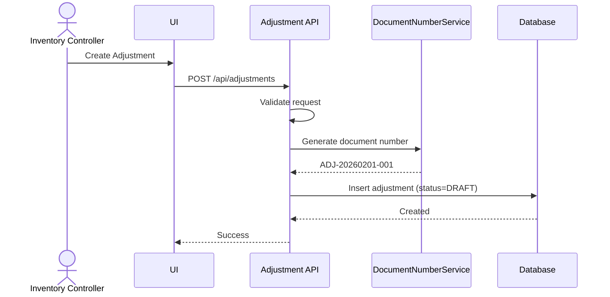
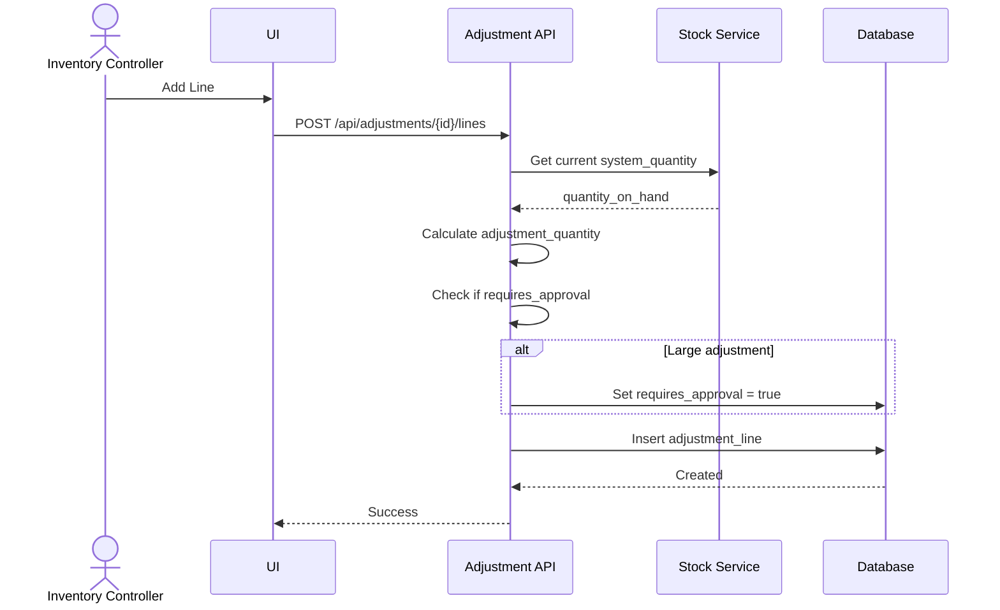
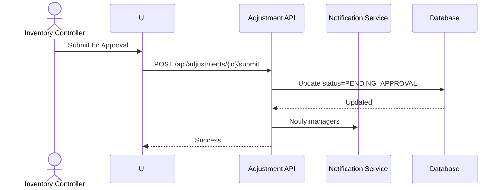
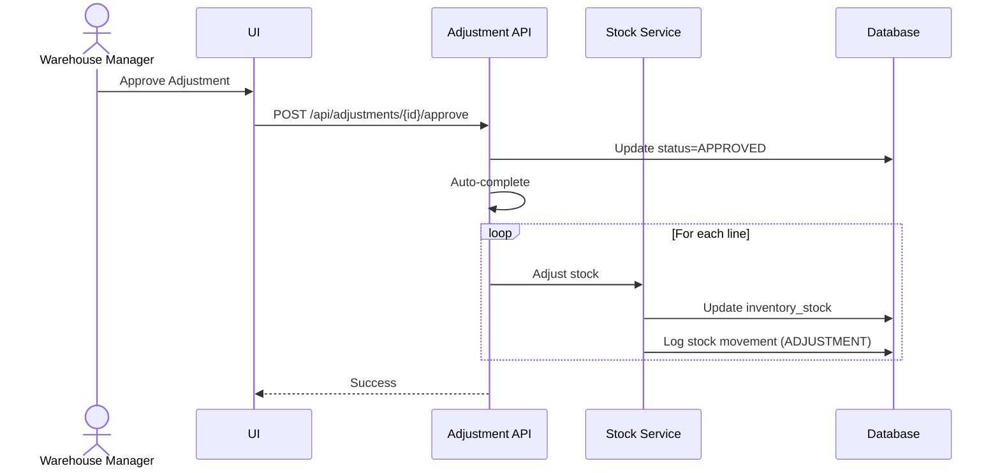
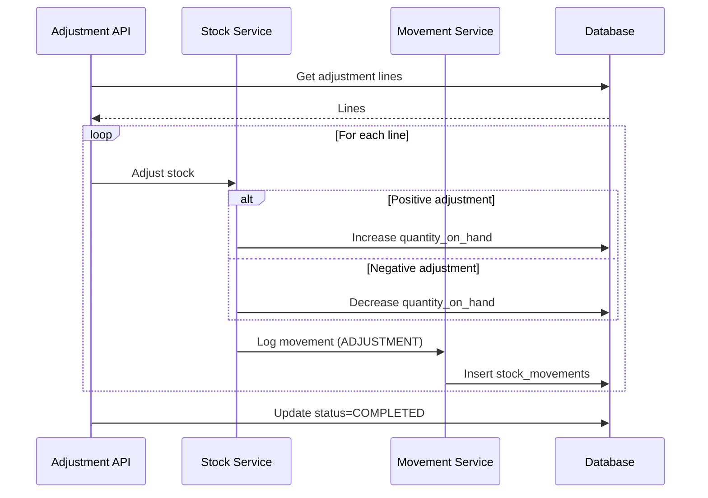

# Feature 4: Inventory Adjustment
## Business Requirements Specification

---

## Document Information

| Property | Value |
|----------|-------|
| Module | Inventory Operations (Phase 3) |
| Feature | Feature 4: Inventory Adjustment |
| Version | 1.0 |
| Date | February 01, 2026 |
| Status | Draft |
| Author | Business Analyst |

---

## Step 1 - Clarify Context

### Actors
- Inventory Controller
- Warehouse Manager (approver)
- Auditor
- System Admin

### Goals
- Correct inventory discrepancies found during physical counts.
- Document reasons for adjustments for audit compliance.
- Implement approval workflow for large adjustments.
- Prevent fraudulent adjustments through validation.

### Triggers
- Cycle count reveals discrepancy.
- Damaged goods found.
- System error correction.
- Physical inventory found/lost.

### Pain Points
- Inventory counts differ from system by 5-10%.
- No approval required for large adjustments.
- Cannot track adjustment reasons.
- No fraud prevention mechanism.

---

## Step 2 - User Stories

- **US-ADJ-01**: As an Inventory Controller, I want to create an adjustment document, so that I can correct inventory discrepancies.
- **US-ADJ-02**: As an Inventory Controller, I want to specify a reason for each adjustment, so that we can analyze root causes.
- **US-ADJ-03**: As a Warehouse Manager, I want to approve adjustments over a threshold, so that large changes are verified.
- **US-ADJ-04**: As an Auditor, I want to see all adjustments with justifications, so that I can review for fraud or errors.
- **US-ADJ-05**: As an Inventory Controller, I want to perform cycle counts by location, so that we maintain accuracy without full shutdowns.

---

## Step 3 - Use Case Specifications

### UC-ADJ-01 - Create Inventory Adjustment

**Brief Description**: Create adjustment document to correct stock discrepancies.

**Primary Actor**: Inventory Controller

**Pre-conditions**:
- User has `INVENTORY:ADJUSTMENT:CREATE` permission.
- Target warehouse exists and is ACTIVE.

**Post-conditions**:
- Adjustment created with DRAFT status.
- Document number auto-generated (ADJ-YYYYMMDD-XXX).

**Main Flow**:
1. User opens Inventory Adjustment module.
2. User clicks "Create New Adjustment".
3. System displays adjustment form.
4. User enters header data:
   - warehouse_id (required)
   - adjustment_type (CYCLE_COUNT, DAMAGE, LOSS, FOUND, DATA_CORRECTION)
   - adjustment_date (required, default today)
   - reason (required, text explanation)
   - attachment_url (optional, for photos/documents)
5. User clicks Save.
6. System validates fields.
7. System generates document number (ADJ-YYYYMMDD-XXX).
8. System creates adjustment with status DRAFT.
9. System returns success with detail.

**Rules & Constraints**:
- Reason is mandatory for all adjustments.
- Adjustment date cannot be in future.
- Document number format: ADJ-YYYYMMDD-XXX.

**Mermaid Diagram**:


---

### UC-ADJ-02 - Add Adjustment Lines

**Brief Description**: Add product lines with system vs physical quantities.

**Primary Actor**: Inventory Controller

**Pre-conditions**:
- Adjustment exists with status DRAFT.
- User has `INVENTORY:ADJUSTMENT:CREATE` permission.

**Post-conditions**:
- Adjustment lines added.
- System calculates adjustment quantity automatically.

**Main Flow**:
1. User opens adjustment in DRAFT status.
2. User clicks "Add Items".
3. User enters line data:
   - product_id (required)
   - location_id (required)
   - batch_number (if applicable)
   - system_quantity (auto-filled from inventory_stock)
   - physical_quantity (required, counted quantity)
   - uom_id (required)
   - notes (optional, reason for this line)
4. System calculates: adjustment_quantity = physical_quantity - system_quantity
5. User clicks Save.
6. System validates and creates line.
7. System checks if requires_approval based on threshold.

**Alternative Flows**:
- A1: Large adjustment (> 10% or > $1000 value)
  - System sets requires_approval = true

**Rules & Constraints**:
- Adjustment quantity = physical - system (can be positive or negative).
- Approval required if: abs(adjustment_quantity) > 10% of system_quantity OR abs(adjustment_value) > $1000.
- Cannot adjust same product/location > 3 times per day (fraud prevention).

**Mermaid Diagram**:


---

### UC-ADJ-03 - Submit for Approval

**Brief Description**: Submit adjustment to manager when approval required.

**Primary Actor**: Inventory Controller

**Pre-conditions**:
- Adjustment exists with status DRAFT.
- requires_approval = true.
- At least one line exists.

**Post-conditions**:
- Adjustment status changed to PENDING_APPROVAL.
- Notification sent to approvers.

**Main Flow**:
1. User opens adjustment detail.
2. System shows "Requires Approval" badge.
3. User clicks "Submit for Approval".
4. System validates adjustment has lines.
5. System updates status to PENDING_APPROVAL.
6. System records submitted_by and submitted_at.
7. System sends notification to warehouse managers.
8. System returns success.

**Rules & Constraints**:
- Status transition: DRAFT → PENDING_APPROVAL (if requires_approval = true).
- If requires_approval = false, can go directly from DRAFT → APPROVED → COMPLETED.

**Mermaid Diagram**:


---

### UC-ADJ-04 - Approve/Reject Adjustment

**Brief Description**: Manager approves or rejects adjustment.

**Primary Actor**: Warehouse Manager

**Pre-conditions**:
- Adjustment exists with status PENDING_APPROVAL.
- User has `INVENTORY:ADJUSTMENT:APPROVE` permission.

**Post-conditions**:
- Adjustment approved or rejected with reason.

**Main Flow - Approve**:
1. Manager opens adjustment detail.
2. Manager reviews lines and reasons.
3. Manager clicks "Approve".
4. System updates status to APPROVED.
5. System records approved_by and approved_at.
6. System auto-triggers complete operation.

**Main Flow - Reject**:
1. Manager clicks "Reject".
2. Manager enters rejection reason.
3. System updates status to REJECTED.
4. System notifies submitter.

**Rules & Constraints**:
- Status transition: PENDING_APPROVAL → APPROVED or REJECTED.
- Approved adjustments auto-complete immediately.
- Rejected adjustments cannot be completed.

**Mermaid Diagram**:


---

### UC-ADJ-05 - Complete Adjustment

**Brief Description**: Apply adjustment to inventory (increase/decrease stock).

**Primary Actor**: Inventory Controller or System (auto after approval)

**Pre-conditions**:
- Adjustment status is APPROVED (or DRAFT if no approval required).
- At least one line exists.

**Post-conditions**:
- Adjustment status changed to COMPLETED.
- Inventory stock adjusted for each line.
- Stock movement records created.

**Main Flow**:
1. System (or user) triggers complete operation.
2. System validates adjustment approved or no approval needed.
3. For each line:
   - Calculate adjustment: physical - system
   - Update inventory_stock.quantity_on_hand
   - Create stock_movement with type ADJUSTMENT
4. System updates status to COMPLETED.
5. System records completed_by and completed_at.

**Rules & Constraints**:
- Status transition: APPROVED → COMPLETED.
- Stock movements logged for audit trail.
- Negative adjustments check for sufficient stock.

**Mermaid Diagram**:


---

## Step 4 - Acceptance Criteria

**AC-ADJ-01 - Create Adjustment**
```gherkin
Given I am an Inventory Controller
When I create an adjustment with reason "Cycle count discrepancy"
Then the adjustment is created with status DRAFT
And document number follows format ADJ-YYYYMMDD-XXX
```

**AC-ADJ-02 - Approval Threshold**
```gherkin
Given system_quantity = 100 and physical_quantity = 150
When I add adjustment line (50% increase)
Then requires_approval is set to true
And status must go through PENDING_APPROVAL
```

**AC-ADJ-03 - Fraud Prevention**
```gherkin
Given I adjusted product P1 at location L1 three times today
When I try to create a 4th adjustment for same product/location
Then the system returns error "Adjustment limit exceeded"
```

**AC-ADJ-04 - Stock Update**
```gherkin
Given adjustment line: system=100, physical=95 (adjustment=-5)
When adjustment is completed
Then inventory_stock.quantity_on_hand decreases by 5
And stock movement is logged with quantity=-5
```

---

## Step 5 - Backend Impact Analysis

### Entities

#### InventoryAdjustment.java
```java
@Entity
@Table(name = "inventory_adjustments")
public class InventoryAdjustment extends BaseEntity {
    @Column(name = "adjustment_number", unique = true, nullable = false, length = 50)
    private String adjustmentNumber;
    
    @Column(name = "warehouse_id", nullable = false)
    private Long warehouseId;
    
    @Enumerated(EnumType.STRING)
    @Column(name = "adjustment_type", nullable = false, length = 20)
    private AdjustmentType adjustmentType;
    
    @Column(name = "adjustment_date", nullable = false)
    private LocalDate adjustmentDate;
    
    @Enumerated(EnumType.STRING)
    @Column(name = "status", nullable = false, length = 20)
    private AdjustmentStatus status;
    
    @Column(name = "reason", nullable = false, columnDefinition = "TEXT")
    private String reason;
    
    @Column(name = "requires_approval", nullable = false)
    private Boolean requiresApproval = false;
    
    @Column(name = "attachment_url", length = 500)
    private String attachmentUrl;
    
    @Column(name = "submitted_by")
    private Long submittedBy;
    
    @Column(name = "submitted_at")
    private LocalDateTime submittedAt;
    
    @Column(name = "approved_by")
    private Long approvedBy;
    
    @Column(name = "approved_at")
    private LocalDateTime approvedAt;
    
    @Column(name = "completed_by")
    private Long completedBy;
    
    @Column(name = "completed_at")
    private LocalDateTime completedAt;
    
    @OneToMany(mappedBy = "adjustment", cascade = CascadeType.ALL, orphanRemoval = true)
    private List<InventoryAdjustmentLine> lines = new ArrayList<>();
}
```

#### InventoryAdjustmentLine.java
```java
@Entity
@Table(name = "inventory_adjustment_lines")
public class InventoryAdjustmentLine extends BaseEntity {
    @ManyToOne(fetch = FetchType.LAZY)
    @JoinColumn(name = "adjustment_id", nullable = false)
    private InventoryAdjustment adjustment;
    
    @Column(name = "line_number", nullable = false)
    private Integer lineNumber;
    
    @Column(name = "product_id", nullable = false)
    private Long productId;
    
    @Column(name = "location_id", nullable = false)
    private Long locationId;
    
    @Column(name = "batch_number", length = 50)
    private String batchNumber;
    
    @Column(name = "system_quantity", nullable = false, precision = 15, scale = 3)
    private BigDecimal systemQuantity;
    
    @Column(name = "physical_quantity", nullable = false, precision = 15, scale = 3)
    private BigDecimal physicalQuantity;
    
    @Column(name = "adjustment_quantity", nullable = false, precision = 15, scale = 3)
    private BigDecimal adjustmentQuantity; // physical - system
    
    @Column(name = "uom_id", nullable = false)
    private Long uomId;
    
    @Column(name = "notes", columnDefinition = "TEXT")
    private String notes;
}
```

#### Enums
```java
public enum AdjustmentType {
    CYCLE_COUNT,
    DAMAGE,
    LOSS,
    FOUND,
    DATA_CORRECTION
}

public enum AdjustmentStatus {
    DRAFT,
    PENDING_APPROVAL,
    APPROVED,
    REJECTED,
    COMPLETED
}
```

---

### Repositories

#### InventoryAdjustmentRepository.java
```java
public interface InventoryAdjustmentRepository extends JpaRepository<InventoryAdjustment, Long> {
    
    Optional<InventoryAdjustment> findByAdjustmentNumber(String adjustmentNumber);
    
    @Query("SELECT ia FROM InventoryAdjustment ia WHERE " +
           "(:warehouseId IS NULL OR ia.warehouseId = :warehouseId) AND " +
           "(:status IS NULL OR ia.status = :status) AND " +
           "(:type IS NULL OR ia.adjustmentType = :type) AND " +
           "(:fromDate IS NULL OR ia.adjustmentDate >= :fromDate) AND " +
           "(:toDate IS NULL OR ia.adjustmentDate <= :toDate)")
    Page<InventoryAdjustment> findAllWithFilters(
        @Param("warehouseId") Long warehouseId,
        @Param("status") AdjustmentStatus status,
        @Param("type") AdjustmentType type,
        @Param("fromDate") LocalDate fromDate,
        @Param("toDate") LocalDate toDate,
        Pageable pageable
    );
    
    @Query("SELECT ia FROM InventoryAdjustment ia JOIN FETCH ia.lines WHERE ia.id = :id")
    Optional<InventoryAdjustment> findByIdWithLines(@Param("id") Long id);
    
    @Query("SELECT ia FROM InventoryAdjustment ia WHERE ia.status = 'PENDING_APPROVAL'")
    List<InventoryAdjustment> findPendingApprovals();
}
```

#### InventoryAdjustmentLineRepository.java
```java
public interface InventoryAdjustmentLineRepository extends JpaRepository<InventoryAdjustmentLine, Long> {
    
    List<InventoryAdjustmentLine> findByAdjustmentIdOrderByLineNumber(Long adjustmentId);
    
    @Query("SELECT MAX(ial.lineNumber) FROM InventoryAdjustmentLine ial WHERE ial.adjustment.id = :adjustmentId")
    Optional<Integer> findMaxLineNumber(@Param("adjustmentId") Long adjustmentId);
    
    // Fraud prevention: check adjustment frequency
    @Query("SELECT COUNT(ial) FROM InventoryAdjustmentLine ial JOIN ial.adjustment ia WHERE " +
           "ial.productId = :productId AND ial.locationId = :locationId AND " +
           "ia.adjustmentDate = :date AND ia.status <> 'REJECTED'")
    long countAdjustmentsToday(
        @Param("productId") Long productId,
        @Param("locationId") Long locationId,
        @Param("date") LocalDate date
    );
}
```

---

### Services

#### InventoryAdjustmentService.java
```java
public interface InventoryAdjustmentService {
    
    AdjustmentDetailResponse createAdjustment(CreateAdjustmentRequest request);
    
    AdjustmentDetailResponse updateAdjustment(Long id, UpdateAdjustmentRequest request);
    
    void deleteAdjustment(Long id);
    
    AdjustmentDetailResponse getAdjustmentById(Long id);
    
    PageResponse<AdjustmentSummaryResponse> listAdjustments(
        Long warehouseId,
        AdjustmentStatus status,
        AdjustmentType type,
        LocalDate fromDate,
        LocalDate toDate,
        Pageable pageable
    );
    
    AdjustmentLineResponse addAdjustmentLine(Long adjustmentId, AddAdjustmentLineRequest request);
    
    AdjustmentLineResponse updateAdjustmentLine(Long adjustmentId, Long lineId, UpdateAdjustmentLineRequest request);
    
    void deleteAdjustmentLine(Long adjustmentId, Long lineId);
    
    List<AdjustmentLineResponse> getAdjustmentLines(Long adjustmentId);
    
    AdjustmentDetailResponse submitForApproval(Long id);
    
    AdjustmentDetailResponse approveAdjustment(Long id, ApproveAdjustmentRequest request);
    
    AdjustmentDetailResponse rejectAdjustment(Long id, RejectAdjustmentRequest request);
    
    AdjustmentDetailResponse completeAdjustment(Long id);
}
```

---

### API Endpoints

| Method | Endpoint | Description | Permission |
|--------|----------|-------------|------------|
| GET | `/api/adjustments` | List adjustments | `INVENTORY:ADJUSTMENT:VIEW` |
| GET | `/api/adjustments/{id}` | Get detail | `INVENTORY:ADJUSTMENT:VIEW` |
| POST | `/api/adjustments` | Create | `INVENTORY:ADJUSTMENT:CREATE` |
| PUT | `/api/adjustments/{id}` | Update draft | `INVENTORY:ADJUSTMENT:UPDATE` |
| DELETE | `/api/adjustments/{id}` | Delete draft | `INVENTORY:ADJUSTMENT:DELETE` |
| POST | `/api/adjustments/{id}/submit` | Submit for approval | `INVENTORY:ADJUSTMENT:CREATE` |
| POST | `/api/adjustments/{id}/approve` | Approve | `INVENTORY:ADJUSTMENT:APPROVE` |
| POST | `/api/adjustments/{id}/reject` | Reject | `INVENTORY:ADJUSTMENT:APPROVE` |
| POST | `/api/adjustments/{id}/complete` | Complete | `INVENTORY:ADJUSTMENT:CREATE` |
| GET | `/api/adjustments/{id}/lines` | Get lines | `INVENTORY:ADJUSTMENT:VIEW` |
| POST | `/api/adjustments/{id}/lines` | Add line | `INVENTORY:ADJUSTMENT:CREATE` |
| PUT | `/api/adjustments/{id}/lines/{lineId}` | Update line | `INVENTORY:ADJUSTMENT:UPDATE` |
| DELETE | `/api/adjustments/{id}/lines/{lineId}` | Delete line | `INVENTORY:ADJUSTMENT:DELETE` |

---

### Database Migration

**V20260201_04__Create_inventory_adjustments.sql**
```sql
CREATE TABLE inventory_adjustments (
    id BIGINT AUTO_INCREMENT PRIMARY KEY,
    adjustment_number VARCHAR(50) UNIQUE NOT NULL,
    warehouse_id BIGINT NOT NULL,
    adjustment_type VARCHAR(20) NOT NULL,
    adjustment_date DATE NOT NULL,
    status VARCHAR(20) NOT NULL,
    reason TEXT NOT NULL,
    requires_approval BOOLEAN NOT NULL DEFAULT FALSE,
    attachment_url VARCHAR(500),
    submitted_by BIGINT,
    submitted_at DATETIME,
    approved_by BIGINT,
    approved_at DATETIME,
    completed_by BIGINT,
    completed_at DATETIME,
    created_at DATETIME NOT NULL DEFAULT CURRENT_TIMESTAMP,
    updated_at DATETIME NOT NULL DEFAULT CURRENT_TIMESTAMP ON UPDATE CURRENT_TIMESTAMP,
    created_by BIGINT NOT NULL,
    updated_by BIGINT NOT NULL,
    version BIGINT DEFAULT 0,
    
    CONSTRAINT fk_adj_warehouse FOREIGN KEY (warehouse_id) REFERENCES warehouses(id),
    CONSTRAINT fk_adj_submitted_by FOREIGN KEY (submitted_by) REFERENCES accounts(id),
    CONSTRAINT fk_adj_approved_by FOREIGN KEY (approved_by) REFERENCES accounts(id),
    CONSTRAINT fk_adj_completed_by FOREIGN KEY (completed_by) REFERENCES accounts(id),
    CONSTRAINT fk_adj_created_by FOREIGN KEY (created_by) REFERENCES accounts(id),
    CONSTRAINT fk_adj_updated_by FOREIGN KEY (updated_by) REFERENCES accounts(id),
    
    INDEX idx_adjustment_number (adjustment_number),
    INDEX idx_warehouse_id (warehouse_id),
    INDEX idx_status (status),
    INDEX idx_adjustment_date (adjustment_date),
    INDEX idx_adjustment_type (adjustment_type)
) ENGINE=InnoDB DEFAULT CHARSET=utf8mb4 COLLATE=utf8mb4_unicode_ci;

CREATE TABLE inventory_adjustment_lines (
    id BIGINT AUTO_INCREMENT PRIMARY KEY,
    adjustment_id BIGINT NOT NULL,
    line_number INT NOT NULL,
    product_id BIGINT NOT NULL,
    location_id BIGINT NOT NULL,
    batch_number VARCHAR(50),
    system_quantity DECIMAL(15,3) NOT NULL,
    physical_quantity DECIMAL(15,3) NOT NULL,
    adjustment_quantity DECIMAL(15,3) NOT NULL,
    uom_id BIGINT NOT NULL,
    notes TEXT,
    created_at DATETIME NOT NULL DEFAULT CURRENT_TIMESTAMP,
    updated_at DATETIME NOT NULL DEFAULT CURRENT_TIMESTAMP ON UPDATE CURRENT_TIMESTAMP,
    
    CONSTRAINT fk_adjl_adjustment FOREIGN KEY (adjustment_id) REFERENCES inventory_adjustments(id) ON DELETE CASCADE,
    CONSTRAINT fk_adjl_product FOREIGN KEY (product_id) REFERENCES products(id),
    CONSTRAINT fk_adjl_location FOREIGN KEY (location_id) REFERENCES locations(id),
    CONSTRAINT fk_adjl_uom FOREIGN KEY (uom_id) REFERENCES uoms(id),
    CONSTRAINT uk_adjl_line_number UNIQUE (adjustment_id, line_number),
    
    INDEX idx_adjustment_id (adjustment_id),
    INDEX idx_product_id (product_id),
    INDEX idx_location_id (location_id)
) ENGINE=InnoDB DEFAULT CHARSET=utf8mb4 COLLATE=utf8mb4_unicode_ci;
```

---

## Implementation Checklist

### Sprint 3.4 - Inventory Adjustment

#### Backend Tasks
- [ ] Create entities and enums
- [ ] Create repositories with fraud prevention queries
- [ ] Create all DTOs
- [ ] Implement service with approval workflow
- [ ] Create controller
- [ ] Implement approval threshold logic
- [ ] Implement fraud prevention (max 3/day)
- [ ] Integrate with stock and movement services

#### Database Tasks
- [ ] Create Flyway migrations
- [ ] Add constraints and indexes

#### Testing Tasks
- [ ] Unit tests for approval workflow
- [ ] Test threshold calculations
- [ ] Test fraud prevention
- [ ] Integration tests

---

**Status**: ✅ Ready for Implementation
