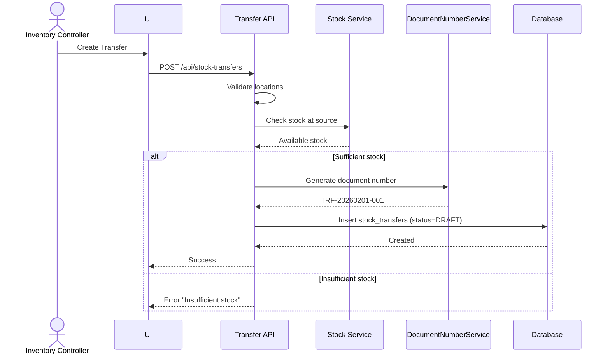
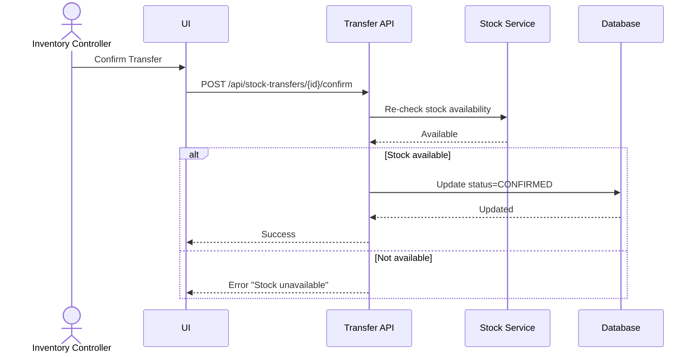
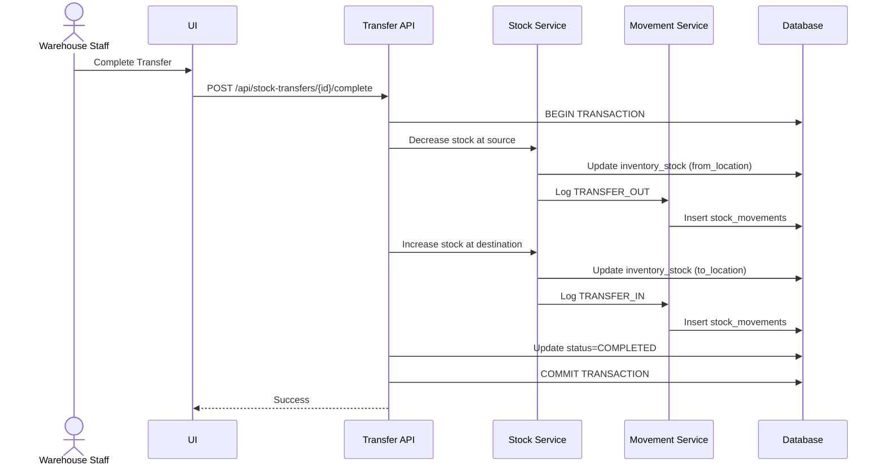
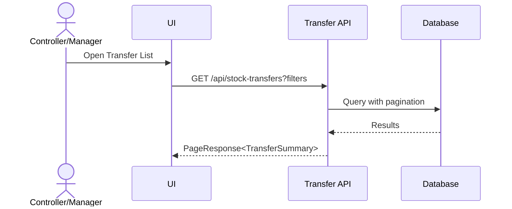

# Feature 5: Stock Transfer Between Locations
## Business Requirements Specification

---

## Document Information

| Property | Value |
|----------|-------|
| Module | Inventory Operations (Phase 3) |
| Feature | Feature 5: Stock Transfer Between Locations |
| Version | 1.0 |
| Date | February 01, 2026 |
| Status | Draft |
| Author | Business Analyst |

---

## Step 1 - Clarify Context

### Actors
- Inventory Controller
- Warehouse Manager
- Warehouse Staff
- System Admin

### Goals
- Move inventory between locations within same warehouse.
- Optimize warehouse space utilization.
- Prepare stock for picking by moving to accessible locations.
- Maintain inventory accuracy during transfers.

### Triggers
- Warehouse reorganization.
- Prepare stock for upcoming orders.
- Balance inventory across locations.
- Move stock from full to empty locations.

### Pain Points
- Manual tracking of stock movements.
- No validation of source/destination locations.
- Inventory discrepancies during transfers.
- Cannot track transfer history.

---

## Step 2 - User Stories

- **US-TRF-01**: As an Inventory Controller, I want to transfer stock between locations, so that I can optimize warehouse layout.
- **US-TRF-02**: As a Warehouse Manager, I want to see pending transfers, so that I can monitor warehouse reorganization tasks.
- **US-TRF-03**: As a Warehouse Staff, I want to scan items during transfer, so that I verify I'm moving the correct items.
- **US-TRF-04**: As an Inventory Controller, I want to transfer stock in batches, so that I can reorganize without disrupting operations.

---

## Step 3 - Use Case Specifications

### UC-TRF-01 - Create Stock Transfer

**Brief Description**: Create transfer document to move stock between locations.

**Primary Actor**: Inventory Controller

**Pre-conditions**:
- User has `INVENTORY:TRANSFER:CREATE` permission.
- Source and destination locations exist in same warehouse.
- Locations are ACTIVE.

**Post-conditions**:
- Transfer created with DRAFT status.
- Document number auto-generated (TRF-YYYYMMDD-XXX).

**Main Flow**:
1. User opens Stock Transfer module.
2. User clicks "Create New Transfer".
3. System displays transfer form.
4. User enters transfer data:
   - warehouse_id (required)
   - from_location_id (required, must be ACTIVE)
   - to_location_id (required, must be ACTIVE, must be different from source)
   - product_id (required)
   - batch_number (if product requires batch tracking)
   - quantity (required, > 0)
   - uom_id (required)
   - transfer_date (required, default today)
   - reason (optional)
5. User clicks Save.
6. System validates:
   - from_location_id ≠ to_location_id
   - Both locations in same warehouse
   - Sufficient stock at source location
7. System generates document number (TRF-YYYYMMDD-XXX).
8. System creates transfer with status DRAFT.
9. System returns success.

**Alternative Flows**:
- A1: Same source and destination
  - System returns error "Source and destination must be different".
- A2: Insufficient stock at source
  - System returns error "Insufficient stock at source location".
- A3: Locations in different warehouses
  - System returns error "Transfer only within same warehouse".

**Rules & Constraints**:
- Transfer only within same warehouse.
- from_location_id must be different from to_location_id.
- Both locations must be ACTIVE.
- Source location must have sufficient available stock.
- Batch number preserved during transfer.

**Mermaid Diagram**:


---

### UC-TRF-02 - Confirm Transfer

**Brief Description**: Confirm transfer to lock document and prepare for execution.

**Primary Actor**: Inventory Controller

**Pre-conditions**:
- Transfer exists with status DRAFT.
- User has `INVENTORY:TRANSFER:CONFIRM` permission.
- Stock still available at source.

**Post-conditions**:
- Transfer status changed to CONFIRMED.
- Ready for physical transfer.

**Main Flow**:
1. User opens transfer detail (DRAFT status).
2. User clicks "Confirm Transfer".
3. System validates stock still available.
4. System updates status to CONFIRMED.
5. System records confirmed_by and confirmed_at.
6. System returns success.

**Alternative Flows**:
- A1: Stock no longer available
  - System returns error "Stock no longer available at source".

**Rules & Constraints**:
- Status transition: DRAFT → CONFIRMED.
- Re-validates stock availability at confirmation.

**Mermaid Diagram**:


---

### UC-TRF-03 - Complete Transfer

**Brief Description**: Execute transfer by updating stock at both locations.

**Primary Actor**: Inventory Controller or Warehouse Staff

**Pre-conditions**:
- Transfer exists with status CONFIRMED.
- User has `INVENTORY:TRANSFER:CONFIRM` permission.
- Stock available at source location.

**Post-conditions**:
- Transfer status changed to COMPLETED.
- Stock decreased at source location.
- Stock increased at destination location.
- Two stock movement records created (TRANSFER_OUT, TRANSFER_IN).

**Main Flow**:
1. User (or system) triggers complete operation.
2. System validates transfer is CONFIRMED.
3. System begins transaction:
   - Decrease stock at from_location
   - Increase stock at to_location
   - Create stock_movement (TRANSFER_OUT) for source
   - Create stock_movement (TRANSFER_IN) for destination
4. System updates status to COMPLETED.
5. System records completed_by and completed_at.
6. System commits transaction.
7. System returns success.

**Alternative Flows**:
- A1: Insufficient stock at source (changed since confirmation)
  - System rolls back and returns error.

**Exception Flows**:
- E1: Transaction failure
  - System rolls back all changes.
  - Stock remains unchanged at both locations.

**Rules & Constraints**:
- Status transition: CONFIRMED → COMPLETED.
- Atomic transaction (all or nothing).
- Batch number preserved.
- Stock movements logged for audit trail.

**Mermaid Diagram**:


---

### UC-TRF-04 - List and Filter Transfers

**Brief Description**: Search and filter transfers with pagination.

**Primary Actor**: Inventory Controller, Warehouse Manager

**Pre-conditions**:
- User has `INVENTORY:TRANSFER:VIEW` permission.

**Post-conditions**:
- User sees paginated list of transfers.

**Main Flow**:
1. User opens Transfer list.
2. User applies filters:
   - Warehouse
   - Status (DRAFT, CONFIRMED, IN_TRANSIT, COMPLETED, CANCELLED)
   - Date range
   - Product
   - From/to location
3. System queries matching transfers.
4. System returns paginated results.

**Mermaid Diagram**:


---

## Step 4 - Acceptance Criteria

**AC-TRF-01 - Create Transfer**
```gherkin
Given I am an Inventory Controller
When I create a transfer from location L1 to L2 for 10 units of product P1
Then the transfer is created with status DRAFT
And document number follows format TRF-YYYYMMDD-XXX
```

**AC-TRF-02 - Same Location Validation**
```gherkin
Given I create a transfer
When from_location_id = to_location_id
Then the system returns error "Source and destination must be different"
```

**AC-TRF-03 - Insufficient Stock**
```gherkin
Given location L1 has only 5 units of product P1
When I try to transfer 10 units
Then the system returns error "Insufficient stock at source location"
```

**AC-TRF-04 - Stock Update on Completion**
```gherkin
Given a transfer from L1 to L2 for 10 units of P1
When I complete the transfer
Then stock at L1 decreases by 10
And stock at L2 increases by 10
And two stock movements are created (TRANSFER_OUT, TRANSFER_IN)
```

**AC-TRF-05 - Batch Preservation**
```gherkin
Given a transfer of batch "B001"
When the transfer is completed
Then batch "B001" remains unchanged at destination
```

---

## Step 5 - Backend Impact Analysis

### Entities

#### StockTransfer.java
```java
@Entity
@Table(name = "stock_transfers")
public class StockTransfer extends BaseEntity {
    @Column(name = "transfer_number", unique = true, nullable = false, length = 50)
    private String transferNumber;
    
    @Column(name = "warehouse_id", nullable = false)
    private Long warehouseId;
    
    @Column(name = "from_location_id", nullable = false)
    private Long fromLocationId;
    
    @Column(name = "to_location_id", nullable = false)
    private Long toLocationId;
    
    @Column(name = "product_id", nullable = false)
    private Long productId;
    
    @Column(name = "batch_number", length = 50)
    private String batchNumber;
    
    @Column(name = "quantity", nullable = false, precision = 15, scale = 3)
    private BigDecimal quantity;
    
    @Column(name = "uom_id", nullable = false)
    private Long uomId;
    
    @Enumerated(EnumType.STRING)
    @Column(name = "status", nullable = false, length = 20)
    private TransferStatus status;
    
    @Column(name = "transfer_date", nullable = false)
    private LocalDate transferDate;
    
    @Column(name = "reason", columnDefinition = "TEXT")
    private String reason;
    
    @Column(name = "confirmed_by")
    private Long confirmedBy;
    
    @Column(name = "confirmed_at")
    private LocalDateTime confirmedAt;
    
    @Column(name = "completed_by")
    private Long completedBy;
    
    @Column(name = "completed_at")
    private LocalDateTime completedAt;
}
```

#### Enums
```java
public enum TransferStatus {
    DRAFT,
    CONFIRMED,
    IN_TRANSIT,
    COMPLETED,
    CANCELLED
}
```

---

### Repositories

#### StockTransferRepository.java
```java
public interface StockTransferRepository extends JpaRepository<StockTransfer, Long> {
    
    Optional<StockTransfer> findByTransferNumber(String transferNumber);
    
    @Query("SELECT st FROM StockTransfer st WHERE " +
           "(:warehouseId IS NULL OR st.warehouseId = :warehouseId) AND " +
           "(:status IS NULL OR st.status = :status) AND " +
           "(:productId IS NULL OR st.productId = :productId) AND " +
           "(:fromLocationId IS NULL OR st.fromLocationId = :fromLocationId) AND " +
           "(:toLocationId IS NULL OR st.toLocationId = :toLocationId) AND " +
           "(:fromDate IS NULL OR st.transferDate >= :fromDate) AND " +
           "(:toDate IS NULL OR st.transferDate <= :toDate)")
    Page<StockTransfer> findAllWithFilters(
        @Param("warehouseId") Long warehouseId,
        @Param("status") TransferStatus status,
        @Param("productId") Long productId,
        @Param("fromLocationId") Long fromLocationId,
        @Param("toLocationId") Long toLocationId,
        @Param("fromDate") LocalDate fromDate,
        @Param("toDate") LocalDate toDate,
        Pageable pageable
    );
    
    @Query("SELECT COUNT(st) FROM StockTransfer st WHERE " +
           "st.productId = :productId AND st.fromLocationId = :fromLocationId AND " +
           "st.status IN ('CONFIRMED', 'IN_TRANSIT')")
    long countPendingTransfers(@Param("productId") Long productId, @Param("fromLocationId") Long fromLocationId);
    
    @Query("SELECT st FROM StockTransfer st WHERE st.status IN :statuses AND st.transferDate < :date")
    List<StockTransfer> findPendingTransfers(@Param("statuses") List<TransferStatus> statuses, @Param("date") LocalDate date);
}
```

---

### Services

#### StockTransferService.java
```java
public interface StockTransferService {
    
    /**
     * Create a new stock transfer in DRAFT status
     */
    StockTransferDetailResponse createStockTransfer(CreateStockTransferRequest request);
    
    /**
     * Update draft stock transfer
     */
    StockTransferDetailResponse updateStockTransfer(Long id, UpdateStockTransferRequest request);
    
    /**
     * Delete draft stock transfer
     */
    void deleteStockTransfer(Long id);
    
    /**
     * Get stock transfer detail by ID
     */
    StockTransferDetailResponse getStockTransferById(Long id);
    
    /**
     * Get stock transfer detail by document number
     */
    StockTransferDetailResponse getStockTransferByNumber(String transferNumber);
    
    /**
     * List stock transfers with filters and pagination
     */
    PageResponse<StockTransferSummaryResponse> listStockTransfers(
        Long warehouseId,
        TransferStatus status,
        Long productId,
        Long fromLocationId,
        Long toLocationId,
        LocalDate fromDate,
        LocalDate toDate,
        Pageable pageable
    );
    
    /**
     * Confirm stock transfer (DRAFT → CONFIRMED)
     */
    StockTransferDetailResponse confirmStockTransfer(Long id);
    
    /**
     * Complete stock transfer and update stock (CONFIRMED → COMPLETED)
     */
    StockTransferDetailResponse completeStockTransfer(Long id);
    
    /**
     * Cancel stock transfer
     */
    StockTransferDetailResponse cancelStockTransfer(Long id);
}
```

---

### DTOs

#### Request DTOs

**CreateStockTransferRequest.java**
```java
public class CreateStockTransferRequest {
    @NotNull(message = "Warehouse ID is required")
    private Long warehouseId;
    
    @NotNull(message = "From location ID is required")
    private Long fromLocationId;
    
    @NotNull(message = "To location ID is required")
    private Long toLocationId;
    
    @NotNull(message = "Product ID is required")
    private Long productId;
    
    @Size(max = 50, message = "Batch number max 50 characters")
    private String batchNumber;
    
    @NotNull(message = "Quantity is required")
    @DecimalMin(value = "0.0", inclusive = false, message = "Quantity must be > 0")
    private BigDecimal quantity;
    
    @NotNull(message = "UOM ID is required")
    private Long uomId;
    
    @NotNull(message = "Transfer date is required")
    private LocalDate transferDate;
    
    private String reason;
}
```

#### Response DTOs

**StockTransferSummaryResponse.java**
```java
public class StockTransferSummaryResponse {
    private Long id;
    private String transferNumber;
    private Long warehouseId;
    private String warehouseName;
    private Long productId;
    private String productSku;
    private String productName;
    private String fromLocationCode;
    private String toLocationCode;
    private BigDecimal quantity;
    private String uomCode;
    private TransferStatus status;
    private LocalDate transferDate;
    private LocalDateTime createdAt;
    private String createdByName;
}
```

**StockTransferDetailResponse.java**
```java
public class StockTransferDetailResponse {
    private Long id;
    private String transferNumber;
    private Long warehouseId;
    private String warehouseName;
    private Long fromLocationId;
    private String fromLocationCode;
    private Long toLocationId;
    private String toLocationCode;
    private Long productId;
    private String productSku;
    private String productName;
    private String batchNumber;
    private BigDecimal quantity;
    private Long uomId;
    private String uomCode;
    private TransferStatus status;
    private LocalDate transferDate;
    private String reason;
    
    private Long confirmedBy;
    private String confirmedByName;
    private LocalDateTime confirmedAt;
    private Long completedBy;
    private String completedByName;
    private LocalDateTime completedAt;
    
    private LocalDateTime createdAt;
    private LocalDateTime updatedAt;
}
```

---

### API Endpoints

| Method | Endpoint | Description | Permission |
|--------|----------|-------------|------------|
| GET | `/api/stock-transfers` | List transfers | `INVENTORY:TRANSFER:VIEW` |
| GET | `/api/stock-transfers/{id}` | Get detail | `INVENTORY:TRANSFER:VIEW` |
| GET | `/api/stock-transfers/number/{transferNumber}` | Get by number | `INVENTORY:TRANSFER:VIEW` |
| POST | `/api/stock-transfers` | Create | `INVENTORY:TRANSFER:CREATE` |
| PUT | `/api/stock-transfers/{id}` | Update draft | `INVENTORY:TRANSFER:UPDATE` |
| DELETE | `/api/stock-transfers/{id}` | Delete draft | `INVENTORY:TRANSFER:DELETE` |
| POST | `/api/stock-transfers/{id}/confirm` | Confirm | `INVENTORY:TRANSFER:CONFIRM` |
| POST | `/api/stock-transfers/{id}/complete` | Complete | `INVENTORY:TRANSFER:CONFIRM` |
| POST | `/api/stock-transfers/{id}/cancel` | Cancel | `INVENTORY:TRANSFER:DELETE` |

---

### Database Migration

**V20260201_05__Create_stock_transfers.sql**
```sql
CREATE TABLE stock_transfers (
    id BIGINT AUTO_INCREMENT PRIMARY KEY,
    transfer_number VARCHAR(50) UNIQUE NOT NULL,
    warehouse_id BIGINT NOT NULL,
    from_location_id BIGINT NOT NULL,
    to_location_id BIGINT NOT NULL,
    product_id BIGINT NOT NULL,
    batch_number VARCHAR(50),
    quantity DECIMAL(15,3) NOT NULL,
    uom_id BIGINT NOT NULL,
    status VARCHAR(20) NOT NULL,
    transfer_date DATE NOT NULL,
    reason TEXT,
    confirmed_by BIGINT,
    confirmed_at DATETIME,
    completed_by BIGINT,
    completed_at DATETIME,
    created_at DATETIME NOT NULL DEFAULT CURRENT_TIMESTAMP,
    updated_at DATETIME NOT NULL DEFAULT CURRENT_TIMESTAMP ON UPDATE CURRENT_TIMESTAMP,
    created_by BIGINT NOT NULL,
    updated_by BIGINT NOT NULL,
    version BIGINT DEFAULT 0,
    
    CONSTRAINT fk_st_warehouse FOREIGN KEY (warehouse_id) REFERENCES warehouses(id),
    CONSTRAINT fk_st_from_location FOREIGN KEY (from_location_id) REFERENCES locations(id),
    CONSTRAINT fk_st_to_location FOREIGN KEY (to_location_id) REFERENCES locations(id),
    CONSTRAINT fk_st_product FOREIGN KEY (product_id) REFERENCES products(id),
    CONSTRAINT fk_st_uom FOREIGN KEY (uom_id) REFERENCES uoms(id),
    CONSTRAINT fk_st_confirmed_by FOREIGN KEY (confirmed_by) REFERENCES accounts(id),
    CONSTRAINT fk_st_completed_by FOREIGN KEY (completed_by) REFERENCES accounts(id),
    CONSTRAINT fk_st_created_by FOREIGN KEY (created_by) REFERENCES accounts(id),
    CONSTRAINT fk_st_updated_by FOREIGN KEY (updated_by) REFERENCES accounts(id),
    CONSTRAINT chk_st_quantity CHECK (quantity > 0),
    CONSTRAINT chk_st_locations CHECK (from_location_id <> to_location_id),
    
    INDEX idx_transfer_number (transfer_number),
    INDEX idx_warehouse_id (warehouse_id),
    INDEX idx_from_location (from_location_id),
    INDEX idx_to_location (to_location_id),
    INDEX idx_product_id (product_id),
    INDEX idx_status (status),
    INDEX idx_transfer_date (transfer_date)
) ENGINE=InnoDB DEFAULT CHARSET=utf8mb4 COLLATE=utf8mb4_unicode_ci;
```

---

## Implementation Checklist

### Sprint 3.5 - Stock Transfer & Advanced Features

#### Backend Tasks
- [ ] Create `StockTransfer` entity and enum
- [ ] Create `StockTransferRepository`
- [ ] Create all DTOs
- [ ] Implement `StockTransferService`
- [ ] Create `StockTransferController`
- [ ] Implement atomic transfer transaction
- [ ] Integrate with stock and movement services
- [ ] Add location validation logic

#### Database Tasks
- [ ] Create Flyway migration
- [ ] Add check constraints (from ≠ to, quantity > 0)
- [ ] Add indexes

#### Testing Tasks
- [ ] Unit tests for transfer logic
- [ ] Test atomic transaction
- [ ] Test validation rules
- [ ] Integration tests

---

**Status**: ✅ Ready for Implementation
