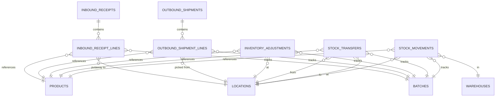

# Module 03 - Inventory Operations: Base Implementation Guide

## 📋 Document Information

| Property | Value |
|----------|-------|
| **Module** | Inventory Operations (Phase 3: Business Flows) |
| **Document Type** | Base Implementation Guide |
| **Version** | 1.0 |
| **Date** | February 01, 2026 |
| **Status** | Ready for Implementation |

---

## 📑 Table of Contents

1. [Overview](#overview)
2. [Package Structure](#package-structure)
3. [Common Components](#common-components)
4. [Implementation Guidelines](#implementation-guidelines)
5. [Quick Reference](#quick-reference)

---

## 🎯 Overview

This document provides the foundation for implementing Module 3: Inventory Operations. It defines common patterns, shared components, and implementation guidelines that apply to all features in this module.

### Module Features
1. **Feature 1**: Inbound Operations (Goods Receipt)
2. **Feature 2**: Outbound Operations (Shipment)
3. **Feature 3**: Stock Movement & Audit Trail
4. **Feature 4**: Inventory Adjustment
5. **Feature 5**: Stock Transfer Between Locations

### Design Principles
- **Layered Architecture**: Controller → Service → Repository → Entity
- **Immutable Audit Trail**: All stock changes logged permanently
- **Transactional Consistency**: ACID compliance for inventory operations
- **Real-time Updates**: Stock updates immediately upon transaction completion
- **FIFO Allocation**: First-In-First-Out for stock picking

---

## 📁 Package Structure

```
src/main/java/org/demo/whs/inventory/
├── controller/
│   ├── InboundReceiptController.java
│   ├── OutboundShipmentController.java
│   ├── StockMovementController.java
│   ├── InventoryAdjustmentController.java
│   └── StockTransferController.java
├── service/
│   ├── InboundReceiptService.java + Impl
│   ├── OutboundShipmentService.java + Impl
│   ├── StockMovementService.java + Impl
│   ├── InventoryAdjustmentService.java + Impl
│   ├── StockTransferService.java + Impl
│   ├── StockService.java + Impl (common stock operations)
│   ├── StockAllocationService.java + Impl (FIFO logic)
│   └── DocumentNumberService.java + Impl (number generation)
├── entity/
│   ├── InboundReceipt.java + InboundReceiptLine.java
│   ├── OutboundShipment.java + OutboundShipmentLine.java
│   ├── StockMovement.java
│   ├── InventoryAdjustment.java
│   ├── StockTransfer.java
│   └── enums/ (all status enums)
├── repository/
│   └── (JpaRepository for each entity)
├── dto/
│   ├── request/ (organized by feature)
│   └── response/ (organized by feature)
├── mapper/
│   └── (MapStruct mappers for entity-DTO conversion)
└── exception/
    └── (Custom business exceptions)
```

---

## 🔧 Common Components

### 1. DocumentNumberService
**Purpose**: Generate unique sequential document numbers

**Format**: `{PREFIX}-YYYYMMDD-{SEQ}`
- GR-20260201-001 (Goods Receipt)
- SH-20260201-001 (Shipment)
- ADJ-20260201-001 (Adjustment)
- TRF-20260201-001 (Transfer)

**Implementation**:
- Uses Redis atomic counter for thread-safety
- Sequence resets daily
- 2-day expiration for cleanup

### 2. StockService
**Purpose**: Common stock operations (increase/decrease/reserve/release)

**Key Methods**:
- `increaseStock()` - For inbound operations
- `decreaseStock()` - For outbound operations
- `reserveStock()` - For confirmed shipments
- `releaseReservation()` - For cancelled shipments

**Responsibilities**:
- Update `inventory_stock` table
- Trigger `StockMovementService` for audit trail
- Validate stock availability
- Handle batch tracking

### 3. StockMovementService
**Purpose**: Immutable audit logging of all stock changes

**Key Features**:
- Uses `REQUIRES_NEW` transaction propagation
- Cannot be edited or deleted after creation
- Automatically called by all stock operations
- Supports complex queries and exports

### 4. StockAllocationService
**Purpose**: FIFO stock allocation for shipments

**Algorithm**:
1. Find available stock for product at warehouse
2. Sort by batch manufacturing_date ASC (oldest first)
3. Allocate stock from oldest batches first
4. Create stock reservation records

---

## 📊 Entity Relationships



---

## ⚙️ Status Workflows

### Inbound Receipt Workflow
```
DRAFT → CONFIRMED → COMPLETED
         ↓
     CANCELLED
```
- **DRAFT**: Editable, no stock impact
- **CONFIRMED**: Locked, ready for putaway
- **COMPLETED**: Stock increased, locations assigned
- **CANCELLED**: Rejected/cancelled

### Outbound Shipment Workflow
```
DRAFT → PICKING → PICKED → SHIPPED
         ↓          ↓         
     CANCELLED  CANCELLED    
```
- **DRAFT**: Editable, no stock impact
- **PICKING**: Staff picking items
- **PICKED**: Picked and packed, ready to ship
- **SHIPPED**: Stock decreased, delivered to carrier
- **CANCELLED**: Cancelled at any stage

### Inventory Adjustment Workflow
```
PENDING_APPROVAL → APPROVED → COMPLETED
         ↓
     REJECTED
```
- **PENDING_APPROVAL**: Waiting for manager approval
- **APPROVED**: Approved by manager, ready to execute
- **REJECTED**: Rejected by manager
- **COMPLETED**: Stock adjusted

### Stock Transfer Workflow
```
DRAFT → IN_PROGRESS → COMPLETED
         ↓
     CANCELLED
```
- **DRAFT**: Editable, planned transfer
- **IN_PROGRESS**: Physical movement in progress
- **COMPLETED**: Stock moved between locations
- **CANCELLED**: Transfer cancelled

---

## 🔐 Permissions

### Permission Matrix

| Feature | View | Create | Update | Delete | Confirm/Complete | Approve |
|---------|------|--------|--------|--------|------------------|---------|
| Inbound Receipt | `INVENTORY:INBOUND:VIEW` | `CREATE` | `UPDATE` | `DELETE` | `CONFIRM` | - |
| Outbound Shipment | `INVENTORY:OUTBOUND:VIEW` | `CREATE` | `UPDATE` | `DELETE` | `CONFIRM` + `SHIP` | - |
| Stock Movement | `INVENTORY:AUDIT:VIEW` | - | - | - | - | `EXPORT` |
| Adjustment | `INVENTORY:ADJUSTMENT:VIEW` | `CREATE` | `UPDATE` | `DELETE` | `CREATE` | `APPROVE` |
| Transfer | `INVENTORY:TRANSFER:VIEW` | `CREATE` | `UPDATE` | `DELETE` | `CONFIRM` | - |

---

## 📝 Common DTOs

### Standard Response Wrapper
```java
ApiResponse<T>
  - success: boolean
  - message: string
  - data: T
  - errorCode: string
  - timestamp: LocalDateTime
```

### Paginated Response
```java
PageResponse<T>
  - content: List<T>
  - pageNumber: int
  - pageSize: int
  - totalElements: long
  - totalPages: int
  - last: boolean
  - first: boolean
```

### User Info (embedded in responses)
```java
UserInfoResponse
  - id: Long
  - username: String
  - fullName: String
```

---

## 🗄️ Database Schema Summary

### Core Tables

| Table | Purpose | Key Columns | Relationships |
|-------|---------|-------------|---------------|
| `inbound_receipts` | Inbound document header | receipt_number, purchase_order_id, warehouse_id, status | → inbound_receipt_lines |
| `inbound_receipt_lines` | Inbound line items | product_id, received_quantity, batch_id, location_id | → products, locations, batches |
| `outbound_shipments` | Outbound document header | shipment_number, sales_order_id, warehouse_id, status | → outbound_shipment_lines |
| `outbound_shipment_lines` | Outbound line items | product_id, shipped_quantity, batch_id, location_id | → products, locations, batches |
| `stock_movements` | Immutable audit log | movement_type, product_id, quantity_change, reference_type | → products, warehouses, locations, batches |
| `inventory_adjustments` | Adjustment records | adjustment_number, product_id, warehouse_id, location_id, status | → products, locations, batches |
| `stock_transfers` | Transfer document | transfer_number, product_id, from/to location_id | → locations, products, batches |

### Modified Tables
- `inventory`: Added `reserved_quantity` and `available_quantity` (computed)

---

## 🚨 Exception Handling

### Custom Exceptions

| Exception | HTTP Status | Use Case |
|-----------|-------------|----------|
| `InsufficientStockException` | 400 BAD_REQUEST | Not enough stock for operation |
| `InvalidStatusTransitionException` | 400 BAD_REQUEST | Invalid workflow state change |
| `DocumentNotFoundException` | 404 NOT_FOUND | Document ID not found |
| `StockReservationException` | 400 BAD_REQUEST | Cannot reserve/release stock |
| `DuplicateDocumentException` | 409 CONFLICT | Document number already exists |

---

## ✅ Validation Rules

### Common Validations
- All quantities must be > 0 (except adjustment_quantity can be negative)
- Dates cannot be in future (except shipment_date)
- Document status transitions must follow workflow
- Locations must be ACTIVE
- Products must be ACTIVE
- Batch number required if product.requires_batch_tracking = true
- Expiry date must be after manufacturing date

### Business Rules
- **Stock Reservation**: available_quantity = quantity_on_hand - reserved_quantity
- **FIFO Allocation**: Allocate oldest batch first (by manufacturing_date)
- **Approval Threshold**: Adjustment > 10% or > $1000 requires approval
- **Fraud Prevention**: Max 3 adjustments per product/location per day
- **Transfer Validation**: from_location_id ≠ to_location_id, same warehouse

---

## 🧪 Testing Guidelines

### Unit Tests
- Service layer business logic
- Status transition validation
- Quantity calculations
- FIFO allocation algorithm
- Approval workflow
- Fraud prevention rules

### Integration Tests
- API endpoints (CRUD + workflows)
- Database transactions
- Stock updates
- Audit trail logging
- Permission checks

### Performance Tests
- Query pagination (100k+ records)
- Excel export (50k records)
- Concurrent stock operations
- FIFO allocation with many batches

### Test Coverage Target
- Minimum 80% code coverage
- 100% coverage for critical paths (stock increase/decrease)

---

## 📚 Implementation Order

### Sprint 3.1 (2 weeks) - Foundation
1. Common services (DocumentNumber, Stock, StockMovement)
2. Feature 1: Goods Receipt (DRAFT → CONFIRMED → COMPLETED)
3. Basic stock increase logic
4. Unit tests + Integration tests

### Sprint 3.2 (2 weeks) - Outbound
1. Feature 2: Shipment (DRAFT → CONFIRMED → SHIPPED)
2. Stock reservation and FIFO allocation
3. Stock decrease logic
4. Unit tests + Integration tests

### Sprint 3.3 (1 week) - Audit
1. Feature 3: Stock Movement query APIs
2. Excel export functionality
3. Performance optimization
4. Unit tests + Integration tests

### Sprint 3.4 (1 week) - Adjustment
1. Feature 4: Inventory Adjustment with approval workflow
2. Threshold calculation
3. Fraud prevention
4. Unit tests + Integration tests

### Sprint 3.5 (1 week) - Transfer
1. Feature 5: Stock Transfer
2. Atomic transaction handling
3. Location validation
4. Unit tests + Integration tests

### Sprint 3.6 (1 week) - Polish
1. End-to-end integration testing
2. Performance tuning
3. Bug fixes
4. Documentation completion

---

## 🔗 Related Documents

- **[BA_MODULE_03_INVENTORY_OPERATIONS.md](./BA_MODULE_03_INVENTORY_OPERATIONS.md)** - Complete business requirements
- **[FEATURE_1_INBOUND_OPERATIONS.md](./FEATURE_1_INBOUND_OPERATIONS.md)** - Goods Receipt implementation
- **[FEATURE_2_OUTBOUND_OPERATIONS.md](./FEATURE_2_OUTBOUND_OPERATIONS.md)** - Shipment implementation
- **[FEATURE_3_STOCK_MOVEMENT_AUDIT.md](./FEATURE_3_STOCK_MOVEMENT_AUDIT.md)** - Audit trail implementation
- **[FEATURE_4_INVENTORY_ADJUSTMENT.md](./FEATURE_4_INVENTORY_ADJUSTMENT.md)** - Adjustment implementation
- **[FEATURE_5_STOCK_TRANSFER.md](./FEATURE_5_STOCK_TRANSFER.md)** - Transfer implementation

---

## 📋 Quick Reference

### Document Number Prefixes
- **GR**: Goods Receipt
- **SH**: Shipment
- **ADJ**: Inventory Adjustment
- **TRF**: Stock Transfer

### Movement Types
- **INBOUND**: From goods receipt
- **OUTBOUND**: From shipment
- **ADJUSTMENT**: From inventory adjustment
- **TRANSFER_OUT**: From stock transfer (source location)
- **TRANSFER_IN**: From stock transfer (destination location)
- **INITIAL_STOCK**: Initial stock load

### Key Service Methods

**StockService**:
- `increaseStock(productId, warehouseId, locationId, batch, qty, ...)`
- `decreaseStock(productId, warehouseId, locationId, batch, qty, ...)`
- `reserveStock(productId, warehouseId, locationId, batch, qty)`
- `releaseReservation(productId, warehouseId, locationId, batch, qty)`

**StockMovementService**:
- `logMovement(type, productId, qty, before, after, referenceType, referenceId, ...)`

**DocumentNumberService**:
- `generateDocumentNumber(prefix)` → PREFIX-YYYYMMDD-XXX

---

## ✨ Best Practices

### DO ✅
- Use constructor injection (`@RequiredArgsConstructor`)
- Write unit tests for all business logic
- Log important operations (INFO level)
- Use transactions appropriately (`@Transactional`)
- Validate all inputs with Jakarta Validation
- Handle exceptions gracefully
- Use meaningful variable names
- Document complex logic with Javadoc

### DON'T ❌
- Don't use field injection
- Don't put business logic in controllers
- Don't expose entities directly via API (use DTOs)
- Don't ignore exceptions
- Don't use hard-coded values
- Don't skip validation
- Don't log sensitive information (passwords, tokens)
- Don't modify immutable records (StockMovement)

---

**Document Version**: 1.0  
**Last Updated**: February 01, 2026  
**Status**: ✅ Ready for Implementation
