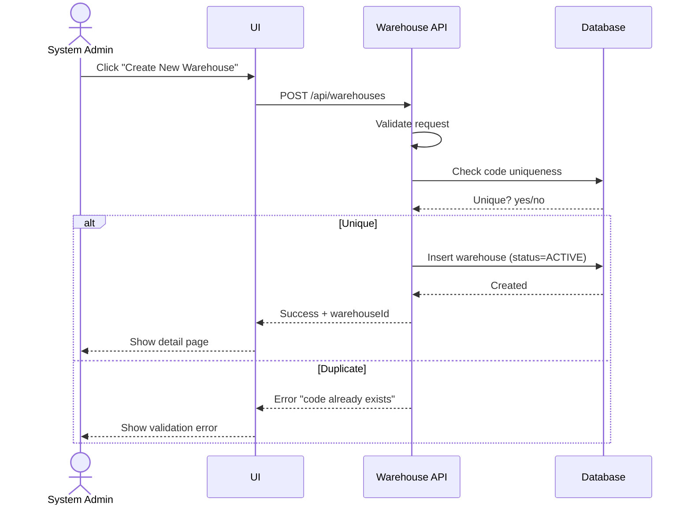
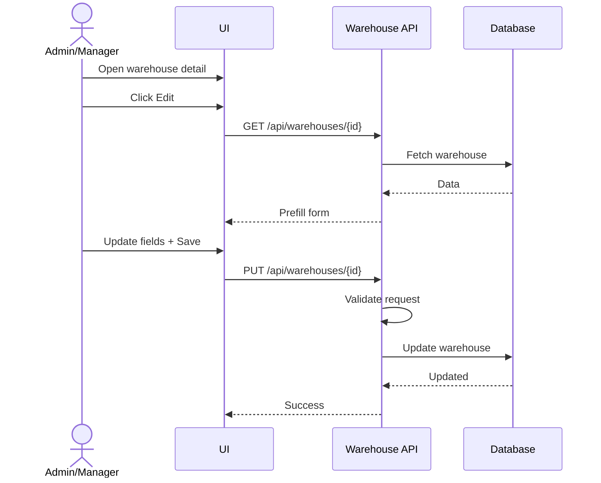
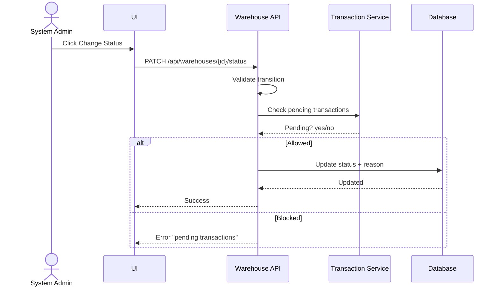
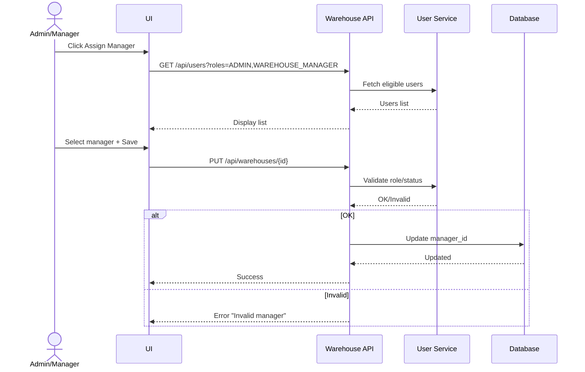

# Feature 1: Warehouse Management
## Business Requirements Specification

---

## Document Information

| Property | Value |
|----------|-------|
| Module | Master Data Management |
| Feature | Feature 1: Warehouse Management |
| Version | 1.0 |
| Date | January 29, 2026 |
| Status | Draft |
| Author | Business Analyst |

---

## Step 1 - Clarify Context

### Actors
- System Admin
- Warehouse Manager
- Inventory Controller (read-only)
- Accountant (read-only)

### Goals
- Create and maintain warehouse master data with consistent codes and audit trails.
- Control operational status without deleting historical data.
- Assign accountable managers to each warehouse.

### Triggers
- New warehouse onboarding.
- Business expansion or consolidation.
- Operational changes (maintenance, closure, re-opening).

### Pain Points
- Duplicate warehouse records.
- Inconsistent codes and names across departments.
- No audit trail or status control.

---

## Step 2 - User Stories

- As a System Admin, I want to create new warehouse records, so that I can set up multiple storage facilities in the system.
- As a Warehouse Manager, I want to view warehouse details including capacity and status, so that I can plan inventory allocation.
- As a System Admin, I want to activate/deactivate warehouses, so that I can control which facilities are operational without deleting historical data.
- As a Warehouse Manager, I want to assign a warehouse manager to each facility, so that there is clear accountability.

---

## Step 3 - Use Case Specifications

### UC-MD-01 - Create Warehouse

**Brief Description**: Create a new warehouse master record with unique code and default status ACTIVE.

**Primary Actor**: System Admin

**Secondary Actors**: None

**Pre-conditions**:
- User is authenticated with ADMIN role.
- User has CREATE_WAREHOUSE permission.

**Post-conditions**:
- Warehouse is created with ACTIVE status.
- Audit fields (created_by, created_at) are recorded.

**Main Flow**:
1. User opens Warehouse Management.
2. User clicks "Create New Warehouse".
3. System shows creation form.
4. User enters warehouse data:
   - code (unique, alphanumeric, max 20)
   - name (required, max 100)
   - address fields (address, city, state, country, postal_code)
   - contact (phone, email)
   - type (MAIN, SATELLITE, TRANSIT, RETURN)
   - capacity (optional, > 0)
   - manager (select from active accounts)
5. User clicks Save.
6. System validates fields.
7. System checks code uniqueness.
8. System creates warehouse with status ACTIVE.
9. System logs audit data.
10. System returns success and shows detail page.

**Alternative Flows**:
- A1: Validation errors
  - System highlights invalid fields and keeps form data.
- A2: Duplicate code
  - System returns error "Warehouse code already exists".

**Exception Flows**:
- E1: Database error
  - System returns a generic error; no record is created.

**Rules & Constraints**:
- code is unique and immutable after creation.
- email must match a valid email format if provided.
- capacity is optional but must be positive.

**Mermaid Diagram**:


---

### UC-MD-02 - Update Warehouse

**Brief Description**: Update warehouse details; code cannot be changed.

**Primary Actor**: System Admin or Warehouse Manager

**Secondary Actors**: None

**Pre-conditions**:
- User has UPDATE_WAREHOUSE permission.
- Warehouse exists.

**Post-conditions**:
- Warehouse data is updated.
- Audit fields (updated_by, updated_at) are updated.

**Main Flow**:
1. User searches and opens warehouse detail.
2. User clicks Edit.
3. System displays form with pre-filled data.
4. User updates allowed fields (code read-only).
5. User clicks Save.
6. System validates changes.
7. System updates warehouse record.
8. System logs audit data.
9. System returns success and refreshed detail view.

**Alternative Flows**:
- A1: User cancels edit
  - System returns to detail without changes.
- A2: Concurrent update detected
  - System returns conflict error; user must reload.

**Exception Flows**:
- E1: Database error
  - System returns a generic error; no changes are persisted.

**Rules & Constraints**:
- code is immutable.
- manager must have ADMIN or WAREHOUSE_MANAGER role.

**Mermaid Diagram**:


---

### UC-MD-03 - Change Warehouse Status

**Brief Description**: Change status to ACTIVE, INACTIVE, or MAINTENANCE without deleting data.

**Primary Actor**: System Admin

**Secondary Actors**: None

**Pre-conditions**:
- User has UPDATE_WAREHOUSE permission.
- Warehouse exists.

**Post-conditions**:
- Status is updated and logged with reason (if provided).

**Main Flow**:
1. User opens warehouse detail.
2. User clicks Change Status.
3. System shows status options.
4. User selects new status and optional reason.
5. User confirms.
6. System validates transition.
7. System updates status.
8. System logs status change.
9. System returns success.

**Alternative Flows**:
- A1: Pending transactions exist and status = INACTIVE
  - System warns and blocks unless force-confirmed.
- A2: User cancels
  - No changes saved.

**Exception Flows**:
- E1: Invalid transition
  - System rejects with explicit error code.

**Rules & Constraints**:
- ACTIVE -> INACTIVE allowed only if no pending transactions.
- INACTIVE -> ACTIVE always allowed.
- Any -> MAINTENANCE allowed.
- MAINTENANCE -> ACTIVE allowed when maintenance complete.

**Mermaid Diagram**:


---

### UC-MD-04 - Assign Warehouse Manager

**Brief Description**: Assign a primary manager to a warehouse.

**Primary Actor**: System Admin or Warehouse Manager

**Secondary Actors**: None

**Pre-conditions**:
- User has UPDATE_WAREHOUSE permission.
- Warehouse exists.
- Manager account exists and is active.

**Post-conditions**:
- Warehouse has exactly one assigned manager.

**Main Flow**:
1. User opens warehouse detail.
2. User clicks Assign Manager.
3. System lists eligible users (ADMIN, WAREHOUSE_MANAGER).
4. User selects a manager.
5. User clicks Save.
6. System validates role and status.
7. System updates manager_id.
8. System logs audit data.
9. System returns success.

**Alternative Flows**:
- A1: Selected user is not eligible
  - System rejects with error "Invalid manager role".

**Exception Flows**:
- E1: Selected user is inactive/locked
  - System rejects with error "User not active".

**Rules & Constraints**:
- Only ADMIN or WAREHOUSE_MANAGER roles are eligible.
- One warehouse has only one primary manager.
- One manager may manage multiple warehouses.

**Mermaid Diagram**:


---

## Step 4 - Acceptance Criteria

**AC-MD-WH-01 - Create Warehouse**
```gherkin
Given I am authenticated as System Admin
When I submit a warehouse creation form with valid data
Then a new warehouse record is created with status ACTIVE
And the warehouse code is unique
And created_by and created_at are populated
```

**AC-MD-WH-02 - Validation Rules**
```gherkin
Given I am creating or updating a warehouse
When I submit the form
Then code is alphanumeric and 1-20 characters
And name is required and max 100 characters
And email is valid format if provided
And type is one of MAIN, SATELLITE, TRANSIT, RETURN
And capacity is positive if provided
```

**AC-MD-WH-03 - Change Status**
```gherkin
Given a warehouse has pending inbound or outbound transactions
When I attempt to change status to INACTIVE
Then the system blocks the action and displays a warning
```

**AC-MD-WH-04 - Assign Manager**
```gherkin
Given I assign a manager to a warehouse
When I select a user account
Then only ADMIN or WAREHOUSE_MANAGER roles are allowed
And the warehouse has only one manager
And one manager may manage multiple warehouses
```

**AC-MD-WH-05 - Search and Filter**
```gherkin
Given I am on the warehouse list page
When I search by code or name
Then the system returns matching warehouses
And I can filter by status and type
And results are paginated with default size 20
```

---

## Step 5 - Backend Impact Analysis

### API Impacts
- `GET /api/warehouses`
  - Query params: search, status, type, page, size, sort
- `GET /api/warehouses/{id}`
- `POST /api/warehouses`
  - Request: code, name, address fields, contact fields, type, capacity, manager_id
- `PUT /api/warehouses/{id}`
  - Request: editable fields only; code excluded
- `PATCH /api/warehouses/{id}/status`
  - Request: status, reason
- `GET /api/warehouses/{id}/locations`

### Request Validation Rules
- code: required, alphanumeric, 1-20 chars, unique
- name: required, max 100 chars
- email: valid format if provided
- type: MAIN | SATELLITE | TRANSIT | RETURN
- capacity: positive if provided
- manager_id: must reference active user with ADMIN or WAREHOUSE_MANAGER role

### Response Data
- id, code, name, status, type, capacity
- address fields, contact fields
- manager_id, manager_name
- created_by, created_at, updated_by, updated_at

### Error Codes
- WAREHOUSE_CODE_DUPLICATE
- WAREHOUSE_NOT_FOUND
- WAREHOUSE_STATUS_INVALID_TRANSITION
- WAREHOUSE_HAS_PENDING_TRANSACTIONS
- MANAGER_INVALID_ROLE
- USER_NOT_ACTIVE

### Database Impacts
- Table: `warehouses`
- Key columns: code (unique), status, type, capacity, manager_id
- Audit columns: created_at, updated_at, created_by, updated_by
- Indexes: idx_code, idx_status, idx_type

### Async / Background Jobs
- None required for this feature.

---

## BA Review Checklist

- [x] Actors identified
- [x] Preconditions defined
- [x] Business rules documented
- [x] Validation rules explicit
- [x] Success + alternative + exception flows present
- [x] API and data impacts defined
- [x] Acceptance criteria cover normal and edge cases
