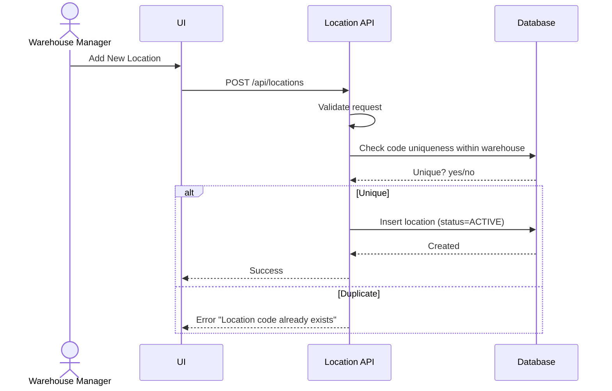
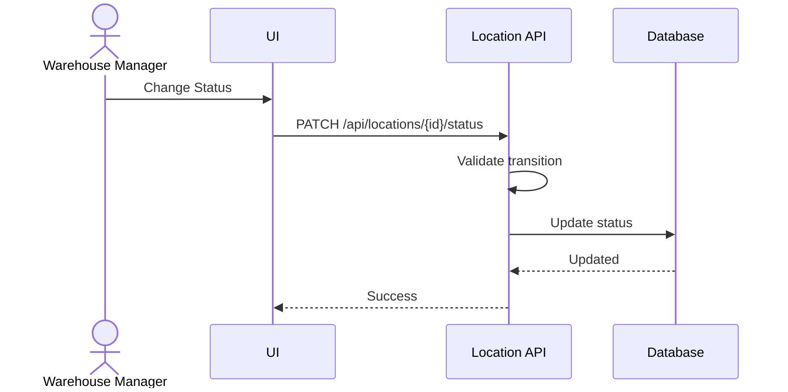

# Feature 2: Location Management
## Business Requirements Specification

---

## Document Information

| Property | Value |
|----------|-------|
| Module | Master Data Management |
| Feature | Feature 2: Location Management |
| Version | 1.0 |
| Date | January 29, 2026 |
| Status | Draft |
| Author | Business Analyst |

---

## Step 1 - Clarify Context

### Actors
- Warehouse Manager
- Inventory Controller (read-only)
- System Admin (supervisor)

### Goals
- Create and manage storage locations within a warehouse.
- Ensure location codes are unique within each warehouse.
- Control location status to prevent invalid storage operations.

### Triggers
- New warehouse setup.
- Expansion of storage zones or rack/bin structure.
- Maintenance or temporary closure of locations.

### Pain Points
- Non-standard location codes leading to misplacement.
- No status control for unavailable locations.
- Difficulty finding locations by zone or type.

---

## Step 2 - User Stories

- As a Warehouse Manager, I want to define storage locations within my warehouse, so that inventory can be stored in organized positions.
- As an Inventory Controller, I want to view location capacity and current utilization, so that I can place items in available locations.
- As a Warehouse Manager, I want to assign zones to locations, so that I can group related storage areas.
- As a Warehouse Manager, I want to mark locations as FULL when they reach capacity, so that no more items are assigned there.

---

## Step 3 - Use Case Specifications

### UC-MD-04 - Create Location

**Brief Description**: Create a new storage location in a warehouse.

**Primary Actor**: Warehouse Manager

**Pre-conditions**:
- User has CREATE_LOCATION permission.
- Target warehouse exists and status is ACTIVE.

**Post-conditions**:
- Location is created with ACTIVE status.
- Location is linked to the warehouse.

**Main Flow**:
1. User opens Warehouse Detail.
2. User clicks "Manage Locations".
3. User clicks "Add New Location".
4. System displays location creation form.
5. User enters location details:
   - code (unique within warehouse, max 50)
   - name (required, max 100)
   - zone (optional, max 50)
   - type (STORAGE, PICKING, PACKING, STAGING, RETURN)
   - capacity (optional, > 0)
   - notes (optional)
6. User clicks Save.
7. System validates fields.
8. System checks code uniqueness within warehouse.
9. System creates location with status ACTIVE.
10. System logs audit data.
11. System returns success and refreshes location list.

**Alternative Flows**:
- A1: Duplicate code in same warehouse
  - System returns error "Location code already exists".
- A2: Warehouse is INACTIVE
  - System blocks and returns error "Warehouse inactive".

**Exception Flows**:
- E1: Database error
  - System returns a generic error; no record created.

**Rules & Constraints**:
- Location code uniqueness scope: warehouse_id + code.
- Location cannot be created under INACTIVE or MAINTENANCE warehouse.

**Mermaid Diagram**:


---

### UC-MD-05 - Update Location Status

**Brief Description**: Change the location status to control storage availability.

**Primary Actor**: Warehouse Manager

**Pre-conditions**:
- User has UPDATE_LOCATION permission.
- Location exists.

**Post-conditions**:
- Location status is updated and effective for allocation logic.

**Main Flow**:
1. User opens Location Detail.
2. User clicks "Change Status".
3. System displays status options: ACTIVE, INACTIVE, FULL, MAINTENANCE.
4. User selects new status and confirms.
5. System validates transition.
6. System updates status.
7. System logs audit data.
8. System returns success.

**Alternative Flows**:
- A1: Location has inventory and status = INACTIVE
  - System shows warning and requires confirmation.
- A2: Status = FULL auto-set by system
  - System sets FULL when capacity reached.

**Exception Flows**:
- E1: Invalid transition
  - System returns explicit error.

**Rules & Constraints**:
- FULL locations are excluded from allocation.
- MAINTENANCE locations are read-only.

**Mermaid Diagram**:


---

## Step 4 - Acceptance Criteria

**AC-MD-LOC-01 - Create Location**
```gherkin
Given I am a Warehouse Manager for warehouse W1
When I create a location with code "A01-R01-B01" in warehouse W1
Then the location is created successfully
And location code is unique within warehouse W1
And status is ACTIVE by default
```

**AC-MD-LOC-02 - Warehouse Inactive**
```gherkin
Given warehouse W1 is INACTIVE
When I try to create a location in W1
Then the system rejects the request with error "Warehouse inactive"
```

**AC-MD-LOC-03 - Status Change with Inventory**
```gherkin
Given a location has inventory
When I change status to INACTIVE
Then the system shows a warning and requires confirmation
```

**AC-MD-LOC-04 - Search and Filter**
```gherkin
Given I am on the location list
When I filter by zone "Freezer" and status ACTIVE
Then the system returns matching locations
And results are paginated
```

---

## Step 5 - Backend Impact Analysis

### API Impacts
- `GET /api/locations`
  - Query params: warehouse_id, code, zone, type, status, page, size, sort
- `GET /api/locations/{id}`
- `POST /api/locations`
- `PUT /api/locations/{id}`
- `PATCH /api/locations/{id}/status`
- `POST /api/locations/bulk`

### Request Validation Rules
- code: required, max 50 chars, unique per warehouse
- name: required, max 100 chars
- warehouse_id: must reference ACTIVE warehouse
- type: STORAGE | PICKING | PACKING | STAGING | RETURN
- capacity: positive if provided

### Response Data
- id, warehouse_id, code, name, zone, type, status
- capacity, utilization
- created_by, created_at, updated_by, updated_at

### Error Codes
- LOCATION_CODE_DUPLICATE
- LOCATION_NOT_FOUND
- WAREHOUSE_INACTIVE
- LOCATION_STATUS_INVALID_TRANSITION

### Database Impacts
- Table: `locations`
- Key columns: warehouse_id, code, zone, type, status, capacity
- Constraints: unique (warehouse_id, code)
- Indexes: idx_warehouse_id, idx_zone, idx_status, idx_type

### Async / Background Jobs
- None required for this feature.

---

## BA Review Checklist

- [x] Actors identified
- [x] Preconditions defined
- [x] Business rules documented
- [x] Validation rules explicit
- [x] Success + alternative + exception flows present
- [x] API and data impacts defined
- [x] Acceptance criteria cover normal and edge cases
