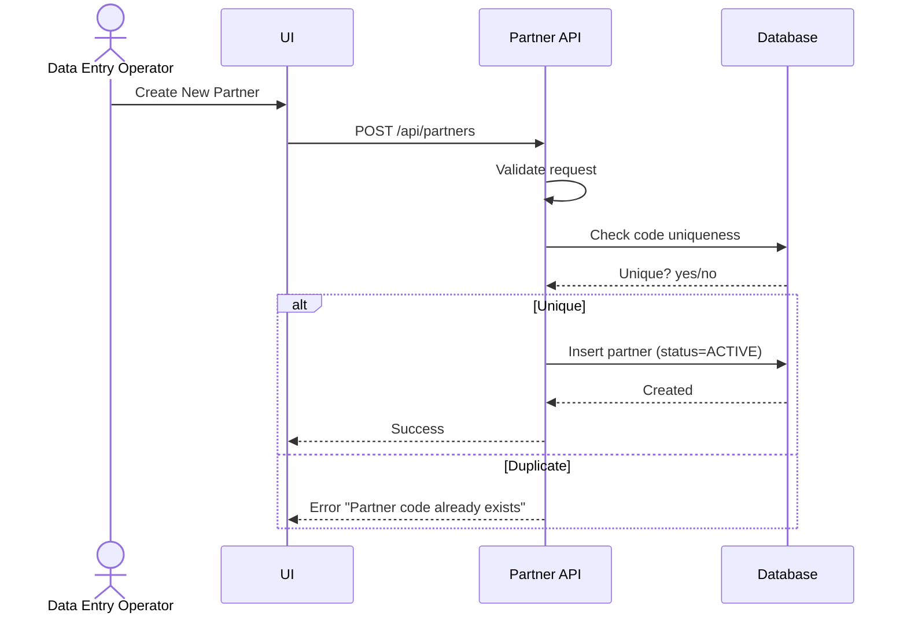
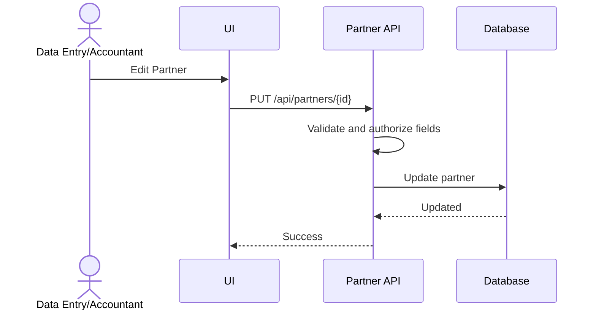
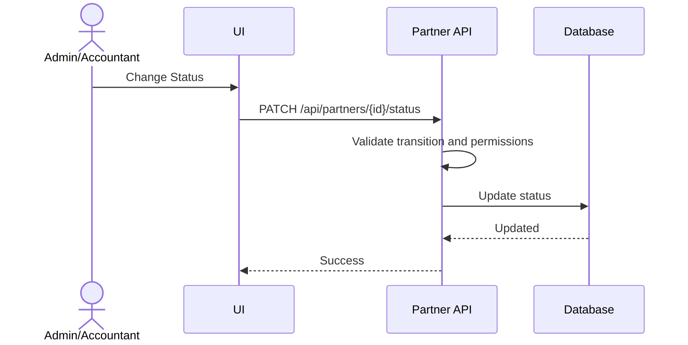

# Feature 5: Business Partner Management
## Business Requirements Specification

---

## Document Information

| Property | Value |
|----------|-------|
| Module | Master Data Management |
| Feature | Feature 5: Business Partner Management |
| Version | 1.0 |
| Date | January 29, 2026 |
| Status | Draft |
| Author | Business Analyst |

---

## Step 1 - Clarify Context

### Actors
- Data Entry Operator
- Accountant
- System Admin
- Warehouse Manager (read-only)

### Goals
- Maintain supplier and customer master data.
- Enforce credit limit and partner status rules.
- Ensure partners are searchable and auditable.

### Triggers
- New supplier onboarding.
- New customer onboarding.
- Finance updates credit terms.

### Pain Points
- Duplicate partner records.
- Unclear status rules for blacklisted partners.
- Missing financial constraints during order creation.

---

## Step 2 - User Stories

- As a Data Entry Operator, I want to create supplier records, so that we can track purchases.
- As a Data Entry Operator, I want to create customer records, so that we can track sales.
- As an Accountant, I want to set credit limits for customers, so that sales orders respect financial constraints.
- As a Warehouse Manager, I want to view supplier contact information, so that I can coordinate incoming shipments.

---

## Step 3 - Use Case Specifications

### UC-MD-11 - Create Business Partner

**Brief Description**: Create a supplier/customer record with unique code.

**Primary Actor**: Data Entry Operator

**Pre-conditions**:
- User has CREATE_PARTNER permission.

**Post-conditions**:
- Partner created with status ACTIVE.

**Main Flow**:
1. User opens Business Partner Management.
2. User clicks "Create New Partner".
3. System displays creation form.
4. User enters partner data:
   - code (unique, 1-20)
   - name (required, max 200)
   - type (SUPPLIER, CUSTOMER, BOTH)
   - contact_person (optional)
   - email (optional, valid format)
   - phone (optional, max 20)
   - address fields
   - tax_id (optional)
   - payment_terms (optional)
   - credit_limit (optional, customers only)
   - notes (optional)
5. User clicks Save.
6. System validates fields.
7. System checks code uniqueness.
8. System creates partner with status ACTIVE.
9. System logs audit data.
10. System returns success.

**Alternative Flows**:
- A1: Duplicate code
  - System returns error "Partner code already exists".

**Exception Flows**:
- E1: Database error
  - System returns a generic error.

**Rules & Constraints**:
- credit_limit is allowed only for CUSTOMER or BOTH.
- code is immutable after creation.

**Mermaid Diagram**:


---

### UC-MD-12 - Update Business Partner

**Brief Description**: Update partner information with role-based field restrictions.

**Primary Actor**: Data Entry Operator or Accountant

**Pre-conditions**:
- User has UPDATE_PARTNER permission.
- Partner exists.

**Post-conditions**:
- Partner updated with audit fields.

**Main Flow**:
1. User opens partner detail.
2. User clicks Edit.
3. System displays update form.
4. User modifies allowed fields (code read-only).
5. User clicks Save.
6. System validates changes.
7. System enforces role-based restrictions.
8. System updates partner record.
9. System logs audit data.
10. System returns success.

**Alternative Flows**:
- A1: Non-accountant attempts to change credit_limit
  - System rejects with error "Insufficient permission".

**Rules & Constraints**:
- Only Accountant can update credit_limit and payment_terms.

**Mermaid Diagram**:


---

### UC-MD-13 - Change Partner Status

**Brief Description**: Change partner status to ACTIVE, INACTIVE, or BLACKLISTED.

**Primary Actor**: System Admin or Accountant

**Pre-conditions**:
- User has UPDATE_PARTNER permission.
- Partner exists.

**Post-conditions**:
- Partner status updated; order creation respects status.

**Main Flow**:
1. User opens partner detail.
2. User clicks "Change Status".
3. System shows status options.
4. User selects status and provides reason (required for BLACKLISTED).
5. User confirms.
6. System validates transition and permissions.
7. System updates status.
8. System logs audit data.
9. System returns success.

**Alternative Flows**:
- A1: Changing to INACTIVE with pending orders
  - System warns and requires confirmation.
- A2: Non-admin attempts BLACKLISTED
  - System rejects with error "Only ADMIN can blacklist".

**Rules & Constraints**:
- BLACKLISTED partners cannot be used for new orders.
- Reason is mandatory for BLACKLISTED.

**Mermaid Diagram**:


---

## Step 4 - Acceptance Criteria

**AC-MD-PARTNER-01 - Create Partner**
```gherkin
Given I am a Data Entry Operator
When I create a supplier with valid code and name
Then the partner is created with status ACTIVE
And code is unique across all partners
```

**AC-MD-PARTNER-02 - Credit Limit**
```gherkin
Given I am an Accountant
When I set credit_limit to 10000 for a customer
Then the system saves the limit
And non-accountant users cannot change credit_limit
```

**AC-MD-PARTNER-03 - Blacklist**
```gherkin
Given a partner is BLACKLISTED
When I try to create a sales or purchase order with this partner
Then the system blocks the operation and returns error "Partner is blacklisted"
```

**AC-MD-PARTNER-04 - Search**
```gherkin
Given multiple partners exist
When I search by code or name
Then the system returns matching partners
And results are paginated
```

---

## Step 5 - Backend Impact Analysis

### API Impacts
- `GET /api/partners`
  - Query params: search, type, status, page, size, sort
- `GET /api/partners/{id}`
- `POST /api/partners`
- `PUT /api/partners/{id}`
- `PATCH /api/partners/{id}/status`
- `GET /api/partners/suppliers`
- `GET /api/partners/customers`

### Request Validation Rules
- code: required, 1-20, unique
- name: required, max 200
- type: SUPPLIER | CUSTOMER | BOTH
- email: valid format if provided
- credit_limit: >= 0 if provided

### Response Data
- id, code, name, type, status
- contact_person, email, phone, address
- credit_limit, payment_terms
- created_by, created_at, updated_by, updated_at

### Error Codes
- PARTNER_CODE_DUPLICATE
- PARTNER_NOT_FOUND
- PARTNER_STATUS_INVALID
- PARTNER_BLACKLISTED
- PARTNER_PERMISSION_DENIED

### Database Impacts
- Table: `business_partners`
- Key columns: code, name, type, status, credit_limit
- Indexes: idx_code, idx_type, idx_status, idx_name

### Async / Background Jobs
- None required for this feature.

---

## BA Review Checklist

- [x] Actors identified
- [x] Preconditions defined
- [x] Business rules documented
- [x] Validation rules explicit
- [x] Success + alternative + exception flows present
- [x] API and data impacts defined
- [x] Acceptance criteria cover normal and edge cases
