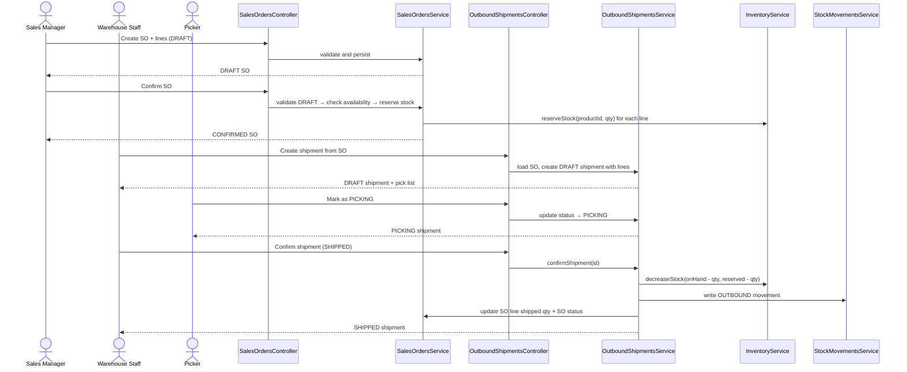

# BA Document — Module 6: Outbound Operations (V2)
## Business Analysis & Technical Specification — Đồng bộ với Inbound Module

---

## 📋 Document Information

| Property | Value |
|----------|-------|
| **Module** | Outbound Operations (Sales Orders + Shipments) |
| **Version** | 2.0 |
| **Date** | March 9, 2026 |
| **Status** | Ready for Development |
| **Supersedes** | BA_MODULE_06_OUTBOUND_OPERATIONS.md v1.0 |
| **Sync with** | Inbound Module (BA_MODULE_05, INBOUND_MODULE_REVIEW_AND_PLAN_20260307) |

---

## 1. Recommendation

Module **Outbound Operations** nên triển khai **SAU** khi Inbound chain hoàn thành, theo execution order:

`WHS-47 → WHS-48 → WHS-49 → WHS-50`

Lý do:
- Outbound phụ thuộc vào `reserve`/`unreserve`/`decrease` của Inventory, phức tạp hơn Inbound (`increase`)
- Inbound sẽ tạo dữ liệu tồn kho thực tế để test outbound flows
- Pattern từ Inbound (DRAFT-only guard, confirm transaction, stock movement writer) sẽ được reuse 1:1
- FIFO recommendations cần có batch data từ inbound receipts

---

## 2. Jira Sync

| Jira | Scope | Priority | Status |
|------|-------|----------|--------|
| `WHS-47` | Sales Orders API Completion | High | To Do |
| `WHS-48` | Sales Order Lines API Completion | High | To Do |
| `WHS-49` | Outbound Shipments API Completion | Highest | To Do |
| `WHS-50` | Outbound Shipment Lines API Completion | High | To Do |
| `WHS-59` | SO CRUD endpoints | — | To Do |
| `WHS-60` | SO confirm + cancel | — | To Do |
| `WHS-61` | SO Lines CRUD | — | To Do |
| `WHS-62` | Shipment CRUD + query | — | To Do |
| `WHS-63` | Shipment confirm + pick | — | To Do |
| `WHS-65` | Shipment lines APIs | — | To Do |

---

## 3. Code Sync

### 3.1 Hiện trạng code

Các file hiện mới ở mức skeleton (controller rỗng, service interface rỗng):

| File | Status |
|------|--------|
| `SalesOrdersController.java` | Shell only (0 endpoints) |
| `SalesOrderLinesController.java` | Shell only (0 endpoints), **BUG: inject SalesOrdersService thay vì SalesOrderLinesService** |
| `OutboundShipmentsController.java` | Shell only (0 endpoints), no service injected |
| `OutboundShipmentLinesController.java` | Shell only (0 endpoints), no service injected |
| `SalesOrdersService.java` | Empty interface |
| `SalesOrderLinesService.java` | Empty interface |
| `OutboundShipmentsService.java` | Empty interface |
| `OutboundShipmentLinesService.java` | Empty interface |

### 3.2 Nền DB hiện có

Migration đã có tables:
- `sales_orders` — CRUD fields + status lifecycle
- `sales_order_lines` — lineNumber, quantityOrdered, quantityShipped, unitPrice, lineTotal
- `outbound_shipments` — shipment lifecycle + tracking
- `outbound_shipment_lines` — quantityShipped, picked info

### 3.3 Entity Status

| Entity | Table Match | Issues |
|--------|-------------|--------|
| `SalesOrders.java` | ✅ OK | — |
| `SalesOrderLines.java` | ✅ OK | — |
| `OutboundShipments.java` | ✅ OK | — |
| `OutboundShipmentLines.java` | ⚠️ | `locationId` missing `nullable = false` (migration has NOT NULL) |

### 3.4 Các điểm cần sửa trước khi implement

1. **`SalesOrderLinesController.java`:** Đang inject `SalesOrdersService` thay vì `SalesOrderLinesService` → sửa
2. **`OutboundShipmentsController.java`:** Chưa inject service nào → thêm `OutboundShipmentsService`
3. **`OutboundShipmentLinesController.java`:** Chưa inject service nào → thêm `OutboundShipmentLinesService`
4. **`OutboundShipmentLines.java`:** `locationId` cần thêm `nullable = false` cho đồng bộ migration

---

## 4. Actors & Roles

| Actor | Role | Permissions |
|-------|------|-------------|
| **Sales Manager** | Quản lý đơn bán hàng | Create/update/delete/confirm/cancel SO |
| **Warehouse Staff** | Nhân viên kho | Create shipments, process picking, confirm shipment |
| **Picker** | Nhân viên picking | View pick list, scan/verify items |
| **Inventory Controller** | Giám sát tồn kho | View all, monitor stock decreases |
| **Viewer** | Xem báo cáo | Read-only access to SO and shipment lists |

---

## 5. Module Overview

### Core Entities

| Entity | Mô tả | Lifecycle |
|--------|--------|-----------|
| **Sales Orders** | Đơn bán hàng từ khách | `DRAFT → CONFIRMED → PARTIALLY_SHIPPED → COMPLETED` / `CONFIRMED → CANCELLED` |
| **Sales Order Lines** | Dòng sản phẩm trong đơn | Managed through SO aggregate |
| **Outbound Shipments** | Lô xuất hàng vật lý | `DRAFT → PICKING → PACKED → SHIPPED` / `DRAFT → CANCELLED` |
| **Outbound Shipment Lines** | Dòng sản phẩm trong lô xuất | Managed through shipment aggregate |

### Process Flow



---

## 6. Feature Specifications

### Feature 1: Sales Order Management

#### UC-OUT-01: Create Sales Order

**Pre-conditions:**
- User authenticated with SALES_MANAGER or ADMIN role
- Customer (BusinessPartner with type CUSTOMER) exists and is ACTIVE

**Main Flow:**
1. User sends POST `/api/v1/sales-orders` with customer, warehouse, delivery date, lines
2. System validates customerId exists, type = CUSTOMER/BOTH, status = ACTIVE
3. System validates warehouseId exists and is ACTIVE
4. System validates each line: productId exists, active, quantityOrdered > 0, unitPrice >= 0
5. System generates SO number: `SO-YYYY-NNNN`
6. System computes `lineTotal = quantityOrdered × unitPrice` per line
7. System computes `subTotal = Σ lineTotal`, `taxAmount`, `totalAmount`
8. System persists SO with status `DRAFT` + all lines
9. Return 201 Created

**Alternative Flows:**
- A1: Lines array empty → 400 `OUT_001` "SO must have at least one line"
- A2: Customer inactive → 400 `OUT_002` "Customer not active"

**Business Rules:**
- `BR-OUT-01`: SO number format `SO-YYYY-NNNN`, auto-increment per year
- `BR-OUT-02`: `quantityShipped` initialized to `0` for all lines
- `BR-OUT-03`: DRAFT SO is fully editable (lines, dates, notes)

---

#### UC-OUT-02: Confirm Sales Order (Reserve Stock)

**Pre-conditions:**
- SO exists and is in `DRAFT` status
- Sufficient available stock for ALL lines

**Main Flow:**
1. User sends PUT `/api/v1/sales-orders/{id}/confirm`
2. System validates SO status == `DRAFT`
3. System checks availability for ALL lines (atomic check):
   ```
   For each SO line:
     available = SUM(inventory.onHandQuantity) - SUM(inventory.reservedQuantity)
                 WHERE product = line.product AND warehouse = SO.warehouse
                 AND batch.status != QUARANTINE (if batch-tracked)
     IF available < line.quantityOrdered → fail entire operation
   ```
4. System reserves stock for ALL lines (atomic):
   ```
   For each SO line:
     inventory.reservedQuantity += line.quantityOrdered
   ```
5. System updates SO.status = `CONFIRMED`, confirmedAt, confirmedBy
6. Return 200 OK

**Exception Flows:**
- E1: Insufficient stock for ANY line → 400 `OUT_003` "Insufficient stock for product {sku}: available={x}, requested={y}"
- E2: SO not DRAFT → 400 `OUT_004` "Can only confirm DRAFT orders"

**Business Rules:**
- `BR-OUT-04`: Reservation is ALL-OR-NOTHING (atomic transaction)
- `BR-OUT-05`: CONFIRMED SO **cannot** be edited (must cancel first)
- `BR-OUT-06`: Available stock excludes QUARANTINE batches

---

#### UC-OUT-03: Cancel Sales Order (Unreserve Stock)

**Pre-conditions:**
- SO exists and is in `CONFIRMED` status
- No shipments created yet (or all shipments in DRAFT/CANCELLED)

**Main Flow:**
1. User sends PUT `/api/v1/sales-orders/{id}/cancel`
2. System validates SO status == `CONFIRMED`
3. System validates no active shipments (status not in PICKING/PACKED/SHIPPED)
4. System unreserves stock for ALL lines:
   ```
   For each SO line:
     remaining_to_unreserve = line.quantityOrdered - line.quantityShipped
     inventory.reservedQuantity -= remaining_to_unreserve
   ```
5. System updates SO.status = `CANCELLED`
6. Return 200 OK

**Exception Flows:**
- E1: SO has active shipments → 400 `OUT_005` "Cannot cancel SO with active shipments"
- E2: SO not CONFIRMED → 400 `OUT_006` "Can only cancel CONFIRMED orders"

**Business Rules:**
- `BR-OUT-07`: Unreservation is atomic
- `BR-OUT-08`: Cancelled orders retained for audit trail
- `BR-OUT-09`: `PARTIALLY_SHIPPED` orders cannot be cancelled (must handle via returns in future)

---

### Feature 2: Shipment Processing

#### UC-OUT-04: Create Shipment

**Pre-conditions:**
- SO exists and is in `CONFIRMED` or `PARTIALLY_SHIPPED` status

**Main Flow:**
1. User sends POST `/api/v1/outbound-shipments` with salesOrderId, lines
2. System validates SO status ∈ {CONFIRMED, PARTIALLY_SHIPPED}
3. System generates shipment number: `SHIP-YYYY-NNNN`
4. System sets warehouseId from SO
5. For each shipment line:
   - Validates salesOrderLineId belongs to the SO
   - Validates quantityShipped > 0
   - Validates quantityShipped ≤ remaining (= SO_line.quantityOrdered - SO_line.quantityShipped)
   - Validates locationId belongs to SO.warehouseId
   - Validates batchId if product is batch-tracked
6. System persists shipment with status `DRAFT`
7. Return 201 Created

**Business Rules:**
- `BR-OUT-10`: Shipment number format `SHIP-YYYY-NNNN`
- `BR-OUT-11`: Multiple shipments per SO allowed (partial shipments)
- `BR-OUT-12`: Total shipped across all shipments ≤ ordered quantity per line

---

#### UC-OUT-05: Pick Items (Start Picking)

**Pre-conditions:**
- Shipment exists and is in `DRAFT` status

**Main Flow:**
1. User sends PUT `/api/v1/outbound-shipments/{id}/pick`
2. System validates shipment status == `DRAFT`
3. System updates status to `PICKING`
4. System generates/returns pick list data (locations, products, quantities, FIFO recommendations)
5. Return 200 OK

**FIFO Recommendations:**
```
For each shipment line with batch-tracked product:
  Suggest batches ordered by:
    1. manufacturingDate ASC (oldest first)
    2. expiryDate ASC (expiring soonest first)
  Filter: batch.status = AVAILABLE, same warehouse
```

**Business Rules:**
- `BR-OUT-13`: FIFO recommended but NOT enforced
- `BR-OUT-14`: Staff can override batch selection with justification
- `BR-OUT-15`: Pick list shows: location → product → batch → quantity

---

#### UC-OUT-06: Confirm Shipment (Decrease Stock)

**Pre-conditions:**
- Shipment exists and is in `PICKING` or `PACKED` status
- All lines have been verified

**Main Flow (Atomic `@Transactional`):**
```
1.  Load shipment                          → NotFoundException
2.  Validate shipment.status ∈ {PICKING, PACKED}
3.  Validate shipment has at least 1 line
4.  Load SO + SO lines                    → Lock (SELECT FOR UPDATE)
5.  Validate SO.status ∈ {CONFIRMED, PARTIALLY_SHIPPED}
6.  For each shipment line:
    a. Recompute remaining = SO_line.quantityOrdered − SO_line.quantityShipped
    b. Validate shipment_line.quantityShipped ≤ remaining
    c. Find Inventory row (product, warehouse, location, batch)
    d. Validate inventory.onHandQuantity >= quantityShipped
    e. Decrease inventory.onHandQuantity -= quantityShipped
    f. Decrease inventory.reservedQuantity -= quantityShipped
    g. Write StockMovements {
         type: OUTBOUND,
         referenceType: OUTBOUND_SHIPMENT,
         referenceId: shipment.id,
         productId, warehouseId,
         fromLocationId: locationId, toLocationId: null,
         batchId, quantity: quantityShipped
       }
    h. Update SO_line.quantityShipped += quantityShipped
7.  Recompute SO status:
    - If ALL lines: quantityShipped >= quantityOrdered → SO.status = COMPLETED
    - Else → SO.status = PARTIALLY_SHIPPED
8.  Update shipment: status = SHIPPED, shippedAt = now(), confirmedBy = currentUser
9.  Commit transaction
```

**Business Rules:**
- `BR-OUT-16`: Shipment confirmation is ATOMIC
- `BR-OUT-17`: Both `onHandQuantity` AND `reservedQuantity` decrease
- `BR-OUT-18`: Cannot ship more than ordered
- `BR-OUT-19`: Cannot ship from location with insufficient stock

---

### Feature 3: Partial Shipments

**Main Flow:**
1. Create shipment with quantity < ordered quantity
2. SO_line.quantityShipped increases but doesn't reach quantityOrdered
3. SO status → `PARTIALLY_SHIPPED`
4. Remaining quantity stays reserved
5. Future shipments can fulfill the remaining

**Business Rules:**
- `BR-OUT-20`: Multiple shipments per SO line allowed
- `BR-OUT-21`: SO marked `COMPLETED` only when ALL lines fully shipped

---

### Feature 4: FIFO Recommendations

**Endpoint:** Integrated into pick flow or standalone `GET /api/v1/outbound-shipments/{id}/pick-list`

**Logic:**
```sql
SELECT b.id, b.batch_number, b.manufacturing_date, b.expiry_date,
       i.on_hand_quantity - i.reserved_quantity AS available_qty,
       l.code AS location_code
FROM inventory i
JOIN batch b ON i.batch_id = b.id
JOIN locations l ON i.location_id = l.id
WHERE i.product_id = :productId
  AND i.warehouse_id = :warehouseId
  AND b.status = 'AVAILABLE'
  AND (i.on_hand_quantity - i.reserved_quantity) > 0
ORDER BY b.manufacturing_date ASC, b.expiry_date ASC
```

---

## 7. API Endpoints (Complete List)

### Sales Orders (`/api/v1/sales-orders`) — 7 APIs

| # | Method | Endpoint | Mô tả | Auth |
|---|--------|----------|--------|------|
| 1 | `POST` | `/api/v1/sales-orders` | Tạo SO (DRAFT) | ADMIN, MANAGER |
| 2 | `GET` | `/api/v1/sales-orders` | Danh sách SO (filters + phân trang) | isAuthenticated |
| 3 | `GET` | `/api/v1/sales-orders/{id}` | Chi tiết SO | isAuthenticated |
| 4 | `PUT` | `/api/v1/sales-orders/{id}` | Cập nhật SO (DRAFT only) | ADMIN, MANAGER |
| 5 | `DELETE` | `/api/v1/sales-orders/{id}` | Xóa SO (DRAFT only) | ADMIN, MANAGER |
| 6 | `PUT` | `/api/v1/sales-orders/{id}/confirm` | Confirm → reserve stock | ADMIN, MANAGER |
| 7 | `PUT` | `/api/v1/sales-orders/{id}/cancel` | Cancel → unreserve stock | ADMIN, MANAGER |

**Filters:** soNumber, customerId, warehouseId, status, orderDateFrom/To, requestedDeliveryDateFrom/To
**Sort:** createdAt, updatedAt, soNumber, orderDate, requestedDeliveryDate, status

### Sales Order Lines (`/api/v1/sales-order-lines`) — 3 APIs

| # | Method | Endpoint | Mô tả | Auth |
|---|--------|----------|--------|------|
| 1 | `POST` | `/api/v1/sales-order-lines` | Thêm dòng | ADMIN, MANAGER |
| 2 | `PUT` | `/api/v1/sales-order-lines/{id}` | Cập nhật dòng | ADMIN, MANAGER |
| 3 | `DELETE` | `/api/v1/sales-order-lines/{id}` | Xóa dòng | ADMIN, MANAGER |

**Bổ sung:** `GET /api/v1/sales-order-lines/by-so/{soId}` (read lines by SO)

### Outbound Shipments (`/api/v1/outbound-shipments`) — 6 APIs

| # | Method | Endpoint | Mô tả | Auth |
|---|--------|----------|--------|------|
| 1 | `POST` | `/api/v1/outbound-shipments` | Tạo shipment (DRAFT) | isAuthenticated |
| 2 | `GET` | `/api/v1/outbound-shipments` | Danh sách shipments (filters + phân trang) | isAuthenticated |
| 3 | `GET` | `/api/v1/outbound-shipments/{id}` | Chi tiết shipment | isAuthenticated |
| 4 | `PUT` | `/api/v1/outbound-shipments/{id}/pick` | Start picking | isAuthenticated |
| 5 | `PUT` | `/api/v1/outbound-shipments/{id}/confirm` | Confirm → decrease stock | isAuthenticated |
| 6 | `GET` | `/api/v1/outbound-shipments/{id}/pick-list` | Get pick list (FIFO) | isAuthenticated |

**Filters:** shipmentNumber, salesOrderId, warehouseId, status, shipmentDateFrom/To
**Sort:** createdAt, updatedAt, shipmentNumber, shipmentDate, status

### Outbound Shipment Lines (`/api/v1/outbound-shipment-lines`) — 3 APIs

| # | Method | Endpoint | Mô tả | Auth |
|---|--------|----------|--------|------|
| 1 | `POST` | `/api/v1/outbound-shipment-lines` | Thêm dòng | isAuthenticated |
| 2 | `PUT` | `/api/v1/outbound-shipment-lines/{id}` | Cập nhật dòng | isAuthenticated |
| 3 | `DELETE` | `/api/v1/outbound-shipment-lines/{id}` | Xóa dòng | isAuthenticated |

**Tổng Outbound: 19 APIs**

---

## 8. Error Codes

| Code | Mô tả |
|------|--------|
| `OUT_001` | Sales order must have at least one line |
| `OUT_002` | Customer not found or not active |
| `OUT_003` | Insufficient stock for product |
| `OUT_004` | Can only confirm DRAFT orders |
| `OUT_005` | Cannot cancel SO with active shipments |
| `OUT_006` | Can only cancel CONFIRMED orders |
| `OUT_007` | SO not found |
| `OUT_008` | SO line not found |
| `OUT_009` | Shipment not found |
| `OUT_010` | Can only edit DRAFT shipments |
| `OUT_011` | Can only pick DRAFT shipments |
| `OUT_012` | Can only confirm PICKING/PACKED shipments |
| `OUT_013` | Shipped quantity exceeds remaining |
| `OUT_014` | Insufficient on-hand stock at location |
| `OUT_015` | Location does not belong to shipment warehouse |
| `OUT_016` | Shipment must have at least one line |

---

## 9. Inventory Integration Points

### Với Inbound (đã triển khai/đang triển khai)

| Operation | Inventory Effect | Stock Movement |
|-----------|-----------------|----------------|
| Confirm Inbound Receipt | `onHandQuantity += qty` | `INBOUND` |

### Với Outbound (cần triển khai)

| Operation | Inventory Effect | Stock Movement |
|-----------|-----------------|----------------|
| Confirm SO | `reservedQuantity += qty` | — (no movement, reservation only) |
| Cancel SO | `reservedQuantity -= qty` | — (release reservation) |
| Confirm Shipment | `onHandQuantity -= qty`, `reservedQuantity -= qty` | `OUTBOUND` |

### Internal InventoryService methods cần bổ sung

```java
// Đặt trước tồn kho (dùng cho SO confirm)
void reserveStock(String productId, String warehouseId, BigDecimal quantity);

// Giải phóng tồn kho đã đặt trước (dùng cho SO cancel)
void unreserveStock(String productId, String warehouseId, BigDecimal quantity);

// Giảm cả on-hand và reserved (dùng cho shipment confirm)
void decreaseStock(String productId, String warehouseId, String locationId, String batchId, BigDecimal quantity);
```

---

## 10. Comparison: Inbound vs Outbound Patterns

| Aspect | Inbound | Outbound |
|--------|---------|----------|
| **Order entity** | PurchaseOrders | SalesOrders |
| **Document entity** | InboundReceipts | OutboundShipments |
| **Order lifecycle** | DRAFT→CONFIRMED→PARTIALLY_RECEIVED→COMPLETED | DRAFT→CONFIRMED→PARTIALLY_SHIPPED→COMPLETED |
| **Document lifecycle** | DRAFT→CONFIRMED/CANCELLED | DRAFT→PICKING→PACKED→SHIPPED/CANCELLED |
| **Inventory on confirm doc** | `increase` onHand | `decrease` onHand + reserved |
| **Stock Movement type** | INBOUND | OUTBOUND |
| **Reference type** | INBOUND_RECEIPT | OUTBOUND_SHIPMENT |
| **Order-to-Doc guard** | PO CONFIRMED/PARTIALLY_RECEIVED | SO CONFIRMED/PARTIALLY_SHIPPED |
| **Extra complexity** | Batch creation, quarantine | Stock reservation, FIFO, unreserve on cancel |

---

## 11. Implementation Plan

### Phase 0: Entity Fixes (~0.5 ngày)

- [ ] Fix `SalesOrderLinesController.java`: inject `SalesOrderLinesService` thay vì `SalesOrdersService`
- [ ] Fix `OutboundShipmentsController.java`: inject `OutboundShipmentsService`
- [ ] Fix `OutboundShipmentLinesController.java`: inject `OutboundShipmentLinesService`
- [ ] Fix `OutboundShipmentLines.java`: `locationId` → `nullable = false`

### Phase 1: Sales Orders CRUD (`WHS-47`/`WHS-59`) — ~3 ngày

Mirror `PurchaseOrdersController` pattern:
- POST, GET paginated, GET by ID, PUT (DRAFT), DELETE (DRAFT)
- SO number generation `SO-YYYY-NNNN`
- DTOs, mapper, service, repository

### Phase 2: SO Confirm + Cancel (`WHS-60`) — ~3 ngày

- PUT `/confirm` → check-availability + reserve stock (atomic)
- PUT `/cancel` → unreserve stock (atomic)
- Add `reserveStock` + `unreserveStock` internal methods to InventoryService

### Phase 3: Sales Order Lines (`WHS-48`/`WHS-61`) — ~2 ngày

Mirror `PurchaseOrderLinesController` pattern:
- DRAFT-only guard
- SO totals recomputation
- quantityShipped = 0 on creation

### Phase 4: Outbound Shipments CRUD (`WHS-49`/`WHS-62`) — ~3 ngày

Mirror `InboundReceiptsController` pattern:
- POST (from CONFIRMED/PARTIALLY_SHIPPED SO), GET, GET by ID
- Shipment number generation `SHIP-YYYY-NNNN`
- Pick list endpoint

### Phase 5: Shipment Lines + Pick + Confirm (`WHS-63`/`WHS-65`) — ~4 ngày

- Shipment lines CRUD (DRAFT-only guard)
- PUT `/pick` → status PICKING
- PUT `/confirm` → atomic transaction: decrease stock, write movement, update SO
- Add `decreaseStock` internal method to InventoryService

### Phase 6: Hardening — ~1 ngày

- Error codes `OUT_001` → `OUT_016`
- Swagger annotations
- Integration tests (reserve, unreserve, decrease, partial shipment, FIFO)

**Tổng effort ước tính: ~16–17 ngày**

---

## 12. Test Plan

### Unit Tests

- Create SO success / fail (no lines, inactive customer)
- Confirm SO fail if not DRAFT
- Confirm SO fail if insufficient stock
- Cancel SO fail if active shipments exist
- Cancel SO fail if not CONFIRMED
- Create shipment fail if SO not confirmed
- Shipment line quantity > remaining
- Confirm shipment fail if not PICKING/PACKED
- Confirm shipment rollback on stock error

### Integration Tests

- Confirm SO atomically reserves stock for all lines
- Cancel SO unreserves remaining
- Confirm shipment decreases both onHand and reserved
- Confirm shipment writes OUTBOUND movement
- Partial shipment updates SO to PARTIALLY_SHIPPED
- Full shipment updates SO to COMPLETED
- FIFO recommendations return oldest batches first
- Batch-tracked and non-batch products

---

## 13. Decision Summary

| # | Quyết định | Lý do |
|---|------------|-------|
| 1 | Outbound triển khai SAU inbound | Dependency vào reserve/unreserve/decrease |
| 2 | SO confirm atomic (all-or-nothing) | Tránh partial reservation |
| 3 | PARTIALLY_SHIPPED không cancel được | Cần return module (tương lai) |
| 4 | FIFO recommended, not enforced | Flexibility cho warehouse staff |
| 5 | reserveStock aggregate by warehouse | Không lock per-location khi confirm SO |
| 6 | decreaseStock per-location per-batch | Cần specificity khi ship |
| 7 | Shipment confirm từ PICKING hoặc PACKED | Flexible workflow |
| 8 | OUTBOUND_SHIPMENT thêm vào ReferenceType | Audit trail consistency |
