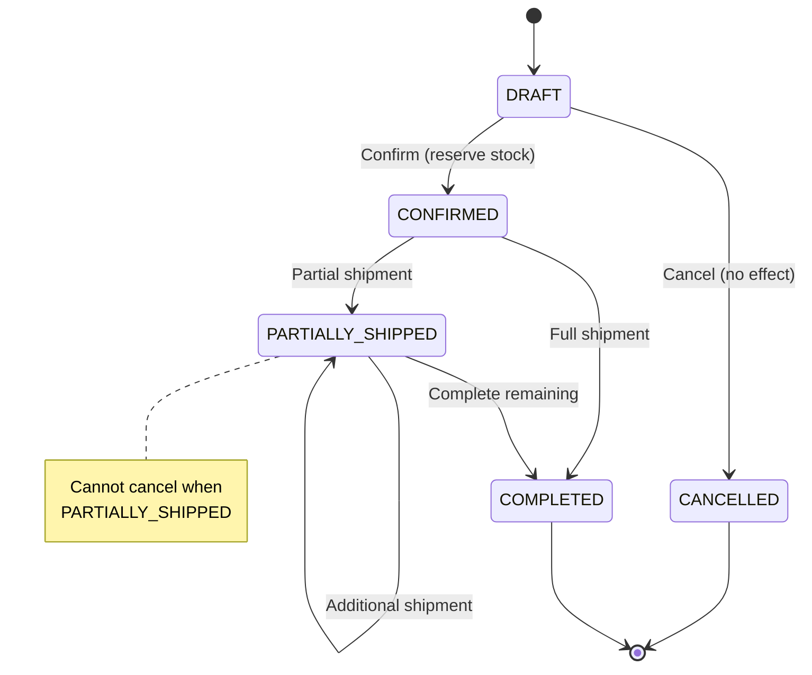
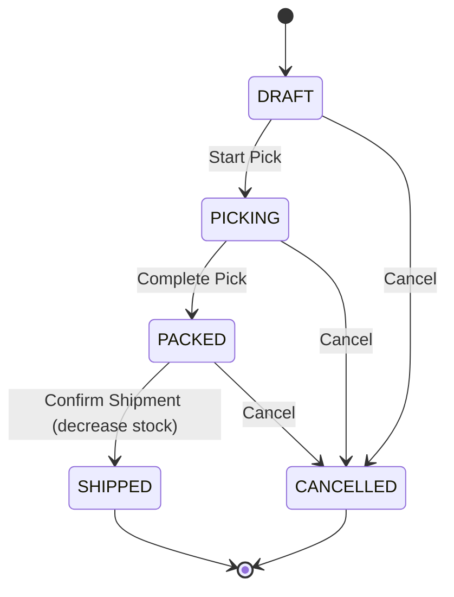
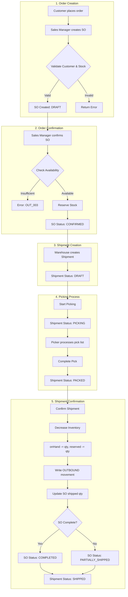
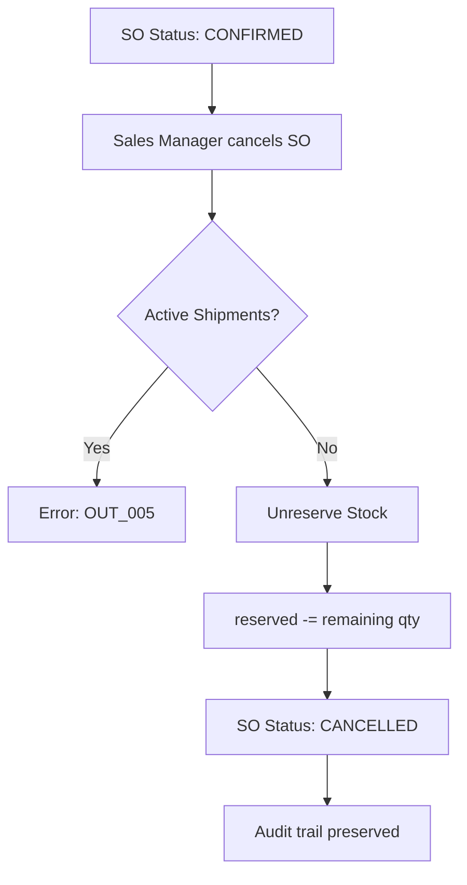
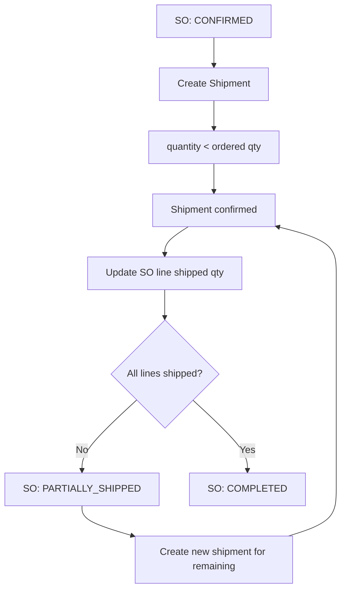
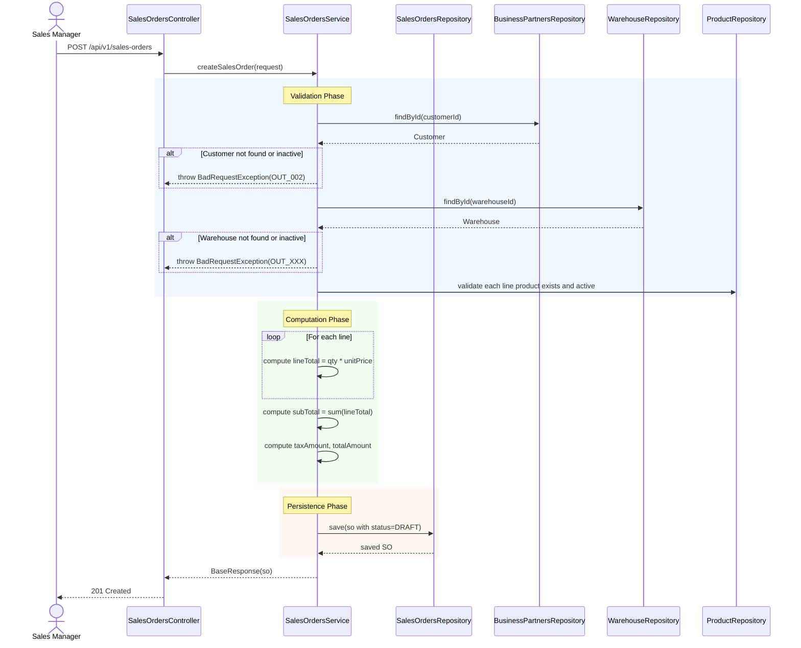
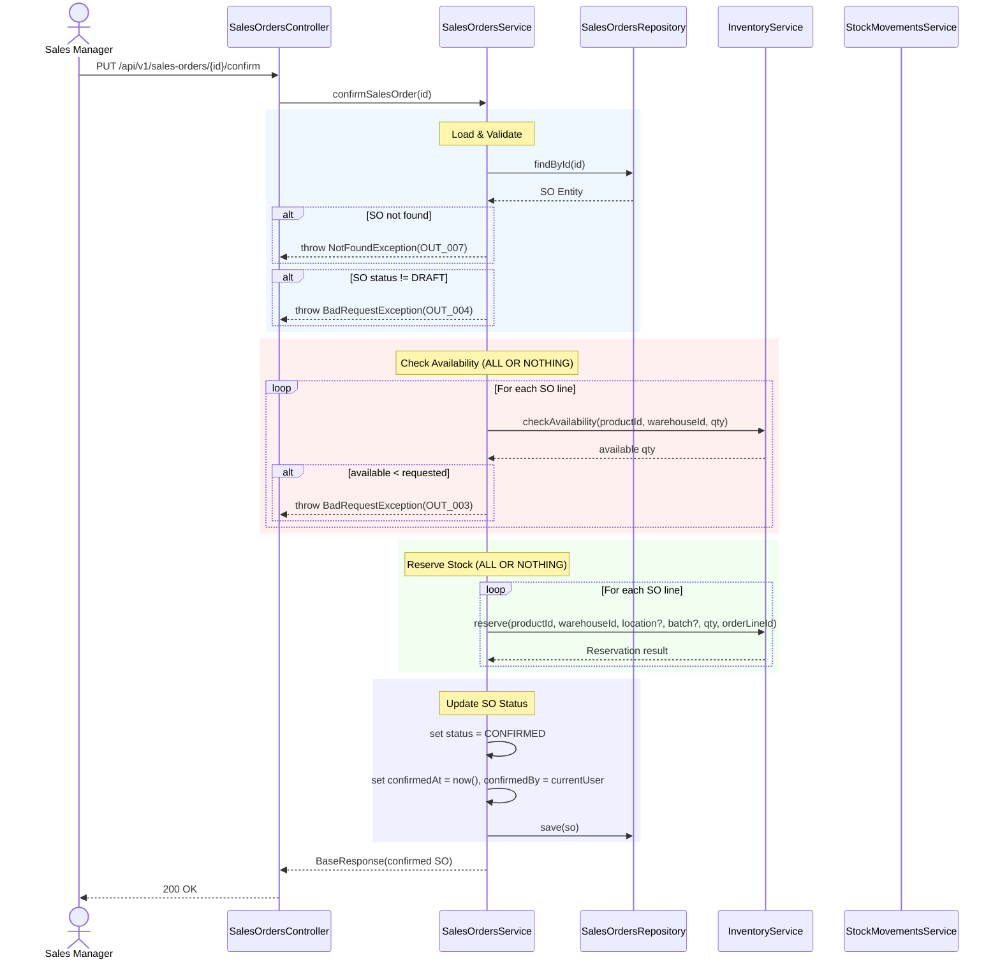
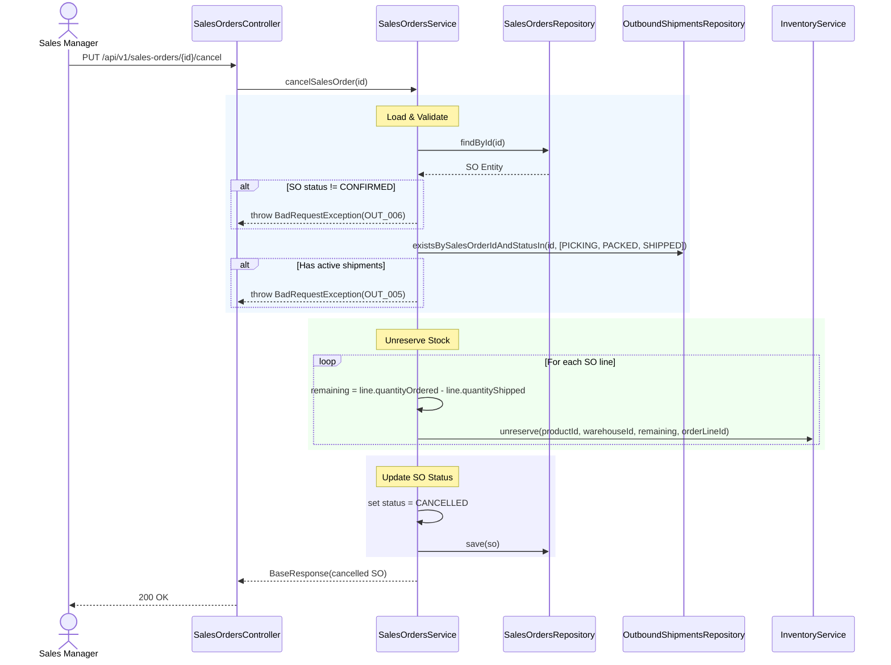
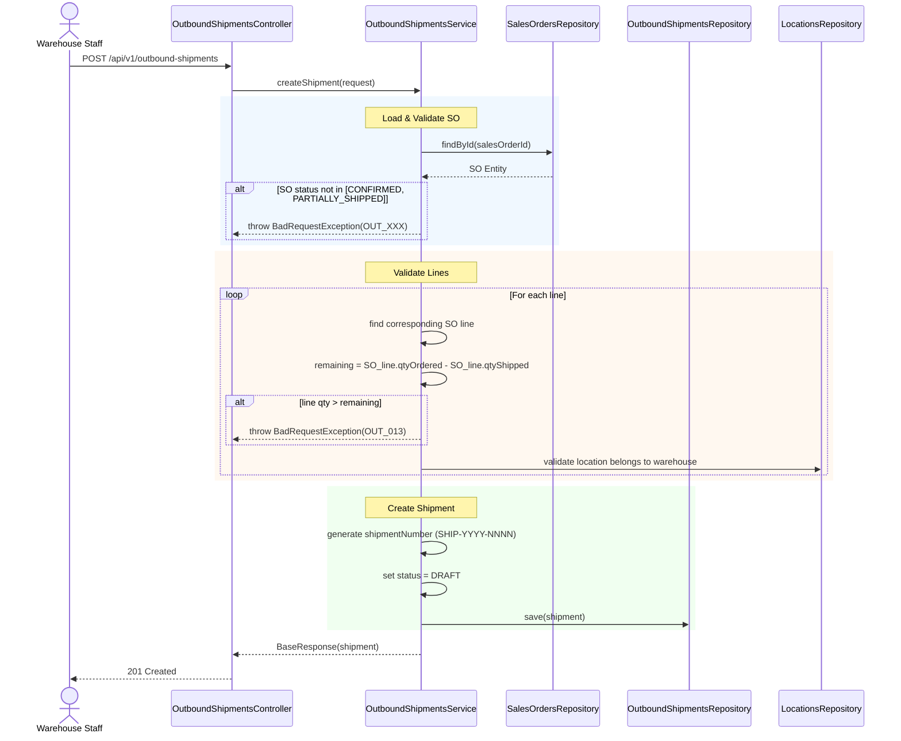
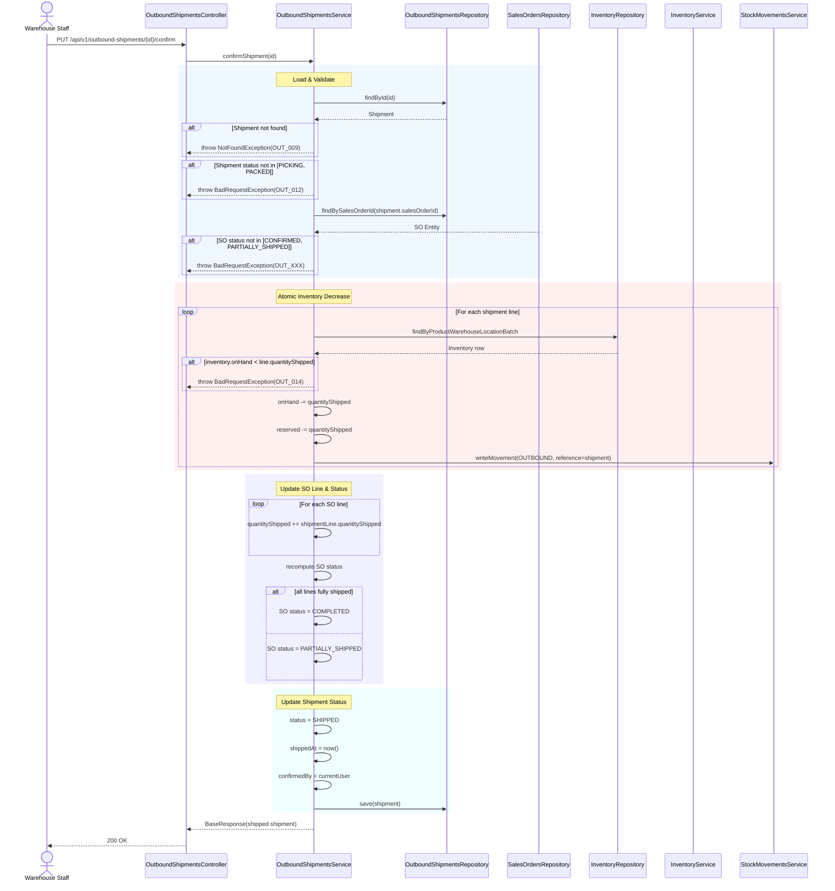

# BA Document - Phase 6: Outbound Operations
## Business Analysis & Technical Specification - Complete Edition

---

## 📋 Document Information

| Property | Value |
|----------|-------|
| **Module** | Outbound Operations (Sales Orders + Shipments) |
| **Phase** | 6 |
| **Version** | 3.0 (Complete) |
| **Date** | March 16, 2026 |
| **Status** | Ready for Development |
| **Author** | Business Analyst |
| **Supersedes** | `BA_MODULE_06_OUTBOUND_OPERATIONS_V2.md` |
| **Prerequisite** | Phase 3 (Inventory) - especially `decrease` method |

---

## 1. Executive Summary

Phase 6 (Outbound Operations) là module quản lý luồng xuất kho từ khi khách hàng đặt hàng (Sales Order) cho đến khi hàng được xuất kho thực tế (Outbound Shipment). Module này là phần đối lập với Phase 5 (Inbound) và đóng vai trò then chốt trong việc giảm tồn kho chính xác.

**Key Objectives:**
- Quản lý đơn bán hàng (Sales Orders) từ tạo đến hoàn tất
- Quản lý lô xuất kho (Outbound Shipments) từ tạo đến xuất kho
- Tích hợp với Inventory module để reserve/unreserve/decrease tồn kho
- Đảm bảo tính nhất quán dữ liệu trong toàn hệ thống

---

## 2. Business Context & System Positioning

### 2.1 Vị trí trong hệ thống WMS

```
┌─────────────────────────────────────────────────────────────────────────────────────────┐
│                              WAREHOUSE MANAGEMENT SYSTEM                               │
├─────────────────────────────────────────────────────────────────────────────────────────┤
│                                                                                         │
│  ┌─────────────┐    ┌─────────────┐    ┌─────────────┐    ┌─────────────┐            │
│  │   Phase 1   │    │   Phase 2   │    │   Phase 3   │    │   Phase 4   │            │
│  │   Master    │───▶│   Batch     │───▶│  Inventory  │◀───│   Reports   │            │
│  │   Data      │    │   Management│    │  Management │    │             │            │
│  └─────────────┘    └─────────────┘    └──────┬──────┘    └─────────────┘            │
│                                                 │                                        │
│                                                 ▼                                        │
│  ┌─────────────┐    ┌─────────────┐    ┌──────┴──────┐    ┌─────────────┐            │
│  │   Phase 5   │◀──▶│   Phase 6   │    │   Phase 7   │    │   Phase 8   │            │
│  │   Inbound   │    │   Outbound  │───▶│   Returns   │───▶│   Reports   │            │
│  │   (PO+Receipt)│  │  (SO+Ship)  │    │             │    │             │            │
│  └──────┬──────┘    └──────┬──────┘    └─────────────┘    └─────────────┘            │
│         │                   │                                                          │
│         │    increase()     │    reserve() / unreserve() / decrease()                  │
│         └───────────────────┘                                                          │
│                                                                                         │
└─────────────────────────────────────────────────────────────────────────────────────────┘
```

### 2.2 Inventory Integration Points

| Outbound Operation | Inventory Effect | Phase 3 Method Required |
|-------------------|-----------------|-------------------------|
| SO Confirm | `reservedQuantity += qty` | `reserve()` ✅ Done |
| SO Cancel | `reservedQuantity -= qty` | `unreserve()` ✅ Done |
| Shipment Confirm | `onHandQuantity -= qty`, `reservedQuantity -= qty` | `decrease()` ❌ WHS-17 |

### 2.3 Dependencies on Other Phases

| Phase | Module | Dependency Type | Status Required |
|-------|--------|----------------|----------------|
| Phase 1 | Master Data | Products, Warehouses, Locations, Business Partners (CUSTOMER) | Active |
| Phase 2 | Batch | Batch lookup for FIFO recommendations | Done |
| Phase 3 | Inventory | `reserve()`, `unreserve()`, `decrease()` | `decrease()` pending |

---

## 3. Actors & Roles

| Actor | Role | Responsibilities |
|-------|------|-----------------|
| **Sales Manager** | `ADMIN`, `MANAGER` | Create/update/delete Sales Orders, confirm/cancel SO |
| **Warehouse Staff** | `STAFF`, `WAREHOUSE_STAFF` | Create shipments, process picking, confirm shipment |
| **Picker** | `STAFF` | View pick list, scan items during picking |
| **Inventory Controller** | `MANAGER`, `INVENTORY_CONTROLLER` | Monitor stock decreases, view all operations |
| **Viewer** | Any authenticated | Read-only access to SO and shipment lists |

---

## 4. Core Entities

### 4.1 Entity Relationship

```
┌─────────────────────┐         ┌─────────────────────┐
│  business_partners  │         │     warehouses      │
│  (type=CUSTOMER)    │         │                     │
└─────────┬───────────┘         └──────────┬──────────┘
          │                                │
          │ N:1                            │ N:1
          ▼                                ▼
┌──────────────────────────────────────────────────────────────┐
│                      sales_orders                             │
│  ─────────────────────────────────────────────────────────  │
│  • so_number (SO-YYYY-NNNN)                                  │
│  • status: DRAFT → CONFIRMED → PARTIALLY_SHIPPED → COMPLETE │
│  • customer_id, warehouse_id                                  │
│  • subtotal, tax_amount, total_amount                        │
│  • confirmed_at, confirmed_by                                │
└──────────────────────────┬───────────────────────────────────┘
                           │ 1:N
                           ▼
┌──────────────────────────────────────────────────────────────┐
│                     sales_order_lines                        │
│  ─────────────────────────────────────────────────────────  │
│  • line_number, product_id                                   │
│  • quantity_ordered, quantity_shipped                        │
│  • unit_price, line_total                                   │
└──────────────────────────┬───────────────────────────────────┘
                           │ Referenced by
                           ▼
┌──────────────────────────────────────────────────────────────┐
│                    outbound_shipments                        │
│  ─────────────────────────────────────────────────────────  │
│  • shipment_number (SHIP-YYYY-NNNN)                          │
│  • sales_order_id, warehouse_id                              │
│  • status: DRAFT → PICKING → PACKED → SHIPPED              │
│  • tracking_number, carrier, shipped_at                      │
└──────────────────────────┬───────────────────────────────────┘
                           │ 1:N
                           ▼
┌────────────────────────────────────────────────────────────┐
│                  outbound_shipment_lines                     │
│  ───────────────────────────────────────────────────────── │
│  • sales_order_line_id                                      │
│  • product_id, batch_id, location_id                        │
│  • quantity_shipped                                         │
│  • picked_at, picked_by                                     │
└────────────────────────────────────────────────────────────┘
```

---

## 5. State Machines

### 5.1 Sales Orders Lifecycle



### 5.2 Outbound Shipments Lifecycle



---

## 6. End-to-End Business Flows

### 6.1 Main Flow: Complete Outbound Process



### 6.2 Alternative Flow: Order Cancellation



### 6.3 Alternative Flow: Partial Shipment



---

## 7. Detailed Sequence Diagrams

### 7.1 Sequence: Create Sales Order



### 7.2 Sequence: Confirm Sales Order (Reserve Stock)



### 7.3 Sequence: Cancel Sales Order (Unreserve Stock)



### 7.4 Sequence: Create Outbound Shipment



### 7.5 Sequence: Confirm Shipment (Decrease Inventory) - CRITICAL



### 7.6 Sequence: Get Pick List (FIFO)

```mermaid
sequenceDiagram
    actor Picker
    participant C as OutboundShipmentsController
    participant S as OutboundShipmentsService
    participant INV_R as InventoryRepository
    
    Picker->>C: GET /api/v1/outbound-shipments/{id}/pick-list
    C->>S: getPickList(id)
    
    S->>INV_R: findInventoryForFIFO(productId, warehouseId)
    
    rect rgb(240, 248, 255)
    Note over INV_R: FIFO Query
    INV_R->>INV_R: SELECT with ORDER BY 
        batch.manufacturing_date ASC,
        batch.expiry_date ASC
    INV_R-->>S: List of available batches/locations
    end
    
    S-->>C: BaseResponse(pick list)
    C-->>Picker: 200 OK
```

---

## 8. API Endpoints Specification

### 8.1 Sales Orders API (`/api/v1/sales-orders`)

**Jira Parent:** [WHS-47](https://jira.example.com/browse/WHS-47) - Sales Orders API Completion

| # | Method | Endpoint | Description | Jira Task | Auth |
|---|--------|----------|-------------|-----------|------|
| 1 | `POST` | `/api/v1/sales-orders` | Create SO (DRAFT) | [WHS-59](https://jira.example.com/browse/WHS-59) | ADMIN, MANAGER |
| 2 | `GET` | `/api/v1/sales-orders` | List SOs (paginated + filters) | [WHS-59](https://jira.example.com/browse/WHS-59) | isAuthenticated |
| 3 | `GET` | `/api/v1/sales-orders/{id}` | Get SO details | [WHS-59](https://jira.example.com/browse/WHS-59) | isAuthenticated |
| 4 | `PUT` | `/api/v1/sales-orders/{id}` | Update SO (DRAFT only) | [WHS-59](https://jira.example.com/browse/WHS-59) | ADMIN, MANAGER |
| 5 | `DELETE` | `/api/v1/sales-orders/{id}` | Delete SO (DRAFT only) | [WHS-59](https://jira.example.com/browse/WHS-59) | ADMIN, MANAGER |
| 6 | `PUT` | `/api/v1/sales-orders/{id}/confirm` | Confirm → reserve | [WHS-60](https://jira.example.com/browse/WHS-60) | ADMIN, MANAGER |
| 7 | `PUT` | `/api/v1/sales-orders/{id}/cancel` | Cancel → unreserve | [WHS-60](https://jira.example.com/browse/WHS-60) | ADMIN, MANAGER |

**Query Filters:** `soNumber`, `customerId`, `warehouseId`, `status`, `orderDateFrom`, `orderDateTo`, `requestedDeliveryDateFrom`, `requestedDeliveryDateTo`

### 8.2 Sales Order Lines API (`/api/v1/sales-order-lines`)

**Jira Parent:** [WHS-48](https://jira.example.com/browse/WHS-48) - Sales Order Lines API Completion

| # | Method | Endpoint | Description | Jira Task | Auth |
|---|--------|----------|-------------|-----------|------|
| 1 | `POST` | `/api/v1/sales-order-lines` | Add line (SO DRAFT) | [WHS-61](https://jira.example.com/browse/WHS-61) | ADMIN, MANAGER |
| 2 | `PUT` | `/api/v1/sales-order-lines/{id}` | Update line (SO DRAFT) | [WHS-61](https://jira.example.com/browse/WHS-61) | ADMIN, MANAGER |
| 3 | `DELETE` | `/api/v1/sales-order-lines/{id}` | Delete line (SO DRAFT) | [WHS-61](https://jira.example.com/browse/WHS-61) | ADMIN, MANAGER |
| 4 | `GET` | `/api/v1/sales-order-lines/by-so/{soId}` | Get lines by SO | [WHS-61](https://jira.example.com/browse/WHS-61) | isAuthenticated |

### 8.3 Outbound Shipments API (`/api/v1/outbound-shipments`)

**Jira Parent:** [WHS-49](https://jira.example.com/browse/WHS-49) - Outbound Shipments API Completion

| # | Method | Endpoint | Description | Jira Task | Auth |
|---|--------|----------|-------------|-----------|------|
| 1 | `POST` | `/api/v1/outbound-shipments` | Create shipment (from CONFIRMED SO) | [WHS-62](https://jira.example.com/browse/WHS-62) | isAuthenticated |
| 2 | `GET` | `/api/v1/outbound-shipments` | List shipments | [WHS-62](https://jira.example.com/browse/WHS-62) | isAuthenticated |
| 3 | `GET` | `/api/v1/outbound-shipments/{id}` | Get shipment details | [WHS-62](https://jira.example.com/browse/WHS-62) | isAuthenticated |
| 4 | `PUT` | `/api/v1/outbound-shipments/{id}/pick` | Start picking → PICKING | [WHS-63](https://jira.example.com/browse/WHS-63) | isAuthenticated |
| 5 | `PUT` | `/api/v1/outbound-shipments/{id}/confirm` | Confirm → decrease stock | [WHS-63](https://jira.example.com/browse/WHS-63) | isAuthenticated |
| 6 | `GET` | `/api/v1/outbound-shipments/{id}/pick-list` | Get FIFO pick list | [WHS-62](https://jira.example.com/browse/WHS-62) | isAuthenticated |

**Query Filters:** `shipmentNumber`, `salesOrderId`, `warehouseId`, `status`, `shipmentDateFrom`, `shipmentDateTo`

### 8.4 Outbound Shipment Lines API (`/api/v1/outbound-shipment-lines`)

**Jira Parent:** [WHS-50](https://jira.example.com/browse/WHS-50) - Outbound Shipment Lines API Completion

| # | Method | Endpoint | Description | Jira Task | Auth |
|---|--------|----------|-------------|-----------|------|
| 1 | `POST` | `/api/v1/outbound-shipment-lines` | Add line | [WHS-65](https://jira.example.com/browse/WHS-65) | isAuthenticated |
| 2 | `PUT` | `/api/v1/outbound-shipment-lines/{id}` | Update line | [WHS-65](https://jira.example.com/browse/WHS-65) | isAuthenticated |
| 3 | `DELETE` | `/api/v1/outbound-shipment-lines/{id}` | Delete line | [WHS-65](https://jira.example.com/browse/WHS-65) | isAuthenticated |

---

## 9. Business Rules

### 9.1 Sales Order Rules

| BR-ID | Rule | Description |
|-------|------|-------------|
| BR-OUT-01 | SO Number Format | `SO-YYYY-NNNN`, auto-increment per year |
| BR-OUT-02 | Line Quantity | `quantityShipped` initialized to 0 |
| BR-OUT-03 | DRAFT Editable | DRAFT SO is fully editable (lines, dates, notes) |
| BR-OUT-04 | All-or-Nothing | Reservation must succeed for ALL lines or rollback |
| BR-OUT-05 | CONFIRMED Immutable | CONFIRMED SO cannot be edited (must cancel first) |
| BR-OUT-06 | Exclude Quarantine | Available stock excludes QUARANTINE batches |
| BR-OUT-07 | Unreserve All-or-Nothing | Unreservation must succeed for ALL lines or rollback |
| BR-OUT-08 | Audit Trail | Cancelled orders retained for audit |
| BR-OUT-09 | No Cancel Partial | PARTIALLY_SHIPPED orders cannot be cancelled |

### 9.2 Shipment Rules

| BR-ID | Rule | Description |
|-------|------|-------------|
| BR-OUT-10 | Shipment Number | `SHIP-YYYY-NNNN`, auto-increment per year |
| BR-OUT-11 | Partial Allowed | Multiple shipments per SO allowed |
| BR-OUT-12 | Total Constraint | Total shipped ≤ ordered per line |
| BR-OUT-13 | FIFO Recommended | Oldest batches recommended, not enforced |
| BR-OUT-14 | Batch Override | Staff can override batch with justification |
| BR-OUT-15 | Pick List Content | location → product → batch → quantity |
| BR-OUT-16 | Atomic Confirm | Shipment confirm is atomic transaction |
| BR-OUT-17 | Decrease Both | Both `onHand` and `reserved` decrease |
| BR-OUT-18 | Ship Limit | Cannot ship more than ordered |
| BR-OUT-19 | Stock Check | Cannot ship from location with insufficient stock |
| BR-OUT-20 | Multi Shipment | Multiple shipments per SO line allowed |
| BR-OUT-21 | Complete Condition | SO COMPLETED only when ALL lines fully shipped |

### 9.3 Inventory Rules (from Phase 3)

| BR-ID | Rule | Source |
|-------|------|--------|
| BR-INV-01 | Available = OnHand - Reserved | Phase 3 |
| BR-INV-02 | OnHand >= 0 | Phase 3 |
| BR-INV-03 | Reserved >= 0 AND Reserved <= OnHand | Phase 3 |

---

## 10. Error Codes

| Code | Description | HTTP Status |
|------|-------------|-------------|
| `OUT_001` | Sales order must have at least one line | 400 |
| `OUT_002` | Customer not found or not active | 400 |
| `OUT_003` | Insufficient stock for product {sku} | 400 |
| `OUT_004` | Can only confirm DRAFT orders | 400 |
| `OUT_005` | Cannot cancel SO with active shipments | 400 |
| `OUT_006` | Can only cancel CONFIRMED orders | 400 |
| `OUT_007` | Sales order not found | 404 |
| `OUT_008` | Sales order line not found | 404 |
| `OUT_009` | Shipment not found | 404 |
| `OUT_010` | Can only edit DRAFT shipments | 400 |
| `OUT_011` | Can only pick DRAFT shipments | 400 |
| `OUT_012` | Can only confirm PICKING/PACKED shipments | 400 |
| `OUT_013` | Shipped quantity exceeds remaining | 400 |
| `OUT_014` | Insufficient on-hand stock at location | 400 |
| `OUT_015` | Location does not belong to shipment warehouse | 400 |
| `OUT_016` | Shipment must have at least one line | 400 |

---

## 11. Data Flow & Integration

### 11.1 Inventory Operations Summary

```
┌─────────────────────────────────────────────────────────────────────────────────────────┐
│                              INVENTORY IMPACT SUMMARY                                   │
├─────────────────────────────────────────────────────────────────────────────────────────┤
│                                                                                         │
│  Phase 3 (Inventory) ─────────────────────────────────────────────────────────────     │
│                                                                                         │
│  ┌──────────────┐  ┌──────────────┐  ┌──────────────┐  ┌──────────────┐              │
│  │   GET APIs   │  │   reserve()  │  │  unreserve() │  │  decrease()  │              │
│  │  (read-only) │  │  (increase   │  │  (decrease   │  │  (decrease   │              │
│  │              │  │   reserved)  │  │   reserved)  │  │   onHand +   │              │
│  │              │  │              │  │              │  │   reserved)  │              │
│  └──────┬───────┘  └──────┬───────┘  └──────┬───────┘  └──────┬───────┘              │
│         │                 │                  │                  │                       │
│         │     SO Confirm ─┼──────────────────┼──────────────────┘                       │
│         │                 │                  │                                          │
│         │                 │     SO Cancel ────┼───────────────────────────────────       │
│         │                 │                  │                                          │
│         │                 │                  │        Shipment Confirm ─────────────     │
│         │                 │                  │                                          │
│  Phase 5 ─────────────────┴──────────────────┴───────────────────────────────────     │
│  (Inbound)                  increase() ──────────────────────────────────────────     │
│                                                                                         │
└─────────────────────────────────────────────────────────────────────────────────────────┘
```

### 11.2 Stock Movement Types

| Source | Movement Type | Reference Type | Quantity Effect |
|--------|---------------|----------------|-----------------|
| Inbound Receipt | `INBOUND` | `INBOUND_RECEIPT` | onHand + |
| SO Confirm | — | — | No movement (reservation only) |
| SO Cancel | — | — | No movement (release only) |
| Shipment Confirm | `OUTBOUND` | `OUTBOUND_SHIPMENT` | onHand -, reserved - |

---

## 12. Prerequisites & Dependencies

### 12.1 Phase 3 (Inventory) Requirements

**CRITICAL:** Phase 6 requires the following Inventory methods to be fully implemented:

| Method | Description | Jira | Status |
|--------|-------------|------|--------|
| `checkAvailability()` | Check if stock available | WHS-13 | ✅ Done |
| `reserve()` | Reserve stock for order | WHS-14 | ✅ Done |
| `unreserve()` | Release reserved stock | WHS-15 | ✅ Done |
| `increase()` | Add on-hand stock | WHS-16 | ✅ Done |
| `decrease()` | Reduce on-hand + reserved | WHS-17 | ❌ **Required** |

### 12.2 Master Data Requirements

| Entity | Requirement | Validation |
|--------|-------------|------------|
| Products | Must exist, ACTIVE status | Used in SO lines, shipment lines |
| Warehouses | Must exist, ACTIVE status | SO and shipment must belong to same warehouse |
| Locations | Must belong to warehouse | Used in shipment lines |
| Batches | Must exist for batch-tracked products | Used in FIFO recommendations |
| Business Partners | Type = CUSTOMER, status = ACTIVE | Used as SO customer |

---

## 13. Implementation Roadmap

### Phase 6.1: Sales Orders CRUD (3 days) - [WHS-59](https://jira.example.com/browse/WHS-59)
- [ ] POST/GET/PUT/DELETE Sales Orders
- [ ] SO number generation
- [ ] DRAFT-only guards
- [ ] Total computation from lines

### Phase 6.2: SO Confirm & Cancel (3 days) - [WHS-60](https://jira.example.com/browse/WHS-60)
- [ ] PUT /confirm → availability check + reserve
- [ ] PUT /cancel → unreserve + status update
- [ ] All-or-nothing transaction

### Phase 6.3: Sales Order Lines (2 days) - [WHS-61](https://jira.example.com/browse/WHS-61)
- [ ] Line CRUD (DRAFT-only)
- [ ] Line number management
- [ ] SO totals recalculation
- [See detailed SOL specs](./BA_PHASE6_SALES_ORDER_LINES.md)]

### Phase 6.4: Outbound Shipments CRUD (3 days) - [WHS-62](https://jira.example.com/browse/WHS-62)
- [ ] Shipment creation from CONFIRMED SO
- [ ] Shipment number generation
- [ ] Pick list endpoint (FIFO)

### Phase 6.5: Shipment Processing (4 days) - [WHS-63](https://jira.example.com/browse/WHS-63) + [WHS-65](https://jira.example.com/browse/WHS-65)
- [ ] PUT /pick → status PICKING
- [ ] PUT /confirm → atomic decrease + movement + SO update
- [ ] Shipment lines CRUD
- [See detailed OBL specs](./BA_PHASE6_OUTBOUND_SHIPMENT_LINES.md)]

### Phase 6.6: Hardening (1 day)
- [ ] Error codes implementation
- [ ] Swagger documentation
- [ ] Integration tests

**Estimated Total: ~16 days**

---

## 14. Risks & Mitigations

| Risk | Impact | Mitigation |
|------|--------|------------|
| WHS-17 (decrease) not ready | HIGH | Cannot complete shipment confirmation; prioritize WHS-17 |
| Concurrent shipment confirmation | HIGH | Use pessimistic locking + optimistic version check |
| Partial shipment logic | MEDIUM | Careful status tracking per line |
| Inventory out of sync | HIGH | Atomic transactions + movement audit |
| FIFO complexity | MEDIUM | Start with non-FIFO, add FIFO incrementally |

---

## 15. Acceptance Criteria

### 15.1 Sales Orders
- [ ] Can create SO with multiple lines
- [ ] Cannot create SO without lines
- [ ] SO totals computed from lines (not trusted from client)
- [ ] Confirm reserves stock for ALL lines or fails
- [ ] Cancel unreserves remaining stock
- [ ] Cannot cancel PARTIALLY_SHIPPED orders

### 15.2 Outbound Shipments
- [ ] Can create shipment from CONFIRMED/PARTIALLY_SHIPPED SO
- [ ] Cannot ship more than ordered
- [ ] Pick list returns FIFO recommendations
- [ ] Confirm decreases both onHand and reserved atomically
- [ ] Shipment confirm updates SO status correctly

### 15.3 Integration
- [ ] All inventory operations write stock movements
- [ ] Audit trail preserved for cancelled orders/shipments
- [ ] No negative inventory after any operation

---

## 16. Appendix: Comparison with Inbound

| Aspect | Inbound (Phase 5) | Outbound (Phase 6) |
|--------|-------------------|-------------------|
| Order Entity | PurchaseOrders | SalesOrders |
| Document Entity | InboundReceipts | OutboundShipments |
| Order Lifecycle | DRAFT→CONFIRMED→PARTIALLY_RECEIVED→COMPLETED | DRAFT→CONFIRMED→PARTIALLY_SHIPPED→COMPLETED |
| Document Lifecycle | DRAFT→CONFIRMED/CANCELLED | DRAFT→PICKING→PACKED→SHIPPED/CANCELLED |
| Inventory on Confirm | `onHand += qty` | `onHand -= qty`, `reserved -= qty` |
| Movement Type | INBOUND | OUTBOUND |
| Reference Type | INBOUND_RECEIPT | OUTBOUND_SHIPMENT |
| Order→Doc Guard | PO CONFIRMED/PARTIALLY_RECEIVED | SO CONFIRMED/PARTIALLY_SHIPPED |
| Complexity | Batch creation, quarantine | Reservation, FIFO, unreserve on cancel |

---

## 17. Document History

| Version | Date | Author | Changes |
|---------|------|--------|---------|
| 1.0 | Feb 1, 2026 | BA | Initial draft |
| 2.0 | Mar 9, 2026 | BA | Added technical specs, aligned with Inbound |
| 3.0 | Mar 16, 2026 | BA | Complete edition with E2E flows, sequences, system integration |

---

**Document Status:** ✅ Ready for Development  
**Next Review:** Before Phase 7 (Returns) implementation

---

## Related Documents

| Document | Description |
|----------|-------------|
| [BA_PHASE6_SALES_ORDER.md](./BA_PHASE6_SALES_ORDER.md) | Detailed SO (Sales Order) business analysis - **START HERE** |
| [BA_PHASE6_SALES_ORDER_LINES.md](./BA_PHASE6_SALES_ORDER_LINES.md) | Detailed SOL (Sales Order Lines) business analysis |
| [BA_PHASE6_OUTBOUND_SHIPMENT_LINES.md](./BA_PHASE6_OUTBOUND_SHIPMENT_LINES.md) | Detailed OBL (Outbound Shipment Lines) business analysis |
| [DB_MODULE_06_OUTBOUND.md](./DB_MODULE_06_OUTBOUND.md) | Database schema |
