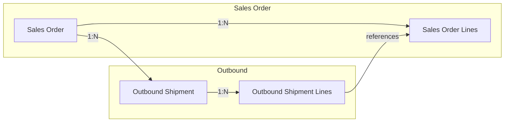
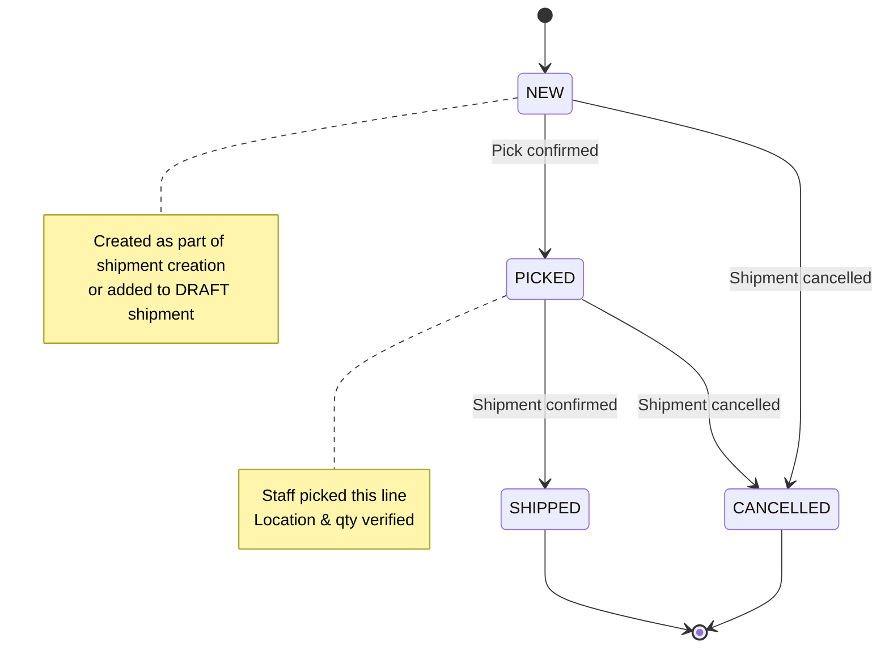
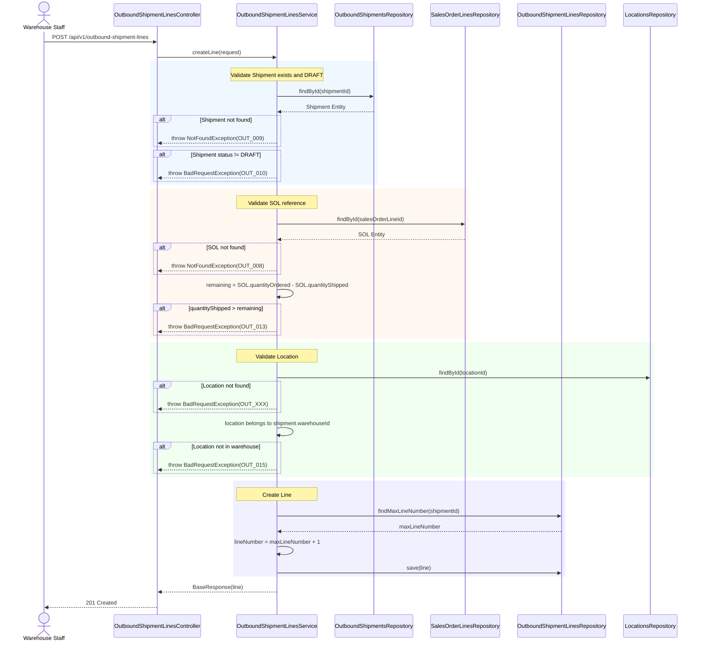
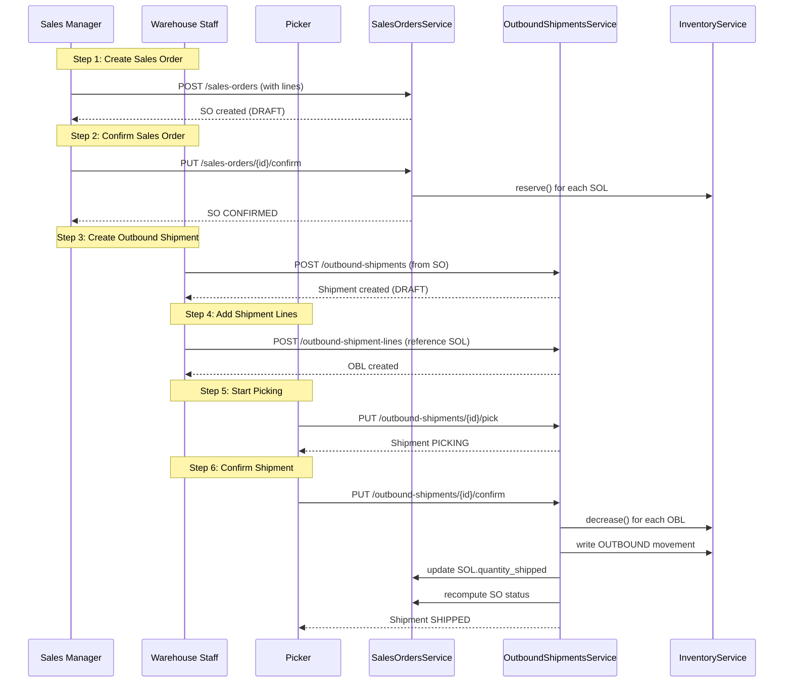

# BA Document - Outbound Shipment Lines (OBL) Module
## Business Analysis - Phase 6 Child Module

---

## 📋 Document Information

| Property | Value |
|----------|-------|
| **Module** | Outbound Shipment Lines (OBL) |
| **Parent Phase** | Phase 6: Outbound Operations |
| **Version** | 1.0 |
| **Date** | March 16, 2026 |
| **Status** | Ready for Development |
| **Author** | Business Analyst |
| **Parent Jira** | [WHS-50](https://jira.example.com/browse/WHS-50) - Outbound Shipment Lines API Completion |
| **Jira Task** | [WHS-65](https://jira.example.com/browse/WHS-65) - Implement outbound shipment lines APIs |

---

## 1. Overview

### 1.1 Vị trí trong luồng Outbound

```
Sales Order (SO)
    │
    ├── 1:N ──▶ Sales Order Lines (SOL)
    │                │
    │                └── quantity_ordered, quantity_shipped
    │
    └── 1:N ──▶ Outbound Shipments (OB)
                        │
                        ├── 1:N ──▶ Outbound Shipment Lines (OBL)
                        │                │
                        │                ├── sales_order_line_id ──► SOL ◄── CRITICAL
                        │                ├── location_id
                        │                ├── batch_id
                        │                └── quantity_shipped
                        │
                        └── status: DRAFT → PICKING → PACKED → SHIPPED
```

### 1.2 Chain Flow: SO → SOL → OB → OBL



---

## 2. Entity Definition

### 2.1 OutboundShipmentLines Entity

```java
// Entity: OutboundShipmentLines
@Table(name = "outbound_shipment_lines")
public class OutboundShipmentLines extends BaseEntity {
    
    @Column(name = "outbound_shipment_id", nullable = false)
    private String outboundShipmentId;
    
    @Column(name = "sales_order_line_id", nullable = false)
    private String salesOrderLineId;  // CRITICAL: References SOL
    
    @Column(name = "product_id", nullable = false)
    private String productId;
    
    @Column(name = "batch_id")
    private String batchId;  // Nullable, for batch-tracked products
    
    @Column(name = "location_id", nullable = false)
    private String locationId;
    
    @Column(name = "line_number", nullable = false)
    private Integer lineNumber;
    
    @Column(name = "quantity_shipped", nullable = false, precision = 15, scale = 2)
    private BigDecimal quantityShipped;
    
    @Column(name = "picked_at")
    private LocalDateTime pickedAt;
    
    @Column(name = "picked_by")
    private String pickedBy;
    
    @Column(name = "notes")
    private String notes;
}
```

### 2.2 Relationships

| Relationship | Type | Description |
|--------------|------|-------------|
| outbound_shipment_id → OutboundShipments | N:1 | OBL belongs to one OB |
| sales_order_line_id → SalesOrderLines | N:1 | OBL references one SOL |
| product_id → Products | N:1 | OBL item is a product |
| batch_id → Batches | N:1 | Optional, for FIFO |
| location_id → Locations | N:1 | Pick location |

### 2.3 Unique Constraints

| Constraint | Columns | Description |
|------------|---------|-------------|
| UK | `(outbound_shipment_id, line_number)` | Each OB has unique line numbers |
| FK | `outbound_shipment_id` → `outbound_shipments(id)` | CASCADE delete |
| FK | `sales_order_line_id` → `sales_order_lines(id)` | RESTRICT delete |
| FK | `location_id` → `locations(id)` | RESTRICT delete |

---

## 3. State Machine

### 3.1 OBL Status (Derived from Parent OB)



### 3.2 OBL vs OB vs SOL Synchronization

| OB Status | OBL Status | SOL Impact |
|-----------|------------|------------|
| DRAFT | NEW | No impact |
| PICKING | NEW/PICKED | No impact |
| PACKED | PICKED | No impact |
| SHIPPED | SHIPPED | SOL.quantity_shipped += OBL.quantity_shipped |
| CANCELLED | CANCELLED | No impact (no revert needed) |

---

## 4. Business Flows

### 4.1 Flow: OBL Creation



### 4.2 Flow: OBL Confirm (Shipment Confirm)

```mermaid
sequenceDiagram
    participant System
    participant OBL_R as OutboundShipmentLinesRepository
    participant INV_R as InventoryRepository
    participant SOL_R as SalesOrderLinesRepository
    participant MOV_S as StockMovementsService
    
    rect rgb(240, 248, 255)
    Note over System: Called from Shipment Confirm
    loop For each OBL
        System->>OBL_R: findByShipmentId(shipmentId)
    end
    end
    
    rect rgb(255, 240, 240)
    Note over System: Inventory Decrease
    loop For each OBL
        System->>INV_R: findByProductWarehouseLocationBatch
        INV_R-->>System: Inventory
        
        alt inventory.onHand < OBL.quantityShipped
            System-->>: throw BadRequestException(OUT_014)
        end
        
        System->>System: onHand -= quantityShipped
        System->>System: reserved -= quantityShipped
        
        System->>MOV_S: writeMovement(OUTBOUND, reference=OBL)
    end
    end
    
    rect rgb(240, 240, 255)
    Note over System: Update SOL
    loop For each OBL
        System->>SOL_R: findById(OBL.salesOrderLineId)
        SOL_R-->>System: SOL
        
        System->>System: SOL.quantityShipped += OBL.quantityShipped
        System->>SOL_R: save(SOL)
    end
    end
```

---

## 5. Critical Integration: OBL → SOL

### 5.1 Data Flow

```
OBL.quantity_shipped ──────────────────────► SOL.quantity_shipped (ACCUMULATED)
      │
      │ On Shipment Confirm:
      │ 1. Decrease Inventory (onHand, reserved)
      │ 2. Write Stock Movement (OUTBOUND)
      │ 3. Update SOL.quantity_shipped
      │ 4. Recompute SOL status
      │ 5. Recompute SO status
      │
      └───────────────────────────► SO status:
                                      - All shipped → COMPLETED
                                      - Some shipped → PARTIALLY_SHIPPED
```

### 5.2 Validation Rules

| Rule | Description | Error Code |
|------|-------------|------------|
| BR-OBL-01 | OBL must reference valid SOL | OUT_008 |
| BR-OBL-02 | OBL.quantity_shipped ≤ SOL.remaining | OUT_013 |
| BR-OBL-03 | Location must belong to shipment warehouse | OUT_015 |
| BR-OBL-04 | OBL can only be created for DRAFT shipment | OUT_010 |
| BR-OBL-05 | OBL can only be updated for DRAFT shipment | OUT_010 |
| BR-OBL-06 | OBL can only be deleted for DRAFT shipment | OUT_010 |
| BR-OBL-07 | Inventory must have sufficient onHand quantity | OUT_014 |

### 5.3 Remaining Quantity Calculation

```java
// For each SOL line:
remainingQuantity = SOL.quantityOrdered - SOL.quantityShipped

// For each OBL creation/update:
OBL.quantityShipped ≤ remainingQuantity

// Example:
SOL.quantityOrdered = 100
SOL.quantityShipped = 30  // Already shipped 30
remainingQuantity = 100 - 30 = 70  // Can ship max 70 more
```

---

## 6. API Specification

### 6.1 Outbound Shipment Lines APIs

| # | Method | Endpoint | Description | Jira Task | Parent |
|---|--------|----------|-------------|-----------|--------|
| 1 | `POST` | `/api/v1/outbound-shipment-lines` | Add line to shipment | [WHS-65](https://jira.example.com/browse/WHS-65) | WHS-50 |
| 2 | `PUT` | `/api/v1/outbound-shipment-lines/{id}` | Update line | [WHS-65](https://jira.example.com/browse/WHS-65) | WHS-50 |
| 3 | `DELETE` | `/api/v1/outbound-shipment-lines/{id}` | Delete line | [WHS-65](https://jira.example.com/browse/WHS-65) | WHS-50 |

### 6.2 API Request/Response Models

#### 6.2.1 Create Line Request
```json
{
  "outboundShipmentId": "uuid",
  "salesOrderLineId": "uuid",
  "productId": "uuid",
  "locationId": "uuid",
  "batchId": "uuid (optional)",
  "quantityShipped": 10.00,
  "notes": "Optional notes"
}
```

#### 6.2.2 Update Line Request
```json
{
  "locationId": "uuid",
  "batchId": "uuid (optional)",
  "quantityShipped": 15.00,
  "notes": "Updated notes"
}
```

#### 6.2.3 Response
```json
{
  "id": "uuid",
  "outboundShipmentId": "uuid",
  "salesOrderLineId": "uuid",
  "productId": "uuid",
  "locationId": "uuid",
  "batchId": "uuid or null",
  "lineNumber": 1,
  "quantityShipped": 10.00,
  "pickedAt": "timestamp or null",
  "pickedBy": "uuid or null",
  "notes": "..."
}
```

---

## 7. Integration Points

### 7.1 With Outbound Shipments (Parent)

| Operation | Impact on OBL |
|-----------|---------------|
| Shipment Created | OBL can be added (if DRAFT) |
| Shipment Pick | OBL status unchanged |
| Shipment Confirm | OBL affects SOL, writes movements |
| Shipment Cancel | OBL not affected (no revert) |

### 7.2 With Sales Order Lines (Critical Reference)

| Operation | OBL Action | SOL Impact |
|-----------|------------|------------|
| OBL Create | Validate remaining qty | - |
| OBL Update | Validate remaining qty | - |
| OBL Confirm | Update SOL.quantity_shipped | Accumulate shipped qty |

### 7.3 With Inventory

| OBL Operation | Inventory Operation | Effect |
|---------------|---------------------|--------|
| Shipment Confirm | `decrease()` | onHand -= qty, reserved -= qty |

### 7.4 With Stock Movements

| Source | Movement Type | Reference | Quantity |
|--------|--------------|-----------|----------|
| OBL Confirm | OUTBOUND | OUTBOUND_SHIPMENT | quantity_shipped |

---

## 8. Error Codes

| Code | Description | HTTP |
|------|-------------|------|
| OBL_001 | Shipment not found | 404 |
| OBL_002 | Shipment is not in DRAFT status | 400 |
| OBL_003 | Sales order line not found | 400 |
| OBL_004 | Quantity exceeds remaining | 400 |
| OBL_005 | Location not found | 400 |
| OBL_006 | Location does not belong to warehouse | 400 |
| OBL_007 | Insufficient inventory at location | 400 |
| OBL_008 | Shipment line not found | 404 |

---

## 9. End-to-End Flow: Complete Chain

### 9.1 Full Chain: SO → SOL → OB → OBL



---

## 10. Acceptance Criteria

### 10.1 Create Line
- [ ] OBL created with correct line_number (auto-increment)
- [ ] OBL references valid SOL via sales_order_line_id
- [ ] quantity_shipped ≤ SOL remaining quantity
- [ ] location belongs to shipment warehouse
- [ ] Cannot create line for non-DRAFT shipment

### 10.2 Update Line
- [ ] OBL updated with new values
- [ ] quantity_shipped ≤ SOL remaining quantity
- [ ] Cannot update line if shipment not DRAFT

### 10.3 Delete Line
- [ ] OBL deleted from database
- [ ] Cannot delete line if shipment not DRAFT

### 10.4 Shipment Confirm
- [ ] Decreases inventory (onHand, reserved) per OBL
- [ ] Writes OUTBOUND movement per OBL
- [ ] Updates SOL.quantity_shipped correctly
- [ ] Recomputes SOL and SO status correctly
- [ ] Atomic transaction (all or nothing)

---

## 11. Comparison: OBL vs IBL (Inbound)

| Aspect | Outbound Shipment Lines (OBL) | Inbound Receipt Lines (IBL) |
|--------|-------------------------------|----------------------------|
| Parent | Outbound Shipments | Inbound Receipts |
| References | Sales Order Lines | Purchase Order Lines |
| Location | Source location (pick from) | Destination location (receive to) |
| Batch | Optional (for FIFO) | Optional (for tracking) |
| Quantity | quantity_shipped | quantityReceived |
| Inventory Effect | decrease (onHand, reserved) | increase (onHand) |
| Movement Type | OUTBOUND | INBOUND |
| Status Update | Updates SOL.quantity_shipped | Updates POL.quantityReceived |

---

## 12. Document History

| Version | Date | Author | Changes |
|---------|------|--------|---------|
| 1.0 | Mar 16, 2026 | BA | Initial OBL business analysis |

---

**Document Status:** ✅ Ready for Development  
**Related Documents:**
- [BA_PHASE6_OUTBOUND_OPERATIONS_COMPLETE.md](./BA_PHASE6_OUTBOUND_OPERATIONS_COMPLETE.md) - Parent document
- [BA_PHASE6_SALES_ORDER_LINES.md](./BA_PHASE6_SALES_ORDER_LINES.md) - SOL module
- [DB_MODULE_06_OUTBOUND.md](./DB_MODULE_06_OUTBOUND.md) - Database schema
