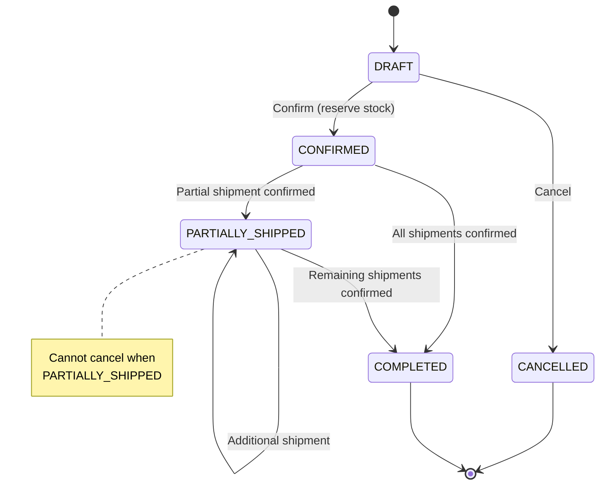
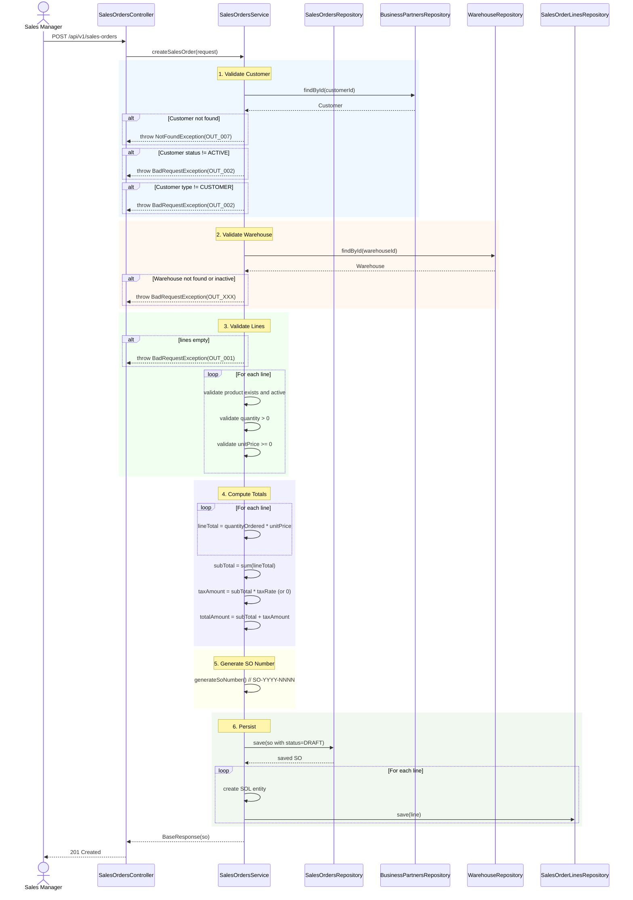
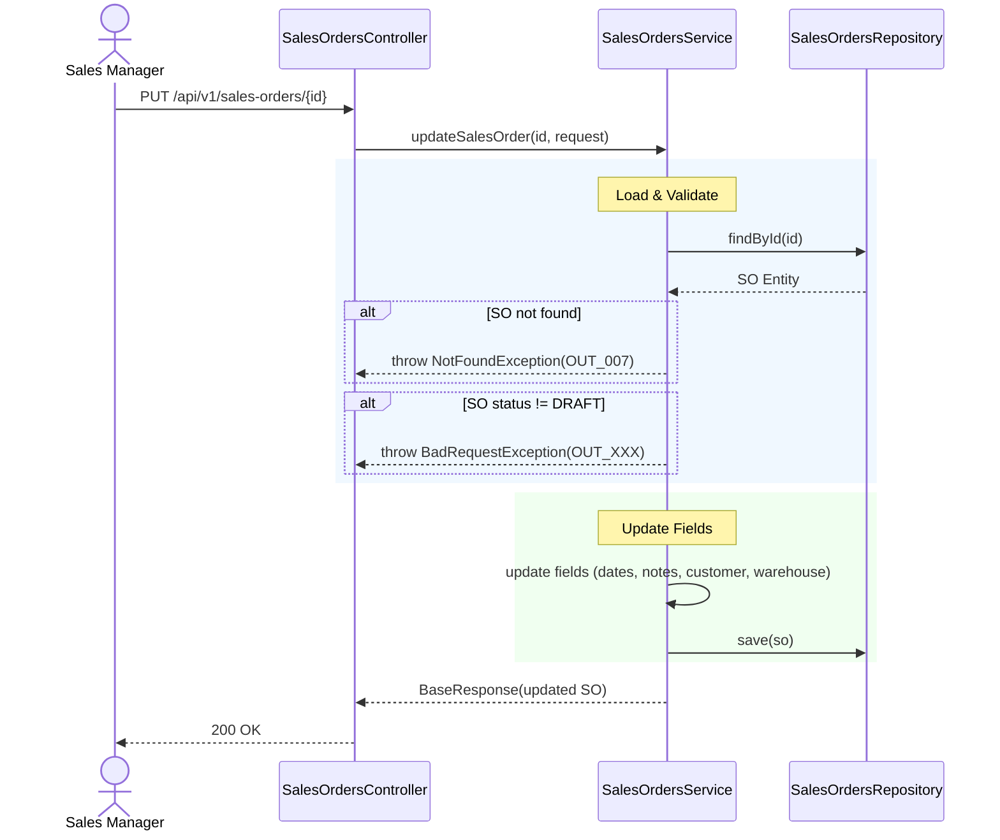
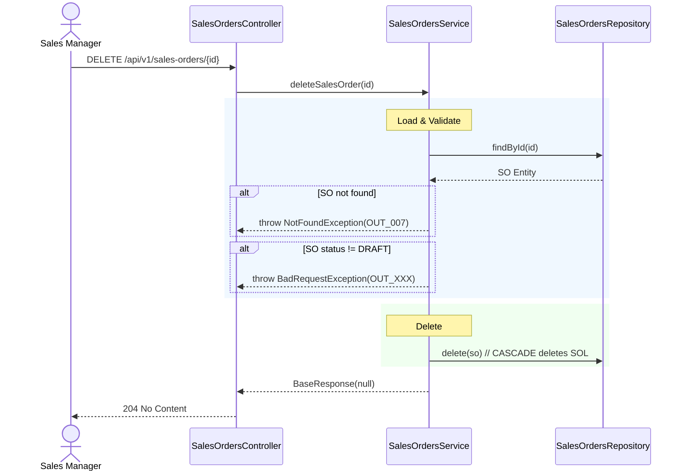
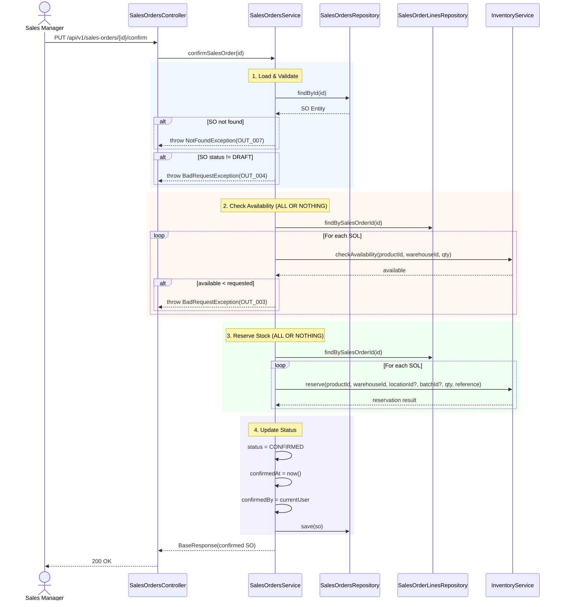
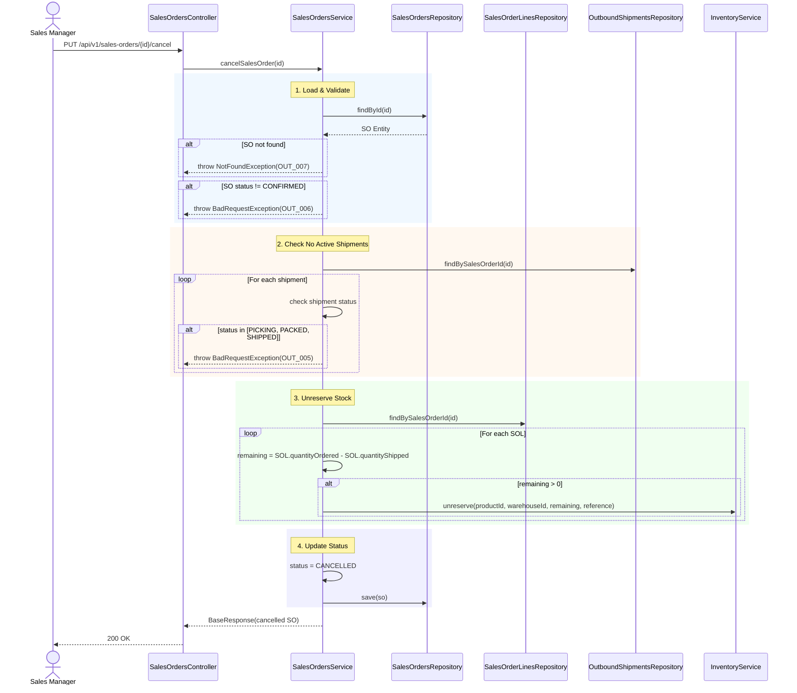

# BA Document - Sales Order (SO) Module
## Business Analysis - Phase 6 Parent Module

---

## 📋 Document Information

| Property | Value |
|----------|-------|
| **Module** | Sales Order (SO) |
| **Parent Phase** | Phase 6: Outbound Operations |
| **Version** | 1.0 |
| **Date** | March 16, 2026 |
| **Status** | Ready for Development |
| **Author** | Business Analyst |
| **Parent Jira** | [WHS-47](https://jira.example.com/browse/WHS-47) - Sales Orders API Completion |
| **Jira Tasks** | [WHS-59](https://jira.example.com/browse/WHS-59) - SO CRUD APIs, [WHS-60](https://jira.example.com/browse/WHS-60) - SO Confirm/Cancel APIs |

---

## 1. Overview

### 1.1 Vị trí trong luồng Outbound

```
Sales Order (SO) ◄── Parent Module
    │
    ├── 1:N ──▶ Sales Order Lines (SOL) ◄── [WHS-61]
    │                │
    │                └── Mỗi SOL: product, qty, price, shipped
    │
    └── 1:N ──▶ Outbound Shipments (OB) ◄── [WHS-62, WHS-63]
                     │
                     └── 1:N ──▶ Outbound Shipment Lines (OBL) ◄── [WHS-65]
```

### 1.2 Flow triển khai

```
Sales Order (SO) ──▶ Sales Order Lines (SOL) ──▶ Outbound Shipments (OB) ──▶ Outbound Shipment Lines (OBL)
      [WHS-59]            [WHS-61]                    [WHS-62, WHS-63]             [WHS-65]
      [WHS-60]
```

---

## 2. Entity Definition

### 2.1 SalesOrders Entity

```java
// Entity: SalesOrders
@Table(name = "sales_orders")
public class SalesOrders extends BaseEntity {
    
    @Column(name = "so_number", nullable = false, unique = true)
    private String soNumber;  // Format: SO-YYYY-NNNN
    
    @Column(name = "customer_id", nullable = false)
    private String customerId;  // FK to business_partners (type = CUSTOMER)
    
    @Column(name = "warehouse_id", nullable = false)
    private String warehouseId;  // FK to warehouses
    
    @Column(name = "order_date", nullable = false)
    private LocalDate orderDate;
    
    @Column(name = "requested_delivery_date", nullable = false)
    private LocalDate requestedDeliveryDate;
    
    @Enumerated(EnumType.STRING)
    @Column(name = "status", nullable = false)
    private SalesOrdersStatus status;
    
    @Column(name = "sub_total", nullable = false, precision = 15, scale = 2)
    private BigDecimal subTotal;  // Computed from lines
    
    @Column(name = "tax_amount", nullable = false, precision = 15, scale = 2)
    private BigDecimal taxAmount;  // Computed from lines
    
    @Column(name = "total_amount", nullable = false, precision = 15, scale = 2)
    private BigDecimal totalAmount;  // Computed: subTotal + taxAmount
    
    @Enumerated(EnumType.STRING)
    @Column(name = "currency", nullable = false)
    private CurrencyType currency;
    
    @Column(name = "notes", columnDefinition = "TEXT")
    private String notes;
    
    @Column(name = "confirmed_at")
    private LocalDateTime confirmedAt;
    
    @Column(name = "confirmed_by")
    private String confirmedBy;
}
```

### 2.2 Status Enum

```java
public enum SalesOrdersStatus {
    DRAFT,              // Mới tạo, có thể edit
    CONFIRMED,          // Đã xác nhận, đã reserve tồn kho
    PARTIALLY_SHIPPED, // Đã giao một phần
    COMPLETED,          // Hoàn tất (tất cả đã giao)
    CANCELLED           // Đã hủy
}
```

### 2.3 Unique Constraints

| Constraint | Columns | Description |
|------------|---------|-------------|
| UK | `so_number` | Unique per system |

### 2.4 Foreign Keys

| FK | References | On Delete |
|----|------------|-----------|
| customer_id | business_partners(id) | RESTRICT |
| warehouse_id | warehouses(id) | RESTRICT |
| confirmed_by | accounts(id) | SET NULL |

---

## 3. State Machine

### 3.1 Sales Order Lifecycle



### 3.2 State Transition Rules

| From State | To State | Trigger | Pre-condition | Side Effect |
|------------|----------|---------|---------------|-------------|
| DRAFT | CONFIRMED | /confirm | DRAFT only | reserve inventory |
| DRAFT | CANCELLED | /cancel | DRAFT only | none |
| CONFIRMED | PARTIALLY_SHIPPED | shipment confirm | - | update shipped qty |
| CONFIRMED | COMPLETED | shipment confirm | all lines shipped | - |
| PARTIALLY_SHIPPED | COMPLETED | shipment confirm | all lines shipped | - |
| PARTIALLY_SHIPPED | PARTIALLY_SHIPPED | shipment confirm | partial | - |

---

## 4. Business Flows

### 4.1 Flow: Create Sales Order



### 4.2 Flow: Update Sales Order (DRAFT only)



**Lưu Ý:** Update SO không bao gồm thay đổi lines. Lines được quản lý qua SOL APIs riêng.

### 4.3 Flow: Delete Sales Order (DRAFT only)



### 4.4 Flow: Confirm Sales Order (RESERVE)



### 4.5 Flow: Cancel Sales Order (UNRESERVE)



---

## 5. API Specification

### 5.1 Sales Orders APIs

| # | Method | Endpoint | Description | Jira Task | Auth |
|---|--------|----------|-------------|-----------|------|
| 1 | `POST` | `/api/v1/sales-orders` | Create SO (DRAFT) | [WHS-59](https://jira.example.com/browse/WHS-59) | ADMIN, MANAGER |
| 2 | `GET` | `/api/v1/sales-orders` | List SOs (paginated + filters) | [WHS-59](https://jira.example.com/browse/WHS-59) | isAuthenticated |
| 3 | `GET` | `/api/v1/sales-orders/{id}` | Get SO details | [WHS-59](https://jira.example.com/browse/WHS-59) | isAuthenticated |
| 4 | `GET` | `/api/v1/sales-orders/{id}/lines` | Get SO lines | [WHS-59](https://jira.example.com/browse/WHS-59) | isAuthenticated |
| 5 | `PUT` | `/api/v1/sales-orders/{id}` | Update SO (DRAFT only) | [WHS-59](https://jira.example.com/browse/WHS-59) | ADMIN, MANAGER |
| 6 | `DELETE` | `/api/v1/sales-orders/{id}` | Delete SO (DRAFT only) | [WHS-59](https://jira.example.com/browse/WHS-59) | ADMIN, MANAGER |
| 7 | `PUT` | `/api/v1/sales-orders/{id}/confirm` | Confirm → reserve | [WHS-60](https://jira.example.com/browse/WHS-60) | ADMIN, MANAGER |
| 8 | `PUT` | `/api/v1/sales-orders/{id}/cancel` | Cancel → unreserve | [WHS-60](https://jira.example.com/browse/WHS-60) | ADMIN, MANAGER |

### 5.2 Query Parameters (List API)

| Parameter | Type | Description |
|-----------|------|-------------|
| `soNumber` | String | Filter by SO number |
| `customerId` | UUID | Filter by customer |
| `warehouseId` | UUID | Filter by warehouse |
| `status` | String | Filter by status |
| `orderDateFrom` | Date | Filter from order date |
| `orderDateTo` | Date | Filter to order date |
| `requestedDeliveryDateFrom` | Date | Filter from delivery date |
| `requestedDeliveryDateTo` | Date | Filter to delivery date |
| `page` | Integer | Page number (0-based) |
| `size` | Integer | Page size |
| `sort` | String | Sort field (createdAt, updatedAt, soNumber, orderDate, requestedDeliveryDate, status) |

### 5.3 Request/Response Models

#### 5.3.1 Create Request
```json
{
  "customerId": "uuid",
  "warehouseId": "uuid",
  "orderDate": "2026-03-16",
  "requestedDeliveryDate": "2026-03-23",
  "currency": "USD",
  "notes": "Optional notes",
  "lines": [
    {
      "productId": "uuid",
      "quantityOrdered": 10.00,
      "unitPrice": 25.50,
      "notes": "Optional"
    }
  ]
}
```

#### 5.3.2 Response
```json
{
  "id": "uuid",
  "soNumber": "SO-2026-0001",
  "customerId": "uuid",
  "warehouseId": "uuid",
  "orderDate": "2026-03-16",
  "requestedDeliveryDate": "2026-03-23",
  "status": "DRAFT",
  "subTotal": 255.00,
  "taxAmount": 0.00,
  "totalAmount": 255.00,
  "currency": "USD",
  "notes": "...",
  "confirmedAt": null,
  "confirmedBy": null,
  "createdAt": "2026-03-16T10:00:00",
  "updatedAt": "2026-03-16T10:00:00",
  "lines": [...]
}
```

---

## 6. Business Rules

### 6.1 Creation Rules

| BR-ID | Rule | Description |
|-------|------|-------------|
| BR-SO-01 | SO Number Format | `SO-YYYY-NNNN`, auto-increment per year |
| BR-SO-02 | Customer Required | Must exist, type=CUSTOMER, status=ACTIVE |
| BR-SO-03 | Warehouse Required | Must exist, status=ACTIVE |
| BR-SO-04 | At Least One Line | SO must have at least one SOL |
| BR-SO-05 | Line Valid Product | Each line must reference active product |
| BR-SO-06 | Line Quantity Positive | quantityOrdered > 0 |
| BR-SO-07 | Line Price Non-negative | unitPrice >= 0 |
| BR-SO-08 | Totals Computed | subTotal, taxAmount, totalAmount computed from lines |

### 6.2 Update Rules

| BR-ID | Rule | Description |
|-------|------|-------------|
| BR-SO-09 | DRAFT Only | Only DRAFT SO can be updated |
| BR-SO-10 | No Line Change | Lines managed via SOL APIs |

### 6.3 Delete Rules

| BR-ID | Rule | Description |
|-------|------|-------------|
| BR-SO-11 | DRAFT Only | Only DRAFT SO can be deleted |
| BR-SO-12 | Cascade Delete | Deleting SO deletes all SOL |

### 6.4 Confirm Rules

| BR-ID | Rule | Description |
|-------|------|-------------|
| BR-SO-13 | DRAFT Only | Only DRAFT SO can be confirmed |
| BR-SO-14 | All-or-Nothing | Reserve must succeed for ALL lines or rollback |
| BR-SO-15 | Availability Check | Check available stock before reserve |
| BR-SO-16 | Exclude Quarantine | Available excludes QUARANTINE batches |
| BR-SO-17 | Immutable After Confirm | CONFIRMED SO cannot be edited |

### 6.5 Cancel Rules

| BR-ID | Rule | Description |
|-------|------|-------------|
| BR-SO-18 | CONFIRMED Only | Only CONFIRMED SO can be cancelled |
| BR-SO-19 | No Active Shipment | Cannot cancel if has PICKING/PACKED/SHIPPED shipments |
| BR-SO-20 | All-or-Nothing | Unreserve must succeed for ALL remaining or rollback |
| BR-SO-21 | Audit Trail | Cancelled SO retained for audit |

---

## 7. Error Codes

| Code | Description | HTTP |
|------|-------------|------|
| OUT_001 | Sales order must have at least one line | 400 |
| OUT_002 | Customer not found or not active | 400 |
| OUT_003 | Insufficient stock for product {sku}: available={x}, requested={y} | 400 |
| OUT_004 | Can only confirm DRAFT orders | 400 |
| OUT_005 | Cannot cancel SO with active shipments | 400 |
| OUT_006 | Can only cancel CONFIRMED orders | 400 |
| OUT_007 | Sales order not found | 404 |
| OUT_XXX | Warehouse not found or inactive | 400 |

---

## 8. Integration Points

### 8.1 With Sales Order Lines (SOL)

| SO Operation | SOL Impact |
|--------------|------------|
| Create SO | Create SOLs in same request |
| Update SO | No impact (lines via SOL APIs) |
| Delete SO | CASCADE delete all SOL |
| Confirm SO | Reserve per SOL |
| Cancel SO | Unreserve remaining per SOL |

### 8.2 With Outbound Shipments (OB)

| SO Status | OB Impact |
|-----------|-----------|
| CONFIRMED | Can create shipment |
| PARTIALLY_SHIPPED | Can create additional shipment |
| COMPLETED | Cannot create shipment |
| CANCELLED | Cannot create shipment |

### 8.3 With Inventory

| SO Operation | Inventory Operation | Trigger |
|--------------|-------------------|---------|
| Confirm | `reserve()` | Called per SOL |
| Cancel | `unreserve()` | Called per SOL with remaining qty |

---

## 9. Acceptance Criteria

### 9.1 Create
- [ ] SO created with generated soNumber (SO-YYYY-NNNN)
- [ ] Customer validated (exists, type=CUSTOMER, ACTIVE)
- [ ] Warehouse validated (exists, ACTIVE)
- [ ] At least one line required
- [ ] subTotal computed from lines (qty × price)
- [ ] taxAmount and totalAmount computed
- [ ] Status = DRAFT by default
- [ ] Lines created with quantityShipped = 0

### 9.2 Read
- [ ] List with pagination and filters works
- [ ] Get by ID returns SO with all lines
- [ ] Get by ID returns 404 for non-existent SO

### 9.3 Update
- [ ] Only DRAFT SO can be updated
- [ ] Cannot update lines via this endpoint (use SOL APIs)
- [ ] Updated SO returns 200

### 9.4 Delete
- [ ] Only DRAFT SO can be deleted
- [ ] Deleting SO cascades to delete SOL
- [ ] Deleted SO returns 204

### 9.5 Confirm
- [ ] Only DRAFT SO can be confirmed
- [ ] Availability check for ALL lines before reserve
- [ ] Reserve for ALL lines in single transaction
- [ ] Rollback if any line fails
- [ ] Status changes to CONFIRMED
- [ ] confirmedAt and confirmedBy populated

### 9.6 Cancel
- [ ] Only CONFIRMED SO can be cancelled
- [ ] Check no active shipments before unreserve
- [ ] Unreserve for ALL remaining quantities
- [ ] Status changes to CANCELLED
- [ ] Audit trail preserved

---

## 10. Comparison: SO vs PO (Inbound)

| Aspect | Sales Order (SO) | Purchase Order (PO) |
|--------|------------------|-------------------|
| Direction | Outbound (xuất kho) | Inbound (nhập kho) |
| Partner Type | Customer | Supplier |
| Lifecycle | DRAFT→CONFIRMED→PARTIALLY_SHIPPED→COMPLETED | DRAFT→CONFIRMED→PARTIALLY_RECEIVED→COMPLETED |
| On Confirm | Reserve inventory | No immediate effect |
| On Receipt/Ship | decrease inventory | increase inventory |
| Lines | Sales Order Lines | Purchase Order Lines |
| Reference Doc | Outbound Shipments | Inbound Receipts |
| Status | PARTIALLY_SHIPPED | PARTIALLY_RECEIVED |

---

## 11. Document History

| Version | Date | Author | Changes |
|---------|------|--------|---------|
| 1.0 | Mar 16, 2026 | BA | Initial SO business analysis |

---

**Document Status:** ✅ Ready for Development  
**Related Documents:**
- [BA_PHASE6_OUTBOUND_OPERATIONS_COMPLETE.md](./BA_PHASE6_OUTBOUND_OPERATIONS_COMPLETE.md) - Parent document
- [BA_PHASE6_SALES_ORDER_LINES.md](./BA_PHASE6_SALES_ORDER_LINES.md) - SOL module
- [BA_PHASE6_OUTBOUND_SHIPMENT_LINES.md](./BA_PHASE6_OUTBOUND_SHIPMENT_LINES.md) - OBL module
- [DB_MODULE_06_OUTBOUND.md](./DB_MODULE_06_OUTBOUND.md) - Database schema
