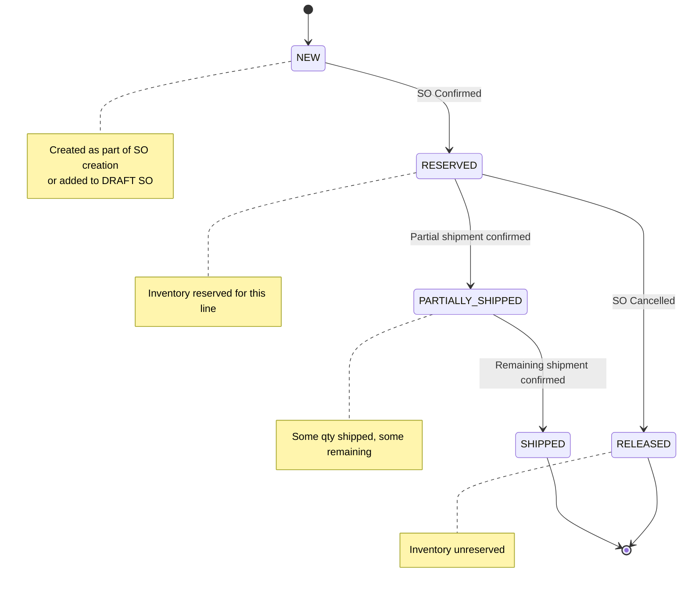
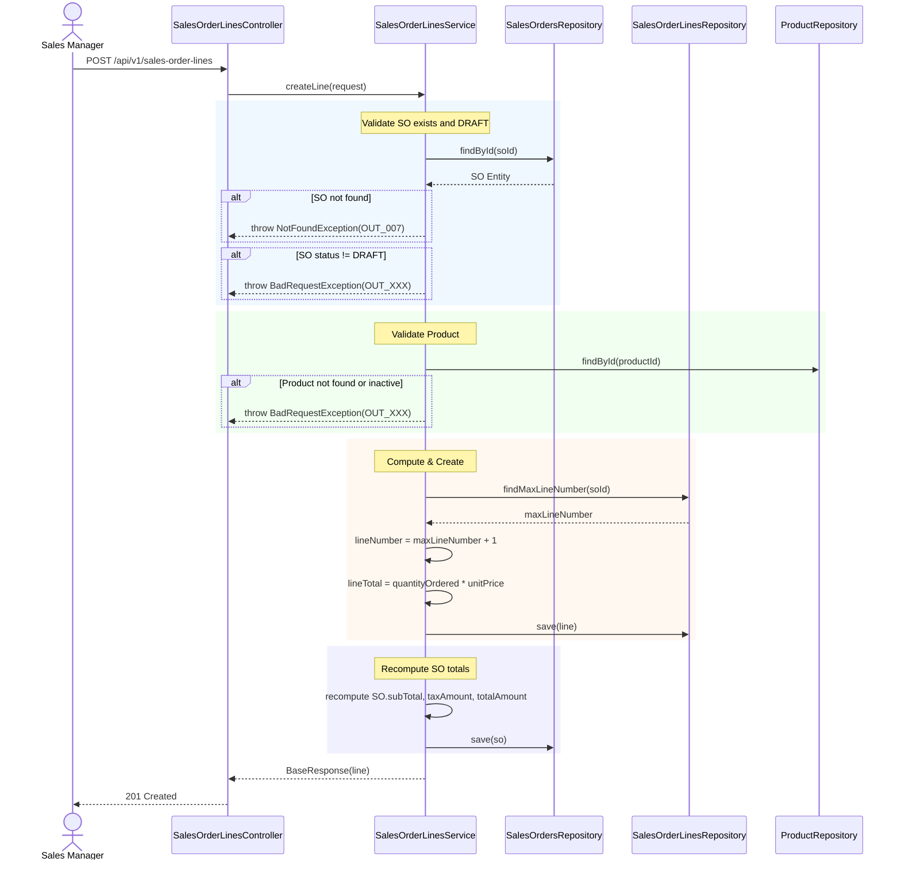
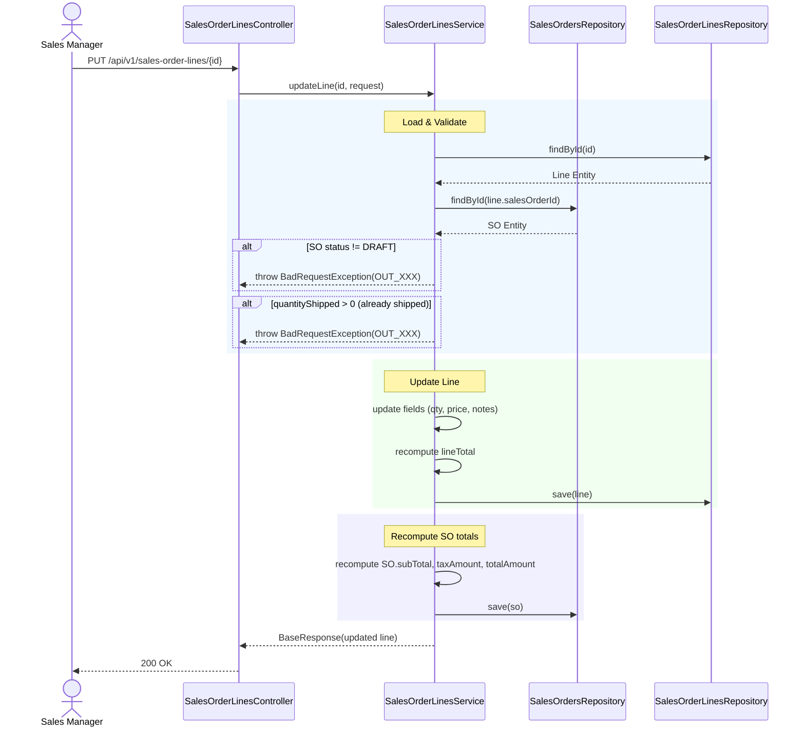
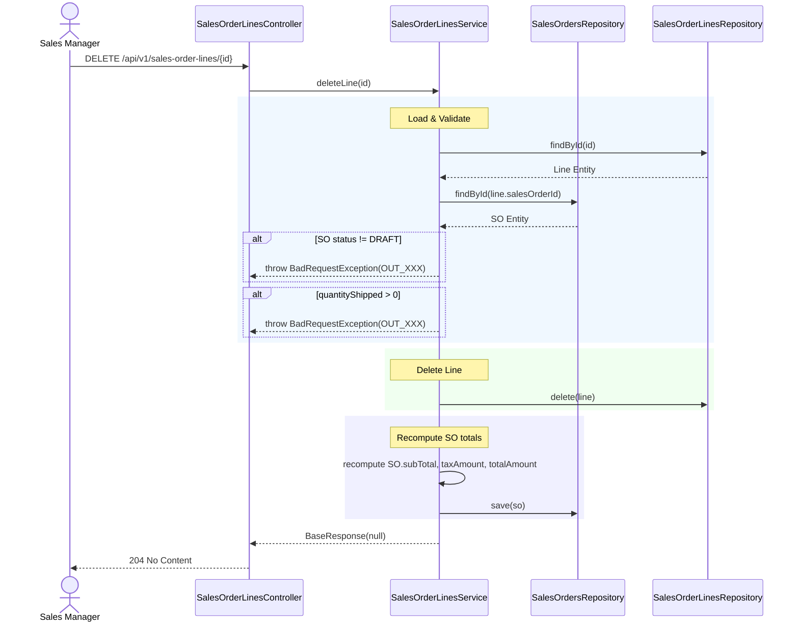
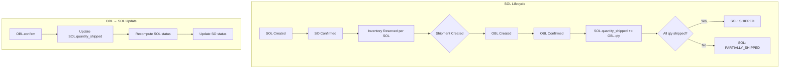

# BA Document - Sales Order Lines (SOL) Module
## Business Analysis - Phase 6 Child Module

---

## 📋 Document Information

| Property | Value |
|----------|-------|
| **Module** | Sales Order Lines (SOL) |
| **Parent Phase** | Phase 6: Outbound Operations |
| **Version** | 1.0 |
| **Date** | March 16, 2026 |
| **Status** | Ready for Development |
| **Author** | Business Analyst |
| **Parent Jira** | [WHS-48](https://jira.example.com/browse/WHS-48) - Sales Order Lines API Completion |
| **Jira Task** | [WHS-61](https://jira.example.com/browse/WHS-61) - Implement sales order lines APIs |

---

## 1. Overview

### 1.1 Vị trí trong luồng Outbound

```
Sales Order (SO)
    │
    ├── 1:N ──▶ Sales Order Lines (SOL)
    │                │
    │                ├── product_id
    │                ├── quantity_ordered
    │                ├── quantity_shipped
    │                ├── unit_price
    │                └── line_total
    │
    └── 1:N ──▶ Outbound Shipments (OB)
                        │
                        └── 1:N ──▶ Outbound Shipment Lines (OBL)
                                        │
                                        └── sales_order_line_id (FK to SOL)
```

### 1.2 Mối quan hệ với các module

| Module | Relationship | Direction |
|--------|-------------|-----------|
| **Sales Orders (SO)** | Parent | SOL belongs to SO |
| **Outbound Shipments (OB)** | Referenced by | OBL references SOL |
| **Inventory** | Check availability | reserve/unreserve per line |
| **Products** | Line item | Each SOL references one product |

---

## 2. Entity Definition

### 2.1 SalesOrderLines Entity

```java
// Entity: SalesOrderLines
@Table(name = "sales_order_lines")
public class SalesOrderLines extends BaseEntity {
    
    @Column(name = "sales_order_id", nullable = false)
    private String salesOrderId;
    
    @Column(name = "product_id", nullable = false)
    private String productId;
    
    @Column(name = "line_number", nullable = false)
    private Integer lineNumber;
    
    @Column(name = "quantity_ordered", nullable = false, precision = 15, scale = 2)
    private BigDecimal quantityOrdered;
    
    @Column(name = "quantity_shipped", nullable = false, precision = 15, scale = 2)
    private BigDecimal quantityShipped;  // Default: 0
    
    @Column(name = "unit_price", nullable = false, precision = 15, scale = 2)
    private BigDecimal unitPrice;
    
    @Column(name = "line_total", nullable = false, precision = 15, scale = 2)
    private BigDecimal lineTotal;  // Computed: qty * unitPrice
    
    @Column(name = "notes")
    private String notes;
}
```

### 2.2 Unique Constraints

| Constraint | Columns | Description |
|------------|---------|-------------|
| UK | `(sales_order_id, line_number)` | Each SO has unique line numbers |
| FK | `sales_order_id` → `sales_orders(id)` | CASCADE delete |
| FK | `product_id` → `products(id)` | RESTRICT delete |

---

## 3. State Machine

### 3.1 SOL Status (Derived from Parent SO)



### 3.2 SOL vs SO Status Synchronization

| SO Status | SOL Status | Description |
|-----------|------------|-------------|
| DRAFT | NEW | Lines editable, no inventory effect |
| CONFIRMED | RESERVED | All lines have reserved inventory |
| PARTIALLY_SHIPPED | PARTIALLY_SHIPPED | Some lines fully shipped, some partial |
| COMPLETED | SHIPPED | All lines fully shipped |
| CANCELLED | RELEASED | All reserved inventory released |

---

## 4. Business Flows

### 4.1 Flow: SOL Creation



### 4.2 Flow: SOL Update



### 4.3 Flow: SOL Delete



---

## 5. SOL → OBL Integration

### 5.1 Relationship Diagram

```
┌─────────────────────────────────────────────────────────────────────────┐
│                         Sales Order (SO)                               │
│  ─────────────────────────────────────────────────────────────────  │
│  id: UUID                                                              │
│  so_number: SO-YYYY-NNNN                                              │
│  status: DRAFT | CONFIRMED | PARTIALLY_SHIPPED | COMPLETED | CANCELLED│
└────────────────────────────────┬────────────────────────────────────────┘
                                 │ 1:N
                                 ▼
┌─────────────────────────────────────────────────────────────────────────┐
│                      Sales Order Lines (SOL)                           │
│  ─────────────────────────────────────────────────────────────────  │
│  id: UUID                                                              │
│  sales_order_id: FK → SO                                              │
│  product_id: FK → Product                                              │
│  line_number: INT (1, 2, 3...)                                         │
│  quantity_ordered: DECIMAL                                             │
│  quantity_shipped: DECIMAL (default 0)                                  │
│  unit_price: DECIMAL                                                   │
│  line_total: DECIMAL (computed)                                         │
└────────────────────────────────┬────────────────────────────────────────┘
                                 │
                                 │ Referenced by (not owned by)
                                 ▼
┌─────────────────────────────────────────────────────────────────────────┐
│                   Outbound Shipments (OB)                              │
│  ─────────────────────────────────────────────────────────────────  │
│  id: UUID                                                              │
│  sales_order_id: FK → SO (NOT SOL)                                     │
│  status: DRAFT | PICKING | PACKED | SHIPPED | CANCELLED               │
└────────────────────────────────┬────────────────────────────────────────┘
                                 │ 1:N
                                 ▼
┌─────────────────────────────────────────────────────────────────────────┐
│                   Outbound Shipment Lines (OBL)                      │
│  ─────────────────────────────────────────────────────────────────  │
│  id: UUID                                                              │
│  outbound_shipment_id: FK → OB                                        │
│  sales_order_line_id: FK → SOL ◄── CRITICAL LINK                      │
│  product_id: FK → Product                                             │
│  batch_id: FK → Batch (nullable)                                       │
│  location_id: FK → Location                                             │
│  quantity_shipped: DECIMAL                                             │
│  picked_at: TIMESTAMP                                                  │
│  picked_by: UUID                                                       │
└─────────────────────────────────────────────────────────────────────────┘
```

### 5.2 Critical Business Rules

| Rule | Description |
|------|-------------|
| BR-SOL-01 | OBL must reference valid SOL via `sales_order_line_id` |
| BR-SOL-02 | OBL quantity_shipped ≤ SOL.quantity_ordered - SOL.quantity_shipped |
| BR-SOL-03 | When OBL confirmed: SOL.quantity_shipped += OBL.quantity_shipped |
| BR-SOL-04 | SOL cannot be edited if quantity_shipped > 0 |
| BR-SOL-05 | SOL cannot be deleted if quantity_shipped > 0 |
| BR-SOL-06 | SOL line_number is auto-sequential within SO |

### 5.3 Status Propagation Flow



---

## 6. API Specification

### 6.1 Sales Order Lines APIs

| # | Method | Endpoint | Description | Jira Task | Parent |
|---|--------|----------|-------------|-----------|--------|
| 1 | `POST` | `/api/v1/sales-order-lines` | Add line to SO | [WHS-61](https://jira.example.com/browse/WHS-61) | WHS-48 |
| 2 | `PUT` | `/api/v1/sales-order-lines/{id}` | Update line | [WHS-61](https://jira.example.com/browse/WHS-61) | WHS-48 |
| 3 | `DELETE` | `/api/v1/sales-order-lines/{id}` | Delete line | [WHS-61](https://jira.example.com/browse/WHS-61) | WHS-48 |
| 4 | `GET` | `/api/v1/sales-order-lines/by-so/{soId}` | Get lines by SO | [WHS-61](https://jira.example.com/browse/WHS-61) | WHS-48 |

### 6.2 API Request/Response Models

#### 6.2.1 Create Line Request
```json
{
  "salesOrderId": "uuid",
  "productId": "uuid",
  "quantityOrdered": 10.00,
  "unitPrice": 25.50,
  "notes": "Optional notes"
}
```

#### 6.2.2 Update Line Request
```json
{
  "quantityOrdered": 15.00,
  "unitPrice": 24.00,
  "notes": "Updated notes"
}
```

#### 6.2.3 Response
```json
{
  "id": "uuid",
  "salesOrderId": "uuid",
  "productId": "uuid",
  "lineNumber": 1,
  "quantityOrdered": 10.00,
  "quantityShipped": 0.00,
  "unitPrice": 25.50,
  "lineTotal": 255.00,
  "notes": "..."
}
```

---

## 7. Validation Rules

### 7.1 Create/Update Validation

| Field | Rule | Error Code |
|-------|------|------------|
| `salesOrderId` | Required, valid UUID | OUT_XXX |
| `productId` | Required, valid UUID, product ACTIVE | OUT_XXX |
| `quantityOrdered` | Required, > 0 | OUT_XXX |
| `unitPrice` | Required, >= 0 | OUT_XXX |
| `lineTotal` | Computed automatically | - |

### 7.2 Business Constraints

| Constraint | Rule | Error Code |
|------------|------|------------|
| SO Status | Must be DRAFT | OUT_XXX |
| Already Shipped | quantityShipped must be 0 | OUT_XXX |
| Product Exists | Product must exist and ACTIVE | OUT_XXX |

---

## 8. Integration Points

### 8.1 With Sales Orders (Parent)

| Operation | Impact on SOL | Impact on SO |
|-----------|---------------|--------------|
| Create SOL | New line created | totals recalculated |
| Update SOL | Line updated | totals recalculated |
| Delete SOL | Line deleted | totals recalculated |
| SO Confirm | SOL status → RESERVED | status → CONFIRMED |
| SO Cancel | SOL status → RELEASED | status → CANCELLED |

### 8.2 With Outbound Shipments

| Operation | Impact on SOL | Notes |
|-----------|---------------|-------|
| OBL Create | Validate qty ≤ remaining | Check remaining qty |
| OBL Confirm | SOL.quantityShipped += OBL.qty | Auto-update |

### 8.3 With Inventory

| SOL Operation | Inventory Operation | Trigger |
|---------------|---------------------|---------|
| SO Confirm | `reserve()` | Called per SOL |
| SO Cancel | `unreserve()` | Called per SOL |
| OBL Confirm | `decrease()` | Called per OBL, affects SOL |

---

## 9. Error Codes

| Code | Description | HTTP |
|------|-------------|------|
| SOL_001 | Sales order not found | 404 |
| SOL_002 | Sales order is not in DRAFT status | 400 |
| SOL_003 | Product not found or inactive | 400 |
| SOL_004 | Quantity must be greater than 0 | 400 |
| SOL_005 | Unit price must be >= 0 | 400 |
| SOL_006 | Cannot modify line with shipped quantity | 400 |
| SOL_007 | Sales order line not found | 404 |

---

## 10. Acceptance Criteria

### 10.1 Create Line
- [ ] Line created with correct line_number (auto-increment)
- [ ] Line total computed correctly (qty × price)
- [ ] SO totals recalculated after create
- [ ] Cannot create line for non-DRAFT SO

### 10.2 Update Line
- [ ] Line updated with new values
- [ ] Line total recomputed
- [ ] SO totals recalculated after update
- [ ] Cannot update line if already shipped

### 10.3 Delete Line
- [ ] Line deleted from database
- [ ] SO totals recalculated after delete
- [ ] Line numbers NOT re-sequenced (preserve audit)
- [ ] Cannot delete line if already shipped

### 10.4 Integration
- [ ] OBL can reference SOL via sales_order_line_id
- [ ] OBL quantity cannot exceed SOL remaining quantity
- [ ] OBL confirm updates SOL.quantity_shipped correctly

---

## 11. Comparison: SOL vs POL (Inbound)

| Aspect | Sales Order Lines (SOL) | Purchase Order Lines (POL) |
|--------|------------------------|---------------------------|
| Parent | Sales Orders | Purchase Orders |
| Referenced By | Outbound Shipment Lines | Inbound Receipt Lines |
| Quantity Field | quantity_ordered | quantityExpected, quantityReceived |
| Shipped/Received | quantity_shipped | quantityReceived |
| Price | unitPrice (selling) | unitCost (cost) |
| Status | RESERVED → SHIPPED | RECEIVED (on receipt confirm) |
| Inventory | reserve() on confirm | increase() on receipt confirm |

---

## 12. Document History

| Version | Date | Author | Changes |
|---------|------|--------|---------|
| 1.0 | Mar 16, 2026 | BA | Initial SOL business analysis |

---

**Document Status:** ✅ Ready for Development  
**Related Documents:**
- [BA_PHASE6_OUTBOUND_OPERATIONS_COMPLETE.md](./BA_PHASE6_OUTBOUND_OPERATIONS_COMPLETE.md) - Parent document
- [DB_MODULE_06_OUTBOUND.md](./DB_MODULE_06_OUTBOUND.md) - Database schema
