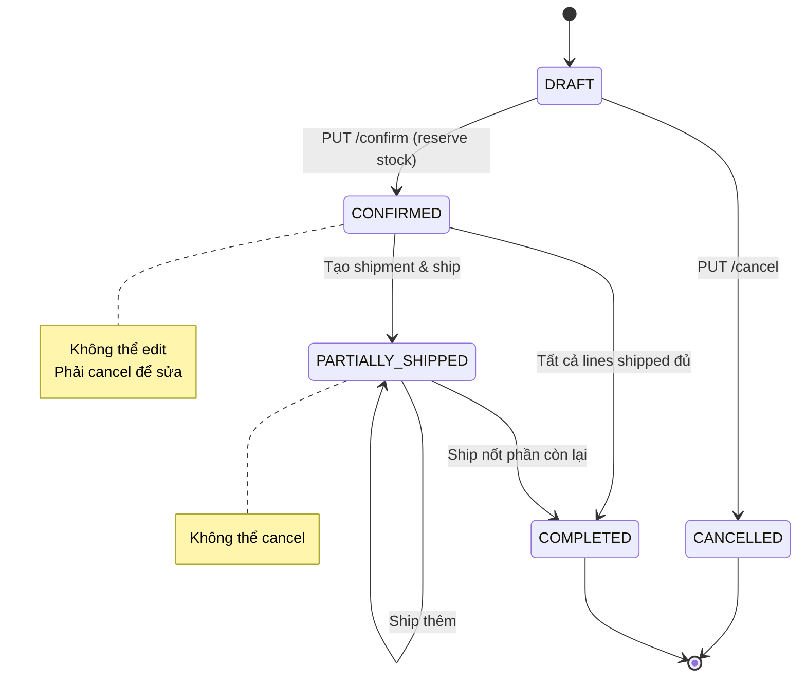
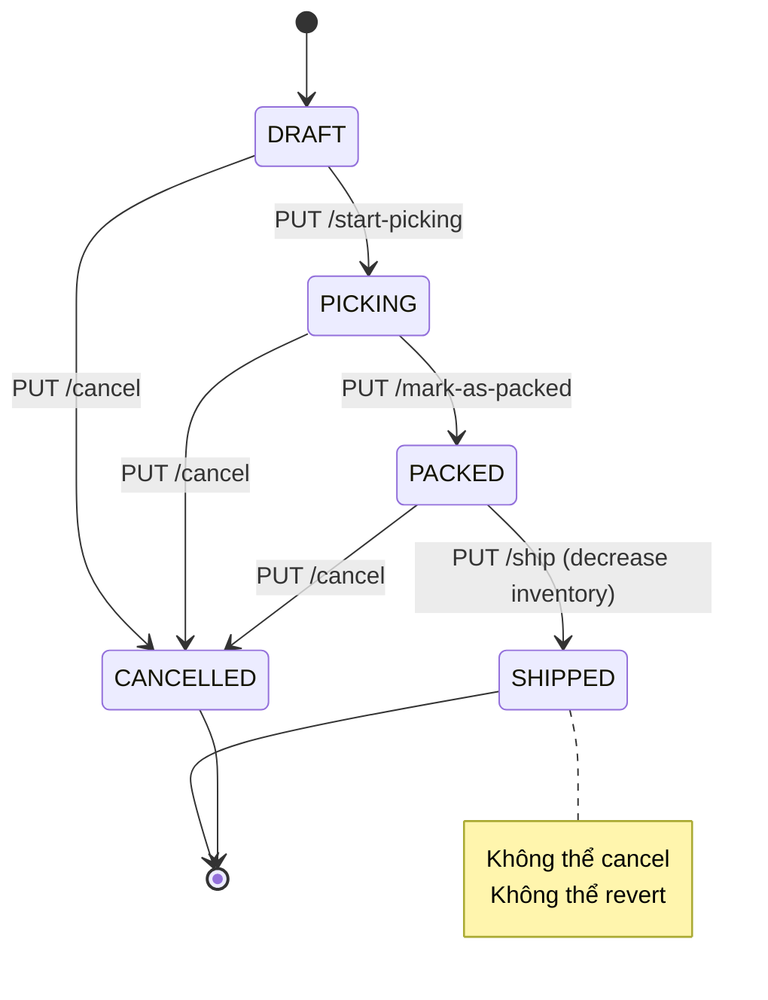
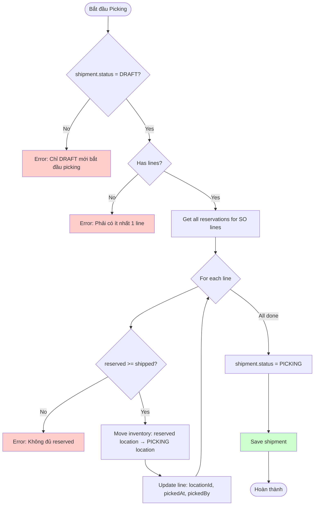
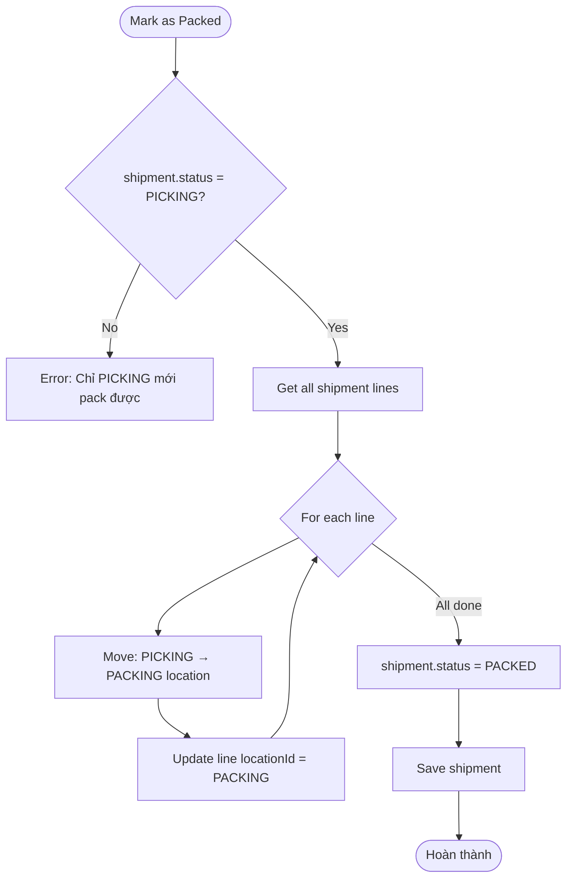
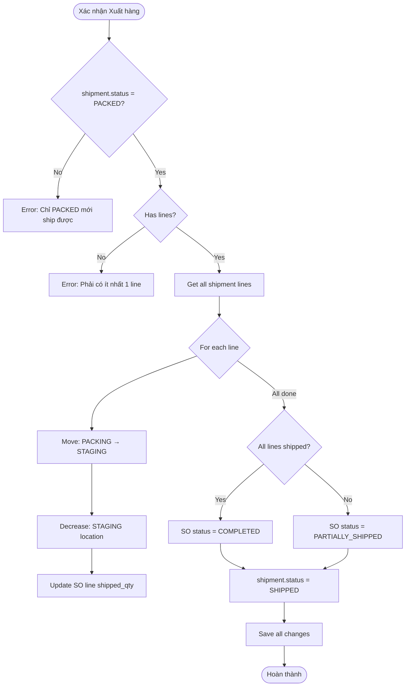
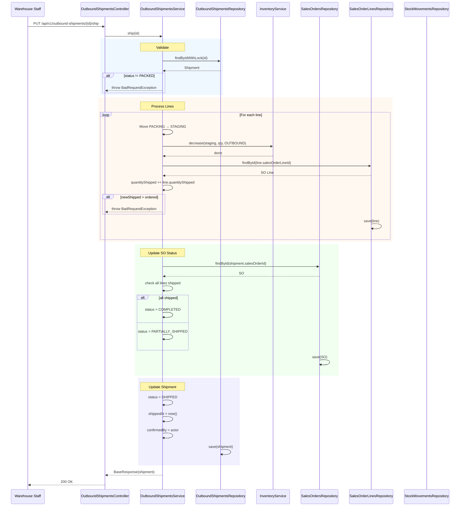

# Tài liệu Kịch bản & Biểu đồ - Module Outbound

---

## 📋 Thông tin Tài liệu

| Thuộc tính | Giá trị |
|------------|---------|
| **Module** | Outbound Operations |
| **Phiên bản** | 1.0 |
| **Ngày** | 25/03/2026 |
| **Trạng thái** | Hoàn thành |
| **Dựa trên** | Code thực tế (OutboundShipmentsServiceImpl.java) |

---

## 1. Tổng quan các Kịch bản (Scenarios)

Module Outbound bao gồm 4 kịch bản chính:

| # | Kịch bản | Mô tả |
|---|----------|-------|
| 1 | **Tạo & Quản lý Sales Order** | Tạo, cập nhật, xác nhận, hủy đơn bán hàng |
| 2 | **Tạo & Quản lý Shipment** | Tạo lô xuất từ SO đã xác nhận |
| 3 | **Xử lý Picking & Packing** | Quy trình lấy hàng và đóng gói |
| 4 | **Xuất hàng (Ship)** | Xác nhận xuất kho, giảm tồn, cập nhật SO |

---

## 2. Kịch bản 1: Quản lý Sales Order

### 2.1 Sơ đồ State Machine - Sales Orders



### 2.2 Kịch bản chi tiết

#### Kịch bản 1.1: Tạo Sales Order (DRAFT)

| Thuộc tính | Giá trị |
|------------|---------|
| **Actor** | Sales Manager (ADMIN, MANAGER) |
| **API** | `POST /api/v1/sales-orders` |
| **Trigger** | Khách hàng đặt hàng |
| **Pre-condition** | Customer tồn tại, ACTIVE, type=CUSTOMER |
| **Post-condition** | SO được tạo với status=DRAFT |

**Flow:**
1. Sales Manager gửi request tạo SO với customer, warehouse, lines
2. System validate customer (tồn tại, ACTIVE, CUSTOMER)
3. System validate warehouse (tồn tại, ACTIVE)
4. System validate từng line (product tồn tại, ACTIVE)
5. System tính line_total = qty × unit_price
6. System tính subtotal, tax, total
7. System generate SO number (SO-YYYY-NNNN)
8. System lưu SO với status = DRAFT
9. Trả về response

#### Kịch bản 1.2: Xác nhận Sales Order (CONFIRMED)

| Thuộc tính | Giá trị |
|------------|---------|
| **Actor** | Sales Manager |
| **API** | `PUT /api/v1/sales-orders/{id}/confirm` |
| **Trigger** | Sales Manager xác nhận đơn hàng |
| **Pre-condition** | SO status = DRAFT |
| **Post-condition** | SO status = CONFIRMED, inventory reserved |

**Flow:**
1. Sales Manager gọi API confirm
2. System load SO, validate status = DRAFT
3. System check availability cho từng line (all-or-nothing)
4. System gọi inventory.reserve() cho từng line
5. System update SO status = CONFIRMED
6. System set confirmedAt, confirmedBy
7. Lưu SO và trả về response

**Business Rules:**
- BR: Nếu ANY line không đủ stock → rollback tất cả
- BR: Reservation phải atomic (tất cả hoặc không có gì)

#### Kịch bản 1.3: Hủy Sales Order

| Thuộc tính | Giá trị |
|------------|---------|
| **Actor** | Sales Manager |
| **API** | `PUT /api/v1/sales-orders/{id}/cancel` |
| **Trigger** | Sales Manager hủy đơn |
| **Pre-condition** | SO status = CONFIRMED, không có shipment đang xử lý |
| **Post-condition** | SO status = CANCELLED, inventory unreserved |

**Flow:**
1. Sales Manager gọi API cancel
2. System load SO, validate status = CONFIRMED
3. System check không có shipment ở trạng thái PICKING/PACKED/SHIPPED
4. System tính remaining qty = ordered - shipped cho từng line
5. System gọi inventory.unreserve() cho remaining qty
6. System update SO status = CANCELLED
7. Lưu và trả về response

**Business Rules:**
- BR: Không thể cancel nếu đã có shipment PICKING/PACKED/SHIPPED

---

## 3. Kịch bản 2: Quản lý Outbound Shipment

### 3.1 Sơ đồ State Machine - Shipments



### 3.2 Kịch bản chi tiết

#### Kịch bản 2.1: Tạo Outbound Shipment

| Thuộc tính | Giá trị |
|------------|---------|
| **Actor** | Warehouse Staff (ADMIN, MANAGER) |
| **API** | `POST /api/v1/outbound-shipments` |
| **Trigger** | Warehouse tạo lô xuất hàng |
| **Pre-condition** | SO status = CONFIRMED hoặc PARTIALLY_SHIPPED |
| **Post-condition** | Shipment tạo với status = DRAFT |

**Flow:**
1. Staff gửi request tạo shipment với salesOrderId, warehouseId
2. System load SO, validate status = CONFIRMED hoặc PARTIALLY_SHIPPED
3. System validate warehouse matching SO's warehouse
4. System generate shipment number (SHIP-YYYY-NNNN)
5. System lưu shipment với status = DRAFT
6. Trả về response

**Business Rules:**
- BR: Shipment phải cùng warehouse với SO

#### Kịch bản 2.2: Thêm Shipment Lines

| Thuộc tính | Giá trị |
|------------|---------|
| **Actor** | Warehouse Staff |
| **API** | `POST /api/v1/outbound-shipment-lines` |
| **Trigger** | Thêm sản phẩm vào shipment |
| **Pre-condition** | Shipment status = DRAFT, SO đã CONFIRMED |
| **Post-condition** | Line được thêm vào shipment |

**Flow:**
1. Staff gửi request thêm line (product, quantity, salesOrderLineId)
2. System load shipment, validate status = DRAFT
3. System load SO line, validate còn remaining qty
4. System validate quantity ≤ remaining
5. System generate lineNumber tự tăng
6. System lưu line và trả về response

---

## 4. Kịch bản 3: Picking & Packing Process

### 4.1 Activity Diagram - Picking Process



### 4.2 Kịch bản chi tiết: Start Picking

| Thuộc tính | Giá trị |
|------------|---------|
| **Actor** | Warehouse Staff |
| **API** | `PUT /api/v1/outbound-shipments/{id}/start-picking` |
| **Trigger** | Bắt đầu quá trình lấy hàng |
| **Pre-condition** | Shipment status = DRAFT, có ít nhất 1 line |
| **Post-condition** | Shipment status = PICKING, inventory di chuyển |

**Flow:**
1. Staff gọi API start-picking
2. System load shipment với lock (pessimistic)
3. Validate status = DRAFT
4. Validate có ít nhất 1 line
5. Với mỗi line:
   - Tìm reservation theo salesOrderLineId
   - Validate quantity ≤ reserved
   - Di chuyển inventory từ reserved location → PICKING location
   - Cập nhật line (locationId, pickedAt, pickedBy)
6. Update shipment status = PICKING
7. Lưu và trả về response

**Inventory Flow:**
```
Reserved Location → PICKING Location (consumeReserved=true)
```

### 4.3 Activity Diagram - Mark as Packed



### 4.4 Kịch bản: Mark as Packed

| Thuộc tính | Giá trị |
|------------|---------|
| **API** | `PUT /api/v1/outbound-shipments/{id}/mark-as-packed` |
| **Pre-condition** | Shipment status = PICKING |
| **Post-condition** | Shipment status = PACKED |

**Flow:**
1. Load shipment với lock
2. Validate status = PICKING
3. Với mỗi line: di chuyển inventory PICKING → PACKING
4. Update shipment status = PACKED
5. Lưu và trả về

---

## 5. Kịch bản 4: Xuất hàng (Ship)

### 5.1 Activity Diagram - Ship Process



### 5.2 Sequence Diagram - Ship Process



### 5.3 Kịch bản chi tiết: Ship

| Thuộc tính | Giá trị |
|------------|---------|
| **Actor** | Warehouse Staff |
| **API** | `PUT /api/v1/outbound-shipments/{id}/ship` |
| **Trigger** | Xác nhận xuất kho |
| **Pre-condition** | Shipment status = PACKED, có lines |
| **Post-condition** | Shipment status = SHIPPED, inventory giảm |

**Flow:**
1. Staff gọi API ship
2. System load shipment với lock
3. Validate status = PACKED
4. Validate có lines
5. Với mỗi line:
   - Di chuyển inventory: PACKING → STAGING
   - Gọi inventory.decrease() từ STAGING
   - Cập nhật SO line shipped_qty
   - Validate không overship
5. Update SO status (COMPLETED/PARTIALLY_SHIPPED)
6. Update shipment status = SHIPPED
7. Set shippedAt, confirmedBy
8. Lưu và trả về

**Inventory Flow:**
```
PACKING → STAGING (move, consumeReserved=false)
STAGING → (decrease) (consumeReserved=false)
```

---

## 6. Kịch bản 5: Cancel Shipment

### 6.1 Activity Diagram - Cancel Shipment

```mermaid
flowchart TD
    Start([Cancel Shipment]) --> CheckStatus{status = SHIPPED?}
    
    CheckStatus -->|Yes| Error1[Error: Không thể cancel SHIPPED]
    CheckStatus -->|No| CheckAlready{status = CANCELLED?}
    
    CheckAlready -->|Yes| ReturnSame[Return current shipment]
    CheckAlready -->|No| CheckMovements{Has movements?}
    
    CheckMovements -->|Yes| Error2[Error: Đã có movements, không cancel]
    CheckMovements -->|No| CheckState{PICKING/PACKED?}
    
    CheckState -->|No| UpdateCancel[status = CANCELLED, save, return]
    CheckState -->|Yes| UnreserveLoop{For each line}
    
    UnreserveLoop --> Unreserve[unreserve(product, warehouse, orderLineId, qty)]
    Unreserve --> UpdateCancel
    
    UpdateCancel --> End([Hoàn thành])
```

### 6.2 Kịch bản chi tiết: Cancel Shipment

| Thuộc tính | Giá trị |
|------------|---------|
| **Actor** | Warehouse Staff |
| **API** | `PUT /api/v1/outbound-shipments/{id}/cancel` |
| **Trigger** | Hủy lô xuất |
| **Pre-condition** | Status ≠ SHIPPED |
| **Post-condition** | Status = CANCELLED, inventory unreserved (nếu PICKING/PACKED) |

**Flow:**
1. Staff gọi API cancel
2. Load shipment với lock
3. Validate status ≠ SHIPPED (không thể cancel SHIPPED)
4. Check không có stock movements (đã ship một phần thì không cancel)
5. Nếu status = PICKING hoặc PACKED:
   - Với mỗi line: gọi inventory.unreserve()
6. Update status = CANCELLED
7. Lưu và trả về

---

## 7. Tổng hợp API Endpoints

| Module | Method | Endpoint | Status | Mô tả |
|--------|--------|----------|--------|-------|
| **Sales Orders** | POST | `/api/v1/sales-orders` | ✅ Done | Tạo SO (DRAFT) |
| | GET | `/api/v1/sales-orders` | ✅ Done | Danh sách SO |
| | GET | `/api/v1/sales-orders/{id}` | ✅ Done | Chi tiết SO |
| | PUT | `/api/v1/sales-orders/{id}` | ✅ Done | Update SO (DRAFT) |
| | PUT | `/api/v1/sales-orders/{id}/confirm` | ✅ Done | Confirm → reserve |
| | PUT | `/api/v1/sales-orders/{id}/cancel` | ✅ Done | Cancel → unreserve |
| **Sales Order Lines** | POST | `/api/v1/sales-order-lines` | ✅ Done | Thêm line |
| | GET | `/api/v1/sales-order-lines/by-so/{soId}` | ✅ Done | Lines by SO |
| | GET | `/api/v1/sales-order-lines/{id}` | ✅ Done | Chi tiết line |
| | PUT | `/api/v1/sales-order-lines/{id}` | ✅ Done | Update line |
| **Outbound Shipments** | POST | `/api/v1/outbound-shipments` | ✅ Done | Tạo shipment |
| | GET | `/api/v1/outbound-shipments` | ✅ Done | Danh sách |
| | GET | `/api/v1/outbound-shipments/{id}` | ✅ Done | Chi tiết |
| | PUT | `/api/v1/outbound-shipments/{id}` | ✅ Done | Update (DRAFT) |
| | PUT | `/api/v1/outbound-shipments/{id}/start-picking` | ✅ Done | DRAFT → PICKING |
| | PUT | `/api/v1/outbound-shipments/{id}/mark-as-packed` | ✅ Done | PICKING → PACKED |
| | PUT | `/api/v1/outbound-shipments/{id}/ship` | ✅ Done | PACKED → SHIPPED |
| | PUT | `/api/v1/outbound-shipments/{id}/cancel` | ✅ Done | Cancel shipment |
| **Outbound Shipment Lines** | POST | `/api/v1/outbound-shipment-lines` | ✅ Done | Thêm line |
| | GET | `/api/v1/outbound-shipment-lines/shipment/{id}` | ✅ Done | Lines by shipment |
| | GET | `/api/v1/outbound-shipment-lines/{id}` | ✅ Done | Chi tiết line |
| | PUT | `/api/v1/outbound-shipment-lines/{id}` | ✅ Done | Update line |
| | DELETE | `/api/v1/outbound-shipment-lines/{id}` | ✅ Done | Delete line |

---

## 8. Inventory Operations Summary

| Operation | From Status | To Status | Inventory Effect | Movement Type |
|-----------|--------------|-----------|------------------|---------------|
| SO Confirm | DRAFT | CONFIRMED | reserved += qty | - |
| SO Cancel | CONFIRMED | CANCELLED | reserved -= remaining | - |
| Start Picking | DRAFT | PICKING | reserved → PICKING (consume) | - |
| Mark Packed | PICKING | PACKED | PICKING → PACKING | - |
| Ship | PACKED | SHIPPED | STAGING decrease | OUTBOUND |
| Cancel Shipment | (not SHIPPED) | CANCELLED | unreserve if PICKING/PACKED | - |

---

## 9. Error Codes

| Code | Message | HTTP |
|------|---------|------|
| OUT_001 | Sales order not found | 404 |
| OUT_002 | Shipment not found | 404 |
| OUT_003 | Shipment must be in DRAFT status to start picking | 400 |
| OUT_004 | Shipment must be in PICKING status to mark as packed | 400 |
| OUT_005 | Shipment must be PACKED to ship | 400 |
| OUT_006 | Cannot cancel a SHIPPED shipment | 400 |
| OUT_007 | Sales order must be CONFIRMED or PARTIALLY_SHIPPED | 400 |
| OUT_008 | Insufficient reserved quantity to pick | 409 |
| OUT_009 | Over shipped quantity for order line | 400 |
| OUT_010 | Cannot cancel shipment with inventory movements | 400 |
| OUT_011 | Shipment must have at least one line | 400 |

---

**Tài liệu hoàn thành:** 25/03/2026  
**Dựa trên:** Code thực tế OutboundShipmentsServiceImpl, OutboundShipmentLinesServiceImpl