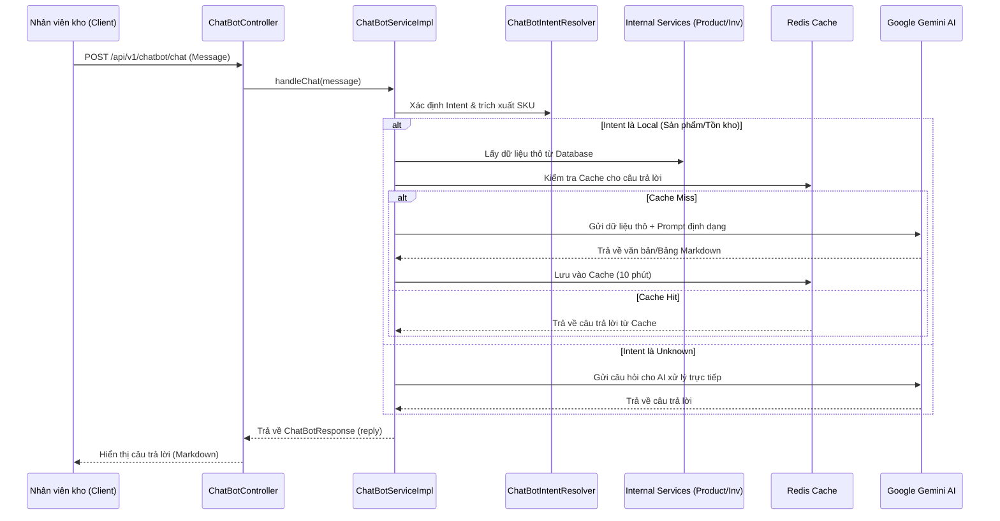

# Tài liệu Hệ thống Chatbot (Gemini AI Integration)

Tài liệu này cung cấp cái nhìn chi tiết về module Chatbot tích hợp trí tuệ nhân tạo (Gemini AI) vào hệ thống quản lý kho (WareHouseSystem-BE).

## 1. Tổng quan hệ thống
Module Chatbot là một trợ lý thông minh (WHS Assistant) được thiết kế để hỗ trợ nhân viên kho tra cứu dữ liệu thời gian thực (Real-time) một cách nhanh chóng thông qua ngôn ngữ tự nhiên. 

Hệ thống kết hợp giữa **Rule-based (Dựa trên quy tắc)** để xử lý các câu hỏi phổ biến và **Generative AI (Gemini 1.5 Flash)** để xử lý các câu hỏi phức tạp hoặc định dạng dữ liệu chuyên nghiệp.

## 2. Cách thức hoạt động (Flow Logic)

Hệ thống hoạt động theo mô hình phân lớp (Multi-layered):

1.  **Chuẩn hóa dữ liệu**: Tin nhắn từ người dùng (có dấu hoặc không dấu) được đưa về dạng chữ thường và không dấu để tăng khả năng nhận diện.
2.  **Phân loại ý định (Intent Recognition)**: 
    *   Hệ thống sử dụng `ChatBotIntentResolver` để kiểm tra xem câu hỏi thuộc loại nào (Chào hỏi, Tìm sản phẩm, Xem tồn kho...).
    *   Nếu nhận diện được SKU (Ví dụ: `SKU-001`), hệ thống sẽ ưu tiên tra cứu trực tiếp.
3.  **Xử lý dữ liệu nội bộ (Local Data)**: 
    *   Nếu là tra cứu sản phẩm/tồn kho, Chatbot sẽ gọi trực tiếp các Service nội bộ (`ProductService`, `InventoryService`) để lấy dữ liệu thô.
4.  **Tích hợp AI (Gemini Integration)**:
    *   Dữ liệu thô từ hệ thống được gửi đến Gemini AI kèm theo Prompt (Chỉ dẫn) để AI định dạng thành bảng Markdown hoặc câu trả lời tự nhiên.
    *   Nếu ý định là "UNKNOWN" (không xác định), Gemini AI sẽ tự trả lời dựa trên kiến thức của nó.
5.  **Tối ưu hóa (Caching & Rate Limit)**:
    *   **Redis Cache**: Lưu câu trả lời trong 10 phút để tiết kiệm chi phí gọi API AI.
    *   **Bucket4j**: Giới hạn 5 tin nhắn/60 giây để tránh spam.

## 3. Biểu đồ luồng (Diagrams)

### 3.1 Luồng xử lý tin nhắn (Sequence Diagram)

## 4. Danh sách các File đã tạo

| Lớp (Layer) | Tên File | Chức năng chính |
|:--- |:--- |:--- |
| **Controller** | `ChatBotController.java` | Tiếp nhận Request, áp dụng Rate Limit. |
| **Service** | `ChatBotService.java` | Định nghĩa Interface cho chatbot. |
| **Service** | `ChatBotServiceImpl.java` | Luồng logic chính, điều phối gọi AI và Service nội bộ. |
| **Service** | `ChatBotIntentResolver.java` | Phân tích ý định, trích xuất từ khóa, chuẩn hóa tiếng Việt. |
| **Service** | `ChatBotResponseFormatter.java` | Định dạng các câu trả lời mặc định của hệ thống. |
| **DTOs** | `ChatBotRequest/Response.java` | Cấu trúc dữ liệu trao đổi với Client. |
| **DTOs** | `GeminiRequest/Response.java` | Cấu trúc dữ liệu trao đổi với Gemini API. |
| **Enums/Records**| `ChatBotIntent.java`, `ChatBotCommand.java` | Định nghĩa các loại ý định và dữ liệu lệnh. |

## 5. Những câu hỏi mẫu có thể hỏi

Chatbot hỗ trợ cả tiếng Việt có dấu và không dấu.

### 5.1 Về Sản phẩm (Product)
*   "Tìm cho tôi sản phẩm TV Samsung"
*   "Thông tin về mã SKU-001"
*   "Sản phẩm điện tử nào đang có trong kho?"
*   "Giá của SKU-123 là bao nhiêu?"

### 5.2 Về Tồn kho (Inventory)
*   "Tồn kho của SKU-001 là bao nhiêu?"
*   "Mã SKU-001 còn bao nhiêu hàng khả dụng?"
*   "Kiểm tra số lượng tồn của sản phẩm máy giặt"
*   "Sản phẩm SKU-002 nằm ở kho nào và vị trí nào?"

### 5.3 Về Lô hàng & Hạn sử dụng (Batch/Expiry)
*   "Có lô hàng nào sắp hết hạn không?"
*   "Danh sách các batch hết hạn trong 30 ngày tới"
*   "Mã SKU-005 có lô nào sắp hết hạn không?"

### 5.4 Câu hỏi nghiệp vụ chung (AI Support)
*   "Làm thế nào để nhập kho một lô hàng mới?"
*   "Tại sao tồn kho khả dụng lại thấp hơn tồn kho thực tế?"
*   "Hướng dẫn tôi cách kiểm kê kho định kỳ"

---
*Tài liệu được cập nhật ngày 01/04/2026 bởi Gemini CLI.*
