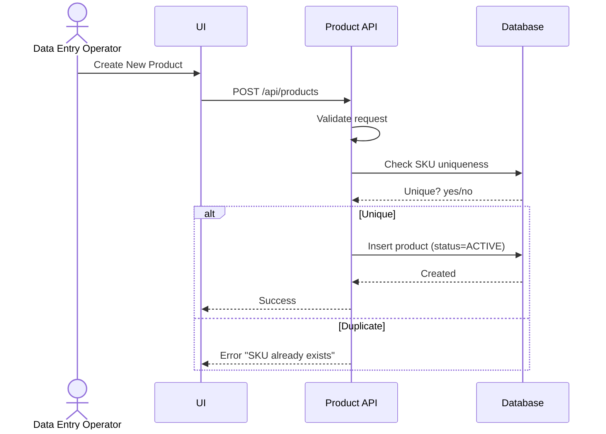
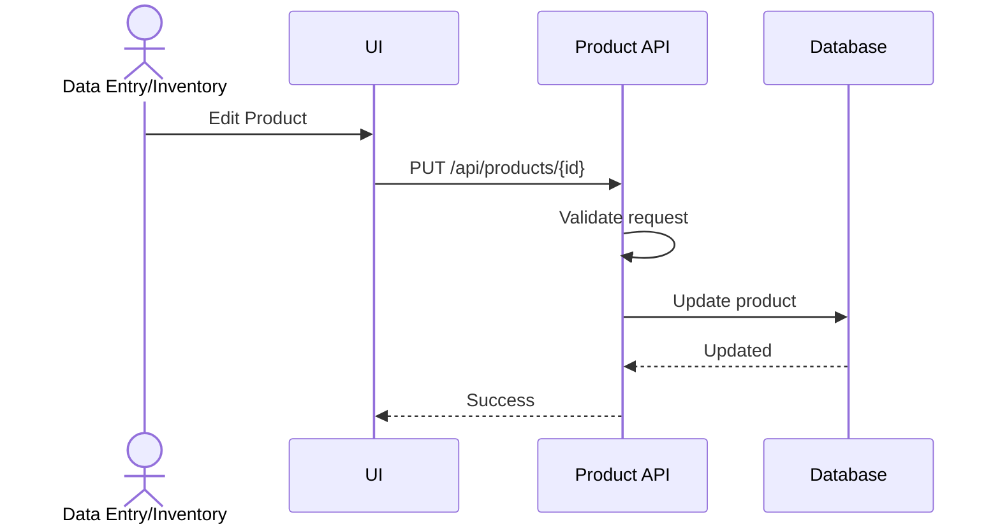
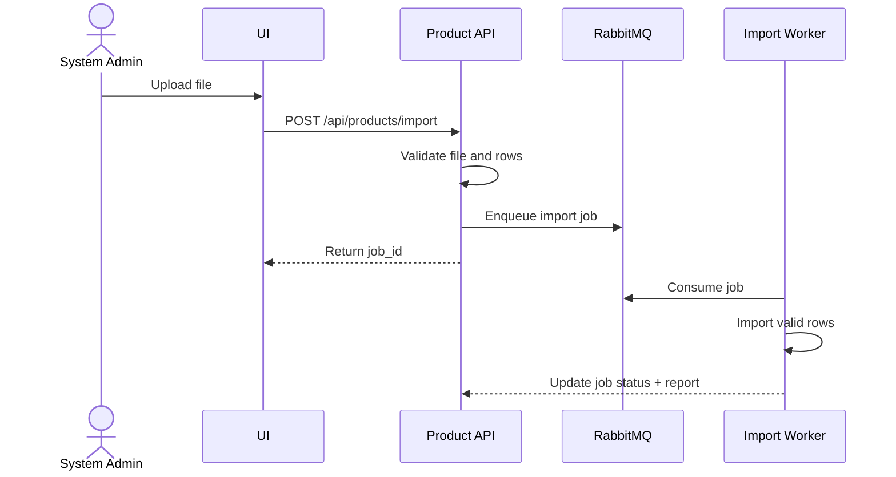
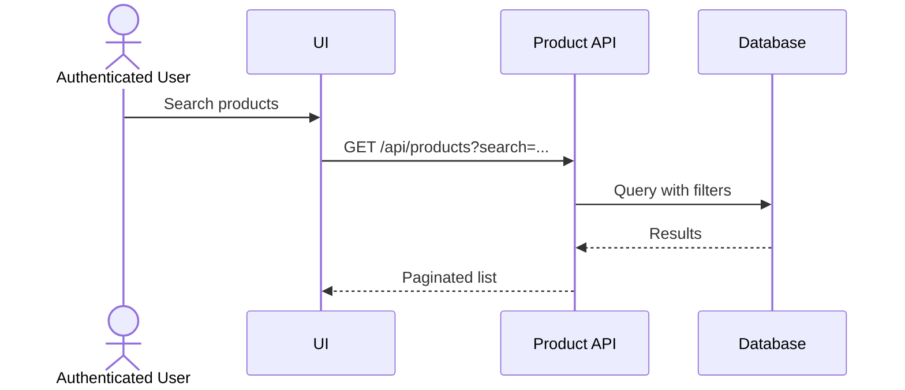

# Feature 3: Product Management
## Business Requirements Specification

---

## Document Information

| Property | Value |
|----------|-------|
| Module | Master Data Management |
| Feature | Feature 3: Product Management |
| Version | 1.0 |
| Date | January 29, 2026 |
| Status | Draft |
| Author | Business Analyst |

---

## Step 1 - Clarify Context

### Actors
- Data Entry Operator
- Inventory Controller
- Warehouse Manager (read-only)
- System Admin

### Goals
- Create and maintain product master data with strong validation.
- Support batch/expiry tracking for regulated or perishable goods.
- Enable bulk import/export for large catalogs.

### Triggers
- New product onboarding.
- Catalog updates or price adjustments.
- Regulatory or quality changes (batch tracking).

### Pain Points
- Duplicate SKU and inconsistent naming.
- Missing UOM or invalid dimensions.
- Manual entry for large product lists.

---

## Step 2 - User Stories

- As a Data Entry Operator, I want to create new product records with complete information, so that products can be tracked in inventory.
- As an Inventory Controller, I want to set minimum and maximum stock levels, so that the system can alert me when stock is low.
- As a System Admin, I want to import products in bulk from Excel, so that I can quickly onboard hundreds of products.
- As a Warehouse Manager, I want to enable batch tracking for products with expiry dates, so that I can manage FIFO/FEFO properly.
- As a Data Entry Operator, I want to search products by SKU, name, or category, so that I can quickly find and update product information.

---

## Step 3 - Use Case Specifications

### UC-MD-06 - Create Product

**Brief Description**: Create a new product with required identifiers and UOM.

**Primary Actor**: Data Entry Operator

**Pre-conditions**:
- User has CREATE_PRODUCT permission.
- At least one UOM exists.

**Post-conditions**:
- Product created with status ACTIVE.
- Audit fields recorded.

**Main Flow**:
1. User opens Product Management.
2. User clicks "Create New Product".
3. System shows creation form.
4. User enters product data:
   - sku (unique, 1-50)
   - name (required, max 200)
   - description (optional)
   - category (optional, max 50)
   - uom (required)
   - weight (optional, > 0)
   - dimensions (optional, format LxWxH in CM)
   - min_stock_level (optional, >= 0)
   - max_stock_level (optional, >= min)
   - reorder_point (optional, >= min)
   - cost_price (optional, >= 0)
   - selling_price (optional, >= 0)
   - barcode (optional, max 100)
   - image_url (optional)
   - requires_batch_tracking (default false)
5. User clicks Save.
6. System validates fields.
7. System checks SKU uniqueness (case-insensitive).
8. System creates product with status ACTIVE.
9. System logs audit data.
10. System returns success and detail view.

**Alternative Flows**:
- A1: Duplicate SKU
  - System returns error "Product SKU already exists".
- A2: Invalid format (dimensions or negative values)
  - System returns validation errors with guidance.

**Exception Flows**:
- E1: Database error
  - System returns a generic error; no record created.

**Rules & Constraints**:
- SKU is immutable after creation.
- UOM is required and must exist.
- Dimensions must match pattern "LxWxH" in CM if provided.

**Mermaid Diagram**:


---

### UC-MD-07 - Update Product

**Brief Description**: Update product information; SKU cannot change.

**Primary Actor**: Data Entry Operator or Inventory Controller

**Pre-conditions**:
- User has UPDATE_PRODUCT permission.
- Product exists.

**Post-conditions**:
- Product updated with audit fields.

**Main Flow**:
1. User opens product detail.
2. User clicks Edit.
3. System displays update form with existing values.
4. User edits fields (SKU read-only).
5. User clicks Save.
6. System validates changes.
7. System detects critical changes (batch tracking toggle).
8. System updates product.
9. System logs audit data.
10. System returns success.

**Alternative Flows**:
- A1: Enabling batch tracking on product with existing inventory
  - System shows warning and requires acknowledgement.

**Exception Flows**:
- E1: Invalid change (disable batch tracking with batch-tracked inventory)
  - System rejects with explicit error.

**Rules & Constraints**:
- Disabling batch tracking is not allowed if batch inventory exists.
- Status transitions: ACTIVE, INACTIVE, DISCONTINUED.

**Mermaid Diagram**:


---

### UC-MD-08 - Bulk Import Products

**Brief Description**: Import products from Excel/CSV with validation and reporting.

**Primary Actor**: System Admin

**Pre-conditions**:
- User has CREATE_PRODUCT permission.
- File format is XLSX or CSV.

**Post-conditions**:
- Valid rows imported.
- Import report generated.

**Main Flow**:
1. User opens Product Management.
2. User clicks "Import Products".
3. System shows upload dialog and template link.
4. User uploads file.
5. System validates file format.
6. System validates each row (SKU, required fields, UOM exists).
7. System shows summary of valid/invalid rows.
8. User confirms import of valid rows.
9. System creates products for valid rows.
10. System generates import report.
11. System returns success summary.

**Alternative Flows**:
- A1: All rows invalid
  - System rejects and provides error report.
- A2: Partial success
  - System imports valid rows and reports invalid rows.

**Exception Flows**:
- E1: Concurrent SKU creation
  - System marks those rows as failed in report.

**Rules & Constraints**:
- SKU uniqueness enforced across all products.
- UOM must exist; otherwise row is invalid.

**Mermaid Diagram**:


---

### UC-MD-09 - Search and Filter Products

**Brief Description**: Search products by SKU, name, category, and status.

**Primary Actor**: Any authenticated user

**Pre-conditions**:
- User has VIEW_PRODUCT permission.

**Post-conditions**:
- User sees paginated result set.

**Main Flow**:
1. User opens Product List.
2. User applies search text and filters.
3. System queries matching products.
4. System returns paginated results.
5. User can sort by SKU, name, category, created date.

**Mermaid Diagram**:


---

## Step 4 - Acceptance Criteria

**AC-MD-PROD-01 - Create Product**
```gherkin
Given I am a Data Entry Operator
When I create a product with valid SKU, name, and UOM
Then the product is created with status ACTIVE
And SKU is unique
And audit fields are populated
```

**AC-MD-PROD-02 - SKU Validation**
```gherkin
Given I am creating a product
When I enter SKU "PROD-001"
Then SKU accepts alphanumeric characters and hyphens
And length is 1-50 characters
And SKU uniqueness is case-insensitive
```

**AC-MD-PROD-03 - Batch Tracking**
```gherkin
Given I enable batch tracking on a product
When inventory is received
Then batch number, manufacture date, and expiry date are required
```

**AC-MD-PROD-04 - Bulk Import**
```gherkin
Given I upload a file with 100 product rows
When 95 rows are valid
Then 95 products are imported
And a report lists the 5 failed rows with reasons
```

**AC-MD-PROD-05 - Search**
```gherkin
Given products exist with SKU "LAPTOP-001"
When I search "LAPTOP"
Then the system returns matching products
And results are paginated
```

---

## Step 5 - Backend Impact Analysis

### API Impacts
- `GET /api/products`
  - Query params: search, category, status, batch_tracking, page, size, sort
- `GET /api/products/{id}`
- `GET /api/products/sku/{sku}`
- `POST /api/products`
- `PUT /api/products/{id}`
- `PATCH /api/products/{id}/status`
- `POST /api/products/import`
- `GET /api/products/import/template`
- `GET /api/products/export`

### Request Validation Rules
- sku: required, 1-50, unique (case-insensitive)
- name: required, max 200
- uom_id: required, must exist
- weight: positive if provided
- dimensions: "LxWxH" in CM if provided
- min_stock_level: >= 0
- max_stock_level: >= min_stock_level if provided
- reorder_point: >= min_stock_level if provided

### Response Data
- id, sku, name, status, category, uom
- weight, dimensions, batch_tracking
- min_stock_level, max_stock_level, reorder_point
- created_by, created_at, updated_by, updated_at

### Error Codes
- PRODUCT_SKU_DUPLICATE
- PRODUCT_NOT_FOUND
- PRODUCT_BATCH_TRACKING_INVALID
- PRODUCT_IMPORT_FILE_INVALID
- PRODUCT_IMPORT_ROW_INVALID

### Database Impacts
- Table: `products`
- Key columns: sku, name, category, uom_id, status, batch_tracking
- Indexes: idx_sku, idx_status, idx_category, idx_name

### Async / Background Jobs
- Product import: queue `product.import`
- Product export: queue `product.export`
- Low stock alerts: scheduled job every 6 hours

---

## BA Review Checklist

- [x] Actors identified
- [x] Preconditions defined
- [x] Business rules documented
- [x] Validation rules explicit
- [x] Success + alternative + exception flows present
- [x] API and data impacts defined
- [x] Acceptance criteria cover normal and edge cases
