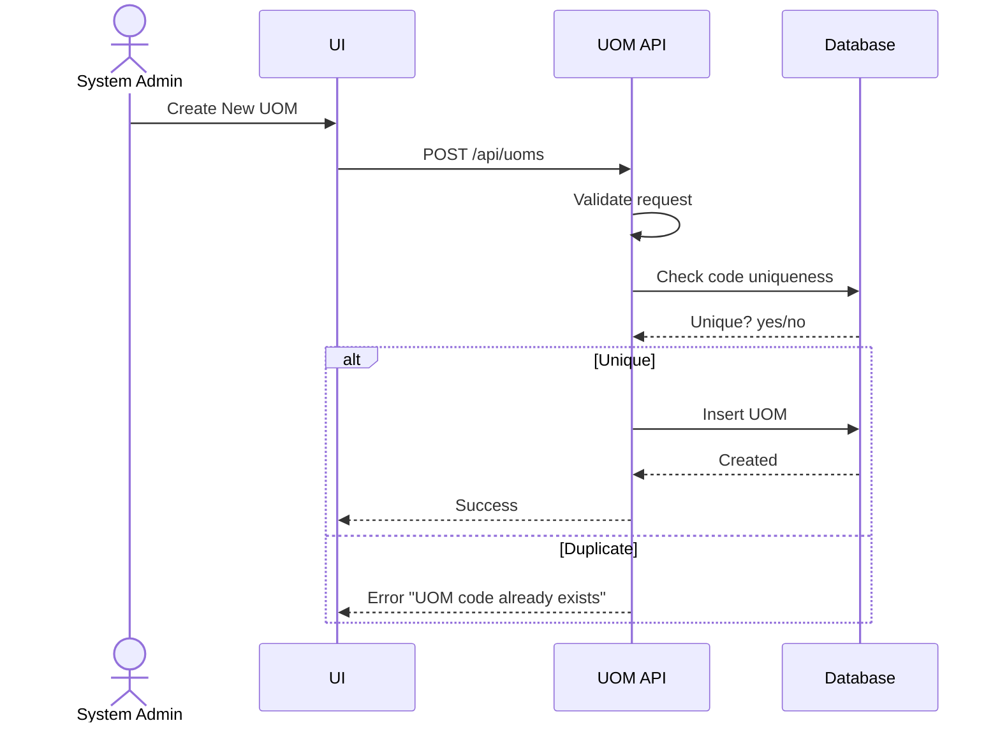
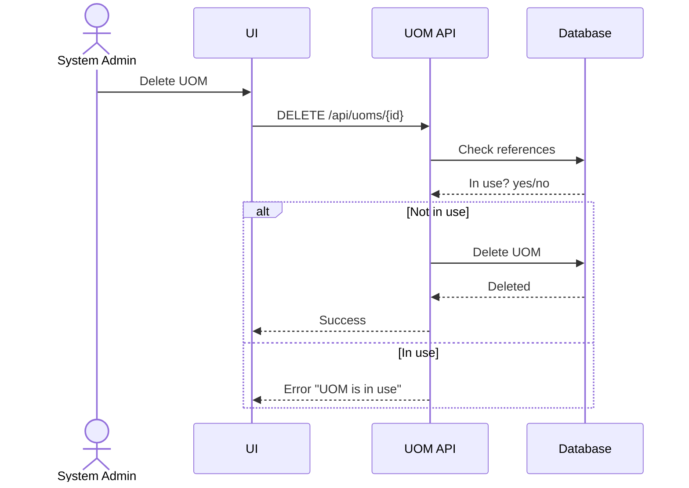

# Feature 4: Unit of Measure (UOM) Management
## Business Requirements Specification

---

## Document Information

| Property | Value |
|----------|-------|
| Module | Master Data Management |
| Feature | Feature 4: Unit of Measure (UOM) Management |
| Version | 1.0 |
| Date | January 29, 2026 |
| Status | Draft |
| Author | Business Analyst |

---

## Step 1 - Clarify Context

### Actors
- System Admin
- Data Entry Operator (read-only)

### Goals
- Maintain a standard set of UOMs for product creation and reporting.
- Prevent deletion of UOMs that are in use.

### Triggers
- New unit requirement for a product category.
- Standardization across warehouses and departments.

### Pain Points
- Inconsistent UOM codes across teams.
- UOM deletion breaking product references.

---

## Step 2 - User Stories

- As a System Admin, I want to define standard units of measure, so that products are measured consistently.
- As a Data Entry Operator, I want to view all UOMs when creating products, so that I select the correct unit.

---

## Step 3 - Use Case Specifications

### UC-MD-10 - Create Unit of Measure

**Brief Description**: Create a new UOM with a unique code.

**Primary Actor**: System Admin

**Pre-conditions**:
- User has CREATE_UOM permission.

**Post-conditions**:
- UOM is created and available in product forms.

**Main Flow**:
1. User opens UOM Management.
2. User clicks "Create New UOM".
3. System displays form.
4. User enters:
   - code (unique, max 10, stored uppercase)
   - name (required, max 50)
   - description (optional, max 255)
5. User clicks Save.
6. System validates fields.
7. System checks code uniqueness.
8. System creates UOM.
9. System returns success.

**Alternative Flows**:
- A1: Duplicate code
  - System returns error "UOM code already exists".

**Exception Flows**:
- E1: Database error
  - System returns a generic error; no record created.

**Rules & Constraints**:
- Code is stored uppercase.
- Code is immutable after creation.

**Mermaid Diagram**:


---

### UC-MD-11 - Delete Unit of Measure (Soft Prevention)

**Brief Description**: Prevent deletion if UOM is used by products.

**Primary Actor**: System Admin

**Pre-conditions**:
- User has DELETE_UOM permission.
- UOM exists.

**Post-conditions**:
- UOM deleted only if unused; otherwise rejected.

**Main Flow**:
1. User selects UOM and clicks Delete.
2. System checks if UOM is referenced by products.
3. If not referenced, system deletes the UOM.
4. System returns success.

**Alternative Flows**:
- A1: UOM is in use
  - System blocks deletion and returns error "UOM is in use".

**Rules & Constraints**:
- Hard delete allowed only if UOM not referenced.

**Mermaid Diagram**:


---

## Step 4 - Acceptance Criteria

**AC-MD-UOM-01 - Create UOM**
```gherkin
Given I am a System Admin
When I create a UOM with code "PCS" and name "Pieces"
Then the UOM is created successfully
And code is unique
And code is stored in uppercase
```

**AC-MD-UOM-02 - Prevent Deletion**
```gherkin
Given a UOM is used by existing products
When I try to delete the UOM
Then the system rejects the request with error "UOM is in use"
```

**AC-MD-UOM-03 - List UOMs**
```gherkin
Given I am creating a product
When I open the UOM dropdown
Then all active UOMs are listed
```

---

## Step 5 - Backend Impact Analysis

### API Impacts
- `GET /api/uoms`
- `GET /api/uoms/{id}`
- `POST /api/uoms`
- `PUT /api/uoms/{id}`
- `DELETE /api/uoms/{id}`

### Request Validation Rules
- code: required, max 10, unique, stored uppercase
- name: required, max 50

### Response Data
- id, code, name, description
- created_by, created_at, updated_by, updated_at

### Error Codes
- UOM_CODE_DUPLICATE
- UOM_NOT_FOUND
- UOM_IN_USE

### Database Impacts
- Table: `units_of_measure`
- Constraints: unique code
- Indexes: idx_code

### Async / Background Jobs
- None required for this feature.

---

## BA Review Checklist

- [x] Actors identified
- [x] Preconditions defined
- [x] Business rules documented
- [x] Validation rules explicit
- [x] Success + alternative + exception flows present
- [x] API and data impacts defined
- [x] Acceptance criteria cover normal and edge cases
